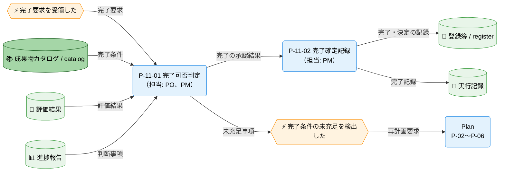
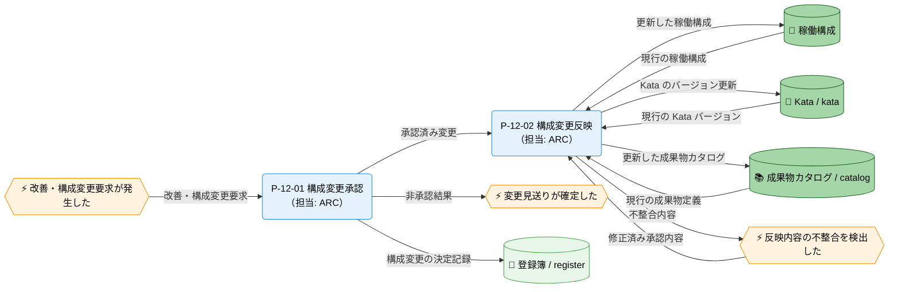
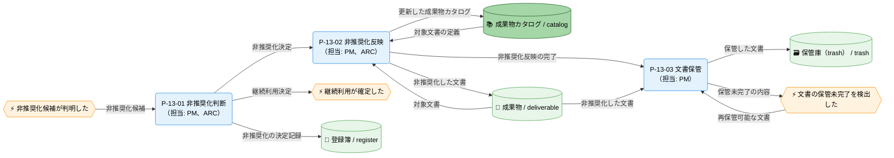

---
specdojo:
  id: cdfd-action
  type: flow
  status: draft
  rulebook: specdojo:cdfd-rulebook
  based_on:
    - cdfd-overview
---

# 概念データフロー図（Action）

## 1. 目的

[[cdfd-overview|概念データフロー図（全体概要）]] の Action グループを詳細化し、タスク完了、稼働構成管理、非推奨化保管の内部プロセス、判断境界、主要例外、データストアの読み書きを合意できるようにする。

- PO と PM は、評価結果と完了条件に基づくタスクの完了確定、および未充足時の再計画要求を確認する。
- ARC は、稼働構成の変更承認と、稼働構成・Kata・成果物カタログへの反映境界を確認する。
- PM と ARC は、文書を継続利用しない判断、非推奨化、保管の責任境界を確認する。
- BA は、三つの領域の入力、出力、判断、例外が利用者にとって識別可能であることを確認し、後続の設計と受入確認へ引き渡す。

これにより、重要な判断と更新結果を共有可能な正本へ残し、担当者が交代しても完了・改善・保管の経緯を引き継げるようにする。

## 2. 適用範囲

- 対象グループは Action、対象領域はタスク完了（P-11）、稼働構成管理（P-12）、非推奨化保管（P-13）である。
- 開始は、完了・改善要求、稼働構成の変更要求、または文書を新 ID へ引き継ぐか継続利用しない候補の判明である。
- 終了は、タスクの完了記録または再計画要求、承認結果と承認済み構成変更の反映、非推奨化判断と必要な文書保管が、それぞれ記録された時点である。三領域は同一グループに属するが、互いの完了を必須の起動条件としない。
- 組織境界は PO、PM、ARC、BA を含むプロジェクト参加者、システム境界は SpecDojo が管理する本章記載のデータストアまでとする。承認、完了判断、構成変更の承認、非推奨化の判断は人間が担い、AI Agent は記録、提案、実行、検証を支援できる。この責任分担は [[cdfd-overview|概念データフロー図（全体概要）]] の「適用範囲」を正とする。
- 対象外は、状態を変更しない一覧・検索・検証などの補助操作、コマンド・ファイル単位の実装詳細、Plan と他グループの内部処理、複数グループを横断する順序である。Plan への委譲境界は「主要例外とグループ外への委譲」に示す。
- 状態名・意味・成立条件・遷移元・遷移先・イベント・遷移条件は STSD を正本とし、本書では状態を変えるプロセスからの参照だけを扱う。

## 3. プロセス領域

Action グループは、全体概要で定義された三つの領域を扱う。領域 ID と名称、およびグループ単位の主要入力・主要出力・データストアは全体概要を正本とし、本章では領域内の責務へ配分する。

### 3.1. タスク完了（P-11）

評価結果、進捗報告の判断事項、完了条件を照合し、人間が完了可否を判断する。完了できる場合は決定と完了を記録し、完了できない場合は未充足事項を再計画要求として Plan へ渡す。

- **主要入力**: Orchestrator からの完了要求、評価結果、進捗報告の判断事項、完了条件
- **主要出力**: 完了・決定の記録、完了記録、再計画要求
- **データストア**: 成果物カタログ / catalog、登録簿 / register、実行記録、評価結果、進捗報告

| プロセス ID | プロセス     | 業務目的                                                               | 主な担当 | 起動条件                                                        | 必須性                                                                           |
| ----------- | ------------ | ---------------------------------------------------------------------- | -------- | --------------------------------------------------------------- | -------------------------------------------------------------------------------- |
| `P-11-01`   | 完了可否判定 | 完了条件と評価・報告結果を人間が照合し、完了可否を確定できるようにする | PO、PM   | Orchestrator から完了要求があり、評価結果と完了条件を照合できる | 必須                                                                             |
| `P-11-02`   | 完了確定記録 | 完了の決定と完了記録を正本へ残し、後続が完了を確認できるようにする     | PM       | P-11-01 で人間が完了可能と判断した                              | 条件付き。完了不可の場合は起動せず、再計画要求を委譲してタスク完了領域を終了する |

### 3.2. 稼働構成管理（P-12）

稼働構成の変更要求について人間が採否を判断し、承認した変更だけを稼働構成へ反映する。変更が Kata のバージョンまたは成果物定義へ及ぶ場合は、対応する正本も同じ承認結果に基づいて更新する。

- **主要入力**: Orchestrator からの改善要求、参加者からの構成変更要求
- **主要出力**: 構成変更の決定記録、更新した稼働構成、Kata のバージョン更新、更新した成果物カタログ
- **データストア**: 稼働構成、Kata / kata、成果物カタログ / catalog、登録簿 / register

| プロセス ID | プロセス     | 業務目的                                                                     | 主な担当 | 起動条件                                                     | 必須性                                                                                     |
| ----------- | ------------ | ---------------------------------------------------------------------------- | -------- | ------------------------------------------------------------ | ------------------------------------------------------------------------------------------ |
| `P-12-01`   | 構成変更承認 | 変更の必要性と影響を人間が判断し、反映してよい変更範囲を確定できるようにする | ARC      | 稼働構成の変更要求が発生し、判断に必要な変更内容が提示された | 必須                                                                                       |
| `P-12-02`   | 構成変更反映 | 承認済みの変更を関係する正本へ整合して反映し、利用可能な構成を維持する       | ARC      | P-12-01 で人間が変更を承認した                               | 条件付き。非承認の場合は起動せず、決定を記録して現行の稼働構成を維持したまま領域を終了する |

### 3.3. 非推奨化保管（P-13）

新 ID への引き継ぎまたは継続利用の終了が候補となった文書について、人間が非推奨化の要否を判断する。非推奨化すると判断した文書は成果物カタログとの対応を保って非推奨化し、誤参照を防ぐ保管庫へ移す。

- **主要入力**: 参加者からの非推奨化候補と判断に必要な情報
- **主要出力**: 非推奨化の決定記録、更新した成果物カタログ、非推奨化した文書、保管した文書
- **データストア**: 成果物カタログ / catalog、登録簿 / register、成果物 / deliverable、保管庫（trash） / trash

| プロセス ID | プロセス     | 業務目的                                                               | 主な担当 | 起動条件                                                                 | 必須性                                                                                         |
| ----------- | ------------ | ---------------------------------------------------------------------- | -------- | ------------------------------------------------------------------------ | ---------------------------------------------------------------------------------------------- |
| `P-13-01`   | 非推奨化判断 | 文書の継続利用または非推奨化を人間が判断し、扱いを確定できるようにする | PM、ARC  | 文書が新 ID へ引き継がれた、または継続利用しない候補であることが判明した | 必須                                                                                           |
| `P-13-02`   | 非推奨化反映 | 非推奨化の決定を文書と成果物カタログへ反映し、誤参照を防げるようにする | PM、ARC  | P-13-01 で人間が非推奨化すると判断した                                   | 条件付き。継続利用する判断の場合は起動せず、決定を記録して対象文書を維持したまま領域を終了する |
| `P-13-03`   | 文書保管     | 非推奨化した文書を保管庫へ移し、現行文書と区別して保管できるようにする | PM       | P-13-02 で文書と成果物カタログへの非推奨化反映が完了した                 | 条件付き。非推奨化しない場合は起動せず、P-13-02 が完了するまでは保管を開始しない               |

## 4. データストア

### 4.1. マスタ・構成データ

| データストア             | 読み書き   | 本グループでの利用                                                                        |
| ------------------------ | ---------- | ----------------------------------------------------------------------------------------- |
| 稼働構成                 | 参照・更新 | P-12 で現行構成を参照し、承認済みの構成変更を反映する                                     |
| Kata / kata              | 参照・更新 | P-12 で現行バージョンを参照し、承認済み変更が Kata に及ぶ場合にバージョン更新を反映する   |
| 成果物カタログ / catalog | 参照・更新 | P-11 で完了条件を参照し、P-12 で承認済みの成果物定義変更、P-13 で文書の非推奨化を反映する |

### 4.2. トランザクションデータ

| データストア            | 読み書き   | 本グループでの利用                                                                      |
| ----------------------- | ---------- | --------------------------------------------------------------------------------------- |
| 登録簿 / register       | 更新       | P-11 の完了判断、P-12 の構成変更承認、P-13 の非推奨化判断を、完了・決定の記録として残す |
| 実行記録                | 更新       | P-11 で人間が確定したタスクの完了記録を残す                                             |
| 成果物 / deliverable    | 参照・更新 | P-13 で対象文書を参照し、非推奨化の決定を反映する                                       |
| 保管庫（trash） / trash | 更新       | P-13 で非推奨化した文書を受け取り、現行文書との誤参照を防いで保管する                   |
| 評価結果                | 参照       | P-11 でタスクの完了可否を判断する根拠として参照する                                     |
| 進捗報告                | 参照       | P-11 で完了判断または再計画に影響する判断事項を参照する                                 |

## 5. 概念データフロー

### 5.1. タスク完了（P-11）

凡例は [[cdfd-overview|概念データフロー図（全体概要）]] の「凡例（本プロダクト共通）」に従う。`-->` は情報の流れであり、本図は物の流れを対象外とする。Plan はグループ外委譲先の代表ノードであり、内部処理を省略する。参加者は領域の担当であるため外部主体として描かない。本図は P-11 の入力、出力、判断分岐に限定し、他領域のデータストアを省略する。別図と共有するノードはない。

### 5.2. 稼働構成管理（P-12）

凡例は [[cdfd-overview|概念データフロー図（全体概要）]] の「凡例（本プロダクト共通）」に従う。`-->` は情報の流れであり、本図は物の流れを対象外とする。参加者は領域の担当であるため外部主体として描かない。Kata と成果物カタログへの更新は、承認済み変更が各正本へ及ぶ場合だけ発生し、非承認時は変更見送りとして正常終了する。本図は P-12 の入力、出力、判断分岐に限定し、他領域のデータストアを省略する。別図と共有するノードはない。

### 5.3. 非推奨化保管（P-13）

凡例は [[cdfd-overview|概念データフロー図（全体概要）]] の「凡例（本プロダクト共通）」に従う。`-->` は情報の流れであり、本図は物の流れを対象外とする。保管庫（trash）は文書という情報成果物の保管先として円柱で示す。参加者は領域の担当であるため外部主体として描かない。継続利用の判断では非推奨化反映と文書保管を起動しない。本図は P-13 の入力、出力、判断分岐に限定し、他領域のデータストアを省略する。別図と共有するノードはない。

## 6. 個別プロセス主要入出力

### 6.1. タスク完了（P-11）

| プロセス ID | プロセス     | 主要入力                                         | 主要出力                                   | データストア                                 |
| ----------- | ------------ | ------------------------------------------------ | ------------------------------------------ | -------------------------------------------- |
| `P-11-01`   | 完了可否判定 | 完了要求、評価結果、進捗報告の判断事項、完了条件 | 完了の承認結果、または完了条件の未充足事項 | 成果物カタログ / catalog、評価結果、進捗報告 |
| `P-11-02`   | 完了確定記録 | 人間が確定した完了の承認結果                     | 完了・決定の記録、完了記録                 | 登録簿 / register、実行記録                  |

### 6.2. 稼働構成管理（P-12）

| プロセス ID | プロセス     | 主要入力                                                               | 主要出力                                                        | データストア                                    |
| ----------- | ------------ | ---------------------------------------------------------------------- | --------------------------------------------------------------- | ----------------------------------------------- |
| `P-12-01`   | 構成変更承認 | 改善要求、構成変更要求                                                 | 人間が確定した承認結果、構成変更の決定記録                      | 登録簿 / register                               |
| `P-12-02`   | 構成変更反映 | 承認済み変更、現行の稼働構成、現行の Kata バージョン、現行の成果物定義 | 更新した稼働構成、Kata のバージョン更新、更新した成果物カタログ | 稼働構成、Kata / kata、成果物カタログ / catalog |

### 6.3. 非推奨化保管（P-13）

| プロセス ID | プロセス     | 主要入力                               | 主要出力                                             | データストア                                   |
| ----------- | ------------ | -------------------------------------- | ---------------------------------------------------- | ---------------------------------------------- |
| `P-13-01`   | 非推奨化判断 | 非推奨化候補と判断に必要な情報         | 人間が確定した非推奨化または継続利用の決定、決定記録 | 登録簿 / register                              |
| `P-13-02`   | 非推奨化反映 | 非推奨化決定、対象文書、対象文書の定義 | 非推奨化した文書、更新した成果物カタログ             | 成果物 / deliverable、成果物カタログ / catalog |
| `P-13-03`   | 文書保管     | 非推奨化した文書                       | 保管した文書                                         | 成果物 / deliverable、保管庫（trash） / trash  |

## 7. 状態遷移の参照

状態の名称、意味、成立条件、遷移元・遷移先・イベント・遷移条件は本書で定義しない。状態を変えるプロセスと、状態一覧・状態遷移図を統合した STSD の対応だけを示す。

| 対象   | 状態を変えるプロセス   | ステータス定義（STSD） |
| ------ | ---------------------- | ---------------------- |
| タスク | `P-11-02` 完了確定記録 | `stsd-task-execution`  |
| 文書   | `P-13-02` 非推奨化反映 | `stsd-deliverable`     |

## 8. 主要例外とグループ外への委譲

### 8.1. 主要例外

| 例外 ID   | 対象プロセス | 検出条件                                                                             | 本グループでの扱い                                                                 | 継続・再開条件                                                                                        |
| --------- | ------------ | ------------------------------------------------------------------------------------ | ---------------------------------------------------------------------------------- | ----------------------------------------------------------------------------------------------------- |
| `E-11-01` | `P-11-01`    | 評価結果、進捗報告の判断事項、完了条件の照合により未充足事項が特定された             | P-11-02 を起動せず、未充足事項を再計画要求として Plan へ委譲する                   | 再計画後の対応と評価が完了し、完了条件を再び照合できる完了要求が発行された時点で P-11-01 から再開する |
| `E-12-01` | `P-12-02`    | 承認済み変更を稼働構成と、対象となる Kata または成果物カタログへ整合して反映できない | 構成変更の完了を確定せず、不整合の対象と承認内容を対応付けて修正対象とする         | 承認範囲内で不整合を解消した変更内容を用意できた時点で P-12-02 から再開する                           |
| `E-13-01` | `P-13-03`    | 非推奨化した文書を保管庫（trash）へ保管したことを確認できない                        | 保管完了として扱わず、非推奨化した文書と未完了の内容を対応付けて再保管の対象とする | 非推奨化した文書を再保管できる状態になった時点で P-13-03 から再開する                                 |

### 8.2. グループ外への委譲

| 委譲先      | 委譲する事項                         | 引き渡す情報                     | 本グループへ戻す条件                                                             |
| ----------- | ------------------------------------ | -------------------------------- | -------------------------------------------------------------------------------- |
| `cdfd-plan` | タスク完了に至らなかった事項の再計画 | 完了条件の未充足事項、再計画要求 | 再計画に基づく対応と評価を経て、完了条件を照合できる評価結果と完了要求がそろった |
