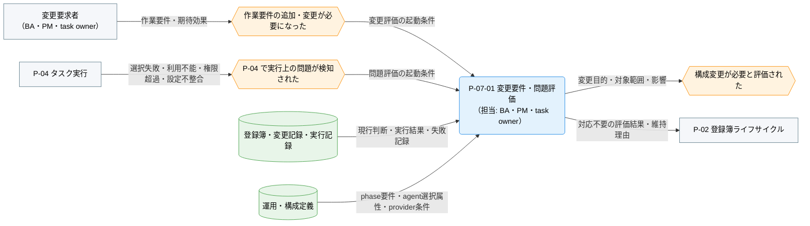
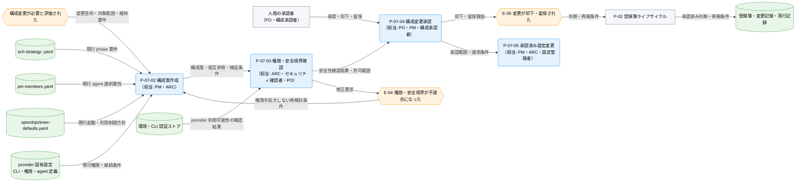
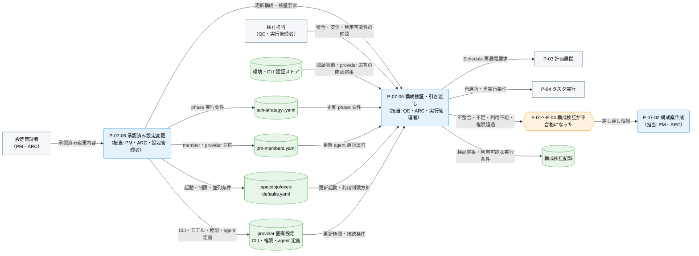

---
specdojo:
  id: prj-0001:cdfd-agent-config-operation
  type: flow
  status: draft
  rulebook: specdojo:cdfd-rulebook
  based_on:
    - prj-0001:cdfd-task-execution
    - prj-0001:cdfd-overview
  supersedes: []
---

# 概念データフロー図（agent・provider 構成の運用変更）: SpecDojo

本書は、[[prj-0001:cdfd-overview|概念データフロー図（全体概要）]] が定める `P-07 構成変更` の境界と、[[prj-0001:cdfd-task-execution|概念データフロー図（タスク実行ライフサイクル）]] から引き渡される選択失敗、provider 利用不能、必要能力、権限超過を引き継ぐ。作業要件または実行上の問題に基づく agent・provider・phase 構成の変更を、人間が安全性と影響を承認し、検証済みの後続実行条件として計画展開とタスク実行へ戻す概念仕様である。

## 1. 目的

- BA と PM は、作業要件または実行上の問題から変更の要否を判断し、構成案作成から検証済み条件の引き渡しまでの利用場面を合意する。
- ARC は構成正本の変更責務と相互参照を後続設計へ使い、PO は agent・provider の権限、認証分離、プロンプトインジェクション対策と人間承認の境界を判断する。
- QE は capability 不足、provider 利用不能、設定不整合、権限超過を検出した場合の停止範囲、差し戻し先、再開条件を検証する。

## 2. 適用範囲

- 対象は、作業要件の追加・変更、または capability 不足、provider 利用不能、設定不整合、権限超過などの実行上の問題を受けて変更要否を評価してから、必要な場合に構成を承認・変更・検証し、再計画・再実行条件を引き渡すまでである。
- `sch-strategy-<track>.yaml` を phase の実行要件、`pm-members.yaml` を実行主体と選択属性、`.specdojo/exec-defaults.yaml` を provider 共通の起動・利用制限対応、provider 固有設定を CLI・モデル・権限・agent 定義の正本として扱う。認証情報はこれらの設定文書から分離し、環境または各 CLI の認証ストアから注入する。
- 個別 provider の設定値、認証操作、CLI の更新手順、モデル評価、タスク内部の実行・復旧は対象外とする。一覧、接続確認、構文検査、dry-run は構成評価・安全境界確認・構成検証を支える補助操作として扱い、独立プロセスにはしない。
- 初回セットアップは `P-01 初期セットアップ`、変更要求の継続管理は `P-02 登録簿ライフサイクル`、再計画は `P-03 計画展開`、task の再選択・再実行は `P-04 タスク実行` に委譲する。
- 構成変更は技術や provider の追加自体を目的にせず、作業要件、当事者価値、総費用、参加負荷、継続可能性に照らして必要性を判断する。人間と AI Agent の責任分担は [[prj-0001:prj-overview|プロジェクト概要]] に従い、権限拡大、認証情報の取扱い、外部送信、変更適用の最終判断は人間が担う。

## 3. 領域内プロセス一覧

<!-- prettier-ignore -->
| プロセス ID | プロセス | 業務目的 | 主な担当 | 起動条件 | 必須性 |
| --- | --- | --- | --- | --- | --- |
| `P-07-01` | 変更要件・問題評価 | 構成変更で解くべき作業要件または実行問題と、影響する task・構成・運用負荷を明確にする。 | BA、PM、task owner | 新しい作業要件が承認対象になった、または `P-04` から選択失敗・利用不能・権限超過・設定不整合が報告された | 必須 |
| `P-07-02` | 構成案作成 | phase 要件、agent 選択属性、provider 実行条件の責務を混在させず、比較可能な変更案にする。 | PM、ARC | 評価で構成変更が必要と判定され、変更目的・対象範囲・維持要件が確定した | 条件付き。対応不要なら起動せず、評価結果を登録簿ライフサイクルへ渡して現行構成を維持する |
| `P-07-03` | 権限・安全境界確認 | 必要能力を満たしつつ、認証情報、書込範囲、外部通信、人間専用判断を必要最小限の境界に保つ。 | ARC、セキュリティ確認者、PO | 構成変更案と検証条件が作成された | 条件付き。構成案を作成しない場合は起動しない |
| `P-07-04` | 構成変更承認 | 変更目的、効果、費用、権限、安全性、差し戻し条件を確認し、適用可否を人間が決定する。 | PO、PM、構成承認者 | 安全性確認が合格し、影響と代替案を比較できる | 条件付き。安全性確認が不合格なら起動せず、構成案作成へ差し戻す |
| `P-07-05` | 承認済み設定変更 | 承認範囲内で phase、member、provider の正本を更新し、検証可能な一組の構成にする。 | PM、ARC、設定管理者 | 変更が承認され、適用対象、担当、差し戻し条件が確定した | 条件付き。却下・留保時は起動せず、現行の承認済み構成を維持する |
| `P-07-06` | 構成検証・引き渡し | 更新構成の整合性、安全境界、agent 選択可能性、provider 利用可能性を確認し、後続が再計画・再実行できる状態にする。 | QE、ARC、実行管理者 | 承認済み設定変更が完了した | 条件付き。設定変更を適用しない場合は起動しない |

## 4. 概念データフロー

変更要求・実行問題を必ず評価するプロセス、変更が必要な場合に構成案を作成・承認するプロセス、承認後に設定を適用・検証するプロセスでは起動条件と参加者が異なるため、フローを三図に分ける。

### 4.1. 必須プロセスのフロー

凡例: ノード形状・色・絵文字は [[prj-0001:cdfd-overview|概念データフロー図（全体概要）]] の「凡例（本プロダクト共通）」に従い、`-->` は情報の流れを表す。`P-02` と `P-04` は委譲先の代表ノードであり、内部処理は対象外とする。本図は現物の流れを扱わない。構成変更が必要な場合は `構成変更が必要と評価された` イベントを 4.2 の起点として引き渡す。

### 4.2. 構成案作成・承認のフロー（P-07-02〜P-07-04）

凡例: ノード形状・色・絵文字は [[prj-0001:cdfd-overview|概念データフロー図（全体概要）]] の「凡例（本プロダクト共通）」に従い、`-->` は情報の流れを表す。4.1 と同名の `構成変更が必要と評価された` イベントは同一の引き渡しを示す。`P-02` は委譲先の代表ノードであり、内部処理は対象外とする。`承認済み設定変更` は設定変更・検証のフロー（4.3）と同一のプロセスを指し、その内部の入出力は 4.3 を参照する。本図は現物の流れを扱わず、未承認の構成を後続実行へ渡さない。

### 4.3. 設定変更・検証のフロー（P-07-05・P-07-06）

凡例: ノード形状・色・絵文字は [[prj-0001:cdfd-overview|概念データフロー図（全体概要）]] の「凡例（本プロダクト共通）」に従い、`-->` は情報の流れを表す。`承認済み設定変更` は構成案作成・承認のフロー（4.2）と同一のプロセスを指し、承認範囲・適用条件の引き渡しは 4.2 を参照する。`構成案作成` は差し戻し先として 4.2 と同一のプロセスを指す。`P-03`、`P-04` は委譲先の代表ノードであり、内部処理は対象外とする。本図は現物の流れを扱わず、未検証の構成を後続実行へ渡さない。

## 5. 個別プロセス主要入出力

### 5.1. 必須の変更評価（`P-07-01`）

構成を変える前に、作業要件または実行問題と現行構成を照合し、変更の要否と影響範囲を確定する。

<!-- prettier-ignore -->
| プロセス ID | プロセス | 主要入力 | 主要出力 | データストア |
| --- | --- | --- | --- | --- |
| `P-07-01` | 変更要件・問題評価 | 作業要件、実行結果・失敗記録、現行構成、影響 task、費用・参加負荷 | 変更目的、対象範囲、維持する要件、影響・リスク、対応要否 | 登録簿・変更記録、実行記録、運用・構成定義 |

### 5.2. 構成案作成・承認（`P-07-02`〜`P-07-04`）

変更が必要と評価された場合だけ、案作成、安全境界確認、人間承認を順に行う。

<!-- prettier-ignore -->
| プロセス ID | プロセス | 主要入力 | 主要出力 | データストア |
| --- | --- | --- | --- | --- |
| `P-07-02` | 構成案作成 | 評価結果、現行の `sch-strategy-<track>.yaml`・`pm-members.yaml`・`.specdojo/exec-defaults.yaml`・provider 固有設定 | 構成変更案、正本間の相互参照、移行・差し戻し案、検証条件 | 構成変更案、運用・構成定義 |
| `P-07-03` | 権限・安全境界確認 | 構成変更案、task の mode・targets・capability、provider 権限、認証注入方式、プロンプトインジェクション対策 | 安全性確認結果、許可範囲、禁止事項、修正要求 | 構成変更案、権限方針、provider 固有設定 |
| `P-07-04` | 構成変更承認 | 構成変更案、安全性確認結果、影響・費用・参加負荷、移行・差し戻し案 | 承認・却下・留保、承認範囲、適用条件、再確認条件 | 登録簿・変更記録、承認記録 |

### 5.3. 設定変更・検証（`P-07-05`・`P-07-06`）

承認後、正本への設定変更と、更新構成の検証・引き渡しを行う。

<!-- prettier-ignore -->
| プロセス ID | プロセス | 主要入力 | 主要出力 | データストア |
| --- | --- | --- | --- | --- |
| `P-07-05` | 承認済み設定変更 | 承認結果、変更案、現行構成、provider 配布原本 | 更新された `sch-strategy-<track>.yaml`・`pm-members.yaml`・`.specdojo/exec-defaults.yaml`・provider 固有設定 | スケジュール戦略、member roster、provider 実行既定、provider 固有設定 |
| `P-07-06` | 構成検証・引き渡し | 更新構成、作業要件、承認範囲、検証条件、認証状態・provider 応答の確認結果 | 検証結果、利用可能な実行条件、再計画・再実行要求、または差し戻し情報 | 検証記録、運用・構成定義、実行記録 |

### 5.4. 構成正本の変更責務と相互参照

| 構成正本                       | 主な変更責務                                                               | 管理する内容                                                                                | 相互参照・境界                                                                                                                                                                                                                                      |
| ------------------------------ | -------------------------------------------------------------------------- | ------------------------------------------------------------------------------------------- | --------------------------------------------------------------------------------------------------------------------------------------------------------------------------------------------------------------------------------------------------- |
| `sch-strategy-<track>.yaml`    | PM。BA が作業要件を確認し、ARC・QE が選択・検証可能性を確認する            | phase set、owner rule、mode、execution、approach、capabilities、proficiency、agent pipeline | phase の実行要件を宣言し、CLI 名・モデル名・認証情報は持たない。成果物別 phase override、phase 定義、既定値の順で task 要件を解決し、`pm-members.yaml` の選択属性と照合する                                                                         |
| `pm-members.yaml`              | PM・member roster 管理者。ARC が provider 接続と属性整合を確認する         | nickname、human / agent、provider、mode、capabilities、proficiency、priority、無効化状態    | strategy の実行要件を満たす主体を登録し、provider キーで `.specdojo/exec-defaults.yaml` を参照する。起動コマンドは原則持たず、provider template を使えない特殊構成だけ member 単位で明示的に上書きする                                              |
| `.specdojo/exec-defaults.yaml` | ARC・実行基盤管理者。QE が失敗検出と利用制限時方針を確認する               | provider 別 command template・属性別変数、利用制限検出・再試行方針、provider 並列上限       | `pm-members.yaml` の provider と同じキーで解決する。provider 固有値がない検出・方針は共通値へフォールバックし、member の mode・proficiency を template へ展開する。未解決変数、組込み変数の再定義、mode・proficiency 間の変数競合は起動前に拒否する |
| provider 固有設定              | ARC・provider 設定管理者。PO・セキュリティ確認者が権限と外部送信を承認する | CLI 設定、モデル、edit / review 別権限、agent 定義、接続先                                  | `.specdojo/exec-defaults.yaml` の起動条件と整合させる。許可範囲は task の mode・targets・capability を超えず、認証情報は環境または CLI 認証ストアから受け取る                                                                                       |
| 環境・CLI 認証ストア           | 認証情報を管理する人間・運用管理者                                         | API key、token、ログイン状態などの秘密情報                                                  | リポジトリ内の構成正本と変更案へ値を記載しない。構成検証には秘密値ではなく、必要な provider を利用可能かという確認結果だけを渡す                                                                                                                    |

成果物別 phase override と phase 定義のどこで要件を管理するかを変更案に明記し、同じ要件を複数正本へ重複させない。provider 固有設定の物理配置と値は provider 別設計へ委譲し、本書では責務と受け渡しだけを定める。

### 5.5. 権限・安全境界の承認条件

| 確認観点                   | 承認条件                                                                                                                                                                              |
| -------------------------- | ------------------------------------------------------------------------------------------------------------------------------------------------------------------------------------- |
| 最小権限                   | edit / review の mode と task の targets に応じて書込範囲を分離し、無制限権限、確認回避、agent 自身による Git の確定操作を通常運用へ含めない。成果物の `ready` 確定は人間だけが行う   |
| 認証情報                   | 認証情報、秘密鍵、token を `pm-members.yaml`、`.specdojo/exec-defaults.yaml`、provider 固有設定、起動コマンド、plan / result に保存せず、環境または CLI 認証ストアから注入する        |
| プロンプトインジェクション | 成果物・レビュー対象に埋め込まれた指示を権限根拠にしない。task worktree、provider の許可リスト、信頼できる targets から導出する commit 許可範囲、不要な外部通信の遮断を多層で維持する |
| コマンド入力               | plan 本文を標準入力で渡し、コマンドライン引数として解釈させない。template へ展開する nickname は許可文字で再検証し、未解決・競合する変数があるコマンドは起動しない                    |
| 権限超過時                 | 作業要件を満たせない場合も agent が自ら権限を拡大せず、呼び出し元が対象 task を block できる失敗結果として必要能力、影響、代替案を本領域へ返す                                        |

これらの正本を使った実行時の nickname 選択、claim、block、再実行は [[prj-0001:cdfd-task-execution|概念データフロー図（タスク実行ライフサイクル）]]、検証済み strategy からの Schedule・Ready 再展開は [[prj-0001:cdfd-catalog-planning|概念データフロー図（カタログ〜計画展開）]] を参照し、本書では設定値を重複定義しない。

## 6. 主要例外と領域外への委譲

### 6.1. 主要例外

| 例外 ID | 対象プロセス         | 検出条件                                                                                                                                                                       | 本領域での扱い                                                                                                                                                                                 | 継続・再開条件                                                                                                       |
| ------- | -------------------- | ------------------------------------------------------------------------------------------------------------------------------------------------------------------------------ | ---------------------------------------------------------------------------------------------------------------------------------------------------------------------------------------------- | -------------------------------------------------------------------------------------------------------------------- |
| `E-01`  | `P-07-01`、`P-07-06` | phase が要求する mode・capability・proficiency・execution を満たす有効な member が存在せず、対象 task を安全に選択できない                                                     | 作業要件を暗黙に弱めず、対象 task の再実行を停止する。要件を直す案、能力を持つ member を追加する案、人間実行へ変更する案を分けて構成案へ差し戻す                                               | 要件と member 属性が整合し、必要な能力・熟練度・実行主体を満たす候補を選択でき、変更が再承認される                   |
| `E-02`  | `P-07-01`、`P-07-06` | provider の起動条件が未定義、利用制限・一時障害・quota 枯渇・認証不成立、または provider 並列上限により必要な実行枠を確保できない                                              | 影響する task を未検証の provider で起動しない。承認済みの retry・wait・別 provider への切替・block 方針を比較し、秘密情報を変更案や記録へ転記しない。独立 task は影響範囲を確認して継続できる | provider 利用可能性が確認される、承認済みの代替候補を選択できる、または再開時刻・人間対応を伴う block 条件が確定する |
| `E-03`  | `P-07-05`、`P-07-06` | schema 不適合、phase・owner rule・member・provider の参照不整合、不正な nickname、command template の未解決・競合変数、または承認範囲と実差分の不一致を検出した                | 構成検証を不合格とし、Schedule 再展開と task 再実行へ渡さない。直前の承認済み構成を維持または復元し、不整合と影響範囲を構成案へ差し戻す                                                        | 全正本の形式・相互参照・起動条件が整合し、承認範囲内の差分だけで再検証が成功する。変更範囲が変わる場合は再承認する   |
| `E-04`  | `P-07-03`、`P-07-06` | agent が task の targets・mode を超えて書き込める、権限確認を回避できる、認証情報を設定へ保存する、不要な外部送信が可能、または文書中の指示が commit・コマンド範囲を拡大し得る | 変更を承認・適用せず、権限をその場で拡大しない。対象 provider・task の起動を停止し、許可リスト、隔離、認証分離、入力検証、外部通信境界を構成案へ戻す                                           | 最小権限と多層防御が構成案・provider 設定・検証条件で確認され、人間が安全境界を再承認する                            |
| `E-05`  | `P-07-04`            | 効果・費用・参加負荷・安全性・移行条件が不十分で、PO または構成承認者が変更を却下・留保した                                                                                    | 現行の承認済み構成を維持し、設定変更を起動しない。理由、影響、追加で必要な情報、再確認時期を `P-02 登録簿ライフサイクル` へ渡す                                                                | 却下なら変更要求を終了する。留保なら不足情報と判断条件がそろい、構成案作成または安全境界確認から再開する             |

### 6.2. 領域外への委譲

| 委譲先                                                            | 委譲する事項                                                     | 引き渡す情報                                                            | 本領域へ戻す条件                                                                  |
| ----------------------------------------------------------------- | ---------------------------------------------------------------- | ----------------------------------------------------------------------- | --------------------------------------------------------------------------------- |
| `P-01` [[prj-0001:cdfd-init\|初期セットアップ]]                   | provider 実行資材と実行補助設定の初回生成                        | provider 利用方針、権限方針、配布原本、初期化対象                       | 運用開始後に既存構成の変更要求または実行問題が発生する                            |
| `P-02` [[prj-0001:cdfd-register-operation\|登録簿ライフサイクル]] | 変更要求、承認判断、却下・留保、未解決リスク、再開条件の継続管理 | 変更目的、影響、代替案、安全性確認、承認結果、担当、再確認時期          | 判断と前提が確定し、構成案作成・再承認・変更終了のいずれかを選べる                |
| `P-03` [[prj-0001:cdfd-catalog-planning\|カタログ〜計画展開]]     | 検証済み phase 要件から Schedule・Ready を再展開する             | 更新 strategy、検証結果、影響 track・成果物、再計画条件                 | 再展開後に capability 不足、参照不整合、実行不能が検出される                      |
| `P-04` [[prj-0001:cdfd-task-execution\|タスク実行ライフサイクル]] | 検証済みの member・provider・権限で task を再選択・再実行する    | 利用可能な実行条件、member 候補、provider 方針、安全境界、再開対象 task | 選択失敗、provider 利用不能、設定不整合、権限超過、または新しい作業要件が発生する |
