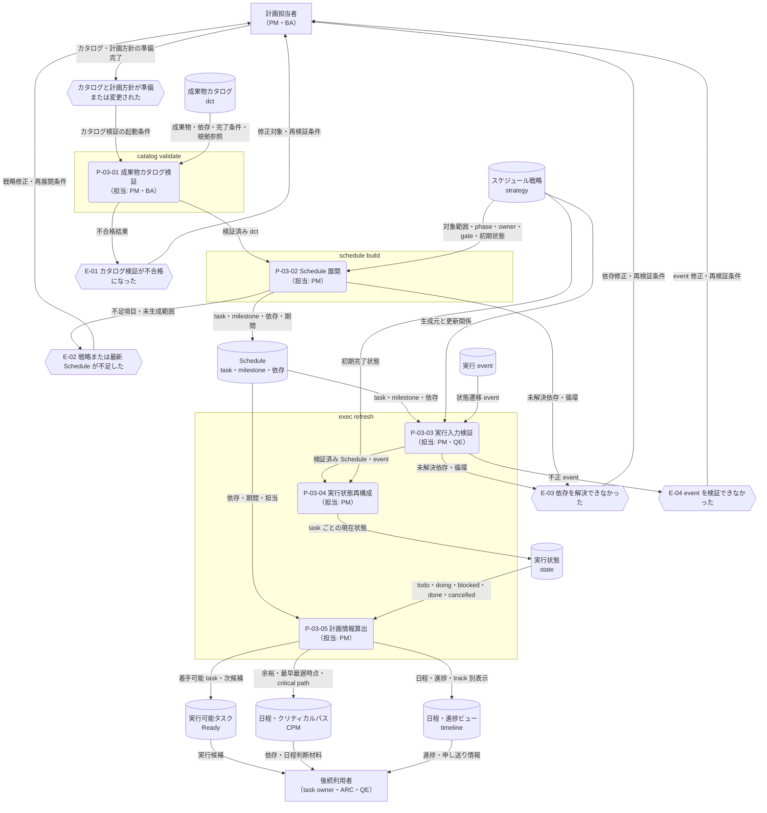

---
specdojo:
  id: prj-0001:cdfd-catalog-planning
  type: flow
  status: draft
  rulebook: specdojo:cdfd-rulebook
  based_on:
    - prj-0001:cdfd-init
    - prj-0001:cdfd-overview
  supersedes: []
---

# 概念データフロー図（カタログ〜計画展開）: SpecDojo

本書は、[[prj-0001:cdfd-overview|概念データフロー図（全体概要）]] が定める `P-03 計画展開` の境界と、[[prj-0001:cdfd-init|概念データフロー図（初期セットアップ）]] から引き渡される成果物カタログ・プロジェクト構成を引き継ぐ。成果物カタログとスケジュール戦略を検証し、Schedule、実行状態、Ready、CPM、timeline を利用可能にする TO-BE フローを定義する。

## 1. 目的と適用範囲

- 対象者は、計画展開の要件と利用場面を整理する BA、計画を準備・更新する PM、正本と派生情報の依存を設計入力にする ARC、停止ゲートを確認する QE である。
- 対象は、成果物カタログとスケジュール戦略の準備または変更を起点に、`catalog validate`、`schedule build`、`exec refresh` を経て、実行可能なタスクと日程・進捗情報を利用可能にするまでである。
- 成果物カタログ、スケジュール戦略、Schedule、event を入力の正本とし、state、Ready、CPM、critical path、timeline を再生成可能な計画情報として扱う。event がまだない初回更新では、戦略の初期状態と Schedule から state を構成する。
- カタログ検証不合格、戦略不足、依存の未解決または循環、event 不正は、影響する後続生成を止める主要例外とする。個別コマンドのオプション、内部関数、ログ全文、描画方式の詳細は対象外とする。
- 成果物の編集と task の実行・event 追加は `P-04 タスク実行`、構成変更の承認と適用は `P-07 構成変更`、成果物・索引・一般的な派生ビューの生成と公開は `P-08 派生生成` の責務とし、本領域では作り込まない。
- 計画方針、適用する成果物範囲、依存・ゲート、例外後の再開は人間が責任を持って判断する。AI Agent は検証、展開、再計算を支援できるが、不足した業務判断を推測して補わない。

## 2. 領域内プロセス一覧

<!-- prettier-ignore -->
| プロセス ID | プロセス | 業務目的 | 主な担当 | 起動条件 | 主要入力 | 主要出力・生成先 | 正本・データストア | 必須性 |
| --- | --- | --- | --- | --- | --- | --- | --- | --- |
| `P-03-01` | 成果物カタログ検証 | 計画対象の成果物、依存、完了条件、根拠参照が一貫し、Schedule 展開へ渡せることを確認する。 | PM、BA | 成果物カタログの準備または変更が完了した | dct、文書 ID、成果物・rulebook の参照先 | カタログ検証結果、検証済みの成果物・依存・完了条件 | 成果物カタログ（`dct-*.yaml`） | 必須 |
| `P-03-02` | Schedule 展開 | 検証済みの成果物を、戦略が定める対象範囲、phase、owner、依存、gate、milestone に沿う実行順序へ展開する。 | PM | カタログ検証が合格し、適用するスケジュール戦略が確定した | 検証済み dct、strategy、成果物間依存、初期完了状態 | task・milestone・依存・担当・期間を持つ Schedule | スケジュール戦略（`sch-strategy-*.yaml`）、Schedule（`sch-track-*.yaml`、`sch-milestones*.yaml`） | 必須 |
| `P-03-03` | 実行入力検証 | Schedule と event が一貫し、状態・実行可能性・日程を安全に再計算できることを確認する。 | PM、QE | Schedule が生成または変更された、または event が追加された | Schedule、event、strategy と生成済み track の更新関係 | 実行入力の検証結果、再計算可能な Schedule・event | Schedule、実行 event（`execution/exec/events/*.json`） | 必須 |
| `P-03-04` | 実行状態再構成 | event の履歴と戦略の初期状態を Schedule へ畳み込み、現在の task 状態を再現する。 | PM | 実行入力検証が合格した | 検証済み Schedule・event、strategy の初期状態 | event 列、task ごとの state → `generated/exec.jsonl`、`generated/state.json` | 実行 event、実行状態 | 必須 |
| `P-03-05` | 計画情報算出 | Schedule と現在状態から、次に着手できる task、クリティカルパス、日程・進捗を同じ時点の判断材料として提供する。 | PM | 実行状態の再構成が完了した | Schedule、state | Ready → `generated/ready.json`・`ready.md`、CPM・critical path → `generated/cpm.*`・`critical-path.md`、timeline → `generated/timeline*.md`・`timeline*.svg` | Schedule・実行計画、計画派生情報 | 必須 |

`catalog validate` は `P-03-01`、`schedule build` は `P-03-02`、`exec refresh` は `P-03-03`〜`P-03-05` に対応する。Ready は未完了かつ依存が完了して着手可能な task の集合であり、既定では CPM を用いた critical-first 順で次候補を示す。state、Ready、CPM、timeline は同じ Schedule と event から再生成し、一部だけを手修正して正本化しない。

## 3. 概念データフロー

凡例: 角丸長方形は一つのプロセス、六角形は起点・主要例外イベント、円柱は正本または再生成する計画データ、四角は外部主体、`-->` は情報の流れを表す。本図は現物の流れを扱わない。正常経路は `P-03-01` から `P-03-05` へ進み、主要例外では後続生成を止めて計画担当者へ修正・再開条件を返す。

## 4. 主要例外と領域外への委譲

### 4.1. 主要例外

| 例外 ID | 対象プロセス         | 検出条件                                                                                                                                                          | 本領域での扱い                                                                                                                      | 継続・再開条件                                                                                  |
| ------- | -------------------- | ----------------------------------------------------------------------------------------------------------------------------------------------------------------- | ----------------------------------------------------------------------------------------------------------------------------------- | ----------------------------------------------------------------------------------------------- |
| `E-01`  | `P-03-01`            | dct の必須項目、work の path・done criteria、evidence reference、domain 統合、参照先、based-on と depends-on の整合のいずれかを検証できない                       | 不合格項目と対象カタログを返し、Schedule 展開を起動しない。以前の Schedule と派生情報を新しいカタログに基づく最新情報とは扱わない。 | エラーを解消し、対象カタログ全体の検証が合格する                                                |
| `E-02`  | `P-03-02`、`P-03-03` | strategy の対象 catalog、phase set、owner rule、gate、必須の識別情報が不足・不正である、参照 catalog が存在しない、または strategy に対応する最新 Schedule がない | task・milestone を部分的な最新計画として引き渡さず、Schedule 展開または実行計画の更新を止める。                                     | 戦略を補完・承認して Schedule を再生成し、strategy と生成済み track の対応を確認できる          |
| `E-03`  | `P-03-02`、`P-03-03` | 成果物または Schedule の依存先を一意に解決できない、依存先 ID が存在しない、または依存グラフに循環がある                                                          | 依存が欠けた task を Ready にせず、Schedule 展開または state・CPM・timeline の更新を止める。                                        | 依存先を追加・訂正するか循環を解消し、カタログ検証、Schedule 展開、実行入力検証を順に再実行する |
| `E-04`  | `P-03-03`            | event の JSON を解析できない、必須属性・状態遷移の形が不正である                                                                                                  | 不正 event を含む履歴から state を確定せず、対象ファイルと検証結果を返す。                                                          | event を訂正するか、履歴として採用しない判断を記録した上で、実行入力検証から再開する            |

event が存在しない初回更新は例外ではなく、戦略の初期状態または既定の `todo` から state を構成する。現行 Schedule に存在しない task を指す過去 event は現在状態へ畳み込まず、警告を確認対象として残す。

### 4.2. 領域外への委譲

| 委譲先                  | 委譲する事項                                                    | 引き渡す情報                                                        | 本領域へ戻す条件                                                                    |
| ----------------------- | --------------------------------------------------------------- | ------------------------------------------------------------------- | ----------------------------------------------------------------------------------- |
| `P-01 初期セットアップ` | 計画展開に必要なカタログ・構成の初期受け皿を作る                | プロジェクト構成、成果物カタログ、任意の実行補助設定                | 初期正本の不足または配置不整合が原因で `E-01` または `E-02` になった                |
| `P-02 登録簿運用`       | 計画へ反映する制約・決定と、計画外の依存問題を継続管理する      | 承認済みの制約・決定、再計画要求                                    | 登録項目の判断が確定し、strategy または依存へ反映できる                             |
| `P-04 タスク実行`       | Ready から task を選択し、実行結果を event と成果物へ反映する   | Ready、Schedule、task の mode・execution・approach・capability 条件 | event の追加、task の完了・中断、または依存へ影響する結果により再計算が必要になった |
| `P-07 構成変更`         | strategy、provider、agent、実行条件に関する変更を承認・適用する | 変更要求、影響、承認結果、更新済み構成                              | 承認済み変更により Schedule または実行計画の再展開が必要になった                    |
| `P-08 派生生成`         | 計画情報を成果物、索引、一般的な派生ビューとして生成・公開する  | Schedule、state、Ready、CPM、timeline                               | 表示元となる正本・計画情報の不整合が判明し、再計算が必要になった                    |

### 4.3. 受入確認

| 確認者 | 確認対象             | 受入条件                                                                                                                 |
| ------ | -------------------- | ------------------------------------------------------------------------------------------------------------------------ |
| BA     | 業務価値と利用場面   | カタログと戦略の準備から検証・展開・更新を経て、実行可能な task と日程・進捗情報を利用できるまでを一覧と図から説明できる |
| PM     | 計画境界と再開判断   | dct、strategy、Schedule、event の正本、各処理の起動条件、停止時の修正対象と再開順序を判断できる                          |
| ARC    | 入出力と依存         | dct・strategy・Schedule・event から state・Ready・CPM・timeline へ至る入力、出力、正本・派生の関係を追跡できる           |
| QE     | 検証ゲートと例外経路 | カタログ検証失敗、戦略不足、依存解決失敗、event 不正について、停止する後続処理と再開条件を表と図から判定できる           |
