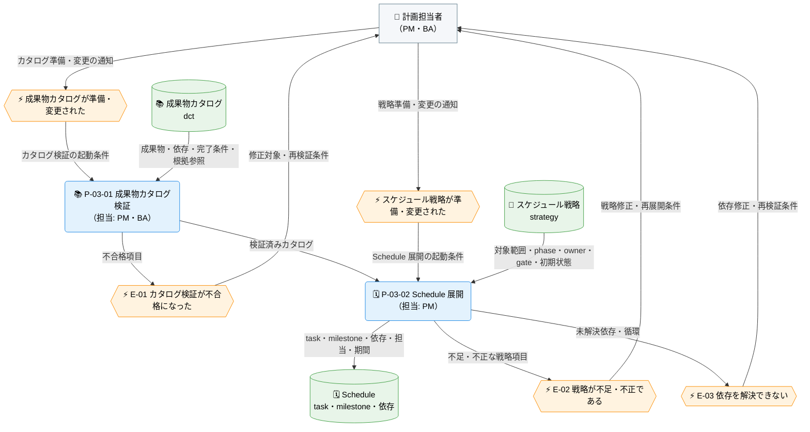
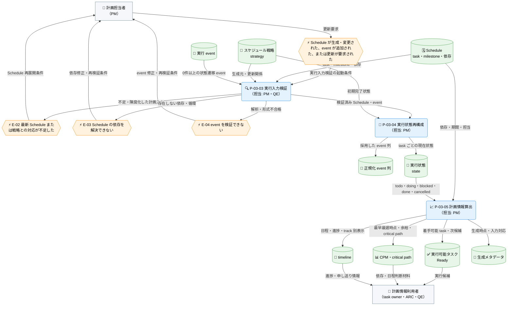

---
specdojo:
  id: prj-0001:cdfd-catalog-planning
  type: flow
  status: draft
  rulebook: specdojo:cdfd-rulebook
  based_on:
    - prj-0001:cdfd-init
    - prj-0001:cdfd-overview
  supersedes: []
---

# 概念データフロー図（カタログ〜計画展開）: SpecDojo

本書は、[[prj-0001:cdfd-overview|概念データフロー図（全体概要）]] が定める `P-03 計画展開` の境界と、[[prj-0001:cdfd-init|概念データフロー図（初期セットアップ）]] から引き渡される成果物カタログ・プロジェクト構成を引き継ぐ。成果物カタログとスケジュール戦略を検証して Schedule へ展開し、実行状態、Ready、CPM、timeline を同じ正本から利用可能にする概念仕様である。

## 1. 目的

- BA と PM は、カタログと戦略の準備から検証・展開・更新を経て、実行可能な task と日程・進捗情報を利用できるまでの業務境界を合意する。
- ARC は dct、strategy、Schedule、event から state、Ready、CPM、timeline へ至る入出力と正本・派生の関係を後続設計へ使う。
- QE はカタログ検証不合格、戦略不足、依存解決失敗、event 不正によって停止する後続処理と、修正後の再開条件を確認する。

## 2. 適用範囲

- 対象は、成果物カタログまたはスケジュール戦略が準備・変更されてから Schedule を更新し、Schedule の生成・変更または event の追加を受けて state、Ready、CPM、critical path、timeline を更新するまでである。
- `P-03-01` はカタログの初回準備・変更時、`P-03-02` はカタログ検証合格後または戦略の初回準備・変更時に起動する条件付きの計画基盤更新である。event だけが追加された場合は、検証済みの現行 Schedule を使い、両プロセスを起動せず `P-03-03` から更新する。
- `P-03-03`〜`P-03-05` は、Schedule が生成・変更された場合、event が追加された場合、または計画情報の更新が要求された場合に一組で実行する必須プロセスである。event がない初回更新でも、戦略の初期状態または既定の `todo` から state を構成する。
- 成果物カタログ、スケジュール戦略、Schedule、event を入力の正本とし、state、Ready、CPM、critical path、timeline を再生成可能な計画情報として扱う。一部の派生情報だけを手修正して正本化しない。
- 成果物の編集、task の選択・実行、event の追加と状態遷移は `P-04 タスク実行`、戦略・実行構成の変更承認は `P-07 構成変更`、成果物・索引・一般的な派生ビューの生成と公開は `P-08 派生生成` の責務とする。個別コマンドのオプション、内部関数、ログ全文、描画方式は対象外とする。
- 人間と AI Agent の責任分担の原則は [[prj-0001:prj-overview|プロジェクト概要]] に従う。計画方針、対象範囲、依存・ゲート、例外後の再開は人間が判断し、AI Agent は検証、展開、再計算を支援する。

## 3. 領域内プロセス一覧

`P-03 計画展開` は五つのプロセスに分かれる。プロセスの分割、プロセス ID、起動条件、必須性は本章を正本とし、主要入力・主要出力・データストアは「個別プロセス主要入出力」に記載する。

<!-- prettier-ignore -->
| プロセス ID | プロセス | 業務目的 | 主な担当 | 起動条件 | 必須性 |
| --- | --- | --- | --- | --- | --- |
| `P-03-01` | 成果物カタログ検証 | 計画対象の成果物、依存、完了条件、根拠参照が一貫し、Schedule 展開へ渡せることを確認する。 | PM、BA | 成果物カタログを初めて準備した、または変更した | 条件付き（初回準備・変更時は必須） |
| `P-03-02` | Schedule 展開 | 検証済みの成果物を、戦略が定める対象範囲、phase、owner、依存、gate、milestone に沿う実行順序へ展開する。 | PM | カタログ検証が合格した、または検証済みカタログに適用する戦略を変更した | 条件付き（初回準備・カタログまたは戦略の変更時は必須） |
| `P-03-03` | 実行入力検証 | Schedule と event の一貫性を確認し、状態・実行可能性・日程を安全に再計算できる入力を確定する。 | PM、QE | Schedule が生成・変更された、event が追加された、または計画情報の更新が要求された | 必須 |
| `P-03-04` | 実行状態再構成 | event の履歴と戦略の初期状態を Schedule へ畳み込み、現在の task 状態を再現する。 | PM | 実行入力検証が合格した | 必須 |
| `P-03-05` | 計画情報算出 | Schedule と現在状態から、次に着手できる task、クリティカルパス、日程・進捗を同じ時点の判断材料として提供する。 | PM | 実行状態の再構成が完了した | 必須 |

`catalog validate` は `P-03-01`、`schedule build` は `P-03-02`、`exec refresh` は `P-03-03`〜`P-03-05` に対応する。Ready は未完了かつ依存が完了して着手可能な task の集合であり、既定では CPM を用いた critical-first 順で次候補を示す。

Schedule・event から state、Ready、CPM、critical path、timeline を算出する入力関係と検証ゲートは本書を正本とする。一括 `build` における `exec refresh` の起動順、生成失敗後の下流停止、陳腐化した生成物の扱いは [[prj-0001:cdfd-derived-content|概念データフロー図（成果物・派生ビュー・索引生成）]]、task event 自体の状態遷移は [[prj-0001:cdfd-task-execution|概念データフロー図（タスク実行ライフサイクル）]] を参照する。

## 4. 概念データフロー

カタログ・戦略の変更時だけ起動する計画基盤更新と、Schedule または event の更新後に行う計画情報更新では起動条件が異なるため、フローを二図に分ける。

### 4.1. カタログ・戦略変更時の計画基盤更新（条件付き）

凡例: ノード形状・色・絵文字は [[prj-0001:cdfd-overview|概念データフロー図（全体概要）]] の「凡例（本プロダクト共通）」に従い、`-->` は情報の流れを表す。`Schedule` は計画情報更新のフロー（4.2）と同一のデータストアを指す。本図は現物の流れを扱わず、event だけが追加された場合は起動しない。

### 4.2. Schedule・event からの計画情報更新（必須）

凡例: ノード形状・色・絵文字は [[prj-0001:cdfd-overview|概念データフロー図（全体概要）]] の「凡例（本プロダクト共通）」に従い、`-->` は情報の流れを表す。`Schedule` と `スケジュール戦略` は計画基盤更新のフロー（4.1）と同一のデータストアを指す。本図は現物の流れを扱わない。主要例外では `P-03-04` 以降を起動せず、修正後に `P-03-03` から再開する。

## 5. 個別プロセス主要入出力

代表パス中の `<project-id>` と `<track>` は、対象プロジェクトと計画系列に置き換える総称であり、未記入の成果物値ではない。プロセス ID、業務目的、主な担当、起動条件、必須性は「領域内プロセス一覧」を参照する。

### 5.1. 条件付きの計画基盤更新（P-03-01・P-03-02）

成果物カタログまたはスケジュール戦略を初めて準備した場合、および変更した場合に、検証済みの成果物定義を実行順序へ展開する。

<!-- prettier-ignore -->
| プロセス ID | プロセス | 主要入力 | 主要出力 | データストア |
| --- | --- | --- | --- | --- |
| `P-03-01` | 成果物カタログ検証 | dct、文書 ID、成果物・rulebook の参照先 | カタログ検証結果、検証済みの成果物・依存・完了条件・根拠参照 | `docs/ja/projects/<project-id>/010-deliverables-catalog/dct-*.yaml` |
| `P-03-02` | Schedule 展開 | 検証済み dct、strategy の対象範囲・phase set・owner rule・gate・milestone・初期完了状態 | task・milestone・依存・担当・期間を持つ Schedule | `sch-strategy-<track>.yaml`、`sch-track-<track>.yaml`、`sch-milestones*.yaml` |

### 5.2. 必須の計画情報更新（P-03-03〜P-03-05）

Schedule の生成・変更、event の追加、または更新要求を受けた場合に、入力を検証し、同じ時点の実行状態・実行可能性・日程情報を再構成する。

<!-- prettier-ignore -->
| プロセス ID | プロセス | 主要入力 | 主要出力 | データストア |
| --- | --- | --- | --- | --- |
| `P-03-03` | 実行入力検証 | Schedule、event、strategy と生成済み track の更新関係 | 実行入力の検証結果、再計算可能な Schedule・event | Schedule、`execution/exec/events/*.json` |
| `P-03-04` | 実行状態再構成 | 検証済み Schedule・event、strategy の初期状態 | 採用した event 列、task ごとの現在 state | `execution/exec/generated/exec.jsonl`、`execution/exec/generated/state.json` |
| `P-03-05` | 計画情報算出 | Schedule、state | Ready、CPM、critical path、全体・milestone・track 別 timeline、生成メタデータ | `execution/exec/generated/ready.*`、`cpm.*`、`critical-path.md`、`timeline*.md`、`timeline*.svg`、`metadata.json` |

## 6. 主要例外と領域外への委譲

### 6.1. 主要例外

| 例外 ID | 対象プロセス         | 検出条件                                                                                                                                                        | 本領域での扱い                                                                                                                      | 継続・再開条件                                                                                  |
| ------- | -------------------- | --------------------------------------------------------------------------------------------------------------------------------------------------------------- | ----------------------------------------------------------------------------------------------------------------------------------- | ----------------------------------------------------------------------------------------------- |
| `E-01`  | `P-03-01`            | dct の必須項目、work の path・done criteria、evidence reference、domain 統合、参照先、based-on と depends-on の整合のいずれかを検証できない                     | 不合格項目と対象カタログを返し、Schedule 展開を起動しない。以前の Schedule と派生情報を新しいカタログに基づく最新情報とは扱わない。 | エラーを解消し、対象カタログ全体の検証が合格する                                                |
| `E-02`  | `P-03-02`、`P-03-03` | strategy の対象 catalog、phase set、owner rule、gate、必須識別情報が不足・不正である、参照 catalog が存在しない、または strategy に対応する最新 Schedule がない | task・milestone を部分的な最新計画として引き渡さず、Schedule 展開または実行計画の更新を止める。                                     | 戦略を補完・承認して Schedule を再生成し、strategy と生成済み track の対応を確認できる          |
| `E-03`  | `P-03-01`〜`P-03-03` | 成果物または Schedule の依存先を一意に解決できない、依存先 ID が存在しない、または依存グラフに循環がある                                                        | 依存が欠けた task を Ready にせず、Schedule 展開または state・CPM・timeline の更新を止める。                                        | 依存先を追加・訂正するか循環を解消し、カタログ検証、Schedule 展開、実行入力検証を順に再実行する |
| `E-04`  | `P-03-03`            | event の JSON を解析できない、または必須属性・状態遷移の形式が不正である                                                                                        | 不正 event を含む履歴から state を確定せず、対象ファイルと検証結果を返す。                                                          | event を訂正するか、履歴として採用しない判断を記録した上で、実行入力検証から再開する            |

event が存在しない初回更新は例外ではなく、戦略の初期状態または既定の `todo` から state を構成する。現行 Schedule に存在しない task を指す過去 event は現在状態へ畳み込まず、警告を確認対象として残す。

### 6.2. 領域外への委譲

| 委譲先                                                                          | 委譲する事項                                                   | 引き渡す情報                                                        | 本領域へ戻す条件                                                                    |
| ------------------------------------------------------------------------------- | -------------------------------------------------------------- | ------------------------------------------------------------------- | ----------------------------------------------------------------------------------- |
| `P-01` [[prj-0001:cdfd-init\|初期セットアップ]]                                 | 計画展開に必要なカタログ・構成の初期受け皿を作る               | プロジェクト構成、成果物カタログ、任意の実行補助設定                | 初期正本の不足または配置不整合が原因で `E-01` または `E-02` になった                |
| `P-02` [[prj-0001:cdfd-register-operation\|登録簿運用]]                         | 計画へ反映する制約・決定と、計画外の依存問題を継続管理する     | 承認済みの制約・決定、再計画要求                                    | 登録項目の判断が確定し、strategy または依存へ反映できる                             |
| `P-04` [[prj-0001:cdfd-task-execution\|タスク実行ライフサイクル]]               | Ready から task を選択し、実行結果を event と成果物へ反映する  | Ready、Schedule、task の mode・execution・approach・capability 条件 | event の追加、task の完了・中断、または依存へ影響する結果により再計算が必要になった |
| `P-07` [[prj-0001:cdfd-agent-config-operation\|agent・provider 構成の運用変更]] | strategy、provider、agent、実行条件の変更を承認・適用する      | 変更要求、影響、承認結果、更新済み構成                              | 承認済み変更により Schedule または実行計画の再展開が必要になった                    |
| `P-08` [[prj-0001:cdfd-derived-content\|成果物・派生ビュー・索引生成]]          | 計画情報を成果物、索引、一般的な派生ビューとして生成・公開する | Schedule、state、Ready、CPM、timeline                               | 表示元となる正本・計画情報の不整合が判明し、再計算が必要になった                    |

### 6.3. 受入確認

| 確認者 | 確認対象             | 受入条件                                                                                                                   |
| ------ | -------------------- | -------------------------------------------------------------------------------------------------------------------------- |
| BA     | 業務価値と利用場面   | カタログと戦略の準備から検証・展開・更新を経て、実行可能な task と日程・進捗情報を利用できるまでを一覧と二図から説明できる |
| PM     | 必須・条件付きの境界 | カタログ・戦略変更時の計画基盤更新と、Schedule・event 更新時の必須更新を区別し、停止時の修正対象と再開順序を判断できる     |
| ARC    | 入出力と依存         | dct・strategy・Schedule・event から state・Ready・CPM・timeline へ至る入力、出力、正本・派生の関係を追跡できる             |
| QE     | 検証ゲートと例外経路 | カタログ検証失敗、戦略不足、依存解決失敗、event 不正について、停止する後続処理と再開条件を表と図から判定できる             |
