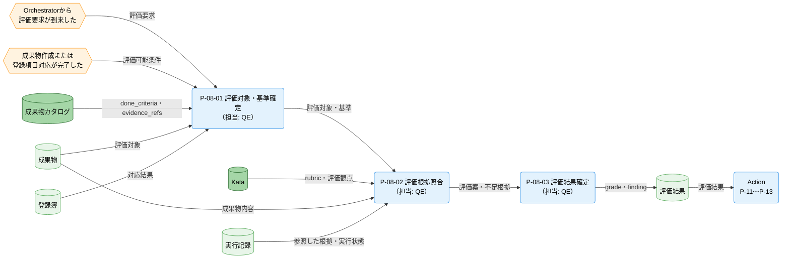
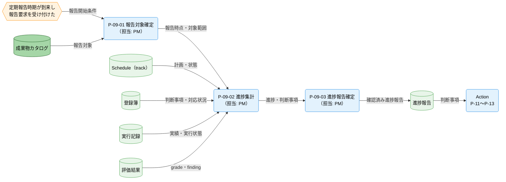
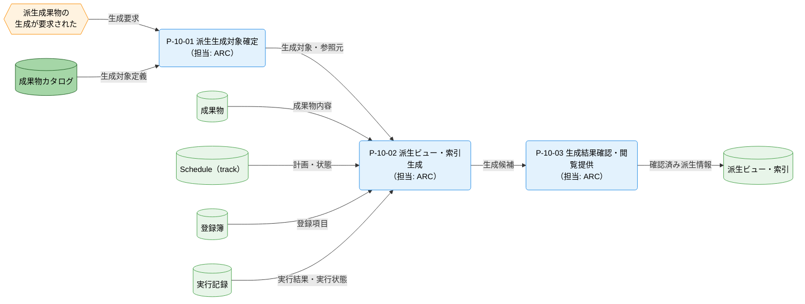

---
specdojo:
  id: cdfd-check
  type: flow
  status: draft
  rulebook: specdojo:cdfd-rulebook
  based_on:
    - cdfd-overview
  supersedes: []
---

# 概念データフロー図（Check）: SpecDojo

## 1. 目的

本書は、[[cdfd-overview|概念データフロー図（全体概要）]] の Check グループを詳細化し、成果物評価、進捗可視化報告、派生生成閲覧提供の内部プロセスと責任境界を合意可能にする。

- BA は、評価結果、進捗報告、派生ビュー・索引が、限られた参加負荷で判断と継承に使える流れになっているかを確認する。
- QE、PM、ARC は、それぞれが責任を持つ領域の起動条件、入出力、例外時の扱いを確認する。
- ARC は、成果物・実行記録・登録簿・Schedule（track）から各生成先への参照を設計入力として使う。
- QE は、評価対象の変更、評価不能、生成結果の不整合が発生したときに、Action へ何を渡せるかと、どこから再開するかを検証する。

これにより、参加者は成果物と実行記録を、人間が完了・改善を判断できる評価結果と進捗報告、および再利用可能な閲覧情報へ変換できる。

## 2. 適用範囲

- **対象グループ**: Check。成果物評価（P-08）、進捗可視化報告（P-09）、派生生成閲覧提供（P-10）の全領域を扱う。
- **開始**: Orchestrator から評価・報告要求が到来し各領域の起動条件を満たした時点、または派生成果物の生成が要求された時点とする。
- **終了**: 評価結果（grade、finding）、進捗報告、または整合性を確認した派生ビュー・索引が、それぞれのデータストアへ記録され、必要な出力が Action または参加者の閲覧へ提供可能になった時点とする。
- **期間・組織境界**: SpecDojo を利用するプロジェクトの実行期間を対象とし、QE、PM、ARC を含む参加者と、支援を委譲された AI Agent または runner の協働を扱う。主担当のロールコードと member・agent・runner の責任分担は [[prj-0001:pm-roles|ロール一覧]] を正本とし、本書では各プロセスの最終判断者と委譲可能な支援だけを示す。
- **システム境界**: 本書のデータストアにある概念データの参照・更新までを扱う。物理ファイル、コマンド、生成方式、画面操作、内部エラーおよび再試行方式は対象外とする。
- **対象外**: Plan と Do の内部処理、Action の完了・改善判断、複数グループを横断する実行順、状態名・状態定義・遷移条件を対象外とする。グループ外との境界は「主要例外とグループ外への委譲」に集約する。

## 3. プロセス領域

Check グループは P-08〜P-10 の 3 領域からなる。領域 ID と名称、およびグループ単位の主要入力・主要出力・データストアは [[cdfd-overview|概念データフロー図（全体概要）]] を正本とし、本章では領域内部を詳細化する。

### 3.1. 成果物評価（P-08）

Do で完了する review・検証は成果物の改善と検証可能な実行記録を残すまでを担い、grade・finding は確定しない。P-08 は、その成果物と実行記録を review から独立して根拠と照合し、QE が grade・finding を評価結果として確定する。非適合という判定は正常な評価結果として扱い、評価そのものを完了できない場合とは区別する。

**主要入力**

- Orchestrator からの評価要求
- Do で review・検証を完了した作成・更新済みの成果物、または対応が完了した登録項目
- 成果物カタログの done_criteria・evidence_refs
- evidence_refs が示す成果物・実行記録と実行状態
- Kata の rubric・評価観点

**主要出力**

- 評価結果（grade、finding）

**データストア**

- Kata
- 成果物カタログ
- 成果物
- 登録簿
- 実行記録
- 評価結果

| プロセス ID | プロセス           | 業務目的                                                                       | 主な担当                       | 起動条件                                                                     | 必須性 |
| ----------- | ------------------ | ------------------------------------------------------------------------------ | ------------------------------ | ---------------------------------------------------------------------------- | ------ |
| `P-08-01`   | 評価対象・基準確定 | 評価対象、完了条件、評価観点を対応付け、人間が承認できる判定単位にする。       | QE                             | 評価要求が到来し、成果物が作成された、または登録項目の対応が完了した         | 必須   |
| `P-08-02`   | 評価根拠照合       | 完了条件ごとの根拠と不足を識別し、再現可能な評価案にする。                     | QE（照合は AI Agent へ委譲可） | `P-08-01` が完了し、対象成果物または登録項目と対応する実行記録を特定できる   | 必須   |
| `P-08-03`   | 評価結果確定       | QE の最終判断により grade と finding を確定し、Action が利用できるようにする。 | QE                             | `P-08-02` の照合結果がそろい、対象が照合後に変更されていないことを確認できる | 必須   |

### 3.2. 進捗可視化報告（P-09）

報告対象と時点を固定し、計画、実行、評価の正本を同じ範囲で集計して、PM が関係者の判断に使う進捗報告を確定する。評価不能や正本間の不一致は、確定値と混同せず報告可否を判断する。

**主要入力**

- Orchestrator からの報告要求
- 成果物カタログ
- Schedule（track）
- 登録簿
- 実行記録・実行状態
- 評価結果

**主要出力**

- 進捗報告

**データストア**

- 成果物カタログ
- Schedule（track）
- 登録簿
- 実行記録
- 評価結果
- 進捗報告

| プロセス ID | プロセス     | 業務目的                                                       | 主な担当                       | 起動条件                                                               | 必須性 |
| ----------- | ------------ | -------------------------------------------------------------- | ------------------------------ | ---------------------------------------------------------------------- | ------ |
| `P-09-01`   | 報告対象確定 | 報告時点と対象範囲を固定し、異なる時点の情報の混在を防ぐ。     | PM                             | 定期的な報告時期が到来し、Orchestrator からの報告要求を受け付けた      | 必須   |
| `P-09-02`   | 進捗集計     | 計画、実行、評価の情報を対応付け、進捗と判断事項を可視化する。 | PM（集計は AI Agent へ委譲可） | `P-09-01` が完了し、対象範囲の各データストアを同じ報告時点で参照できる | 必須   |
| `P-09-03`   | 進捗報告確定 | PM の確認により進捗報告を確定し、Action の判断材料にする。     | PM                             | `P-09-02` の集計結果について、正本間の不一致がないか扱いを確定できる   | 必須   |

### 3.3. 派生生成閲覧提供（P-10）

生成要求に対して対象と参照元を確定し、正本を変更せずに派生ビュー・索引を生成する。ARC が参照元との整合性を確認した生成物だけを参加者の閲覧へ提供する。

**主要入力**

- Orchestrator からの生成要求
- 成果物カタログ
- 作成・更新された成果物
- Schedule（track）
- 登録簿
- 実行記録・実行状態

**主要出力**

- 派生ビュー・索引

**データストア**

- 成果物カタログ
- 成果物
- Schedule（track）
- 登録簿
- 実行記録
- 派生ビュー・索引

| プロセス ID | プロセス               | 業務目的                                                     | 主な担当                        | 起動条件                                                                       | 必須性 |
| ----------- | ---------------------- | ------------------------------------------------------------ | ------------------------------- | ------------------------------------------------------------------------------ | ------ |
| `P-10-01`   | 派生生成対象確定       | 生成対象、参照元、閲覧用途を対応付け、生成範囲を確定する。   | ARC                             | 派生成果物の生成要求が到来し、対象とする正本を識別できる                       | 必須   |
| `P-10-02`   | 派生ビュー・索引生成   | 正本から閲覧用の派生情報を生成し、確認可能な候補を作る。     | ARC（生成は AI Agent へ委譲可） | `P-10-01` が完了し、確定した参照元を取得できる                                 | 必須   |
| `P-10-03`   | 生成結果確認・閲覧提供 | ARC の確認により参照元と整合する生成物だけを閲覧可能にする。 | ARC                             | `P-10-02` が完了し、生成対象と参照元が生成中に変更されていないことを確認できる | 必須   |

## 4. データストア

本グループが読み書きするデータストアだけを、[[cdfd-overview|概念データフロー図（全体概要）]] と同じ名称・区分で示す。

### 4.1. マスタ・構成データ

| データストア   | 読み書き | 本グループでの利用                                                                           |
| -------------- | -------- | -------------------------------------------------------------------------------------------- |
| Kata           | 参照     | P-08 が rubric・評価観点を参照し、評価案と最終判断の基準にする。                             |
| 成果物カタログ | 参照     | P-08 が done_criteria・evidence_refs、P-09 が報告対象、P-10 が派生生成対象の定義を参照する。 |

### 4.2. トランザクションデータ

| データストア      | 読み書き   | 本グループでの利用                                                                           |
| ----------------- | ---------- | -------------------------------------------------------------------------------------------- |
| Schedule（track） | 参照       | P-09 が計画上のタスク・担当・期間・状態、P-10 が派生生成の参照元を確認する。                 |
| 登録簿            | 参照       | P-08 が対応完了した登録項目、P-09 が判断事項と対応状況、P-10 が派生生成の参照元を確認する。  |
| 実行記録          | 参照       | P-08 が evidence_refs と実行状態、P-09 が実績と実行状態、P-10 が派生生成の参照元を確認する。 |
| 成果物            | 参照       | P-08 が評価対象、P-10 が派生生成の参照元として使用する。                                     |
| 評価結果          | 参照・更新 | P-08 が grade と finding を記録し、P-09 が進捗と判断事項の集計に参照する。                   |
| 進捗報告          | 更新       | P-09 が確認済みの進捗、未解決の不一致、Action の判断事項を記録する。                         |
| 派生ビュー・索引  | 更新       | P-10 が参照元との整合性を確認した閲覧用の派生情報を記録する。                                |

## 5. 概念データフロー

図は領域単位に分け、各領域の起点から出力先までを示す。矢印は情報または実行要求の受け渡しであり、実行順や毎回の通過を意味しない。

### 5.1. 成果物評価（P-08）

凡例は [[cdfd-overview|概念データフロー図（全体概要）]] の「凡例（本プロダクト共通）」に従う。`-->` は情報の流れであり、本図は物の流れを対象外とする。参加者は各担当の内側にいるため外部主体として省略し、例外時の停止と再開は「主要例外とグループ外への委譲」に示す。成果物カタログ、成果物、登録簿、実行記録は他図と共有し、Action はグループ外の代表ノードとして内部処理を省略する。

### 5.2. 進捗可視化報告（P-09）

凡例は [[cdfd-overview|概念データフロー図（全体概要）]] の「凡例（本プロダクト共通）」に従う。`-->` は情報の流れであり、本図は物の流れを対象外とする。個々の計測値と表示形式は実装詳細として省略し、正本間の不一致は「主要例外とグループ外への委譲」に示す。成果物カタログ、登録簿、実行記録、評価結果は他図と共有し、Action はグループ外の代表ノードとして内部処理を省略する。

### 5.3. 派生生成閲覧提供（P-10）

凡例は [[cdfd-overview|概念データフロー図（全体概要）]] の「凡例（本プロダクト共通）」に従う。`-->` は情報の流れであり、本図は物の流れを対象外とする。閲覧画面、生成コマンド、索引形式は実装詳細として省略し、生成結果の不整合は「主要例外とグループ外への委譲」に示す。成果物カタログ、成果物、Schedule（track）、登録簿、実行記録は他図と共有する。

## 6. 個別プロセス主要入出力

### 6.1. 成果物評価（P-08）

| プロセス ID | プロセス           | 主要入力                                                                             | 主要出力                       | データストア                   |
| ----------- | ------------------ | ------------------------------------------------------------------------------------ | ------------------------------ | ------------------------------ |
| `P-08-01`   | 評価対象・基準確定 | 評価要求、作成・更新された成果物または対応済み登録項目、done_criteria・evidence_refs | 評価対象・基準                 | 成果物カタログ、成果物、登録簿 |
| `P-08-02`   | 評価根拠照合       | 評価対象・基準、rubric・評価観点、成果物内容、evidence_refs が示す根拠、実行状態     | 完了条件ごとの評価案・不足根拠 | Kata、成果物、実行記録         |
| `P-08-03`   | 評価結果確定       | 完了条件ごとの評価案・不足根拠、評価対象が変更されていないことの確認                 | 評価結果（grade、finding）     | 評価結果                       |

### 6.2. 進捗可視化報告（P-09）

| プロセス ID | プロセス     | 主要入力                                                     | 主要出力           | データストア                                  |
| ----------- | ------------ | ------------------------------------------------------------ | ------------------ | --------------------------------------------- |
| `P-09-01`   | 報告対象確定 | 報告要求、報告対象の定義                                     | 報告時点・対象範囲 | 成果物カタログ                                |
| `P-09-02`   | 進捗集計     | 報告時点・対象範囲、計画、対応状況、実績・実行状態、評価結果 | 進捗と判断事項     | Schedule（track）、登録簿、実行記録、評価結果 |
| `P-09-03`   | 進捗報告確定 | 進捗と判断事項、正本間の不一致に対する扱い                   | 確認済み進捗報告   | 進捗報告                                      |

### 6.3. 派生生成閲覧提供（P-10）

| プロセス ID | プロセス               | 主要入力                                                               | 主要出力                   | データストア                                |
| ----------- | ---------------------- | ---------------------------------------------------------------------- | -------------------------- | ------------------------------------------- |
| `P-10-01`   | 派生生成対象確定       | 生成要求、生成対象定義                                                 | 生成対象・参照元           | 成果物カタログ                              |
| `P-10-02`   | 派生ビュー・索引生成   | 生成対象・参照元、成果物内容、計画・状態、登録項目、実行結果・実行状態 | 派生ビュー・索引の生成候補 | 成果物、Schedule（track）、登録簿、実行記録 |
| `P-10-03`   | 生成結果確認・閲覧提供 | 派生ビュー・索引の生成候補、生成中に参照元が変更されていないことの確認 | 確認済みの派生ビュー・索引 | 派生ビュー・索引                            |

## 7. 状態遷移の参照

本グループには、参照資料の範囲で業務対象の状態を変更するプロセスはない。P-08 は評価結果、P-09 は進捗報告、P-10 は派生ビュー・索引を記録するが、成果物、登録項目、Schedule（track）、実行の状態は変更しない。これらの状態を変更する完了・改善判断は Action へ委譲するため、本書では STSD の状態定義・遷移を複製しない。

## 8. 主要例外とグループ外への委譲

### 8.1. 主要例外

| 例外 ID   | 対象プロセス         | 検出条件                                                                                                                           | 本グループでの扱い                                                                                                                      | 継続・再開条件                                                                                           |
| --------- | -------------------- | ---------------------------------------------------------------------------------------------------------------------------------- | --------------------------------------------------------------------------------------------------------------------------------------- | -------------------------------------------------------------------------------------------------------- |
| `E-08-01` | `P-08-02`、`P-08-03` | `P-08-01` で確定した評価対象が根拠照合中または確定前に変更され、評価案が同じ対象を示さなくなった                                   | 当該評価案を確定せず、変更検知を評価結果の代わりに Action へ渡さない。ほかの独立した評価対象は継続できる                                | 変更後の成果物または登録項目と対応する evidence_refs が利用可能になった後、`P-08-01` から再開する        |
| `E-08-02` | `P-08-02`            | done_criteria に対応する evidence_refs がない、参照先の根拠を取得できない、Kata の評価基準を適用できない、または照合を完了できない | 非適合判定とは区別し、評価不能の範囲と理由を finding に記録する。確定 grade を作らず、Action には完了確定不可と分かる評価結果だけを渡す | 不足根拠または適用可能な評価基準がそろい、照合を再現できるようになった後、`P-08-02` から再開する         |
| `E-09-01` | `P-09-02`            | 同じ報告対象について Schedule（track）、登録簿、実行記録、評価結果の内容が一致せず、進捗を一意に判定できない                       | 不一致の対象と影響を判断事項として分離し、該当部分を確定値として Action へ渡さない。矛盾しない対象の集計は継続できる                    | 各正本の責任領域で不一致が解消され、同じ報告時点の情報を参照できるようになった後、`P-09-02` から再開する |
| `E-10-01` | `P-10-03`            | 生成候補に参照元との差異、対象の欠落・重複、または生成中の参照元変更があり、同じ生成対象を示さない                                 | 不整合のある生成候補を派生ビュー・索引へ記録せず、閲覧提供を停止する。既に整合を確認した別の生成対象は提供を継続できる                  | 参照元と生成対象を再確定し、不整合の原因を除いた後、`P-10-01` から再開する                               |

### 8.2. グループ外への委譲

| 委譲先                                                                                | 委譲する事項                                     | 引き渡す情報                                                                                       | 本グループへ戻す条件                                                                 |
| ------------------------------------------------------------------------------------- | ------------------------------------------------ | -------------------------------------------------------------------------------------------------- | ------------------------------------------------------------------------------------ |
| [[cdfd-action\|概念データフロー図（Action）]]                                         | 完了・改善の人間判断と、その結果に基づく状態変更 | 確定した評価結果、進捗報告の判断事項、評価不能または未確定部分                                     | 改善または再計画で参照元が更新され、新しい評価・報告要求が到来したとき               |
| [[cdfd-orchestrator\|概念データフロー図（Orchestrator）]]                             | Check への要求発行と、PDCA グループ間の調整      | 評価・報告・生成の必要性、利用可能な評価結果・進捗報告・派生ビュー・索引                           | 対象、目的、起動条件を識別できる評価・報告・生成要求が本グループへ到来したとき       |
| [[cdfd-uc-register\|ユースケース別概念データフロー図（登録簿起票から完了まで）]]      | 登録項目の起票から対応、評価、完了までの横断順序 | 対応が完了した登録項目、評価結果、評価不能または再評価が必要な条件                                 | 登録項目の対応結果が評価可能になったとき、または Action 後に再評価が要求されたとき   |
| [[cdfd-uc-deliverable\|ユースケース別概念データフロー図（成果物の作成から完了まで）]] | 成果物の定義から作成、評価、完了までの横断順序   | 作成・更新された成果物、done_criteria・evidence_refs、評価結果、評価対象の変更または評価不能の条件 | 成果物と根拠が評価可能になったとき、または Action 後に成果物の再評価が要求されたとき |
