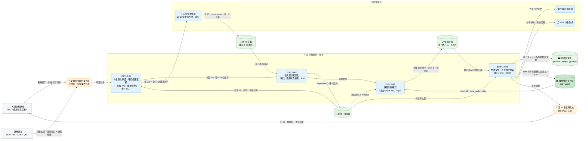

---
specdojo:
  id: prj-0001:cdfd-deprecation
  type: flow
  status: draft
  rulebook: specdojo:cdfd-rulebook
  based_on:
    - prj-0001:cdfd-init
    - prj-0001:cdfd-overview
  supersedes: []
---

# 概念データフロー図（非推奨化・保管）: SpecDojo

本書は、[[prj-0001:cdfd-overview|概念データフロー図（全体概要）]] が定める `P-10 非推奨化・保管` の境界を引き継ぎ、役割を終えた、または新 ID へ引き継がれた文書を、既存の ID と実行実績を追跡できる状態のまま現行文書と区別して保管する概念仕様である。

## 1. 目的

- BA と成果物責任者は、文書の同一性を維持する経路 A と、新しい正本を設ける経路 B の使い分け、旧文書を非推奨化して保管するまでの受入条件を合意する。
- PO は、非推奨化と移行経路を人間が承認する境界、および恒久的な削除・復元を本領域で決定しない境界を確認する。
- ARC は、旧 `id`・`local_id`・Schedule task ID を維持し、成果物カタログの `path` だけを保管先へ更新する対応を後続設計の入力に使う。
- QE は、対象文書、カタログエントリ、移動先、書換後の `path` を検査し、安全に移動できない場合の停止範囲と再開条件を確認する。

## 2. 適用範囲

- 対象は、文書を継続利用しない、または新 ID へ引き継ぐ判断が提起されてから、同一性に基づく移行経路を人間が承認し、旧文書を `deprecated` にして、プロダクトまたは同一プロジェクトの `trash/` へ移動し、成果物カタログの所在を更新するまでである。
- ID とファイルの同一性、経路 A・経路 B、`trash/` 配置の基本規則は [[specdojo:id-and-file-naming-standard|ドキュメント ID およびファイル命名標準]] に従う。本書は、非推奨化・保管に必要な判断、入出力、停止条件、領域外への委譲を正本とする。
- 経路 A は、文書の同一性を維持したファイル名・配置の変更である。`trash/` への移動は経路 A の一種であり、旧 `id` とカタログの `local_id` を変更しない。
- 経路 B は、再定義・分割・統合により新しい文書 ID を正本として設ける切替である。新 ID 文書の作成は元の文書領域へ委譲し、旧カタログエントリと旧 ID を維持したまま、旧文書の非推奨化・保管だけを本領域へ戻す。
- 一覧、状態参照、検証、dry-run は保管を安全に実行する補助操作として扱い、独立したプロセスにしない。個別コマンドのオプション、内部関数、ログ全文、恒久的な削除・復元は対象外とし、「領域外への委譲」（6.2）と「未決事項」（7章）に従う。
- 人間と AI Agent の責任分担の原則は [[prj-0001:prj-overview|プロジェクト概要]] に従う。非推奨化、文書の同一性、新しい正本、実績引継ぎの要否は人間が承認し、AI Agent とシステムは調査、計画、移動、検証を支援する。

## 3. 領域内プロセス一覧

`P-10 非推奨化・保管` は四つのプロセスに分かれる。プロセスの分割、プロセス ID、起動条件、必須性は本章を正本とし、主要入力・主要出力・データストアは「個別プロセス主要入出力」に記載する。

<!-- prettier-ignore -->
| プロセス ID | プロセス | 業務目的 | 主な担当 | 起動条件 | 必須性 |
| --- | --- | --- | --- | --- | --- |
| `P-10-01` | 非推奨化承認・移行経路選択 | 現行文書との混同を避ける必要性と文書の同一性を確認し、旧文書を残す理由と移行経路を確定する。 | PO、成果物責任者、BA | 文書が新 ID へ引き継がれた、または継続利用しないとの提案が出された | 必須 |
| `P-10-02` | 旧文書非推奨化 | 旧 ID から非推奨状態と移行先を判別でき、現行の正本と誤認されない内容にする。 | 成果物責任者、BA | 経路 A が承認された、または経路 B の新 ID 文書が正本として確定した | 必須 |
| `P-10-03` | 保管計画確認 | `local_id` から旧文書、カタログ、保管先、現在の非推奨状態を特定し、変更前に移動可能性を確認する。 | PM、ARC、QE | 旧文書の非推奨化が完了し、保管の実行が要求された | 必須 |
| `P-10-04` | 文書保管・カタログ更新 | 旧 ID と実行実績の参照を維持しながら、非推奨文書を現行文書と区別できる場所へ移す。 | PM、ARC | 保管計画が確認され、対象文書・移動先・カタログ書換結果の事前検証がすべて合格した | 必須 |

移行経路は、ファイル名の見た目ではなく文書としての同一性で選択する。

<!-- prettier-ignore -->
| 経路 | 選択条件 | ID とカタログ | Schedule への影響 | 本領域での到達点 |
| --- | --- | --- | --- | --- |
| 経路 A: ファイル名・配置のみ変更 | 呼び方または置き場所だけを変え、文書の同一性を維持する | 文書 `id` と `local_id` は不変。保管時は旧エントリの `path` だけを更新する | `local_id` から導出済みの task ID は不変で、Schedule の変更は不要 | 旧文書を `deprecated` にし、同じ ID のまま `trash/` へ保管する |
| 経路 B: 新 ID へ切替 | 文書を再定義・分割・統合し、新しい正本を別 ID で設ける | 旧エントリを維持し、新 `local_id` のエントリを別に作る。新文書は `supersedes` で旧 ID を示す | 新 `local_id` は別 task 系列の生成元になる。旧 task ID と旧実績は旧エントリに残す | 新 ID 文書の確定後、旧文書を `deprecated` と最小限の移行案内にして経路 A と同じ保管へ進める |

## 4. 概念データフロー

凡例: ノード形状・線種・色・絵文字は [[prj-0001:cdfd-overview|概念データフロー図（全体概要）]] の「凡例（本プロダクト共通）」に従う。`元の文書領域`、`P-03 計画展開`、`P-08 派生生成` は委譲先を示す代表ノードであり、内部処理は本図の対象外とする。`-->` は情報の流れであり、本図は現物の流れを扱わない。

旧文書の `id` とカタログの `local_id` は `P-10-04` の入出力を通じて不変である。したがって、既存 Schedule の task ID は本プロセスでは更新しない。経路 B で追加する新 ID とその task 系列は旧 ID とは別に扱う。

## 5. 個別プロセス主要入出力

`<project-id>` は対象となるプロジェクト ID へ置き換える総称であり、未記入の成果物値ではない。プロセス ID、業務目的、主な担当、起動条件、必須性は「領域内プロセス一覧」を参照する。

<!-- prettier-ignore -->
| プロセス ID | プロセス | 主要入力 | 主要出力 | データストア |
| --- | --- | --- | --- | --- |
| `P-10-01` | 非推奨化承認・移行経路選択 | 対象文書、利用終了・引継ぎ理由、文書の同一性、後継候補 | 非推奨化の承認結果、経路 A または経路 B、経路 B の新 ID 文書の確定条件 | 対象文書、成果物カタログ |
| `P-10-02` | 旧文書非推奨化 | 承認済み経路、旧文書、経路 B では確定済みの新 ID と `supersedes` 関係 | `status: deprecated` の旧文書、経路 B では H1 と新 ID への最小限の移行案内 | 旧文書ファイル |
| `P-10-03` | 保管計画確認 | 対象 `local_id`、成果物カタログ群、カタログの `base_path`・`path`、旧文書の `specdojo.status` | 対象カタログ、旧文書パス、保管先パス、現在 status を対応付けた保管計画 | `docs/ja/projects/<project-id>/010-deliverables-catalog/dct-*.yaml`、旧文書ファイル |
| `P-10-04` | 文書保管・カタログ更新 | 検証済みの保管計画、旧文書、該当するカタログエントリ | `trash/` へ履歴を保って移動した文書、`path` だけをルート基準の保管先へ更新した旧カタログエントリ | `docs/ja/product/trash/` または `docs/ja/projects/<project-id>/trash/`、`dct-*.yaml` |

保管時は次の不変条件を守る。

- プロダクト文書は `docs/ja/product/trash/<元のファイル名>`、プロジェクト文書は `docs/ja/projects/<project-id>/trash/<元のファイル名>` へ移す。プロジェクト文書を別プロジェクトの `trash/` へ移さない。
- カタログの先頭 `/` 付き `base_path` または `path` はリポジトリルート基準として解決する。保管後の `path` は、親 `base_path` に左右されない先頭 `/` 付きの保管先として記録する。
- 変更するカタログ項目は対象エントリ自身の `path` だけとし、`local_id`、`done_criteria`、他の項目、コメント、整形を維持する。文書 `id` と既存 Schedule task ID も変更しない。
- カタログ書換後の YAML が読め、対象 `local_id` の解決結果が予定した保管先と一致することを文書移動前に確認する。文書を移動した後に、同じカタログへ検証済みの `path` を書き込む。
- `P-10-03` は `specdojo` 名前空間から status を読み取る。`deprecated` でない、または読み取れない場合も status を自動変更せず警告対象とし、旧文書の責任者が `P-10-02` の完了を確認する。

## 6. 主要例外と領域外への委譲

### 6.1. 主要例外

<!-- prettier-ignore -->
| 例外 ID | 対象プロセス | 検出条件 | 本領域での扱い | 継続・再開条件 |
| --- | --- | --- | --- | --- |
| `E-01` | `P-10-03` | 対象 `local_id` のカタログエントリを、読み取り可能な `dct-*.yaml` から特定できない | 保管計画を確定せず、文書移動とカタログ更新を起動しない | 正しいプロジェクトと `local_id` を確認し、有効なカタログエントリを特定できた後に `P-10-03` から再開する |
| `E-02` | `P-10-04` | カタログから解決した対象文書が存在しない | カタログを書き換えず、移動を開始しない | 文書の所在とカタログ `path` の不整合を解消し、保管計画を再確認する |
| `E-03` | `P-10-04` | 予定した `trash/` の同名移動先がすでに存在する | 既存の保管文書を上書きせず、カタログを書き換えない | 既存ファイルの ID と履歴を人間が確認し、一意な保管対象と移動先を確定して保管計画を再確認する |
| `E-04` | `P-10-03` | 対象文書が `docs/ja/product/**` または同一の `docs/ja/projects/<project-id>/**` にない | 対象外の配置として停止し、任意の保管先を推測しない | 対応する成果物カタログと本領域が扱える配置を人間が確定する |
| `E-05` | `P-10-04` | 対象エントリ自身の `path` を書き換えられない、書換後 YAML を読めない、または解決結果が予定した保管先と一致しない | 文書移動前に停止し、元の文書とカタログを維持する | カタログ構造または保管計画を修正し、書換結果の事前検証が合格する |
| `E-06` | `P-10-04` | 保管先ディレクトリの準備または履歴を保つ文書移動に失敗した | カタログを書き換えず、移動結果を確認して保管完了としない | 文書が旧配置または予定した保管先のどちらにあるかを確認し、保管計画と一致させてから再実行する |
| `E-07` | `P-10-04` | 文書移動後にカタログへの書込みが失敗し、文書の所在とカタログ `path` が一致しない | 保管完了とせず、移動済み文書と未更新カタログを識別して整合回復の判断へ渡す。自動ロールバックは前提にしない | 正本とする文書位置を人間が判断し、文書位置と `path` が一致した後に検証を再実行する |

旧文書の `specdojo.status` が `deprecated` でない、または読み取れない場合、保管処理は status を書き換えない。これは対象文書の責任者へ返す警告であり、対象文書、移動先、カタログエントリに関する停止条件とは区別する。

### 6.2. 領域外への委譲

<!-- prettier-ignore -->
| 委譲先 | 委譲する事項 | 引き渡す情報 | 本領域へ戻す条件 |
| --- | --- | --- | --- |
| 元の文書領域 | 経路 B の新 ID 文書と新カタログエントリの作成、新文書の `supersedes` 設定 | 承認済みの再定義・分割・統合方針、旧 ID、旧文書、完了条件 | 新 ID 文書が正本として確定し、旧文書の移行先を案内できる |
| `P-03 計画展開`（[[prj-0001:cdfd-catalog-planning\|カタログ〜計画展開]]） | 経路 B の新 `local_id` に対する task 展開、必要な場合の旧実績引継ぎ、カタログ変更後の計画整合確認 | 維持した旧エントリ、新エントリ、承認済みの実績引継ぎ要否、更新済み `path` | 計画検証で文書 ID・依存・所在の不整合が見つかり、保管結果の再確認が必要になる |
| `P-08 派生生成`（[[prj-0001:cdfd-derived-content\|成果物・派生ビュー・索引生成]]） | 文書移動後の索引とカタログ表示の再生成 | 更新済み成果物カタログ、旧 ID、保管後の文書パス | 索引または表示から旧 ID の保管先を解決できず、文書位置またはカタログ `path` の再確認が必要になる |
| 人間のガバナンス判断 | 恒久的な削除、非推奨化の取消し、`trash/` からの復元、保管期限の方針策定 | 旧 ID、保管文書、参照・監査上の必要性、削除または復元の影響 | 方針が別途承認され、本領域の保管状態を変更する必要が生じる |

## 7. 未決事項

<!-- prettier-ignore -->
| 未決 ID | 論点 | 影響 | 決定者 | 決定時期 |
| --- | --- | --- | --- | --- |
| `U-01` | `trash/` に保管した文書の恒久的な削除、保管期限、復元・非推奨化取消しの方針 | 旧 ID と過去の Schedule task ID を追跡するため、現時点では保管文書を恒久削除できず、復元手順も確定できない | PO、文書体系の管理責任者 | 未定。本領域外のガバナンス方針として別途承認する |
