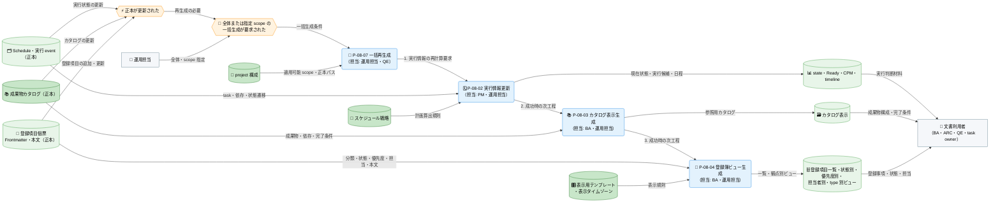
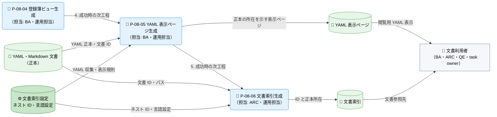
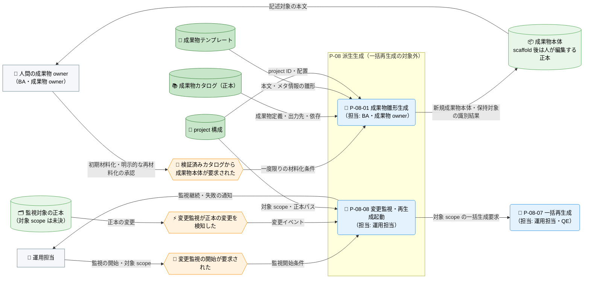

---
specdojo:
  id: prj-0001:cdfd-derived-content
  type: flow
  status: draft
  rulebook: specdojo:cdfd-rulebook
  based_on:
    - prj-0001:cdfd-register-operation
    - prj-0001:cdfd-catalog-planning
    - prj-0001:cdfd-task-execution
  supersedes: []
---

# 概念データフロー図（成果物・派生ビュー・索引生成）: SpecDojo

本書は、[[prj-0001:cdfd-overview|概念データフロー図（全体概要）]] が定める `P-08 派生生成` の境界を引き継ぎ、成果物カタログ、登録項目個票、Schedule・実行 event、YAML・Markdown 文書などの正本から、人が編集する成果物本体、表示ビュー、YAML 表示ページ、文書索引を生成する概念仕様である。

## 1. 目的

- BA は、成果物本体を一度だけ材料化する処理と、正本から何度でも再生成する派生処理を区別し、個別生成・一括再生成・変更監視の役割と起動関係を利用場面として合意する。
- ARC は、各正本と生成先の対応、直接編集してはならない派生成果物、再生成時の上書き境界を後続設計の入力として使う。
- QE は、正本不足、検証失敗、部分生成失敗、生成物の陳腐化を検知した場合の停止条件と再実行経路を確認する。
- 成果物 owner は、scaffold 後の成果物本体が人の編集する正本であり、明示的な再材料化以外では上書きされないことを確認する。

## 2. 適用範囲

- 対象は、正本の更新または派生生成の要求を起点に、成果物本体の初期材料化、実行・計画派生情報、カタログ表示、登録簿ビュー、YAML 表示ページ、文書索引を生成し、利用者が同じ正本から参照できる状態にするまでである。
- 一括再生成は、適用可能なプロセスを実行情報更新、カタログ表示生成、登録簿ビュー生成、YAML 表示ページ生成、文書索引生成の順に起動し、いずれかが失敗した時点で後続を起動しない。対象 project に必要な正本の配置がない条件付きプロセスは、一括対象から外れる。
- 成果物雛形生成は成果物本体を一度だけ材料化する処理であり、一括再生成と変更監視の対象に含めない。明示的な上書きは成果物本文全体を失い得る操作として、対象と差分を確認した人だけが承認する。
- 変更監視は正本の変更を検知して対象 scope の再生成を起動する補助経路として扱う。ただし監視対象、起動順、失敗後の監視継続は現在実装で確認できていないため、確定していない動作を本書で補わず、未決事項 `U-01` として扱う。
- Schedule 展開の算出規則、登録項目の状態遷移、成果物本文の編集、報告資料の作成は対象外とし、「領域外への委譲」（6.2）に従う。一覧、差分表示、dry-run など生成物を変更しない操作は補助操作として扱い、独立したプロセスにしない。
- 各正本の意味と状態遷移は本書で再定義しない。state・Ready・CPM・timeline の算出規則は [[prj-0001:cdfd-catalog-planning|概念データフロー図（カタログ〜計画展開）]]、個票正本と登録簿ビューの項目・状態は [[prj-0001:cdfd-register-operation|概念データフロー図（登録簿ライフサイクル）]]、成果物・result・event が生成入力として確定するまでは [[prj-0001:cdfd-task-execution|概念データフロー図（タスク実行ライフサイクル）]] を正とする。本書は、生成処理と生成先の対応、一括起動順、直接編集・上書き境界、部分失敗・陳腐化後の再実行を横断的な正本とする。
- 人間と AI Agent の責任分担の原則は [[prj-0001:prj-overview|プロジェクト概要]] に従う。成果物本文の内容、明示的な上書き、生成先の所有権の判断は人間が担い、派生生成では決定しない。

## 3. 領域内プロセス一覧

`P-08 派生生成` は八つのプロセスに分かれる。プロセスの分割、プロセス ID、プロセス間の受け渡しに関する規則は本書を正本とする。主要入力・主要出力・データストアは「個別プロセス主要入出力」に記載する。

<!-- prettier-ignore -->
| プロセス ID | プロセス | 業務目的 | 主な担当 | 起動条件 | 必須性 |
| --- | --- | --- | --- | --- | --- |
| `P-08-01` | 成果物雛形生成 | カタログで合意した成果物を、人が記述を始められる本体ファイルとして一度だけ材料化する。 | BA、成果物 owner | 検証済みカタログに基づき、成果物本体の初期材料化または明示的な再材料化が承認された | 条件付き。初期生成または承認済みの再材料化のときだけ起動し、一括再生成・変更監視では起動しない |
| `P-08-02` | 実行情報更新 | task owner が同じ時点の実行状態、Ready、日程・依存情報を参照できるようにする。 | PM、運用担当 | Schedule または実行 event が更新され、実行情報の再生成が要求された | 条件付き。Schedule と実行記録の配置がある project でだけ起動する |
| `P-08-03` | カタログ表示生成 | 成果物の構成、依存、完了条件を利用者が参照できる表示へ同期する。 | BA、運用担当 | 成果物カタログが更新され、カタログ表示の再生成が要求された | 条件付き。成果物カタログの配置がある project でだけ起動する |
| `P-08-04` | 登録簿ビュー生成 | 個票の現在値を、一覧と状態・優先度・担当・type の観点で確認できるようにする。 | BA、運用担当 | 登録項目個票が更新され、登録簿ビューの再生成が要求された | 条件付き。登録簿の配置がある project でだけ起動する |
| `P-08-05` | YAML 表示ページ生成 | YAML 正本を文書利用者が閲覧でき、正本の所在も判別できる Markdown 表示へ同期する。 | BA、運用担当 | 対象 YAML が更新され、表示ページの再生成が要求された | 必須。project 構成に依存せず起動し、対象 YAML がなければ生成なしで完了する |
| `P-08-06` | 文書索引生成 | 人と AI Agent が文書 ID から正本の所在を一意に解決できる索引を提供する。 | ARC、運用担当 | 文書が追加・移動・更新され、索引の再構築が要求された | 必須。project 構成に依存せず起動する |
| `P-08-07` | 一括再生成 | 関連する派生物を既定順で更新し、途中失敗後の古い後続生成物を最新と誤認させない。 | 運用担当、QE | 全体または指定 scope の一括生成が要求された | 必須。指定 scope では該当プロセスだけを起動する |
| `P-08-08` | 変更監視・再生成起動 | 正本変更後の再生成忘れを減らし、利用者が古い派生物を参照する時間を短くする。 | 運用担当 | 変更監視が開始され、監視対象の正本変更を検知した | 条件付き。開発・継続編集中に監視を開始した場合だけ起動する |

利用者が起動する操作との対応は、`deliverable scaffold` が `P-08-01`、`exec refresh` が `P-08-02`、`catalog build` が `P-08-03`、`register build` が `P-08-04`、`yaml-pages build` が `P-08-05`、`index build` が `P-08-06`、一括 `build` が `P-08-07`、`watch` が `P-08-08` である。

## 4. 概念データフロー

一括再生成に組み込まれるプロセスのうち project 構成に依存するものと文書全体を対象とするもの、および一括再生成の外で起動するプロセスでは、起動条件と参照する正本が異なるため、フローを三つの図に分ける。図間で登場する `P-08-07 一括再生成`、`登録簿ビュー生成`、`成果物カタログ`、`project 構成` は、同一のプロセスおよびデータストアを指す。

### 4.1. project 構成に依存するプロセスのフロー（P-08-02〜P-08-04・P-08-07）

凡例: ノード形状・線種・色・絵文字は [[prj-0001:cdfd-overview|概念データフロー図（全体概要）]] の「凡例（本プロダクト共通）」に従う。番号付きのエッジは一括再生成の既定の起動順を示す。`登録簿ビュー生成` の後続（`P-08-05`・`P-08-06`）は文書全体を対象とするプロセスのフロー（4.2）、一括再生成の外で起動する `P-08-01` と `P-08-08` は一括再生成の外で起動するプロセスのフロー（4.3）を参照する。本図は現物の流れを扱わない。

### 4.2. 文書全体を対象とするプロセスのフロー（P-08-05・P-08-06）

凡例: ノード形状・線種・色・絵文字は [[prj-0001:cdfd-overview|概念データフロー図（全体概要）]] の「凡例（本プロダクト共通）」に従う。`登録簿ビュー生成` は project 構成に依存するプロセスのフロー（4.1）と同一のプロセスを指し、その内部の起動順・入力は 4.1 を参照する。番号付きのエッジは一括再生成の既定の起動順を示す。本図は現物の流れを扱わない。

### 4.3. 一括再生成の外で起動するプロセスのフロー（P-08-01・P-08-08）

凡例: ノード形状・線種・色・絵文字は [[prj-0001:cdfd-overview|概念データフロー図（全体概要）]] の「凡例（本プロダクト共通）」に従う。`P-08-07 一括再生成`、`成果物カタログ`、`project 構成` は project 構成に依存するプロセスのフロー（4.1）と同一の対象を指し、その内部の起動順は 4.1・4.2 を参照する。変更監視の未確定な動作は未決事項 `U-01` を参照する。本図は現物の流れを扱わない。

## 5. 個別プロセス主要入出力

`<domain>` はカタログの対象ドメイン、`<name>` は YAML 正本のファイル名に置き換える総称であり、未記入の成果物値ではない。プロセス ID・業務目的・主な担当・起動条件・必須性は「領域内プロセス一覧」を参照する。

### 5.1. project 構成に依存するプロセス（P-08-02〜P-08-04・P-08-07）

正本の更新を、利用者が参照する派生物へ既定順で展開するプロセス群のうち、対象 project に正本の配置がある場合だけ参加する部分である。

<!-- prettier-ignore -->
| プロセス ID | プロセス | 主要入力 | 主要出力 | データストア |
| --- | --- | --- | --- | --- |
| `P-08-02` | 実行情報更新 | Schedule、実行 event、スケジュール戦略 | state、Ready、CPM、critical path、timeline | project 構成が指す Schedule・実行記録の領域 |
| `P-08-03` | カタログ表示生成 | 成果物カタログ | 成果物の構成・依存・完了条件を示すカタログ表示 | 成果物カタログと同階層の `generated/dct-<domain>.md` |
| `P-08-04` | 登録簿ビュー生成 | 登録項目個票の Frontmatter・本文、表示用テンプレート、表示タイムゾーン | 登録項目一覧、状態別・優先度別・担当者別ビュー、type 別管理ビュー | 登録簿と同階層の `generated/` 配下の各ビュー |
| `P-08-07` | 一括再生成 | project 構成、対象 scope | 適用可能プロセスの順次起動結果、失敗時の停止結果と失敗プロセスの識別 | project 構成、各派生生成先 |

### 5.2. 文書全体を対象とするプロセス（P-08-05・P-08-06）

正本の更新を、利用者が参照する派生物へ既定順で展開するプロセス群のうち、project 単位ではなく文書全体を対象とするため常に参加する部分である。

<!-- prettier-ignore -->
| プロセス ID | プロセス | 主要入力 | 主要出力 | データストア |
| --- | --- | --- | --- | --- |
| `P-08-05` | YAML 表示ページ生成 | 文書 ID を持つ対象 YAML、文書索引設定 | 正本の所在注記と本文を載せた YAML 表示ページ、上書きしない既存ページの通知 | YAML 正本と同階層の `generated/<name>.md` |
| `P-08-06` | 文書索引生成 | Markdown Frontmatter の文書 ID、YAML の文書 ID、ネスト ID 設定、言語設定 | 文書 ID と正本パスの対応、言語別パス | `.specdojo/doc-index.json` |

`P-08-05` は対象 YAML を探すために文書索引を実行時に収集するが、生成済みの索引ファイルを入力の正本とはしない。このため一括再生成では YAML 表示ページを先に生成し、その後 `P-08-06` で文書索引を再構築する。

### 5.3. 一括再生成の外で起動するプロセス（P-08-01・P-08-08）

成果物本体を一度だけ材料化するプロセスと、正本の変更を検知して一括再生成を起動するプロセスである。いずれも一括再生成の内部工程には含まれない。

<!-- prettier-ignore -->
| プロセス ID | プロセス | 主要入力 | 主要出力 | データストア |
| --- | --- | --- | --- | --- |
| `P-08-01` | 成果物雛形生成 | 成果物カタログ、成果物テンプレート、project ID | テンプレート適用済みまたは最小構成の成果物本体、既存として保持した対象の一覧 | カタログが指す Markdown / YAML の成果物本体 |
| `P-08-08` | 変更監視・再生成起動 | 正本の変更イベント、project 構成、対象 scope | 対象 scope の一括生成要求、監視継続または失敗の通知 | 監視対象の正本、project 構成 |

`P-08-01` の対象は、カタログで作業対象として定義され、出力先を持つ成果物である。対応するテンプレートがない場合は、カタログから確定できるメタ情報、名称、概要と、本文が未記入であることを示す最小構成を生成する。既存ファイルを保持したままの完了が正常経路であり、明示的な再材料化は通常の派生再生成と分離する。

### 5.4. 直接編集と再生成時の上書き境界

生成物のうち人が編集してよいのは、`P-08-01` が材料化した成果物本体だけである。ほかの生成物は正本から再生成する派生物であり、直接編集した内容は次の再生成で失われる。

<!-- prettier-ignore -->
| プロセス ID | 生成物の直接編集 | 再生成時の上書き境界 |
| --- | --- | --- |
| `P-08-01` | scaffold 後の成果物本体は人が編集する正本 | 既存成果物は既定で保持する。明示的な上書きを承認した場合だけファイル全体を置換し、既存本文の差分を失う |
| `P-08-02` | 不可 | 同じ Schedule・実行 event から全体を再計算する。個別の派生情報だけを手修正して正本化しない |
| `P-08-03` | 不可 | カタログ正本から表示全体を再構築する |
| `P-08-04` | 不可 | 生成ビューへの追記・修正は失われる。修正は個票へ行う |
| `P-08-05` | 不可 | 専用の生成マーカーを持つページだけを更新し、別処理または人が所有する既存ページは上書きしない。内容が同一なら書き込まない |
| `P-08-06` | 不可 | `generated/` 配下を収集対象から除外し、正本の文書 ID とパスから索引全体を再構築する |
| `P-08-07`・`P-08-08` | 不可（固有の生成物を持たない） | 起動した各プロセスの境界に従い、生成物を独自に書き換えない |

## 6. 主要例外と領域外への委譲

### 6.1. 主要例外

<!-- prettier-ignore -->
| 例外 ID | 対象プロセス | 検出条件 | 本領域での扱い | 継続・再開条件 |
| --- | --- | --- | --- | --- |
| `E-01` | `P-08-01`〜`P-08-07` | 必要な正本・project 構成がない、指定した project を解決できない、対象 scope に適用可能なプロセスが一つもない、または正本を解析できない | 生成を行わずに失敗として終了し、以前の生成物を更新済みとは扱わない。修正対象の正本または構成を返す | 正本・参照・project 構成を補正し、失敗した scope を再実行する。下流生成物へ影響する場合は後続 scope も既定順で再実行する |
| `E-02` | `P-08-01` | 出力先に既存の成果物本体がある、または複数成果物の一部だけを生成できなかった | 既存成果物は既定で上書きせず、保持対象として通知する。部分生成を成果物集合全体の完了とは扱わず、生成済みと未生成の対象を区別する | 未生成の原因を解消して対象だけを再実行する。既存成果物の再材料化は、人が対象と失われる本文差分を確認して明示した場合だけ行う |
| `E-03` | `P-08-02`〜`P-08-07` | 一つの派生生成が失敗して終了した、読み取り・書き込みに失敗した、または一部を書き込んだ後に失敗した | 一括経路をその処理で停止し、後続を起動しない。書き込み済みの生成物と未更新の生成物が混在し得るため、生成先全体を最新とは扱わない | 原因を解消して失敗した scope を再実行し、成功を確認した後に停止していた後続 scope を既定順で再実行する |
| `E-04` | `P-08-04` | 個票 Frontmatter が不正、表示 ID が重複、または個票ファイル名と文書 ID が一致しない | 登録簿ビューを確定せず、生成ビューを編集して補正しない | 個票正本と参照を修正し、登録簿ビュー生成、続いて文書索引生成を再実行する |
| `E-05` | `P-08-05` | 生成先に YAML 表示ページ用の生成マーカーを持たない既存 Markdown がある、または対象 YAML 正本を読み取れない | 既存ページを別の所有物として上書きせず、対象を通知する。読み取り失敗時は対象 YAML を示して生成を中断し、表示が同期済みとは扱わない | 生成先の所有権と正しい配置を人が決定し、競合または読み取り失敗を解消して YAML 表示ページ生成と文書索引生成を再実行する |
| `E-06` | `P-08-06` | 同一スコープの文書 ID が重複する、または言語中立 ID と言語別 ID が混在する | 索引の再構築を停止し、競合した ID とパスを特定する。既存索引を新しい文書集合に対する最新索引とは扱わない | ID または配置を修正し、文書索引生成を再実行して一意な索引を生成する |
| `E-07` | `P-08-02`〜`P-08-08` | 正本更新後に対象生成が未実行、監視が停止、生成が失敗、または生成対象から外れた古いファイルが残り、正本と派生物の一致を確認できない | 派生物を陳腐化の可能性ありとして扱い、正本へ逆書き戻ししない。対象 scope の再生成結果と差分で影響範囲を確認する | 対象 scope と下流の文書索引生成を再実行し、終了結果と生成差分を確認する。不要生成物の削除方針は未決事項 `U-02` に従う |

対象 project に正本の配置がないために `P-08-02`〜`P-08-04` を起動しないことは例外ではない。適用可能なプロセスが一つ以上あり、それらがすべて成功すれば一括再生成は正常に完了する。同様に、`P-08-01` を起動せず既存の成果物本体を使い続けること、`P-08-08` を起動せず手動で一括再生成を要求することも正常経路である。

### 6.2. 領域外への委譲

<!-- prettier-ignore -->
| 委譲先 | 委譲する事項 | 引き渡す情報 | 本領域へ戻す条件 |
| --- | --- | --- | --- |
| `P-02 登録簿ライフサイクル`（[[prj-0001:cdfd-register-operation\|登録簿ライフサイクル]]） | 生成失敗や上書き判断など、計画外の対応・判断を継続管理する | 失敗対象、影響する生成物、必要判断、暫定措置、再開条件 | 個票正本と承認判断が確定し、対象 scope を再実行できる |
| `P-03 計画展開`（[[prj-0001:cdfd-catalog-planning\|カタログ〜計画展開]]） | Schedule・実行 event から state、Ready、CPM、timeline を算出する規則を定める | Schedule、実行 event、スケジュール戦略、検証結果 | 算出した計画情報を本領域の一括再生成または利用者へ引き渡せる |
| `P-04 タスク実行`（[[prj-0001:cdfd-task-execution\|タスク実行ライフサイクル]]） | 成果物本文、result、実行 event の正本を変更し、検証・統合する | 対象成果物、plan、完了条件、生成物の不整合・判断要求 | 統合済みの成果物・result・event を入力として派生物を再生成するとき |
| `P-09 報告`（[[prj-0001:cdfd-reporting\|進捗監視・報告・ログ管理]]） | 派生ビューと索引を、進捗・判断・申し送りのための情報へまとめる | カタログ表示、登録簿ビュー、実行情報、文書索引、陳腐化・失敗の有無 | 報告で正本更新または追加判断が必要になり、該当領域で更新が完了した |
| 人間の成果物 owner | 成果物本体の内容、明示的な上書き、生成先の所有権競合、不要生成物の採否を判断する | 既存本文、生成予定の差分、正本と派生物の所有境界、公開・利用への影響 | 判断が記録され、正本修正または安全な再生成を開始できる |

## 7. 未決事項

| ID     | 未決事項                                                                                                                                                       | 影響                                                                             | 決定者            | 決定時期          |
| ------ | -------------------------------------------------------------------------------------------------------------------------------------------------------------- | -------------------------------------------------------------------------------- | ----------------- | ----------------- |
| `U-01` | _UNDECIDED_: 変更監視の監視対象、対象 scope、起動順、失敗後の監視継続、および YAML 表示ページ生成を含めるかを、現在実装の追加調査で確定する                    | `P-08-08` の現在動作と、一括再生成と同じ停止・再実行保証を持つかを確定できない   | ARC、BA、QE       | 本成果物の review |
| `U-02` | _UNDECIDED_: 正本削除・対象外化により不要になったカタログ表示、登録簿ビュー、YAML 表示ページ、索引項目を自動削除するか、検証で検知して人が削除するかを決定する | 古い生成物が残る場合の陳腐化判定、削除権限、誤削除からの復旧条件を一意にできない | ARC、QE、運用担当 | 派生生成の設計前  |
