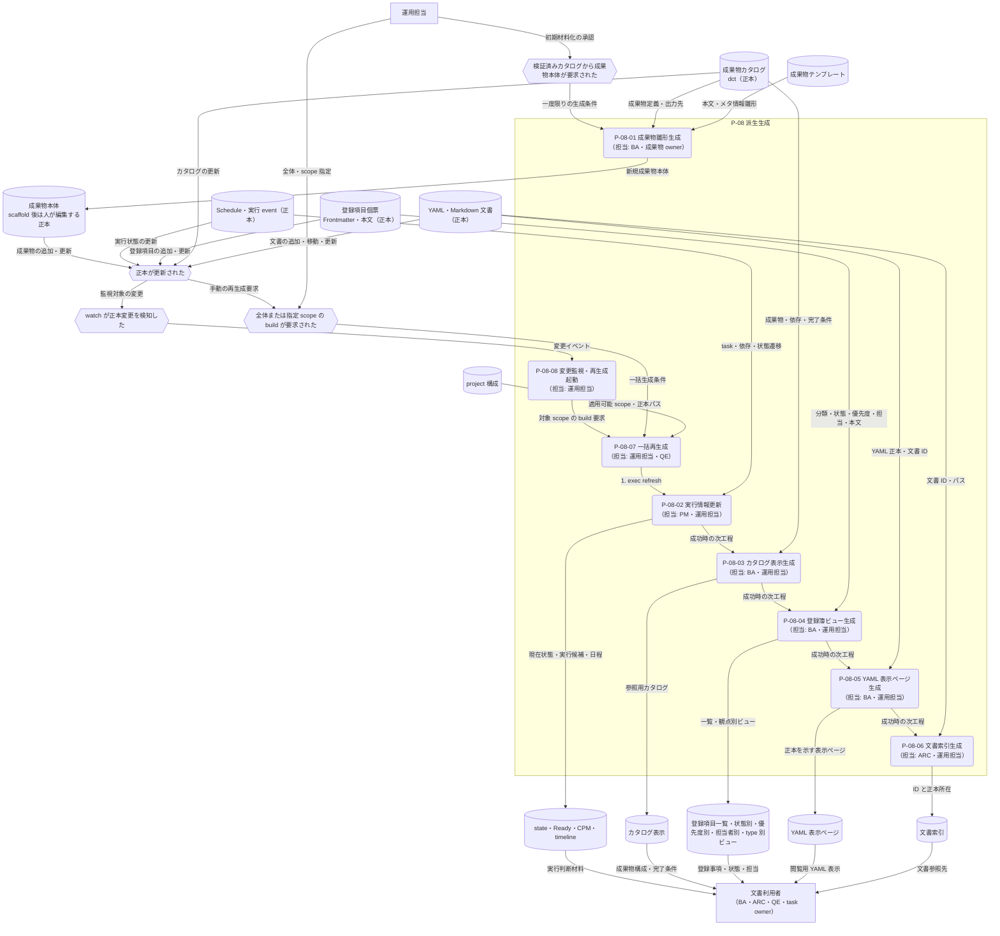

---
specdojo:
  id: prj-0001:cdfd-derived-content
  type: flow
  status: draft
  rulebook: specdojo:cdfd-rulebook
  based_on:
    - prj-0001:cdfd-register-operation
    - prj-0001:cdfd-catalog-planning
    - prj-0001:cdfd-task-execution
  supersedes: []
---

# 概念データフロー図（成果物・派生ビュー・索引生成）: SpecDojo

本書は、[[prj-0001:cdfd-overview|概念データフロー図（全体概要）]] が定める `P-08 派生生成` の境界を引き継ぎ、成果物カタログ、登録項目個票、Schedule・実行 event、YAML・Markdown 文書などの正本から、人が編集する成果物本体、表示ビュー、YAML 表示ページ、文書索引を生成する現行フローを定義する。BA と運用担当が、正本を一度だけ材料化する処理と再生成可能な派生処理を区別し、ARC と QE が上書き境界、停止条件、再実行経路を確認するために使用する。

## 1. 目的と適用範囲

- 対象者は、文書体系の利用場面と受入条件を整理する BA、生成元・生成先・編集境界を設計入力にする ARC、生成失敗と陳腐化の検知・復旧を確認する QE、派生生成を実行する運用担当である。
- 対象は、`deliverable scaffold`、`exec refresh`、`catalog build`、`register build`、`yaml-pages build`、`index build` と、一括 `build`・変更監視 `watch` による起動関係である。Schedule 展開、登録項目の状態遷移、成果物本文の編集、報告資料の作成は対象外とする。
- 成果物カタログ、テンプレート、登録項目個票の Frontmatter・本文、Schedule、実行 event、YAML・Markdown 文書を正本とする。成果物本体は scaffold 後に人が編集する正本であり、カタログ表示、登録項目一覧・状態別・優先度別・担当者別・type 別ビュー、実行状態ビュー、YAML 表示ページ、文書索引は再生成可能な派生物である。
- `deliverable scaffold` は成果物本体を一度だけ材料化し、既存成果物を既定で保持する。一括 `build` と `watch` の対象に含めず、明示的な上書き指定は成果物本文全体を失い得る操作として、対象と差分を確認した人だけが行う。
- 一括 `build` は適用可能な処理を `exec refresh`、`catalog build`、`register build`、`yaml-pages build`、`index build` の順に実行し、いずれかが失敗した時点で後続を起動しない。対象 project に必要なパスが未設定の処理は一括実行から除外される。
- `watch` は正本の変更を検知して対象 scope の再生成を起動する補助経路として扱う。ただし、指定された実装エビデンスでは監視対象、起動順、`yaml-pages` の参加を確認できないため、確定していない動作を本書で補わない。
- 本領域の価値は、人と AI Agent が同じ正本から再現可能な参照情報を得て、手作業の転記と属人的な同期負荷を減らすことにある。社会課題、期待価値、成果物本文、主要判断、公開可否は人間が責任を持ち、派生生成で決定しない。

### 1.1. 正本・生成先・編集境界

<!-- prettier-ignore -->
| 処理 | 主な正本 | 生成先 | 直接編集 | 再生成時の境界 |
| --- | --- | --- | --- | --- |
| `deliverable scaffold` | 成果物カタログ、成果物テンプレート | カタログが指す Markdown / YAML 成果物本体 | scaffold 後は可 | 既存成果物は既定で保持する。明示的な上書き指定ではファイル全体が置換対象となる |
| `exec refresh` | Schedule、実行 event、スケジュール戦略 | state、Ready、CPM、critical path、timeline などの実行・計画派生情報 | 不可 | 同じ正本から再計算し、個別の派生情報だけを手修正しない |
| `catalog build` | 成果物カタログ（`dct-*.yaml`） | `generated/dct-*.md` のカタログ表示 | 不可 | カタログ正本から再構築する |
| `register build` | 一項目一ファイルの個票 Frontmatter・本文 | 登録項目一覧、状態別・優先度別・担当者別ビュー、type 別管理ビュー | 不可 | 生成ビューへの追記・修正は失われる。修正は個票へ行う |
| `yaml-pages build` | 文書索引の収集対象となる YAML 正本 | YAML と同階層の `generated/<name>.md` | 不可 | 専用生成マーカーを持つページだけを更新し、別処理または人が所有する既存ページは上書きしない |
| `index build` | Markdown Frontmatter、YAML の文書 ID、設定されたネスト ID | `.specdojo/doc-index.json` | 不可 | `generated/` 配下を収集対象外とし、正本の ID とパスから全体を再構築する |

[[prj-0001:cdfd-catalog-planning|概念データフロー図（カタログ〜計画展開）]] を、`exec refresh` が扱う state・Ready・CPM・timeline の算出規則の正とする。[[prj-0001:cdfd-register-operation|概念データフロー図（登録簿ライフサイクル）]] を、個票正本と登録簿ビューの項目・状態の正とする。[[prj-0001:cdfd-task-execution|概念データフロー図（タスク実行ライフサイクル）]] を、成果物・result・event が生成入力として確定するまでの正とする。

本書は、各正本の意味や状態遷移を再定義せず、生成処理と生成先の対応、一括起動順、直接編集・上書き境界、部分失敗・陳腐化後の再実行を横断的な正本とする。

## 2. 領域内プロセス一覧

<!-- prettier-ignore -->
| プロセス ID | プロセス | 業務目的 | 主な担当 | 起動条件 | 主要入力 | 主要出力・生成先 | 正本・データストア | 必須性 |
| --- | --- | --- | --- | --- | --- | --- | --- | --- |
| `P-08-01` | 成果物雛形生成 | カタログで合意した成果物を、人が記述を始められる本体ファイルとして一度だけ材料化する。 | BA、成果物 owner | 初期カタログが検証され、成果物本体の作成が要求された | 成果物カタログ、テンプレート、project ID | テンプレート適用済みまたは最小構成の成果物本体 | 成果物カタログ・テンプレート → 成果物本体 | 条件付き。初期生成または明示的な再材料化時だけ実施し、一括 `build`・`watch` では起動しない |
| `P-08-02` | 実行情報更新 | task owner が同じ時点の実行状態、Ready、日程・依存情報を参照できるようにする。 | PM、運用担当 | Schedule または実行 event が更新された、または `exec refresh` が要求された | Schedule、実行 event、スケジュール戦略 | state、Ready、CPM、critical path、timeline | Schedule・実行 event → 実行・計画派生情報 | project に Schedule と実行記録のパスがある場合に必須 |
| `P-08-03` | カタログ表示生成 | 成果物の構成、依存、完了条件を利用者が参照できる表示へ同期する。 | BA、運用担当 | 成果物カタログが更新された、または `catalog build` が要求された | 成果物カタログ | カタログ表示 → `generated/dct-*.md` | 成果物カタログ → カタログ派生ビュー | project に成果物カタログのパスがある場合に必須 |
| `P-08-04` | 登録簿ビュー生成 | 個票の現在値を、一覧と状態・優先度・担当・type の観点で確認できるようにする。 | BA、運用担当 | 登録項目個票が更新された、または `register build` が要求された | 登録項目個票、表示用テンプレート、表示タイムゾーン | 登録項目一覧、状態別・優先度別・担当者別ビュー、type 別管理ビュー | 登録項目個票 → 登録簿派生ビュー | project に登録簿のパスがある場合に必須 |
| `P-08-05` | YAML 表示ページ生成 | YAML 正本を文書利用者が閲覧でき、正本の所在も判別できる Markdown 表示へ同期する。 | BA、運用担当 | 対象 YAML が更新された、または `yaml-pages build` が要求された | 文書 ID を持つ対象 YAML、文書索引設定 | YAML と同階層の `generated/<name>.md` | YAML 正本 → YAML 表示ページ | 必須。対象 YAML がない場合は生成なし |
| `P-08-06` | 文書索引生成 | 人と Agent が文書 ID から正本の所在を一意に解決できる索引を提供する。 | ARC、運用担当 | 文書が追加・移動・更新された、または `index build` が要求された | Markdown Frontmatter、YAML 文書 ID、ネスト ID 設定、言語設定 | 文書 ID とパスの索引 → `.specdojo/doc-index.json` | 文書正本・索引設定 → 文書索引 | 必須 |
| `P-08-07` | 一括再生成 | 関連する派生物を既定順で更新し、途中失敗後の古い後続生成物を最新と誤認させない。 | 運用担当、QE | 全体または指定 scope の `build` が要求された | project 構成、実行対象 scope | `P-08-02`〜`P-08-06` の順次起動結果、失敗時の停止結果 | project 構成、各正本、各派生生成先 | 必須。指定 scope では該当プロセスだけを起動する |
| `P-08-08` | 変更監視・再生成起動 | 正本変更後の再生成忘れを減らし、利用者が古い派生物を参照する時間を短くする。 | 運用担当 | `watch` が開始され、監視対象の正本変更を検知した | 変更イベント、project、対象 scope | 対象 build の起動要求、監視継続または失敗通知 | 正本変更イベント、project 構成 | 条件付き。開発・継続編集時に使用する |

`P-08-01` の対象はカタログの `kind: work` かつ出力 path を持つ成果物である。対応テンプレートがなければ、カタログから確定できる Frontmatter、名称、概要と未記入を示す最小本文を生成する。既存ファイルの保持が正常経路であり、明示的な再材料化は通常の派生再生成と分離する。

`P-08-05` は、対象 YAML を探すために文書索引をメモリ上で収集するが、生成済み `.specdojo/doc-index.json` を入力の正本とはしない。このため一括 `build` では YAML 表示ページを先に生成し、その後 `P-08-06` で文書索引を再構築する。

## 3. 概念データフロー

凡例: 角丸長方形は一つのプロセス、六角形は起点・変更イベント、円柱は正本または継続的な生成先、四角は外部主体、`-->` は情報の流れを表す。一括経路のエッジは既定の起動順を示し、指定 scope または `watch` では対象プロセスだけを起動できる。対象 project にパスが未設定の任意処理は飛ばす。本図は情報の流れだけを扱い、現物の流れは対象外とする。

## 4. 主要例外と領域外への委譲

### 4.1. 主要例外

<!-- prettier-ignore -->
| 例外 ID | 対象プロセス | 検出条件 | 本領域での扱い | 継続・再開条件 |
| --- | --- | --- | --- | --- |
| `E-01` | `P-08-01`〜`P-08-07` | 必要な正本・project パスがない、正本を解析できない、または入力検証が不合格になった | 対象プロセスを失敗とし、一括経路では後続を起動しない。以前の生成物を更新済みとは扱わず、正本または構成の修正対象を返す | 正本・参照・構成を補正し、失敗した scope を再実行する。下流生成物へ影響する場合は後続 scope も順に再実行する |
| `E-02` | `P-08-01` | 出力先に既存の成果物本体がある、または複数成果物の一部だけを生成できなかった | 既存成果物は既定で上書きせず保持する。部分生成を成果物集合全体の完了とは扱わず、生成済みと未生成の対象を区別する | 未生成原因を解消して対象だけを再実行する。既存成果物の再材料化は、人が対象と失われる本文差分を確認して明示した場合だけ行う |
| `E-03` | `P-08-02`〜`P-08-07` | 一つの派生生成が非ゼロ終了した、読み取り・書き込みに失敗した、または一部を書き込んだ後に失敗した | 一括経路をその処理で停止する。既に書き込まれた生成物と未更新の生成物が混在し得るため、生成先全体を最新とは扱わない | 原因を解消し、失敗した scope を再実行して成功を確認した後、停止していた後続 scope を既定順で再実行する |
| `E-04` | `P-08-04` | 個票 Frontmatter が不正、表示 ID が重複、または個票ファイル名と文書 ID が一致しない | 登録簿ビューを確定せず、生成ビューを編集して補正しない | 個票正本と参照を修正し、`register build`、続いて `index build` を再実行する |
| `E-05` | `P-08-05` | 生成先に YAML 表示ページ用の生成マーカーを持たない既存 Markdown がある | 既存ページを別の所有物として上書きせず、skip 対象を通知する。YAML 正本の表示が同期済みとは扱わない | 生成先の所有権と正しい配置を人が決定し、競合を解消して `yaml-pages build` と `index build` を再実行する |
| `E-06` | `P-08-06` | 同一スコープの文書 ID が重複する、または言語中立 ID と言語別 ID が混在する | 索引の再構築を停止し、競合 ID とパスを特定する。既存索引を新しい文書集合に対する最新索引とは扱わない | ID または配置を修正し、`index build` を再実行して一意な索引を生成する |
| `E-07` | `P-08-02`〜`P-08-08` | 正本更新後に対象生成が未実行、監視が停止、生成が失敗、または生成対象から外れた古いファイルが残り、正本と派生物の一致を確認できない | 派生物を陳腐化の可能性ありとして扱い、正本へ逆書き戻ししない。対象 scope の再生成結果と差分で影響範囲を確認する | 対象 scope と下流の `index build` を再実行し、終了結果と生成差分を確認する。不要生成物の削除方針は未決事項 `U-02` に従う |

### 4.2. 領域外への委譲

| 委譲先             | 委譲する事項                                                             | 引き渡す情報                                                       | 本領域へ戻す条件                                                   |
| ------------------ | ------------------------------------------------------------------------ | ------------------------------------------------------------------ | ------------------------------------------------------------------ |
| `P-02 登録簿運用`  | 生成失敗や上書き判断など、計画外の対応・判断を継続管理する               | 失敗対象、影響する生成物、必要判断、暫定措置、再開条件             | 個票正本・承認判断が確定し、対象 scope を再実行できる              |
| `P-03 計画展開`    | Schedule・event から state、Ready、CPM、timeline を再計算する            | Schedule、実行 event、戦略、検証結果                               | 再計算した計画情報を本領域の一括生成または利用者へ引き渡せる       |
| `P-04 タスク実行`  | 成果物本文、result、event の正本を変更し、検証・統合する                 | 対象成果物、plan、done criteria、生成物の不整合・判断要求          | 統合済みの成果物・result・event を入力として派生物を再生成するとき |
| `P-09 報告`        | 派生ビューと索引を、進捗・判断・申し送りのための情報へまとめる           | カタログ表示、登録簿ビュー、実行情報、文書索引、陳腐化・失敗の有無 | 報告で正本更新または追加判断が必要になり、該当領域で更新が完了した |
| 人間の成果物 owner | 成果物本体の内容、明示的な上書き、生成先競合、不要生成物の採否を判断する | 既存本文、生成予定差分、正本と派生物の所有境界、公開・利用への影響 | 判断が記録され、正本修正または安全な再生成を開始できる             |

### 4.3. 受入確認

| 確認者       | 確認対象               | 受入条件                                                                                                                                                                         |
| ------------ | ---------------------- | -------------------------------------------------------------------------------------------------------------------------------------------------------------------------------- |
| BA           | 利用場面と起動関係     | 初期の `deliverable scaffold`、個別生成、一括 `build`、変更監視 `watch` の役割と、`exec` → `catalog` → `register` → `yaml-pages` → `index` の既定順を表と図から説明できる        |
| ARC          | 正本・生成先・編集境界 | 個票 Frontmatter から登録項目一覧・状態別・優先度別・担当者別・type 別ビューが生成されることを含め、各正本と生成先、直接編集不可の派生物、再生成・明示的上書きの境界を識別できる |
| QE           | 停止条件と再実行       | 正本不足・検証失敗・部分生成失敗・ID 重複・生成先競合・陳腐化について、停止する後続、古い生成物の扱い、失敗 scope と下流 scope の再実行順を判定できる                            |
| 成果物 owner | 成果物本体の保護       | scaffold 後の成果物本体が人の編集する正本であり、一括 `build`・`watch` では上書きされず、明示的な再材料化の前に失われる本文差分を確認する必要があると判断できる                  |

## 5. 未決事項

| ID     | 未決事項                                                                                                                                                       | 影響                                                                              | 決定者            | 決定時期          |
| ------ | -------------------------------------------------------------------------------------------------------------------------------------------------------------- | --------------------------------------------------------------------------------- | ----------------- | ----------------- |
| `U-01` | _UNDECIDED_: `watch` の監視対象、scope、起動順、失敗後の監視継続、および `yaml-pages build` を含めるかを、現在実装の追加調査で確定する                         | `P-08-08` の現在動作と、一括 `build` と同じ停止・再実行保証を持つかを確定できない | ARC、BA、QE       | 本成果物の review |
| `U-02` | _UNDECIDED_: 正本削除・対象外化により不要になったカタログ表示、登録簿ビュー、YAML 表示ページ、索引項目を自動削除するか、検証で検知して人が削除するかを決定する | 古い生成物が残る場合の陳腐化判定、削除権限、誤削除からの復旧条件を一意にできない  | ARC、QE、運用担当 | 派生生成の設計前  |
