---
specdojo:
  id: cdfd-do
  type: flow
  status: draft
  rulebook: specdojo:cdfd-rulebook
  based_on:
    - cdfd-overview
  supersedes: []
---

# 概念データフロー図（Do）: SpecDojo

## 1. 目的

Do プロセスグループのタスク実行について、実行指示の受入から成果物と検証可能な実行記録の引き渡しまでを詳細化する。BA と PO は人間の承認・完了判断を含む責任境界を合意し、ARC は実行計画、Kata、稼働構成、成果物、登録簿、実行記録の読み書きと並行実行時の隔離・統合を設計入力として利用し、QE は成果の採否と再開位置を変える主要例外を検証へ利用する。

この境界を共通化することで、限られた参加者が人または AI Agent へ作業を引き継いでも、上位の目的を保った成果と判断可能な記録を残せるようにする。

## 2. 適用範囲

- 対象グループは Do、対象領域はタスク実行（P-07）の一領域である。
- 開始は Orchestrator から実行指示を受けた時点、終了は成果物または登録項目への対応結果、検証結果、実行記録、実行状態を後続へ引き渡した時点とする。
- 組織上は PM、各タスクの owner ロール、人または AI Agent である実行主体、承認と完了確定を担う人間を境界に含む。AI Agent は実行と記録を支援できるが、保護対象の変更承認とタスクの完了確定は行わない。また、agent による保護設定の変更は承認の有無にかかわらず保護機構でブロックし、人間または対話型 Orchestrator が実行外で適用する。
- システム上は実行環境、タスクごとに隔離された worktree、統合ブランチまでを扱う。Git リポジトリ、worktree、統合ブランチ自体は業務データストアとして扱わない。
- Schedule task、対象登録項目への対応、Job はすべて同じ内部プロセスを通る。Job ではジョブ定義を追加の実行基準とし、定期実行では Orchestrator から指示されるたびに同じフローを反復する。並行実行ではタスクごとの worktree で遂行・検証し、検証済みの変更だけを条件付きで統合ブランチへ merge する。
- 対象外は、参照・検索・状態表示などの補助操作、コマンドやファイル単位の実装手順、Plan・Check・Action・Orchestrator の内部処理、複数グループを横断する完了までの順序、状態の定義と遷移である。他グループとの受け渡しは「主要例外とグループ外への委譲」、状態は「状態遷移の参照」で指し先だけを示す。

人間と AI Agent の責任分担は [[cdfd-overview|概念データフロー図（全体概要）]] の「適用範囲」を前提とし、本書では Do の境界に必要な事項だけを示す。

## 3. プロセス領域

Do グループはタスク実行（P-07）の一領域で構成する。領域 ID と名称、およびグループ単位の主要入力・主要出力・データストアは [[cdfd-overview|概念データフロー図（全体概要）]] を正本とする。

### 3.1. タスク実行（P-07）

実行指示と実行基準を一つのタスクとして受け入れ、人または AI Agent が Kata に従って遂行・検証する。並行実行で隔離した変更は検証後に統合し、正常結果と例外結果のどちらも後続が判断できる実行記録として残す。

- **主要入力**: Orchestrator からの実行要求、実行計画、ジョブ定義、対象成果物、対象登録項目、Kata の rulebook・recipe・template、稼働構成の agent 定義・権限
- **主要出力**: 作成・更新した成果物、登録項目の状態遷移、実行記録（result）、実行状態（ブロック・判断依頼を含む）
- **データストア**: Kata、稼働構成、実行計画、ジョブ定義、登録簿、実行記録、成果物

| プロセス ID | プロセス     | 業務目的                                                                                       | 主な担当                                                                 | 起動条件                                                                                                           | 必須性                                                                                                                 |
| ----------- | ------------ | ---------------------------------------------------------------------------------------------- | ------------------------------------------------------------------------ | ------------------------------------------------------------------------------------------------------------------ | ---------------------------------------------------------------------------------------------------------------------- |
| `P-07-01`   | 実行受入     | 実行対象、基準、実行主体、利用可能な権限を対応付け、遂行可否と隔離方法を判断可能にする。       | PM（受入処理は runner が支援）                                           | Orchestrator から実行要求があり、対応する実行計画と対象を特定できる。                                              | 必須。利用制限、入力不足、承認待ちの場合も、遂行せず実行結果記録へ渡す。                                               |
| `P-07-02`   | タスク遂行   | Kata と実行基準に従って、対象成果物または登録項目に対するタスク結果を作る。                    | 各タスクの owner ロール（人または AI Agent。保護設定の実行外適用を除く） | 実行受入で遂行可能と判定され、実行主体と隔離方法が確定した。                                                       | 必須。Job はジョブ定義も実行基準とし、並行実行は割り当てられた worktree 内で行う。                                     |
| `P-07-03`   | 成果検証     | 実行計画の完了条件に照らした検証結果と evidence をそろえ、成果を統合・引き渡せるか判定する。   | 各タスクの owner ロール（検証処理は runner が支援）                      | タスク遂行による成果候補または Job の実行結果が得られた。                                                          | 必須。検証失敗時は成果統合へ進めず、失敗結果を実行結果記録へ渡す。                                                     |
| `P-07-04`   | 成果統合     | 並行実行で隔離した検証済み変更を統合ブランチへ merge し、後続が参照できる成果にする。          | PM（統合処理は runner が支援）                                           | worktree に検証済みの変更があり、統合が必要で、保護対象に必要な人間の承認がそろった。                              | 条件付き。隔離 worktree を使わない場合または統合対象の変更がない場合は起動せず、検証結果をそのまま実行結果記録へ渡す。 |
| `P-07-05`   | 実行結果記録 | 成果、検証・統合結果、ブロック、判断依頼を追跡可能に記録し、後続の評価と人間の完了判断へ渡す。 | 各タスクの owner ロール（記録処理は AI Agent が支援）                    | 検証・統合の結果が確定した、または遂行を止める利用制限、入力不足、承認待ち、保護機構のブロック、失敗が検出された。 | 必須。対象が登録項目なら対応する状態遷移も記録するが、タスクの完了確定は行わず Action の人間判断へ委ねる。             |

## 4. データストア

### 4.1. マスタ・構成データ

| データストア | 読み書き | 本グループでの利用                                                                                            |
| ------------ | -------- | ------------------------------------------------------------------------------------------------------------- |
| Kata         | 参照     | `P-07-01` で適用する rulebook・recipe・template を特定し、`P-07-02` と `P-07-03` の実行・検証基準として使う。 |
| 稼働構成     | 参照     | `P-07-01` で agent 定義・権限と runner による実行可否を確認し、実行主体と利用制限を判断する。                 |
| ジョブ定義   | 参照     | Job として指示された場合に `P-07-01` で対象を特定し、`P-07-02` と `P-07-03` の実行手順・成功条件として使う。  |

### 4.2. トランザクションデータ

| データストア | 読み書き   | 本グループでの利用                                                                                                   |
| ------------ | ---------- | -------------------------------------------------------------------------------------------------------------------- |
| 実行計画     | 参照       | `P-07-01` で対象、手順、完了条件を受け取り、`P-07-02` と `P-07-03` の遂行・検証基準として使う。                      |
| 登録簿       | 参照・更新 | 対象登録項目を `P-07-01` と `P-07-02` で参照し、対応内容と `P-07-05` で確定した状態遷移を記録する。                  |
| 実行記録     | 更新       | `P-07-05` で result、evidence、実行状態、ブロック、保護設定の変更差分、判断依頼、Job の実行結果を記録する。          |
| 成果物       | 参照・更新 | 対象成果物を `P-07-01` と `P-07-02` で参照し、`P-07-02` で作成・更新した後、`P-07-03` の検証と必要な統合を反映する。 |

## 5. 概念データフロー

### 5.1. タスク実行の流れ

```mermaid
flowchart LR
  classDef process fill:#e3f2fd,stroke:#1e88e5,color:#000
  classDef event fill:#fff3e0,stroke:#fb8c00,color:#000
  classDef storeMaster fill:#a5d6a7,stroke:#1b5e20,color:#000
  classDef storeTransaction fill:#e8f5e9,stroke:#43a047,color:#000

  Orchestrator("🎛️ Orchestrator<br>P-14")
  Start{{"⚡ 実行指示された"}}
  Accept("📥 P-07-01 実行受入<br>（担当: PM）")
  Execute("⚙️ P-07-02 タスク遂行<br>（担当: owner ロール）")
  Verify("🧪 P-07-03 成果検証<br>（担当: owner ロール）")
  Integrate("🔀 P-07-04 成果統合<br>（担当: PM）")
  Record("🧾 P-07-05 実行結果記録<br>（担当: owner ロール）")
  PreconditionsUnmet{{"⚠️ 遂行不可と判定された"}}
  ProtectedChangeBlocked{{"⚠️ 保護設定変更が<br>ブロックされた"}}
  ValidationFailed{{"⚠️ 検証失敗と判定された"}}
  IntegrationNeeded{{"🔀 統合が必要と判定された"}}
  IntegrationSkipped{{"➡️ 統合不要と判定された"}}
  IntegrationFailed{{"⚠️ 統合失敗と判定された"}}
  Check("🔍 Check<br>P-08〜P-10")
  Kata[("📐 Kata")]
  Config[("🧩 稼働構成")]
  Job[("🧰 ジョブ定義")]
  Plan[("📋 実行計画")]
  Register[("📒 登録簿")]
  ExecLog[("🧾 実行記録")]
  Deliverables[("📄 成果物")]

  Orchestrator -->|"実行要求"| Start
  Start -->|"実行開始条件"| Accept
  Kata -->|"rulebook・recipe・template"| Accept
  Config -->|"agent 定義・権限"| Accept
  Job -->|"Job の実行基準"| Accept
  Plan -->|"対象・手順・完了条件"| Accept
  Register -->|"対象登録項目"| Accept
  Deliverables -->|"対象成果物"| Accept

  Accept -->|"受入済みタスク"| Execute
  Accept -->|"利用制限・入力不足・承認待ち"| PreconditionsUnmet
  PreconditionsUnmet -->|"ブロック・判断依頼"| Record
  Execute -->|"agent による保護設定変更"| ProtectedChangeBlocked
  ProtectedChangeBlocked -->|"変更差分・判断依頼"| Record
  Execute -->|"成果物の作成・更新"| Deliverables
  Execute -->|"登録項目への対応内容"| Register
  Execute -->|"成果候補・実行結果"| Verify
  Verify -->|"検証失敗・evidence"| ValidationFailed
  ValidationFailed -->|"失敗結果"| Record
  Verify -->|"検証済みの隔離変更"| IntegrationNeeded
  IntegrationNeeded -->|"統合開始条件"| Integrate
  Verify -->|"統合対象なし"| IntegrationSkipped
  IntegrationSkipped -->|"検証結果"| Record
  Integrate -->|"統合済み成果"| Record
  Integrate -->|"統合失敗"| IntegrationFailed
  IntegrationFailed -->|"失敗結果"| Record
  Record -->|"登録項目の状態遷移"| Register
  Record -->|"result・evidence・実行状態"| ExecLog
  Record -->|"成果・実行結果"| Check
  Record -->|"実行状態"| Orchestrator

  class Orchestrator,Accept,Execute,Verify,Integrate,Record,Check process
  class Start,PreconditionsUnmet,ProtectedChangeBlocked,ValidationFailed,IntegrationNeeded,IntegrationSkipped,IntegrationFailed event
  class Kata,Config,Job storeMaster
  class Plan,Register,ExecLog,Deliverables storeTransaction
```

凡例は [[cdfd-overview|概念データフロー図（全体概要）]] の「凡例（本プロダクト共通）」に従う。`-->` は情報の流れであり、本図は物の流れを対象外とする。図は一つのため別図と共有するノードはない。個別プロセスの詳細な入出力は「個別プロセス主要入出力」、例外の再開条件は「主要例外とグループ外への委譲」、状態の定義と遷移は「状態遷移の参照」へ分離し、図から省略する。Check、Orchestrator はグループ境界を示す代表ノードだけを置き、内部プロセスは省略する。

## 6. 個別プロセス主要入出力

### 6.1. タスク実行（P-07）

| プロセス ID | プロセス     | 主要入力                                                                                                               | 主要出力                                                                               | データストア                                         |
| ----------- | ------------ | ---------------------------------------------------------------------------------------------------------------------- | -------------------------------------------------------------------------------------- | ---------------------------------------------------- |
| `P-07-01`   | 実行受入     | 実行要求、実行計画、条件付きのジョブ定義、対象成果物または対象登録項目、Kata、agent 定義・権限                         | 受入済みタスク、実行主体、遂行可否、worktree 隔離の要否                                | Kata、稼働構成、ジョブ定義、実行計画、登録簿、成果物 |
| `P-07-02`   | タスク遂行   | 受入済みタスク、Kata の実践の型、実行計画、条件付きのジョブ定義、対象成果物または対象登録項目                          | 成果候補、Job の実行結果、成果物の作成・更新、登録項目への対応内容、保護設定の変更差分 | Kata、ジョブ定義、実行計画、登録簿、成果物           |
| `P-07-03`   | 成果検証     | 成果候補または Job の実行結果、実行計画の完了条件、Kata の検証基準                                                     | 検証結果、evidence、統合可否                                                           | Kata、実行計画、登録簿、成果物                       |
| `P-07-04`   | 成果統合     | worktree の検証済み変更、人間による必要な承認、統合ブランチの受入条件                                                  | 統合済み成果または統合失敗結果                                                         | 成果物                                               |
| `P-07-05`   | 実行結果記録 | 成果、検証結果、evidence、条件付きの統合結果、ブロック理由、保護設定の変更差分または判断依頼、対象登録項目への対応結果 | 実行記録（result）、実行状態、登録項目の状態遷移、後続へ引き渡す成果                   | 登録簿、実行記録、成果物                             |

## 7. 状態遷移の参照

本書は状態を変えるプロセスと起点だけを示し、状態名、意味、成立条件、遷移元・遷移先・遷移条件を定義しない。

| 対象     | 状態を変えるプロセス   | ステータス定義（STSD） |
| -------- | ---------------------- | ---------------------- |
| 登録項目 | `P-07-05` 実行結果記録 | `stsd-register-entry`  |
| 実行記録 | `P-07-05` 実行結果記録 | `stsd-job-run`         |

本書では状態内容を代替定義せず、状態一覧と状態遷移図は各 STSD を参照する。

## 8. 主要例外とグループ外への委譲

### 8.1. 主要例外

| 例外 ID   | 対象プロセス                           | 検出条件                                                                                           | 本グループでの扱い                                                                                                                                                   | 継続・再開条件                                                                                                                                                            |
| --------- | -------------------------------------- | -------------------------------------------------------------------------------------------------- | -------------------------------------------------------------------------------------------------------------------------------------------------------------------- | ------------------------------------------------------------------------------------------------------------------------------------------------------------------------- |
| `E-07-01` | `P-07-01` 実行受入                     | 稼働構成の権限または利用制限により、指定された人、AI Agent、runner が必要な処理を実行できない。    | 遂行を開始せず、影響するタスクだけをブロックして、制限内容と代替実行主体の判断依頼を記録する。                                                                       | 権限内の実行主体または方法が人間により選択され、実行計画と対応付けられた後に `P-07-01` から再開する。                                                                     |
| `E-07-02` | `P-07-02` タスク遂行                   | 人間の承認の有無にかかわらず、agent の実行が保護設定を変更する差分を生じさせ、保護機構が検知した。 | 保護設定の変更を適用せず、`P-07-03` 以降を停止する。変更差分、必要性、影響、再開位置を result へ申し送り、人間または対話型 Orchestrator による実行外適用へ委譲する。 | 人間または対話型 Orchestrator が実行外で変更を適用し、適用結果が確認され、Orchestrator から再開要求が発行された後に `P-07-01` から再開する。不採用時は `P-07-05` へ進む。 |
| `E-07-03` | `P-07-03` 成果検証                     | 実行計画の完了条件または Job の成功条件を満たさない検証結果が一つ以上ある。                        | 成果を採用・統合せず、失敗した条件と evidence を記録し、影響するタスクをブロックする。                                                                               | 修正可能な場合は失敗原因に対応後 `P-07-02`、再検証だけでよい場合は `P-07-03` から再開し、すべての条件を再判定する。                                                       |
| `E-07-04` | `P-07-04` 成果統合                     | 検証済みの worktree 変更を統合ブランチへ merge できず、統合済み成果を特定できない。                | 未統合の変更を成果として引き渡さず、競合または受入条件の不成立と、成功済みの検証範囲を記録する。                                                                     | 競合または受入条件が解消され、影響範囲を再検証した後に `P-07-04` から再開する。                                                                                           |
| `E-07-05` | `P-07-01` 実行受入、`P-07-04` 成果統合 | 保護設定以外の保護対象の変更または統合に必要な人間の承認が確認できない。                           | 対象を変更・統合せず、未着手なら `P-07-02` 以降、統合待ちなら統合を停止し、承認対象、影響、判断依頼を実行記録へ残す。                                                | 権限を持つ人間が承認または不採用を判断し、承認時は未着手なら `P-07-01`、統合待ちなら `P-07-04` から再開する。不採用時は `P-07-05` へ進む。                                |

### 8.2. グループ外への委譲

| 委譲先                                                    | 委譲する事項                                             | 引き渡す情報                                                           | 本グループへ戻す条件                                                                        |
| --------------------------------------------------------- | -------------------------------------------------------- | ---------------------------------------------------------------------- | ------------------------------------------------------------------------------------------- |
| [[cdfd-orchestrator\|概念データフロー図（Orchestrator）]] | タスクの起動、再開、実行主体と保護設定の実行外適用の調整 | 実行状態、ブロック理由、保護設定の変更差分、判断依頼、再開位置         | 必要な判断と保護設定の適用結果がそろい、実行要求または再開要求が発行された。                |
| [[cdfd-check\|概念データフロー図（Check）]]               | 成果物、登録項目への対応結果、実行記録の独立した評価     | 作成・更新した成果物、登録項目への対応結果、result、evidence、実行状態 | 評価結果が確定し、再実行が要求された場合は Orchestrator から新たな実行要求が発行された。    |
| [[cdfd-action\|概念データフロー図（Action）]]             | 評価後の人間による承認、タスクの完了確定、再計画判断     | Check の評価対象となった成果・実行結果と、Check からの評価結果         | 人間の判断により再実行または改善が必要となり、Orchestrator から新たな実行要求が発行された。 |
| [[cdfd-uc-register\|概念データフロー図（登録項目）]]      | 登録項目の起票から評価・完了記録までのグループ横断順序   | 対象登録項目、対応内容、状態遷移、実行記録                             | 登録項目への追加対応が必要と判断され、新たな実行要求が発行された。                          |
| [[cdfd-uc-deliverable\|概念データフロー図（成果物）]]     | 成果物の定義から評価・完了記録までのグループ横断順序     | 対象成果物、作成・更新した成果、検証結果、実行記録                     | 成果物への追加対応が必要と判断され、新たな実行要求が発行された。                            |

委譲先の文書はすべて現存するため Wiki リンクで参照し、内部プロセスを本書へ展開しない。
