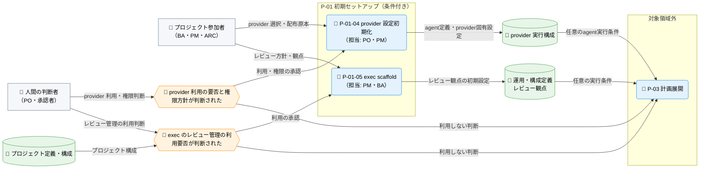

---
specdojo:
  id: prj-0001:cdfd-init
  type: flow
  status: draft
  rulebook: specdojo:cdfd-rulebook
  based_on:
    - prj-0001:cdfd-overview
  supersedes: []
---

# 概念データフロー図（初期セットアップ）: SpecDojo

本書は、[[prj-0001:cdfd-overview|概念データフロー図（全体概要）]] が定める `P-01 初期セットアップ` の境界を引き継ぎ、プロジェクト開始の承認を、計画と実行を始められる正本の初期状態へ展開する概念データフローである。

## 1. 目的

BA が必須の初期化と任意設定の境界を整理し、PO、ARC、QE が起動条件、入出力、主要例外、領域外への委譲を同じ表と図から確認するために使用する。対象者は、必須・任意の境界を承認する PO、初期化要件を整理する BA、正本の生成先を設計入力にする ARC、主要例外の分岐を確認する QE である。

## 2. 適用範囲

- 対象は、プロジェクト開始が承認されてから、config の雛形を対象プロジェクト用に確定し、register、catalog の初期状態を作り、必要な場合だけ provider 実行構成・実行補助設定を準備して、計画展開へ引き渡すまでである。
- config init、register scaffold、catalog scaffold を必須プロセス、provider 設定初期化と exec scaffold を条件付きプロセスとする（詳細は「領域内プロセス一覧」を参照）。
- 既存ファイルの継続利用・置換判断、入力不足・不正、生成失敗・部分生成を主要例外として扱う。個別コマンドのオプション、物理的な書き込み手順、内部エラーの全列挙は対象外とする。
- 登録簿の日常運用、計画展開、タスク実行、運用中の provider・agent・構成変更は対象外とし、「領域外への委譲」（6.2）に従う。
- 人間と AI Agent の責任分担の原則は [[prj-0001:prj-overview|プロジェクト概要]] に従う。既存正本の置換、provider 利用・権限方針の承認は人間が行う。

## 3. 領域内プロセス一覧

`P-01 初期セットアップ` は五つのプロセスに分かれる。プロセスの分割、プロセス ID、プロセス間の受け渡しに関する規則は本書を正本とする。主要入力・主要出力・データストアは「個別プロセス主要入出力」に記載する。

<!-- prettier-ignore -->
| プロセス ID | プロセス | 業務目的 | 主な担当 | 起動条件 | 必須性 |
| --- | --- | --- | --- | --- | --- |
| `P-01-01` | config 初期化 | プロジェクト ID と文書配置の起点を定め、後続 scaffold が同じプロジェクトを参照できる状態にする。 | BA、PM | 新しいプロジェクトの開始が承認された | 必須 |
| `P-01-02` | register scaffold | 計画外事項と判断を個票で記録し、一覧を再生成できる登録簿の初期受け皿を用意する。 | BA、PM | config 初期化が完了し、登録簿の生成先が確定した | 必須 |
| `P-01-03` | catalog scaffold | 管理する成果物、依存、完了条件を定義できるカタログの初期受け皿を用意する。 | BA、ARC | config 初期化が完了し、カタログの生成先と対象規模が確定した | 必須 |
| `P-01-04` | provider 設定初期化 | 承認済みの provider 利用方針を、agent 定義と provider 固有設定からなる実行構成へ展開する。 | PO、PM | provider の利用と権限方針が承認され、配布原本から対象 provider を選択できる | 条件付き |
| `P-01-05` | exec scaffold | 承認済みのレビュー方針を、exec が参照する実行補助設定の初期状態へ展開する。 | PM、BA | exec のレビュー管理を利用する方針が承認され、レビュー設定の生成先が確定した | 条件付き |

## 4. 概念データフロー

必須プロセス（`P-01-01`〜`P-01-03`）と条件付きプロセス（`P-01-04`・`P-01-05`）は、`P-03 計画展開` への合流以外に直接の依存がないため、フローを二つの図に分ける。条件付きプロセスの図では、利用を承認して起動する経路と、利用しないと判断して起動せずに計画展開へ進む正常経路を分ける。両図に登場する `プロジェクト定義・構成` と `P-03 計画展開` は同一のノードを指す。

### 4.1. 必須プロセスのフロー（P-01-01〜P-01-03）

```mermaid
flowchart LR
  classDef process fill:#e3f2fd,stroke:#1e88e5,color:#000
  classDef event fill:#fff3e0,stroke:#fb8c00,color:#000
  classDef store fill:#e8f5e9,stroke:#43a047,color:#000
  classDef actor fill:#f5f7fa,stroke:#607d8b,color:#000

  人間判断者["👤 人間の判断者<br>（PO・承認者）"]
  プロジェクト参加者["👥 プロジェクト参加者<br>（BA・PM・ARC）"]

  開始承認{{"🚦 新しいプロジェクトの開始が承認された"}}
  必須初期化完了{{"✅ 必須の初期化が完了した"}}

  subgraph 初期セットアップ["P-01 初期セットアップ（必須）"]
    direction TB
    config初期化("⚙️ P-01-01 config 初期化<br>（担当: BA・PM）")
    registerScaffold("📋 P-01-02 register scaffold<br>（担当: BA・PM）")
    catalogScaffold("🗂️ P-01-03 catalog scaffold<br>（担当: BA・ARC）")
  end

  プロジェクト構成[("📐 プロジェクト定義・構成")]
  登録簿[("📒 登録簿")]
  成果物カタログ[("📚 成果物カタログ")]

  subgraph 領域外["対象領域外"]
    計画展開("🧭 P-03 計画展開")
  end

  人間判断者 -->|"開始承認"| 開始承認
  開始承認 -->|"開始条件"| config初期化
  プロジェクト参加者 -->|"プロジェクト文脈・ID・配置方針"| config初期化
  config初期化 -->|"プロジェクト構成"| プロジェクト構成

  プロジェクト構成 -->|"配置・プロジェクトID"| registerScaffold
  registerScaffold -->|"登録簿領域・案内・初期生成ビュー"| 登録簿
  プロジェクト構成 -->|"配置・プロジェクトID"| catalogScaffold
  プロジェクト参加者 -->|"規模・対象ドメイン・置換値"| catalogScaffold
  catalogScaffold -->|"成果物定義・依存・完了条件"| 成果物カタログ

  プロジェクト構成 -->|"config初期化結果"| 必須初期化完了
  登録簿 -->|"register scaffold結果"| 必須初期化完了
  成果物カタログ -->|"catalog scaffold結果"| 必須初期化完了
  必須初期化完了 -->|"計画開始条件"| 計画展開
  成果物カタログ -->|"成果物・依存・完了条件"| 計画展開
  プロジェクト構成 -->|"計画方針"| 計画展開

  class config初期化,registerScaffold,catalogScaffold,計画展開 process
  class 開始承認,必須初期化完了 event
  class プロジェクト構成,登録簿,成果物カタログ store
  class 人間判断者,プロジェクト参加者 actor
```

凡例: ノード形状・線種・色・絵文字は [[prj-0001:cdfd-overview|概念データフロー図（全体概要）]] の「凡例（本プロダクト共通）」に従う。`P-03 計画展開` は委譲先を示す領域外の代表ノードであり、内部処理は本図の対象外とする。条件付きプロセスの起動条件・生成物は条件付きプロセスのフロー（4.2）を参照する。本図は現物の流れを扱わない。

### 4.2. 条件付きプロセスのフロー（P-01-04・P-01-05）

凡例: ノード形状・線種・色・絵文字は [[prj-0001:cdfd-overview|概念データフロー図（全体概要）]] の「凡例（本プロダクト共通）」に従う。`利用しない判断` は、該当する条件付きプロセスを起動せず、必須プロセスの完了結果だけで `P-03 計画展開` へ進む正常経路を表す。`P-03 計画展開` は委譲先を示す領域外の代表ノードであり、内部処理は本図の対象外とする。`プロジェクト定義・構成` の生成、および必須プロセスの起動条件・生成物は、必須プロセスのフロー（4.1）を参照する。本図は現物の流れを扱わない。

## 5. 個別プロセス主要入出力

`<project-id>`、`<domain>`、`<provider>` は対象プロジェクト、選択した成果物ドメイン、provider に置き換える総称であり、未記入の成果物値ではない。`generated/pjr-index.md` は個票から再生成する派生ビューであり、追跡対象の `pjr-index.md` は同ビューへの案内を担う。本書は初回の受け皿作成だけを正本とし、派生ビューの生成順・上書き・再実行規則は [[prj-0001:cdfd-derived-content|概念データフロー図（成果物・派生ビュー・索引生成）]] を参照する。プロセス ID・業務目的・主な担当・起動条件・必須性は「領域内プロセス一覧」を参照する。

### 5.1. 必須プロセス（P-01-01〜P-01-03）

config init、register scaffold、catalog scaffold は計画開始に必要な必須プロセスであり、いずれも完了して初めて計画展開へ引き渡せる。

<!-- prettier-ignore -->
| プロセス ID | プロセス | 主要入力 | 主要出力 | データストア |
| --- | --- | --- | --- | --- |
| `P-01-01` | config 初期化 | プロジェクト文脈、プロジェクト ID、文書・実行領域の配置方針 | 設定雛形を対象プロジェクト用に確定したプロジェクト構成 | `.specdojo/specdojo.config.json` |
| `P-01-02` | register scaffold | プロジェクト構成、登録簿の配置方針 | 登録簿領域、追跡対象の案内ページ、初期生成ビュー | `docs/ja/projects/<project-id>/controls/project-register/pjr-index.md`、`generated/pjr-index.md` |
| `P-01-03` | catalog scaffold | プロジェクト構成、成果物カタログのテンプレート、プロジェクト規模、対象ドメイン、置換値 | 選択条件を反映したカタログ初期ファイル | `docs/ja/projects/<project-id>/010-deliverables-catalog/dct-<domain>.yaml` |

### 5.2. 条件付きプロセス（P-01-04・P-01-05）

provider 設定初期化と exec scaffold は、それぞれの利用方針が承認され、必要入力がそろった場合だけ起動する独立した任意プロセスである。

<!-- prettier-ignore -->
| プロセス ID | プロセス | 主要入力 | 主要出力 | データストア |
| --- | --- | --- | --- | --- |
| `P-01-04` | provider 設定初期化 | provider 利用方針、権限方針、provider テンプレート | provider 実行構成、後続の手動設定確認事項 | `.<provider>/agents/`、`.specdojo/<provider>/` |
| `P-01-05` | exec scaffold | プロジェクト構成、レビュー方針、レビュー観点 | レビュー観点の初期設定 | `.specdojo/pm-review-viewpoints.yaml` |

## 6. 主要例外と領域外への委譲

### 6.1. 主要例外

| 例外 ID | 対象プロセス | 検出条件                                                                                                                       | 本領域での扱い                                                                                                                                                     | 継続・引き渡し条件                                                                     |
| ------- | ------------ | ------------------------------------------------------------------------------------------------------------------------------ | ------------------------------------------------------------------------------------------------------------------------------------------------------------------ | -------------------------------------------------------------------------------------- |
| `E-01`  | 全プロセス   | 生成先に既存ファイルまたは既存領域がある                                                                                       | 既存正本を既定で置換せず、ファイル単位の継続利用・差分追加・明示的な置換の判断対象と、影響する後続プロセスを提示する。置換は当該正本の責任者が承認した場合だけ行う | 採用する正本が一意になり、未生成または置換対象を識別できた後に対象プロセスから再開する |
| `E-02`  | 全プロセス   | プロジェクト ID、生成先、プロジェクト規模、対象ドメイン、provider テンプレート、または条件付き設定の必須入力が不足・不正である | 不足・不正な入力と影響する生成物を返し、依存する scaffold を起動しない。完了済みの正本は確定状態のまま保持する                                                     | 入力が補完・修正され、起動条件と生成対象を再評価できる                                 |
| `E-03`  | 全プロセス   | 雛形の読込、ディレクトリ・ファイルの生成、または生成後の確認に失敗し、生成物を正本として確定できない                           | 失敗対象、書き込み済みの生成物、未生成・未確定の生成物を分けて記録し、その対象を必須とする引き渡しを成立させない。確定済みの別成果物は自動で巻き戻さない           | 失敗原因が解消され、対象プロセスの生成と確認が成功する                                 |

条件付きの `P-01-04` または `P-01-05` を起動しない判断は例外ではない。provider・実行補助設定が不要であることを確認できれば、必須三プロセスだけで正常に完了する。

### 6.2. 領域外への委譲

| 委譲先                                                                                      | 委譲する事項                                               | 引き渡す情報                                                                 | 本領域へ戻す条件                                                     |
| ------------------------------------------------------------------------------------------- | ---------------------------------------------------------- | ---------------------------------------------------------------------------- | -------------------------------------------------------------------- |
| `P-02 登録簿運用`（[[prj-0001:cdfd-register-operation\|登録簿ライフサイクル]]）             | 初期 scaffold 後の登録項目の追加、状態更新、判断の継続管理 | 登録簿領域、採用した配置、初期化時に発生した判断事項                         | 登録簿の配置または初期構造そのものを再初期化する承認がある           |
| `P-03 計画展開`（[[prj-0001:cdfd-catalog-planning\|カタログ〜計画展開]]）                   | 成果物カタログと計画方針から Schedule・実行計画を作る処理  | プロジェクト構成、成果物・依存・完了条件、任意のレビュー観点・agent 実行条件 | 計画展開に必要な初期正本が不足または未確定と判明する                 |
| `P-04 タスク実行`（[[prj-0001:cdfd-task-execution\|タスク実行ライフサイクル]]）             | edit / review plan に基づく成果物編集、検証、result 記録   | 実行可能タスク、対象成果物、レビュー観点、provider 実行構成                  | 承認済みの実行補助設定または provider 実行構成が未生成と判明する     |
| `P-07 構成変更`（[[prj-0001:cdfd-agent-config-operation\|agent・provider 構成の運用変更]]） | 運用開始後の provider、agent、プロジェクト構成の変更       | 現行構成、provider 実行構成、変更要求、承認結果                              | 初回セットアップの未完了が原因で、変更対象となる現行構成が存在しない |
