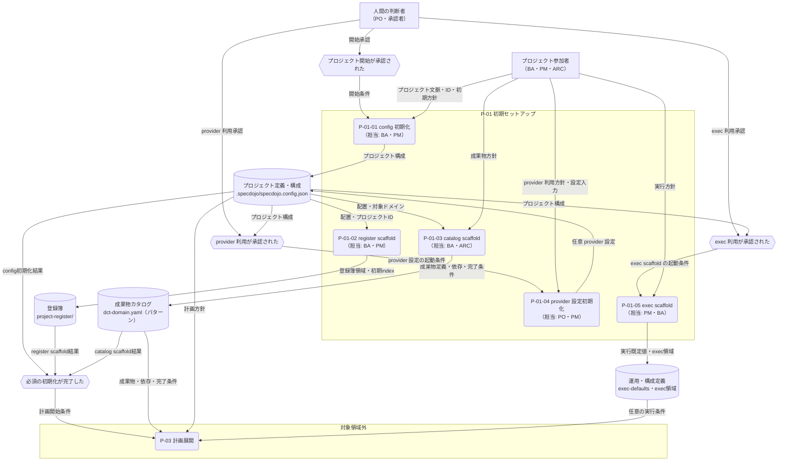

---
specdojo:
  id: prj-0001:cdfd-init
  type: flow
  status: draft
  rulebook: specdojo:cdfd-rulebook
  based_on:
    - prj-0001:cdfd-overview
  supersedes: []
---

# 概念データフロー図（初期セットアップ）: SpecDojo

本書は、プロジェクト開始の承認を、計画と実行を始められる正本の初期状態へ展開する `P-01 初期セットアップ` の TO-BE フローを定義する。BA が必須の初期化と任意設定の境界を整理し、PO、ARC、QE が起動条件、生成物、主要例外、領域外への引き渡しを同じ表と図から確認するために使用する。

## 1. 目的と適用範囲

- 対象者は、必須・任意の境界を承認する PO、初期化要件と受入条件を整理する BA、正本と生成先を設計入力にする ARC、主要例外の分岐を確認する QE である。
- 対象は、プロジェクト開始が承認されてから、config、register、catalog の初期状態を作り、必要な場合だけ provider・実行補助設定を準備し、計画展開へ引き渡すまでである。
- config init、register scaffold、catalog scaffold は計画開始に必要な必須プロセスとする。provider 設定初期化と exec scaffold は、それぞれの利用方針が承認され、必要入力がそろった場合だけ起動する独立した任意プロセスとする。
- 既存ファイルの継続利用・置換判断、入力不足、生成失敗を主要例外として扱う。個別コマンドのオプション、物理的な書き込み手順、実装エビデンスは後続の retrofit-pass へ委譲する。
- 登録項目の日常運用は `P-02 登録簿運用`、カタログからの Schedule・実行計画生成は `P-03 計画展開`、タスクの実行は `P-04 タスク実行`、運用中の provider・agent・構成変更は `P-07 構成変更` の責務とし、本領域では作り込まない。
- 社会課題、期待価値、公開方針、provider 利用、既存正本の置換に関する最終判断は人間が担い、AI Agent は初期値の提案、生成、検証を支援できる。

## 2. 領域内プロセス一覧

<!-- prettier-ignore -->
| プロセス ID | プロセス | 業務目的 | 主な担当 | 起動条件 | 主要入力 | 主要出力・生成先 | 正本・データストア | 必須性 |
| --- | --- | --- | --- | --- | --- | --- | --- | --- |
| `P-01-01` | config 初期化 | プロジェクト ID と文書配置の起点を定め、後続 scaffold が同じプロジェクトを参照できる状態にする。 | BA、PM | プロジェクト開始が承認された | プロジェクト文脈、プロジェクト ID、初期方針 | プロジェクト構成 → `.specdojo/specdojo.config.json` | プロジェクト定義・構成 | 必須 |
| `P-01-02` | register scaffold | 計画外事項と判断を記録できる登録簿の初期受け皿を用意する。 | BA、PM | config 初期化が完了した | プロジェクト構成、登録簿の配置方針 | 登録簿領域 → `docs/ja/projects/<project-id>/controls/project-register/`、初期 index | 登録簿 | 必須 |
| `P-01-03` | catalog scaffold | 管理する成果物、依存、完了条件を定義できるカタログの初期受け皿を用意する。 | BA、ARC | config 初期化が完了した | プロジェクト構成、対象ドメイン、成果物方針 | カタログ初期ファイル → `docs/ja/projects/<project-id>/010-deliverables-catalog/dct-<domain>.yaml` | 成果物カタログ | 必須 |
| `P-01-04` | provider 設定初期化 | 承認済みの provider 利用方針を、後続実行が参照できる任意設定へ展開する。 | PO、PM | provider の利用が承認され、設定に必要な入力がそろった | プロジェクト構成、provider 利用方針、provider 設定入力 | 任意 provider 設定 → プロジェクト定義・構成 | プロジェクト定義・構成 | 条件付き |
| `P-01-05` | exec scaffold | 承認済みの実行方針に基づき、plan、result、event と既定値を保持する実行補助領域を用意する。 | PM、BA | exec を用いた実行管理が承認され、実行方針がそろった | プロジェクト構成、実行方針 | `.specdojo/exec-defaults.yaml`、`docs/ja/projects/<project-id>/execution/exec/` | 運用・構成定義 | 条件付き |

`<project-id>` と `<domain>` は対象プロジェクトおよび選択した成果物ドメインに置き換える総称であり、未記入の成果物値ではない。任意設定を起動しない場合も、必須三プロセスの完了だけで計画展開へ引き渡せる。

## 3. 概念データフロー

凡例: 角丸長方形は一つのプロセス、六角形は起点・完了イベント、円柱は正本となるデータストア、四角は外部主体、`-->` は情報の流れを表す。`P-03 計画展開` は委譲先を示す領域外の代表ノードであり、内部処理は本図の対象外とする。本図は現物の流れを扱わない。

## 4. 主要例外と領域外への委譲

### 4.1. 主要例外

| 例外 ID | 対象プロセス | 検出条件                                                                        | 本領域での扱い                                                                                                                     | 継続・引き渡し条件                                                                              |
| ------- | ------------ | ------------------------------------------------------------------------------- | ---------------------------------------------------------------------------------------------------------------------------------- | ----------------------------------------------------------------------------------------------- |
| `E-01`  | 全プロセス   | 生成先に既存ファイルまたは既存領域がある                                        | 既存正本を自動で置換せず、継続利用・差分追加・置換の判断対象と、影響する後続プロセスを提示する                                     | PO または当該正本の責任者が扱いを承認し、採用する正本が一意になった後に対象プロセスから再開する |
| `E-02`  | 全プロセス   | プロジェクト ID、配置方針、対象ドメイン、または条件付き設定の必須入力が不足する | 不足入力と影響する生成物を返し、依存する scaffold を起動しない。完了済みの正本は確定状態のまま保持する                             | 不足入力が補完され、起動条件を再評価できる                                                      |
| `E-03`  | 全プロセス   | 生成または検証に失敗し、生成物を正本として確定できない                          | 失敗した対象、未確定の生成物、再開位置を記録し、その対象を必須とする引き渡しを成立させない。確定済みの別成果物は自動で巻き戻さない | 失敗原因が解消され、対象プロセスの生成・検証が成功する                                          |

条件付きの `P-01-04` または `P-01-05` を起動しない判断は例外ではない。provider・実行補助設定が不要であることを確認できれば、必須三プロセスだけで正常に完了する。

### 4.2. 領域外への委譲

| 委譲先            | 委譲する事項                                               | 引き渡す情報                                             | 本領域へ戻す条件                                                     |
| ----------------- | ---------------------------------------------------------- | -------------------------------------------------------- | -------------------------------------------------------------------- |
| `P-02 登録簿運用` | 初期 scaffold 後の登録項目の追加、状態更新、判断の継続管理 | 登録簿領域、採用した配置、初期化時に発生した判断事項     | 登録簿の配置または初期構造そのものを再初期化する承認がある           |
| `P-03 計画展開`   | 成果物カタログと計画方針から Schedule・実行計画を作る処理  | プロジェクト構成、成果物・依存・完了条件、任意の実行条件 | 計画展開に必要な初期正本が不足または未確定と判明する                 |
| `P-04 タスク実行` | edit / review plan に基づく成果物編集、検証、result 記録   | 実行可能タスク、対象成果物、実行補助設定                 | 初期の exec 領域または実行補助設定が未生成と判明する                 |
| `P-07 構成変更`   | 運用開始後の provider、agent、プロジェクト構成の変更       | 現行構成、変更要求、承認結果                             | 初回セットアップの未完了が原因で、変更対象となる現行構成が存在しない |

### 4.3. 受入確認

| 確認者 | 確認対象             | 受入条件                                                                                                                                             |
| ------ | -------------------- | ---------------------------------------------------------------------------------------------------------------------------------------------------- |
| BA     | 初期化要件と利用場面 | config init、register scaffold、catalog scaffold、条件付き provider 設定初期化・exec scaffold の起動条件、入力、生成物を一覧と図の両方から説明できる |
| PO     | 必須・任意の境界     | 必須三プロセスと、provider 設定初期化・exec scaffold を個別に起動する条件、人間が承認する判断を識別できる                                            |
| ARC    | 正本と引き渡し       | 各プロセスの正本ファイルまたは生成先と、`P-02`、`P-03`、`P-04`、`P-07` への引き渡しを識別できる                                                      |
| QE     | 主要例外             | 既存ファイル、入力不足、生成失敗について、検出条件、停止範囲、再開条件を確認できる                                                                   |
