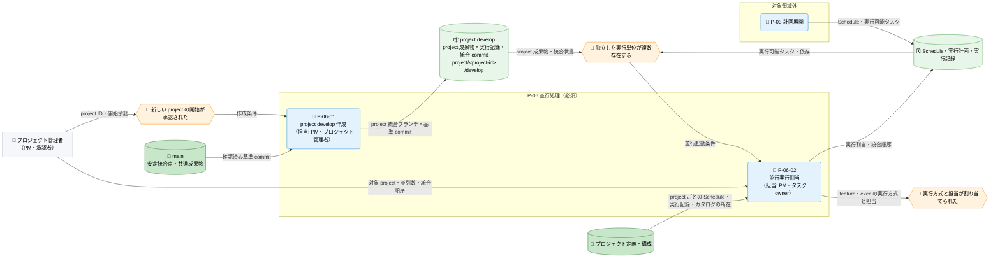
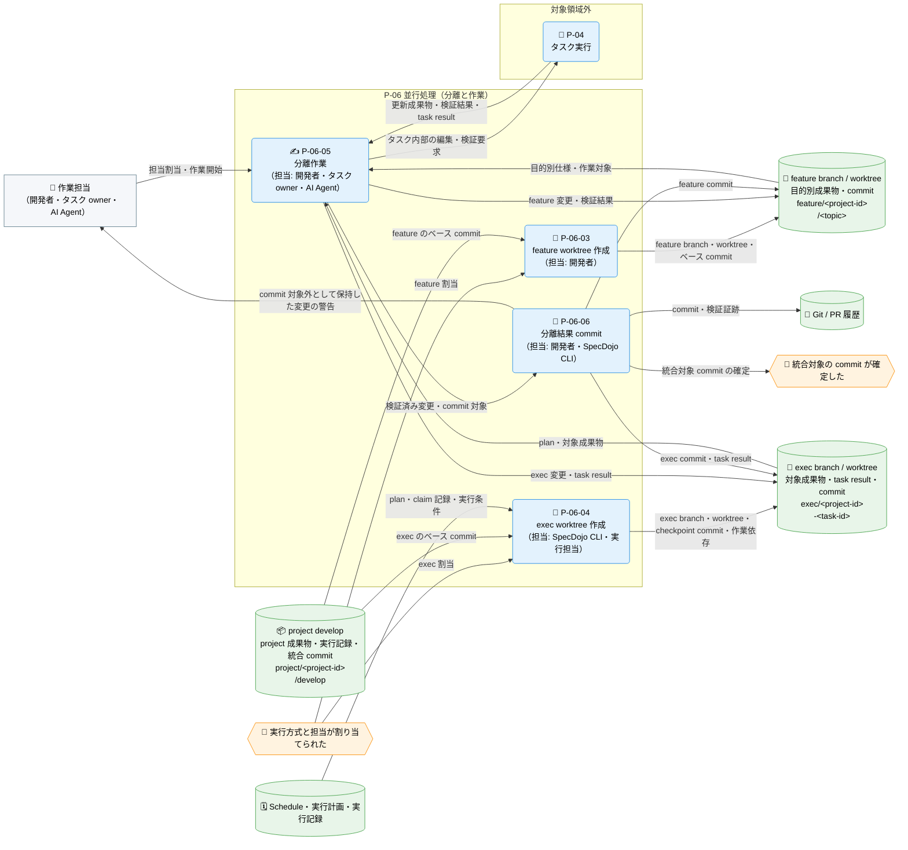
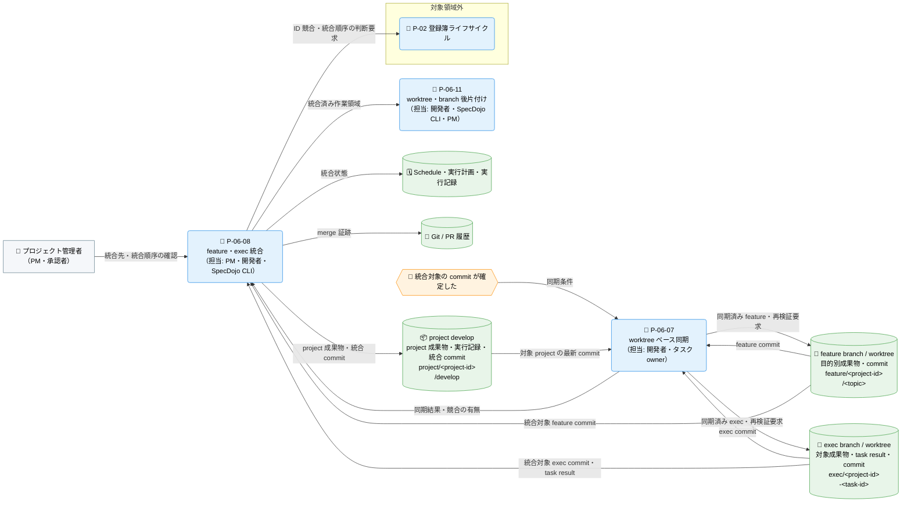
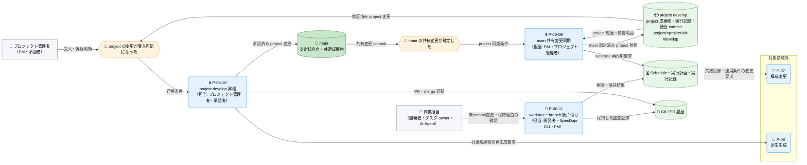

---
specdojo:
  id: prj-0001:cdfd-multi-project
  type: flow
  status: ready
  rulebook: specdojo:cdfd-rulebook
  based_on:
    - prj-0001:cdfd-init
  supersedes: []
---

# 概念データフロー図（複数プロジェクト・ブランチ並行処理）: SpecDojo

本書は、[[prj-0001:cdfd-overview|概念データフロー図（全体概要）]] が定める `P-06 並行処理` の境界を引き継ぎ、複数 project の project `develop`、feature、exec の各ブランチと worktree を分離し、作業結果を対象 project へ統合してから `main` へ昇格するまでの概念データフローである。

## 1. 目的

BA が並行処理の利用場面と担当を整理し、PM、開発者、タスク owner、ARC、QE が、作成・作業・同期・統合・後片付けの起動条件、入出力、主要例外、領域外への委譲を同じ表と図から確認するために使用する。対象者は、並行実行条件と統合順序を承認する PM・承認者、feature を担当する開発者、exec タスクを担うタスク owner と AI Agent、正本と統合方向を設計入力にする ARC、競合時の停止・復旧を確認する QE である。

## 2. 適用範囲

- 対象は、確認済みの `main` から project `develop` を準備し、独立した実行単位を feature または exec のブランチと worktree へ分離して作業し、対象 project の最新状態を同期し、検証済み commit を project `develop` へ統合し、受入後に `main` へ昇格して作業領域を後片付けするまでである。
- project ごとの統合点は `project/<project-id>/develop` とする。feature は `feature/<project-id>/<topic>`、exec は project 修飾 task ID から導出する `exec/<project-id>-<task-id>` を用い、いずれも対象 project の `develop` から分岐して同じ `develop` へ戻す。別 project の `develop` または `main` へ直接統合しない。
- feature / exec の worktree を作る場合は、project の作業ツリーとは別の領域に用意し、作業に必要な依存も worktree ごとに準備する。作業領域の物理配置、依存の取得手順そのものは対象外とする。
- project develop 作成と並行実行割当を必須プロセス、feature / exec の worktree 作成から後片付けまでを条件付きプロセスとする（詳細は「領域内プロセス一覧」を参照）。
- project 固有成果物と実行記録は対象 project の `develop` で統合する。複数 project に影響する共通成果物は、統合順序と担当を管理記録へ残し、一つの project `develop` から `main` へ統合した後、`main` から他 project の `develop` へ同期する。
- feature / exec 内の成果物編集、検証、result 作成など一タスク内部の正常・例外処理、agent・provider・並列数などの運用条件変更、同期後の索引・ビュー再生成は対象外とし、「領域外への委譲」（6.2）に従う。個別コマンドのオプション、Git の操作手順、内部エラーの全列挙、並行実行中の一時的な資源競合に対する内部再試行（業務結果が変わらないもの）も対象外とする。
- 人間と AI Agent の責任分担の原則は [[prj-0001:prj-overview|プロジェクト概要]] に従う。AI Agent と SpecDojo CLI は分離作業、commit、統合を支援できるが、project の受入、`main` への昇格、競合解消結果、破棄を伴う後片付けの最終確認は人間が行う。ブランチ命名と統合方向の規範は [[specdojo:git-branching-standard|Git ブランチ運用標準]]、worktree 運用の安全条件は [[specdojo:exec-worktree-guide|exec worktree運用ガイド]] を正本とする。

## 3. 領域内プロセス一覧

`P-06 並行処理` は十一のプロセスに分かれる。プロセスの分割、プロセス ID、プロセス間の受け渡しに関する規則は本書を正本とする。主要入力・主要出力・データストアは「個別プロセス主要入出力」に記載する。

<!-- prettier-ignore -->
| プロセス ID | プロセス | 業務目的 | 主な担当 | 起動条件 | 必須性 |
| --- | --- | --- | --- | --- | --- |
| `P-06-01` | project develop 作成 | project 固有変更の分岐元・統合先を `main` から独立させ、別 project への誤統合を防ぐ。 | PM、プロジェクト管理者 | 新しい project の開始が承認され、基準とする `main` の commit が確定した | 必須 |
| `P-06-02` | 並行実行割当 | 実行対象の project を一意に特定し、依存を満たす実行単位を project と担当へ割り当て、同一範囲の変更順序を合意する。 | PM、タスク owner | 独立して実行可能な feature または Schedule タスクが複数存在する | 必須 |
| `P-06-03` | feature worktree 作成 | 人が行う目的別変更を、対象 project の統合状態から分離する。 | 開発者 | feature の目的と担当が合意され、対象 project の `develop` と作業ツリーが clean である | 条件付き |
| `P-06-04` | exec worktree 作成 | Schedule タスクの自動変更を task 単位に分離し、成果物と result の混在を防ぐ。 | SpecDojo CLI、実行担当 | task が実行中として割り当てられ、plan、result、claim 記録と対象 project の統合先を確認できる | 条件付き |
| `P-06-05` | 分離作業 | feature または exec の変更を専用 worktree 内に限定し、対象と担当を追跡できる作業結果を作る。 | 開発者、タスク owner、AI Agent | feature または exec worktree の準備と担当割当が完了した | 条件付き |
| `P-06-06` | 分離結果 commit | 検証済みの成果物と許可された実行記録を、統合・監査できる変更単位として確定する。 | 開発者、SpecDojo CLI | 対象変更の検証が成功し、commit 対象と除外対象を識別できる | 条件付き |
| `P-06-07` | worktree ベース同期 | 統合前に対象 project の最新変更を分離作業へ取り込み、競合を project 内で解消できる状態にする。 | 開発者、タスク owner | worktree が clean で、対象 project `develop` に未取込 commit がある | 条件付き |
| `P-06-08` | feature・exec 統合 | 分離された結果を、所属する project の一つの統合状態へ戻す。 | PM、開発者、SpecDojo CLI | 同期と必要な再検証が成功し、統合先、未commit変更、未統合 commit を確認できる | 条件付き |
| `P-06-09` | main 共有変更同期 | `main` で確定した共通変更を project 履歴を保ったまま取り込み、project 間の長期乖離を避ける。 | PM、プロジェクト管理者 | `main` が更新され、対象 project の作業を継続する | 条件付き |
| `P-06-10` | project develop 昇格 | project の受入済み変更を、レビュー可能な単位で安定統合点 `main` へ共有する。 | プロジェクト管理者、承認者 | 未統合の feature / exec がなく、最新 `main` の取込、project 全体の検証、レビューが成功した | 条件付き |
| `P-06-11` | worktree・branch 後片付け | 統合済みの一時作業領域だけを削除し、未退避の成果物・result・commit を失わない。 | 開発者、SpecDojo CLI、PM | 統合済みで、task 記録が完了し、未commit変更・未統合 commit・保持理由がない | 条件付き |

`P-06-03` と `P-06-04` は割り当てた実行方式ごとに選択する。`P-06-07` は対象 project に新しい commit がある場合に実施し、`P-06-09` は `main` に共有変更がある場合に実施する。条件付きプロセスを起動しない場合の扱いは「主要例外」（6.1）の注記に従う。

## 4. 概念データフロー

必須プロセス（`P-06-01`・`P-06-02`）、分離と作業の条件付きプロセス（`P-06-03`〜`P-06-06`）、同期・統合の条件付きプロセス（`P-06-07`・`P-06-08`）、main同期・昇格・後片付けの条件付きプロセス（`P-06-09`〜`P-06-11`）は、起動条件と担当が異なり、一図では起動順と分岐を追いにくいため、フローを四つの図に分ける。各図に登場する `main`、`project develop`、`feature branch / worktree`、`exec branch / worktree`、`Schedule・実行計画・実行記録`、`Git / PR 履歴` は、いずれも同一の対象を指す。

### 4.1. 必須プロセスのフロー（P-06-01・P-06-02）

凡例: ノード形状・線種・色・絵文字は [[prj-0001:cdfd-overview|概念データフロー図（全体概要）]] の「凡例（本プロダクト共通）」に従う。`P-03 計画展開` は委譲元・委譲先を示す領域外の代表ノードであり、内部処理は本図の対象外とする。`実行方式と担当が割り当てられた` は分離と作業のフロー（4.2）の起点イベントと同一の対象を指す。本図は現物の流れを扱わない。

### 4.2. 分離と作業の条件付きプロセスのフロー（P-06-03〜P-06-06）

凡例: ノード形状・線種・色・絵文字は [[prj-0001:cdfd-overview|概念データフロー図（全体概要）]] の「凡例（本プロダクト共通）」に従う。`P-04 タスク実行` は委譲先を示す領域外の代表ノードであり、内部処理は本図の対象外とする。`実行方式と担当が割り当てられた` は必須プロセスのフロー（4.1）、`統合対象の commit が確定した` は同期・統合のフロー（4.3）の同名イベントと同一の対象を指す。本図は現物の流れを扱わない。

### 4.3. 同期・統合のフロー（P-06-07・P-06-08）

凡例: ノード形状・線種・色・絵文字は [[prj-0001:cdfd-overview|概念データフロー図（全体概要）]] の「凡例（本プロダクト共通）」に従う。`P-02 登録簿ライフサイクル` は委譲先を示す領域外の代表ノードであり、内部処理は本図の対象外とする。`統合対象の commit が確定した` は分離と作業のフロー（4.2）の同名イベントと同一の対象を指す。`worktree・branch 後片付け` は main同期・昇格・後片付けのフロー（4.4）と同一のプロセスを指し、その内部の入出力は 4.4 を参照する。本図は現物の流れを扱わない。

### 4.4. main同期・昇格・後片付けのフロー（P-06-09〜P-06-11）

凡例: ノード形状・線種・色・絵文字は [[prj-0001:cdfd-overview|概念データフロー図（全体概要）]] の「凡例（本プロダクト共通）」に従う。`P-07 構成変更`、`P-08 派生生成` は委譲先を示す領域外の代表ノードであり、内部処理は本図の対象外とする。`worktree・branch 後片付け` は同期・統合のフロー（4.3）と同一のプロセスを指し、統合済み作業領域の引き渡しは 4.3 を参照する。本図は現物の流れを扱わない。

## 5. 個別プロセス主要入出力

`<project-id>`、`<task-id>`、`<topic>` は対象 project、対象 task、feature の目的に置き換える総称であり、未記入の成果物値ではない。プロセス ID・業務目的・主な担当・起動条件・必須性は「領域内プロセス一覧」を参照する。

### 5.1. 必須プロセス（P-06-01・P-06-02）

project 固有変更の統合点を用意し、独立して実行できる単位を project・担当・統合順序へ割り当てる。この二つが完了して初めて、feature または exec の分離を開始できる。

<!-- prettier-ignore -->
| プロセス ID | プロセス | 主要入力 | 主要出力 | データストア |
| --- | --- | --- | --- | --- |
| `P-06-01` | project develop 作成 | project ID、確認済み `main` commit、プロジェクト構成 | `project/<project-id>/develop` と対応する作業ツリー、基準 commit | `main`、project `develop` |
| `P-06-02` | 並行実行割当 | 実行可能タスク、依存、対象 project・成果物、並列数、共通成果物の変更予定、project ごとの Schedule・実行記録・カタログの所在 | 一意に特定した実行対象 project、project・担当・実行方式・統合順序を含む実行割当 | プロジェクト定義・構成、Schedule・実行計画・実行記録 |

### 5.2. 分離と作業の条件付きプロセス（P-06-03〜P-06-06）

割り当てた実行方式に応じて feature または exec の作業領域を分離し、専用 worktree の中だけで変更・検証を行い、統合できる変更単位として commit する。実行方式が一つに定まる場合は、対応しない作成プロセスを起動しない。

<!-- prettier-ignore -->
| プロセス ID | プロセス | 主要入力 | 主要出力 | データストア |
| --- | --- | --- | --- | --- |
| `P-06-03` | feature worktree 作成 | project ID、topic、対象 project `develop` の commit、対象成果物 | `feature/<project-id>/<topic>` と feature worktree、ベース commit | project `develop`、feature branch / worktree |
| `P-06-04` | exec worktree 作成 | project 修飾 task ID、edit / review plan、対象 project `develop` の commit、実行条件 | `exec/<project-id>-<task-id>`、project の作業ツリーとは別領域に置く task worktree、checkpoint commit、worktree 内で実行可能な依存 | project `develop`、Schedule・実行計画・実行記録、exec branch / worktree |
| `P-06-05` | 分離作業 | 対象成果物、plan・仕様、ベース commit、作業条件 | 更新成果物、検証結果、exec の場合の task result、未commit差分 | feature / exec worktree、成果物、実行記録 |
| `P-06-06` | 分離結果 commit | 更新成果物、task result、検証結果、変更許可範囲 | feature / exec branch の commit、commit 対象外として保持する変更の警告 | feature / exec branch、Git / PR 履歴、実行記録 |

### 5.3. 同期・統合の条件付きプロセス（P-06-07・P-06-08）

分離された変更を対象 project の最新状態へ合わせ、project `develop` へ戻す。

<!-- prettier-ignore -->
| プロセス ID | プロセス | 主要入力 | 主要出力 | データストア |
| --- | --- | --- | --- | --- |
| `P-06-07` | worktree ベース同期 | 対象 project `develop` の commit、feature / exec の commit、明示したベースブランチ | 同期済み feature / exec branch、競合の有無、再検証要求 | project `develop`、feature / exec branch / worktree、Git / PR 履歴 |
| `P-06-08` | feature・exec 統合 | feature / exec commit、検証結果、対象 project `develop`、統合順序 | project `develop` への merge commit、統合状態、更新された成果物・task result | feature / exec branch、project `develop`、Git / PR 履歴、実行記録 |

### 5.4. main同期・昇格・後片付けの条件付きプロセス（P-06-09〜P-06-11）

受入後に `main` へ昇格し、統合済みの作業領域だけを削除する。`main` の共有変更は project 履歴を保ったまま取り込む。

<!-- prettier-ignore -->
| プロセス ID | プロセス | 主要入力 | 主要出力 | データストア |
| --- | --- | --- | --- | --- |
| `P-06-09` | main 共有変更同期 | 最新 `main` commit、対象 project `develop`、共通変更の影響・統合順序 | `main` を merge した project `develop`、再検証結果、worktree への再同期要求 | `main`、project `develop`、Git / PR 履歴、実行記録 |
| `P-06-10` | project develop 昇格 | project `develop` の commit、検証結果、未解決事項、承認結果 | `main` への merge commit・PR 証跡、他 project への同期要求 | project `develop`、`main`、Git / PR 履歴、実行記録 |
| `P-06-11` | worktree・branch 後片付け | worktree 状態、統合状態、task 状態、成果物・result の差分 | 削除済み worktree、条件付きで削除済み feature / exec branch、保持した監査証跡 | Git worktree 登録、feature / exec branch、Git / PR 履歴、実行記録 |

### 5.5. ブランチ・worktree の正本と統合方向

各データストアが読み書きする情報と統合方向を示す。branch / worktree の分離、ベース、同期、commit、統合方向、競合時の保持、後片付けは本書を正本とする。

<!-- prettier-ignore -->
| データストア | 主に読み取る情報 | 主に書き込む情報 | commit・統合方向 |
| --- | --- | --- | --- |
| `main` | project 昇格結果、共通成果物、安定した基準 commit | 承認済み project 変更、先に統合する共通成果物、PR 証跡 | project `develop` の受入済み変更だけを `main` へ統合し、`main` の共有変更を各 project `develop` へ merge する |
| project `develop` と project 作業ツリー | `main` の共有変更、対象 project の成果物・Schedule・実行記録、feature / exec commit | project 固有成果物、統合済み task result・commit、統合状態 | feature / exec の分岐元・統合先とし、project 受入後だけ `main` へ昇格する |
| feature branch / worktree | 対象 project `develop` の成果物とベース commit、目的別の仕様 | feature 対象成果物、検証結果、feature commit | 対象 project `develop` から分岐・同期し、同じ project `develop` へ統合する |
| exec branch / worktree | 対象 project `develop` の成果物、edit / review plan、task の実行条件、worktree 内に用意した作業依存 | plan が許可する成果物、対象 task result、exec commit | 対象 project `develop` から分岐・同期し、同じ project `develop` へ統合する。event、他 task の result、再生成物を task commit に混ぜない |
| Schedule・実行計画・実行記録 | Schedule task、plan、claim・状態 event、過去 result | 実行割当、対象 task result、統合・block・complete の状態 | worktree commit には対象 result だけを含め、状態 event は project 統合側で直列に管理する |
| プロジェクト定義・構成 | project ID、Schedule・実行記録・カタログ・ロール定義・レビュー観点の配置、project 文脈 | 対象 project の選択結果 | 複数 project の Schedule・実行記録・カタログの所在をここで解決し、実行対象 project を一意にする。一意に定まらない場合は分離・作業を開始しない |

一つの task 内部の edit / review / finalize、result 判定、claim・complete・block などの状態遷移は [[prj-0001:cdfd-task-execution|概念データフロー図（タスク実行ライフサイクル）]] を正本とし、本書では分離環境と統合結果の受け渡しだけを定める。登録項目 ID の再採番規則は [[prj-0001:cdfd-register-operation|概念データフロー図（登録簿ライフサイクル）]] を参照する。

## 6. 主要例外と領域外への委譲

### 6.1. 主要例外

<!-- prettier-ignore -->
| 例外 ID | 対象プロセス | 検出条件 | 本領域での扱い | 継続・再開条件 |
| --- | --- | --- | --- | --- |
| `E-01` | `P-06-01`〜`P-06-04` | 実行対象 project を一意に特定できない（対象指定がない、未登録の project、Schedule と実行記録の所在指定がそろわない）、project ID・task ID から導出した branch または worktree のパスが既存の別対象と衝突する、登録済み worktree の branch が期待値と異なる、登録済み作業領域の実体が失われている、または作業領域の配置・ベースが対象 project `develop` の規約と一致しない | 新しい作業を開始せず、実行対象 project、既存 branch / worktree の所属、ベース commit、保持理由を確認する。別 project や誤ったベースの変更をそのまま再利用・統合しない | 実行対象 project が一意に定まり、project、branch、worktree、ベース commit が一意に対応し、既存作業を再利用するか別名で準備するかを担当者が確定する |
| `E-02` | `P-06-05`、`P-06-07`、`P-06-08` | 文書 ID、登録項目 ID、または task ID が統合対象と重複し、検証・派生生成・merge の採否を確定できない | 競合する ID を含む worktree の同期・統合を停止し、worktree と commit を保持する。ID の正本を担う領域で競合対象と参照元を特定し、一括再採番または所属修正を行う。他の独立単位は影響範囲を確認して継続できる | 重複 ID、ファイル名、文書 ID、wikilink、plan / result の参照が整合し、対象範囲の検証と必要な派生生成が成功する |
| `E-03` | `P-06-04`、`P-06-07`、`P-06-09` | 分離した作業領域で作業に必要な依存を準備できない、worktree に未commit変更がある、同期元を一意に決められない、依存取得・同期処理が失敗する、またはベース取込時に競合する | 作業開始または同期を停止し、未commit変更、現在のベース、取込対象 commit、競合ファイルを保持する。変更を破棄せず、必要なら先に対象変更を検証・commit し、対象 project `develop` を明示して競合を解消する | 作業依存が worktree 内でそろい、worktree が clean になり、同期元と取込対象が確定し、同期後の検証が成功する |
| `E-04` | `P-06-08` | feature / exec と project `develop` が同じ箇所を変更する、統合先が対象 project `develop` でない、統合元の作業ツリーの未commit変更と統合対象パスが重複する、または task worktree に commit 対象の未commit変更が残る | merge を完了扱いにせず停止する。Git が保持した競合状態、未統合 commit、worktree、task result を残し、統合先と統合順序を再確認する。競合解消または merge 中止は人間が差分を確認して選ぶ | 正しい project `develop` 上で競合と重複変更が解消され、task の成果物・result に取りこぼしがなく、必要な検証後に merge commit を確定できる |
| `E-05` | `P-06-06`、`P-06-11` | 成果物、対象 task result、未統合 commit、commit 許可範囲外の変更、または未commit変更が worktree に残る | commit 対象を確定できない場合は統合へ進めず、統合・記録完了を確認できない場合は worktree と branch を削除しない。強制削除を通常の復旧手段にしない | 許可された成果物と result が commit・統合され、除外変更の扱いと task 状態が確定し、未退避変更・未統合 commit がない |
| `E-06` | `P-06-02`、`P-06-08`、`P-06-10` | 複数 project が同じ共通成果物を並行変更する、project 間依存の先行 commit が `main` に未統合である、または統合順序が未定である | 共通変更を各 project の正本として独立に確定せず、影響する統合・昇格を停止する。担当、先行 project、統合順序、後続 project への同期条件を登録簿または同等の管理記録へ残す | 先行する共通変更がレビュー・検証を経て `main` へ統合され、後続 project がその `main` を取り込んで再検証できる |

条件付きプロセスを起動しない判断は例外ではない。実行方式が feature だけ、または exec だけの場合に対応しない作成プロセスを起動しないこと、対象 project に未取込 commit がないため `P-06-07` を起動しないこと、`main` に共有変更がないため `P-06-09` を起動しないことは、いずれも正常経路である。

### 6.2. 領域外への委譲

<!-- prettier-ignore -->
| 委譲先 | 委譲する事項 | 引き渡す情報 | 本領域へ戻す条件 |
| --- | --- | --- | --- |
| `P-02 登録簿ライフサイクル`（[[prj-0001:cdfd-register-operation\|登録簿ライフサイクル]]） | ID 競合、共通成果物の統合順序、例外対応、判断要求の継続管理 | 競合対象、影響 project、保持した branch / worktree、選択肢、担当、再開条件 | ID・統合順序・例外方針が確定し、分離・同期・統合を再開するとき |
| `P-03 計画展開`（[[prj-0001:cdfd-catalog-planning\|カタログ〜計画展開]]） | project とタスクの依存、優先度、実行可能性の再計画 | 統合済み・block 中のタスク状態、共通変更の依存、再実行要求 | 独立して実行可能な単位と統合順序が更新されたとき |
| `P-04 タスク実行`（[[prj-0001:cdfd-task-execution\|タスク実行ライフサイクル]]） | worktree 内での成果物編集、検証、result 記録、判断依頼 | plan、対象成果物、仕様、担当、分離された worktree、完了条件 | 更新成果物、検証結果、result、未commit差分を分離結果として受け取るとき |
| `P-07 構成変更`（[[prj-0001:cdfd-agent-config-operation\|agent・provider 構成の運用変更]]） | agent、provider、並列数、worktree ベースなど運用条件の承認済み変更 | 現行条件、失敗記録、影響 project・タスク、変更要求・承認結果 | 更新した運用条件で新しい実行割当または worktree を準備するとき |
| `P-08 派生生成`（[[prj-0001:cdfd-derived-content\|成果物・派生ビュー・索引生成]]） | 同期・統合後の索引、ビュー、生成成果物の再生成 | 更新された成果物、実行記録、対象 project、生成条件 | 生成失敗が統合結果の受入を妨げる、または ID 競合を検出したとき |

## 7. 未決事項

| ID     | 未決事項                                                                                                               | 影響                                                                        | 決定者  | 決定時期                                     |
| ------ | ---------------------------------------------------------------------------------------------------------------------- | --------------------------------------------------------------------------- | ------- | -------------------------------------------- |
| `U-01` | _UNDECIDED_: exec worktree の分岐元を対象 project `develop` として自動実行設定で強制するか、担当者の明示指定に委ねるか | `P-06-04` の分岐元誤りを起動前に防ぐか、`E-01` の検出後に是正するかが変わる | ARC、PM | 並行処理で分岐元の誤りが繰り返し発生したとき |
