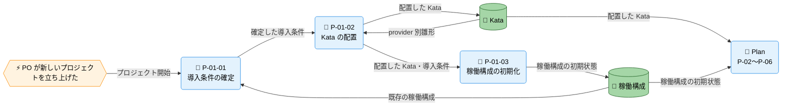

---
specdojo:
  id: cdfd-onboarding
  type: flow
  status: draft
  rulebook: specdojo:cdfd-rulebook
  based_on:
    - cdfd-overview
  supersedes: []
---

# 概念データフロー図（Onboarding）

## 1. 目的

Onboarding グループの内部プロセス、主要例外、Plan への引き渡しを明確にし、BA が利用者視点で導入範囲と受入可能な初期状態を整理し、PO と ARC が責任境界を合意できるようにする。ARC は Kata の配置先と稼働構成の生成を設計する入力として、QE は既存設定、雛形、権限に起因する採否と再開条件を検証する入力として本書を利用する。

配置した Kata と稼働構成の初期状態を共通の正本として引き渡せるようにすることで、参加者と AI Agent が同じ前提から後続作業を始められ、初期設定の判断が特定の参加者だけに依存することを防ぐ。

## 2. 適用範囲

- **対象グループ**: Onboarding。[[cdfd-overview|概念データフロー図（全体概要）]] で定義されたプロジェクト初期セットアップ（`P-01`）だけを含む。
- **開始と終了**: PO が新しいプロジェクトを立ち上げた時点から、選択した provider の雛形に基づく Kata の配置と稼働構成の初期化が完了し、Plan へ引き渡せる時点までを扱う。
- **期間境界**: 新しいプロジェクトの初期セットアップを対象とし、引き渡し後の継続的な稼働構成変更は Action の責務として扱う。
- **組織境界**: PO と ARC による導入判断、配置、初期化を扱う。人間と AI Agent の責任分担は、[[cdfd-overview|概念データフロー図（全体概要）]] の「適用範囲」にある原則を参照し、本書では再定義しない。
- **システム境界**: 概念上のデータストアである Kata と稼働構成への参照・更新を扱う。物理パス、コマンド、個別ツールの操作は扱わない。
- **対象外**: 状態を変更しない補助的な参照・検証操作、実装詳細、Plan 以降の内部処理、複数グループを横断する順序、および状態名・状態定義・遷移条件は対象外とする。Plan への委譲は「主要例外とグループ外への委譲」に示す。

## 3. プロセス領域

Onboarding グループには、[[cdfd-overview|概念データフロー図（全体概要）]] を正本とする一つの領域、プロジェクト初期セットアップ（`P-01`）が属する。

### 3.1. プロジェクト初期セットアップ（P-01）

参加者の判断と既存の稼働構成を照合して導入条件を確定し、選択した provider の雛形から Kata を配置した後、後続グループが利用できる稼働構成の初期状態を整える。既存設定との競合、雛形の不足、権限不足がある場合は、未確定または部分的な結果を正常な初期状態として引き渡さない。

- **主要入力**: 参加者からのプロジェクトの目的・文脈、参加者からのメンバー・ロール採用判断、参加者からの利用する agent・provider の選択、Kata の provider 別雛形
- **主要出力**: 配置した Kata、稼働構成の初期状態
- **データストア**: Kata、稼働構成

| プロセス ID | プロセス         | 業務目的                                                                           | 主な担当                   | 起動条件                                                                                                           | 必須性 |
| ----------- | ---------------- | ---------------------------------------------------------------------------------- | -------------------------- | ------------------------------------------------------------------------------------------------------------------ | ------ |
| `P-01-01`   | 導入条件の確定   | 参加者が、既存設定を保護しながら同じ導入条件に基づいて初期セットアップを進められる | PO（最終判断）、ARC        | PO が新しいプロジェクトを立ち上げ、目的・文脈、メンバー・ロール採用判断、利用する agent・provider の選択を提示した | 必須   |
| `P-01-02`   | Kata の配置      | 選択した provider に対応する再利用可能な作成支援資料をプロジェクトで利用できる     | ARC                        | `P-01-01` で導入条件が確定し、選択した provider の雛形を参照できる                                                 | 必須   |
| `P-01-03`   | 稼働構成の初期化 | 参加者と AI Agent が同じ初期構成に基づいて後続作業を開始できる                     | ARC（初期状態の採否は PO） | `P-01-02` で Kata の配置が完了し、初期化を妨げる例外がない                                                         | 必須   |

## 4. データストア

### 4.1. マスタ・構成データ

| データストア | 読み書き   | 本グループでの利用                                                                                             |
| ------------ | ---------- | -------------------------------------------------------------------------------------------------------------- |
| Kata         | 参照・更新 | `P-01-02` が provider 別雛形を参照して Kata を配置し、`P-01-03` が配置した Kata を稼働構成の初期化に用いる     |
| 稼働構成     | 参照・更新 | `P-01-01` が既存設定の有無と導入条件との競合を確認し、`P-01-03` が合意された稼働構成の初期状態を生成・更新する |

## 5. 概念データフロー

### 5.1. プロジェクト初期セットアップ

凡例は [[cdfd-overview|概念データフロー図（全体概要）]] の「凡例（本プロダクト共通）」に従う。`-->` は情報の流れであり、本図は物の流れを対象外とする。参加者は本グループの内側で判断するため、外部主体としては描かず、目的・文脈、メンバー・ロール採用判断、agent・provider の選択は `P-01-01` の主要入力として「個別プロセス主要入出力」に示す。Plan はグループ外委譲先の代表ノードであり、その内部プロセスは省略する。本図は一図で完結し、別図と共有するノードはない。

## 6. 個別プロセス主要入出力

### 6.1. プロジェクト初期セットアップ

| プロセス ID | プロセス         | 主要入力                                                                                            | 主要出力                                      | データストア                         |
| ----------- | ---------------- | --------------------------------------------------------------------------------------------------- | --------------------------------------------- | ------------------------------------ |
| `P-01-01`   | 導入条件の確定   | プロジェクトの目的・文脈、メンバー・ロール採用判断、利用する agent・provider の選択、既存の稼働構成 | Kata の配置と稼働構成の初期化に用いる導入条件 | 稼働構成（参照）                     |
| `P-01-02`   | Kata の配置      | 確定した導入条件、Kata の provider 別雛形                                                           | 配置した Kata                                 | Kata（参照・更新）                   |
| `P-01-03`   | 稼働構成の初期化 | 確定した導入条件、配置した Kata                                                                     | 稼働構成の初期状態、Plan への引き渡し情報     | Kata（参照）、稼働構成（参照・更新） |

## 7. 状態遷移の参照

Kata の配置と稼働構成の初期化に伴う状態名・意味・成立条件は STSD、遷移元・遷移先・イベント・遷移条件は CSTD を正本とし、本書では定義しない。参照可能な資料から対象文書 ID を特定できないため、現時点の対応を次に示す。

| 対象     | 状態を変えるプロセス       | 状態定義（STSD）                   | 状態遷移（CSTD）                   |
| -------- | -------------------------- | ---------------------------------- | ---------------------------------- |
| Kata     | `P-01-02` Kata の配置      | `STSD（Kata、文書 ID 未特定）`     | `CSTD（Kata、文書 ID 未特定）`     |
| 稼働構成 | `P-01-03` 稼働構成の初期化 | `STSD（稼働構成、文書 ID 未特定）` | `CSTD（稼働構成、文書 ID 未特定）` |

## 8. 主要例外とグループ外への委譲

### 8.1. 主要例外

| 例外 ID   | 対象プロセス         | 検出条件                                                                                        | 本グループでの扱い                                                                                                   | 継続・再開条件                                                                                           |
| --------- | -------------------- | ----------------------------------------------------------------------------------------------- | -------------------------------------------------------------------------------------------------------------------- | -------------------------------------------------------------------------------------------------------- |
| `E-01-01` | `P-01-01`            | 既存の稼働構成があり、選択した agent・provider またはメンバー・ロール採用判断と競合する         | 既存設定を上書きせず、PO と ARC が既存設定の維持、利用、または導入条件の見直しを判断する                             | 既存設定の扱いと導入条件が合意された後、`P-01-01` から再開する                                           |
| `E-01-02` | `P-01-02`            | 選択した provider の雛形だけでは、Kata の配置または稼働構成の初期化に必要な内容をそろえられない | 不足を推測で補わず、`P-01-02` と後続の `P-01-03` を停止し、provider の選択または利用する雛形を見直す                 | provider を変更した場合は `P-01-01`、利用可能な雛形がそろった場合は `P-01-02` から再開する               |
| `E-01-03` | `P-01-02`、`P-01-03` | Kata または稼働構成の参照・更新に必要な権限がなく、対象プロセスの主要出力を確定できない         | 影響するプロセスを停止し、部分的な配置または初期化を正常完了として扱わない。PO の承認の下で ARC が必要な権限を整える | 必要な参照・更新が許可され、すでに確定した出力を保護できることを確認した後、停止したプロセスから再開する |

### 8.2. グループ外への委譲

| 委譲先      | 委譲する事項                                                               | 引き渡す情報                      | 本グループへ戻す条件                                                                                                                   |
| ----------- | -------------------------------------------------------------------------- | --------------------------------- | -------------------------------------------------------------------------------------------------------------------------------------- |
| `cdfd-plan` | 管理する成果物と、いつ・誰が・どのような形で実行するかを定義する後続の計画 | 配置した Kata、稼働構成の初期状態 | Plan の定義を開始できない原因が Kata の配置または稼働構成の初期状態の不足にあると判定され、Onboarding の導入判断を見直す必要がある場合 |

## 9. 未決事項

- _TODO_: Kata と稼働構成に対応する STSD / CSTD の文書 ID を特定する。`P-01-02`、`P-01-03` の状態参照に影響するため、ARC と BA が本書の `ready` 昇格前に決定する。
