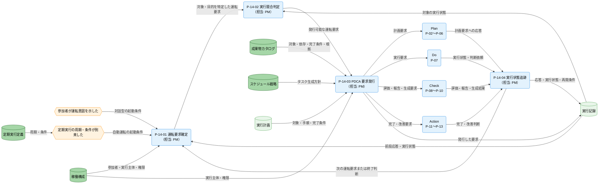

---
specdojo:
  id: cdfd-orchestrator
  type: flow
  status: draft
  rulebook: specdojo:cdfd-rulebook
  based_on:
    - cdfd-overview
    - cdfd-plan
    - cdfd-do
    - cdfd-check
    - cdfd-action
  grade:
    rubric: grade-rubric-v1
    target: deliverable
    verdict: needs-work
    score: 67
    graded_at: "2026-09-17T02:11:47.937Z"
    graded_by: codex-expert-executor
    content_hash: 1fac6fcecc0a2a46acc226ecf555b08d512ced2f59e9a685ec6a0c7817cae360
    categories:
      consistency: { score: 25 }
      usability: { score: 94 }
      architecture: { score: 100 }
      quality: { score: 58 }
    viewpoints:
      vp-arc-cross-document-consistency: { level: 1, score: 25 }
      vp-arc-conciseness: { level: 4, score: 100 }
      vp-arc-single-responsibility: { level: 4, score: 100 }
      vp-qe-done-criteria: { level: 1, score: 25 }
      vp-qe-verifiability: { level: 2, score: 50 }
      vp-qe-omissions-consistency: { level: 1, score: 25 }
      vp-ux-readability: { level: 4, score: 100 }
      vp-ux-user-flow: { level: 4, score: 100 }
      vp-ux-language-consistency: { level: 3, score: 75 }
      vp-arc-document-structure: { level: 4, score: 100 }
      vp-qe-config-validity: { level: 4, score: 100 }
    findings: { blocker: 0, major: 7, minor: 3, note: 0 }
    done_criteria:
      satisfied: 1
      total: 3
      unsatisfied:
        DC-001: [BA]
        DC-003: [QE]
      detail_ref: cdfd-orchestrator-grade-criteria
---

# 概念データフロー図（Orchestrator）: SpecDojo

## 1. 目的

本書は、Orchestrator グループ（P-14）を詳細化し、参加者の意図に基づく対話型運転と、定期実行定義に基づく自動運転を、共通の要求発行と実行状態の追跡として合意できるようにする。

- BA と PM は、参加者の意図または定期実行の到来から、Plan・Do・Check・Action のどこへ何を要求するか、および人間の判断が必要な境界を確認する。
- ARC は、稼働構成、成果物カタログ、スケジュール戦略、定期実行定義、実行計画、実行記録の読み書きと、各グループへの委譲を設計入力として使う。
- QE は、実行の競合、定期実行の取りこぼし、要求先の失敗を検出する条件と、サイクルを再開できる条件を検証に使う。

これにより、技術参加者と非技術参加者が同じ正本と記録を介して PDCA を始動・継続でき、判断や調整が特定個人の記憶に集中しない運転を支える。

## 2. 適用範囲

- **対象グループ**: Orchestrator。対象領域は P-14 の一領域である。
- **開始**: 参加者が運転意図を示した、定期実行定義の周期・条件が到来した、または Plan・Do・Check・Action の応答から次の要求が必要になった時点とする。
- **終了**: 対象の PDCA グループへ要求を発行して応答を実行記録へ反映し、サイクルの終了、継続、待機、または人間の判断待ちを識別できた時点とする。
- **組織境界**: PM、BA、PO、ARC、QE、OPS を含む参加者と、支援を委譲された AI Agent または runner の協働を扱う。運転目的、例外時の再開または中止、保護対象に関する判断は人間が担う。
- **システム境界**: Orchestrator が本書記載のデータストアを参照・更新し、Plan・Do・Check・Action へ要求を引き渡して応答を受け取るまでを扱う。他グループの内部処理は扱わない。
- **対象外**: 参照・検索・状態表示などの補助操作、コマンド・ファイル・待機時間などの実装詳細、各 PDCA グループの内部処理、複数グループを横断するユースケース固有の順序、状態名・状態定義・遷移条件とする。グループ外の責務は「主要例外とグループ外への委譲」、状態は「状態遷移の参照」に示す。
- **責任分担**: 承認や主要判断は人間が担い、AI Agent は記録、提案、実行、検証を支援できる。この責任分担は [[cdfd-overview|概念データフロー図（全体概要）]] の「適用範囲」を正とする。

## 3. プロセス領域

Orchestrator グループは P-14 の一領域を含む。領域 ID と名称、およびグループ単位の主要入力・主要出力・データストアは [[cdfd-overview|概念データフロー図（全体概要）]] を正本とし、本章は領域の主要入力、主要出力、データストアと内部プロセスの正本として詳細化する。Plan・Do・Check・Action との受け渡しは各 CDFD の定義と整合させる。

<!-- specdojo:finding id=F003 severity=minor rule=vp-arc-cross-document-consistency line=27 全体概要で P-14 の領域名は「オーケストレーター」だが、本書の領域見出しはグループ名と同じ「Orchestrator」になっているため、領域名を上位正本と一致させてください。 -->
<!-- specdojo:finding id=F009 severity=minor rule=vp-qe-omissions-consistency line=27 rulebook が要求する上位文書と同一の領域名に対し、P-14 の「オーケストレーター」が「Orchestrator」へ置き換わっているため修正してください。 -->
<!-- specdojo:finding id=F010 severity=minor rule=vp-ux-language-consistency line=27 全体概要の領域名は「オーケストレーター」だが、本書ではグループ名の「Orchestrator」を領域見出しにも使用しているため、グループ名と領域名を区別して上位正本の表記へ統一してください。 -->
### 3.1. Orchestrator（P-14）

参加者の意図、定期実行の到来、または前段グループの応答を運転要求として確定し、同じ対象に対する実行の競合がないことを確認する。要求先と必要な情報を特定して Plan・Do・Check・Action のいずれかへ要求を発行し、応答を記録して次の要求または終了判断へつなぐ。対話型運転は参加者の運転意図から、自動運転は定期実行の周期・条件の到来からそれぞれ `P-14-01` へ入り、以降は同じ要求発行と追跡の流れを共有する。

<!-- specdojo:finding id=F001 severity=major rule=vp-arc-cross-document-consistency line=31 全体概要では「生成した実行計画」を P-14 の主要出力および Orchestrator から実行計画への更新としているが、本書は Plan 応答として主要入力に置き P-14 の主要出力から外しているため、生成責任とデータの方向を正本間で統一してください。 -->
<!-- specdojo:finding id=F004 severity=major rule=vp-qe-done-criteria line=31 DC-001 が要求する P-14 の主要出力との無矛盾な詳細化に対し、全体概要で主要出力とされる「生成した実行計画」を Plan からの主要入力へ変更しているため, 全体概要と本書の生成責任を統一してください。 -->
<!-- specdojo:finding id=F007 severity=major rule=vp-qe-omissions-consistency line=32 全体概要が P-14 の主要出力として定義する「生成した実行計画」が主要出力、図、個別プロセス主要入出力のいずれにもなく、代わりに Plan 応答の入力へ移されているため、上位出力の欠落または全体概要側の責任誤りを正本間で解消してください。 -->
- **主要入力**: 参加者の運転意図、稼働構成の agent 定義・実行既定値、成果物カタログの完了条件、スケジュール戦略の作業要件、定期実行の周期・条件、Plan の計画要求への応答（生成した実行計画を含む）、Do の実行状態・ブロック理由・判断依頼、Check の評価結果・進捗報告・派生ビュー・索引、Action の完了・改善判断と再計画要求
- **主要出力**: Plan への計画要求、Do への実行要求、Check への評価・報告・生成要求、Action への完了・改善要求、記録された要求・応答・実行状態、次回の継続・再開条件
- **データストア**: 稼働構成、成果物カタログ、スケジュール戦略、定期実行定義、実行計画、実行記録

| プロセス ID | プロセス      | 業務目的                                                                                       | 主な担当                                             | 起動条件                                                                                         | 必須性 |
| ----------- | ------------- | ---------------------------------------------------------------------------------------------- | ---------------------------------------------------- | ------------------------------------------------------------------------------------------------ | ------ |
| `P-14-01`   | 運転要求確定  | 対話型と自動の起点を、対象、目的、必要な判断を識別できる共通の運転要求にする。                 | PM（運転要求の確定は runner が支援）                 | 参加者が運転意図を示した、定期実行の周期・条件が到来した、または前段グループの応答を受け取った。 | 必須   |
| `P-14-02`   | 実行競合判定  | 同じ対象への要求の重複を防ぎ、発行可能な要求または待機させる要求を確定する。                   | PM（実行競合の判定は runner が支援）                 | `P-14-01` で対象と目的を識別できる運転要求が確定し、対応する実行記録を参照できる。               | 必須   |
| `P-14-03`   | PDCA 要求発行 | 対象と目的に適合する一つの PDCA グループへ、判断・実行に必要な情報をそろえて委譲する。         | PM（要求の発行は runner または AI Agent が支援）     | `P-14-02` で競合がなく、要求先と引き渡す情報を特定できた。                                       | 必須   |
| `P-14-04`   | 実行状態追跡  | 要求先の応答を追跡可能に記録し、人間がサイクルの終了、継続、待機、再開を判断できるようにする。 | PM（実行状態の記録は runner または AI Agent が支援） | 要求先から正常結果、失敗、ブロック、判断依頼のいずれかの応答を受け取った。                       | 必須   |

## 4. データストア

### 4.1. マスタ・構成データ

| データストア     | 読み書き | 本グループでの利用                                                                                                            |
| ---------------- | -------- | ----------------------------------------------------------------------------------------------------------------------------- |
| 稼働構成         | 参照     | 運転要求の対象となる参加者、ロール、AI Agent、runner の定義と権限を確認し、要求発行または人間判断への引き渡し可否を判定する。 |
| 成果物カタログ   | 参照     | 対象成果物、依存、owner、`done_criteria`、`evidence_refs` を確認し、計画・実行・評価・完了のどの要求が必要かを判定する。      |
| スケジュール戦略 | 参照     | タスク生成方針とマイルストーン基準を確認し、計画要求または後続要求の対象と目的を特定する。                                    |
| 定期実行定義     | 参照     | 周期・条件、対象ジョブ、次回判定に使う情報を確認し、自動運転の起動と取りこぼしを判定する。                                    |

### 4.2. トランザクションデータ

| データストア | 読み書き   | 本グループでの利用                                                                                                       |
| ------------ | ---------- | ------------------------------------------------------------------------------------------------------------------------ |
| 実行計画     | 参照       | 対象、実施手順、完了条件を確認し、Do への実行要求と、Check・Action へ続けるための運転要求を特定する。                    |
| 実行記録     | 参照・更新 | 既存の実行状態から競合と再開位置を判定し、発行した要求、要求先の応答、ブロック理由、判断依頼、継続・再開条件を記録する。 |

## 5. 概念データフロー

### 5.1. 対話型・自動運転の要求発行と追跡

凡例は [[cdfd-overview|概念データフロー図（全体概要）]] の「凡例（本プロダクト共通）」に従う。`-->` は情報または実行要求の流れであり、本図は物の流れを対象外とする。対話型運転と自動運転はそれぞれ起点イベントを経て `P-14-01` へ入り、以降は同じ要求発行と追跡の経路をたどる。参加者は領域の担当として内側にいるため外部主体として描かない。競合、定期実行の取りこぼし、要求先の失敗の経路は「主要例外とグループ外への委譲」に示すため省略する。図は一つのため別図と共有するノードはない。Plan、Do、Check、Action はグループ外の代表ノードだけを置き、内部プロセスを省略する。

## 6. 個別プロセス主要入出力

### 6.1. Orchestrator（P-14）

| プロセス ID | プロセス      | 主要入力                                                                                             | 主要出力                                                                       | データストア                                                                                           |
| ----------- | ------------- | ---------------------------------------------------------------------------------------------------- | ------------------------------------------------------------------------------ | ------------------------------------------------------------------------------------------------------ |
| `P-14-01`   | 運転要求確定  | 参加者の運転意図、定期実行の周期・条件、前段グループの応答、参加者・実行主体・権限、直前の実行状態   | 対象、目的、必要な判断を特定した運転要求                                       | 稼働構成（参照）、定期実行定義（参照）、実行記録（参照）                                               |
| `P-14-02`   | 実行競合判定  | 対象、目的、必要な判断を特定した運転要求、対象の実行状態                                             | 発行可能な運転要求、または競合により待機させる要求                             | 実行記録（参照・更新）                                                                                 |
| `P-14-03`   | PDCA 要求発行 | 発行可能な運転要求、対象・依存・完了条件・根拠、タスク生成方針、対象・手順・完了条件、実行主体・権限 | 計画要求、実行要求、評価・報告・生成要求、または完了・改善要求                 | 稼働構成（参照）、成果物カタログ（参照）、スケジュール戦略（参照）、実行計画（参照）、実行記録（更新） |
| `P-14-04`   | 実行状態追跡  | 発行した要求、計画要求への応答、実行状態・判断依頼、評価・報告・生成結果、完了・改善判断             | 記録した応答・実行状態・再開条件、次の運転要求または終了・待機・人間判断の対象 | 実行記録（参照・更新）                                                                                 |

## 7. 状態遷移の参照

本書は状態を変えるプロセスと起点だけを示し、状態名、意味、成立条件、遷移元・遷移先・遷移条件を定義しない。

| 対象     | 状態を変えるプロセス                                                    | ステータス定義（STSD） |
| -------- | ----------------------------------------------------------------------- | ---------------------- |
| 実行記録 | `P-14-02` 実行競合判定、`P-14-03` PDCA 要求発行、`P-14-04` 実行状態追跡 | `stsd-job-run`         |

本書では状態内容を代替定義せず、実行記録の状態一覧と状態遷移図は `stsd-job-run` を参照する。

## 8. 主要例外とグループ外への委譲

### 8.1. 主要例外

<!-- specdojo:finding id=F002 severity=major rule=vp-arc-cross-document-consistency line=147 成果物カタログの evidence_refs が示す routine・scheduler は排他ロック取得で競合を検出する一方、E-14-01 は未応答要求の重複だけを検出するため、実行ロックの競合と、解放または stale 回収後の再開を現行動作と対応付けてください。 -->
<!-- specdojo:finding id=F005 severity=major rule=vp-qe-done-criteria line=147 DC-003 が要求する実行ロック競合について、E-14-01 は未応答要求の重複しか扱わず、ロック取得失敗の検出条件と、ロック解放または stale 回収後の再開条件を判定できないため、主要例外へ追加してください。 -->
<!-- specdojo:finding id=F006 severity=major rule=vp-qe-verifiability line=147 E-14-01 は未応答要求の重複だけを検出しており、routine・scheduler の排他ロック取得失敗、生存中か stale かの判定、および解放または回収後の再開条件を検証できる表現になっていません。 -->
<!-- specdojo:finding id=F008 severity=major rule=vp-qe-omissions-consistency line=147 成果物カタログの DC-003 と evidence_refs が要求する実行ロック競合の検出・復旧が主要例外から欠落しているため、未応答要求の競合とは区別して記載してください。 -->
| 例外 ID   | 対象プロセス | 検出条件                                                                                                                       | 本グループでの扱い                                                                                                       | 継続・再開条件                                                                                                                        |
| --------- | ------------ | ------------------------------------------------------------------------------------------------------------------------------ | ------------------------------------------------------------------------------------------------------------------------ | ------------------------------------------------------------------------------------------------------------------------------------- |
| `E-14-01` | `P-14-02`    | 実行記録に、同じ対象へ発行済みで要求先の応答が記録されていない要求があり、新しい要求と競合する。                               | 新しい要求を発行せず、競合する対象と要求を実行記録へ対応付けて待機させる。                                               | 先行要求の応答が記録された後、待機要求の対象と必要性を再確認して `P-14-02` から再開する。                                             |
| `E-14-02` | `P-14-01`    | 定期実行定義の周期・条件が到来したにもかかわらず、対応する要求の発行または人間が判断した非起動の記録を実行記録で確認できない。 | 取りこぼした対象と周期・条件を記録し、重複実行を避けるため競合判定が済むまで要求先へ発行しない。                         | 対象と必要な入力を特定でき、同じ対象の先行要求と競合しないことを確認した後、`P-14-01` で運転要求を確定して再開する。                  |
| `E-14-03` | `P-14-04`    | 要求先から失敗またはブロックの応答があり、要求で求めた出力または次の判断に必要な情報がそろわない。                             | 後続グループへの要求発行を止め、失敗・ブロック理由、判断依頼、再開位置を実行記録へ残して、人間の判断対象として提示する。 | 失敗・ブロック原因が解消され、再実行、別要求、または中止のいずれかを人間が判断した後、再開する場合は `P-14-02` から要求を再判定する。 |

### 8.2. グループ外への委譲

| 委譲先                                        | 委譲する事項                                             | 引き渡す情報                                                                                  | 本グループへ戻す条件                                                                                   |
| --------------------------------------------- | -------------------------------------------------------- | --------------------------------------------------------------------------------------------- | ------------------------------------------------------------------------------------------------------ |
| [[cdfd-plan\|概念データフロー図（Plan）]]     | 計画・再計画と、定期実行・ジョブの定義                   | 計画または再計画の対象、目的、判断事項、直前の実行状態                                        | 成果物カタログ、スケジュール戦略、定期実行定義、実行計画など、要求対象に応じた計画結果が引き渡された。 |
| [[cdfd-do\|概念データフロー図（Do）]]         | 実行計画またはジョブ定義に基づくタスクの実行             | 実行要求、実行計画、対象成果物または登録項目を特定する情報                                    | 実行記録、実行状態、ブロック理由、判断依頼、または後続が判断できる成果が引き渡された。                 |
| [[cdfd-check\|概念データフロー図（Check）]]   | 成果・実行結果の評価、進捗報告、派生ビュー・索引の生成   | 評価・報告・生成要求、対象と目的、成果物カタログの `done_criteria`・`evidence_refs`、実行記録 | 評価結果、進捗報告、派生ビュー・索引、評価不能または未確定部分が引き渡された。                         |
| [[cdfd-action\|概念データフロー図（Action）]] | 完了・改善の人間判断、必要な構成変更、完了不能時の再計画 | 完了・改善要求、評価結果、進捗報告の判断事項、完了条件、必要に応じた構成変更要求              | 完了・改善の判断、完了記録、再計画要求、または承認結果に基づく更新結果が引き渡された。                 |
