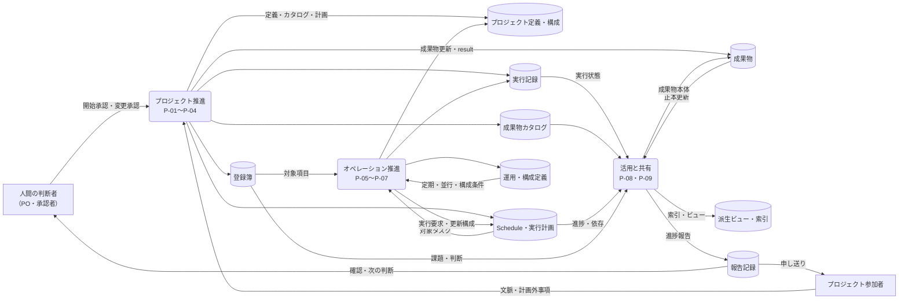

---
specdojo:
  id: prj-0001:cdfd-overview
  type: flow
  status: draft
  rulebook: specdojo:cdfd-overview-rulebook
  based_on: []
  supersedes: []
---

# 概念データフロー図（全体概要）: SpecDojo

本書は、SpecDojo を用いたプロジェクト推進とオペレーション推進を、九つのプロセス領域と領域間の情報・イベントの流れとして定義する。仕様で知識と作業をつなぐというプロジェクト方針に沿い、人と AI Agent が同じ正本から計画・実行・判断を引き継げる全体境界を合意するために使用する。

## 1. 目的と適用範囲

- 対象者は、対象範囲を承認する PO、全体の業務仕様を整理する BA、領域別 CDFD を設計入力として使う ARC、領域分割の重複・欠落を確認する QE である。
- 対象は、プロジェクト開始から登録簿運用、計画展開、タスク実行、定期・並行運用、構成変更、派生生成、報告までの情報の受け渡しである。
- 人間の判断者、プロジェクト参加者、AI Agent は、正本を参照・更新する主体として扱う。社会課題、期待価値、主要判断、公開可否の最終責任は人間の判断者が持つ。
- 本書は TO-BE の全体概要である。個別コマンド、ファイル単位の更新、状態遷移、例外復旧、実装エビデンスは領域別 CDFD と後続の retrofit-pass で詳細化する。
- `list`、`where`、`status`、`validate`、`dry-run` など、状態や成果物を変更しない参照・検証操作は独立した業務フローに含めず、各領域を支える補助操作として扱う。

## 2. プロセス領域一覧

<!-- prettier-ignore -->
| 領域 ID | プロセス領域 | 業務目的 | 主な担当 | 起点イベント | 主要入力 | 主要出力 | データストア | 領域別 CDFD |
| --- | --- | --- | --- | --- | --- | --- | --- | --- |
| `P-01` | 初期セットアップ | プロジェクトの目的と運用方針を、計画と実行を開始できる正本へ展開する。 | PM、BA | 新しいプロジェクトの開始が承認された | プロジェクト文脈、初期方針、参加条件 | プロジェクト定義・構成、成果物カタログの初期状態、運用開始条件 | プロジェクト定義・構成、成果物カタログ、運用・構成定義 | [[prj-0001:cdfd-init\|初期セットアップ]] |
| `P-02` | 登録簿運用 | 計画外事項、判断、リスク、課題を継続的に追跡し、判断と次の行動へつなぐ。 | PM、PO | 計画外事項または判断事項が発生した | 事項の内容、影響、提起者の期待 | 登録項目、状態、判断、次の行動 | 登録簿 | [[prj-0001:cdfd-register-operation\|登録簿ライフサイクル]] |
| `P-03` | 計画展開 | 成果物カタログと実行方針から、依存と実行可能性を確認できる計画を作る。 | PM | カタログと計画方針が準備または変更された | 成果物カタログ、依存、計画方針、登録簿の制約 | Schedule、実行計画、実行可能なタスク情報 | 成果物カタログ、Schedule・実行計画 | [[prj-0001:cdfd-catalog-planning\|カタログ〜計画展開]] |
| `P-04` | タスク実行 | 実行可能なタスクを人または AI Agent が担当し、成果物と検証可能な実行結果を残す。 | タスク owner、レビュー担当 | 実行可能なタスクが選択された | Schedule、edit / review plan、対象成果物、判断済みの前提 | 更新成果物、result、実行状態、判断依頼 | 成果物、実行記録 | [[prj-0001:cdfd-task-execution\|タスク実行ライフサイクル]] |
| `P-05` | 定期運用 | 定義された時期・条件に基づき、継続的な確認または実行を起動して結果を反映する。 | PM、運用担当 | 定期実行の期限または条件が到来した | 定期運用定義、Schedule、登録簿・実行状態 | 実行要求、更新された状態、継続判断材料 | 運用・構成定義、Schedule・実行計画、登録簿、実行記録 | [[prj-0001:cdfd-routine\|定期運用]] |
| `P-06` | 並行運用 | 独立して進められる複数の実行単位を分離し、競合を管理しながら結果を統合する。 | PM、タスク owner | 独立した実行可能タスクが複数存在する | 実行可能なタスク、依存、並行運用条件 | 実行割当、分離された作業結果、統合状態 | 運用・構成定義、Schedule・実行計画、実行記録 | [[prj-0001:cdfd-multi-project\|複数プロジェクト・ブランチ並行運用]] |
| `P-07` | 構成変更 | agent、provider、プロジェクト構成の承認済み変更を、後続実行の条件へ反映する。 | PM、PO | 運用構成の変更が承認された | 変更要求、現行構成、影響・代替案、承認結果 | 更新された構成、適用条件、再計画要求 | 登録簿、プロジェクト定義・構成、運用・構成定義 | [[prj-0001:cdfd-agent-config-operation\|agent・provider 構成の運用変更]] |
| `P-08` | 派生生成 | 正本の更新を、利用者が参照できる成果物、索引、ビューへ一貫して展開する。 | BA、運用担当 | 正本が更新された、または派生生成が要求された | 成果物カタログ、Schedule、成果物、実行記録 | 成果物本体、派生ビュー、索引、タイムライン | 成果物、実行記録、派生ビュー・索引 | [[prj-0001:cdfd-derived-content\|成果物・派生ビュー・索引生成]] |
| `P-09` | 報告 | 進捗、判断、課題、費用・参加負荷を、確認者が次の判断に使える情報へまとめる。 | PM、BA | 節目、判断時点、または報告時期が到来した | Schedule、登録簿、実行記録、派生ビュー、費用・作業記録 | 進捗報告、判断材料、申し送り | 実行記録、派生ビュー・索引、報告記録 | [[prj-0001:cdfd-reporting\|進捗監視・報告・ログ管理]] |

## 3. 概念データフロー

凡例: 角丸長方形はプロセスグループ（内訳の領域 ID は2章の一覧表を参照）、円柱はデータストア、四角は外部主体、`-->` は情報の流れを表す。個々の領域の起点イベントは2章の一覧表に記載し、本図では省略する。本図は情報の全体関係を対象とし、現物の流れは対象外とする。

## 4. 境界と分割方針

### 4.1. 対象境界

| 区分           | 判定                                                                         | 本書での扱い                                                                   |
| -------------- | ---------------------------------------------------------------------------- | ------------------------------------------------------------------------------ |
| 独立領域       | 固有の起点イベントと業務成果を持ち、正本または実行単位を作成・更新・引き渡す | `P-01`〜`P-09` として表と図に記載する                                          |
| 補助操作       | 状態や成果物を変更せず、他領域の参照、検索、検証、事前確認を支援する         | 独立領域にせず、支援先の入力確認または観測として領域別 CDFD で必要時に記載する |
| 領域別詳細     | 個別コマンド、ファイル、状態遷移、例外復旧、実装エビデンスに基づく現在動作   | 各領域別 CDFD と後続 retrofit-pass へ委譲する                                  |
| 人間の最終判断 | 社会課題、期待価値、主要変更、公開可否、継続・停止について責任を伴う判断     | 外部主体「人間の判断者」と、承認・確認の情報フローとして残す                   |
| AI Agent 支援  | 記録、提案、実行、検証を担うが、人間の最終判断を代替しない                   | タスク実行などの担当になり得るが、独立した業務領域にはしない                   |

補助操作の例である `list`、`where`、`status`、`validate`、`dry-run` は、参照・検証対象の領域に従属する。将来、補助操作が承認、記録更新、独立した成果の引き渡しを担うようになった場合は、固有の起点と出力を確認した上で領域化を再判断する。

### 4.2. 領域別 CDFD への対応

| 領域 ID | 全体概要上の責務                                   | 詳細化先                                                                 | 重複・欠落の判定                                                           |
| ------- | -------------------------------------------------- | ------------------------------------------------------------------------ | -------------------------------------------------------------------------- |
| `P-01`  | 開始可能な正本と初期状態を作る                     | [[prj-0001:cdfd-init\|初期セットアップ]]                                 | 初期生成だけを扱い、運用中の構成変更は `P-07` に委譲する                   |
| `P-02`  | 計画外事項と判断を継続管理する                     | [[prj-0001:cdfd-register-operation\|登録簿ライフサイクル]]               | 計画済みタスクの実行は `P-04`、計画への展開は `P-03` に委譲する            |
| `P-03`  | カタログと方針を Schedule・実行計画へ展開する      | [[prj-0001:cdfd-catalog-planning\|カタログ〜計画展開]]                   | 成果物の編集は `P-04`、派生ビュー生成は `P-08` に委譲する                  |
| `P-04`  | 一つのタスクを実行し成果物と result を残す         | [[prj-0001:cdfd-task-execution\|タスク実行ライフサイクル]]               | 定期起動は `P-05`、並行割当と統合は `P-06` に委譲する                      |
| `P-05`  | 時期・条件に基づいて継続作業を起動する             | [[prj-0001:cdfd-routine\|定期運用]]                                      | 個々のタスク処理は `P-04`、複数実行の分離は `P-06` に委譲する              |
| `P-06`  | 独立タスクを分離して実行し結果を統合する           | [[prj-0001:cdfd-multi-project\|複数プロジェクト・ブランチ並行運用]]      | タスク内部の正常・例外処理は `P-04`、運用条件の変更は `P-07` に委譲する    |
| `P-07`  | 承認済みの運用構成変更を後続条件へ反映する         | [[prj-0001:cdfd-agent-config-operation\|agent・provider 構成の運用変更]] | 初回構築は `P-01`、変更後の計画再展開は `P-03` に委譲する                  |
| `P-08`  | 正本から成果物、索引、ビューを派生させる           | [[prj-0001:cdfd-derived-content\|成果物・派生ビュー・索引生成]]          | 正本の内容更新は `P-04`、派生物を使った判断材料の作成は `P-09` に委譲する  |
| `P-09`  | 状態と結果を集約し、確認・判断・申し送りへ引き渡す | [[prj-0001:cdfd-reporting\|進捗監視・報告・ログ管理]]                    | 正本の更新や状態遷移を行わず、判断後の変更は `P-02`、`P-03`、`P-07` へ戻す |

### 4.3. 横断論点の正本

領域間で同じ情報を受け渡す場合も、詳細規則は次の一文書だけを正本とする。ほかの領域別 CDFD は、自領域で必要な入力・出力・停止条件の要約を残し、正本を参照する。

| 横断論点                                                | 正本                                                                     | 他領域に残す範囲                         |
| ------------------------------------------------------- | ------------------------------------------------------------------------ | ---------------------------------------- |
| 九領域の分割、領域 ID、領域間の受け渡し                 | 本書                                                                     | 領域固有の起点、入出力、委譲条件         |
| 初回 scaffold と必須・任意の初期化境界                  | [[prj-0001:cdfd-init\|初期セットアップ]]                                 | 初期化済み正本を受け取る条件             |
| 登録項目の type、状態、日時、結論、履歴                 | [[prj-0001:cdfd-register-operation\|登録簿ライフサイクル]]               | 個票を選択・生成・監視するための要約     |
| Schedule・event からの state、Ready、CPM、timeline 算出 | [[prj-0001:cdfd-catalog-planning\|カタログ〜計画展開]]                   | 算出物の利用目的と再計算要求             |
| task の claim・complete・block・訂正・再実行            | [[prj-0001:cdfd-task-execution\|タスク実行ライフサイクル]]               | task 実行への委譲入力と返却結果          |
| routine / Job の due、冪等性、結果・次回判定            | [[prj-0001:cdfd-routine\|定期運用]]                                      | 定期起動または報告契機の受け渡し         |
| branch / worktree の分離、同期、統合、後片付け          | [[prj-0001:cdfd-multi-project\|複数プロジェクト・ブランチ並行運用]]      | 分離実行の要求、成果物、result、統合成否 |
| agent / provider / phase 構成と権限・認証境界           | [[prj-0001:cdfd-agent-config-operation\|agent・provider 構成の運用変更]] | 必要能力、選択結果、構成変更要求         |
| 派生物の生成先、起動順、上書き・陳腐化境界              | [[prj-0001:cdfd-derived-content\|成果物・派生ビュー・索引生成]]          | 正本の意味と派生物の利用目的             |
| 遅延・滞留検知、進捗報告、議事録、整合確認              | [[prj-0001:cdfd-reporting\|進捗監視・報告・ログ管理]]                    | 報告入力と報告後の正本更新要求           |

### 4.4. 受入確認

| 確認者 | 確認対象       | 受入条件                                                                                          |
| ------ | -------------- | ------------------------------------------------------------------------------------------------- |
| BA     | 業務価値と網羅 | 九領域の目的と相互の情報・イベントの流れを、一覧と全体図の両方から説明できる                      |
| PO     | 対象境界       | 独立領域と補助操作、領域別詳細、人間の最終判断の境界を承認できる                                  |
| ARC    | 詳細化入力     | 各領域の起点イベント、主要入力、主要出力、データストア、詳細化先を一行で識別できる                |
| QE     | 重複・欠落     | `P-01`〜`P-09` が全体図と詳細化先へ一対一に対応し、責務の重複・委譲先の欠落がないことを確認できる |
