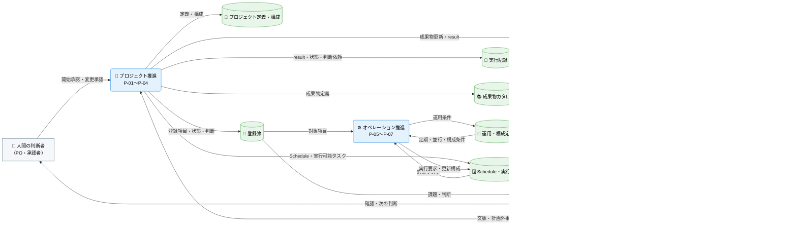

---
specdojo:
  id: prj-0001:cdfd-overview
  type: flow
  status: draft
  rulebook: specdojo:cdfd-overview-rulebook
  based_on: []
  supersedes: []
---

# 概念データフロー図（全体概要）: SpecDojo

本書は、SpecDojo のプロジェクト推進とオペレーション推進を、九つのプロセス領域と領域間の情報・イベントの流れとして定義する全体概要である。

## 1. 目的

仕様で知識と作業をつなぐというプロジェクト方針に沿い、人と AI Agent が同じ正本から計画・実行・判断を引き継げる全体境界を合意するために使用する。対象者は、対象範囲を承認する PO、全体の業務仕様を整理する BA、領域別 CDFD を設計入力として使う ARC、領域分割の重複・欠落を確認する QE である。

## 2. 適用範囲

- 対象は、プロジェクト開始から登録簿運用、計画展開、タスク実行、定期・並行運用、構成変更、派生生成、報告までの情報の受け渡しである。
- 本書は九つのプロセス領域の全体境界を示す概念データフローである。個別コマンド、ファイル単位の更新、状態遷移、例外復旧、実装エビデンスは、各領域別 CDFD が定める粒度で詳細化する。
- `list`、`where`、`status`、`validate`、`dry-run` など、状態や成果物を変更しない参照・検証操作は独立した業務フローに含めず、各領域を支える補助操作として扱う。
- 人間と AI Agent の責任分担の原則は [[prj-0001:prj-overview|プロジェクト概要]] に従う。

## 3. プロセス領域

業務は九つのプロセス領域に分かれる。九領域の分割、領域 ID、領域間の受け渡しに関する規則は本書を正本とし、各領域内の詳細規則は対応する領域別 CDFD を正本とする。主要入力・主要出力・データストア・詳細化先の役割・委譲境界は「個別プロセス領域概要」に記載する。

<!-- prettier-ignore -->
| 領域 ID | プロセス領域 | 業務目的 | 主な担当 | 起点イベント | 領域別 CDFD |
| --- | --- | --- | --- | --- | --- |
| `P-01` | 初期セットアップ | プロジェクトの目的と運用方針を、計画と実行を開始できる正本へ展開する。 | PM、BA | 新しいプロジェクトの開始が承認された | [[prj-0001:cdfd-init\|初期セットアップ]] |
| `P-02` | 登録簿運用 | 計画外事項、判断、リスク、課題を継続的に追跡し、判断と次の行動へつなぐ。 | PM、PO | 計画外事項または判断事項が発生した | [[prj-0001:cdfd-register-operation\|登録簿ライフサイクル]] |
| `P-03` | 計画展開 | 成果物カタログと実行方針から、依存と実行可能性を確認できる計画を作る。 | PM | カタログと計画方針が準備または変更された | [[prj-0001:cdfd-catalog-planning\|カタログ〜計画展開]] |
| `P-04` | タスク実行 | 実行可能なタスクを人または AI Agent が担当し、成果物と検証可能な実行結果を残す。 | タスク owner、レビュー担当 | 実行可能なタスクが選択された | [[prj-0001:cdfd-task-execution\|タスク実行ライフサイクル]] |
| `P-05` | 定期運用 | 定義された時期・条件に基づき、継続的な確認または実行を起動して結果を反映する。 | PM、運用担当 | 定期実行の期限または条件が到来した | [[prj-0001:cdfd-routine\|定期運用]] |
| `P-06` | 並行運用 | 独立して進められる複数の実行単位を分離し、競合を管理しながら結果を統合する。 | PM、タスク owner | 独立した実行可能タスクが複数存在する | [[prj-0001:cdfd-multi-project\|複数プロジェクト・ブランチ並行運用]] |
| `P-07` | 構成変更 | agent、provider、プロジェクト構成の承認済み変更を、後続実行の条件へ反映する。 | PM、PO | 運用構成の変更が承認された | [[prj-0001:cdfd-agent-config-operation\|agent・provider 構成の運用変更]] |
| `P-08` | 派生生成 | 正本の更新を、利用者が参照できる成果物、索引、ビューへ一貫して展開する。 | BA、運用担当 | 正本が更新された、または派生生成が要求された | [[prj-0001:cdfd-derived-content\|成果物・派生ビュー・索引生成]] |
| `P-09` | 報告 | 進捗、判断、課題、費用・参加負荷を、確認者が次の判断に使える情報へまとめる。 | PM、BA | 節目、判断時点、または報告時期が到来した | [[prj-0001:cdfd-reporting\|進捗監視・報告・ログ管理]] |

## 4. 概念データフロー

凡例: 角丸長方形はプロセスグループ（内訳の領域 ID は「プロセス領域」の一覧表を参照）、円柱はデータストア、四角は外部主体、`-->` は情報の流れを表す。色は形状の補助として概念の大分類単位（プロセスグループ=青、データストア=緑、外部主体=グレー）で付ける。表示ラベル先頭の絵文字は視認性向上のための任意の補助であり、形状・色による意味区別を置き換えない。個々の領域の起点イベントは「プロセス領域」の一覧表または「個別プロセス領域概要」に記載し、本図では省略する。本図は情報の全体関係を対象とし、現物の流れは対象外とする。

## 5. 個別プロセス領域概要

### 5.1. プロジェクト推進（P-01〜P-04）

プロジェクトを開始し、計画外事項を管理しながら計画を立て、個々のタスクを実行するまでの中核フローを担う。初期セットアップで正本を整え、登録簿運用で計画外の判断を継続的に扱い、計画展開で Schedule・実行計画を作り、タスク実行で成果物と result を残す。

#### 5.1.1. P-01 初期セットアップ

- 業務目的: プロジェクトの目的と運用方針を、計画と実行を開始できる正本へ展開する。
- 主な担当: PM、BA
- 起点イベント: 新しいプロジェクトの開始が承認された
- 主要入力: プロジェクト文脈、初期方針、参加条件
- 主要出力: プロジェクト定義・構成、成果物カタログの初期状態、運用開始条件
- データストア: プロジェクト定義・構成、成果物カタログ、運用・構成定義
- 詳細化先（正本）: [[prj-0001:cdfd-init|初期セットアップ]] — 開始可能な正本と初期状態を作る。初回 scaffold と必須・任意の初期化境界の正本であり、他領域には初期化済み正本を受け取る条件だけを残す。
- 委譲境界: 初期生成だけを扱い、運用中の構成変更は `P-07` に委譲する。

#### 5.1.2. P-02 登録簿運用

- 業務目的: 計画外事項、判断、リスク、課題を継続的に追跡し、判断と次の行動へつなぐ。
- 主な担当: PM、PO
- 起点イベント: 計画外事項または判断事項が発生した
- 主要入力: 事項の内容、影響、提起者の期待
- 主要出力: 登録項目、状態、判断、次の行動
- データストア: 登録簿
- 詳細化先（正本）: [[prj-0001:cdfd-register-operation|登録簿ライフサイクル]] — 計画外事項と判断を継続管理する。登録項目の type、状態、日時、結論、履歴の正本であり、他領域には個票を選択・生成・監視するための要約だけを残す。
- 委譲境界: 計画済みタスクの実行は `P-04`、計画への展開は `P-03` に委譲する。

#### 5.1.3. P-03 計画展開

- 業務目的: 成果物カタログと実行方針から、依存と実行可能性を確認できる計画を作る。
- 主な担当: PM
- 起点イベント: カタログと計画方針が準備または変更された
- 主要入力: 成果物カタログ、依存、計画方針、登録簿の制約
- 主要出力: Schedule、実行計画、実行可能なタスク情報
- データストア: 成果物カタログ、Schedule・実行計画
- 詳細化先（正本）: [[prj-0001:cdfd-catalog-planning|カタログ〜計画展開]] — カタログと方針を Schedule・実行計画へ展開する。Schedule・event からの state、Ready、CPM、timeline 算出の正本であり、他領域には算出物の利用目的と再計算要求だけを残す。
- 委譲境界: 成果物の編集は `P-04`、派生ビュー生成は `P-08` に委譲する。

#### 5.1.4. P-04 タスク実行

- 業務目的: 実行可能なタスクを人または AI Agent が担当し、成果物と検証可能な実行結果を残す。
- 主な担当: タスク owner、レビュー担当
- 起点イベント: 実行可能なタスクが選択された
- 主要入力: Schedule、edit / review plan、対象成果物、判断済みの前提
- 主要出力: 更新成果物、result、実行状態、判断依頼
- データストア: 成果物、実行記録
- 詳細化先（正本）: [[prj-0001:cdfd-task-execution|タスク実行ライフサイクル]] — 一つのタスクを実行し成果物と result を残す。task の claim・complete・block・訂正・再実行の正本であり、他領域には task 実行への委譲入力と返却結果だけを残す。
- 委譲境界: 定期起動は `P-05`、並行割当と統合は `P-06` に委譲する。

### 5.2. オペレーション推進（P-05〜P-07）

プロジェクト推進が整えた計画・実行基盤の上で、時期・条件に基づく継続実行、複数タスクの並行運用、承認済みの構成変更を扱う。定期運用と並行運用は実行計画・登録簿を参照して稼働し、構成変更は結果を運用・構成定義とプロジェクト定義へ反映する。

#### 5.2.1. P-05 定期運用

- 業務目的: 定義された時期・条件に基づき、継続的な確認または実行を起動して結果を反映する。
- 主な担当: PM、運用担当
- 起点イベント: 定期実行の期限または条件が到来した
- 主要入力: 定期運用定義、Schedule、登録簿・実行状態
- 主要出力: 実行要求、更新された状態、継続判断材料
- データストア: 運用・構成定義、Schedule・実行計画、登録簿、実行記録
- 詳細化先（正本）: [[prj-0001:cdfd-routine|定期運用]] — 時期・条件に基づいて継続作業を起動する。routine / Job の due、冪等性、結果・次回判定の正本であり、他領域には定期起動または報告契機の受け渡しだけを残す。
- 委譲境界: 個々のタスク処理は `P-04`、複数実行の分離は `P-06` に委譲する。

#### 5.2.2. P-06 並行運用

- 業務目的: 独立して進められる複数の実行単位を分離し、競合を管理しながら結果を統合する。
- 主な担当: PM、タスク owner
- 起点イベント: 独立した実行可能タスクが複数存在する
- 主要入力: 実行可能なタスク、依存、並行運用条件
- 主要出力: 実行割当、分離された作業結果、統合状態
- データストア: 運用・構成定義、Schedule・実行計画、実行記録
- 詳細化先（正本）: [[prj-0001:cdfd-multi-project|複数プロジェクト・ブランチ並行運用]] — 独立タスクを分離して実行し結果を統合する。branch / worktree の分離、同期、統合、後片付けの正本であり、他領域には分離実行の要求、成果物、result、統合成否だけを残す。
- 委譲境界: タスク内部の正常・例外処理は `P-04`、運用条件の変更は `P-07` に委譲する。

#### 5.2.3. P-07 構成変更

- 業務目的: agent、provider、プロジェクト構成の承認済み変更を、後続実行の条件へ反映する。
- 主な担当: PM、PO
- 起点イベント: 運用構成の変更が承認された
- 主要入力: 変更要求、現行構成、影響・代替案、承認結果
- 主要出力: 更新された構成、適用条件、再計画要求
- データストア: 登録簿、プロジェクト定義・構成、運用・構成定義
- 詳細化先（正本）: [[prj-0001:cdfd-agent-config-operation|agent・provider 構成の運用変更]] — 承認済みの運用構成変更を後続条件へ反映する。agent / provider / phase 構成と権限・認証境界の正本であり、他領域には必要能力、選択結果、構成変更要求だけを残す。
- 委譲境界: 初回構築は `P-01`、変更後の計画再展開は `P-03` に委譲する。

### 5.3. 活用と共有（P-08・P-09）

プロジェクト推進・オペレーション推進が生み出した成果物・実行記録を、利用者が参照できる形へ変換し、判断材料として届ける。派生生成は成果物・索引・ビューを作り、報告は進捗・課題・判断材料をまとめて人間の判断者・参加者へ引き渡す。

#### 5.3.1. P-08 派生生成

- 業務目的: 正本の更新を、利用者が参照できる成果物、索引、ビューへ一貫して展開する。
- 主な担当: BA、運用担当
- 起点イベント: 正本が更新された、または派生生成が要求された
- 主要入力: 成果物カタログ、Schedule、成果物、実行記録
- 主要出力: 成果物本体、派生ビュー、索引、タイムライン
- データストア: 成果物、実行記録、派生ビュー・索引
- 詳細化先（正本）: [[prj-0001:cdfd-derived-content|成果物・派生ビュー・索引生成]] — 正本から成果物、索引、ビューを派生させる。派生物の生成先、起動順、上書き・陳腐化境界の正本であり、他領域には正本の意味と派生物の利用目的だけを残す。
- 委譲境界: 正本の内容更新は `P-04`、派生物を使った判断材料の作成は `P-09` に委譲する。

#### 5.3.2. P-09 報告

- 業務目的: 進捗、判断、課題、費用・参加負荷を、確認者が次の判断に使える情報へまとめる。
- 主な担当: PM、BA
- 起点イベント: 節目、判断時点、または報告時期が到来した
- 主要入力: Schedule、登録簿、実行記録、派生ビュー、費用・作業記録
- 主要出力: 進捗報告、判断材料、申し送り
- データストア: 実行記録、派生ビュー・索引、報告記録
- 詳細化先（正本）: [[prj-0001:cdfd-reporting|進捗監視・報告・ログ管理]] — 状態と結果を集約し、確認・判断・申し送りへ引き渡す。遅延・滞留検知、進捗報告、議事録、整合確認の正本であり、他領域には報告入力と報告後の正本更新要求だけを残す。
- 委譲境界: 正本の更新や状態遷移を行わず、判断後の変更は `P-02`、`P-03`、`P-07` へ戻す。
