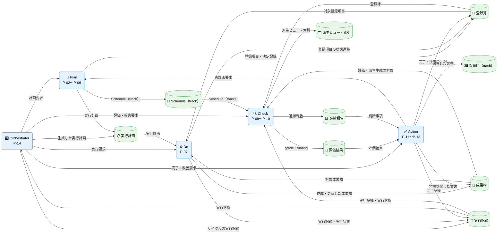
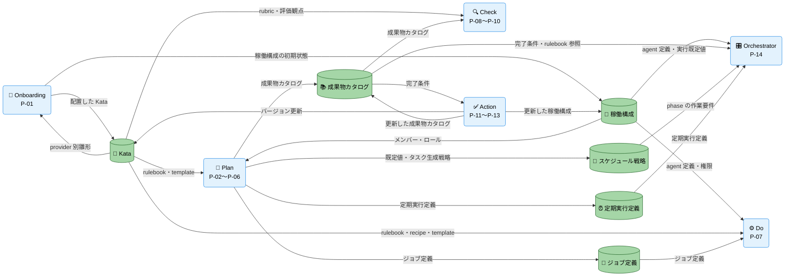
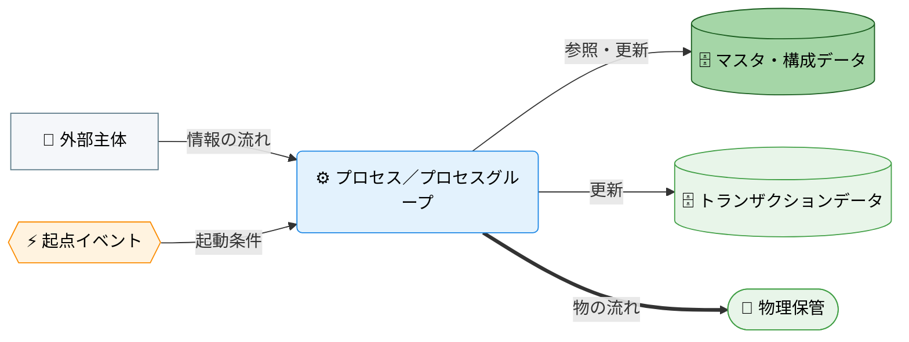

---
specdojo:
  id: cdfd-overview
  type: flow
  status: ready
  rulebook: specdojo:cdfd-overview-rulebook
  based_on: []
  supersedes: []
---

# 概念データフロー図（全体概要）: SpecDojo

本書は、SpecDojo を活用したプロジェクト運営の全体概要について、立ち上げから成果物作成、レビュー、承認までを PDCA サイクルに沿った業務プロセスとして整理する。

## 1. 目的

SpecDojo を活用した仕様駆動開発の全体像を、プロセス領域とデータの連関として整理し、後続のプロセスグループ別 CDFD とユースケース別 CDFD の位置付けを明確にする。対象者と利用場面は次のとおり。

- PO は、プロジェクト運営の対象範囲と領域分割を承認する。
- BA は、各プロセスグループ別 CDFD の範囲と、ユースケース別 CDFD がどの領域を横断するかを本書で確認し、詳細化する。
- ARC は、データストアと領域間の受け渡しを設計入力として使う。
- QE は、領域とプロセスグループ別 CDFD の対応から重複・欠落を確認する。

## 2. 適用範囲

- 対象は、SpecDojo を用いたプロジェクト開始から、成果物作成・改造の計画（P）、実行（D）、評価（C）、改善（A）を含むプロジェクトライフサイクル全体である。
- 本書が扱うのは、プロセス領域の分割と、領域間・データストア間の受け渡しまでである。各領域の内部（個別コマンドの操作手順、ファイル単位の更新内容、領域内の処理の分岐、状態を変える処理と起点イベント、例外時の復旧手順）は対象外とし、プロセスグループ別 CDFD で詳細化する。状態の定義は STSD、状態遷移は CSTD を正本とし、詳細 CDFD は参照に留める。
- `list`、`where`、`status`、`validate`、`dry-run` など、状態や成果物を変更しない参照・検証操作は独立した業務フローに含めず、各領域を支える補助操作として扱う。
- 人間と AI Agent の責任分担は、承認、完了判断、構成変更の承認、非推奨化の判断を人間が担い、成果物の作成・評価・派生生成は人が担うほか AI Agent へ委譲できる、という原則に従う。本書の各領域はこの原則を前提とし、人間の判断を自動処理に置き換えない。

## 3. プロセス領域

業務は 14 のプロセス領域に分かれ、六つのプロセスグループにまとめる。領域の分割と領域間の受け渡しは本書を正本とし、領域内の詳細はプロセスグループ別 CDFD を正本とする。各グループの主要入力・主要出力・データストアは「概念データフロー（概要）」のエッジの根拠である。

### 3.1. Onboarding（P-01）

SpecDojo を導入して Kata を配置し、その雛形から稼働構成の初期状態を整える。

- **主要入力**: プロジェクトの目的・文脈、参加メンバーとロール、利用する agent・provider、Kata の provider 別雛形
- **主要出力**: 配置した Kata、稼働構成の初期状態
- **データストア**: Kata、稼働構成

<!-- prettier-ignore -->
| 領域 ID | プロセス領域 | 業務目的 | 主な担当 | 起点イベント |
| --- | --- | --- | --- | --- |
| `P-01` | プロジェクト初期セットアップ | プロジェクトの推進環境を整備する。 | PO、ARC | PO が新しいプロジェクトを立ち上げた |

### 3.2. Plan（P-02〜P-06）

何を成果物として管理し、いつ・誰が・どのような形で実行するかを定義する。登録簿は計画外事項と判断を受け止め、成果物カタログとスケジュール戦略から Schedule（track）と実行計画を作り、定期実行定義とジョブ定義は定型・定期の実行を計画へ組み込む。

- **主要入力**: Orchestrator からの計画要求、Action からの再計画要求、判明した事項と意思決定、管理対象とする成果物の判断、メンバー・ロール、Kata の rulebook・template、定型・定期実行の要件
- **主要出力**: 登録項目・決定記録、成果物カタログ、スケジュール戦略、Schedule（track）とマイルストーン、実行計画、定期実行定義、ジョブ定義
- **データストア**: 稼働構成、Kata、登録簿、成果物カタログ、スケジュール戦略、Schedule（track）、実行計画、定期実行定義、ジョブ定義

<!-- prettier-ignore -->
| 領域 ID | プロセス領域 | 業務目的 | 主な担当 | 起点イベント |
| --- | --- | --- | --- | --- |
| `P-02` | 登録簿定義 | ticket ベースで気付いた TODO や問題・課題、メモ、決定事項等を記録する。 | 全員（管理責任: PM） | タスクや課題等が判明した、意思決定した |
| `P-03` | 成果物カタログ定義 | プロジェクトの成果物を定義する。 | 全員（管理責任: BA） | 何を成果物として管理するかの判断が確定した |
| `P-04` | スケジュール計画展開 | 成果物カタログとスケジュール戦略から、作成する成果物ごとのタスクを Schedule に展開する。 | PM | 成果物カタログが整備された |
| `P-05` | 定期実行定義 | 定義された時期・条件に基づき、継続的な確認または実行を定義する。 | PM、運用担当 | 定期的に確認・実行する事項が判明した |
| `P-06` | ジョブ定義 | runner が直接実行する決定論的コマンド、または agent へ委譲する判断を定義する。 | 全員（管理責任: PM） | 定型的に実行する処理の手順が定まった |

### 3.3. Do（P-07）

Plan の実行指示に基づき、人または AI Agent が Kata を参照してタスクを実行し、成果物と検証可能な実行記録を残す。定期実行・ジョブ・並行実行はタスク実行の実行形態であり、独立した領域にしない。

- **主要入力**: Orchestrator からの実行要求、実行計画、ジョブ定義、対象成果物、対象登録項目、Kata の rulebook・recipe・template、稼働構成の agent 定義・権限
- **主要出力**: 作成・更新した成果物、登録項目の状態遷移、実行記録（result）、実行状態（ブロック・判断依頼を含む）
- **データストア**: Kata、稼働構成、実行計画、ジョブ定義、登録簿、実行記録、成果物

<!-- prettier-ignore -->
| 領域 ID | プロセス領域 | 業務目的 | 主な担当 | 起点イベント |
| --- | --- | --- | --- | --- |
| `P-07` | タスク実行 | 実行可能なタスクを人または AI Agent が担当し、成果物と検証可能な実行結果を残す。 | タスク owner | 実行指示された |

### 3.4. Check（P-08〜P-10）

成果物と実行記録を評価・可視化し、判断に使える形へ変換する。評価結果と進捗報告は Action の判断材料になり、派生ビュー・索引は参加者の閲覧に供する。

- **主要入力**: Orchestrator からの評価・報告要求、作成・更新された成果物、成果物カタログ、Schedule（track）、登録簿、実行記録・実行状態、Kata の rubric・評価観点
- **主要出力**: 評価結果（grade、finding）、進捗報告、派生ビュー・索引
- **データストア**: Kata、成果物カタログ、成果物、Schedule（track）、登録簿、実行記録、評価結果、進捗報告、派生ビュー・索引

<!-- prettier-ignore -->
| 領域 ID | プロセス領域 | 業務目的 | 主な担当 | 起点イベント |
| --- | --- | --- | --- | --- |
| `P-08` | 成果物評価 | 成果物や登録項目の対応結果を確認し、品質や適合性を評価する。 | レビュー担当者 | 成果物が作成された、または登録項目の対応が完了した |
| `P-09` | 進捗可視化報告 | プロジェクトの進捗状況を可視化し、関係者に報告する。 | PM | 定期的な報告時期が到来した |
| `P-10` | 派生生成閲覧提供 | 派生成果物の生成および閲覧を提供する。 | ARC | 派生成果物の生成が要求された |

### 3.5. Action（P-11〜P-13）

Check の結果と人間の判断に基づき、タスクの完了確定、稼働構成の変更反映、役割を終えた文書の退避を行い、必要に応じて Plan へ再計画を要求する。

- **主要入力**: Orchestrator からの完了・改善要求、評価結果、進捗報告の判断事項、完了条件、構成変更要求と承認結果、非推奨化の判断
- **主要出力**: 完了・決定の記録、完了記録、更新した稼働構成（Kata のバージョン更新を含む）、更新した成果物カタログ、非推奨化した文書、保管した文書、再計画要求
- **データストア**: 稼働構成、Kata、成果物カタログ、登録簿、実行記録、成果物、保管庫（trash）、評価結果、進捗報告

<!-- prettier-ignore -->
| 領域 ID | プロセス領域 | 業務目的 | 主な担当 | 起点イベント |
| --- | --- | --- | --- | --- |
| `P-11` | タスク完了 | 評価済みのタスクの完了を確定して記録し、後続タスクへ引き渡す。 | PO、PM | タスクの評価が完了した |
| `P-12` | 稼働構成管理 | SpecDojo の稼働構成を変更管理する。 | ARC | 稼働構成の変更要求が発生した |
| `P-13` | 非推奨化保管 | 役割を終えた、または新 ID へ引き継がれた文書を非推奨化し、誤参照を防ぐ保管場所へ移す。 | PM、ARC | 文書が新 ID へ引き継がれた、または継続利用しないと判断された |

### 3.6. Orchestrator（P-14）

Plan・Do・Check・Action へ要求を発行して PDCA を回す。参加者の意図に基づく対話型の運転と、定期実行定義に基づく自動運転を含み、各領域の内部処理は担当しない。

- **主要入力**: 稼働構成の agent 定義・実行既定値、参加者の意図、成果物カタログの完了条件、スケジュール戦略の作業要件、定期実行定義、実行状態
- **主要出力**: Plan・Do・Check・Action への要求、生成した実行計画、サイクルの実行記録
- **データストア**: 稼働構成、成果物カタログ、スケジュール戦略、定期実行定義、実行計画、実行記録

<!-- prettier-ignore -->
| 領域 ID | プロセス領域 | 業務目的 | 主な担当 | 起点イベント |
| --- | --- | --- | --- | --- |
| `P-14` | オーケストレーター | プロジェクト全体のタスクやプロセスの PDCA を調整・管理する。 | 全員（管理責任: PM、自動運転は runner） | プロジェクトが開始された、PDCA の各サイクルが到来した |

## 4. データストア一覧

SpecDojo のプロジェクト運営で読み書きするデータストアを、マスタ・構成データとトランザクションデータに分けて示す。`<project-id>` は `docs/ja/projects/<project-id>/` を指す。Git リポジトリ、exec worktree、開発環境の設定（サイトビルド、Git hook、devcontainer、lint）は業務データストアとして扱わない。

### 4.1. マスタ・構成データ

<!-- prettier-ignore -->
| データストア | 主な内容 | 主な保管先 |
| --- | --- | --- |
| 稼働構成 | SpecDojo を稼働させる最低限の設定。リポジトリ層は SpecDojo の依存とバージョン、プロジェクト登録・パス設定、実行既定値、索引規則、agent 権限、オーケストレーター・executor・reporter の定義と入口指示。プロジェクト層はメンバー、ロール、レビュー観点 | `package.json`、 `.specdojo/specdojo.config.json`、 `.specdojo/exec-defaults.yaml`、 `.specdojo/index-config.yaml`、 `.specdojo/<provider>/`、 `.claude/agents/`、 `.claude/settings.json`、 `.codex/`、 `.opencode/`、 `.agents/*.agent.md`、 `.github/agents/`、 `CLAUDE.md`、 `AGENTS.md`、 `<project-id>/030-project-management/pm-members.yaml`、 `<project-id>/030-project-management/pm-roles.yaml`、 `<project-id>/030-project-management/pm-review-viewpoints.yaml` |
| Kata | rulebook、recipe、template、sample、standard、schema、plan・result テンプレート、既定レビュー観点、評価 rubric、provider 別の agent 定義・設定の雛形、agent 向けの記述ルールと skill。内容は product 側で保守し、プロジェクトでは配置とバージョン更新だけを行う | `docs/ja/specdojo/`、 `docs/specdojo/schemas/`、 `templates/<provider>/`、 `.github/instructions/`、 `.claude/rules/`、 `.claude/skills/`、 `.agents/skills/` |
| 成果物カタログ | 成果物 ID、種別、依存、owner、完了条件 | `<project-id>/010-deliverables-catalog/dct-*.yaml` |
| スケジュール戦略 | 既定値、トラックごとのタスク生成戦略（対象カタログ、approach、phase の作業要件、ゲート・マイルストーンの定義） | `<project-id>/schedule/sch-defaults.yaml`、 `<project-id>/schedule/sch-strategy-<track>.yaml` |
| 定期実行定義 | 周期・条件、対象ジョブ、次回判定に使う状態 | `<project-id>/routines/rtn-*.yaml` |
| ジョブ定義 | 実行手順、runner 直接実行か agent 委譲か、成功条件 | `<project-id>/jobs/job-*.yaml` |

### 4.2. トランザクションデータ

<!-- prettier-ignore -->
| データストア | 主な内容 | 主な保管先 |
| --- | --- | --- |
| 登録簿 | 登録項目の個票、登録簿索引、状態遷移イベント | `<project-id>/controls/project-register/` |
| Schedule（track） | トラックごとのタスク、担当、期間、状態と、タスクに依存するマイルストーン。スケジュール戦略と成果物カタログから `schedule build` で生成 | `<project-id>/schedule/sch-track-<track>.yaml`、 `<project-id>/schedule/sch-milestones.yaml`、 `<project-id>/timeline/` |
| 実行計画 | plan。タスクごとの実施手順、対象文書、完了条件 | `<project-id>/execution/exec/plans/` |
| 実行記録 | result、状態遷移イベント、evidence、trial、ジョブ実行記録、agent 実行ログ | `<project-id>/execution/exec/results/`、 `<project-id>/execution/exec/events/`、 `<project-id>/execution/exec/evidence/`、 `<project-id>/execution/exec/trials/`、 `<project-id>/execution/jobs/runs/`、 `logs/` |
| 成果物 | プロジェクトで作成・更新する成果物本体。プロジェクト定義（概要、憲章、スコープ）や計画書も含む | `docs/ja/product/`、 `<project-id>/020-project-definition/`、 `<project-id>/030-project-management/`（稼働構成に属する YAML を除く） |
| 保管庫（trash） | 非推奨化して退避した文書 | `docs/ja/product/trash/`、 `<project-id>/trash/` |
| 評価結果 | 完了条件の判定、grade、finding | `<project-id>/execution/grade/`、 成果物 Frontmatter の `grade` |
| 進捗報告 | ダッシュボード、クリティカルパス、ガントチャート、各種ログの生成ビュー | `<project-id>/execution/generated/`、 `<project-id>/controls/generated/` |
| 派生ビュー・索引 | YAML の閲覧ページ、文書索引、サイトビルド出力（進捗報告に含まれる生成ビューを除く） | 各 `generated/<name>.md`、 `.specdojo/doc-index.json` |

## 5. 概念データフロー（概要）

プロセスは六つのプロセスグループの代表ノード、データストアは「データストア一覧」の各行をノードとし、トランザクションデータとマスタ・構成データの 2 図に分けて示す。矢印は情報または実行要求の受け渡しであり、実行順や毎回の通過を意味しない。更新のエッジは更新前の参照を含む。参加者は各領域の担当として内側にいるため外部主体としては描かない。

### 5.1. トランザクションデータの流れ

Orchestrator が PDCA を駆動し、Plan が登録簿・Schedule（track）・実行計画を作り、Do が実行計画と対象の成果物・登録項目に基づいて成果物と実行記録を生み、Check がそれらを評価結果・進捗報告・派生ビュー・索引へ変換し、Action が判断結果を記録へ戻す流れを示す。

凡例は「凡例（本プロダクト共通）」に従う。`-->` は情報の流れであり、本図は現物の流れを対象外とする。本図はトランザクションデータのみを配置し、マスタ・構成データとの受け渡しは「マスタ・構成データの流れ」に示す。各領域の起点イベントと担当は「プロセス領域」の表に記載し、本図では省略する。本図に外部主体はない。

### 5.2. マスタ・構成データの流れ

Onboarding が Kata を配置して稼働構成を生成し、Plan が成果物カタログ・スケジュール戦略・定期実行定義・ジョブ定義を定義し、各プロセスグループがこれらを基準情報として参照し、Action が承認済みの変更を反映する流れを示す。

凡例は「凡例（本プロダクト共通）」に従う。`-->` は情報の流れであり、本図は現物の流れを対象外とする。本図はマスタ・構成データのみを配置し、Orchestrator から各プロセスグループへの要求とトランザクションデータとの受け渡しは「トランザクションデータの流れ」に示す。本図に外部主体はない。

## 6. 詳細 CDFD 一覧

本書の詳細化先は、プロセスグループ別 CDFD とユースケース別 CDFD の 2 種類である。役割分担は次のとおり。

- プロセスグループ別 CDFD は、グループに属する領域の内部プロセス、起点イベント、例外・復旧、データストアの読み書きを定める正本である。状態の定義は STSD、状態遷移は CSTD を正本とし、プロセスグループ別 CDFD は参照に留める。各領域はちょうど一つのプロセスグループ別 CDFD に属する。
- ユースケース別 CDFD は、複数のプロセスグループをまたぐ順序と引き渡し条件だけを定める。グループ内部のプロセスは再掲せず、プロセスグループ別 CDFD を参照する。単一のグループに閉じる業務はユースケース別 CDFD を作らない。

### 6.1. プロセスグループ別 CDFD

<!-- prettier-ignore -->
| プロセスグループ | 含む領域 | プロセスグループ別 CDFD |
| --- | --- | --- |
| Onboarding | `P-01` | `cdfd-onboarding` |
| Plan | `P-02`〜`P-06` | `cdfd-plan` |
| Do | `P-07` | `cdfd-do` |
| Check | `P-08`〜`P-10` | `cdfd-check` |
| Action | `P-11`〜`P-13` | `cdfd-action` |
| Orchestrator | `P-14` | `cdfd-orchestrator` |

### 6.2. ユースケース別 CDFD

複数のプロセスグループを横断する業務のうち、順序と引き渡し条件を定める必要があるものを示す。定期実行とジョブの運転、進捗報告と閲覧提供、稼働構成の変更、文書の非推奨化と保管は、Orchestrator または単一グループの CDFD で扱い、必要になった時点でユースケース別 CDFD を追加する。

<!-- prettier-ignore -->
| ケース ID | ユースケース | 業務目的 | 横断するプロセスグループ | ユースケース別 CDFD |
| --- | --- | --- | --- | --- |
| `C-01` | 登録簿起票から完了まで | 登録項目の起票から、対応、評価、完了記録までの引き渡しを定める | Plan → Do → Check → Action | `cdfd-uc-register` |
| `C-02` | 成果物の作成から完了まで | 成果物カタログの定義からタスク展開、実行、評価、完了記録までの引き渡しを定める | Plan → Do → Check → Action | `cdfd-uc-deliverable` |

## 7. 凡例（本プロダクト共通）

本プロダクトの全 CDFD（本書、プロセスグループ別 CDFD、ユースケース別 CDFD）が共通して参照するノード形状・色・絵文字の対応を示す。個々の CDFD は、以下の定義を再掲せず、本章への参照に留める。

<!-- prettier-ignore -->
| 概念 | 形状 | 色 | 絵文字例 |
| --- | --- | --- | --- |
| プロセス／プロセスグループ | 角丸長方形 | 青（`#e3f2fd` / `#1e88e5`） | 業務内容が伝わる絵文字（例: ⚙️） |
| 起点イベント | 六角形 | 橙（`#fff3e0` / `#fb8c00`） | 出来事が伝わる絵文字（例: 🚦） |
| データストア（マスタ・構成データ） | 円柱 | 濃い緑（`#a5d6a7` / `#1b5e20`） | 保管物が伝わる絵文字（例: 📐） |
| データストア（トランザクションデータ） | 円柱 | 薄い緑（`#e8f5e9` / `#43a047`） | 保管物が伝わる絵文字（例: 📒） |
| 物理保管 | スタジアム形 | 薄い緑（トランザクションデータと同じ） | 保管場所が伝わる絵文字（例: 🏬） |
| 外部主体 | 四角 | グレー（`#f5f7fa` / `#607d8b`） | 主体が伝わる絵文字（例: 👤） |
| 情報の流れ | ラベル付き `-->` | — | — |
| 物の流れ | ラベル付き `==>` | — | — |

データストアの色分けは、大分類「データストア」の中の業務上のサブ分類を表す。マスタ・構成データは、他のプロセスから参照される比較的安定した基準情報（稼働構成、Kata、成果物カタログ、スケジュール戦略、定期実行定義、ジョブ定義など）を指す。トランザクションデータは、業務活動に伴い都度更新される記録（登録簿、実行記録、成果物、進捗報告など）を指す。物理保管は現物の保管先であり、マスタ・構成データとトランザクションデータのいずれの区分にも属さないため、便宜上トランザクションデータと同じ色を用いる。

ノード形状・線種そのものの記法は `specdojo:cdfd-mermaid-rulebook` に従う。本章は、その記法に基づき本プロダクトが実際に採用する色・絵文字の割り当てを固定する。
