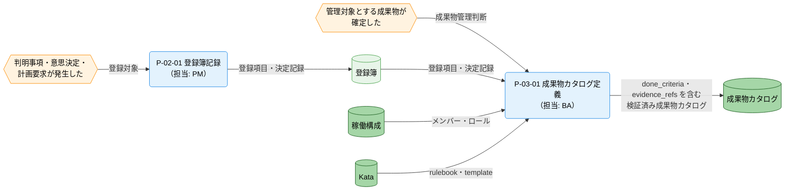
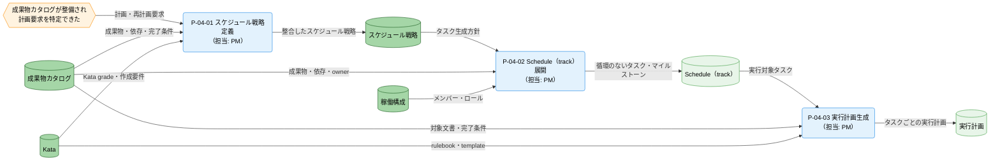
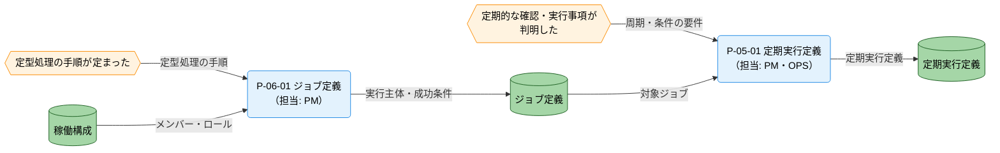

---
specdojo:
  id: cdfd-plan
  type: flow
  status: draft
  rulebook: specdojo:cdfd-rulebook
  based_on:
    - cdfd-overview
---

# 概念データフロー図（Plan）: SpecDojo

## 1. 目的

本書は、[[cdfd-overview|概念データフロー図（全体概要）]] の Plan グループ（P-02〜P-06）を詳細化し、何を管理対象とし、いつ、誰が、どの形で実行するかを合意できるようにする。BA は登録簿、成果物カタログ、スケジュール、定期実行、ジョブの責任境界を利用者視点で確認し、PM は計画を作成・更新する際の入力と完了条件を確認する。ARC は各プロセスによるデータストアの読み書きを設計入力として使い、QE は後続起動を止める例外の検出条件と再開条件を検証に使う。

これにより、技術参加者と非技術参加者が同じ正本を介して計画を引き継ぎ、判断や作業が特定個人の記憶に集中しないプロジェクト運営を支える。

## 2. 適用範囲

- **対象グループ**: Plan（P-02〜P-06）。登録簿定義、成果物カタログ定義、スケジュール計画展開、定期実行定義、ジョブ定義を含む。
- **開始**: Orchestrator から計画要求を受けた、Action から再計画要求を受けた、または参加者が登録、成果物管理、定期実行、定型処理の必要事項を確定した時点とする。
- **終了**: 必要な登録項目・決定記録、成果物カタログ、スケジュール戦略、Schedule（track）とマイルストーン、実行計画、定期実行定義、ジョブ定義が、それぞれの後続利用者へ引き渡せる時点とする。
- **組織境界**: PM、BA、OPS を主担当とし、全参加者による起票・提案・定義を受け付ける。承認や主要判断は人間が担い、AI Agent は定義、展開、検証を支援できる。
- **システム境界**: Plan グループが各正本を定義または更新し、Orchestrator、Do、Check、Action との受け渡しまでを扱う。他グループの内部処理は扱わない。
- **対象外**: 参照、検索、状態確認、検証、dry-run などの補助操作、個別コマンドやファイル更新の実装詳細、Do 以降の実行・評価・完了処理、複数グループを横断する順序、状態名・状態の定義・遷移条件とする。グループ外の責務は「主要例外とグループ外への委譲」、状態は「状態遷移の参照」に示す。

## 3. プロセス領域

Plan グループは、全体概要で定めた五つの領域を含む。本章は領域ごとの主要入力、主要出力、データストアと内部プロセスの正本であり、領域 ID、名称、業務目的、主な担当、起点イベントの上位定義は [[cdfd-overview|概念データフロー図（全体概要）]] を正本とする。

### 3.1. 登録簿定義（P-02）

判明した事項、問題・課題、メモ、意思決定、および計画・再計画の要求を、後続が追跡できる登録項目または決定記録として確定する。起票は全参加者が行え、PM が記録としての成立を担う。

- **主要入力**: Orchestrator からの計画要求、Action からの再計画要求、参加者からの判明した事項と意思決定
- **主要出力**: 登録項目・決定記録
- **データストア**: 登録簿

| プロセス ID | プロセス   | 業務目的                                                     | 主な担当             | 起動条件                                                               | 必須性 |
| ----------- | ---------- | ------------------------------------------------------------ | -------------------- | ---------------------------------------------------------------------- | ------ |
| `P-02-01`   | 登録簿記録 | 判明事項と判断を、担当者が追跡・引継ぎできる正本として残す。 | PM（起票は全参加者） | タスクや課題等が判明した、意思決定した、または計画・再計画要求を受けた | 必須   |

### 3.2. 成果物カタログ定義（P-03）

参加者が管理対象と判断した成果物について、Kata とメンバー・ロールを参照し、依存、owner、`done_criteria`、`evidence_refs` を含む成果物カタログとして確定する。カタログの検証は独立した業務成果にせず、定義を確定するための判定に含める。

- **主要入力**: 参加者からの管理対象とする成果物の判断、メンバー・ロール、Kata の rulebook・template、登録項目・決定記録
- **主要出力**: 成果物カタログ
- **データストア**: 稼働構成、Kata、登録簿、成果物カタログ

| プロセス ID | プロセス           | 業務目的                                                               | 主な担当             | 起動条件                                   | 必須性 |
| ----------- | ------------------ | ---------------------------------------------------------------------- | -------------------- | ------------------------------------------ | ------ |
| `P-03-01`   | 成果物カタログ定義 | 合意した成果物と完了条件を、計画展開に利用できる検証済みの正本にする。 | BA（提案は全参加者） | 何を成果物として管理するかの判断が確定した | 必須   |

### 3.3. スケジュール計画展開（P-04）

成果物カタログとスケジュール戦略を整合させ、担当とマイルストーンを持つ Schedule（track）へ展開し、実行単位ごとの実行計画を生成する。依存関係と Kata の適用条件を展開前に判定し、実行不能な計画を後続へ渡さない。

- **主要入力**: Orchestrator からの計画要求、Action からの再計画要求、成果物カタログ、メンバー・ロール、Kata の rulebook・template
- **主要出力**: スケジュール戦略、Schedule（track）とマイルストーン、実行計画
- **データストア**: 稼働構成、Kata、成果物カタログ、スケジュール戦略、Schedule（track）、実行計画

| プロセス ID | プロセス              | 業務目的                                                                             | 主な担当 | 起動条件                                                               | 必須性 |
| ----------- | --------------------- | ------------------------------------------------------------------------------------ | -------- | ---------------------------------------------------------------------- | ------ |
| `P-04-01`   | スケジュール戦略定義  | 成果物の特性と Kata の適用条件に合うタスク生成方針とマイルストーン基準を確定する。   | PM       | 成果物カタログが整備され、計画要求または再計画要求の対象を特定できた   | 必須   |
| `P-04-02`   | Schedule（track）展開 | 循環のない依存順序、担当、期間、マイルストーンを持つ実行可能なタスク群を成立させる。 | PM       | 成果物カタログとスケジュール戦略が整合し、メンバー・ロールを参照できた | 必須   |
| `P-04-03`   | 実行計画生成          | 各タスクの実施手順、対象文書、完了条件を、担当者が開始できる実行計画として引き渡す。 | PM       | Schedule（track）上のタスクと適用する Kata を特定できた                | 必須   |

### 3.4. 定期実行定義（P-05）

継続的に確認または実行する事項について、周期・条件、対象ジョブ、次回判定に必要な情報を一つの定期実行定義として確定する。対象ジョブが未確定なら後続の自動運転へ引き渡さない。

- **主要入力**: 参加者からの定型・定期実行の要件、ジョブ定義
- **主要出力**: 定期実行定義
- **データストア**: ジョブ定義、定期実行定義

| プロセス ID | プロセス     | 業務目的                                                            | 主な担当 | 起動条件                                                   | 必須性                                                                                  |
| ----------- | ------------ | ------------------------------------------------------------------- | -------- | ---------------------------------------------------------- | --------------------------------------------------------------------------------------- |
| `P-05-01`   | 定期実行定義 | 継続的な確認・実行を、Orchestrator が次回起動を判定できる形にする。 | PM、OPS  | 定期的に確認・実行する事項が判明し、対象ジョブを特定できた | 条件付き。定期要件がない場合は定義を作らず、Plan グループの他の出力だけで正常完了する。 |

### 3.5. ジョブ定義（P-06）

定型処理の手順について、runner が直接実行する決定論的処理か、agent へ委譲する判断を含む処理かを定め、成功条件を持つジョブ定義として確定する。

- **主要入力**: 参加者からの定型・定期実行の要件、定型的に実行する処理の手順、メンバー・ロール
- **主要出力**: ジョブ定義
- **データストア**: 稼働構成、ジョブ定義

| プロセス ID | プロセス   | 業務目的                                                                       | 主な担当             | 起動条件                             | 必須性                                                                                  |
| ----------- | ---------- | ------------------------------------------------------------------------------ | -------------------- | ------------------------------------ | --------------------------------------------------------------------------------------- |
| `P-06-01`   | ジョブ定義 | 定型処理を、実行主体、委譲の要否、成功条件が判定できる再利用可能な定義にする。 | PM（定義は全参加者） | 定型的に実行する処理の手順が定まった | 条件付き。定型処理がない場合は定義を作らず、Plan グループの他の出力だけで正常完了する。 |

## 4. データストア

本章は、全体概要の「データストア」から Plan グループが読み書きする部分集合を、同じ名称と区分で示す。

### 4.1. マスタ・構成データ

| データストア     | 読み書き   | 本グループでの利用                                                                                                                      |
| ---------------- | ---------- | --------------------------------------------------------------------------------------------------------------------------------------- |
| 稼働構成         | 参照       | メンバー・ロールを成果物、Schedule（track）、ジョブの担当と実行主体の判断に用いる。                                                     |
| Kata             | 参照       | rulebook・template と grade を、成果物定義およびスケジュール戦略・実行計画との適合判定に用いる。                                        |
| 成果物カタログ   | 参照・更新 | 管理対象の成果物、依存、owner、`done_criteria`、`evidence_refs` を定義し、スケジュール戦略、Schedule（track）、実行計画の入力に用いる。 |
| スケジュール戦略 | 参照・更新 | タスク生成方針とマイルストーン基準を定義し、Schedule（track）展開に用いる。                                                             |
| 定期実行定義     | 更新       | 周期・条件、対象ジョブ、次回判定に使う情報を定義し、Orchestrator の自動運転へ引き渡す。                                                 |
| ジョブ定義       | 参照・更新 | 実行手順、runner 直接実行か agent 委譲か、成功条件を定義し、定期実行定義と Do の実行入力に用いる。                                      |

### 4.2. トランザクションデータ

| データストア      | 読み書き   | 本グループでの利用                                                                               |
| ----------------- | ---------- | ------------------------------------------------------------------------------------------------ |
| 登録簿            | 参照・更新 | 判明事項、課題、意思決定、計画・再計画要求を記録し、成果物カタログ定義の判断根拠として参照する。 |
| Schedule（track） | 更新       | 成果物ごとのタスク、担当、期間、状態とマイルストーンを、依存順序に従って展開する。               |
| 実行計画          | 更新       | Schedule（track）の各タスクについて、実施手順、対象文書、完了条件を生成する。                    |

## 5. 概念データフロー

### 5.1. 登録簿と成果物カタログの定義

凡例は [[cdfd-overview|概念データフロー図（全体概要）]] の「凡例（本プロダクト共通）」に従う。`-->` は情報の流れであり、本図は物の流れを対象外とする。カタログ検証の不成立経路は「主要例外」に示すため図から省略する。稼働構成と Kata は「スケジュール計画展開」と共有し、登録簿と成果物カタログは後続領域との受け渡しに再掲する。

### 5.2. スケジュール計画の展開

凡例は [[cdfd-overview|概念データフロー図（全体概要）]] の「凡例（本プロダクト共通）」に従う。`-->` は情報の流れであり、本図は物の流れを対象外とする。依存の循環と strategy・Kata grade の不整合による停止経路は「主要例外」に示すため図から省略する。稼働構成、Kata、成果物カタログは「登録簿と成果物カタログの定義」と共有し、後続の Do への引き渡しは「グループ外への委譲」に示す。

### 5.3. 定期実行とジョブの定義

凡例は [[cdfd-overview|概念データフロー図（全体概要）]] の「凡例（本プロダクト共通）」に従う。`-->` は情報の流れであり、本図は物の流れを対象外とする。定期要件または定型処理がない正常な非起動経路は、該当プロセスを起動せず Plan グループを完了するため図から省略する。稼働構成は他の二図と共有し、Orchestrator と Do への引き渡しは「グループ外への委譲」に示す。

## 6. 個別プロセス主要入出力

### 6.1. 登録簿と成果物カタログの定義

| プロセス ID | プロセス           | 主要入力                                                                       | 主要出力                                              | データストア                                                           |
| ----------- | ------------------ | ------------------------------------------------------------------------------ | ----------------------------------------------------- | ---------------------------------------------------------------------- |
| `P-02-01`   | 登録簿記録         | 判明事項、意思決定、計画要求、再計画要求                                       | 登録項目・決定記録                                    | 登録簿（更新）                                                         |
| `P-03-01`   | 成果物カタログ定義 | 管理対象成果物の判断、登録項目・決定記録、メンバー・ロール、rulebook・template | `done_criteria`・`evidence_refs` を含む成果物カタログ | 稼働構成（参照）、Kata（参照）、登録簿（参照）、成果物カタログ（更新） |

### 6.2. スケジュール計画の展開

| プロセス ID | プロセス              | 主要入力                                                       | 主要出力                           | データストア                                                                                  |
| ----------- | --------------------- | -------------------------------------------------------------- | ---------------------------------- | --------------------------------------------------------------------------------------------- |
| `P-04-01`   | スケジュール戦略定義  | 計画・再計画要求、成果物・依存・完了条件、Kata grade・作成要件 | スケジュール戦略                   | Kata（参照）、成果物カタログ（参照）、スケジュール戦略（更新）                                |
| `P-04-02`   | Schedule（track）展開 | タスク生成方針、成果物・依存・owner、メンバー・ロール          | タスク、担当、期間、マイルストーン | 稼働構成（参照）、成果物カタログ（参照）、スケジュール戦略（参照）、Schedule（track）（更新） |
| `P-04-03`   | 実行計画生成          | 実行対象タスク、対象文書、完了条件、rulebook・template         | タスクごとの実行計画               | Kata（参照）、成果物カタログ（参照）、Schedule（track）（参照）、実行計画（更新）             |

### 6.3. 定期実行とジョブの定義

| プロセス ID | プロセス     | 主要入力                                         | 主要出力     | データストア                             |
| ----------- | ------------ | ------------------------------------------------ | ------------ | ---------------------------------------- |
| `P-05-01`   | 定期実行定義 | 周期・条件の要件、対象ジョブ、次回判定に使う情報 | 定期実行定義 | ジョブ定義（参照）、定期実行定義（更新） |
| `P-06-01`   | ジョブ定義   | 定型処理の手順、メンバー・ロール                 | ジョブ定義   | 稼働構成（参照）、ジョブ定義（更新）     |

## 7. 状態遷移の参照

本書では状態名、意味、成立条件、遷移元、遷移先、イベント、遷移条件を定義しない。登録項目と Schedule（track）のタスクの状態は STSD、状態遷移は CSTD を正本とする。

| 対象                      | 状態を変えるプロセス            | 状態定義（STSD）                           | 状態遷移（CSTD）                           |
| ------------------------- | ------------------------------- | ------------------------------------------ | ------------------------------------------ |
| 登録項目                  | `P-02-01` 登録簿記録            | `登録項目の STSD（文書 ID 未確定）`        | `登録項目の CSTD（文書 ID 未確定）`        |
| Schedule（track）のタスク | `P-04-02` Schedule（track）展開 | `Schedule タスクの STSD（文書 ID 未確定）` | `Schedule タスクの CSTD（文書 ID 未確定）` |

参照先の STSD / CSTD 文書 ID は「未決事項」で追跡する。

## 8. 主要例外とグループ外への委譲

### 8.1. 主要例外

| 例外 ID   | 対象プロセス | 検出条件                                                                                                            | 本グループでの扱い                                                        | 継続・再開条件                                                                                            |
| --------- | ------------ | ------------------------------------------------------------------------------------------------------------------- | ------------------------------------------------------------------------- | --------------------------------------------------------------------------------------------------------- |
| `E-03-01` | `P-03-01`    | 成果物カタログの成果物 ID、依存、owner、`done_criteria`、`evidence_refs` のいずれかがカタログの検証条件を満たさない | 成果物カタログを確定せず、P-04 の起動を止め、検出事項を定義担当へ戻す     | 不適合箇所が修正され、成果物カタログの検証が成功した時点で `P-03-01` の確定判定から再開する               |
| `E-04-01` | `P-04-02`    | 成果物またはタスクの依存をたどると同じ対象へ戻り、順序を確定できない                                                | Schedule（track）と実行計画を更新せず、循環に関わる依存を判断者へ提示する | 成果物カタログまたはスケジュール戦略の依存が修正され、循環なく順序付けできた時点で `P-04-02` から再開する |
| `E-04-02` | `P-04-01`    | strategy が要求する作業要件または grade と、適用する Kata の grade が整合しない                                     | スケジュール戦略を確定せず、Schedule（track）以降の展開を止める           | 要件を満たす Kata を選ぶか、人間が strategy の要求を修正し、両者の整合を確認して `P-04-01` から再開する   |
| `E-05-01` | `P-05-01`    | 定期実行要件が参照する対象ジョブを一意に特定できない                                                                | 定期実行定義を確定せず、自動運転への引き渡しを止める                      | 対象のジョブ定義が確定し、周期・条件と対応付けられた時点で `P-05-01` から再開する                         |
| `E-06-01` | `P-06-01`    | runner 直接実行か agent 委譲か、または成功条件のいずれかを判定できない                                              | ジョブ定義を確定せず、定期実行定義および Do への引き渡しを止める          | 実行主体、委譲の要否、成功条件が合意され、判定可能になった時点で `P-06-01` から再開する                   |

### 8.2. グループ外への委譲

| 委譲先                | 委譲する事項                                                   | 引き渡す情報                                                                         | 本グループへ戻す条件                                                                            |
| --------------------- | -------------------------------------------------------------- | ------------------------------------------------------------------------------------ | ----------------------------------------------------------------------------------------------- |
| `cdfd-orchestrator`   | PDCA サイクルの起動、Plan への要求発行、定期実行の次回起動判定 | 計画要求への応答、成果物カタログの完了条件、スケジュール戦略、定期実行定義、実行計画 | 新たな計画要求または、実行状態に基づく再計画要求が発行されたとき                                |
| `cdfd-do`             | 実行計画またはジョブ定義に基づくタスクの実行                   | 実行計画、ジョブ定義、対象成果物・登録項目を特定する情報                             | 実行結果から計画変更が必要と判断され、Orchestrator または Action から再計画要求が発行されたとき |
| `cdfd-uc-register`    | 登録簿起票から対応、評価、完了記録までのグループ横断順序       | 登録項目・決定記録、および対応開始を判断できる情報                                   | 対応結果により新たな登録事項または再計画要求が生じたとき                                        |
| `cdfd-uc-deliverable` | 成果物定義から実行、評価、完了記録までのグループ横断順序       | 成果物カタログ、Schedule（track）、実行計画                                          | 評価または完了判断によりカタログ、スケジュール、実行計画の変更が必要になったとき                |

## 9. 未決事項

- _TODO_: 登録項目と Schedule（track）のタスク状態を定義する STSD / CSTD の文書 ID を確定する。P-02-01、P-04-02、および状態参照の設計入力に影響する。PM と ARC が、対応する STSD / CSTD の作成または登録時に決定する。
