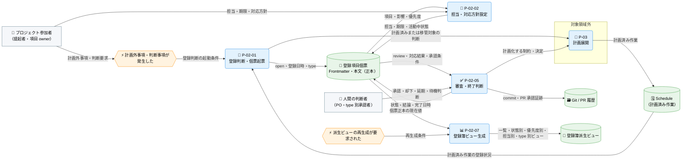
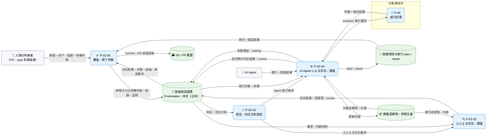

---
specdojo:
  id: prj-0001:cdfd-register-operation
  type: flow
  status: ready
  rulebook: specdojo:cdfd-rulebook
  based_on:
    - prj-0001:cdfd-init
  supersedes: []
---

# 概念データフロー図（登録簿ライフサイクル）: SpecDojo

本書は、[[prj-0001:cdfd-overview|概念データフロー図（全体概要）]] が定める `P-02 登録簿ライフサイクル` の境界を引き継ぎ、立ち上げ時の未整理事項と運用中の計画外事項を、個票の起票から対応、審査、終了、再開、派生生成、履歴確認、例外復旧まで継続管理する概念仕様である。BA が登録簿と Schedule の境界を整理し、PO、ARC、QE が人間の判断責任、正本、状態遷移、主要例外を同じ表と図から確認するために使用する。

## 1. 目的

- BA とプロジェクト参加者が、七つの登録 type の選択基準、計画済み作業との境界、起票後の利用場面を確認できるようにする。
- PO と type 別承認者が、`review` から終了・却下・延期・待機へ進む判断、commit と PR の適用境界、終了後の再開条件を承認できるようにする。
- ARC が個票正本から状態、日時、結論、派生ビュー、実行記録、変更履歴へ至る入出力を、QE が Agent 実行失敗、ID 競合、worktree 失敗の停止範囲と再開条件を後続設計・検証へ引き渡せるようにする。

## 2. 適用範囲

- 対象は、計画外事項または判断事項の発生から、type を選んだ個票の起票、担当・期限・対応方針の設定、人または AI Agent による対応、審査、終了・保留・再開、派生ビュー生成、Git 履歴からの変更履歴再構成、ID 競合復旧までである。
- 登録簿は `todo`、`question`、`risk`、`issue`、`change-request`、`decision`、`note` を扱う。計画済み作業の実行は対象外とし、`P-03 計画展開` と `P-04 タスク実行` に委譲する。
- 正本は一項目一ファイルの個票 Frontmatter と本文である。登録項目一覧、状態別・優先度別・担当者別ビュー、リスク・課題・変更要求・決定の管理ビューは正本から再生成する派生物であり、直接編集しない。
- `list`、`history` の絞り込み、`dry-run`、検証など、正本を変更しない補助操作は独立プロセスにしない。worktree 運用は [[prj-0001:cdfd-multi-project|概念データフロー図（複数プロジェクト・ブランチ並行処理）]]、派生ビュー生成は [[prj-0001:cdfd-derived-content|概念データフロー図（成果物・派生ビュー・索引生成）]] に委譲し、本領域では登録項目へ返る状態、result、再開条件だけを扱う。
- AI Agent は対応・調査と検証を支援できるが、項目を終端化しない。内容承認、却下、延期、再開、公開・高リスク変更の最終判断は、人と AI Agent の責任分担を定める [[prj-0001:prj-overview|プロジェクト概要]] に従い人間が担う。

### 2.1. 登録判断と Schedule との境界

| 区分             | 登録する判断                                                                     | 主な次の行動                                               |
| ---------------- | -------------------------------------------------------------------------------- | ---------------------------------------------------------- |
| `todo`           | 実施が決まった計画外の単発作業で、担当・期限・完了を追跡する必要がある           | 人または AI Agent が対応し、結果を審査する                 |
| `question`       | 回答権限者による回答・確認が必要である                                           | 調査結果と回答者を記録し、`decided` として終了する         |
| `risk`           | まだ顕在化していない懸念について、対応方針・受容・延期を判断する必要がある       | リスクオーナーが方針を審査する                             |
| `issue`          | 既に発生した問題について、解消または対応判断を追跡する必要がある                 | 課題リードが対応結果を審査する                             |
| `change-request` | 成果物、仕様、計画、構成の変更について、実施前の承認が必要である                 | PO / CCB が承認対象差分を審査する                          |
| `decision`       | 選択肢、決定、理由、承認証跡を後から参照できるようにする必要がある               | 意思決定者が内容を確定し、`decided` として終了する         |
| `note`           | 回答・対応・承認を要求せず、共有・備忘として残す必要がある                       | 担当者が記録の充足を確認する                               |
| Schedule         | カタログに定義された成果物の作成・レビュー・確定、または依存に基づく計画済み作業 | `P-03` で計画し、`P-04` で実行する。登録簿へ重複登録しない |

登録後に事項が計画済みの成果物作業へ移る場合は、個票へ移管先と結論を残して終了し、実作業は Schedule 側だけで追跡する。

### 2.2. 状態・日時・結論の記録規則

| 状態                                | 業務上の意味                     | 記録規則                                                             |
| ----------------------------------- | -------------------------------- | -------------------------------------------------------------------- |
| `open`                              | 起票済み、未着手                 | 起票時に `registered_at` を UTC の時刻として記録する                 |
| `in-progress`                       | 担当者または Agent が対応中      | 担当、期限、対応内容を個票へ反映する                                 |
| `waiting`                           | 外部回答、前提解消、失敗復旧待ち | 待機理由と再開条件を結論欄または本文へ残す                           |
| `review`                            | 人間の審査・承認待ち             | 対応結果、検証結果、承認対象と証跡候補をそろえる                     |
| `done` / `decided` / `rejected`     | 完了、決定、却下                 | 結論と `completed_at` を記録する                                     |
| `deferred`                          | 現時点では実施せず延期           | 延期理由と再評価条件を記録する。完了日時は終了の証跡として要求しない |
| 終了状態から活動中状態への `reopen` | 新事実により再評価する           | 旧結論を消さずに再開理由を追記し、`completed_at` を削除する          |

`registered_at` と `completed_at` は UTC・RFC 3339・秒精度で正本に保持し、一覧の登録日・完了日はプロジェクトの IANA タイムゾーンへ変換した暦日として導出する。期限は同タイムゾーン上の暦日として保持する。

### 2.3. type 別の審査と承認方式

| type             | 審査・承認者               | `review` 後の主な判断                      | 既定の証跡       |
| ---------------- | -------------------------- | ------------------------------------------ | ---------------- |
| `change-request` | 変更承認権限者（PO / CCB） | approve 後に `done`、または却下・延期      | PR approve       |
| `decision`       | 当該領域の意思決定者       | `decided`、または却下・延期・追加確認待ち  | 個票と commit    |
| `risk`           | リスクオーナー             | 対応完了、受容、延期、追加確認待ち         | 個票と commit    |
| `question`       | 回答権限者                 | 回答確定後に `decided`、または追加確認待ち | 個票と commit    |
| `issue`          | 課題リード                 | 対応確認後に `done`、または却下・延期      | result と commit |
| `todo`           | 項目 owner・レビュー担当   | 対応確認後に `done`、または延期・待機      | result と commit |
| `note`           | 項目 owner                 | 記録充足後に `done`                        | 個票と commit    |

既定は commit による証跡とする。PR 承認を強制するのは、`develop → main` 昇格、`change-request` 承認、不可逆・高リスク・framework schema 破壊的変更の三ケースであり、それ以外の日常の Agent commit や Schedule の計画済みタスクへ PR ゲートを広げない。詳細は [[specdojo:register-operation-guide|登録簿運用ガイド]] と [[specdojo:git-branching-standard|Git ブランチ運用標準]] を正とする。

## 3. 領域内プロセス一覧

<!-- prettier-ignore -->
| プロセス ID | プロセス | 業務目的 | 主な担当 | 起動条件 | 必須性 |
| --- | --- | --- | --- | --- | --- |
| `P-02-01` | 登録判断・個票起票 | 追跡が必要な計画外事項・判断を適切な type で識別し、引き継げる正本を作る。 | BA、PM、提起者 | 計画外事項、未整理事項、判断要求、または追跡が必要な気づきが発生した | 必須 |
| `P-02-02` | 担当・対応方針設定 | 項目の担当、期限、対応経路を定め、着手・待機・審査へ進められる状態にする。 | 項目 owner、PM | `open` の項目が起票された、または再開された | 必須 |
| `P-02-03` | 人による対応・調査 | 人間の知識と責任が必要な対応・調査を行い、審査可能な結果と判断材料を整える。 | 項目 owner、専門担当 | 対応方針で人による対応・調査を選択した | 条件付き。非選択時は Agent 対応または人間の直接判断へ進む |
| `P-02-04` | AI Agent による対応・調査 | 実行可能な type の項目を plan と result に展開し、検証可能な対応結果を人間の審査へ渡す。 | AI Agent、実行担当 | 活動中の `todo`・`issue`・`change-request`・`question`・`risk` について Agent 利用を選択した | 条件付き。非選択時と `decision`・`note` は人が扱う |
| `P-02-05` | 審査・終了判断 | 対応結果または判断内容を権限者が確認し、終了・却下・延期・待機の扱いと証跡を確定する。 | type 別承認者、レビュー担当 | 対応・調査結果がそろい `review` になった、または人間の終了判断が必要になった | 必須 |
| `P-02-06` | 終了項目の再開 | 終了後に前提・状況が変わった項目を、過去の結論を参照できる活動中の状態へ戻す。 | 項目 owner、type 別承認者 | `done`・`decided`・`rejected`・`deferred` の再評価条件が成立した | 条件付き。条件不成立時は終了状態を維持する |
| `P-02-07` | 登録簿ビュー生成 | 個票正本の現在値を、利用者が一覧・状態・優先度・担当・type 別に確認できる派生ビューへ展開する。 | BA、運用担当 | 個票が作成・更新された、または派生ビューの再生成が要求された | 必須。個票更新ごとに正本から再生成する |
| `P-02-08` | 登録項目履歴再構成 | 個票の Git 履歴から、追加・変更・削除・状態遷移を項目単位で監査できる履歴へ戻す。 | PM、監査・確認担当 | 期間レビュー、監査、経緯確認が必要になった | 条件付き。確認要求がなければ履歴出力を作らない |
| `P-02-09` | ID 競合・参照復旧 | 重複 ID または個票ファイル名と文書 ID の不整合を解消し、個票と参照を一貫した ID へ戻す。 | PM、ARC | 検証または派生生成で ID 重複・命名不整合を検出した | 条件付き。不整合がなければ再採番しない |

`P-02-04` の実行対象外である `decision` と `note` は、人間が `P-02-03` で内容を整える。`P-02-07` と `P-02-08` は参照・監査を可能にするが、個票正本の値を独自に変更しない。

## 4. 概念データフロー

個票ごとに必要となる起票・方針設定・審査・派生生成、選択によって起動する対応・調査、終了後にだけ起動する再開・監査・ID復旧では性質が異なるため、フローを三図に分ける。

### 4.1. 必須プロセスのフロー

凡例: ノード形状・線種・色・絵文字は [[prj-0001:cdfd-overview|概念データフロー図（全体概要）]] の「凡例（本プロダクト共通）」に従う。`P-03 計画展開` は委譲先を示す領域外の代表ノードであり、内部処理は本図の対象外とする。本図は現物の流れを扱わない。

### 4.2. 対応・調査のフロー

凡例: `P-02-02` と `P-02-05` は必須プロセスのフロー（4.1）と同一のプロセスを指す。ノード形状・線種・色・絵文字は [[prj-0001:cdfd-overview|概念データフロー図（全体概要）]] の「凡例（本プロダクト共通）」に従う。`P-06 並行処理` は委譲先を示す領域外の代表ノードであり、内部処理は本図の対象外とする。本図は現物の流れを扱わない。

### 4.3. 再開・監査・ID復旧のフロー

```mermaid
flowchart LR
  classDef process fill:#e3f2fd,stroke:#1e88e5,color:#000
  classDef event fill:#fff3e0,stroke:#fb8c00,color:#000
  classDef store fill:#e8f5e9,stroke:#43a047,color:#000
  classDef actor fill:#f5f7fa,stroke:#607d8b,color:#000

  プロジェクト参加者["👥 プロジェクト参加者<br>（提起者・項目 owner）"]
  人間判断者["👤 人間の判断者<br>（PO・type 別承認者）"]

  再評価条件成立{{"⚡ 終了項目の再評価条件が<br>成立した"}}
  履歴確認要求{{"⚡ 期間レビュー・監査が<br>要求された"}}
  競合検出{{"⚡ ID 重複・命名不整合を<br>検出した"}}

  担当対応方針設定("🧭 P-02-02<br>担当・対応方針設定")
  終了項目再開("🔄 P-02-06<br>終了項目の再開")
  登録項目履歴再構成("🕘 P-02-08<br>登録項目履歴再構成")
  ID競合参照復旧("🛠️ P-02-09<br>ID 競合・参照復旧")

  登録項目個票[("📒 登録項目個票<br>Frontmatter・本文（正本）")]
  関連成果物[("📦 関連成果物・参照文書")]
  登録実行記録[("📝 登録項目の実行<br>plan / result")]
  Git履歴[("🗃️ Git / PR 履歴")]
  登録簿派生ビュー[("🔎 登録簿派生ビュー")]
  登録項目履歴[("📜 register history")]

  登録項目個票 -->|"終了状態・旧結論"| 再評価条件成立
  人間判断者 -->|"新事実・再開判断"| 再評価条件成立
  再評価条件成立 -->|"再開条件"| 終了項目再開
  終了項目再開 -->|"活動中状態・再開理由"| 登録項目個票
  終了項目再開 -->|"担当・方針の再設定要求"| 担当対応方針設定

  Git履歴 -->|"個票 commit 履歴"| 履歴確認要求
  履歴確認要求 -->|"対象 ID・期間・状態条件"| 登録項目履歴再構成
  登録項目履歴再構成 -->|"追加・変更・削除・状態遷移"| 登録項目履歴
  登録項目履歴 -->|"項目別変更イベント・commit 証跡"| プロジェクト参加者

  登録項目個票 -->|"重複 ID・命名検証結果"| 競合検出
  競合検出 -->|"競合個票・未使用 ID"| ID競合参照復旧
  登録実行記録 -->|"targets・個票参照"| ID競合参照復旧
  ID競合参照復旧 -->|"再採番個票・文書 ID"| 登録項目個票
  ID競合参照復旧 -->|"更新した wikilink"| 関連成果物
  ID競合参照復旧 -->|"更新した targets・個票参照"| 登録実行記録
  ID競合参照復旧 -->|"再生成した派生ビュー"| 登録簿派生ビュー
  ID競合参照復旧 -->|"rename commit"| Git履歴

  class 担当対応方針設定,終了項目再開,登録項目履歴再構成,ID競合参照復旧 process
  class 再評価条件成立,履歴確認要求,競合検出 event
  class 登録項目個票,関連成果物,登録実行記録,Git履歴,登録簿派生ビュー,登録項目履歴 store
  class プロジェクト参加者,人間判断者 actor
```

凡例: `P-02-02` は必須プロセスのフロー（4.1）および対応・調査のフロー（4.2）と同一のプロセスを指す。ノード形状・線種・色・絵文字は [[prj-0001:cdfd-overview|概念データフロー図（全体概要）]] の「凡例（本プロダクト共通）」に従う。本図は現物の流れを扱わない。

## 5. 個別プロセス主要入出力

登録項目個票は Frontmatter の構造化フィールド、H1 のタイトル、本文の説明・判断材料を合わせた正本である。プロセス ID、業務目的、主な担当、起動条件、必須性は「領域内プロセス一覧」を参照する。

### 5.1. 必須プロセス（P-02-01・P-02-02・P-02-05・P-02-07）

個票の登録判断から担当・対応方針、権限者の終了判断、正本更新後の派生ビュー生成まで、登録した各項目で必要となる処理を扱う。

<!-- prettier-ignore -->
| プロセス ID | プロセス | 主要入力 | 主要出力 | データストア |
| --- | --- | --- | --- | --- |
| `P-02-01` | 登録判断・個票起票 | 事項の内容、影響、提起者の期待、Schedule 登録状況 | `open` の登録項目、登録日時、type、優先度、担当・期限の初期値、計画側への移管判断 | 登録項目個票、Schedule |
| `P-02-02` | 担当・対応方針設定 | 個票、影響、優先度、担当候補、外部依存 | 担当・期限・説明、`in-progress` または `waiting`、人・Agent・直接判断の対応経路 | 登録項目個票 |
| `P-02-05` | 審査・終了判断 | 個票、対応結果、検証結果、承認条件、commit または PR の証跡 | `done` / `decided` / `rejected` / `deferred` / `waiting`、結論、必要な完了日時・承認証跡 | 登録項目個票、Git / PR 履歴 |
| `P-02-07` | 登録簿ビュー生成 | 全登録項目個票、表示タイムゾーン、ビュー雛形 | 登録項目一覧、状態別・優先度別・担当者別ビュー、リスク・課題・変更要求・決定ビュー | 登録項目個票、登録簿派生ビュー |

### 5.2. 対応・調査プロセス（P-02-03・P-02-04）

対応手段（人・AI Agent）の選択によってだけ起動する処理を扱う。

<!-- prettier-ignore -->
| プロセス ID | プロセス | 主要入力 | 主要出力 | データストア |
| --- | --- | --- | --- | --- |
| `P-02-03` | 人による対応・調査 | 個票、関連成果物、判断材料、承認条件 | 対応結果、回答案、対応方針、審査要求 | 登録項目個票、関連成果物 |
| `P-02-04` | AI Agent による対応・調査 | 個票、実行 plan、関連成果物、実行条件 | 成功時は対応結果・result と `review`、失敗時は失敗理由・result と `waiting` | 登録項目個票、関連成果物、登録項目の実行 plan / result |

### 5.3. 再開・監査・ID復旧プロセス（P-02-06・P-02-08・P-02-09）

終了後の状況変化、監査要求、ID 不整合の検出によってだけ起動する処理を扱う。

<!-- prettier-ignore -->
| プロセス ID | プロセス | 主要入力 | 主要出力 | データストア |
| --- | --- | --- | --- | --- |
| `P-02-06` | 終了項目の再開 | 個票、旧結論、新事実、再開理由、担当・期限 | `open` / `in-progress` / `waiting` / `review`、削除した完了日時、再開後の対応条件 | 登録項目個票 |
| `P-02-08` | 登録項目履歴再構成 | 個票の Git commit 履歴、対象 ID・期間・状態条件、表示タイムゾーン | 古い順の登録項目変更イベント、状態遷移履歴、commit 証跡 | Git 履歴、register history |
| `P-02-09` | ID 競合・参照復旧 | 競合した個票、未使用 ID、参照文書、登録項目の実行 plan / result | 再採番した個票、更新した文書 ID・wikilink・targets、再生成した派生ビュー | 登録項目個票、参照文書、登録項目の実行 plan / result、派生ビュー、Git 履歴 |

## 6. 主要例外と領域外への委譲

### 6.1. 主要例外

| 例外 ID | 対象プロセス                    | 検出条件                                                                                    | 本領域での扱い                                                                                                                                                                                                  | 継続・再開条件                                                                |
| ------- | ------------------------------- | ------------------------------------------------------------------------------------------- | --------------------------------------------------------------------------------------------------------------------------------------------------------------------------------------------------------------- | ----------------------------------------------------------------------------- |
| `E-01`  | `P-02-01`、`P-02-07`、`P-02-09` | type・状態・日時・期限が不正、個票 Frontmatter が読めない、ファイル名と文書 ID が一致しない | 正本の確定または派生生成を停止し、不正な個票と項目を特定する。生成済みビューを正本として補正せず、ID 重複・命名不整合は `P-02-09` で復旧する                                                                    | 個票の値・命名・文書 ID が規約に一致し、全個票の検証が成功する                |
| `E-02`  | `P-02-04`                       | Agent 実行、検査、result 作成、または項目単位 commit が失敗した                             | 項目を終端化せず `waiting` とし、サニタイズした失敗理由と result、commit の未完了状態を残す。後続項目の停止・継続判断を示す                                                                                     | 原因を解消し、保持した成果物・result を確認したうえで再実行または人対応を選ぶ |
| `E-03`  | `P-02-04`                       | worktree 経路が失敗し、成果物を統合先へ確定できない                                         | 統合済みと扱わず、当該項目を `waiting` にして失敗段階、未統合 result、再開条件を記録する。分離・同期・統合時の保持対象と復旧順は [[prj-0001:cdfd-multi-project\|複数プロジェクト・ブランチ並行処理]] を参照する | 並行処理側で統合可能と確認され、返却された成果物・result を人間が審査できる   |
| `E-04`  | `P-02-05`                       | 審査材料、権限者、回答、承認証跡、または終了に必要な結論が不足している                      | `review` から終端化せず `waiting` へ戻し、不足情報、取得責任者、再審査条件を記録する                                                                                                                            | 不足情報と必要な commit / PR 証跡がそろい、権限者が再審査できる               |
| `E-05`  | `P-02-09`                       | 個票の表示 ID が重複する、再採番先が使用済み、または個票ファイル名と文書 ID が一致しない    | 書き換え前に個票、再採番先、参照文書、実行記録の対象を検証し、不整合があれば書き込みを始めない。未使用 ID と変更対象は dry-run で確認する                                                                       | 個票・文書 ID・wikilink・targets を一貫して更新でき、派生生成と検証が成功する |

### 6.2. 領域外への委譲

| 委譲先                                                                                 | 委譲する事項                                                | 引き渡す情報                                                     | 本領域へ戻す条件                                                           |
| -------------------------------------------------------------------------------------- | ----------------------------------------------------------- | ---------------------------------------------------------------- | -------------------------------------------------------------------------- |
| `P-03 計画展開`（[[prj-0001:cdfd-catalog-planning\|カタログ〜計画展開]]）              | 登録事項を成果物カタログ・Schedule の計画済み作業へ展開する | 確定した制約・決定、対象成果物、依存、優先度、登録項目の移管結論 | 計画化前に追加判断が必要、または計画の前提が変わり計画外事項が生じる       |
| `P-04 タスク実行`（[[prj-0001:cdfd-task-execution\|タスク実行ライフサイクル]]）        | Schedule で管理する計画済みタスクを実行する                 | Schedule task、plan、対象成果物、登録簿から引き継いだ前提        | 実行中に新しい計画外事項・判断要求・変更要求が生じる                       |
| `P-06 並行処理`（[[prj-0001:cdfd-multi-project\|複数プロジェクト・ブランチ並行処理]]） | 登録項目の worktree 分離、同期、統合を管理する              | 対象項目、分離条件、統合先、成果物、commit・検証結果             | 同期・統合の成否を登録項目の `review` / `waiting` と result へ反映するとき |
| `P-08 派生生成`（[[prj-0001:cdfd-derived-content\|成果物・派生ビュー・索引生成]]）     | 派生ビューの生成順、生成先の所有権、部分失敗後の再生成      | 個票正本、表示タイムゾーン、ビュー雛形、生成対象                 | 生成失敗が個票の不正または登録簿の運用判断に起因すると判明する             |
| Git / PR 運用（[[specdojo:git-branching-standard\|Git ブランチ運用標準]]）             | commit と限定された PR による証跡・職務分離を強制する       | 個票差分、承認対象、承認者、検査結果、PR URL・merge commit       | 証跡を個票の結論・承認節へ反映するとき                                     |
