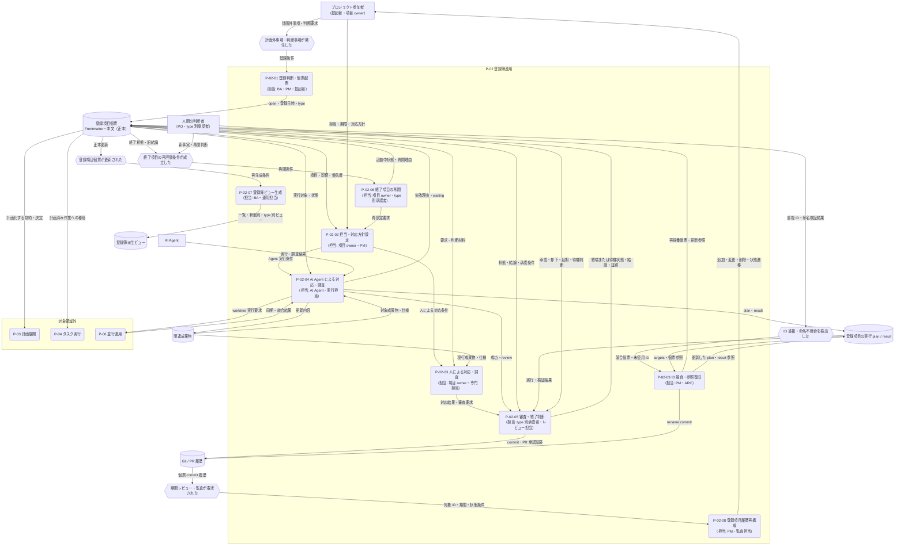

---
specdojo:
  id: prj-0001:cdfd-register-operation
  type: flow
  status: draft
  rulebook: specdojo:cdfd-rulebook
  based_on:
    - prj-0001:cdfd-init
  supersedes: []
---

# 概念データフロー図（登録簿ライフサイクル）: SpecDojo

本書は、[[prj-0001:cdfd-overview|概念データフロー図（全体概要）]] が定める `P-02 登録簿運用` の境界を引き継ぎ、立ち上げ時の未整理事項と運用中の計画外事項を、個票の起票から対応、審査、終了、再開、派生生成、履歴確認、例外復旧まで継続管理する TO-BE フローを定義する。BA が登録簿と Schedule の境界を整理し、PO、ARC、QE が人間の判断責任、正本、状態遷移、主要例外を同じ表と図から確認するために使用する。

## 1. 目的と適用範囲

- 対象者は、登録判断と利用場面を整理する BA、内容承認と終了判断を担う PO・承認者、個票正本と派生先を設計入力にする ARC、状態遷移と復旧経路を確認する QE、事項を提起・対応するプロジェクト参加者である。
- 対象は、計画外事項または判断事項の発生から、type を選んだ個票の起票、担当・期限・対応方針の設定、人または AI Agent による対応、審査、終了・保留・再開、派生ビュー生成、Git 履歴からの変更履歴再構成、ID 競合復旧までである。
- 登録簿は `todo`、`question`、`risk`、`issue`、`change-request`、`decision`、`note` を扱う。成果物カタログと依存関係から Schedule へ展開済みの成果物作成・レビュー・確定は `P-03 計画展開` と `P-04 タスク実行` の責務とし、登録簿と二重管理しない。
- 正本は一項目一ファイルの個票 Frontmatter と本文である。登録項目一覧、状態別・優先度別・担当者別ビュー、リスク・課題・変更要求・決定の管理ビューは正本から再生成する派生物であり、直接編集しない。
- AI Agent は対応・調査と検証を支援できるが、項目を終端化しない。内容承認、却下、延期、再開、公開・高リスク変更の最終判断は人間が担う。
- `list`、`history` の絞り込み、`dry-run`、検証など、正本を変更しない補助操作は独立プロセスにしない。worktree の作成・同期・統合は [[prj-0001:cdfd-multi-project|概念データフロー図（複数プロジェクト・ブランチ並行運用）]] を正本とし、本領域では登録項目へ返る `review` / `waiting`、result、再開条件だけを扱う。

### 1.1. 登録判断と Schedule との境界

| 区分             | 登録する判断                                                                     | 主な次の行動                                               |
| ---------------- | -------------------------------------------------------------------------------- | ---------------------------------------------------------- |
| `todo`           | 実施が決まった計画外の単発作業で、担当・期限・完了を追跡する必要がある           | 人または AI Agent が対応し、結果を審査する                 |
| `question`       | 回答権限者による回答・確認が必要である                                           | 調査結果と回答者を記録し、`decided` として終了する         |
| `risk`           | まだ顕在化していない懸念について、対応方針・受容・延期を判断する必要がある       | リスクオーナーが方針を審査する                             |
| `issue`          | 既に発生した問題について、解消または対応判断を追跡する必要がある                 | 課題リードが対応結果を審査する                             |
| `change-request` | 成果物、仕様、計画、構成の変更について、実施前の承認が必要である                 | PO / CCB が承認対象差分を審査する                          |
| `decision`       | 選択肢、決定、理由、承認証跡を後から参照できるようにする必要がある               | 意思決定者が内容を確定し、`decided` として終了する         |
| `note`           | 回答・対応・承認を要求せず、共有・備忘として残す必要がある                       | 担当者が記録の充足を確認する                               |
| Schedule         | カタログに定義された成果物の作成・レビュー・確定、または依存に基づく計画済み作業 | `P-03` で計画し、`P-04` で実行する。登録簿へ重複登録しない |

登録後に事項が計画済みの成果物作業へ移る場合は、個票へ移管先と結論を残して終了し、実作業は Schedule 側だけで追跡する。

## 2. 領域内プロセス一覧

<!-- prettier-ignore -->
| プロセス ID | プロセス | 業務目的 | 主な担当 | 起動条件 | 主要入力 | 主要出力・生成先 | 正本・データストア | 必須性 |
| --- | --- | --- | --- | --- | --- | --- | --- | --- |
| `P-02-01` | 登録判断・個票起票 | 追跡が必要な計画外事項・判断を適切な type で識別し、引き継げる正本を作る。 | BA、PM、提起者 | 計画外事項、未整理事項、判断要求、または追跡が必要な気づきが発生した | 事項の内容、影響、提起者の期待、Schedule 登録状況 | `open` の登録項目、登録日時、type、優先度、担当・期限の初期値 → 個票 | 登録項目個票 | 必須 |
| `P-02-02` | 担当・対応方針設定 | 項目の担当、期限、対応経路を定め、着手・待機・審査へ進められる状態にする。 | 項目 owner、PM | `open` の項目が起票された、または再開された | 個票、影響、優先度、担当候補、外部依存 | 更新された担当・期限・説明、`in-progress` または `waiting` の状態 | 登録項目個票 | 必須 |
| `P-02-03` | 人による対応・調査 | 人間の知識と責任が必要な対応・調査を行い、審査可能な結果と判断材料を整える。 | 項目 owner、専門担当 | 対応方針が確定し、人による対応・調査を選択した | 個票、関連成果物、判断材料、承認条件 | 対応結果、回答案、対応方針、審査要求 | 登録項目個票、関連成果物 | 条件付き |
| `P-02-04` | AI Agent による対応・調査 | 実行可能な type の項目を plan と result に展開し、検証可能な対応結果を人間の審査へ渡す。 | AI Agent、実行担当 | 活動中の `todo`・`issue`・`change-request`・`question`・`risk` について agent 利用を選択した | 個票、実行 plan、関連成果物、実行条件 | 成功時は対応結果・result と `review`、失敗時は失敗理由・result と `waiting` | 登録項目個票、成果物、登録項目の実行 plan / result | 条件付き |
| `P-02-05` | 審査・終了判断 | 対応結果または判断内容を権限者が確認し、終了・却下・延期・待機の扱いと証跡を確定する。 | type 別承認者、レビュー担当 | 対応・調査結果がそろい `review` になった、または人間の終了判断が必要になった | 個票、対応結果、検証結果、承認条件、PR または commit の証跡 | `done` / `decided` / `rejected` / `deferred` / `waiting`、結論、必要な完了日時・承認証跡 | 登録項目個票、Git / PR 証跡 | 必須 |
| `P-02-06` | 終了項目の再開 | 終了後に前提・状況が変わった項目を、過去の結論を参照できる活動中の状態へ戻す。 | 項目 owner、type 別承認者 | `done`・`decided`・`rejected`・`deferred` の再評価条件が成立した | 個票、旧結論、新事実、再開理由、担当・期限 | `open` / `in-progress` / `waiting` / `review`、削除された完了日時、再開後の対応条件 | 登録項目個票 | 条件付き |
| `P-02-07` | 登録簿ビュー生成 | 個票正本の現在値を、利用者が一覧・状態・優先度・担当・type 別に確認できる派生ビューへ展開する。 | BA、運用担当 | 個票が作成・更新された、または派生ビューの再生成が要求された | 全登録項目個票、表示タイムゾーン、ビュー雛形 | 登録項目一覧、状態別・優先度別・担当者別ビュー、リスク・課題・変更要求・決定ビュー | 登録項目個票 → 登録簿派生ビュー | 必須 |
| `P-02-08` | 登録項目履歴再構成 | 個票の Git 履歴から、追加・変更・削除・状態遷移を項目単位で監査できる履歴へ戻す。 | PM、監査・確認担当 | 期間レビュー、監査、経緯確認が必要になった | 個票の Git コミット履歴、対象 ID・期間・状態条件、表示タイムゾーン | 古い順の登録項目変更イベント、状態遷移履歴、commit 証跡 | Git 履歴 → register history | 条件付き |
| `P-02-09` | ID 競合・参照復旧 | 重複 ID または個票ファイル名と文書 ID の不整合を解消し、個票と参照を一貫した ID へ戻す。 | PM、ARC | 検証または派生生成で ID 重複・命名不整合を検出した | 競合した個票、未使用 ID、参照元、登録項目の実行 plan / result | 再採番した個票、更新した文書 ID・wikilink・targets、再生成した派生ビュー | 登録項目個票、参照文書、登録項目の実行 plan / result、派生ビュー | 条件付き |

`P-02-04` の実行対象外である `decision` と `note` は、人間が `P-02-03` で内容を整える。`P-02-07` と `P-02-08` は参照・監査を可能にするが、個票正本の値を独自に変更しない。

登録簿における type・状態・日時・結論と、各ビューへ載せる意味情報は本書を正本とする。`register build` の起動順、生成先の所有権、部分失敗・陳腐化後の再生成は [[prj-0001:cdfd-derived-content|概念データフロー図（成果物・派生ビュー・索引生成）]] を参照する。

### 2.1. 状態・日時・結論の記録規則

| 状態                                | 業務上の意味                     | 記録規則                                                             |
| ----------------------------------- | -------------------------------- | -------------------------------------------------------------------- |
| `open`                              | 起票済み、未着手                 | 起票時に `registered_at` を UTC の時刻として記録する                 |
| `in-progress`                       | 担当者または Agent が対応中      | 担当、期限、対応内容を個票へ反映する                                 |
| `waiting`                           | 外部回答、前提解消、失敗復旧待ち | 待機理由と再開条件を結論欄または本文へ残す                           |
| `review`                            | 人間の審査・承認待ち             | 対応結果、検証結果、承認対象と証跡候補をそろえる                     |
| `done` / `decided` / `rejected`     | 完了、決定、却下                 | 結論と `completed_at` を記録する                                     |
| `deferred`                          | 現時点では実施せず延期           | 延期理由と再評価条件を記録する。完了日時は終了の証跡として要求しない |
| 終了状態から活動中状態への `reopen` | 新事実により再評価する           | 旧結論を消さずに再開理由を追記し、`completed_at` を削除する          |

`registered_at` と `completed_at` は UTC・RFC 3339・秒精度で正本に保持し、一覧の登録日・完了日はプロジェクトの IANA タイムゾーンへ変換した暦日として導出する。期限は同タイムゾーン上の暦日として保持する。

### 2.2. type 別の審査と承認方式

| type             | 審査・承認者               | `review` 後の主な判断                      | 既定の証跡       |
| ---------------- | -------------------------- | ------------------------------------------ | ---------------- |
| `change-request` | 変更承認権限者（PO / CCB） | approve 後に `done`、または却下・延期      | PR approve       |
| `decision`       | 当該領域の意思決定者       | `decided`、または却下・延期・追加確認待ち  | 個票と commit    |
| `risk`           | リスクオーナー             | 対応完了、受容、延期、追加確認待ち         | 個票と commit    |
| `question`       | 回答権限者                 | 回答確定後に `decided`、または追加確認待ち | 個票と commit    |
| `issue`          | 課題リード                 | 対応確認後に `done`、または却下・延期      | result と commit |
| `todo`           | 項目 owner・レビュー担当   | 対応確認後に `done`、または延期・待機      | result と commit |
| `note`           | 項目 owner                 | 記録充足後に `done`                        | 個票と commit    |

既定は commit による証跡とする。PR 承認を強制するのは、`develop → main` 昇格、`change-request` 承認、不可逆・高リスク・framework schema 破壊的変更の三ケースであり、それ以外の日常の Agent commit や Schedule の計画済みタスクへ PR ゲートを広げない。詳細は [[specdojo:register-operation-guide|登録簿運用ガイド]] と [[specdojo:git-branching-standard|Git ブランチ運用標準]] を正とする。

## 3. 概念データフロー

凡例: 角丸長方形は一つのプロセス、六角形は起点・更新イベント、円柱は正本または継続的な保管先、四角は外部主体、`-->` は情報の流れを表す。`P-03`、`P-04`、`P-06` は委譲先の代表ノードであり、内部処理は本図の対象外とする。本図は現物の流れを扱わない。

## 4. 主要例外と領域外への委譲

### 4.1. 主要例外

| 例外 ID | 対象プロセス         | 検出条件                                                                                    | 本領域での扱い                                                                                                                                                                                                  | 継続・再開条件                                                                |
| ------- | -------------------- | ------------------------------------------------------------------------------------------- | --------------------------------------------------------------------------------------------------------------------------------------------------------------------------------------------------------------- | ----------------------------------------------------------------------------- |
| `E-01`  | `P-02-01`、`P-02-07` | type・状態・日時・期限が不正、個票 Frontmatter が読めない、ファイル名と文書 ID が一致しない | 正本の確定または派生生成を停止し、不正な個票と項目を特定する。生成済みビューを正本として補正しない                                                                                                              | 個票の値・命名・文書 ID が規約に一致し、全個票の検証が成功する                |
| `E-02`  | `P-02-04`            | Agent 実行、検査、result 作成、または項目単位 commit が失敗した                             | 項目を終端化せず `waiting` とし、サニタイズした失敗理由と result、commit の未完了状態を残す。後続項目の停止・継続判断を示す                                                                                     | 原因を解消し、保持した成果物・result を確認したうえで再実行または人対応を選ぶ |
| `E-03`  | `P-02-04`            | worktree 経路が失敗し、成果物を統合先へ確定できない                                         | 統合済みと扱わず、当該項目を `waiting` にして失敗段階、未統合 result、再開条件を記録する。分離・同期・統合時の保持対象と復旧順は [[prj-0001:cdfd-multi-project\|複数プロジェクト・ブランチ並行運用]] を参照する | 並行運用側で統合可能と確認され、返却された成果物・result を人間が審査できる   |
| `E-04`  | `P-02-05`            | 審査材料、権限者、回答、承認証跡、または終了に必要な結論が不足している                      | `review` から終端化せず `waiting` へ戻し、不足情報、取得責任者、再審査条件を記録する                                                                                                                            | 不足情報と必要な commit / PR 証跡がそろい、権限者が再審査できる               |
| `E-05`  | `P-02-09`            | 個票の表示 ID が重複する、再採番先が使用済み、対象個票・参照元が計画時点から変化した        | 書き換え前に全対象と衝突を検証し、問題があれば部分適用せず停止する。未使用 ID を選び直し、dry-run で変更対象を確認する                                                                                          | 個票・文書 ID・wikilink・targets を一括更新でき、派生生成と検証が成功する     |

### 4.2. 領域外への委譲

| 委譲先                                         | 委譲する事項                                                | 引き渡す情報                                                     | 本領域へ戻す条件                                                           |
| ---------------------------------------------- | ----------------------------------------------------------- | ---------------------------------------------------------------- | -------------------------------------------------------------------------- |
| `P-03 計画展開`                                | 登録事項を成果物カタログ・Schedule の計画済み作業へ展開する | 確定した制約・決定、対象成果物、依存、優先度、登録項目の移管結論 | 計画化前に追加判断が必要、または計画の前提が変わり計画外事項が生じる       |
| `P-04 タスク実行`                              | Schedule で管理する計画済みタスクを実行する                 | Schedule task、plan、対象成果物、登録簿から引き継いだ前提        | 実行中に新しい計画外事項・判断要求・変更要求が生じる                       |
| [[prj-0001:cdfd-multi-project\|P-06 並行運用]] | 登録項目の worktree 分離、同期、統合を管理する              | 対象項目、分離条件、統合先、成果物、commit・検証結果             | 同期・統合の成否を登録項目の `review` / `waiting` と result へ反映するとき |
| Git / PR 運用                                  | commit と限定された PR による証跡・職務分離を強制する       | 個票差分、承認対象、承認者、検査結果、PR URL・merge commit       | 証跡を個票の結論・承認節へ反映するとき                                     |

### 4.3. 受入確認

| 確認者 | 確認対象                   | 受入条件                                                                                                                                              |
| ------ | -------------------------- | ----------------------------------------------------------------------------------------------------------------------------------------------------- |
| BA     | 登録判断と利用場面         | 七つの type の選択基準と、Schedule で管理する計画済み作業を登録簿へ重複登録しない境界を一覧と図から説明できる                                         |
| ARC    | 正本・状態・派生先         | 個票 Frontmatter 正本、八つの処理状態、登録・完了日時、結論、派生ビュー、実行 plan / result、register history への入力・出力を追跡できる              |
| QE     | 実行失敗・競合・統合例外   | Agent 成功時の `review`、失敗時の `waiting`、重複・命名不整合の検出、renumber の一括復旧、worktree の同期・統合失敗時の停止範囲と再開条件を確認できる |
| PO     | 承認・終了・再開の判断準備 | type 別承認者、`review` から終了・却下・延期・待機への判断、commit と PR の適用境界、結論・待機理由・再評価条件・承認証跡を識別できる                 |
