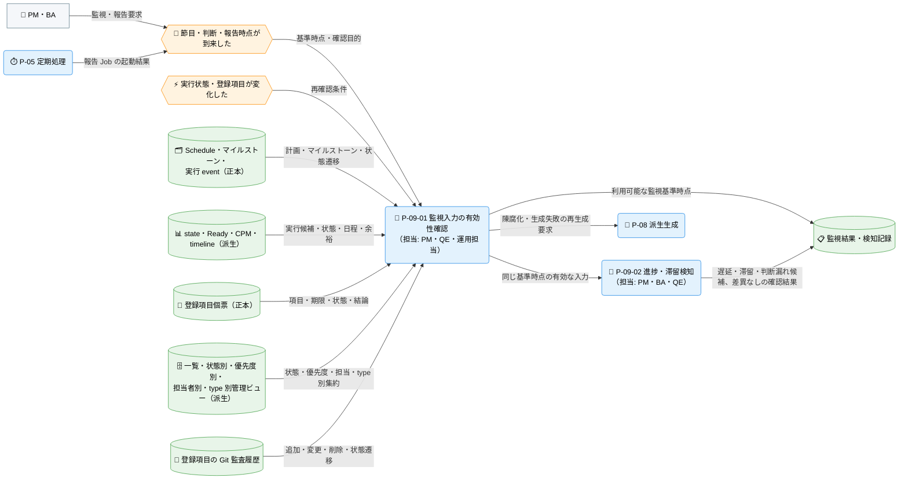
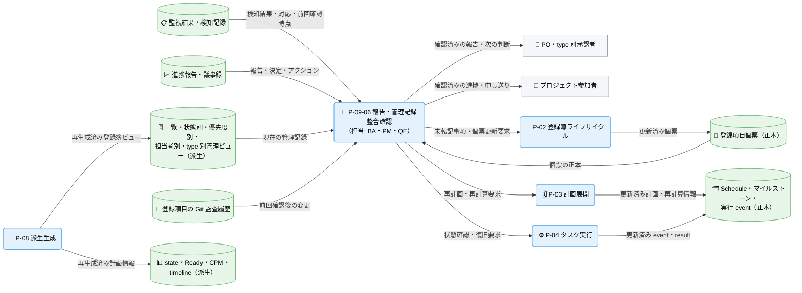
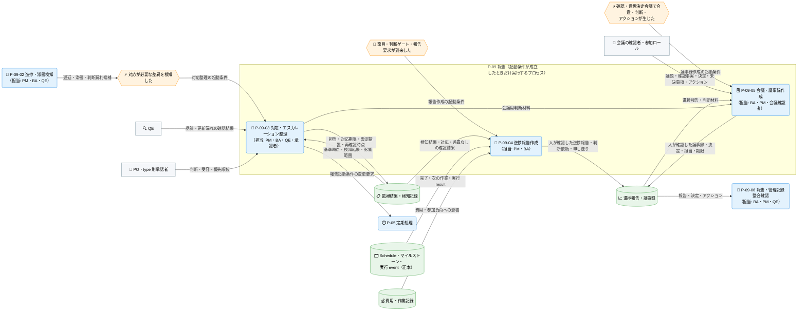

---
specdojo:
  id: prj-0001:cdfd-reporting
  type: flow
  status: draft
  rulebook: specdojo:cdfd-rulebook
  based_on:
    - prj-0001:cdfd-register-operation
    - prj-0001:cdfd-task-execution
    - prj-0001:cdfd-derived-content
  supersedes: []
---

# 概念データフロー図（進捗監視・報告・ログ管理）: SpecDojo

本書は、[[prj-0001:cdfd-overview|概念データフロー図（全体概要）]] が定める `P-09 報告` の境界を引き継ぎ、Schedule・実行状態、Ready、CPM、マイルストーン、登録簿を監視し、遅延・滞留・判断漏れを人間の対応、進捗報告、議事録、管理記録の整合確認へつなぐ概念仕様である。

## 1. 目的

- BA は、監視入力の確認から検知、対応、進捗報告、議事録、申し送りへ至る利用場面を合意し、報告が当事者価値、費用と参加負荷、継続可能性の判断につながることを確認する。
- PM は、遅延・滞留・critical path・マイルストーン未達・期限超過の検知条件と、task owner、項目 owner、type 別承認者、PO への引き渡し、報告・議事録の作成契機を計画運用の判断に使う。
- ARC は、人が作る進捗報告・議事録と、生成される登録簿管理ビュー、再構成される監査履歴について、入力、生成先、直接編集可否、更新責務を後続設計の入力として使う。
- PO と type 別承認者は、判断を求められる事項、代替案、影響、判断期限を報告記録から確認する。
- QE は、古い生成ビュー、未報告の遅延・状態変化、未転記の決定・アクションを検知する確認経路と、報告を止める条件を確認する。
- プロジェクト参加者は、確認済みの進捗と申し送りから、次に自分が関わる作業と判断を追跡する。

## 2. 適用範囲

- 対象は、節目・判断時点・報告要求・状態変化を起点に、監視入力の有効性確認、Ready・`doing`・`blocked`・CPM・マイルストーン・登録項目の照合、対応とエスカレーションの整理、進捗報告・議事録の作成、報告記録と管理記録の整合確認までである。
- 本領域は状態・計画・登録項目の正本を更新しない。対応や判断の結果として正本変更が必要な場合は、`P-02 登録簿ライフサイクル`、`P-03 計画展開`、`P-04 タスク実行`、`P-05 定期処理`、`P-08 派生生成` へ委譲する。
- 一覧、検索、状態参照、差分表示など、監視結果や報告記録を変えない操作は補助操作として扱い、独立したプロセスにしない。
- 本書は、現行実装が提供する派生情報と監査情報を入力に使い、承認済みのプロジェクト運用方針に沿って人間の報告・判断責任を定める。実装で確認できない自動的な遅延検知、報告周期の自動起動、進捗報告・議事録の自動生成は現行動作として扱わない。
- 報告の目的は、当事者価値、費用と参加負荷、継続可能性への影響を次の判断へつなぎ、判断や作業を特定個人の記憶に依存させないことである。プロジェクトレベルの Why や成果物本文を報告へ全文転記せず、変化、影響、判断、次の行動だけを示す。
- 人間と AI Agent の責任分担の原則は [[prj-0001:prj-overview|プロジェクト概要]] に従う。報告内容の確定、判断、公開可否は人間が担う。

### 2.1. 情報の正本・参照情報・更新責務

本領域が扱う情報は、正本、再生成できる参照情報、人が確定する報告記録、判断材料となる記録に分かれる。参照情報は本領域から直接編集せず、修正は正本を持つ領域へ委譲する。

<!-- prettier-ignore -->
| 情報 | 位置づけ | 主な生成・再構成 | 本領域での扱い | 更新責務 |
| --- | --- | --- | --- | --- |
| Schedule、マイルストーン、実行 event | 計画・状態遷移の正本 | `P-03 計画展開`、`P-04 タスク実行` | 参照のみ行い、本領域から更新しない | PM、task owner が委譲先領域で更新する |
| state、Ready、CPM、critical path、timeline | Schedule・event から再生成する計画情報 | `exec refresh` / `P-08 派生生成` | 同じ更新時点の集合として参照し、一部だけを手修正しない | PM・運用担当が再生成する |
| 登録項目個票 | 課題・リスク・変更要求・決定などの正本 | `P-02 登録簿ライフサイクル` | 参照のみ行い、報告記録から逆に書き戻さない | 項目 owner、type 別承認者が更新する |
| 登録項目一覧、状態別・優先度別・担当者別ビュー、課題・リスク・変更要求・決定ログ | 個票から再生成する管理ビュー | `register build` / `P-08 派生生成` | 横断監視と報告材料に使い、直接編集しない | BA・運用担当が再生成する |
| 登録項目の監査履歴 | 個票の Git 履歴から都度再構成する参照結果 | `register history` / `P-02 登録簿ライフサイクル` | 期間内の変化と報告の対応確認に使い、履歴自体は変更しない | PM・監査担当が再構成し、元の個票・Git 履歴は変更しない |
| 費用・作業記録 | 費用と参加負荷への影響を判断するための記録 | 人間の記録・確認 | 進捗報告の判断材料として参照し、本領域から正本を更新しない | PM・BA が記録の所有者へ更新を委譲する |
| 監視結果 | 本領域が作る基準時点・検知・対応の作業記録 | `P-09-01`〜`P-09-03` | 報告記録の材料として保持し、正本の代替にしない | PM・BA・QE が監視のたびに更新する |
| 進捗報告、議事録 | 人間が確定する報告記録 | `P-09-04`、`P-09-05` | 状況、判断、決定、次の行動、根拠参照を記録する | PM・BA、会議の確認者が更新・確認する |

各正本の意味と算出規則は本書で再定義しない。計画情報の算出は [[prj-0001:cdfd-catalog-planning|概念データフロー図（カタログ〜計画展開）]]、task 状態と復旧は [[prj-0001:cdfd-task-execution|概念データフロー図（タスク実行ライフサイクル）]]、派生情報の生成・陳腐化・再生成は [[prj-0001:cdfd-derived-content|概念データフロー図（成果物・派生ビュー・索引生成）]]、個票の意味と監査履歴は [[prj-0001:cdfd-register-operation|概念データフロー図（登録簿ライフサイクル）]] を正とする。本書は、それらを同じ基準時点で監視し、人が作る報告記録へ結び付ける規則だけを正本とする。

## 3. 領域内プロセス一覧

`P-09 報告` は六つのプロセスに分かれる。プロセスの分割、プロセス ID、必須・条件付きの境界は本書を正本とする。主要入力・主要出力・データストアは「個別プロセス主要入出力」に記載する。

<!-- prettier-ignore -->
| プロセス ID | プロセス | 業務目的 | 主な担当 | 起動条件 | 必須性 |
| --- | --- | --- | --- | --- | --- |
| `P-09-01` | 監視入力の有効性確認 | 異なる更新時点または古い生成物に基づく誤報を防ぎ、同じ基準時点の判断材料をそろえる。 | PM、QE、運用担当 | 節目・判断時点・報告要求・状態変化が到来し、監視または報告を開始する | 必須 |
| `P-09-02` | 進捗・滞留検知 | Ready、実行中、blocked、CPM、マイルストーン、登録項目を照合し、次の行動が必要な差異を識別する。 | PM、BA、QE | `P-09-01` で利用可能な監視入力がそろった | 必須 |
| `P-09-03` | 対応・エスカレーション整理 | 検知結果を owner の是正、再計画、登録簿での判断、PO の最終判断へ振り分け、放置を防ぐ。 | PM、BA、QE、type 別承認者 | `P-09-02` で対応が必要な候補を検知した | 条件付き。検知結果がなければ起動せず、「差異なし」を監視結果として残す |
| `P-09-04` | 進捗報告作成 | 完了、次の作業、遅延・滞留、必要判断、費用・参加負荷への影響を、確認者が行動できる情報へまとめる。 | PM、BA | 節目、判断ゲート、初期公開へ影響する状態変化、明示された報告要求のいずれかが到来した | 条件付き。報告契機がない監視では作成せず、監視結果の保持で完了する |
| `P-09-05` | 会議・議事録作成 | 人間の確認または意思決定を会議で行った場合に、決定、未決事項、アクションと責任を後から追跡できるようにする。 | BA、PM、会議確認者 | 当事者確認または意思決定のため会議を開催し、合意・判断・アクションが生じた | 条件付き。会議を行わない非同期確認では作成しない |
| `P-09-06` | 報告・管理記録整合確認 | 報告・議事録の決定とアクションが登録簿へ引き継がれ、登録簿の重要な変化が報告から漏れていないことを確認する。 | BA、PM、QE | 進捗報告・議事録が作成された、または登録簿の期間監査を行う | 必須。報告・議事録を作成した場合は公開・申し送り前に行い、作成しない監視でも期間の未報告変化を確認する |

### 3.1. 検知条件と対応優先度

`P-09-02` が差異を識別し、`P-09-03` が対応先を振り分ける際の判定基準を示す。

<!-- prettier-ignore -->
| 監視対象 | 検知条件 | 判定と主な対応 | エスカレーション |
| --- | --- | --- | --- |
| 生成情報の陳腐化 | 正本更新後に対象生成が未実行、`exec refresh` / `register build` が失敗、または生成結果の基準時点を正本と対応付けられない | 該当派生情報を最新とは扱わず、報告の確定を止める。失敗した scope と下流を再生成し、差分を確認する | 運用担当・QE。正本不整合は PM を通じて該当 owner へ委譲する |
| `Ready` | 合意した監視時点で critical-first の実行候補が未着手、または未完了 task があるのに `Ready` と `doing` がなく次の実行候補を説明できない | owner、依存、実行条件、並列枠を確認する。依存・構成・状態の不整合は正本側で是正する | PM。初期公開または後続マイルストーンへ影響する場合は PO |
| `doing` | CPM / timeline 上の予定完了時点または合意した確認時点を過ぎても complete event がなく、継続理由と次の確認時点を示せない | task owner に進捗、阻害要因、見込み、引継ぎ要否を確認し、必要なら block・release・再計画を委譲する | task owner → PM。主要日程・費用・参加負荷へ影響する場合は PO |
| `blocked` | state に `blocked` が存在する | block 理由、再開条件、actor、worktree / result の保持状況、後続依存への影響を確認する | task owner・PM。業務判断不足は type 別承認者または PO、品質上の重大懸念は QE・PO |
| CPM・critical path | 余裕日数が 0 の task が `blocked` または上記の遅延条件に該当し、後続へ吸収できる余裕がない | クリティカルパスと影響する後続を優先表示し、順序・範囲・体制の再計画案を作る | PM。初期公開時期、範囲、費用・時間上限の変更は PO |
| マイルストーン | マイルストーン確認契機が到来しても、その `depends_on` task がすべて `done` ではない | 未完了 task、critical path、blocked、判断待ちを根拠付きで示し、達成見込みまたは再計画の要否を判断する | PM。主要マイルストーンの変更は PO |
| 登録項目 | 活動中の項目が期限を過ぎた、`waiting` / `review` の再開条件・確認者がない、または高優先度の課題・リスクに次の行動を示せない | 項目 owner、type 別承認者、期限、結論、再開条件を個票正本で補完するよう委譲する | 項目 owner → PM → type 別承認者。重大変更・受容判断は PO |
| 未報告の変化 | 前回報告後の監査履歴に項目の追加・削除、状態遷移、担当・期限・結論の変更があるが、今回の報告または「影響なし」の確認に対応しない | 変更の影響を確認し、報告へ反映するか、対象外の理由を記録する | BA・PM。重要な決定または変更の欠落は PO |
| 未転記の決定・アクション | 議事録・判断記録に決定または追跡対象アクションがあるが、対応する `decision`、`todo`、`issue`、`change-request` 等の個票と管理ビューを特定できない | 登録対象と Schedule 管理対象を判定し、重複登録せず正しい正本への起票・更新を委譲する | BA・PM → 意思決定者・項目 owner |

予定完了時点、確認時点、期限、マイルストーン確認契機のいずれも定義されていない対象について、経過時間だけで遅延または滞留と断定しない。PM は報告前に確認時点を合意するか、期限・再開条件の不足自体を管理上の不足として `P-02` または `P-03` へ返す。

## 4. 概念データフロー

監視のたびに必ず実行するプロセスと、検知結果・報告契機・会議の有無で起動が変わるプロセスでは、起動条件と参照する情報が異なる。また、必須プロセスの中でも、監視入力の確認・検知と、報告・管理記録の整合確認・委譲では性質が異なるため、フローを三つの図に分ける。図間で登場する `監視結果`、`報告記録`、`Schedule・マイルストーン・実行 event（正本）`、`登録項目個票`、`登録簿管理ビュー`、`Git 監査履歴`、`P-05 定期処理`、`P-08 派生生成` は、同一のデータストア・委譲先を指す。

### 4.1. 監視入力確認・進捗検知のフロー（P-09-01・P-09-02）

凡例: ノード形状・線種・色・絵文字は [[prj-0001:cdfd-overview|概念データフロー図（全体概要）]] の「凡例（本プロダクト共通）」に従う。`P-05`・`P-08` は委譲先の代表ノードであり、内部処理は本図の対象外とする。検知結果を受けて起動する条件付きプロセス（`P-09-03`〜`P-09-05`）は、条件付きプロセスのフロー（4.3）を参照する。本図は現物の流れを扱わない。

### 4.2. 整合確認・委譲のフロー（P-09-06）

凡例: ノード形状・線種・色・絵文字は [[prj-0001:cdfd-overview|概念データフロー図（全体概要）]] の「凡例（本プロダクト共通）」に従う。`P-02`〜`P-04`・`P-08` は委譲先の代表ノードであり、内部処理は本図の対象外とする。`監視結果`・`登録項目個票`・`登録簿管理ビュー`・`Git 監査履歴` は監視入力確認・進捗検知のフロー（4.1）と同一のデータストアを指す。本図は現物の流れを扱わない。

### 4.3. 条件付きプロセスのフロー（P-09-03〜P-09-05）

凡例: ノード形状・線種・色・絵文字は [[prj-0001:cdfd-overview|概念データフロー図（全体概要）]] の「凡例（本プロダクト共通）」に従う。`P-09-02` と `監視結果` は監視入力確認・進捗検知のフロー（4.1）、`P-09-06` と `報告記録` は整合確認・委譲のフロー（4.2）と同一の対象を指す。監視入力の確認は 4.1、報告・管理記録の整合確認と委譲先への引き渡しは 4.2 を参照する。検知結果がない、報告契機がない、会議を開かない場合は該当プロセスを起動せず、`P-09-02` の確認結果を監視結果として残したまま `P-09-06` へ進むことが正常経路である。本図は現物の流れを扱わない。

## 5. 個別プロセス主要入出力

プロセス ID・業務目的・主な担当・起動条件・必須性は「領域内プロセス一覧」を参照する。データストアは論理的な保管先で示し、監視結果と報告記録の配置は本領域では固定しない。

### 5.1. 監視入力確認・進捗検知プロセス（P-09-01・P-09-02）

監視のたびに実行し、判断材料の有効性確認と差異の識別を行うプロセス群である。

<!-- prettier-ignore -->
| プロセス ID | プロセス | 主要入力 | 主要出力 | データストア |
| --- | --- | --- | --- | --- |
| `P-09-01` | 監視入力の有効性確認 | Schedule・実行 event、マイルストーン、state・Ready・CPM・timeline、登録項目個票、登録簿管理ビュー、監査履歴、各生成結果 | 利用可能な監視基準時点、陳腐化・生成失敗・不足入力の識別結果、再生成要求 | 計画・実行正本、登録項目個票、派生ビュー、監視結果 |
| `P-09-02` | 進捗・滞留検知 | 同じ基準時点の state・Ready・CPM・critical path・timeline、マイルストーン、登録簿管理ビュー、監査履歴、前回報告 | 遅延・滞留・依存影響・未報告変更・判断漏れの候補、影響対象、根拠参照、差異なしの確認結果 | 派生計画情報、登録簿派生ビュー、監査履歴、報告記録、監視結果 |

### 5.2. 整合確認・委譲プロセス（P-09-06）

報告記録と管理記録の突き合わせを行うプロセス群である。

<!-- prettier-ignore -->
| プロセス ID | プロセス | 主要入力 | 主要出力 | データストア |
| --- | --- | --- | --- | --- |
| `P-09-06` | 報告・管理記録整合確認 | 進捗報告、議事録、監視結果、登録項目個票・管理ビュー、期間内の監査履歴、前回確認時点 | 未報告の遅延・状態変化、未転記の決定・アクション、重複・矛盾、正本更新の委譲情報、公開・申し送りの可否 | 報告記録、登録簿派生ビュー、監査履歴、監視結果 |

### 5.3. 条件付きプロセス（P-09-03〜P-09-05）

検知結果、報告契機、会議開催のいずれかが成立したときだけ実行し、対応先の振り分けと人が確定する報告記録の作成を行うプロセス群である。

<!-- prettier-ignore -->
| プロセス ID | プロセス | 主要入力 | 主要出力 | データストア |
| --- | --- | --- | --- | --- |
| `P-09-03` | 対応・エスカレーション整理 | 検知結果、影響範囲、task・項目 owner、期限、再開条件、価値・費用・参加負荷への影響 | 担当、対応期限、暫定措置、エスカレーション先、再確認時点、委譲情報 | 監視結果 |
| `P-09-04` | 進捗報告作成 | 監視基準時点、検知結果、対応・エスカレーション、Schedule、登録簿、実行 result、費用・作業記録 | 人が確認した進捗報告、判断依頼、申し送り | 報告記録、根拠となる各正本・派生情報 |
| `P-09-05` | 会議・議事録作成 | 議題、進捗報告、判断材料、参加ロール、会議での決定・未決事項・アクション | 人が確認した議事録、決定、アクション、担当・期限 | 報告記録、根拠となる報告・登録項目 |

### 5.4. 報告記録の最小内容と確認者

`P-09-04` と `P-09-05` の主要出力について、確認者が判断に使える最小内容を示す。作成契機は「領域内プロセス一覧」の起動条件を参照する。

| 記録     | 最小内容                                                                                                       | 確認者                      |
| -------- | -------------------------------------------------------------------------------------------------------------- | --------------------------- |
| 進捗報告 | 基準時点、完了・次の作業、Ready / doing / blocked、CPM・マイルストーン影響、登録事項、必要判断、担当・次回確認 | PM、必要に応じて BA・QE・PO |
| 議事録   | 開催時点、議題、参加ロール、確認事実、決定と理由、未決事項、アクション、担当・期限、正本への転記先             | 会議の意思決定者、BA、PM    |

現行のコミュニケーション計画は定例会議・定期報告を既定とせず、確認すべき事実または判断が生じた時点で報告する。週報 Job と毎週起動用 Routine の定義は存在するが、Routine は無効であるため、現行の自動的な作成契機として扱わない。

## 6. 主要例外と領域外への委譲

### 6.1. 主要例外

<!-- prettier-ignore -->
| 例外 ID | 対象プロセス | 検出条件 | 本領域での扱い | 継続・再開条件 |
| --- | --- | --- | --- | --- |
| `E-01` | `P-09-01` | 必要な計画・実行・登録簿の正本が不足・不正で、監視用の計画情報を確定できない | 不完全な情報から遅延や達成を確定せず、利用不能な入力、最後に確認できた基準時点、影響する報告を示す。検証・算出の停止条件は [[prj-0001:cdfd-catalog-planning\|カタログ〜計画展開]] へ委譲する | 正本の検証と計画情報の再計算に合格し、同じ基準時点の入力を得る |
| `E-02` | `P-09-01`、`P-09-06` | 正本更新後に派生生成が未実行・失敗、または報告と管理ビューが異なる更新時点を示す | 派生物を陳腐化の可能性ありとして扱い、生成ビューを直接修正せず、公開・申し送り前の報告確定を止める。生成範囲と再実行順は [[prj-0001:cdfd-derived-content\|成果物・派生ビュー・索引生成]] へ委譲する | 派生生成が成功し、正本・派生物・報告の基準時点と差分を確認できる |
| `E-03` | `P-09-02`、`P-09-03` | 予定完了時点、確認時点、期限、owner、再開条件が定義されず、遅延・滞留または対応責任を判定できない | 経過時間だけで遅延と断定せず、必要な確認時点・期限・責任の不足として PM へ返す。報告では「未判定」と影響を分けて示す | PM と権限者が確認時点・期限・owner・再開条件を正本へ設定し、再監視する |
| `E-04` | `P-09-04`、`P-09-05` | 根拠参照、判断者、決定理由、担当・期限のいずれかが不足し、報告または議事録を確認できない | 確定記録として公開・申し送りせず、不足項目と確認者を示して人間の確認へ戻す | 必要な根拠と人間の確認がそろい、報告記録を再確認する |
| `E-05` | `P-09-06` | 議事録の決定・アクションが登録簿または Schedule にない、監査履歴の重要な変化が報告にない、または相互に矛盾する | 報告記録や生成ビューから正本へ逆書き戻しせず、未転記・未報告・矛盾を分けて該当 owner と委譲先を特定する | 個票または Schedule の正本が更新され、派生物を再生成した後、報告・議事録との対応を再確認する |

検知結果、報告契機、会議のいずれもないために `P-09-03`〜`P-09-05` を起動しないことは例外ではない。`P-09-01`、`P-09-02`、`P-09-06` が完了し、監視結果を残していれば監視は正常に完了する。

### 6.2. 領域外への委譲

<!-- prettier-ignore -->
| 委譲先 | 委譲する事項 | 引き渡す情報 | 本領域へ戻す条件 |
| --- | --- | --- | --- |
| `P-02 登録簿ライフサイクル`（[[prj-0001:cdfd-register-operation\|登録簿ライフサイクル]]） | 遅延・リスク・課題・変更・決定・アクションを個票正本で追跡する | 検知事実、影響、type 候補、owner・期限、判断者、再開条件、報告・議事録の参照 | 個票の起票・更新・承認が完了し、管理ビューと監査履歴で確認できる |
| `P-03 計画展開`（[[prj-0001:cdfd-catalog-planning\|カタログ〜計画展開]]） | 依存、順序、期間、マイルストーンを見直し、計画情報を再計算する | 遅延・滞留 task、critical path、影響する後続、再計画判断、登録簿の確定事項 | Schedule と計画派生情報が更新され、影響と達成見込みを再評価できる |
| `P-04 タスク実行`（[[prj-0001:cdfd-task-execution\|タスク実行ライフサイクル]]） | blocked / doing task の復旧、引継ぎ、状態訂正、再実行を行う | task、actor、block 理由、result、再開条件、必要な人間判断 | complete / block / release / reopen 等の event と result が確定した |
| `P-05 定期処理`（[[prj-0001:cdfd-routine\|定期処理]]） | 承認された周期報告を起動し、重複・失敗時の扱いを管理する | 報告周期、対象期間、Job、missed run・overlap 方針、承認結果 | 報告 Job の起動結果または次の報告契機が本領域へ渡る |
| `P-08 派生生成`（[[prj-0001:cdfd-derived-content\|成果物・派生ビュー・索引生成]]） | 計画情報、登録簿管理ビュー、索引を再生成する | 更新された正本、失敗 scope、陳腐化の疑い、差分確認対象 | 再生成が成功し、同じ基準時点の監視入力として採用できる |
| 人間の判断者 | 価値、範囲、費用・時間上限、主要日程、公開可否、重大懸念を判断する | 進捗報告、代替案、影響、暫定措置、判断期限、関連する登録項目・議事録・監査証跡 | 決定と理由が記録され、対応・再計画・継続または停止へ委譲できる |

## 7. 未決事項

| ID     | 未決事項                                                                                                                                                                           | 影響                                                                                           | 決定者      | 決定時期         |
| ------ | ---------------------------------------------------------------------------------------------------------------------------------------------------------------------------------- | ---------------------------------------------------------------------------------------------- | ----------- | ---------------- |
| `U-01` | _UNDECIDED_: 定期報告を設けない現行方針を維持するか、無効化されている週報 Routine を有効にするかを決定し、有効にする場合は対象期間、確認者、missed run、重複実行、公開先を承認する | `P-09-04` の定期起動条件と `P-05` からの引き渡しを一意にできない                               | PM、PO      | 報告運用の開始前 |
| `U-02` | _UNDECIDED_: task と登録項目について、予定完了時点・期限を持たない場合の滞留確認間隔、およびマイルストーンごとの確認時点を定める                                                   | 経過時間だけでは遅延・滞留を自動判定できず、`E-03` の未判定が残る                              | PM、PO      | 最初の進捗監視前 |
| `U-03` | _UNDECIDED_: state・Ready・CPM・timeline と登録簿管理ビューへ共通の生成基準時点を表示し、自動で陳腐化を警告するか、現行どおり再生成結果と差分を人が確認するかを決定する            | `P-09-01` の鮮度確認を機械判定できず、更新漏れの確認負荷と古い生成ビューを採用するリスクが残る | ARC、QE、PM | 報告機能の設計前 |
| `U-04` | _UNDECIDED_: 監視結果と報告記録の保管先、保持期間、公開範囲を定める                                                                                                                | 前回確認時点と検知履歴を次回監視へ引き継ぐ経路が実装・運用のどちらで担保されるかを確定できない | PM、BA、ARC | 報告運用の開始前 |
