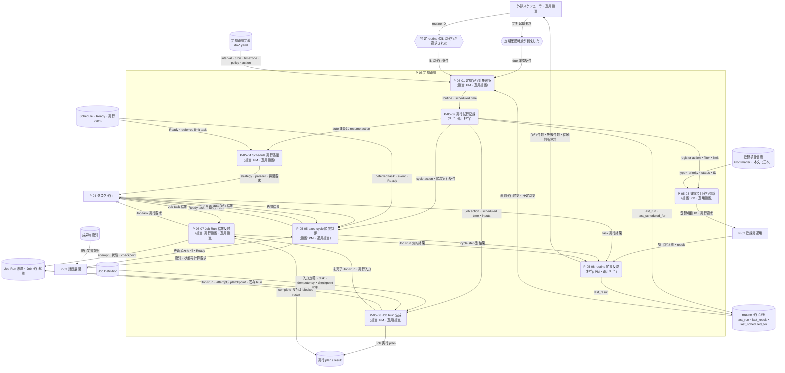

---
specdojo:
  id: prj-0001:cdfd-routine
  type: flow
  status: draft
  rulebook: specdojo:cdfd-rulebook
  based_on:
    - prj-0001:cdfd-register-operation
    - prj-0001:cdfd-task-execution
  supersedes: []
---

# 概念データフロー図（定期運用）: SpecDojo

本書は、[[prj-0001:cdfd-overview|概念データフロー図（全体概要）]] が定める `P-05 定期運用` の境界を引き継ぎ、定期運用定義から due の実行機会を選び、登録項目、Schedule task、exec-cycle、または Job Run を起動して結果を継続判断へ反映する現行フローを定義する。BA が利用場面と委譲境界を整理し、PM・運用担当、ARC、QE が起動条件、正本、結果記録、主要例外を同じ表と図から確認するために使用する。

## 1. 目的と適用範囲

- 対象者は、定期運用の利用場面と受入条件を整理する BA、定義と継続判断を管理する PM・運用担当、委譲入力と更新境界を設計入力にする ARC、due・重複・失敗後の次回判定を検証する QE である。
- 対象は、`rtn-*.yaml` の選択と due 判定、実行試行の記録、登録項目または Schedule task への委譲、exec-cycle の順次制御、Job Definition からの Job Run 生成、実行結果と checkpoint の反映である。
- 本書は現行実装で確認できた AS-IS を、上位文書が定める「時期・条件に基づいて継続作業を起動する」という `P-05` の意図に沿って概念化する。定期運用の新設・変更・停止に関する承認判断や将来方針は推測しない。
- 登録項目の対応・審査・終了は [[prj-0001:cdfd-register-operation|概念データフロー図（登録簿ライフサイクル）]]、個々の Schedule task の選択後の実行・結果統合・再開は [[prj-0001:cdfd-task-execution|概念データフロー図（タスク実行ライフサイクル）]] に委譲し、本領域では委譲入力、返却結果、実行順序だけを扱う。
- Job Run は Schedule task ではなく、Job Definition と入力・checkpoint から生成される再利用可能な実行単位である。本領域では生成、重複判定、実行結果、checkpoint 更新までを扱い、Agent の内部作業は扱わない。
- `where`、`list`、`validate`、`dry-run` は正本を更新しない補助操作であり、独立プロセスにしない。本図は情報の流れだけを対象とし、外部スケジューラの製品・設定手順と個別 CLI 操作は対象外とする。

## 2. 領域内プロセス一覧

<!-- prettier-ignore -->
| プロセス ID | プロセス | 業務目的 | 主な担当 | 起動条件 | 主要入力 | 主要出力・生成先 | 正本・データストア | 必須性 |
| --- | --- | --- | --- | --- | --- | --- | --- | --- |
| `P-05-01` | 定期実行対象選択 | 有効な定期運用定義から、今回起動する実行機会を一意にする。 | PM、運用担当 | 定期確認時点が到来した、または特定 routine の即時実行が要求された | 定期運用定義、現在時刻、routine 実行状態、指定 routine ID | routine と scheduled time の組、または対象なし | 定期運用定義、routine 実行状態 | 必須 |
| `P-05-02` | 実行試行記録 | 同じ実行機会の高頻度な再起動を防ぎ、結果と予定時刻を後から対応付けられるようにする。 | 運用担当 | 実行対象が選択され、routine 全体の実行権を取得した | routine ID、現在時刻、scheduled time、直前の実行状態 | `last_run`、cron の場合は `last_scheduled_for` → routine 実行状態 | routine 実行状態 | 必須。dry-run では記録しない |
| `P-05-03` | 登録項目実行委譲 | 登録簿の正本から条件に合う計画外事項を選び、項目ごとの対応へ引き渡す。 | PM、運用担当 | action kind が `register` である | 個票 Frontmatter、type・priority・status filter、limit、project ID | ID 順の登録項目実行要求、項目別結果、集約結果 | 登録項目個票、登録項目の plan / result | 条件付き。対象なしは正常終了 |
| `P-05-04` | Schedule 実行委譲 | 定義された実行方式で、Ready task の自動実行または再開時刻が到来した task の再開を要求する。 | PM、運用担当 | action kind が `exec-auto` または `exec-resume` である | Schedule・Ready・実行 event、strategy、parallel、loop、max rounds | task 実行要求、complete / block / deferred の実行結果 | Schedule・Ready、実行 event、task plan / result | 条件付き。対象なしは正常終了 |
| `P-05-05` | exec-cycle 順次制御 | 再開、参照・状態再計算、Ready task 実行を一つの排他的な周期として順序保証する。 | PM、運用担当 | action kind が `exec-cycle` である | deferred limit task、成果物索引、Schedule・event、strategy、parallel、loop、max rounds | step 別結果、更新された Ready、task 実行結果 | Schedule・Ready、実行 event、成果物索引、task plan / result | 条件付き |
| `P-05-06` | Job Run 生成 | 反復可能な Job Definition と実行時点の入力から、冪等に識別できる実行単位を作る。 | PM、運用担当 | action kind が `job` である | Job Definition、routine inputs、scheduled time、timezone、直前 checkpoint | Job Run、実行 plan、解決済み入力、重複完了判定 | Job Definition、Job Run 履歴、Job 実行状態、実行 plan | 条件付き |
| `P-05-07` | Job Run 結果反映 | Job Run の作業結果を監査可能にし、成功した反復位置を次回入力へ引き継ぐ。 | 実行担当、運用担当 | 未完了の Job Run と plan が生成または再試行された | Job Run、実行 plan、実行担当、作業結果、result | attempt と `succeeded` / `failed`、完了 result、条件を満たす checkpoint | Job Run 履歴、Job 実行状態、実行 plan / result | 条件付き。完了済み重複は再実行しない |
| `P-05-08` | routine 結果反映 | 委譲結果を次回 due 判定と運用確認に使える一つの結果へまとめる。 | PM、運用担当 | 選択した routine の委譲処理が戻った | `success` / `failure` / `skipped`、項目別結果または cycle step 別結果 | `last_result`、実行件数、失敗件数、継続判断材料 | routine 実行状態、実行記録 | 必須 |

### 2.1. 定期運用定義と due 判定

| 定義・経路         | 起動条件と選択                                                                                                                                                                                 | 引き渡す主な設定                                     | 実行後の次回判定                                                                                          |
| ------------------ | ---------------------------------------------------------------------------------------------------------------------------------------------------------------------------------------------- | ---------------------------------------------------- | --------------------------------------------------------------------------------------------------------- |
| interval           | `last_run` がないか不正、または現在時刻との差が interval 以上なら一回 due とする。interval は正の整数と分・時・日・週の単位で定義する。                                                        | action kind と action 設定                           | 委譲前に更新した `last_run` から次の interval を判定する。失敗・skip でも同じ実行機会を直ちに再試行しない |
| cron               | timezone 上の5フィールド cron に一致し、`last_scheduled_for` より後から現在分までの予定時刻を選ぶ。`missed_run: latest` または未指定は最新一件、`all` は取りこぼした各予定時刻を古い順に扱う。 | scheduled time、timezone、action kind と action 設定 | 委譲前に各 scheduled time を `last_scheduled_for` へ記録する。初回は直近の一致一件だけを選ぶ              |
| 特定 ID の即時実行 | 指定 ID が存在すれば、enabled と due にかかわらず現在時刻を scheduled time として一回選ぶ。                                                                                                    | 指定 routine の action 設定                          | 通常実行と同じく `last_run` と結果を記録する                                                              |
| disabled           | due 一括選択から除外する。                                                                                                                                                                     | なし                                                 | 状態を更新せず、明示 ID 実行または定義変更を待つ                                                          |

cron の探索範囲は現在動作では最大366日であり、`all` で1000件を超える取りこぼしは異常終了する。interval と cron は同じ定義へ同時指定できない。

### 2.2. action kind と委譲入出力

| action kind   | 選択・制御条件                                                                                                                         | 委譲先へ渡す情報                                                                       | 返却結果と本領域での扱い                                                                                                                                                              |
| ------------- | -------------------------------------------------------------------------------------------------------------------------------------- | -------------------------------------------------------------------------------------- | ------------------------------------------------------------------------------------------------------------------------------------------------------------------------------------- |
| `register`    | 個票 Frontmatter を正本に、実行可能 type、既定 `open` または指定 status、任意の priority を照合し、ID 昇順で limit 件まで選ぶ          | project ID、登録項目 ID                                                                | 項目ごとの `review` / `waiting` と result。全項目を処理し、一件でも失敗なら routine は `failure`。対象なしは `success`                                                                |
| `exec-auto`   | Ready を `critical-first` または `fifo` で選び、parallel 枠で実行する。loop 指定時は索引・状態を再計算しながら max rounds まで反復する | project ID、strategy、parallel、loop、max rounds、busy 時 `skip`                       | task ごとの complete / block / deferred。実行不能または失敗が終了コードへ反映された場合は routine を `failure` とする                                                                 |
| `exec-resume` | 再開時刻が到来した deferred limit task だけを排他的に unblock し、元の actor・worktree・result で再開する                              | project ID、parallel、busy 時 `skip`                                                   | 再開結果。対象なし、または利用制限により再度 deferred となっただけなら委譲処理は正常終了し、task 側の block 情報で次回を待つ                                                          |
| `exec-cycle`  | 同一 project lock 内で resume、索引再生成、Schedule 検証・状態再計算、Ready task 自動実行の順に進める                                  | project ID、strategy、parallel、loop、max rounds、busy 時 `skip`                       | step 別結果を集約する。resume 失敗後は後続を継続し、索引または状態再計算の失敗では auto を起動せず、auto 失敗を含む実行済み step の失敗で routine を `failure` とする                 |
| `job`         | Job Definition、scheduled time、routine inputs と checkpoint から idempotency key と Job Run ID を導出する                             | project ID、Job ID、解決済み inputs、scheduled time、trigger=`routine`、busy 時 `skip` | 完了済みの同一 Job Run は再実行せず `success`。未完了・失敗済み Run は attempt を追加する。成功時は result と許可された checkpoint、失敗時は blocked result と失敗 attempt を記録する |

### 2.3. 結果記録と次回判定

| 結果・状況               | routine 実行状態                                                                                         | 委譲先の記録                                                    | 次回判定                                                                   |
| ------------------------ | -------------------------------------------------------------------------------------------------------- | --------------------------------------------------------------- | -------------------------------------------------------------------------- |
| `success`                | `last_run` と `last_result: success`、cron は処理済みの `last_scheduled_for`                             | 登録項目状態、task event、または Job Run / result               | 次の interval 経過または次の cron occurrence を待つ                        |
| `failure`                | `last_run` と `last_result: failure`、cron は処理済みの `last_scheduled_for`                             | 項目別失敗、task block、cycle step 失敗、または Job Run failure | 同じ実行機会は直ちに再試行せず、次の定期機会または明示実行を待つ           |
| `skipped`                | `last_run` と `last_result: skipped`、cron は処理済みの `last_scheduled_for`                             | project busy により委譲先は変更しない                           | 同じ実行機会は消化済みとし、次の定期機会を待つ                             |
| 対象なし                 | `last_result: success`                                                                                   | 登録項目・task・Job Run を新規更新しない                        | 次の定期機会に再選択する                                                   |
| 完了済み重複 Job Run     | `last_result: success`                                                                                   | 既存 Job Run・attempt・checkpoint を変更しない                  | idempotency key が変わる次の実行機会を待つ                                 |
| 委譲前記録後の想定外例外 | 新しい `last_run` と必要時の `last_scheduled_for` は残るが、`last_result` は直前値または未記録になり得る | 例外発生点より後は未更新になり得る                              | 同じ実行機会は直ちに再試行されないため、運用担当が状態と外部記録を確認する |

## 3. 概念データフロー

凡例: 角丸長方形は一つのプロセス、六角形は起点イベント、円柱は正本または継続的な保管先、四角は外部主体・領域外の委譲先、`-->` は情報の流れを表す。`P-02`、`P-03`、`P-04` は委譲先の代表ノードであり、内部処理は本図の対象外とする。本図は現物の流れを扱わない。

## 4. 主要例外と領域外への委譲

### 4.1. 主要例外

| 例外 ID | 対象プロセス         | 検出条件                                                                                                          | 本領域での扱い                                                                                                                                                       | 継続・再開条件                                                                                        |
| ------- | -------------------- | ----------------------------------------------------------------------------------------------------------------- | -------------------------------------------------------------------------------------------------------------------------------------------------------------------- | ----------------------------------------------------------------------------------------------------- |
| `E-01`  | `P-05-01`、`P-05-06` | routine の ID・interval / cron・timezone・policy・action、または Job Definition が不正、routine ID が重複している | 不正定義を実行対象にしない。検証エラーを報告し、正本や生成状態を推測で補正しない                                                                                     | 定義を規約に合わせ、routine / Job の検証が成功する                                                    |
| `E-02`  | `P-05-01`、`P-05-02` | 別の routine run が routine 全体の lock を保持している                                                            | 新しい routine run を実行前に停止し、`last_run`・`last_result`・`last_scheduled_for` を更新しない。現在動作では定義上の `overlap: skip` にかかわらず異常終了する     | 先行 run が完了して lock を解放する。1時間を超えて陳腐化した lock は次回取得時に回収される            |
| `E-03`  | `P-05-03`〜`P-05-07` | 同じ project の run / resume / cycle が実行中である                                                               | 委譲先の busy policy を `skip` とし、対象の実行を変更せず routine の `last_result` を `skipped` にする                                                               | project lock が解放された後の次回定期機会、または明示実行で再選択する                                 |
| `E-04`  | `P-05-03`、`P-05-04` | filter に合う登録項目、Ready task、または due deferred-limit task が存在しない                                    | 対象なしとして正常終了し、対象側の正本を変更せず `last_result: success` を記録する                                                                                   | 次回定期機会に個票 Frontmatter、Ready、再開時刻を再評価する                                           |
| `E-05`  | `P-05-03`            | 選択した登録項目の一部が失敗または busy skip になった                                                             | 通常の失敗は残りの選択項目を継続して項目別結果を残し、一件でも失敗なら集約を `failure` とする。busy skip は未着手の残りを起動せず routine を `skipped` とする        | 各項目の `waiting` 理由または project busy を解消し、次回機会か明示実行で再選択する                   |
| `E-06`  | `P-05-05`            | exec-cycle の resume、索引再生成、Schedule 検証・状態再計算、または auto が失敗した                               | resume 失敗は記録して後続を継続する。索引・検証・状態再計算の失敗は auto を起動せず停止する。auto 失敗を含め、実行済み step の失敗があれば cycle を `failure` とする | block 理由、索引、Schedule、構成を解消し、次回 cycle で resume から順に再実行する                     |
| `E-07`  | `P-05-04`、`P-05-05` | task が利用制限で block され、再開可能時刻が未到来または再開後も制限中である                                      | task の block event に制限種別、試行回数、再開時刻、worktree を保持する。時刻未到来は選ばず、再度 deferred となった場合も Ready task の処理を妨げない                | 自動再開可能な `resume_at` が到来する。または人間が代替担当・停止を判断する                           |
| `E-08`  | `P-05-06`、`P-05-07` | 同じ idempotency key の Job Run が既に存在する                                                                    | `succeeded` / `noop` なら新しい attempt と実行を作らず既存結果を採用する。`running` / `failed` なら同じ Run に attempt を追加して再試行する                          | 完了済みなら新しい idempotency key の実行機会を待つ。未完了なら失敗原因を解消して再試行する           |
| `E-09`  | `P-05-07`            | Job task が失敗、または終了コード0でも result 必須節が未記入である                                                | result と Job Run attempt を `failed` とし、checkpoint を進めない。routine は `failure` とする                                                                       | result 不足または作業失敗を解消し、同じ Run の新しい attempt で再実行する                             |
| `E-10`  | `P-05-02`、`P-05-08` | 試行記録後、委譲結果を返す前に想定外例外が発生した                                                                | 新しい `last_run` と必要時の `last_scheduled_for` を保持する。`last_result` は新しい試行と対応しない可能性があるため、自動で成功・失敗を推測しない                   | 運用担当が routine 状態と委譲先の event / result / Job Run を照合し、次回実行または状態訂正を判断する |

### 4.2. 領域外への委譲

| 委譲先            | 委譲する事項                                                                | 引き渡す情報                                                      | 本領域へ戻す条件                                                                               |
| ----------------- | --------------------------------------------------------------------------- | ----------------------------------------------------------------- | ---------------------------------------------------------------------------------------------- |
| `P-02 登録簿運用` | filter で選んだ登録項目を対応・調査し、人間の審査へ進める                   | project ID、登録項目 ID、個票の現行状態                           | 項目別の `review` / `waiting`、result、失敗理由を routine 集約結果へ反映するとき               |
| `P-03 計画展開`   | exec-cycle 中に成果物索引を再生成し、Schedule を検証して Ready を再計算する | project ID、成果物・event・Schedule                               | 索引・検証・再計算の成否と更新済み Ready を cycle の auto step へ渡すとき                      |
| `P-04 タスク実行` | Ready task、deferred limit task、または Job Run の実行単位を処理する        | task / Job Run、strategy、parallel、actor、plan、result、worktree | complete / block / deferred、実行 result、利用制限情報を routine または Job Run へ反映するとき |
| 外部スケジューラ  | 定期確認時点に routine の due 実行を要求する                                | project ID、起動時刻                                              | 処理件数、skip・failure、終了結果から監視・次回起動を継続するとき                              |

### 4.3. 受入確認

| 確認者       | 確認対象           | 受入条件                                                                                                                                                                |
| ------------ | ------------------ | ----------------------------------------------------------------------------------------------------------------------------------------------------------------------- |
| BA           | 正常経路と利用場面 | routine 選択、due 判定、試行記録、register / Schedule / cycle / Job の起動、結果反映までを、担当と入出力を含めて表と図から説明できる                                    |
| ARC          | 定義・委譲境界     | action kind、filter、interval / cron / timezone / policy、limit、strategy、parallel、loop、Job 入力・冪等性・checkpoint、および `P-02`〜`P-04` との受け渡しを識別できる |
| QE           | 例外と次回判定     | routine / project busy、対象なし、利用制限、cycle step 失敗、再開時刻待ち、重複 Job Run、取りこぼし、Job failure ごとの状態記録と次回判定を確認できる                   |
| PM・運用担当 | 継続判断           | `last_run`、`last_result`、`last_scheduled_for`、task event、Job Run / checkpoint から、継続・再試行・人間判断の必要性を判定できる                                      |

## 5. 未決事項

| 論点                                                                        | 現在確認できる状態                                                                                                                                                | 影響                                                                                             | 決定者・決定時期                                                                    |
| --------------------------------------------------------------------------- | ----------------------------------------------------------------------------------------------------------------------------------------------------------------- | ------------------------------------------------------------------------------------------------ | ----------------------------------------------------------------------------------- |
| _UNDECIDED_: routine 全体の重複起動時に `policy.overlap: skip` を適用するか | 定義は `skip` だけを受理するが、現在の routine lock は重複起動を異常終了させ、routine 状態を更新しない                                                            | 外部スケジューラが重複発火した場合の監視結果と再試行判断が、定義名から期待される挙動と一致しない | PM・ARC・QE が運用方針を確認し、後続の仕様判断時に決定する                          |
| _UNDECIDED_: 試行記録と `last_result` を一体として扱う復旧規則              | 委譲前に `last_run` を記録し、通常の返却後に `last_result` を記録するため、想定外例外では両者が対応しない可能性がある                                             | 同じ実行機会は消化済みになる一方、成功・失敗・再試行要否を状態だけで確定できない                 | PM・ARC・QE が状態訂正または attempt 識別の要否を確認し、後続の仕様判断時に決定する |
| _UNDECIDED_: Job Run を `noop` と判定する業務条件                           | Job Run の完了処理と checkpoint 規則は `noop` を扱えるが、確認した routine 起動経路は Agent 成功を `succeeded`、失敗を `failed` とし、`noop` の判定条件を持たない | 変更なしの反復処理で checkpoint を進める条件を利用者が判断できない                               | Job owner・BA・QE が Job 利用例を定義するときに決定する                             |
