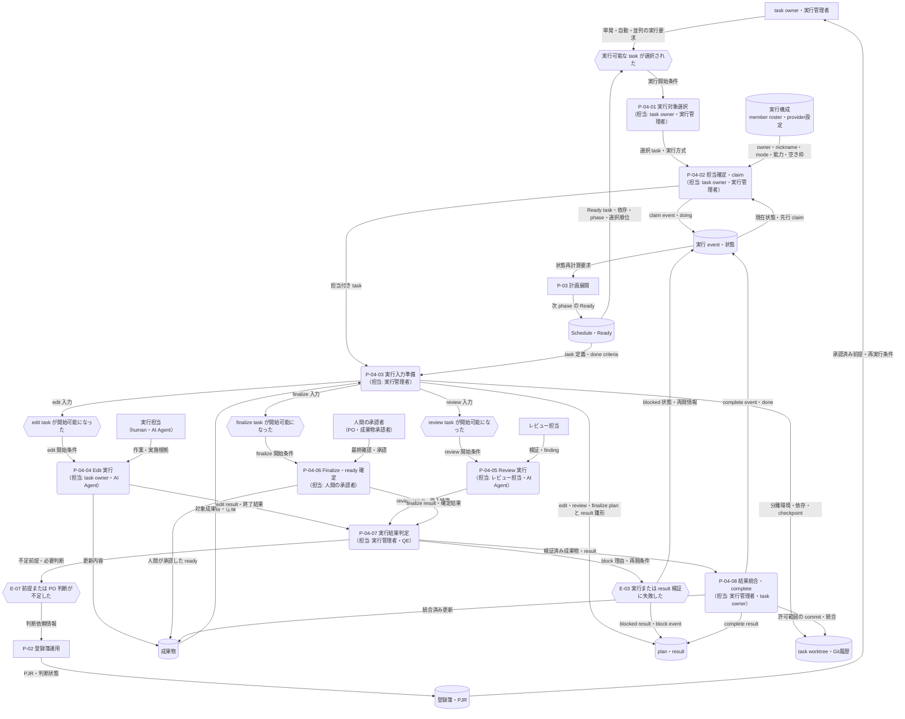

---
specdojo:
  id: prj-0001:cdfd-task-execution
  type: flow
  status: draft
  rulebook: specdojo:cdfd-rulebook
  based_on:
    - prj-0001:cdfd-catalog-planning
    - prj-0001:cdfd-overview
  supersedes: []
---

# 概念データフロー図（タスク実行ライフサイクル）: SpecDojo

本書は、[[prj-0001:cdfd-overview|概念データフロー図（全体概要）]] が定める `P-04 タスク実行` の境界と、[[prj-0001:cdfd-catalog-planning|概念データフロー図（カタログ〜計画展開）]] が提供する Schedule・Ready・実行計画を引き継ぐ。実行可能な task を人または AI Agent が担当し、成果物、result、event を検証可能な形で残して、review、finalize、完了または再実行へつなぐ現行ライフサイクルを定義する。

## 1. 目的と適用範囲

- 対象者は、実行要件と利用場面を整理する BA、task を実行する owner と AI Agent、成果を確認するレビュー担当・PO、実行経路を設計入力にする ARC、状態遷移と復旧経路を検証する QE である。
- 対象は、Ready task の単発・自動・並列選択から、担当確定、claim、plan / result 準備、edit / review / finalize の実行、worktree 統合、complete、block・訂正・再実行までである。
- Schedule と実行 event を task 状態の正本、成果物と result を作業結果の正本として扱う。Ready はこれらから再生成される実行候補であり、直接更新しない。
- task の phase はそれぞれ独立した task として同じライフサイクルを通る。正常経路では edit の complete 後に review task、review の complete 後に finalize task が Ready となり、finalize の人間確認で成果物を `ready` に確定する。
- 本書は現行実装で確認できた AS-IS を、上位文書が定める `P-04` の意図に沿って概念化する。個別 CLI 操作、Agent の内部推論、Git の内部手順、review 観点の詳細は対象外とする。
- 定期起動は `P-05 定期運用`、複数 task のブランチ配置方針は `P-06 並行運用`、Agent / provider 構成変更は `P-07 構成変更`、Ready・索引などの派生生成は `P-03 計画展開` と `P-08 派生生成` に委譲する。
- 社会課題、期待価値、主要判断、公開可否、成果物の `ready` 確定は人間が責任を持つ。AI Agent は登録済みの権限と変更範囲で作業・検証できるが、前提不足を推測で補わない。

## 2. 領域内プロセス一覧

<!-- prettier-ignore -->
| プロセス ID | プロセス | 業務目的 | 主な担当 | 起動条件 | 主要入力 | 主要出力・生成先 | 正本・データストア | 必須性 |
| --- | --- | --- | --- | --- | --- | --- | --- | --- |
| `P-04-01` | 実行対象選択 | 実行可能性と実行方針に沿い、今回着手する task を一意にする。 | task owner、実行管理者 | Ready が生成され、単発実行または自動実行が要求された | Ready、Schedule、選択戦略、並列数、project 実行状態 | 選択 task、実行方式（human / agent、in-place / worktree、単発 / 自動 / 並列） | Schedule・Ready、実行構成 | 必須 |
| `P-04-02` | 担当確定・claim | task の要件を満たす担当を確定し、重複着手を防いで実行中にする。 | task owner、実行管理者 | 選択 task が確定し、project 実行権を取得した | task の owner・mode・capability・proficiency、member roster、指定 nickname、現行 event | 担当 nickname、claim event、`doing` 状態 | 実行構成（member roster・provider設定）、実行 event | 必須。ただし state 追跡を選ばない in-place 実行では claim event を生成しない |
| `P-04-03` | 実行入力準備 | 担当が同じ根拠と完了条件から安全に作業できる実行単位を用意する。 | 実行管理者 | claim が成立した、または state 非追跡の in-place 実行が開始された | Schedule、成果物カタログ、対象成果物、rulebook、project context、claim event | edit / review / finalize plan、未記入 result、実行環境 | plan / result、成果物、task worktree | 必須。worktree の作成・依存導入は worktree 経路だけで実施 |
| `P-04-04` | Edit 実行 | 承認済みの仕様と変更範囲に従い、対象成果物を更新して実施根拠を result に残す。 | task owner、AI Agent | edit task の plan / result と実行環境が準備された | edit plan、対象成果物、参照資料、変更許可範囲 | 更新成果物、記入済み edit result、異常時の block 理由 | 成果物、edit result、task worktree または current worktree | mode が edit の場合に必須 |
| `P-04-05` | Review 実行 | done criteria と review 観点に照らして成果物を検証し、受入可否と finding を残す。 | レビュー担当、AI Agent | 先行 edit task が complete し、review task が Ready になった | review plan、対象成果物、done criteria、先行 result | review result、受入結果、差し戻し情報 | 成果物、review result、実行 event | mode が review の場合に必須 |
| `P-04-06` | Finalize・ready 確定 | done criteria、参考資料、review 結果を人間が確認し、成果物を利用可能として確定するか差し戻す。 | PO、成果物の承認者 | 先行 review task が complete し、finalize task が Ready になった | finalize plan、成果物、done criteria、review result、未決判断 | finalize result、人間が承認した `ready`、または差し戻し・判断要求 | 成果物、finalize result、実行 event | finalize phase が定義された場合に必須。`ready` 昇格は人間だけが実施 |
| `P-04-07` | 実行結果判定 | 終了コードと result の必須記入を検証し、統合可能な成功か、復旧を要する block かを確定する。 | 実行管理者、QE | phase 作業が終了した | phase の終了結果、記入済み result、変更差分、レート制限情報 | success 判定、または blocked result・block event・再開条件 | result、実行 event、task worktree | 必須 |
| `P-04-08` | 結果統合・complete | 成功した成果物と result を後続 task が参照できる正本へ統合し、phase 完了を記録する。 | 実行管理者、task owner | 実行結果が success と判定された | 更新成果物、complete 状態の result、変更許可範囲、作業 branch | 統合済み成果物・result、complete event、次 phase の再計算要求 | 成果物、result、実行 event、Git 履歴 | 必須。worktree は commit・統合・後片付けを行い、in-place は current worktree の差分を維持する |

### 2.1. 実行経路と更新責務

| 観点     | 経路     | 選択・担当                                                                                                              | 成果物                                                     | result                                                          | event・状態                                                                                 |
| -------- | -------- | ----------------------------------------------------------------------------------------------------------------------- | ---------------------------------------------------------- | --------------------------------------------------------------- | ------------------------------------------------------------------------------------------- |
| 実行主体 | human    | human 指定 task を owner が担当する。`execution: human` は登録済み Agent への明示的な override がない限り自動実行しない | 人間が current worktree または task worktree で更新する    | 人間が実施内容・判断を記入する                                  | claim / complete / block 等を人間の actor で記録する                                        |
| 実行主体 | agent    | 明示 nickname、または mode・capability・proficiency・priority・provider 空き枠に合う登録済み nickname を選ぶ            | plan の target と許可範囲内を更新する                      | 必須節を Agent が記入する。未記入なら終了コード 0 でも block    | worktree / state 追跡経路では選択 nickname で claim / complete / block を記録する           |
| 作業場所 | in-place | 単発 target を current worktree で実行する                                                                              | current worktree を直接更新し、自動 commit・統合は行わない | managed task では実行結果に応じて complete / blocked を更新する | state 追跡を選んだ task だけ claim / complete / block を記録し、既定は event を更新しない   |
| 作業場所 | worktree | task ごとの branch・worktree を準備し、tracked lockfile ごとに依存を導入する                                            | 許可された target だけを commit・現在 branch へ統合する    | 対象 task の result を commit・統合する                         | claim 後に準備し、成功時 complete、失敗時 block。成功後に worktree と branch を後片付けする |
| 選択方式 | 単発     | 指定 task を一件実行する。すでに `doing` なら claim actor と既存 worktree を再利用できる                                | 選択 task の target                                        | 選択 task の result                                             | state 追跡方式に従う                                                                        |
| 選択方式 | 自動     | Ready を critical-first または FIFO で並べ、実行可能な task を選ぶ                                                      | 選択された各 task の target                                | task ごとの result                                              | task ごとに claim / complete / block を記録する                                             |
| 選択方式 | 並列     | Ready から並列枠と provider 上限の範囲で選び、異なる task worktree で実行する                                           | task ごとに分離し、統合処理は直列化する                    | task ごとに分離する                                             | 複数 claim を許可し、各 task の event を独立記録する                                        |

review と finalize は edit の内部操作ではなく、Schedule 上の別 task である。各 task は `P-04-01`〜`P-04-08` を通り、complete event を受けた `P-03 計画展開` の状態再計算によって次 phase が Ready になる。Agent が成果物の status を `ready` へ変更した場合、worktree の commit 境界で拒否して block とし、人間の確定を待つ。

## 3. 概念データフロー

凡例: 角丸長方形は一つのプロセス、六角形は起点・主要例外イベント、円柱は正本または継続的な保管先、四角は外部主体・委譲先、`-->` は情報の流れを表す。本図は情報の流れだけを扱い、現物の流れは対象外とする。三つの phase event からは task の mode に合う一経路だけを起動する。in-place 経路では task worktree への入出力を省略し、current worktree の成果物と result を直接更新する。

## 4. 主要例外と領域外への委譲

### 4.1. 主要例外

| 例外 ID | 対象プロセス                    | 検出条件                                                                                                         | 本領域での扱い                                                                                                                                            | 継続・再開条件                                                                                                                                     |
| ------- | ------------------------------- | ---------------------------------------------------------------------------------------------------------------- | --------------------------------------------------------------------------------------------------------------------------------------------------------- | -------------------------------------------------------------------------------------------------------------------------------------------------- |
| `E-01`  | `P-04-01`                       | 同じ project で別の run / resume / cycle が実行中である                                                          | project 単位の排他を維持する。方針が skip なら変更せず終了、wait なら解放待ち、fail なら異常終了とする。古い lock は heartbeat の陳腐化を確認して回収する | 先行実行が lock を解放する、または陳腐化した lock の安全な回収が完了する                                                                           |
| `E-02`  | `P-04-02`、`P-04-03`            | owner 不一致、依存未完了、対応 nickname・能力・provider 空き枠の不足、plan / claim / checkpoint の生成失敗がある | claim 前なら task 状態を変えない。claim 後の準備失敗は release event で `doing` から `todo` へ戻し、不完全な実行を後続へ渡さない                          | owner・依存・構成・生成失敗を解消し、Ready 選択または claim から再実行する                                                                         |
| `E-03`  | `P-04-04`〜`P-04-07`            | phase が非ゼロ終了した、または Agent が成功終了しても result の必須節が未記入である                              | result を blocked、task を block event により `blocked` とし、理由と必要な対応を残す。worktree 経路は調査・再開用に作業場所を保持する                     | 原因と不足記入を解消し、同じ試行を unblock して継続するか release して `todo` から再実行する                                                       |
| `E-04`  | `P-04-04`、`P-04-05`、`P-04-07` | 全候補 Agent がレート制限となった                                                                                | partial change を統合せず、制限種別、試行回数、再開時刻、worktree を block event と result に記録する。自動再開不能な制限は人間判断を待つ                 | 再開可能時刻が到来した task を `resume --due` が排他的に unblock し、元の actor・worktree・result で再開する。または人間が代替担当・停止を判断する |
| `E-05`  | `P-04-03`                       | task worktree の作成、tracked lockfile に対応する依存導入、checkpoint が失敗した                                 | 実行を開始せず、今回記録した claim は release する。共有 `node_modules` を流用せず、task worktree の依存は独立して扱う                                    | worktree 配置・package 定義・依存取得・hook の失敗を解消し、`todo` から再実行する                                                                  |
| `E-06`  | `P-04-08`                       | 変更が許可範囲外、Agent が `ready` へ昇格、commit hook 失敗、root 差分との重複、commit または merge が失敗した   | 許可範囲外を統合しない。merge 失敗時は merge 中状態を中止して root を復元し、result と task を blocked にして worktree を保持する                         | 対象範囲、`ready` の人間承認、検査失敗、重複差分または競合を解消し、保持した worktree から統合を再試行する                                         |
| `E-07`  | `P-04-05`〜`P-04-07`            | review / finalize が不合格、業務前提が不足、PO 判断なしでは採否を決められない                                    | 成果物を `ready` にせず、finding、影響、必要な判断、再開条件を result / block 理由へ残す。PJR の自動登録は行わず、`P-02 登録簿運用` へ判断依頼情報を渡す  | PO が PJR 等で判断し前提を確定した後、対象 task を release / unblock、必要なら先行完了 task を reopen して再実行する                               |
| `E-08`  | `P-04-02`、`P-04-08`            | 中断、誤った完了、task 自体の取消しにより状態訂正が必要になった                                                  | `blocked → doing` は unblock、`doing / blocked → todo` は release、`todo → cancelled` は cancel、`done → todo` は人間だけが reopen で履歴を残して訂正する | reopen は後続 task が `doing`、`blocked`、`done` でないことを確認する。競合する後続 task がある場合は後続から reopen / release して整合を回復する  |

### 4.2. 状態遷移と再実行

| 起点状態            | event    | 到達状態    | 主な用途・制約                                                                   |
| ------------------- | -------- | ----------- | -------------------------------------------------------------------------------- |
| `todo`              | claim    | `doing`     | 依存、owner、重複着手を検証して担当を記録する                                    |
| `doing`             | complete | `done`      | 同じ actor または人間の強制引継ぎが成功結果を確定する                            |
| `doing`             | block    | `blocked`   | 実行失敗、result 未記入、レート制限、統合失敗の理由を保持する                    |
| `blocked`           | unblock  | `doing`     | 同じ試行を継続する。レート制限の `resume --due` もこの遷移を使う                 |
| `doing` / `blocked` | release  | `todo`      | 現在の試行を放棄して再選択可能にする。原則として claim actor が実施する          |
| `todo`              | cancel   | `cancelled` | 未着手 task を恒久的に取り消す。実行中・blocked の中断には release を使う        |
| `done`              | reopen   | `todo`      | 誤完了を履歴削除なしで訂正する。人間専用で、進行済み後続 task がある間は拒否する |

異なる actor が保持する `doing` / `blocked` task の complete、block、release は拒否する。ただし、停止した Agent から引き継ぐ必要がある場合に限り、人間は強制引継ぎを明示して状態を訂正できる。

### 4.3. 領域外への委譲

| 委譲先            | 委譲する事項                                                                  | 引き渡す情報                                                     | 本領域へ戻す条件                                                        |
| ----------------- | ----------------------------------------------------------------------------- | ---------------------------------------------------------------- | ----------------------------------------------------------------------- |
| `P-02 登録簿運用` | 前提不足、仕様判断、review / finalize の差し戻しを PJR 等で追跡する           | finding、影響範囲、選択肢、必要な PO 判断、停止中 task、再開条件 | 判断と前提が確定し、release / unblock / reopen の対象と順序を決められる |
| `P-03 計画展開`   | complete / block / release / reopen / cancel 後の state と Ready を再計算する | Schedule、追加 event、成果物 phase の完了状態                    | 更新された Ready から次の edit / review / finalize task を選択できる    |
| `P-05 定期運用`   | due 判定と cycle の起動を管理する                                             | deferred limit の再開時刻、project busy の結果、cycle step 結果  | due task の再開要求または次の Ready 自動実行要求が発生する              |
| `P-06 並行運用`   | 複数 project / branch の配置、同期、統合方針を管理する                        | 独立 task、task worktree、branch、統合結果、競合情報             | 個々の task を本領域の lifecycle で実行または復旧する必要がある         |
| `P-07 構成変更`   | Agent / provider / capability / 権限の不足や変更を承認・適用する              | 選択失敗、レート制限、必要能力、代替候補、権限超過               | 登録済み nickname と実行条件が更新され、再選択可能になる                |
| `P-08 派生生成`   | 成果物、索引、実行ビューを正本から再生成する                                  | 統合済み成果物・result・event                                    | 再生成結果が次 task の plan または確認入力として利用可能になる          |

### 4.4. 受入確認

| 確認者 | 確認対象           | 受入条件                                                                                                                                                           |
| ------ | ------------------ | ------------------------------------------------------------------------------------------------------------------------------------------------------------------ |
| BA     | 正常経路と利用場面 | Ready 選択、claim、plan / result 生成、edit、review、finalize、complete と次 phase への引継ぎを、担当と入出力を含めて表と図から説明できる                          |
| ARC    | 実行方式と更新境界 | human / agent、in-place / worktree、単発 / 自動 / 並列、登録済み nickname の選択、および各経路が更新する成果物・result・event・Git 履歴を識別できる                |
| QE     | 例外と復旧         | project busy の skip / wait / fail、unblock / release / cancel / reopen、レート制限後の `resume --due`、依存導入・commit・統合失敗の停止範囲と再開条件を判定できる |
| PO     | ready と判断準備   | ready の人間専用ゲート、review / finalize の差し戻し、前提不足時に PJR へ渡す finding・影響・必要判断・再開条件を識別できる                                        |
