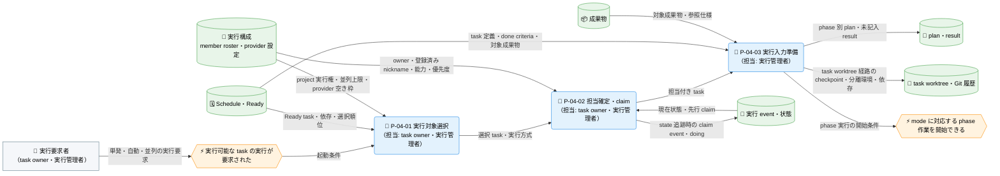
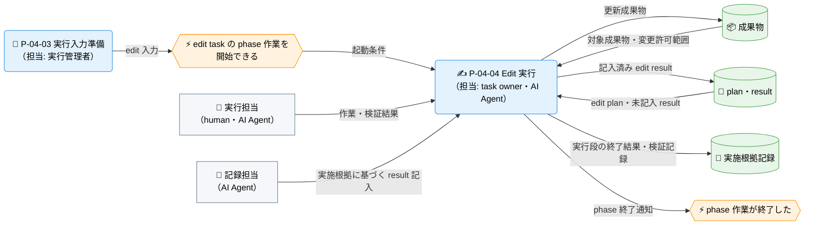
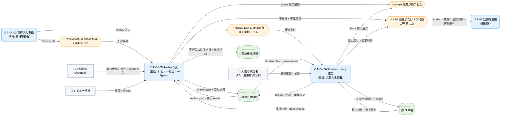
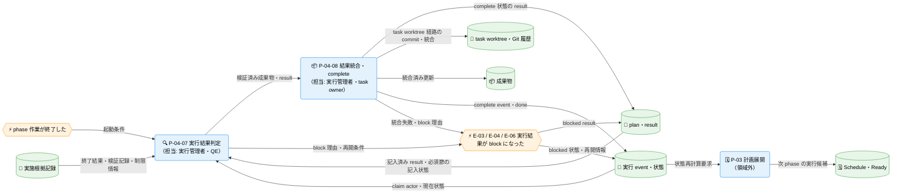

---
specdojo:
  id: prj-0001:cdfd-task-execution
  type: flow
  status: draft
  rulebook: specdojo:cdfd-rulebook
  based_on:
    - prj-0001:cdfd-catalog-planning
    - prj-0001:cdfd-overview
  supersedes: []
---

# 概念データフロー図（タスク実行ライフサイクル）: SpecDojo

本書は、[[prj-0001:cdfd-overview|概念データフロー図（全体概要）]] が定める `P-04 タスク実行` の境界と、[[prj-0001:cdfd-catalog-planning|概念データフロー図（カタログ〜計画展開）]] が提供する Schedule・Ready・実行状態を引き継ぐ。実行可能な task を人または AI Agent が担当し、成果物、result、event を検証可能な形で残して、review、finalize、完了または再実行へつなぐ現行ライフサイクルの概念仕様である。

## 1. 目的

- BA と task owner は、Ready 選択から担当確定、実行入力準備、mode 別の phase 実行、結果判定、統合・完了までの正常経路と、各プロセスの担当・入出力を合意する。
- ARC は、human と AI Agent、current worktree と task worktree、単発・自動・並列という実行経路と、登録済み nickname による担当選択が、どの成果物・result・event・Git 履歴を更新するかを後続設計に使う。
- QE は project 実行中の重複起動、実行失敗、result 未記入、レート制限、統合失敗で停止する範囲と再開条件を、PO は `ready` 確定・差し戻し・前提不足時の判断依頼に必要な情報を、それぞれ本書から確認する。

## 2. 適用範囲

- 対象は、実行可能な task の実行が要求されてから、担当を確定して claim し、plan と未記入 result を用意し、mode に対応する phase 作業を実行し、結果を判定して成果物・result を正本へ統合し、完了または中断・訂正・再実行を記録するまでである。
- 成果物の phase はそれぞれ独立した task として同じライフサイクルを通る。正常経路では edit の完了後に review task、review の完了後に finalize task が実行可能になり、finalize の人間確認で成果物を `ready` に確定する。
- 実行 event を task 状態の正本、成果物と result を作業結果の正本として扱う。Ready はこれらから再生成される実行候補であり、直接更新しない。
- 対象外は、実行候補と日程の算出、定期起動の判定、複数 branch の配置・同期・統合方針、Agent と provider の構成変更、成果物の派生ビュー生成である。個別の操作手順、Agent の内部推論、Git の内部手順、review 観点の詳細も扱わない。委譲先は「領域外への委譲」に示す。
- 人間と AI Agent の責任分担の原則は [[prj-0001:prj-overview|プロジェクト概要]] に従う。社会課題、期待価値、主要判断、公開可否、成果物の `ready` 確定は人間が責任を持ち、AI Agent は登録済みの権限と変更許可範囲の内側で作業・検証する。

## 3. 領域内プロセス一覧

`P-04 タスク実行` は八つのプロセスに分かれる。プロセスの分割、プロセス ID、業務目的、主な担当、起動条件、必須性は本章を正本とし、主要入力・主要出力・データストアは「個別プロセス主要入出力」に記載する。

<!-- prettier-ignore -->
| プロセス ID | プロセス | 業務目的 | 主な担当 | 起動条件 | 必須性 |
| --- | --- | --- | --- | --- | --- |
| `P-04-01` | 実行対象選択 | 実行可能性と実行方針に沿い、今回着手する task と実行方式を一意にする。 | task owner、実行管理者 | Ready が生成され、単発・自動・並列のいずれかの実行が要求された | 必須 |
| `P-04-02` | 担当確定・claim | task の要件を満たす担当を確定し、重複着手を防いで実行中にする。 | task owner、実行管理者 | 選択 task が確定し、project の実行権を取得した | 必須。ただし state を追跡しない current worktree 実行では担当確定だけを行い、claim event を生成しない |
| `P-04-03` | 実行入力準備 | 担当が同じ根拠と完了条件から安全に作業できる実行単位を用意する。 | 実行管理者 | claim が成立した、または state 非追跡の実行が開始された | 必須。分離環境の作成と依存導入は task worktree 経路でだけ実施する |
| `P-04-04` | Edit 実行 | 承認済みの仕様と変更許可範囲に従い、対象成果物を更新して実施根拠を result に残す。 | task owner、AI Agent | mode が edit の task で phase 作業を開始できる状態になった | 条件付き。mode が review・finalize の task では起動せず、対応する phase 実行へ進む |
| `P-04-05` | Review 実行 | done criteria と review 観点に照らして成果物を検証し、受入可否と finding を残す。 | レビュー担当、AI Agent | mode が review の task で phase 作業を開始できる状態になった | 条件付き。先行 edit task が完了していない間は起動しない |
| `P-04-06` | Finalize・ready 確定 | done criteria、参考資料、review 結果を人間が確認し、成果物を利用可能として確定するか差し戻す。 | PO、成果物の承認者 | finalize phase を持つ成果物で、先行 review task が完了して phase 作業を開始できる状態になった | 条件付き。finalize phase が定義されていない成果物では起動せず、review 完了をもって phase 系列を終える |
| `P-04-07` | 実行結果判定 | 終了結果と result の記入状態を検証し、統合可能な成功か、復旧を要する block かを確定する。 | 実行管理者、QE | phase 作業が終了した | 必須 |
| `P-04-08` | 結果統合・complete | 成功した成果物と result を後続 task が参照できる正本へ統合し、phase 完了を記録する。 | 実行管理者、task owner | 実行結果が success と判定された | 必須。task worktree 経路は commit・統合・後片付けを行い、current worktree 経路は差分を統合せず維持する |

review と finalize は edit の内部操作ではなく、Schedule 上の別 task である。各 task は `P-04-01`〜`P-04-08` を通り、complete event を受けた `P-03 計画展開` の状態再計算によって次 phase が実行可能になる。task の claim、complete、block、unblock、release、cancel、reopen と actor 制約は本書を正本とし、branch・worktree の構成、同期、統合手順の詳細は [[prj-0001:cdfd-multi-project|概念データフロー図（複数プロジェクト・ブランチ並行運用）]]、nickname と provider の選択属性・権限境界は [[prj-0001:cdfd-agent-config-operation|概念データフロー図（agent・provider 構成の運用変更）]] を参照する。

## 4. 概念データフロー

task の選択・準備、mode 別の phase 実行、結果判定・統合では性質が異なり、phase 実行は起動する mode によって関係する担当・データストアが分かれるため、フローを四図に分ける。

### 4.1. 選択・準備のフロー

凡例: ノード形状・色・絵文字は [[prj-0001:cdfd-overview|概念データフロー図（全体概要）]] の「凡例（本プロダクト共通）」に従い、`-->` は情報の流れを表す。本図は現物の流れを扱わない。`mode に対応する phase 作業を開始できる` は Edit 実行のフロー（4.2）・Review・Finalize確定のフロー（4.3）の起点イベントと同一であり、`成果物`、`plan・result` も両図と同一のデータストアを指す。current worktree 経路では `task worktree・Git 履歴` への入出力を行わず、現在の作業ツリーの成果物と result を直接更新する。

### 4.2. Edit実行のフロー

凡例: ノード形状・色・絵文字は [[prj-0001:cdfd-overview|概念データフロー図（全体概要）]] の「凡例（本プロダクト共通）」に従い、`-->` は情報の流れを表す。本図は現物の流れを扱わない。`P-04-03 実行入力準備` は選択・準備のフロー（4.1）、`phase 作業が終了した` は判定・統合のフロー（4.4）と同一のイベント・プロセスを指し、`成果物`・`plan・result`・`実施根拠記録` は両図と同一のデータストアを指す。`記録担当` は実行担当と記録担当を分ける二段構成のときだけ関与し、単一担当構成では実行担当が result まで記入する。

### 4.3. Review・Finalize確定のフロー

凡例: ノード形状・色・絵文字は [[prj-0001:cdfd-overview|概念データフロー図（全体概要）]] の「凡例（本プロダクト共通）」に従い、`-->` は情報の流れを表す。本図は現物の流れを扱わない。`P-04-03 実行入力準備` は選択・準備のフロー（4.1）、`phase 作業が終了した` は判定・統合のフロー（4.4）と同一のイベント・プロセスを指し、`成果物`・`plan・result`・`実施根拠記録` は Edit実行のフロー（4.2）と同一のデータストアを指す。`P-02 登録簿運用` は委譲先の代表ノードであり、その内部処理は対象外とする。`記録担当` は二段構成のときだけ関与する。

### 4.4. 判定・統合のフロー

凡例: ノード形状・色・絵文字は [[prj-0001:cdfd-overview|概念データフロー図（全体概要）]] の「凡例（本プロダクト共通）」に従い、`-->` は情報の流れを表す。本図は現物の流れを扱わない。`P-03 計画展開` は委譲先の代表ノードであり、その内部処理は対象外とする。`phase 作業が終了した` は Edit実行のフロー（4.2）・Review・Finalize確定のフロー（4.3）と同一のイベントを指し、`成果物`・`plan・result`・`実施根拠記録` も両図と同一のデータストアを指す。current worktree 経路では `task worktree・Git 履歴` への入出力を行わない。

## 5. 個別プロセス主要入出力

代表パス中の `<project-id>` と `<task-id>` は、対象プロジェクトと対象 task に置き換える総称であり、未記入の成果物値ではない。プロセス ID、業務目的、主な担当、起動条件、必須性は「領域内プロセス一覧」を参照する。

### 5.1. 選択・準備プロセス（P-04-01〜P-04-03）

実行要求を受けてから担当と実行単位を確定するまでの、常に通過する処理を扱う。

<!-- prettier-ignore -->
| プロセス ID | プロセス | 主要入力 | 主要出力 | データストア |
| --- | --- | --- | --- | --- |
| `P-04-01` | 実行対象選択 | Ready の実行候補と選択順位、選択戦略、並列枠、project の実行権、provider ごとの同時実行上限 | 選択 task、実行方式（human / AI Agent、current / task worktree、単発 / 自動 / 並列）、上限到達時の後回し対象 | Schedule・Ready、実行構成、project 実行権 |
| `P-04-02` | 担当確定・claim | task の実行区分・mode・必要能力・熟練度・段階役割、member roster、明示指定された nickname、現行 event | 担当 nickname（実行担当・記録担当）、claim event、`doing` 状態 | 実行構成、実行 event |
| `P-04-03` | 実行入力準備 | Schedule の task 定義、成果物カタログの done criteria と対象成果物、rulebook、project context、claim event | mode 別 plan、frontmatter を備えた未記入 result、checkpoint、task worktree と導入済み依存 | plan・result（`docs/ja/projects/<project-id>/execution/exec/plans`・`.../results`）、成果物、task worktree |

### 5.2. Edit 実行プロセス（P-04-04）

<!-- prettier-ignore -->
| プロセス ID | プロセス | 主要入力 | 主要出力 | データストア |
| --- | --- | --- | --- | --- |
| `P-04-04` | Edit 実行 | edit plan、対象成果物、参照資料、変更許可範囲、未記入 result | 更新成果物、記入済み edit result、実行段の終了結果・検証記録、異常時の block 理由 | 成果物、result、実施根拠記録（`.../execution/exec/evidence/<task-id>`） |

### 5.3. Review・Finalize確定プロセス（P-04-05・P-04-06）

<!-- prettier-ignore -->
| プロセス ID | プロセス | 主要入力 | 主要出力 | データストア |
| --- | --- | --- | --- | --- |
| `P-04-05` | Review 実行 | review plan、対象成果物、done criteria、先行 result、review 観点 | review result、受入結果、finding と差し戻し情報、実行段の終了結果・検証記録 | 成果物、result、実施根拠記録 |
| `P-04-06` | Finalize・ready 確定 | finalize plan、成果物、done criteria、review result、未決の業務判断 | finalize result、人間が承認した `ready`、または差し戻し・必要判断 | 成果物、result、実行 event |

### 5.4. 判定・統合プロセス（P-04-07・P-04-08）

phase 作業の結果を判定して正本へ統合するまでの、常に通過する処理を扱う。

<!-- prettier-ignore -->
| プロセス ID | プロセス | 主要入力 | 主要出力 | データストア |
| --- | --- | --- | --- | --- |
| `P-04-07` | 実行結果判定 | phase の終了結果、記入済み result と必須節・frontmatter の保持状態、実施根拠記録、制限情報、claim actor と現在状態 | success 判定、または blocked result・block event・再開に必要な段階と根拠 | result、実施根拠記録、実行 event、task worktree |
| `P-04-08` | 結果統合・complete | 検証済みの更新成果物、complete 状態の result、mode と対象成果物から導いた変更許可範囲、作業 branch、統合先の未コミット差分 | 統合済み成果物・result、許可範囲外の変更の申し送り、complete event、次 phase の再計算要求 | 成果物、result、実行 event、Git 履歴 |

### 5.5. 実行経路別の更新責務

同じプロセス系列でも、実行主体、作業場所、選択方式、担当構成によって更新対象と記録範囲が変わる。本表は 5.1〜5.4 のデータストアを経路別に読み分けるための対応を示す。

| 観点     | 経路             | 選択・担当                                                                                                | 成果物                                       | result                                                          | event・状態                                                               |
| -------- | ---------------- | --------------------------------------------------------------------------------------------------------- | -------------------------------------------- | --------------------------------------------------------------- | ------------------------------------------------------------------------- |
| 実行主体 | human            | human 実行と定義された task を owner が担当する。登録済み Agent への明示的な指定がない限り自動実行しない  | 人間が作業ツリーで更新する                   | 人間が実施内容・判断を記入する                                  | claim / complete / block を人間の actor で記録する                        |
| 実行主体 | AI Agent         | 明示指定された nickname、または mode・能力・熟練度・優先度・provider 空き枠に合う登録済み nickname を選ぶ | plan の対象成果物と変更許可範囲内を更新する  | 必須節を Agent が記入する。未記入・雛形改変は成功終了でも block | claim / complete / block を選択 nickname で記録する                       |
| 作業場所 | current worktree | 単発の対象を現在の作業ツリーで実行する                                                                    | 現在の作業ツリーを直接更新し、統合は行わない | 実行結果に応じて complete / blocked を反映する                  | state 追跡を選んだ task だけ event を記録し、既定では記録しない           |
| 作業場所 | task worktree    | task ごとの分離環境を使い、checkpoint 済みの状態から作業する                                              | 許可された対象だけを分離して更新する         | 対象 task の result を分離結果へ含める                          | claim 後に準備し、統合成否を受けて complete または block を記録する       |
| 選択方式 | 単発             | 指定 task を一件実行する。すでに `doing` なら claim actor と既存の分離環境を引き継ぐ                      | 選択 task の対象成果物                       | 選択 task の result                                             | 選んだ state 追跡方式に従う                                               |
| 選択方式 | 自動             | 実行候補を critical-first または FIFO で並べ、実行可能な task を選ぶ                                      | 選択された各 task の対象成果物               | task ごとの result                                              | task ごとに claim / complete / block を記録する                           |
| 選択方式 | 並列             | 並列枠と provider 上限の範囲で複数 task を選び、異なる分離環境で実行する                                  | task ごとに分離し、統合処理は直列化する      | task ごとに分離する                                             | 複数 claim を許可し、各 task の event を独立に記録する                    |
| 担当構成 | 単一担当         | 一つの担当が作業と result 記入の双方を行う                                                                | 担当が直接更新する                           | 担当が記入する                                                  | 担当 nickname で記録する                                                  |
| 担当構成 | 二段             | 実行担当が作業と検証を行い、記録担当が実施根拠から result を記入する                                      | 実行担当が更新する                           | 記録担当が実施根拠を基に記入する                                | claim・complete・block は実行担当の nickname で記録し、失敗段階を保持する |

## 6. 主要例外と領域外への委譲

### 6.1. 主要例外

| 例外 ID | 対象プロセス         | 検出条件                                                                                                                        | 本領域での扱い                                                                                                                                                                                  | 継続・再開条件                                                                                                                                    |
| ------- | -------------------- | ------------------------------------------------------------------------------------------------------------------------------- | ----------------------------------------------------------------------------------------------------------------------------------------------------------------------------------------------- | ------------------------------------------------------------------------------------------------------------------------------------------------- |
| `E-01`  | `P-04-01`            | 同じ project で別の実行または再開が進行中である                                                                                 | project 単位の排他を維持する。方針が skip なら変更せず終了、wait なら解放待ち、fail なら異常終了とする。稼働確認が途絶えた古い実行権は陳腐化を確認して回収する                                  | 先行実行が実行権を解放する、または陳腐化した実行権の安全な回収が完了する                                                                          |
| `E-02`  | `P-04-02`、`P-04-03` | owner 不一致、依存未完了、要件に合う nickname・能力・段階役割の不足、plan / claim / checkpoint の生成失敗がある                 | claim 前なら task 状態を変えない。claim 後の準備失敗は release により `doing` から `todo` へ戻し、不完全な実行を後続へ渡さない。provider 上限による後回しは例外に含めない                       | owner・依存・実行構成・生成失敗を解消し、実行対象選択または claim から再実行する。後回しの task は同じ実行内の後続ラウンドで再選択する            |
| `E-03`  | `P-04-04`〜`P-04-07` | phase が異常終了した、成功終了しても result の必須節が未記入または雛形の frontmatter が改変された、記録段の出力が規定形式でない | result を blocked、task を block event により `blocked` とし、失敗した段階、理由、必要な対応を残す。分離環境は調査・再開のために保持する                                                        | 原因と記入不足を解消し、保持した実施根拠がある場合は記録段から、ない場合は同じ試行を継続するか release して `todo` から再実行する                 |
| `E-04`  | `P-04-04`〜`P-04-07` | 候補となる担当がすべて利用制限に達した                                                                                          | 途中変更を統合せず、制限の種類、試行回数、再開可能時刻、分離環境、失敗段階を block event と result に記録する。短時間で復帰しない制限は即時再試行せず再開時刻を保持する                         | 再開可能時刻が到来した task を自動再開が排他的に unblock し、元の担当・分離環境・result で継続する。または人間が代替担当・停止を判断する          |
| `E-05`  | `P-04-03`            | 分離環境の作成、既存環境の再利用、依存導入のいずれかに失敗し、実行入力を確定できない                                            | 実行を開始せず、今回記録した claim は release する。放棄済みの残存環境は再準備前に破棄する。保持・削除対象と復旧順は [[prj-0001:cdfd-multi-project\|複数プロジェクト・ブランチ並行運用]] に従う | 並行運用側で分離環境と依存が検証され、`todo` から再実行できる                                                                                     |
| `E-06`  | `P-04-07`、`P-04-08` | 担当・状態の整合検査に不合格、変更許可範囲の逸脱、`ready` の人間専用境界の違反、検査失敗、commit または統合先との競合が発生した | 成果物を統合せず task を blocked にし、result に失敗段階と再開条件を残す。許可範囲外の変更は統合せず作業場所へ残して申し送る。統合の中断状態は元に戻す                                          | 対象範囲と人間承認を確認し、並行運用側で検査・競合を解消して統合結果を返せる                                                                      |
| `E-07`  | `P-04-05`〜`P-04-07` | review / finalize が不合格、業務前提が不足、PO 判断なしでは採否を決められない                                                   | 成果物を `ready` にせず、finding、影響、必要な判断、再開条件を result と block 理由へ残す。判断記録の自動登録は行わず、`P-02 登録簿運用` へ判断依頼情報を渡す                                   | PO が判断し前提を確定した後、対象 task を release または unblock し、必要なら先行完了 task を reopen して再実行する                               |
| `E-08`  | `P-04-02`、`P-04-08` | 中断、誤った完了、task 自体の取消しにより状態訂正が必要になった                                                                 | `blocked → doing` は unblock、`doing` / `blocked → todo` は release、`todo → cancelled` は cancel、`done → todo` は人間だけが reopen で履歴を残して訂正する                                     | reopen は後続 task が `doing`、`blocked`、`done` でないことを確認する。競合する後続 task がある場合は後続から reopen / release して整合を回復する |

自動実行を繰り返す経路では、クリティカルパス上の task が `E-03`・`E-04`・`E-06` で停止した場合、新規 task の投入を止めて実行中の task だけを完了させる。

### 6.2. 状態遷移と再実行

| 起点状態            | event    | 到達状態    | 主な用途・制約                                                                   |
| ------------------- | -------- | ----------- | -------------------------------------------------------------------------------- |
| `todo`              | claim    | `doing`     | 依存、owner、重複着手を検証して担当を記録する                                    |
| `doing`             | complete | `done`      | 同じ actor または人間の強制引継ぎが成功結果を確定する                            |
| `doing`             | block    | `blocked`   | 実行失敗、result 未記入、利用制限、統合失敗の理由と失敗段階を保持する            |
| `blocked`           | unblock  | `doing`     | 同じ試行を継続する。再開時刻到来後の自動再開もこの遷移を使う                     |
| `doing` / `blocked` | release  | `todo`      | 現在の試行を放棄して再選択可能にする。原則として claim actor が実施する          |
| `todo`              | cancel   | `cancelled` | 未着手 task を恒久的に取り消す。実行中・blocked の中断には release を使う        |
| `done`              | reopen   | `todo`      | 誤完了を履歴削除なしで訂正する。人間専用で、進行済み後続 task がある間は拒否する |

異なる actor が保持する `doing` / `blocked` task の complete、block、release は拒否する。ただし、停止した Agent から引き継ぐ必要がある場合に限り、人間は強制引継ぎを明示して状態を訂正できる。

### 6.3. 領域外への委譲

| 委譲先                                                                          | 委譲する事項                                                                | 引き渡す情報                                                     | 本領域へ戻す条件                                                        |
| ------------------------------------------------------------------------------- | --------------------------------------------------------------------------- | ---------------------------------------------------------------- | ----------------------------------------------------------------------- |
| `P-02` [[prj-0001:cdfd-register-operation\|登録簿運用]]                         | 前提不足、仕様判断、review / finalize の差し戻しを継続的に追跡する          | finding、影響範囲、選択肢、必要な PO 判断、停止中 task、再開条件 | 判断と前提が確定し、release / unblock / reopen の対象と順序を決められる |
| `P-03` [[prj-0001:cdfd-catalog-planning\|カタログ〜計画展開]]                   | complete / block / release / reopen / cancel 後の状態と実行候補を再計算する | Schedule、追加 event、成果物 phase の完了状態                    | 更新された実行候補から次の edit / review / finalize task を選択できる   |
| `P-05` [[prj-0001:cdfd-routine\|定期運用]]                                      | 定期起動の期限判定と一連の実行の起動を管理する                              | 再開可能時刻、project の実行権の状態、順次実行の結果             | 再開要求または次の自動実行要求が発生した                                |
| `P-06` [[prj-0001:cdfd-multi-project\|複数プロジェクト・ブランチ並行運用]]      | 複数 project / branch の配置、同期、統合方針を管理する                      | 独立 task、分離環境、branch、統合結果、競合情報                  | 個々の task を本領域のライフサイクルで実行または復旧する必要がある      |
| `P-07` [[prj-0001:cdfd-agent-config-operation\|agent・provider 構成の運用変更]] | Agent・provider・能力・権限の不足や変更を承認・適用する                     | 選択失敗、利用制限、必要能力、代替候補、権限超過                 | 登録済み nickname と実行条件が更新され、再選択可能になった              |
| `P-08` [[prj-0001:cdfd-derived-content\|成果物・派生ビュー・索引生成]]          | 成果物、索引、実行ビューを正本から再生成する                                | 統合済み成果物・result・event                                    | 再生成結果が次 task の plan または確認入力として利用可能になる          |
