---
specdojo:
  id: cdfd-uc-deliverable
  type: flow
  status: draft
  rulebook: specdojo:cdfd-uc-rulebook
  based_on:
    - cdfd-plan
    - cdfd-do
    - cdfd-check
    - cdfd-action
---

# 概念データフロー図（成果物の作成から完了まで）: SpecDojo

ケース `cdfd-uc-deliverable` の「成果物の作成から完了まで」について、成果物カタログの定義からタスク展開、実行、評価、人間による完了記録までを Plan → Do → Check → Action の順に横断する引き渡しを定める。

## 1. 目的

本書は、BA、各成果物の owner、QE、PO、PM が、成果物の定義から完了までの順序と責任境界を合意し、限られた参加者でも同じ正本から判断と作業を引き継げるようにする。

- BA は、成果物カタログの `done_criteria`・`evidence_refs` が実行、評価、完了判断へ欠落なく引き渡されることを確認する。
- 各成果物の owner は、実行計画と Kata に基づく作成・レビュー・検証の入力条件、および Check へ渡す成果と根拠を確認する。
- QE は、Do でのレビュー・検証による成果の確定と、Check での grade・finding による独立した評価を区別し、完了判断に足る評価結果を確定する。
- PO と PM は、Action で評価結果と完了条件を照合し、人間の責任で完了または再計画を判断する。

これにより、グループ境界での情報不足や判断責任の混同による手戻りを防ぎ、人と AI Agent が同じ正本を使って作業を分担・継承できるようにする。

## 2. 適用範囲

- **ケース**: `cdfd-uc-deliverable`「成果物の作成から完了まで」。許可された参照資料には全体概要の `C-<nn>` 形式のケース ID が提示されていないため、新しい番号は採番せず、本書の成果物 ID を追跡キーとする。
- **開始イベント**: 参加者が管理対象とする成果物を確定し、Plan が成果物カタログの定義を開始できること。
- **終了条件**: Action で PO・PM が評価結果と完了条件を照合して完了可能と判断し、PM が完了・決定の記録と完了記録を正本へ残したこと。
- **参加グループ**: Plan（P-02〜P-06）、Do（P-07）、Check（P-08〜P-10）、Action（P-11〜P-13）の順に通過する。
- **組織境界**: BA、各成果物の owner、QE、PO、PM、ARC、および実行・照合・記録を支援する AI Agent と runner を含む。承認、評価の最終判断、完了判断は各グループで定めた人間が担う。
- **システム境界**: SpecDojo が管理する成果物カタログ、Schedule（track）、実行計画、成果物、実行記録、評価結果、進捗報告、登録簿、および評価基準として参照する Kata までを扱う。
- **対象外**: 各グループ内部の領域・プロセス・主要例外、補助操作、コマンドやファイル単位の実装詳細、状態の定義と遷移とする。グループ内部は [[cdfd-plan|概念データフロー図（Plan）]]、[[cdfd-do|概念データフロー図（Do）]]、[[cdfd-check|概念データフロー図（Check）]]、[[cdfd-action|概念データフロー図（Action）]]、状態名と成立条件は STSD、遷移元・遷移先・遷移条件は CSTD を正本とする。

本書はグループ間の引き渡しだけを定義する。Do におけるレビュー・検証は成果を Check へ渡せるかの確定、Check における grade・finding は `done_criteria` と評価基準に照らした独立評価、Action における完了確定は人間による最終判断として責務を分ける。

## 3. プロセス領域

ケース `cdfd-uc-deliverable` は四つのプロセスグループを Plan → Do → Check → Action の順に通過する。本章を正常系の順序とグループ別責務の正本とし、各グループの領域 ID、内部プロセス、主要例外は対応するグループ別 CDFD を正本とする。

### 3.1. Plan（P-02〜P-06）

管理対象となった成果物をカタログへ定義し、依存関係、担当、完了条件を実行可能なタスクと実行計画へ展開して Do へ渡す。成果物定義と計画の不足・不整合は、実行開始前に Plan で補完する。

- **主要入力**: 管理対象とする成果物の判断、登録項目・決定記録、メンバー・ロール、Kata
- **主要出力**: `done_criteria`・`evidence_refs` を含む検証済み成果物カタログ、Schedule（track）、実行計画
- **データストア**: Kata、成果物カタログ、Schedule（track）、実行計画

| 順序 | プロセスグループ | 含む領域   | 横断上の役割                                                     | 参照先                                    |
| ---- | ---------------- | ---------- | ---------------------------------------------------------------- | ----------------------------------------- |
| 1    | Plan             | P-02〜P-06 | 成果物定義を、担当と完了条件を持つ実行可能な入力として確定する。 | [[cdfd-plan\|概念データフロー図（Plan）]] |

### 3.2. Do（P-07）

Plan から実行対象と基準を受け取り、owner が Kata と実行計画に従って成果物を作成・更新する。実行計画で要求されたレビュー・検証を終え、成果、result、evidence、実行状態を Check へ渡す。

- **主要入力**: 成果物カタログ、Schedule（track）の対象タスク、実行計画、Kata、対象成果物
- **主要出力**: 作成・更新した成果物、レビュー・検証結果、result、evidence、実行状態
- **データストア**: Kata、実行計画、成果物、実行記録

| 順序 | プロセスグループ | 含む領域 | 横断上の役割                                                           | 参照先                                |
| ---- | ---------------- | -------- | ---------------------------------------------------------------------- | ------------------------------------- |
| 2    | Do               | P-07     | 成果物を作成・更新し、レビュー・検証済みの成果と根拠を評価可能にする。 | [[cdfd-do\|概念データフロー図（Do）]] |

### 3.3. Check（P-08〜P-10）

Do から成果物と実行記録を受け取り、成果物カタログの `done_criteria`・`evidence_refs` と Kata の評価基準に照らす。QE が grade・finding を確定し、必要な進捗上の判断事項とともに Action へ渡す。

- **主要入力**: 作成・更新された成果物、result、evidence、実行状態、`done_criteria`・`evidence_refs`、Kata の rubric・評価観点
- **主要出力**: QE が確定した評価結果（grade、finding）、進捗報告の判断事項
- **データストア**: Kata、成果物カタログ、成果物、実行記録、評価結果、進捗報告

| 順序 | プロセスグループ | 含む領域   | 横断上の役割                                                                   | 参照先                                      |
| ---- | ---------------- | ---------- | ------------------------------------------------------------------------------ | ------------------------------------------- |
| 3    | Check            | P-08〜P-10 | Do のレビュー結果を評価入力とし、grade・finding を独立した評価として確定する。 | [[cdfd-check\|概念データフロー図（Check）]] |

### 3.4. Action（P-11〜P-13）

Check から確定した評価結果と判断事項を受け取り、PO・PM が成果物カタログの完了条件と照合する。完了可能なら PM が完了・決定の記録と完了記録を残し、未充足なら再計画要求を Plan へ返す。

- **主要入力**: 評価結果（grade、finding）、進捗報告の判断事項、成果物カタログの完了条件、実行記録
- **主要出力**: 完了・決定の記録、完了記録、または完了条件の未充足事項と再計画要求
- **データストア**: 成果物カタログ、実行記録、評価結果、進捗報告、登録簿

| 順序 | プロセスグループ | 含む領域   | 横断上の役割                                                       | 参照先                                        |
| ---- | ---------------- | ---------- | ------------------------------------------------------------------ | --------------------------------------------- |
| 4    | Action           | P-11〜P-13 | 人間が完了可否を判断し、完了記録を残すか未充足事項を Plan へ戻す。 | [[cdfd-action\|概念データフロー図（Action）]] |

## 4. データストア

引き渡す情報または引き渡し条件の判定に使うデータストアだけを、全体概要と同じ名称・区分で示す。

### 4.1. マスタ・構成データ

| データストア   | 関連引き渡し     | 横断上の利用                                                                                    |
| -------------- | ---------------- | ----------------------------------------------------------------------------------------------- |
| Kata           | H-01、H-02、H-03 | Plan と Do では作成・レビュー・検証の基準、Check では grade・finding の評価基準として参照する。 |
| 成果物カタログ | H-01、H-02、H-03 | 対象、依存、owner、`done_criteria`、`evidence_refs` の正本として実行、評価、完了判断に用いる。  |

### 4.2. トランザクションデータ

| データストア      | 関連引き渡し | 横断上の利用                                                                        |
| ----------------- | ------------ | ----------------------------------------------------------------------------------- |
| Schedule（track） | H-01         | 依存順序、担当、対象タスクが確定し、Do が実行対象を識別できることの根拠にする。     |
| 実行計画          | H-01、H-02   | Do が使う対象、手順、完了条件、およびレビュー・検証要求の正本にする。               |
| 成果物            | H-02、H-03   | Do が作成・更新し、Check が評価対象として固定した内容を Action の完了判断へつなぐ。 |
| 実行記録          | H-02、H-03   | result、evidence、実行状態と、Action で確定した完了記録を追跡する。                 |
| 評価結果          | H-03         | QE が確定した grade・finding を記録し、Action が完了可否を判断する根拠にする。      |
| 進捗報告          | H-03         | 完了または再計画に影響する判断事項を Action へ渡す。                                |
| 登録簿            | H-03         | Action による完了・決定、または再計画の判断を記録する。                             |

## 5. 概念データフロー

```mermaid
flowchart LR
  classDef process fill:#e3f2fd,stroke:#1e88e5,color:#000
  classDef event fill:#fff3e0,stroke:#fb8c00,color:#000
  classDef storeMaster fill:#a5d6a7,stroke:#1b5e20,color:#000
  classDef storeTransaction fill:#e8f5e9,stroke:#43a047,color:#000

  開始{{"管理対象とする成果物が確定した"}}
  Plan("Plan<br>P-02〜P-06")
  H01{{"H-01<br>成果物定義と実行入力が確定した"}}
  Do("Do<br>P-07")
  H02{{"H-02<br>レビュー・検証済み成果と<br>根拠が記録された"}}
  Check("Check<br>P-08〜P-10")
  H03{{"H-03<br>grade・finding が<br>QE により確定した"}}
  Action("Action<br>P-11〜P-13")
  終了{{"人間の完了判断と<br>完了記録が確定した"}}

  Kata[("Kata")]
  成果物カタログ[("成果物カタログ")]
  Schedule[("Schedule（track）")]
  実行計画[("実行計画")]
  成果物[("成果物")]
  実行記録[("実行記録")]
  評価結果[("評価結果")]
  進捗報告[("進捗報告")]
  登録簿[("登録簿")]

  開始 -->|"成果物管理判断"| Plan
  Kata -->|"作成要件"| Plan
  Plan -->|"done_criteria・evidence_refs"| 成果物カタログ
  Plan -->|"対象タスク・担当・依存順序"| Schedule
  Plan -->|"対象・手順・完了条件"| 実行計画
  成果物カタログ -->|"検証済み成果物定義"| H01
  Schedule -->|"実行対象タスク"| H01
  実行計画 -->|"実行基準"| H01
  H01 -->|"H-01 成果物定義・実行指示"| Do
  Kata -->|"rulebook・recipe・template"| Do
  Do -->|"作成・更新した成果"| 成果物
  Do -->|"result・evidence・実行状態"| 実行記録
  成果物 -->|"レビュー・検証済み成果"| H02
  実行記録 -->|"レビュー・検証記録"| H02
  H02 -->|"H-02 評価対象・根拠"| Check
  Kata -->|"rubric・評価観点"| Check
  成果物カタログ -->|"done_criteria・evidence_refs"| Check
  Check -->|"grade・finding"| 評価結果
  Check -->|"完了判断に影響する事項"| 進捗報告
  評価結果 -->|"QE 確定済み評価結果"| H03
  進捗報告 -->|"判断事項"| H03
  H03 -->|"H-03 評価結果・判断事項"| Action
  成果物カタログ -->|"完了条件"| Action
  実行記録 -->|"実行結果・実行状態"| Action
  Action -->|"完了・決定の記録"| 登録簿
  Action -->|"完了記録"| 実行記録
  Action -->|"人間が確定した完了"| 終了

  class Plan,Do,Check,Action process
  class 開始,H01,H02,H03,終了 event
  class Kata,成果物カタログ storeMaster
  class Schedule,実行計画,成果物,実行記録,評価結果,進捗報告,登録簿 storeTransaction
```

凡例は [[cdfd-overview|概念データフロー図（全体概要）]] の「凡例（本プロダクト共通）」に従う。本図では、角丸長方形は一つのプロセスグループ、六角形は開始・引き渡し・終了の判定可能なイベント、円柱はデータストアを表す。`-->` は情報の流れであり、物の流れは対象外とする。グループ内部のプロセスと例外、状態の定義と遷移は省略した。図のデータストアは、引き渡す情報、引き渡し条件、または完了記録の正本となるものに限定した。

## 6. 引き渡し

| 引き渡し ID | 送り元グループ | 受け側グループ | 引き渡す情報                                                                                                            | 引き渡し条件                                                                                                                                                                                                                | 戻す条件                                                                                                                                                                                                  |
| ----------- | -------------- | -------------- | ----------------------------------------------------------------------------------------------------------------------- | --------------------------------------------------------------------------------------------------------------------------------------------------------------------------------------------------------------------------- | --------------------------------------------------------------------------------------------------------------------------------------------------------------------------------------------------------- |
| H-01        | Plan           | Do             | 対象成果物、依存、owner、`done_criteria`、`evidence_refs` を含む成果物カタログ、Schedule（track）の対象タスク、実行計画 | 成果物カタログの検証が成功し、Schedule（track）で依存順序と担当を一意に特定でき、実行計画で対象、手順、完了条件、適用する Kata を特定できる。                                                                               | 成果物定義の必須情報が不足する、カタログ検証が失敗する、依存順序が確定しない、担当・対象・完了条件・適用する Kata のいずれかを一意に特定できず、Do が実行受入を完了できない場合は Plan へ戻す。           |
| H-02        | Do             | Check          | 作成・更新した成果物、実行計画に基づくレビュー・検証結果、result、evidence、実行状態                                    | 実行計画で要求された作成・レビュー・検証が完了し、対象成果物の版、各結果、evidence、実行状態が実行記録で対応付けられている。grade の確定はこの条件に含めず、Check が `done_criteria` と Kata の評価基準に照らして行う。     | レビュー・検証が未完了、対象成果物と result・evidence を対応付けられない、または検証・統合の失敗が未解消で評価対象を固定できない場合は Do へ戻す。                                                        |
| H-03        | Check          | Action         | QE が確定した評価結果（grade、finding）、完了または再計画に影響する進捗報告の判断事項                                   | Check が評価対象、`done_criteria`・`evidence_refs`、Kata の評価基準を対応付け、根拠照合後に対象が変更されていないことを確認し、QE が grade・finding を確定している。Do のレビュー完了だけでは H-03 の成立条件を満たさない。 | 評価対象の変更、根拠不足、評価基準の適用不能により grade を確定できない場合は Check へ戻す。確定した grade・finding が完了条件の未充足を示す場合は完了記録を作らず、Action から Plan へ再計画要求を返す。 |

## 7. 例外時の戻り先

| 対象引き渡し | 条件不成立                                                                                               | 戻り先グループ | 戻す情報                                                                             | 再開条件                                                                                                                              |
| ------------ | -------------------------------------------------------------------------------------------------------- | -------------- | ------------------------------------------------------------------------------------ | ------------------------------------------------------------------------------------------------------------------------------------- |
| H-01         | 成果物カタログの検証失敗、依存順序の未確定、担当・対象・完了条件・Kata の特定不能                        | Plan           | 不足・不整合のある成果物定義、依存、担当、完了条件、Kata と、Do が受入できない理由   | Plan が不足・不整合を解消し、成果物カタログの検証に成功して、同じ H-01 の全条件を再判定できる。                                       |
| H-02         | レビュー・検証の未完了、成果物と result・evidence の対応不能、または検証・統合失敗による評価対象の未確定 | Do             | 未完了のレビュー・検証、対応しない根拠、失敗した条件、影響する成果物の範囲           | Do が必要な修正・レビュー・検証・統合を終え、対象成果物と結果・根拠を対応付けて、同じ H-02 を再評価できる。                           |
| H-03         | 評価対象の変更、`evidence_refs` が示す根拠の不足・取得不能、または Kata の評価基準の適用不能             | Check          | 変更された評価対象、欠けた根拠、適用できない評価基準、grade を確定できない範囲と理由 | Check が評価対象と基準を再確定し、根拠を再照合して、QE が grade・finding を確定できる。                                               |
| H-03         | 確定した grade・finding と完了条件の照合により未充足事項が特定され、Action が完了可能と判断できない      | Plan           | 未充足の `done_criteria`、対応する finding、影響する成果物、再計画要求               | Plan が未充足事項を実行可能な計画へ反映し、Do の対応と Check の再評価を経て、新しい H-03 の評価結果を Action が完了条件と照合できる。 |
