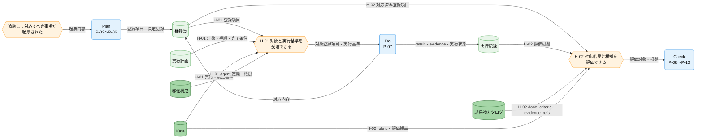
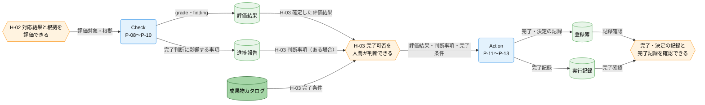

---
specdojo:
  id: cdfd-uc-register
  type: flow
  status: draft
  rulebook: specdojo:cdfd-uc-rulebook
  based_on:
    - cdfd-plan
    - cdfd-do
    - cdfd-check
    - cdfd-action
---

# 概念データフロー図（登録簿起票から完了まで）

ケース `C-01` のユースケース「登録簿起票から完了まで」について、登録項目の起票から対応、評価、人間による完了判断と完了記録までを Plan、Do、Check、Action の順に引き渡す条件を定める。

## 1. 目的

BA が登録項目の起票から完了記録までの通過順と責任境界を利用者視点で確認し、各グループの担当者が前段から受け取る情報と開始条件を設計入力として利用できるようにする。QE は条件不成立時の戻り先と再開条件を検証に使い、PO は Action において完了条件と評価結果を照合し、人間が完了を確定する境界を承認する。

これにより、判明事項と対応判断を共有可能な正本で引き継ぎ、担当者が交代しても対応の欠落、根拠不足の評価、完了判断の取り違えを防ぐ。

## 2. 適用範囲

- **対象ケース**: ケース `C-01`、ユースケース「登録簿起票から完了まで」。
- **開始イベント**: 参加者が、追跡して対応すべき判明事項、問題・課題、メモ、意思決定、または計画・再計画要求を起票する。
- **終了条件**: PO と PM が評価結果、進捗報告の判断事項、完了条件を照合して完了可能と判断し、PM が完了・決定の記録を登録簿へ、完了記録を実行記録へ残したことを確認できる。
- **参加グループ**: Plan（P-02〜P-06）、Do（P-07）、Check（P-08〜P-10）、Action（P-11〜P-13）。正常系ではこの順に通過する。
- **組織境界**: 起票する全参加者、登録記録と計画を担う PM、対応を担う owner ロール、評価を確定する QE、完了可否を判断する PO と PM を含む。承認と最終判断は人間が担い、AI Agent は記録、提案、実行、検証を支援できる。
- **システム境界**: 各グループが管理する正本と、グループ間で情報および判断を引き渡す境界までを扱う。
- **対象外**: 各グループ内部の領域・個別プロセス・主要例外・補助操作、コマンドやファイル単位の実装詳細、および状態名・状態の意味・成立条件・遷移を対象外とする。グループ内部は [[cdfd-plan|概念データフロー図（Plan）]]、[[cdfd-do|概念データフロー図（Do）]]、[[cdfd-check|概念データフロー図（Check）]]、[[cdfd-action|概念データフロー図（Action）]] を参照する。登録項目と実行記録の状態定義は STSD、状態遷移は CSTD を正本とし、本書では再定義しない。

## 3. プロセス領域

ケース `C-01` は四つのプロセスグループを Plan → Do → Check → Action の順に通過する。本章を正常順序とグループ別責務の正本とし、領域 ID、名称、グループ内部の責務は [[cdfd-overview|概念データフロー図（全体概要）]] と各グループ別 CDFD を正本とする。

### 3.1. Plan（P-02〜P-06）

参加者から起票された事項を追跡可能な登録項目・決定記録として確定し、対象登録項目、対応を開始するための情報、実行計画を Do へ渡す。

- **主要入力**: 参加者からの判明事項、問題・課題、メモ、意思決定、計画・再計画要求
- **主要出力**: 登録項目・決定記録、対象登録項目を特定する情報、実行計画
- **データストア**: 成果物カタログ、登録簿、実行計画

| 順序 | プロセスグループ | 含む領域   | 横断上の役割                                                       | 参照先                                    |
| ---- | ---------------- | ---------- | ------------------------------------------------------------------ | ----------------------------------------- |
| 1    | Plan             | P-02〜P-06 | 起票内容を記録として成立させ、対応対象と実行基準を Do へ引き渡す。 | [[cdfd-plan\|概念データフロー図（Plan）]] |

### 3.2. Do（P-07）

Plan から対象登録項目と実行基準を受け取り、owner ロールが対応を遂行・検証し、対応内容、検証結果、実行記録、実行状態を Check へ渡す。

- **主要入力**: 対象登録項目、実行計画、実行要求、Kata の実践の型、稼働構成の agent 定義・権限、必要な人間の承認
- **主要出力**: 登録項目への対応内容、検証結果、実行記録、実行状態
- **データストア**: Kata、稼働構成、登録簿、実行計画、実行記録

| 順序 | プロセスグループ | 含む領域 | 横断上の役割                                                    | 参照先                                |
| ---- | ---------------- | -------- | --------------------------------------------------------------- | ------------------------------------- |
| 2    | Do               | P-07     | 登録項目へ対応し、対応結果と再現可能な根拠を Check へ引き渡す。 | [[cdfd-do\|概念データフロー図（Do）]] |

### 3.3. Check（P-08〜P-10）

Do から対応済み登録項目と実行記録を受け取り、成果物カタログの `done_criteria`・`evidence_refs` と Kata の評価観点に照らして、QE が評価結果を確定し Action へ渡す。

- **主要入力**: 対応済み登録項目、実行記録と実行状態、`done_criteria`・`evidence_refs`、Kata の rubric・評価観点
- **主要出力**: 評価結果（grade、finding）、評価不能または再評価が必要な条件、進捗報告の判断事項
- **データストア**: Kata、成果物カタログ、登録簿、実行記録、評価結果、進捗報告

| 順序 | プロセスグループ | 含む領域   | 横断上の役割                                                             | 参照先                                      |
| ---- | ---------------- | ---------- | ------------------------------------------------------------------------ | ------------------------------------------- |
| 3    | Check            | P-08〜P-10 | 対応結果と根拠を評価し、人間が完了可否を判断できる情報を Action へ渡す。 | [[cdfd-check\|概念データフロー図（Check）]] |

### 3.4. Action（P-11〜P-13）

Check から評価結果と判断事項を受け取り、PO と PM が完了条件との照合によって完了可否を判断する。完了可能な場合は PM が完了・決定の記録と完了記録を残し、未充足の場合は Plan へ再計画要求を戻す。

- **主要入力**: 完了要求、評価結果、進捗報告の判断事項、成果物カタログの完了条件
- **主要出力**: 完了・決定の記録、完了記録、または完了条件の未充足事項と再計画要求
- **データストア**: 成果物カタログ、登録簿、実行記録、評価結果、進捗報告

| 順序 | プロセスグループ | 含む領域   | 横断上の役割                                                         | 参照先                                        |
| ---- | ---------------- | ---------- | -------------------------------------------------------------------- | --------------------------------------------- |
| 4    | Action           | P-11〜P-13 | 人間が完了可否を確定し、完了を記録するか、未充足事項を Plan へ戻す。 | [[cdfd-action\|概念データフロー図（Action）]] |

## 4. データストア

引き渡す情報または引き渡し条件の判定に使うデータストアだけを、[[cdfd-overview|概念データフロー図（全体概要）]] と同じ名称・区分で示す。

### 4.1. マスタ・構成データ

| データストア   | 関連引き渡し | 横断上の利用                                                                                     |
| -------------- | ------------ | ------------------------------------------------------------------------------------------------ |
| Kata           | H-01、H-02   | Do の実行・検証基準と、Check の rubric・評価観点の正本として、遂行可否と評価可能性の判定に使う。 |
| 稼働構成       | H-01         | Do が agent 定義・権限を確認し、利用可能な実行主体によって遂行を開始できるか判定するために使う。 |
| 成果物カタログ | H-02、H-03   | `done_criteria`・`evidence_refs` と完了条件の正本として、評価根拠の充足と完了可否の判定に使う。  |

### 4.2. トランザクションデータ

| データストア | 関連引き渡し     | 横断上の利用                                                                                     |
| ------------ | ---------------- | ------------------------------------------------------------------------------------------------ |
| 登録簿       | H-01、H-02、H-03 | 起票された登録項目、Do の対応内容、Action が確定した完了・決定の記録を対応付ける正本として使う。 |
| 実行計画     | H-01             | 対象、手順、完了条件を Do が受理できるか判定する実行基準として使う。                             |
| 実行記録     | H-02、H-03       | Do の result・evidence・実行状態と、Action が人間の判断後に残す完了記録の正本として使う。        |
| 評価結果     | H-03             | QE が確定した grade・finding と評価不能の範囲を、Action の完了可否判定の根拠として使う。         |
| 進捗報告     | H-03             | 完了判断または再計画に影響する判断事項がある場合に、Action が評価結果と併せて参照する。          |

## 5. 概念データフロー

### 5.1. 起票から評価まで

凡例は [[cdfd-overview|概念データフロー図（全体概要）]] の「凡例（本プロダクト共通）」に従う。角丸長方形はプロセスグループ、六角形は開始・引き渡し条件、円柱はデータストアを表す。円柱の濃い緑はマスタ・構成データ、薄い緑はトランザクションデータを表す。`-->` は情報の流れであり、本図は物の流れを対象外とする。各グループの内部プロセスと状態遷移は省略した。データストアは H-01 の受理条件または H-02 の評価条件の正本となるものだけを置いた。

### 5.2. 評価から完了記録まで

凡例は [[cdfd-overview|概念データフロー図（全体概要）]] の「凡例（本プロダクト共通）」に従う。角丸長方形はプロセスグループ、六角形は引き渡し・終了条件、円柱はデータストアを表す。円柱の濃い緑はマスタ・構成データ、薄い緑はトランザクションデータを表す。`-->` は情報の流れであり、本図は物の流れを対象外とする。H-02 を前図との接続点として再掲し、各グループの内部プロセスと状態遷移は省略した。データストアは H-03 の完了判断または終了確認の正本となるものだけを置いた。

## 6. 引き渡し

| 引き渡し ID | 送り元グループ | 受け側グループ | 引き渡す情報                                                                                         | 引き渡し条件                                                                                                                                                                          | 戻す条件                                                                                                                                                                                         |
| ----------- | -------------- | -------------- | ---------------------------------------------------------------------------------------------------- | ------------------------------------------------------------------------------------------------------------------------------------------------------------------------------------- | ------------------------------------------------------------------------------------------------------------------------------------------------------------------------------------------------ |
| H-01        | Plan           | Do             | 対象登録項目、登録項目・決定記録、実行計画、対応開始を判断できる情報                                 | 登録項目を一意に特定でき、実行計画に対象・手順・完了条件があり、適用する Kata、実行主体、利用可能な権限、必要な人間の承認を Do が確認できる。                                         | 登録項目または実行計画を特定できない、対象・手順・完了条件が不足する、適用する Kata・実行主体・利用可能な権限・必要な承認を確認できず遂行を開始できない。                                        |
| H-02        | Do             | Check          | 対応済み登録項目、対応内容、検証結果、result、evidence、実行状態                                     | 登録項目への対応が完了し、対象と対応内容が登録簿で対応付き、`done_criteria` ごとの評価に使う result・evidence・実行状態を Check が特定できる。                                        | 評価対象が対応後に変更された、対応内容と実行記録を対応付けられない、必要な evidence を取得できない、または実行状態から対応完了を確認できない。                                                   |
| H-03        | Check          | Action         | 確定した評価結果、評価不能または再評価が必要な条件、完了判断に影響する進捗報告の判断事項（ある場合） | QE が grade・finding または評価不能の範囲を確定し、対象登録項目が評価後に変更されておらず、完了要求と完了条件、および進捗報告に判断事項がある場合はその内容を PO と PM が照合できる。 | 評価結果が未確定、評価対象との対応が失われた、完了要求または完了条件を特定できない、進捗報告に完了判断へ影響する事項があるのにその内容を確認できない、あるいは完了条件の未充足事項が特定された。 |

## 7. 例外時の戻り先

| 対象引き渡し | 条件不成立                                                                                         | 戻り先グループ | 戻す情報                                                              | 再開条件                                                                                                                         |
| ------------ | -------------------------------------------------------------------------------------------------- | -------------- | --------------------------------------------------------------------- | -------------------------------------------------------------------------------------------------------------------------------- |
| H-01         | 対象登録項目、実行計画、Kata、実行主体、利用可能な権限、必要な人間の承認のいずれかを確認できない。 | Plan           | 特定できない対象、不足する実行基準、利用制限、承認待ちの内容          | 対象登録項目と、不足を補った対象・手順・完了条件が対応付き、利用可能な実行主体・権限と必要な承認を確認して H-01 を再評価できる。 |
| H-02         | 対応済み登録項目と対応内容・実行記録を対応付けられない、または評価に必要な根拠が不足している。     | Do             | 評価できない対象、変更された内容、不足する result・evidence・実行状態 | 対応後の登録項目と必要な根拠が対応付き、Check が同じ対象について H-02 を再評価できる。                                           |
| H-03         | 評価結果が未確定、評価対象との対応が失われた、または評価不能の範囲が完了判断を妨げる。             | Check          | 未確定または不整合の評価対象、不足根拠、再評価が必要な条件            | 対象と根拠を再確定し、QE が評価結果または評価不能の範囲を確定して H-03 を再評価できる。                                          |
| H-03         | PO と PM の照合により完了条件の未充足事項が特定された。                                            | Plan           | 完了条件の未充足事項、再計画要求                                      | 再計画に基づく対応と評価が完了し、完了条件を照合できる評価結果と完了要求がそろった後、H-01 から横断順序を再開できる。            |

戻り先はプロセスグループまでとし、グループ内部の再開位置や例外処理は各グループ別 CDFD を正本とする。

## 8. 未決事項

| 論点                                                                                    | 影響するケース・引き渡し | 決定者  | 決定時期                    |
| --------------------------------------------------------------------------------------- | ------------------------ | ------- | --------------------------- |
| `_UNDECIDED_`: 登録項目と実行記録の状態定義・状態遷移を正本とする STSD / CSTD の文書 ID | H-01〜H-03               | BA、ARC | 本書を `ready` に昇格する前 |
