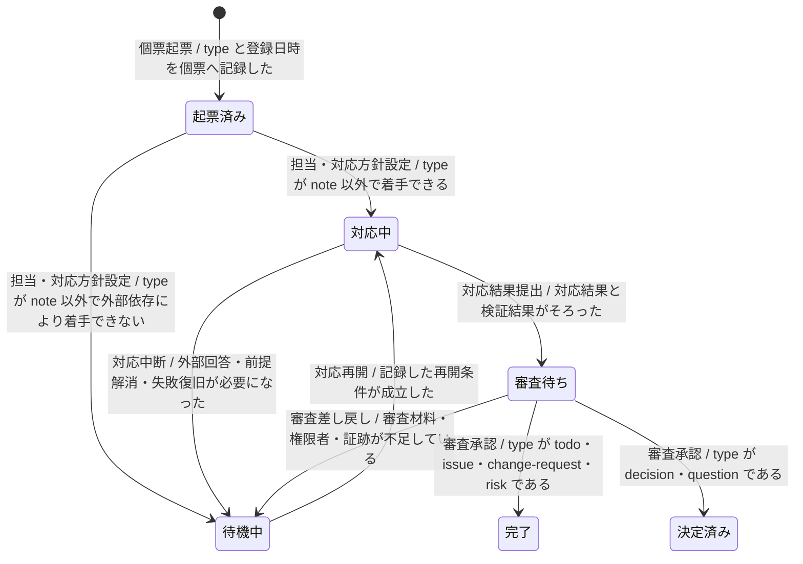
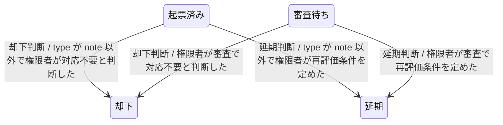
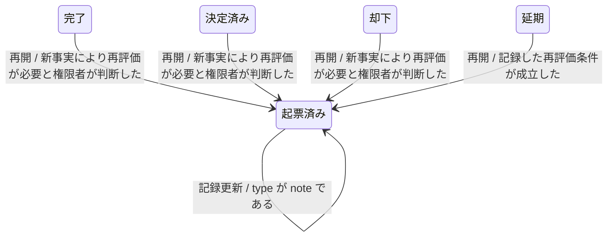

---
specdojo:
  id: stsd-register-entry
  type: data
  status: draft
  rulebook: specdojo:stsd-rulebook
  based_on: []
  supersedes: []
---

# ステータス定義（登録項目個票）

## 1. 概要

登録簿で追跡する計画外事項・判断事項（登録項目）について、現行運用（AS-IS）の起票から対応、審査、終了、再開までの状態と遷移を定義する。項目 owner と type 別承認者は現在状態から次の行動と終了判断を、ARC・QE・DEV は状態遷移の設計・検証・実装の基礎として利用する。

- 対象: 登録簿の一項目一ファイルの個票で管理する登録項目（`todo`、`question`、`risk`、`issue`、`change-request`、`decision`、`note`）
- スコープ: 現行運用（AS-IS）の起票、担当・対応方針設定、人または AI Agent による対応・調査、審査・終了判断、終了項目の再開
- 状態の正本: 個票 Frontmatter の状態・登録日時・完了日時と、本文の結論。登録項目一覧や状態別ビューは個票から再生成する派生物であり、状態の正本にしない
- 一意判定: 個票 Frontmatter の状態値が一つの状態を示す。状態を変える操作は個票内の追記型 event にも記録され、最後に成立した遷移の遷移先が現在状態と一致する
- 日時の記録: 登録日時と完了日時は UTC・RFC 3339・秒精度で個票へ保持する。一覧の登録日・完了日はプロジェクトの IANA タイムゾーンへ変換した暦日として導出し、期限は同タイムゾーン上の暦日として保持する
- 終了点を置かない理由: 完了・決定済み・却下・延期は新事実による再開を受け付けるため、ライフサイクルを閉じない。`note` は共有・備忘のための生きている記録であり、起票済みのまま記録を更新し続け、終端させない
- AI Agent の責任範囲: AI Agent は対応・調査と検証を支援するが項目を終端化しない。完了・決定・却下・延期・再開の判断は人間が担う

### 1.1. type 別の審査・承認と到達できる状態

| type             | 審査・承認者               | 審査待ち後の主な判断                           | 既定の証跡       |
| ---------------- | -------------------------- | ---------------------------------------------- | ---------------- |
| `change-request` | 変更承認権限者（PO / CCB） | 承認後に完了、または却下・延期・待機           | PR approve       |
| `decision`       | 当該領域の意思決定者       | 決定済み、または却下・延期・追加確認の待機     | 個票と commit    |
| `risk`           | リスクオーナー             | 対応完了・受容による完了、延期、追加確認の待機 | 個票と commit    |
| `question`       | 回答権限者                 | 回答確定後に決定済み、または追加確認の待機     | 個票と commit    |
| `issue`          | 課題リード                 | 対応確認後に完了、または却下・延期             | result と commit |
| `todo`           | 項目 owner・レビュー担当   | 対応確認後に完了、または延期・待機             | result と commit |
| `note`           | 審査・承認の対象外         | 審査へ進めず、起票済みのまま記録を更新し続ける | 個票と commit    |

既定は commit による証跡とする。PR 承認を強制するのは、`develop → main` 昇格、`change-request` 承認、不可逆・高リスク・framework schema 破壊的変更の三ケースである。詳細は [[specdojo:register-operation-guide|登録簿運用ガイド]] と [[specdojo:git-branching-standard|Git ブランチ運用標準]] を正とする。

## 2. 状態一覧

| 値            | 状態名   | 通称   | 意味                                                                              | 成立条件                                                                                             | 管理場所                |
| ------------- | -------- | ------ | --------------------------------------------------------------------------------- | ---------------------------------------------------------------------------------------------------- | ----------------------- |
| `open`        | 起票済み | 未着手 | 起票または再開され、対応に着手していない項目。`note` では継続更新できる記録を表す | 個票に type と登録日時が記録され、状態が `open` で、完了日時を持たない                               | 個票 Frontmatter        |
| `in-progress` | 対応中   | -      | 担当者または AI Agent が対応・調査している項目                                    | 担当・期限・対応内容が個票へ反映され、状態が `in-progress` である                                    | 個票 Frontmatter・本文  |
| `waiting`     | 待機中   | 保留   | 外部回答、前提解消、Agent 実行の失敗復旧、審査材料の補完を待つ項目                | 待機理由と再開条件が個票の結論欄または本文へ記録され、状態が `waiting` である                        | 個票 Frontmatter・本文  |
| `review`      | 審査待ち | -      | 対応結果がそろい、人間の審査・承認を待つ項目                                      | 対応結果、検証結果、承認対象と証跡候補が個票または result にそろい、状態が `review` である           | 個票、登録項目の result |
| `done`        | 完了     | -      | 対応が確認され、追跡を終えた項目                                                  | 結論と完了日時が個票へ記録され、状態が `done` である                                                 | 個票 Frontmatter・本文  |
| `decided`     | 決定済み | -      | 判断・回答が確定し、追跡を終えた `decision` または `question`                     | 決定内容または回答、結論、完了日時が個票へ記録され、状態が `decided` である                          | 個票 Frontmatter・本文  |
| `rejected`    | 却下     | -      | 対応・変更を行わないと判断した項目                                                | 却下理由を含む結論と完了日時が個票へ記録され、状態が `rejected` である                               | 個票 Frontmatter・本文  |
| `deferred`    | 延期     | -      | 現時点では実施せず、再評価条件の成立を待つ項目                                    | 延期理由と再評価条件が個票へ記録され、状態が `deferred` である。完了日時は終了の証跡として要求しない | 個票 Frontmatter・本文  |

## 3. 状態遷移図

一つの状態に接続する遷移が 6 を超えるため、業務フェーズで三図に分ける。共有する状態は各図で同じ表示名と `state_id` を使う。

### 3.1. 着手・対応・審査（T-01、T-03、T-04、T-07〜T-12）

### 3.2. 却下・延期（T-05、T-06、T-13、T-14）

### 3.3. 記録更新・再開（T-02、T-15〜T-18）

## 4. 遷移の説明

| 遷移 ID | 遷移元   | 遷移先   | イベント           | 条件                                                     | 補足                                                                                                    |
| ------- | -------- | -------- | ------------------ | -------------------------------------------------------- | ------------------------------------------------------------------------------------------------------- |
| `T-01`  | 開始     | 起票済み | 個票起票           | type と登録日時を個票へ記録した                          | 提起者・BA・PM が type を選ぶ。計画済み作業は Schedule で扱い、登録簿へ重複登録しない                   |
| `T-02`  | 起票済み | 起票済み | 記録更新           | type が `note` である                                    | `note` は審査・終了の対象外で、起票済みのまま内容を更新する。対応や判断が必要になったら別項目を起票する |
| `T-03`  | 起票済み | 対応中   | 担当・対応方針設定 | type が `note` 以外で着手できる                          | 担当・期限・人または AI Agent の対応経路を個票へ記録する                                                |
| `T-04`  | 起票済み | 待機中   | 担当・対応方針設定 | type が `note` 以外で外部依存により着手できない          | 待機理由と再開条件を記録する                                                                            |
| `T-05`  | 起票済み | 却下     | 却下判断           | type が `note` 以外で権限者が対応不要と判断した          | 却下理由と完了日時を記録する                                                                            |
| `T-06`  | 起票済み | 延期     | 延期判断           | type が `note` 以外で権限者が再評価条件を定めた          | 延期理由と再評価条件を記録する                                                                          |
| `T-07`  | 対応中   | 待機中   | 対応中断           | 外部回答・前提解消・失敗復旧が必要になった               | AI Agent 実行・検査・result 作成・commit の失敗時は項目を終端化せず、失敗理由と result を残して待機する |
| `T-08`  | 待機中   | 対応中   | 対応再開           | 記録した再開条件が成立した                               | 失敗復旧後は保持した成果物・result を確認してから再実行または人対応を選ぶ                               |
| `T-09`  | 対応中   | 審査待ち | 対応結果提出       | 対応結果と検証結果がそろった                             | AI Agent の成功時もここまでで止まり、終端化は人間の審査で行う                                           |
| `T-10`  | 審査待ち | 待機中   | 審査差し戻し       | 審査材料・権限者・証跡が不足している                     | 不足情報、取得責任者、再審査条件を記録する                                                              |
| `T-11`  | 審査待ち | 完了     | 審査承認           | type が `todo`・`issue`・`change-request`・`risk` である | type 別承認者が承認し、結論と完了日時を記録する。`change-request` は PR approve を証跡とする            |
| `T-12`  | 審査待ち | 決定済み | 審査承認           | type が `decision`・`question` である                    | 意思決定者または回答権限者が確定し、結論と完了日時を記録する                                            |
| `T-13`  | 審査待ち | 却下     | 却下判断           | 権限者が審査で対応不要と判断した                         | 却下理由と完了日時を記録する                                                                            |
| `T-14`  | 審査待ち | 延期     | 延期判断           | 権限者が審査で再評価条件を定めた                         | 延期理由と再評価条件を記録する                                                                          |
| `T-15`  | 完了     | 起票済み | 再開               | 新事実により再評価が必要と権限者が判断した               | 旧結論を消さずに再開理由を追記し、完了日時を削除する                                                    |
| `T-16`  | 決定済み | 起票済み | 再開               | 新事実により再評価が必要と権限者が判断した               | 旧結論を消さずに再開理由を追記し、完了日時を削除する                                                    |
| `T-17`  | 却下     | 起票済み | 再開               | 新事実により再評価が必要と権限者が判断した               | 旧結論を消さずに再開理由を追記し、完了日時を削除する                                                    |
| `T-18`  | 延期     | 起票済み | 再開               | 記録した再評価条件が成立した                             | 延期理由を残したまま再開理由を追記する                                                                  |

## 5. 今後の検討メモ

| 論点                                                                                                                                                       | 影響する状態・遷移             | 決定者  | 決定時期                    |
| ---------------------------------------------------------------------------------------------------------------------------------------------------------- | ------------------------------ | ------- | --------------------------- |
| _ASSUMPTION_: 再開は起票済みへ戻す遷移として定義した。再開時に対応中・待機中・審査待ちを直接指定する運用は、再開と後続遷移を同時に記録したものとして扱う   | `T-15`〜`T-18`                 | ARC、PO | 本書のレビュー時            |
| _ASSUMPTION_: 却下・延期は起票済みと審査待ちからの権限者判断として定義した。CLI は対応中・待機中からの却下・延期も受け付けるため、業務上認めるかを確認する | `T-05`、`T-06`、`T-13`、`T-14` | PO、ARC | 本書のレビュー時            |
| _UNDECIDED_: `note` の終了を CLI で拒否するか。現行運用規則は `note` を終端させないが、完了操作が `note` を拒否する検証は確認できていない                  | `T-02`、`T-05`、`T-06`         | ARC、QE | 登録簿検証の改訂時          |
| _TODO_: `stsd-register-entry` の `based_on` に業務データ辞書（`bdd-register-entry`）を追加する。現時点で同文書は未作成である                               | 全状態                         | BA      | `bdd-register-entry` 作成時 |
