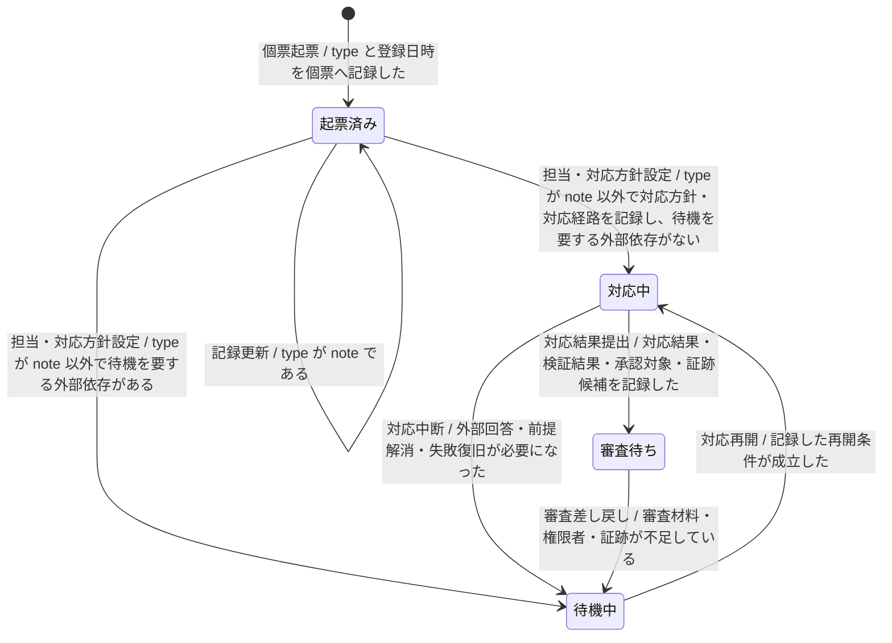

---
specdojo:
  id: stsd-register-entry
  type: data
  status: draft
  rulebook: specdojo:stsd-rulebook
  based_on: []
  supersedes: []
---

# ステータス定義（登録項目個票）

## 1. 概要

登録簿で追跡する計画外事項・判断事項（登録項目）について、現行運用（AS-IS）の起票から対応、審査、終了、再開までの状態と遷移を定義する。項目 owner と type 別承認者は現在状態から次の行動と終了判断を、ARC・QE・DEV は状態遷移の設計・検証・実装の基礎として利用する。状態と判断の記録を共通正本に集約して誤終了・判断漏れ・引継ぎ不能を防ぎ、プロジェクトの `BV-03`（無理のない継続）を支える。

- 対象: 登録簿の一項目一ファイルの個票で管理する登録項目（`epic`、`todo`、`question`、`risk`、`issue`、`change-request`、`decision`、`note`）
- スコープ: 現行運用（AS-IS）の起票、担当・対応方針設定、人または AI Agent による対応・調査、審査・終了判断、終了項目の再開
- 状態の正本: 個票 Frontmatter の `item_status`。文書の成熟度を表す `status` とは区別する。登録日時・完了日時・結論はそれぞれ `registered_at`・`completed_at`・`conclusion` で保持する。登録項目一覧や状態別ビューは個票から再生成する派生物である
- 一意判定: `item_status` の単一の値で現在状態を判定する。履歴は個票とは別の追記型 event ファイルで管理し、遷移元・遷移先・実行者・理由を記録する。状態変更後は履歴の最終到達状態と現在状態を一致させる
- 日時の記録: 登録日時と完了日時は UTC・RFC 3339・秒精度で個票へ保持する。一覧の登録日・完了日はプロジェクトの IANA タイムゾーンへ変換した暦日として導出し、期限は同タイムゾーン上の暦日として保持する
- 終了点を置かない理由: 業務上の到達点は完了・決定済み・却下・延期である。いずれも再評価のため再開できる状態として管理を続け、ライフサイクルを閉じない。本書の全図を通して、出力遷移のない継続状態はない
- AI Agent の責任範囲: AI Agent は対応・調査と検証を支援するが項目を終端化しない。完了・決定・却下・延期・再開の判断は人間が担う

`epic` は Frontmatter の `track` で track を担い、具体的な作業は `derived_from` でつないだ子 todo で実施する。自身は `exec run --register` と夜間 queue の対象にしない。子項目と schedule を判断材料に人が close し、子の状態から自動遷移しない。

活動中は起票済み・対応中・待機中・審査待ち、終端は完了・決定済み・却下・延期とする。活動中のどの状態からも、人間が必要な確認・承認を終えれば直接終端へ進める。終端からは再評価の準備状況に応じて活動中の四状態へ直接再開でき、起票済みを経由した二段階の遷移とは扱わない。業務上の承認・証跡条件と CLI が強制する制約は第 4 章で区別する。

### 1.1. type 別の審査・承認と到達できる状態

| type             | 審査・承認者               | 主な終了・継続判断                                 | 既定の証跡       |
| ---------------- | -------------------------- | -------------------------------------------------- | ---------------- |
| `change-request` | 変更承認権限者（PO / CCB） | 承認後に完了、または却下・延期・待機               | PR approve       |
| `decision`       | 当該領域の意思決定者       | 決定済み、または却下・延期・追加確認の待機         | 個票と commit    |
| `risk`           | リスクオーナー             | 対応完了・受容による完了、延期、追加確認の待機     | 個票と commit    |
| `question`       | 回答権限者                 | 回答確定後に決定済み、または追加確認の待機         | 個票と commit    |
| `issue`          | 課題リード                 | 対応確認後に完了、または却下・延期                 | result と commit |
| `epic`           | track の完了を判断する人   | 子項目と schedule を確認して完了、または却下・延期 | 個票と commit    |
| `todo`           | 項目 owner・レビュー担当   | 対応確認後に完了、または延期・待機                 | result と commit |
| `note`           | 審査・承認の対象外         | 審査へ進めず、起票済みのまま記録を更新し続ける     | 個票と commit    |

既定は commit による証跡とする。PR 承認を強制するのは、`develop → main` 昇格、`change-request` 承認、不可逆・高リスク・framework schema 破壊的変更の三ケースである。詳細は [[specdojo:register-operation-guide|登録簿運用ガイド]] と [[specdojo:git-branching-standard|Git ブランチ運用標準]] を正とする。

## 2. 状態一覧

`owner`・`due_on` は省略でき、`due_on` の省略は期限未定、明示的な null は期限なしを示す。業務上の遷移条件と現行制約は第 4 章、未解決の依存と実装差異は第 5 章に示す。

| 値            | 状態名   | 通称   | 意味                                                                        | 成立条件                                                    | 管理場所         |
| ------------- | -------- | ------ | --------------------------------------------------------------------------- | ----------------------------------------------------------- | ---------------- |
| `open`        | 起票済み | 未着手 | 起票または再開され、対応に着手していない項目。`note` では継続更新できる記録 | `item_status` が `open`（未設定・空欄時も読み取りでは同値） | 個票 Frontmatter |
| `in-progress` | 対応中   | -      | 担当者または AI Agent が対応・調査している項目                              | `item_status` が `in-progress`                              | 個票 Frontmatter |
| `waiting`     | 待機中   | 保留   | 外部回答、前提解消、失敗復旧、審査材料の補完を待つ項目                      | `item_status` が `waiting`                                  | 個票 Frontmatter |
| `review`      | 審査待ち | -      | 対応結果について人間の審査・承認を待つ項目                                  | `item_status` が `review`                                   | 個票 Frontmatter |
| `done`        | 完了     | -      | 対応が確認され、追跡を終えた項目                                            | `item_status` が `done`                                     | 個票 Frontmatter |
| `decided`     | 決定済み | -      | 判断・回答が確定し、追跡を終えた `decision` または `question`               | `item_status` が `decided`                                  | 個票 Frontmatter |
| `rejected`    | 却下     | -      | 対応・変更を行わないと判断した項目                                          | `item_status` が `rejected`                                 | 個票 Frontmatter |
| `deferred`    | 延期     | -      | 現時点では実施せず、再評価条件の成立を待つ項目                              | `item_status` が `deferred`                                 | 個票 Frontmatter |

## 3. 状態遷移図

業務状態は 8、遷移は 40 で、遷移数 20 と一状態の入出力合計 6 の閾値を超えるため、活動・終了判断・再開の三図に分ける。3.1 と他図の接続状態は活動中の四状態、3.2 と 3.3 の接続状態は全八状態である。同じ状態は同じ表示名と `state_id` を使い、初期点は 3.1 にだけ置く。

### 3.1. 起票・記録更新・対応・審査（T-01〜T-04、T-07〜T-10）

```mermaid
stateDiagram-v2
  state "起票済み" as open
  state "対応中" as in_progress
  state "待機中" as waiting
  state "審査待ち" as review
  [*] --> open : 個票起票 / type と登録日時を個票へ記録した
  open --> open : 記録更新 / type が note である
  open --> in_progress : 担当・対応方針設定 / type が note 以外で対応方針・対応経路を記録し、待機を要する外部依存がない
  open --> waiting : 担当・対応方針設定 / type が note 以外で待機を要する外部依存がある
  in_progress --> waiting : 対応中断 / 外部回答・前提解消・失敗復旧が必要になった
  waiting --> in_progress : 対応再開 / 記録した再開条件が成立した
  in_progress --> review : 対応結果提出 / 対応結果・検証結果・承認対象・証跡候補を記録した
  review --> waiting : 審査差し戻し / 審査材料・権限者・証跡が不足している
```

### 3.2. 終了判断（T-05、T-06、T-11〜T-14、T-19〜T-28）

```mermaid
stateDiagram-v2
  state "起票済み" as open
  state "対応中" as in_progress
  state "待機中" as waiting
  state "審査待ち" as review
  state "完了" as done
  state "決定済み" as decided
  state "却下" as rejected
  state "延期" as deferred
  open --> rejected : 却下判断 / type が note 以外で権限者が対応不要と判断した
  open --> deferred : 延期判断 / type が note 以外で権限者が再評価条件を定めた
  review --> done : 審査承認 / type が epic・todo・issue・change-request・risk である
  review --> decided : 審査承認 / type が decision・question である
  review --> rejected : 却下判断 / 権限者が審査で対応不要と判断した
  review --> deferred : 延期判断 / 権限者が審査で再評価条件を定めた
  open --> done : 終了承認 / type が epic・todo・issue・change-request・risk である
  open --> decided : 終了承認 / type が decision・question である
  in_progress --> done : 終了承認 / type が epic・todo・issue・change-request・risk である
  in_progress --> decided : 終了承認 / type が decision・question である
  waiting --> done : 終了承認 / type が epic・todo・issue・change-request・risk である
  waiting --> decided : 終了承認 / type が decision・question である
  in_progress --> rejected : 却下判断 / 権限者が対応不要と判断した
  in_progress --> deferred : 延期判断 / 権限者が再評価条件を定めた
  waiting --> rejected : 却下判断 / 権限者が対応不要と判断した
  waiting --> deferred : 延期判断 / 権限者が再評価条件を定めた
```

### 3.3. 再開（T-15〜T-18、T-29〜T-40）

```mermaid
stateDiagram-v2
  state "起票済み" as open
  state "対応中" as in_progress
  state "待機中" as waiting
  state "審査待ち" as review
  state "完了" as done
  state "決定済み" as decided
  state "却下" as rejected
  state "延期" as deferred
  done --> open : 再開 / 新事実と再評価対象を記録し、権限者が再開を承認したうえで起票済みを選んだ
  decided --> open : 再開 / 新事実と再評価対象を記録し、権限者が再開を承認したうえで起票済みを選んだ
  rejected --> open : 再開 / 新事実と再評価対象を記録し、権限者が再開を承認したうえで起票済みを選んだ
  deferred --> open : 再開 / 再評価条件の成立根拠を記録し、権限者が再開を承認したうえで起票済みを選んだ
  done --> in_progress : 再開 / 新事実と再評価対象を記録し、権限者が再開を承認したうえで対応中を選んだ
  done --> waiting : 再開 / 新事実と再評価対象を記録し、権限者が再開を承認したうえで待機中を選んだ
  done --> review : 再開 / 新事実と再評価対象を記録し、権限者が再開を承認したうえで審査待ちを選んだ
  decided --> in_progress : 再開 / 新事実と再評価対象を記録し、権限者が再開を承認したうえで対応中を選んだ
  decided --> waiting : 再開 / 新事実と再評価対象を記録し、権限者が再開を承認したうえで待機中を選んだ
  decided --> review : 再開 / 新事実と再評価対象を記録し、権限者が再開を承認したうえで審査待ちを選んだ
  rejected --> in_progress : 再開 / 新事実と再評価対象を記録し、権限者が再開を承認したうえで対応中を選んだ
  rejected --> waiting : 再開 / 新事実と再評価対象を記録し、権限者が再開を承認したうえで待機中を選んだ
  rejected --> review : 再開 / 新事実と再評価対象を記録し、権限者が再開を承認したうえで審査待ちを選んだ
  deferred --> in_progress : 再開 / 再評価条件の成立根拠を記録し、権限者が再開を承認したうえで対応中を選んだ
  deferred --> waiting : 再開 / 再評価条件の成立根拠を記録し、権限者が再開を承認したうえで待機中を選んだ
  deferred --> review : 再開 / 再評価条件の成立根拠を記録し、権限者が再開を承認したうえで審査待ちを選んだ
```

## 4. 遷移の説明

### 4.1. 業務上の条件

各行の条件と次の共通条件をすべて満たす場合に pass、一つでも不足する場合に fail とする。CLI が操作を受け付けることだけでは業務上の承認・証跡の充足と判定しない。

- 活動中の遷移・終了判断は `note` 以外を対象とする。`note` は `T-02` の記録更新を続け、対応・回答・判断が必要になったら別項目を起票する。
- 着手・再対応: 対応方針と人または AI Agent の対応経路を記録し、待機を要する外部依存がないことを確認する。担当・期限は未定でもよい。
- 待機: 待機理由を `block_reason`、再開条件を個票本文へ記録し、`conclusion` は変更しない。審査差し戻しでは不足情報と取得責任者も記録する。待機を離れるときは `block_reason` を削除し、元の理由は履歴で保持する。
- 審査提出: 対応結果、実施した検証とその結果、承認対象、証跡候補を確認できる。情報が不足すれば提出せず、補完待ちは待機で扱う。
- 終了判断: 1.1 の人間の承認者、判断内容と理由、既定の証跡を確認できる。完了・決定済みは対応結果・検証結果の確認も必要とし、審査待ちを経由しない場合も省略しない。完了・決定済み・却下では `conclusion` と `completed_at` を記録する。延期では延期理由を `conclusion`、再評価条件を本文へ記録し、完了日時は付与しない。
- 再開: 1.1 の承認者が再評価対象と理由を確認し、承認の証跡を残す。旧結論・延期理由を保存し、再開理由を履歴へ追記し、`completed_at` を削除する。再開先は一つ選ぶ。起票済みは未着手、対応中は着手条件、待機中は待機理由・再開条件、審査待ちは審査提出条件を満たすことを確認する。待機中への直接再開では別途 `block_reason` を記録する。

| 遷移 ID | 遷移元   | 遷移先   | イベント           | 条件                                                                        | 補足                                                                                                    |
| ------- | -------- | -------- | ------------------ | --------------------------------------------------------------------------- | ------------------------------------------------------------------------------------------------------- |
| `T-01`  | 開始     | 起票済み | 個票起票           | type と登録日時を個票へ記録した                                             | 提起者・BA・PM が type を選ぶ。計画済み作業は Schedule で扱い、登録簿へ重複登録しない                   |
| `T-02`  | 起票済み | 起票済み | 記録更新           | type が `note` である                                                       | -                                                                                                       |
| `T-03`  | 起票済み | 対応中   | 担当・対応方針設定 | type が `note` 以外で対応方針・対応経路を記録し、待機を要する外部依存がない | -                                                                                                       |
| `T-04`  | 起票済み | 待機中   | 担当・対応方針設定 | type が `note` 以外で待機を要する外部依存がある                             | -                                                                                                       |
| `T-05`  | 起票済み | 却下     | 却下判断           | type が `note` 以外で権限者が対応不要と判断した                             | -                                                                                                       |
| `T-06`  | 起票済み | 延期     | 延期判断           | type が `note` 以外で権限者が再評価条件を定めた                             | -                                                                                                       |
| `T-07`  | 対応中   | 待機中   | 対応中断           | 外部回答・前提解消・失敗復旧が必要になった                                  | AI Agent 実行・検査・result 作成・commit の失敗時は項目を終端化せず、失敗理由と result を残して待機する |
| `T-08`  | 待機中   | 対応中   | 対応再開           | 記録した再開条件が成立した                                                  | 失敗復旧後は保持した成果物・result を確認してから再実行または人対応を選ぶ                               |
| `T-09`  | 対応中   | 審査待ち | 対応結果提出       | 対応結果・検証結果・承認対象・証跡候補を記録した                            | AI Agent の成功時もここまでで止まり、終端化は人間の審査で行う                                           |
| `T-10`  | 審査待ち | 待機中   | 審査差し戻し       | 審査材料・権限者・証跡が不足している                                        | 不足情報、取得責任者、再審査条件を記録する                                                              |
| `T-11`  | 審査待ち | 完了     | 審査承認           | type が `epic`・`todo`・`issue`・`change-request`・`risk` である            | -                                                                                                       |
| `T-12`  | 審査待ち | 決定済み | 審査承認           | type が `decision`・`question` である                                       | -                                                                                                       |
| `T-13`  | 審査待ち | 却下     | 却下判断           | 権限者が審査で対応不要と判断した                                            | -                                                                                                       |
| `T-14`  | 審査待ち | 延期     | 延期判断           | 権限者が審査で再評価条件を定めた                                            | -                                                                                                       |
| `T-15`  | 完了     | 起票済み | 再開               | 新事実と再評価対象を記録し、権限者が再開を承認したうえで起票済みを選んだ    | -                                                                                                       |
| `T-16`  | 決定済み | 起票済み | 再開               | 新事実と再評価対象を記録し、権限者が再開を承認したうえで起票済みを選んだ    | -                                                                                                       |
| `T-17`  | 却下     | 起票済み | 再開               | 新事実と再評価対象を記録し、権限者が再開を承認したうえで起票済みを選んだ    | -                                                                                                       |
| `T-18`  | 延期     | 起票済み | 再開               | 再評価条件の成立根拠を記録し、権限者が再開を承認したうえで起票済みを選んだ  | -                                                                                                       |
| `T-19`  | 起票済み | 完了     | 終了承認           | type が `epic`・`todo`・`issue`・`change-request`・`risk` である            | -                                                                                                       |
| `T-20`  | 起票済み | 決定済み | 終了承認           | type が `decision`・`question` である                                       | -                                                                                                       |
| `T-21`  | 対応中   | 完了     | 終了承認           | type が `epic`・`todo`・`issue`・`change-request`・`risk` である            | -                                                                                                       |
| `T-22`  | 対応中   | 決定済み | 終了承認           | type が `decision`・`question` である                                       | -                                                                                                       |
| `T-23`  | 待機中   | 完了     | 終了承認           | type が `epic`・`todo`・`issue`・`change-request`・`risk` である            | -                                                                                                       |
| `T-24`  | 待機中   | 決定済み | 終了承認           | type が `decision`・`question` である                                       | -                                                                                                       |
| `T-25`  | 対応中   | 却下     | 却下判断           | 権限者が対応不要と判断した                                                  | -                                                                                                       |
| `T-26`  | 対応中   | 延期     | 延期判断           | 権限者が再評価条件を定めた                                                  | -                                                                                                       |
| `T-27`  | 待機中   | 却下     | 却下判断           | 権限者が対応不要と判断した                                                  | -                                                                                                       |
| `T-28`  | 待機中   | 延期     | 延期判断           | 権限者が再評価条件を定めた                                                  | -                                                                                                       |
| `T-29`  | 完了     | 対応中   | 再開               | 新事実と再評価対象を記録し、権限者が再開を承認したうえで対応中を選んだ      | -                                                                                                       |
| `T-30`  | 完了     | 待機中   | 再開               | 新事実と再評価対象を記録し、権限者が再開を承認したうえで待機中を選んだ      | -                                                                                                       |
| `T-31`  | 完了     | 審査待ち | 再開               | 新事実と再評価対象を記録し、権限者が再開を承認したうえで審査待ちを選んだ    | -                                                                                                       |
| `T-32`  | 決定済み | 対応中   | 再開               | 新事実と再評価対象を記録し、権限者が再開を承認したうえで対応中を選んだ      | -                                                                                                       |
| `T-33`  | 決定済み | 待機中   | 再開               | 新事実と再評価対象を記録し、権限者が再開を承認したうえで待機中を選んだ      | -                                                                                                       |
| `T-34`  | 決定済み | 審査待ち | 再開               | 新事実と再評価対象を記録し、権限者が再開を承認したうえで審査待ちを選んだ    | -                                                                                                       |
| `T-35`  | 却下     | 対応中   | 再開               | 新事実と再評価対象を記録し、権限者が再開を承認したうえで対応中を選んだ      | -                                                                                                       |
| `T-36`  | 却下     | 待機中   | 再開               | 新事実と再評価対象を記録し、権限者が再開を承認したうえで待機中を選んだ      | -                                                                                                       |
| `T-37`  | 却下     | 審査待ち | 再開               | 新事実と再評価対象を記録し、権限者が再開を承認したうえで審査待ちを選んだ    | -                                                                                                       |
| `T-38`  | 延期     | 対応中   | 再開               | 再評価条件の成立根拠を記録し、権限者が再開を承認したうえで対応中を選んだ    | -                                                                                                       |
| `T-39`  | 延期     | 待機中   | 再開               | 再評価条件の成立根拠を記録し、権限者が再開を承認したうえで待機中を選んだ    | -                                                                                                       |
| `T-40`  | 延期     | 審査待ち | 再開               | 再評価条件の成立根拠を記録し、権限者が再開を承認したうえで審査待ちを選んだ  | -                                                                                                       |

### 4.2. 現行制約との対応

業務イベントの対応先を以下に示す。`src/register/transition-commands.ts` と `src/register/update.ts` で確認した現在動作であり、業務条件の自動検証を保証するものではない。共通して `item_status` を遷移先へ更新し、待機中以外では `block_reason` を削除する。状態が変わる操作は個票更新と別に event を作成する。

| 遷移 ID                        | 対応する操作      | 主な記録の変更                                                                                                                    | 現行の拒否条件・制約                                                                                                                                                         |
| ------------------------------ | ----------------- | --------------------------------------------------------------------------------------------------------------------------------- | ---------------------------------------------------------------------------------------------------------------------------------------------------------------------------- |
| `T-01`                         | `register add`    | 既定は `item_status: open`、`item_type`、`registered_at`。完了日時の既定は未設定                                                  | 状態値は八状態から検証する。初期状態の指定と業務範囲の差異は `M-01`                                                                                                          |
| `T-02`                         | `register update` | 本文・各フィールドを更新し、`item_status` は保持                                                                                  | 現行 `update` に状態変更オプションはない。活動中・終端とも記録更新できる。待機中以外への待機理由設定は拒否する                                                               |
| `T-03`、`T-08`                 | `register start`  | `item_status: in-progress`                                                                                                        | 遷移元が終端なら拒否する                                                                                                                                                     |
| `T-04`、`T-07`、`T-10`         | `register wait`   | `item_status: waiting`、理由指定時に `block_reason`。`conclusion` は保持                                                          | 遷移元が終端、理由と旧別名の同時指定、指定理由が空文字なら拒否する。理由の省略自体は拒否しない                                                                               |
| `T-09`                         | `register review` | `item_status: review`                                                                                                             | 遷移元が終端なら拒否する                                                                                                                                                     |
| `T-11`、`T-12`、`T-19`〜`T-24` | `register close`  | `item_status`、`completed_at`（指定値または現在の UTC）、指定時に `conclusion`                                                    | 終端・`note`・遷移先が `done` / `decided` 以外・完了日時なしを拒否する。既定の遷移先は `decision` / `question` が `decided`、他が `done`。明示指定は type 別制限を強制しない |
| `T-05`、`T-13`、`T-25`、`T-27` | `register reject` | `item_status: rejected`、`completed_at`（指定値または現在の UTC）、指定時に `conclusion`                                          | 終端・`note`・完了日時なしを拒否する                                                                                                                                         |
| `T-06`、`T-14`、`T-26`、`T-28` | `register defer`  | `item_status: deferred`、指定時に `conclusion`。`completed_at` は保持し、新たに付与しない                                         | 終端・`note` を拒否する                                                                                                                                                      |
| `T-15`〜`T-18`、`T-29`〜`T-40` | `register reopen` | `item_status`、`completed_at` の削除。`conclusion` は保持。待機中への再開では既存 `block_reason` を保持するが新規理由は設定しない | 活動中からの実行、遷移先が活動中の四状態以外なら拒否する。既定の再開先は起票済み                                                                                             |

`start`・`wait`・`review` は活動中のどの状態からも受け付け、現在と同じ状態の指定も受け付ける。同じ状態の指定や通常のフィールド更新は業務状態の変化を増やさないため、`note` の継続記録を表す `T-02` を除き自己遷移として列挙しない。活動中から起票済みへ戻す操作、終端から別の終端への直接変更は定義しない。終端の状態変更には再開を先に行う。現行 CLI と業務上の制限が異なる点は `M-01` に残す。

### 4.3. 後続検証へ渡す判定基準

4.1 の各 T-ID と共通条件を許可経路・成立条件・記録結果の判定基準とし、表にない状態変更と条件不足は業務上 fail とする。CLI の許可・拒否と記録変更は 4.2 に従い、拒否時には個票・event が変更されないことを確認する。業務上だけの制約は人間の確認と CLI の検証結果を区別する。

- 活動中の各状態からの四つの終端先と、終端の各状態からの四つの再開先を確認し、完了・決定済みの分岐は type 別に検証する。
- 理由省略・承認証跡不足・直接待機再開の理由補完を、業務条件と CLI 制約の境界として確認する。

`register build` は個票 ID とファイル名の対応・一意性、派生元・依存関係、外部 event の検証を呼び出す整合検査として接続する。コマンドの許可・拒否とフィールド更新は関連テストへ T-ID を対応付ける。register item/event schema と関連テストの定義本体は今回の宣言参照外であり、既存テストの網羅や schema との一致を確認済みとはしない。

## 5. 今後の検討メモ

`M-01` と `M-04` は本書内の追跡番号であり、PJR の起票済み ID ではない。依存と進捗への影響は PM、方針判断は PO へ報告し、PM が PJR の実 ID と Schedule に接続する。接続先と日程は PM による設定待ちである。

| 追跡・論点                                                                                                                                                                                                                                                                                                                                                                                                                               | 影響する状態・遷移                               | 決定者・決定時期                      | 次のアクション・後続への影響                                                                                                                                                                                                                                                                                                                                                                                                                                                          |
| ---------------------------------------------------------------------------------------------------------------------------------------------------------------------------------------------------------------------------------------------------------------------------------------------------------------------------------------------------------------------------------------------------------------------------------------- | ------------------------------------------------ | ------------------------------------- | ------------------------------------------------------------------------------------------------------------------------------------------------------------------------------------------------------------------------------------------------------------------------------------------------------------------------------------------------------------------------------------------------------------------------------------------------------------------------------------- |
| `M-01` _UNDECIDED_: 業務条件と CLI の許可範囲の差異。承認・証跡・結論・待機理由の必須性は強制されず、`close` の明示指定は type 別の終端先を限定しない。`note` の終端は拒否するが、着手・待機・審査は拒否しない。`add` は起票済み以外も指定できる。直接待機再開では理由の新規設定を伴わない。また、CLI が許す起票済み・待機中から審査待ち、審査待ちから対応中への直接変更は、既存業務定義と plan に承認根拠がないため図表へ追加していない | 全状態、`T-01`、`T-03`〜`T-40`、未承認の直接変更 | PO・ARC・QE／状態管理の実装受入確定前 | PM は実装差異を issue、強制方針と未承認経路の選択を decision に接続する。業務条件の自動検証を採用する場合は change-request で CLI 改修と関連テスト・schema・運用規則の整合を扱う。不採用なら CLI は維持し、4.1 の人間の確認と記録を受入手順へ明記する。未承認経路を採用する場合は条件を承認して図表へ追加し、不採用なら CLI の制限要否を判断する。決定後は本書と影響先へ反映する。選択までは当該経路・自動強制を前提とする設計・テストの確定を留保し、PM が Schedule の影響を評価する |
| `M-04` _TODO_: `depends_on` の業務データ辞書（`bdd-register-entry.yaml`）は未作成であり、用語照合と `based_on` の根拠が不足している                                                                                                                                                                                                                                                                                                      | 全状態                                           | BA／`bdd-register-entry` 作成時       | PM は辞書作成と本書への反映を todo または Schedule の作業へ接続する。順序は辞書の作成・確認、状態名・用語の照合、不整合の修正、許可された `prj-0001:bdd-register-entry` の `based_on` 追加とする。完了条件は辞書が存在し、その定義との一致と参照を確認できること。日程は PM が設定し、解消まで用語の最終確定と依存成果物に基づく適合判断を留保する                                                                                                                                    |

方針決定・依存解消後は本書を更新し、遷移が変われば図・遷移表を同じ変更で反映する。実装・運用の影響先は `src/register/register.ts`、`src/register/item.ts`、`src/register/transition-commands.ts`、`src/register/create-commands.ts`、`src/register/update.ts`、register item/event schema、関連テスト、`pjr-rulebook.md`、`register-operation-guide.md` とする。schema・関連テスト・運用規則は今回参照しておらず、具体的な改修箇所・テストパスは確定していない。
