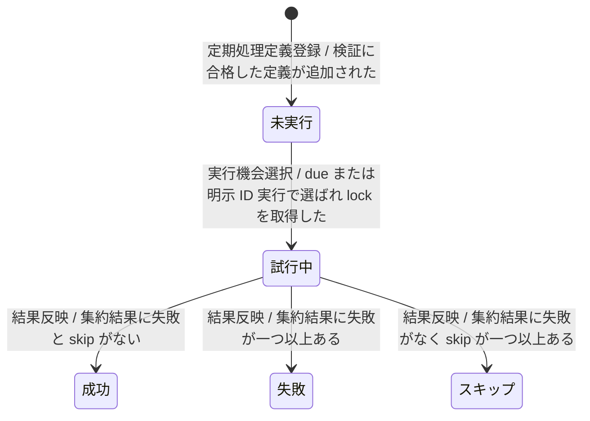
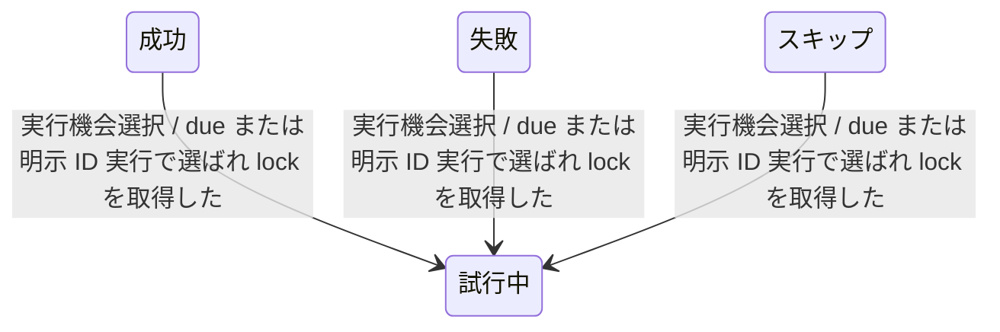

---
specdojo:
  id: stsd-routine-run
  type: data
  status: draft
  rulebook: specdojo:stsd-rulebook
  based_on: []
  supersedes: []
---

# ステータス定義（定期処理の実行結果）

## 1. 概要

定期処理定義（routine）一件について、現行運用（AS-IS）の実行機会の選択から実行試行の記録、委譲結果の反映までの実行状態と遷移を定義する。PM・運用担当は現在状態から次回の実行機会と確認要否を、ARC・QE・DEV は due 判定、結果記録、次回判定の設計・検証・実装の基礎として利用する。

- 対象: 定期処理定義一件の実行状態（直前実行時刻、直前結果、cron の処理済み予定時刻）
- スコープ: 現行運用（AS-IS）の due 判定、実行試行の先行記録、action の結果集約と記録。委譲先の登録項目・task・Job Run の状態は対象外とし、[[prj-0001:stsd-register-entry|ステータス定義（登録項目個票）]]、`stsd-task-execution`、`stsd-job-run` を参照する
- 状態の正本: routine 実行状態（`last_run`、`last_result`、`last_scheduled_for`、配列 action の `last_action_results`）。定期処理定義の interval・cron・timezone・policy・action は選択条件の正本であり、実行状態を持たない
- 一意判定: `last_run` と `last_result` の有無と値で現在状態を一つに決める。委譲前に記録した `last_run` に対応する `last_result` が未記録または直前値のままの場合は試行中とする
- 終了点を置かない理由: 定期処理は次の実行機会を繰り返し待つ継続的な管理であり、disabled でも明示 ID 実行や定義変更で再び選択されるため、ライフサイクルを閉じない

### 1.1. due 判定と実行機会の選択

| 定義・経路         | 起動条件と選択                                                                                                                                                                                 | 実行後の次回判定                                                                                          |
| ------------------ | ---------------------------------------------------------------------------------------------------------------------------------------------------------------------------------------------- | --------------------------------------------------------------------------------------------------------- |
| interval           | `last_run` がないか不正、または現在時刻との差が interval 以上なら一回 due とする。interval は正の整数と分・時・日・週の単位で定義する。                                                        | 委譲前に更新した `last_run` から次の interval を判定する。失敗・skip でも同じ実行機会を直ちに再試行しない |
| cron               | timezone 上の5フィールド cron に一致し、`last_scheduled_for` より後から現在分までの予定時刻を選ぶ。`missed_run: latest` または未指定は最新一件、`all` は取りこぼした各予定時刻を古い順に扱う。 | 委譲前に各 scheduled time を `last_scheduled_for` へ記録する。初回は直近の一致一件だけを選ぶ              |
| 特定 ID の即時実行 | 指定 ID が存在すれば、enabled と due にかかわらず現在時刻を scheduled time として一回選ぶ。                                                                                                    | 通常実行と同じく `last_run` と結果を記録する                                                              |
| disabled           | due 一括選択から除外する。                                                                                                                                                                     | 状態を更新せず、明示 ID 実行または定義変更を待つ                                                          |

cron の探索範囲は最大366日であり、`all` で1000件を超える取りこぼしは異常終了する。interval と cron は同じ定義へ同時指定できない。別の routine run が routine 全体の lock を保持している場合は、新しい run を実行前に停止し、実行状態を更新しない。

### 1.2. 結果の集約規則

- `action` は単一オブジェクト、または1件以上の配列とする。配列は先頭から同期的に実行し、途中の失敗・skip でも後段を続行する。
- 全体結果は失敗、skip、成功の優先順で集約する。配列 action では各段の1始まりの index、kind、結果を `last_action_results` に記録し、単一オブジェクトの action では記録しない。
- register / task 系 action の委譲対象がない場合、および完了済みの同一 Job Run を再実行しない場合は成功として記録する。project busy による skip と Job の precondition skip は skip として記録する。

## 2. 状態一覧

| 値        | 状態名   | 通称 | 意味                                                                                   | 成立条件                                                                                                   | 管理場所         |
| --------- | -------- | ---- | -------------------------------------------------------------------------------------- | ---------------------------------------------------------------------------------------------------------- | ---------------- |
| `never`   | 未実行   | -    | 実行試行の記録を一度も持たない定期処理                                                 | routine 実行状態に `last_run` がない                                                                       | routine 実行状態 |
| `running` | 試行中   | -    | 実行試行を先行記録し、action の結果をまだ反映していない定期処理                        | 新しい `last_run` を記録した後、その試行に対応する `last_result` をまだ記録していない                      | routine 実行状態 |
| `success` | 成功     | -    | 直前の実行機会で全 action が成功または対象なしとして終わった定期処理                   | `last_run` と `last_result: success` が記録され、cron では処理済みの `last_scheduled_for` が記録されている | routine 実行状態 |
| `failure` | 失敗     | -    | 直前の実行機会で一つ以上の action または段が失敗した定期処理                           | `last_run` と `last_result: failure` が記録され、cron では処理済みの `last_scheduled_for` が記録されている | routine 実行状態 |
| `skipped` | スキップ | -    | 直前の実行機会で project busy または Job precondition により委譲を行わなかった定期処理 | `last_run` と `last_result: skipped` が記録され、cron では処理済みの `last_scheduled_for` が記録されている | routine 実行状態 |

## 3. 状態遷移図

試行中に接続する遷移が 6 を超えるため、初回実行と結果反映、次の実行機会の選択で二図に分ける。共有する状態は各図で同じ表示名と `state_id` を使う。

### 3.1. 初回実行と結果反映（T-01〜T-05）

### 3.2. 次の実行機会の選択（T-06〜T-08）

## 4. 遷移の説明

| 遷移 ID | 遷移元   | 遷移先   | イベント         | 条件                                           | 補足                                                                                                                                     |
| ------- | -------- | -------- | ---------------- | ---------------------------------------------- | ---------------------------------------------------------------------------------------------------------------------------------------- |
| `T-01`  | 開始     | 未実行   | 定期処理定義登録 | 検証に合格した定義が追加された                 | 不正定義や重複 ID は実行対象にせず、実行状態を推測で補正しない                                                                           |
| `T-02`  | 未実行   | 試行中   | 実行機会選択     | due または明示 ID 実行で選ばれ lock を取得した | 委譲前に `last_run` と cron の `last_scheduled_for` を記録する。dry-run では記録しない                                                   |
| `T-03`  | 試行中   | 成功     | 結果反映         | 集約結果に失敗と skip がない                   | 委譲対象なし、完了済み重複 Job Run の採用を含む                                                                                          |
| `T-04`  | 試行中   | 失敗     | 結果反映         | 集約結果に失敗が一つ以上ある                   | 同じ実行機会は直ちに再試行せず、次の定期機会または明示実行を待つ                                                                         |
| `T-05`  | 試行中   | スキップ | 結果反映         | 集約結果に失敗がなく skip が一つ以上ある       | project busy では委譲先を変更しない。Job precondition skip では Job Run・plan・result・evidence を作らない。同じ実行機会は消化済みとする |
| `T-06`  | 成功     | 試行中   | 実行機会選択     | due または明示 ID 実行で選ばれ lock を取得した | 次の interval 経過または次の cron occurrence で選ばれる                                                                                  |
| `T-07`  | 失敗     | 試行中   | 実行機会選択     | due または明示 ID 実行で選ばれ lock を取得した | 失敗した実行機会そのものは再試行せず、次の実行機会として選ばれる                                                                         |
| `T-08`  | スキップ | 試行中   | 実行機会選択     | due または明示 ID 実行で選ばれ lock を取得した | 次の定期機会で対象を再評価する                                                                                                           |

## 5. 今後の検討メモ

| 論点                                                                                                                                                                                    | 影響する状態・遷移     | 決定者      | 決定時期                        |
| --------------------------------------------------------------------------------------------------------------------------------------------------------------------------------------- | ---------------------- | ----------- | ------------------------------- |
| _UNDECIDED_: 試行記録後に想定外例外が起きた場合、試行中のまま残る状態をどう復旧するか。`last_result` は直前値または未記録になり得るため、状態だけで成功・失敗・再試行要否を確定できない | 試行中、`T-03`〜`T-05` | PM、ARC、QE | 後続の仕様判断時                |
| _UNDECIDED_: routine 全体の重複起動時に `policy.overlap: skip` を適用するか。現行は lock により重複起動を異常終了させ、実行状態を更新しない                                             | `T-02`、`T-06`〜`T-08` | PM、ARC、QE | 後続の仕様判断時                |
| _ASSUMPTION_: 未実行・試行中の値（`never`、`running`）は本書で導入した業務上の区分であり、routine 実行状態に同名のフィールド値は存在しない                                              | 未実行、試行中         | ARC         | 本書のレビュー時                |
| _TODO_: `stsd-routine-run` の `based_on` に業務データ辞書（`bdd-routine-definition`）を追加する。現時点で同文書は未作成である                                                           | 全状態                 | BA          | `bdd-routine-definition` 作成時 |
