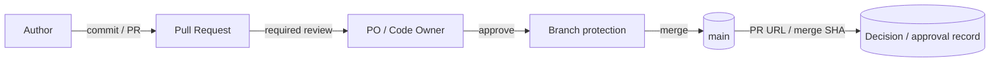
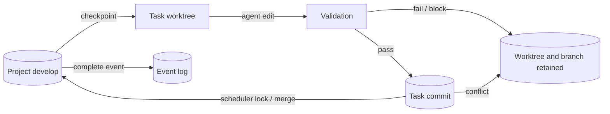
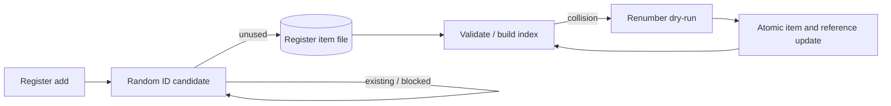
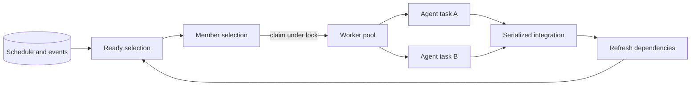
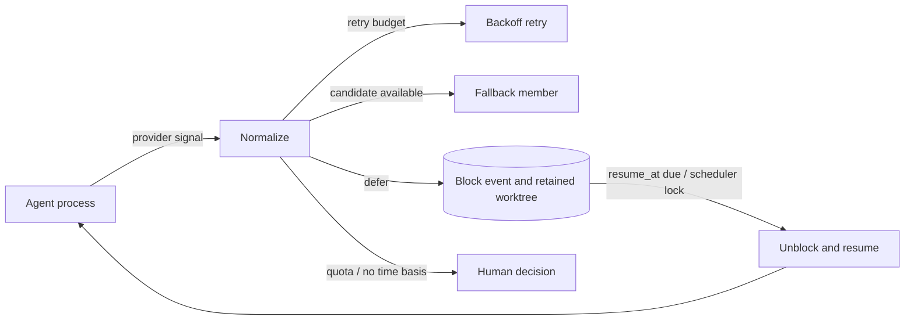

---
specdojo:
  id: sysd-critical-flows
  type: architecture
  status: draft
  rulebook: specdojo:sysd-critical-flows-rulebook
  part_of:
    - sysd-index
  based_on:
    - prj-0001:cdfd-task-execution
    - prj-0001:cdfd-register-lifecycle
    - prj-0001:cdfd-multi-project
---

# SpecDojo システム設計重要フロー

## 1. 概要（対象・運用方針）

順序、排他、再実行、監査または人間承認を誤ると成果物・task状態・参照整合性を損なうフローだけを最大5件で管理する。詳細実装はコード・設定・GitをSSOTとし、本書は境界、永続化点、失敗時保持、再開条件への導線を示す。

通常の単一task実行やprovider固有設定は対象外とする。フロー追加時は既存5件との統合・削減を先に判断する。

## 2. 重要フロー一覧（最大5件）

| Flow ID | フロー名                        | 事故論点                         | 優先度 | 備考                       |
| ------- | ------------------------------- | -------------------------------- | ------ | -------------------------- |
| scf-001 | PRによる留保事項承認とmain昇格  | 職務分離、監査、誤昇格           | High   | authorとapproverを分離     |
| scf-002 | task worktreeの分離・統合・保持 | 変更競合、部分統合、変更消失     | High   | merge前にcompleteしない    |
| scf-003 | register ID採番と衝突復旧       | 一意性、参照整合性、再実行       | High   | renumberは衝突救済に限定   |
| scf-004 | agent worker poolの並列実行     | 排他、順序、重複claim、可用性    | High   | task実行は並列、統合は直列 |
| scf-005 | provider利用制限からの延期再開  | 外部I/F障害、重複再開、無限retry | High   | 根拠のある時刻だけ自動再開 |

## 3. フロー詳細（IDごと）

### 3.1. scf-001: PRによる留保事項承認とmain昇格

- **目的**: PO留保事項と`develop`から`main`への昇格で、作成者と承認者を分離し、承認対象差分を追跡する。
- **トリガー**: 留保事項を含む変更またはproject昇格候補がレビュー可能になった。
- **範囲**: decision個票、対象成果物、PR review、branch protection、merge、証跡書き戻しを含む。通常のagent commitは含まない。

- **永続化点**: PR review、merge commit、decision個票または承認章のPR URL・承認者・merge SHA。
- **整合性・冪等・再実行**: 同じ差分の承認は最新commitを対象とし、新規commitで古い承認を無効化する。証跡書き戻しは同じPR URL / SHAを重複登録しない。
- **失敗時**: required reviewer、検証、未解決comment、証跡のいずれかが不足すればmergeしない。誤mergeは履歴を消さず、revertまたは後続是正で扱う。
- **観測性**: PR番号、author、approver、head SHA、merge SHA、検証結果、対象decision IDを記録する。
- **参照**: `cdfd-register-lifecycle`、Gitブランチ運用標準、登録簿運用ガイド、`PJR-0126`。

### 3.2. scf-002: task worktreeの分離・統合・保持

- **目的**: edit taskの変更を分離し、許可対象だけを検証・commit・直列統合してから完了させる。
- **トリガー**: worktree modeでedit taskをclaimする。
- **範囲**: checkpoint、branch / worktree作成、agent変更、検証、commit、merge、complete、cleanupを含む。worker選択はscf-004で扱う。

- **永続化点**: root checkpoint、task commit、task result、merge commit、append-only event。
- **整合性・冪等・再実行**: project修飾task IDからbranch / pathを一意に導出する。resumeは保持worktreeを再利用し、新規claimに残骸があれば所属を検証してから破棄または停止する。
- **失敗時**: setup失敗はclaimを戻す。検証失敗、commit対象外変更、merge conflict、blockではbranch / worktreeを保持し、自動で内容競合を解消しない。
- **観測性**: project ID、task ID、branch、worktree path、base SHA、commit SHA、merge結果、保持理由を記録する。
- **参照**: `cdfd-multi-project`、`sysd-cross-cutting-policy`の`scp-GIT-*`、worktree統合テスト。

### 3.3. scf-003: register ID採番と衝突復旧

- **目的**: 個票IDを同一言語・SpecDojo Unit内で一意にし、衝突時に個票・ファイル名・参照・実行記録を一貫して復旧する。
- **トリガー**: register item追加、または検証・派生生成・mergeでID衝突を検出する。
- **範囲**: 候補採番、既存ID・blocklist照合、個票作成、衝突検出、dry-run、renumber、参照更新を含む。

- **永続化点**: 個票frontmatterとファイル名が正本で、生成indexは派生物とする。renumber後のcommitが復旧境界となる。
- **整合性・冪等・再実行**: addは未使用候補が得られるまで再抽選する。renumberは未使用先、変更対象、参照元を全件検証してから一括更新し、途中失敗で部分適用しない。
- **失敗時**: 重複または命名不整合があればbuild・mergeを停止し、競合worktreeとcommitを保持する。生成indexを手で直して復旧しない。
- **観測性**: 旧ID、新ID、対象個票、更新したwikilink / target / plan / result、dry-run結果、検証結果を記録する。
- **参照**: `cdfd-register-lifecycle`の`P-02-09`、`cdfd-multi-project`の`E-02`、ID・ファイル命名標準。

### 3.4. scf-004: agent worker poolの並列実行

- **目的**: Ready taskを最大並列数まで安全に実行し、task終了ごとに依存関係を再計算して空き枠を補充する。
- **トリガー**: `exec run --auto`をparallel指定で開始する。
- **範囲**: Ready抽出、member選択、claim、provider別上限、agent実行、直列統合、refresh、次task投入を含む。worktree内部はscf-002で扱う。

- **永続化点**: claim / block / complete event、task result、agent evidence、統合commit。
- **整合性・冪等・再実行**: 最新eventをlock内で再読込して重複claimを防ぐ。同じmemberの活動中taskを考慮し、provider別parallel limitを超えない。
- **失敗時**: 一taskの失敗は該当taskをblockし、独立taskを継続する。統合はscheduler lockで直列化し、失敗後にReadyと依存を再計算する。
- **観測性**: round、worker slot、task、member、provider、claim時刻、終了種別、統合順、Ready再計算結果を記録する。
- **参照**: `cdfd-task-execution`、`sysd-cross-cutting-policy`の`scp-EXE-*` / `scp-SEL-001`、exec統合テスト。

### 3.5. scf-005: provider利用制限からの延期再開

- **目的**: providerの一時的制限を通常失敗と区別し、上限付きretry・fallback・延期・排他的な再開へ接続する。
- **トリガー**: agent CLIがprovider固有の利用制限または一時障害signalを返す。
- **範囲**: signal正規化、retry、fallback、block、resume時刻解決、due再開、再実行結果を含む。

- **永続化点**: raw provider signal、正規化kind、attempt数、resume_atとsource、block / unblock event、保持worktree。
- **整合性・冪等・再実行**: resumeは最新eventが対象blockのままである場合だけ一processが確保する。provider reset、retry-after、明示cooldown以外から時刻を推定しない。
- **失敗時**: retry上限到達はblockする。quota exhaustedと再開時刻不明は自動再開しない。再度制限された場合は新しいblock情報へ更新する。
- **観測性**: provider、signal kind、raw message要約、attempt、candidate、wait、resume source / time、再開結果を記録する。
- **参照**: `sysd-cross-cutting-policy`の`scp-RET-*`、`.specdojo/exec-defaults.yaml`、provider別子設計。

## 4. 観測性と運用連携

| Flow ID | 相関識別子                       | 監視・手動介入条件                           | 運用連携                    |
| ------- | -------------------------------- | -------------------------------------------- | --------------------------- |
| scf-001 | PR番号、decision ID、SHA         | 承認不足、検証失敗、証跡未転記               | PM / POへ差し戻し           |
| scf-002 | project ID、task ID、branch、SHA | merge conflict、未統合commit、dirty worktree | ARCが保持状態を確認         |
| scf-003 | old ID、new ID、item path        | 重複、部分更新、参照切れ                     | PM / ARCがrenumber判断      |
| scf-004 | task ID、member、round、slot     | 重複claim、provider上限超過、統合失敗        | runnerがblock、独立task継続 |
| scf-005 | task ID、provider、attempt       | retry枯渇、resume時刻不明、quota             | OPS / ARCが再開判断         |

すべてのフローで`flow_id`、対象ID、actor、timestamp、resultを追跡可能にする。コード上の内部trace IDがない場合は、task ID、PR番号、register item IDを相関キーとして用いる。

## 5. 関連ドキュメント導線（SDI/テスト/運用/DEC）

| Flow ID | SDI・一次情報                                     | テスト                    | 運用                  | DEC・判断記録 |
| ------- | ------------------------------------------------- | ------------------------- | --------------------- | ------------- |
| scf-001 | Git運用標準、register CDFD、`.github/`            | branch protection確認     | 登録簿運用ガイド      | `PJR-0126`    |
| scf-002 | `src/exec-worktree*.ts`、multi-project CDFD       | `exec-worktree*` test     | 障害対応OPR（未作成） | （なし）      |
| scf-003 | `src/register.ts`、register CDFD                  | register / doc-index test | 登録簿運用ガイド      | `PJR-37WN`    |
| scf-004 | `src/exec-run.ts`、task execution CDFD            | exec parallel test        | 障害対応OPR（未作成） | （なし）      |
| scf-005 | `.specdojo/exec-defaults.yaml`、`src/exec-run.ts` | limit / resume test       | 障害対応OPR（未作成） | （なし）      |
