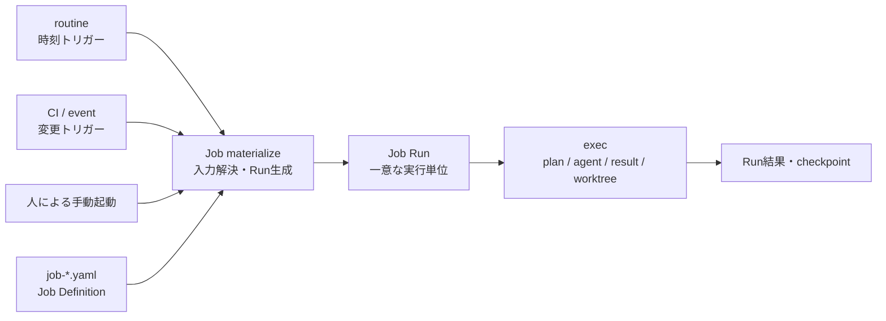

---
specdojo:
  id: sysd-job-execution
  type: project
  status: draft
  rulebook: specdojo:sysd-rulebook
---

# Job実行設計

週報作成や更新文書の翻訳など、同じ作業定義から実行単位を繰り返し生成するためのJob実行モデルを定義する。

本設計は将来機能の設計であり、現行CLIには未実装である。コマンド名、YAML、配置パスは実装時にschemaおよびコマンドリファレンスへ反映して確定する。

## 1. 目的と適用範囲

Scheduleは成果物を完成へ導く有限の依存グラフ、registerは課題・判断・計画外対応の台帳である。これらに対しJobは、入力を変えながら何度でも起動できる作業定義を扱う。

| 実行対象      | 主な用途                             | 単位の寿命                     | 状態の正本 |
| ------------- | ------------------------------------ | ------------------------------ | ---------- |
| Schedule task | 計画済み成果物の作成・レビュー・確定 | プロジェクト計画内で有限       | exec event |
| Register item | 課題・判断・計画外の単発対応         | 起票からcloseまで              | register   |
| Job           | 週次・月次・変更追随などの反復作業   | Job定義は継続し、Runは毎回有限 | Job Run    |
| Routine       | 時刻条件による起動                   | 定義が有効な間                 | 発火状態   |

Jobは新しいagent実行エンジンを持たない。Job Runをplanへ解決した後のagent選択、result、worktree、commit、排他、retryは既存の`exec`実行基盤を共用する。

次はJobの対象外とする。

- 成果物間の依存関係やクリティカルパスを持つ有限計画。Scheduleで扱う。
- 課題、リスク、判断、計画外対応の台帳管理。registerで扱う。
- 起動時刻そのものの管理。routineまたは外部CIが扱う。
- Job内での常駐監視。CLIは1回のRunを処理して終了する。

## 2. 概念モデル

Job DefinitionとJob Runを分離する。



### 2.1. Job Definition

Job Definitionは「毎回何をするか」を表す再利用可能なテンプレートである。少なくとも次を持つ。

| 項目                   | 内容                                                  |
| ---------------------- | ----------------------------------------------------- |
| `id`                   | `job-<slug>`形式の安定したJob ID                      |
| `name` / `description` | 作業の識別名と目的                                    |
| `task`                 | agentへ渡す指示、対象成果物、実行要件                 |
| `inputs`               | 必須入力、型、既定値                                  |
| `run.idempotency_key`  | 同じ論理実行を重複生成しないキー                      |
| `checkpoint`           | 前回成功時点を次回入力へ渡す規則。必要なJobだけが持つ |

Job Definitionはプロジェクトの`jobs_path`配下へ`job-<slug>.yaml`として配置し、ファイル名と`id`を一致させる案を基本とする。

### 2.2. Job Run

Job Runは、Job Definitionへ具体的な入力を束縛して生成した1回限りの実行単位である。Run生成時にテンプレートを解決し、その後にJob Definitionが変更されても実行内容を再現できるスナップショットを保持する。

Runには少なくとも次を記録する。

- `run_id`、`job_id`、`idempotency_key`
- 起動元、`scheduled_at`、生成時刻
- 解決済み入力と解決済みtask
- `queued` / `running` / `succeeded` / `failed` / `skipped` / `noop`の状態
- attempt、plan/result参照、対象commit
- 実行前checkpointと、成功時に確定する次checkpoint

同じ`idempotency_key`のRunが既に存在する場合は、新しいRunを作らない。失敗したRunの再実行は同じ`run_id`のattemptを増やし、論理上別の週報や翻訳処理として数えない。

## 3. 定義形式

次のYAMLは設計上の形を示す。未実装のため、現時点ではCLIへ渡せない。

```yaml
id: job-weekly-report
name: 週報作成
description: 対象週の実績を収集して週報を作成する。

inputs:
  period:
    type: string
    required: true

task:
  mode: edit
  owner: PM
  description: |
    対象期間の完了事項、進行中事項、課題、翌週予定を根拠とともにまとめる。
  targets:
    - pm-weekly-report

run:
  idempotency_key: "{{job_id}}:{{inputs.period}}"
```

`task`の実行要件はSchedule taskと同じ語彙を再利用する。`mode`、`owner`、`capabilities`、`proficiency`をJob固有の別概念として増やさず、plan生成後は同じmember選択処理へ渡す。

テンプレート式で参照できる値は、`job_id`、検証済み`inputs`、トリガーが渡した`scheduled_at`、読み取り専用の前回成功checkpointに限定する。任意コード実行や環境変数の無制限な展開は許可しない。

## 4. 起動と実行フロー

将来のCLI境界は次を基本案とする。

```bash
# 手動で1回起動する
specdojo exec run --job job-weekly-report --input period=2026-W32

# routineがdueなJobを起動する
specdojo routine run --project <project-id> --due
```

実行順序は次のとおりとする。

1. 起動元がJob ID、入力、予定時刻を渡す。
2. Job Definitionと入力schemaを検証する。
3. `idempotency_key`を解決し、既存Runとの重複を判定する。
4. Job Definition、入力、checkpointから解決済みtaskを生成し、Job Runへ保存する。
5. 解決済みtaskからexec plan/resultを生成し、既存exec基盤でagentを実行する。
6. 結果をRunへ反映する。
7. `succeeded`または設計上成功とみなす`noop`の場合だけcheckpointを原子的に更新する。

routineから起動する場合は、routineのactionにJobを指定する。

```yaml
id: rtn-weekly-report
name: 週報作成
enabled: true
trigger:
  cron: "0 17 * * 5"
  timezone: Asia/Tokyo
action:
  kind: job
  job: job-weekly-report
  inputs:
    period: "{{scheduled_at | iso_week}}"
policy:
  missed_run: latest
  overlap: skip
```

現行routineの`interval`は「前回実行からの経過時間」であり、毎週金曜日などの暦上の予定を表せない。Job連携時には`cron`と`timezone`を追加し、既存`interval`を後方互換として維持する。

cronのdue判定では、実際に処理を開始した`last_run`とは別に、最後に評価した実行枠を表す`last_scheduled_for`を保持する。次の実行枠は`scheduled_at`から計算し、処理時間や外部スケジューラの起動遅延によって毎週の基準時刻がずれないようにする。`missed_run`の対象範囲も、この実行枠のcursorから求める。

## 5. Runポリシー

### 5.1. 冪等性

冪等性の単位はroutineの`last_run`ではなくJob Runの`idempotency_key`とする。週報ではISO週、翻訳では原文revision範囲と対象言語をキーへ含める。これにより、外部スケジューラの重複起動や手動再実行で成果物を二重生成しない。

### 5.2. 取りこぼしと重複実行

routineはJobごとに次の方針を指定できるようにする。

| 方針         | 選択肢                      | 意味                                                        |
| ------------ | --------------------------- | ----------------------------------------------------------- |
| `missed_run` | `skip` / `latest` / `all`   | 停止期間中の実行枠を捨てる、最新だけ補う、すべて補う        |
| `overlap`    | `skip` / `queue` / `forbid` | 前回Run実行中の次回起動を無視、待ち行列化、設定エラーとする |

既定案は`missed_run: latest`、`overlap: skip`とする。週報のように各期間を必ず残す必要があるJobは`all`を明示する。

### 5.3. checkpoint

checkpointはRun開始時ではなく成功確定時に更新する。失敗時は前回成功値を維持し、次回またはretryで同じ範囲を再処理する。更新はRun結果と同じ排他境界で行い、「成果物更新済みだがcheckpoint未更新」などの不整合を検出可能にする。

## 6. ユースケース

### 6.1. 週報作成

週報は期間ごとに新しいRunを生成する。

- occurrence key: `2026-W32`などのISO週
- 入力: 期間の開始・終了、対象project
- 根拠: Schedule/execの完了実績、registerの状態変化、前回週報
- 出力: `reporting/weekly/<period>.md`など期間で一意な成果物
- 冪等性キー: `job-weekly-report:<period>`

同じ週の再実行は同じRunのretryとして扱い、別名の週報を増やさない。対象期間の計算はroutineのtimezoneを基準とし、CLI実行時のローカルtimezoneへ依存させない。

### 6.2. 更新文書の翻訳

翻訳Jobは、前回成功時点から現在までの原文差分を入力へ解決する。

```yaml
id: job-translate-updated-docs
name: 更新文書の翻訳

inputs:
  from_revision:
    type: string
    required: true
  to_revision:
    type: string
    required: true
  languages:
    type: list
    default: [en]

task:
  mode: edit
  owner: TR
  description: |
    revision範囲で追加・変更・改名・削除された原文を判定し、対応する翻訳を同期する。

run:
  idempotency_key: >-
    {{job_id}}:{{inputs.from_revision}}:{{inputs.to_revision}}:{{inputs.languages}}

checkpoint:
  read: last_success.to_revision
  advance_on: [succeeded, noop]
```

翻訳Jobは次の境界を守る。

- 差分は作業ツリーの曖昧な状態ではなく、確定した2つのrevision間で取得する。
- 追加・変更だけでなく、改名と削除も対象判定へ含める。
- 原文パスと翻訳先パスの対応規則を明示し、翻訳文の変更を再び原文変更として検出しない。
- 対象が0件でも`noop` Runを記録し、確認済み`to_revision`までcheckpointを進める。
- 一部言語だけ失敗した場合はRun全体を成功にせず、checkpointを進めない。

変更検知はroutineによる定期pollingだけでなく、main更新後のCIから同じJobを起動できる。トリガーが異なっても、同じrevision範囲と対象言語ならidempotency keyは一致する。

## 7. 保存領域と監査

プロジェクト直下へ次の領域を追加する案とする。

```text
projects/<prj-id>/
├─ jobs/
│  └─ job-<slug>.yaml             # Job Definition
└─ execution/
   └─ jobs/
      ├─ runs/                    # 解決済み入力・task・状態
      └─ generated/
         └─ job-state.json        # Job別checkpointの派生ビュー
```

Job DefinitionとRun履歴を正本とし、`job-state.json`は再構築可能な派生物とする。plan/resultは既存`execution/exec`配下を共用し、frontmatterの`origin`へ`job`、`job_id`、`run_id`を記録する。

Runの状態変更とattemptは上書きだけで失われない履歴として記録し、`job-state.json`はその履歴をfoldした最新状態とcheckpointを表示する。Run生成、重複判定、checkpoint確定はproject単位の排他境界内で行う。

認証情報、秘密鍵、翻訳サービスのtokenなどをJob Definition、入力、Runへ保存しない。外部サービスの資格情報は既存exec provider設定と実行環境から注入する。

## 8. 実装時の変更対象

本設計を実装する際は、少なくとも次を同時に更新する。

- Job Definition / Job Run / routine triggerのschema
- project configの`jobs_path`
- `exec run --job`とJob Runの状態管理
- routineの`action.kind: job`、`cron`、`timezone`、missed/overlap policy
- plan/result frontmatterの`origin: job`
- Job Definition、Run、checkpoint、重複起動、失敗・retryのテスト
- CLIコマンドリファレンス、exec/routine運用ガイド、ディレクトリ構成
