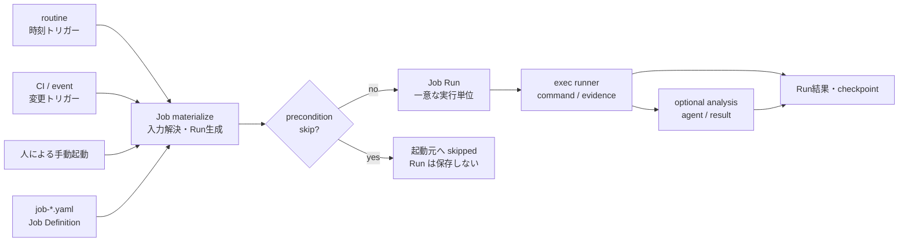

---
specdojo:
  id: sysd-job-execution
  type: architecture
  status: ready
  rulebook: specdojo:sysd-rulebook
  part_of:
    - sysd-index
---

# Job実行設計

週報作成や更新文書の翻訳など、同じ作業定義から実行単位を繰り返し生成するためのJob実行モデルを定義する。

本設計は`job-*.yaml`、`exec run --job`、routineの`action.kind: job`として実装されている。routine の action は Job 参照へ統一し、register sweep、Schedule auto、利用制限後の再開、exec cycle も command Job として扱う。Job Runは既存exec基盤を使ってin-place実行され、決定論的コマンドはrunnerが直接実行し、判断が必要な処理だけをagentへ委譲する。

## 1. 目的と適用範囲

Scheduleは成果物を完成へ導く有限の依存グラフ、registerは課題・判断・計画外対応の台帳である。これらに対しJobは、入力を変えながら何度でも起動できる作業定義を扱う。

| 実行対象      | 主な用途                             | 単位の寿命                     | 状態の正本 |
| ------------- | ------------------------------------ | ------------------------------ | ---------- |
| Schedule task | 計画済み成果物の作成・レビュー・確定 | プロジェクト計画内で有限       | exec event |
| Register item | 課題・判断・計画外の単発対応         | 起票からcloseまで              | register   |
| Job           | 週次・月次・変更追随などの反復作業   | Job定義は継続し、Runは毎回有限 | Job Run    |
| Routine       | 時刻条件による起動                   | 定義が有効な間                 | 発火状態   |

Jobは新しいagent実行エンジンを持たない。`edit` / `review` Jobとcommand後の任意のanalysisは既存の`exec`実行基盤を共用し、`command` Jobのコマンドは同じrunnerが直接実行する。

次はJobの対象外とする。

- 成果物間の依存関係やクリティカルパスを持つ有限計画。Scheduleで扱う。
- 課題、リスク、判断、計画外対応の台帳管理。registerで扱う。
- 起動時刻そのものの管理。routineまたは外部CIが扱う。
- Job内での常駐監視。CLIは1回のRunを処理して終了する。
- 決定論的な手順の実装。scriptまたはCLIで扱い、Jobは`task.command`から入口だけを呼ぶ。

### 1.1. 責務境界

Jobは「runnerが直接実行するコマンド」と「agentへ委譲する判断」を分離する。`task.description`へ決定論的な手順を自然言語で書くと、agentが手順を解釈し、実行の有無や引数の正しさがagent依存になる。手順はscriptまたはCLIへ実装して`task.command`から入口を1つ呼び、結果の判断が必要な場合だけ`task.analysis`を指定する。判定可能な規約は`job-definition-standard`をSSOTとする。

| 関心事                    | 担当                               |
| ------------------------- | ---------------------------------- |
| 起動時刻・実行枠          | routine / 外部スケジューラ         |
| runnerが実行する入口      | Job Definition `task.command`      |
| Run生成前の対象有無判定   | Job Definition `task.precondition` |
| agentへ委譲する判断の定義 | Job Definition `task.analysis`     |
| 決定論的な手順と繰り返し  | script / CLI                       |
| コマンド実行・evidence    | exec runner                        |
| agent実行・result・commit | exec実行基盤                       |

## 2. 概念モデル

Job DefinitionとJob Runを分離する。



### 2.1. Job Definition

Job Definitionは「毎回何をするか」を表す再利用可能なテンプレートである。少なくとも次を持つ。

| 項目                   | 内容                                                  |
| ---------------------- | ----------------------------------------------------- |
| `id`                   | `job-<slug>`形式の安定したJob ID                      |
| `name` / `description` | 作業の識別名と目的                                    |
| `task`                 | runnerコマンド、任意の事前判定、またはagentへ渡す指示 |
| `inputs`               | 必須入力、型、既定値、`enum`・整数範囲                |
| `run.idempotency_key`  | 同じ論理実行を重複生成しないキー                      |
| `checkpoint`           | 前回成功時点を次回入力へ渡す規則。必要なJobだけが持つ |

Job Definitionはプロジェクトの`jobs_path`配下へ`job-<slug>.yaml`として配置し、ファイル名と`id`を一致させる案を基本とする。

### 2.2. Job Run

Job Runは、Job Definitionへ具体的な入力を束縛して生成した1回限りの実行単位である。Run生成時にテンプレートを解決し、その後にJob Definitionが変更されても実行内容を再現できるスナップショットを保持する。

Runには少なくとも次を記録する。

- `run_id`、`job_id`、`idempotency_key`
- 起動元、`scheduled_at`、生成時刻
- 解決済み入力と解決済みtask
- `running` / `succeeded` / `failed` / `noop`の状態
- attempt、plan/result/evidence参照、コマンド終了コード、対象commit
- 実行前checkpointと、成功時に確定する次checkpoint

同じ`idempotency_key`のRunが既に存在する場合は、新しいRunを作らない。失敗したRunの再実行は同じ`run_id`のattemptを増やし、論理上別の週報や翻訳処理として数えない。

## 3. 定義形式

次のYAMLを`jobs_path`配下へ配置し、CLIから検証・実行する。

```yaml
id: job-weekly-report
name: 週報作成
description: 対象週の実績を収集して週報を作成する。

inputs:
  period:
    type: string
    required: true

task:
  mode: edit
  owner: PM
  agent:
    executor: claude-expert-executor
    reporter: claude-reporter
  description: |
    対象期間の完了事項、進行中事項、課題、翌週予定を根拠とともにまとめる。
  targets:
    - pr-progress-report

run:
  idempotency_key: "{{job_id}}:{{inputs.period}}"
```

`task`の実行要件はSchedule taskと同じ語彙を再利用する。`mode`、`owner`、`capabilities`、`proficiency`をJob固有の別概念として増やさず、plan生成後は同じmember選択処理へ渡す。

`task.agent`はJobが委譲するagentを`pm-members.yaml`のnicknameで直接指名する。`capabilities`による間接指定は、要求を満たすmemberが複数あると選択が実行時の優先度に依存し、Jobの定義から委譲先を読み取れない。さらにroster全体がstage_roleを持つpipeline memberである場合、stage_roleなしのmemberだけを対象とする自動選択では候補が0件になる。`reporter`を併記したRunはexecutor→reporterの2段で実行し、resultはreporterが書く。`reporter`を省略した場合は単一agent実行となり、そのagentがresultまで記入する。`exec run --by`は単一agent実行としての差し替え、`--executor-by` / `--reporter-by`は段ごとの差し替えとして、いずれも指名より優先する。

決定論的な処理は`task.mode: command`とし、入力を展開する`task.command`を必須にする。対象選択を伴う処理では任意の`task.precondition`をRun保存前に実行し、空出力または指定終了コードならJob Runと付随成果物を作らずskipする。runnerはmaterialize済みコマンドをPOSIX環境では`/bin/sh -eu`で直接実行し、コマンド、終了コード、標準出力、標準エラーをevidenceへ記録する。stdout / stderr はredact・上限付きログへの参照と、その参照先と同じbounded内容をevidence本体へ保持する。終了コードが0以外なら、その値からRunを直接`failed`と判定しagentは起動しない。結果の解釈が必要な場合だけ`task.analysis.agent`と`task.analysis.description`を指定し、成功時のcommand evidence本体をreporterへ渡す。これによりreporterは作業ツリーや参照先ログを追加で読むことなく出力を解釈できる。analysisを省略した場合はrunnerがresultを確定する。同じprojectの`specdojo exec`を子プロセスで呼ぶcommandでは、親runnerのproject実行lock tokenとowner tokenの一致を検証してlockを継承し、自己デッドロックを避けながら排他範囲を維持する。

テンプレート式で参照できる値は、`job_id`、`project_id`、現在のrunnerと同じCLI entryを表す`specdojo`、検証済み`inputs`、トリガーが渡した`scheduled_at`、読み取り専用の前回成功checkpointに限定する。Job Run IDの確定後に解決するtaskとcheckpointでは、これらに加えて`job_run_id`を参照できる。`run.idempotency_key`から`job_run_id`を参照すると循環するため許可しない。任意コード実行や環境変数の無制限な展開は許可しない。入力の`enum`はscalar値またはlistの各要素へ、integerの`minimum` / `maximum`は値域へ適用し、既定値と実行時入力を同じ規則で検証する。入れ子条件は検証可能なflat入力へ分解する。

## 4. 起動と実行フロー

CLI境界は次のとおりとする。

```bash
# 手動で1回起動する
specdojo exec run --job job-weekly-report --input period=2026-W32

# routineがdueなJobを起動する
specdojo routine run --project <project-id> --due
```

実行順序は次のとおりとする。

1. 起動元がJob ID、入力、予定時刻を渡す。
2. Job Definitionと入力schemaを検証する。
3. `idempotency_key`を解決してJob Run IDを確定し、既存Runとの重複を判定する。
4. Job Definition、Job Run ID、入力、checkpointから解決済みtaskを生成する。
5. 初回の command Job に precondition があれば実行する。skip 条件を満たした場合は Run を保存せず起動元へ `skipped` を返す。
6. skip でなければ解決済みtaskをJob Runへ保存する。
7. `edit` / `review`は既存exec基盤でagentを実行する。`command`はrunnerが解決済みコマンドを直接実行してevidenceを保存する。
8. commandが成功し`task.analysis`があれば、evidenceをreporter agentへ渡す。失敗時またはanalysisなしではagentを起動しない。
9. agent結果またはコマンド終了コードをRunへ反映する。
10. `succeeded`または設計上成功とみなす`noop`の場合だけcheckpointを原子的に更新する。

routineから起動する場合は、routineのactionにJobを指定する。

```yaml
id: rtn-weekly-report
name: 週報作成
enabled: true
trigger:
  cron: "0 17 * * 5"
  timezone: Asia/Tokyo
action:
  kind: job
  job: job-weekly-report
  inputs:
    period: "{{scheduled_at | iso_week}}"
policy:
  missed_run: latest
  overlap: skip
```

現行routineの`interval`は「前回実行からの経過時間」であり、毎週金曜日などの暦上の予定を表せない。Job連携時には`cron`と`timezone`を追加し、既存`interval`を後方互換として維持する。

cronのdue判定では、実際に処理を開始した`last_run`とは別に、最後に評価した実行枠を表す`last_scheduled_for`を保持する。次の実行枠は`scheduled_at`から計算し、処理時間や外部スケジューラの起動遅延によって毎週の基準時刻がずれないようにする。`missed_run`の対象範囲も、この実行枠のcursorから求める。

## 5. Runポリシー

### 5.1. 冪等性

冪等性の単位はroutineの`last_run`ではなくJob Runの`idempotency_key`とする。週報ではISO週、翻訳では原文revision範囲と対象言語をキーへ含める。実行枠ごとに処理するJobでは`scheduled_at`を含め、同じ実行枠の重複起動と失敗後のretryは同じJob Run、次の実行枠は別のJob Runとして扱う。手動起動で`--scheduled-at`を省略した場合は起動時刻が入るため、呼び出しごとに新しい実行枠になる。これにより、外部スケジューラの重複起動で成果物を二重生成せず、日次などの次回実行を前回の完了状態と混同しない。

scriptが中断再開用のキーを要求する場合は、入力の期間や`scheduled_at`を再加工せず、`task.command`から`{{job_run_id}}`を渡す。同じJob Runのretryでは同じ値になり、異なる実行枠では値が変わるため、スケジュール粒度と再開状態を分離できる。

### 5.2. 取りこぼしと重複実行

routineはJobごとに次の方針を指定できるようにする。

| 方針         | 選択肢           | 意味                                                         |
| ------------ | ---------------- | ------------------------------------------------------------ |
| `missed_run` | `latest` / `all` | 停止期間中の最新だけを補う、またはすべて補う                 |
| `overlap`    | `skip`           | 前回のexec実行中は待機せず、次の外部スケジューラ起動へ委ねる |

既定案は`missed_run: latest`、`overlap: skip`とする。週報のように各期間を必ず残す必要があるJobは`all`を明示する。

### 5.3. checkpoint

checkpointはRun開始時ではなく成功確定時に更新する。失敗時は前回成功値を維持し、次回またはretryで同じ範囲を再処理する。更新はRun結果と同じ排他境界で行い、「成果物更新済みだがcheckpoint未更新」などの不整合を検出可能にする。

## 6. ユースケース

### 6.1. 週報作成

週報は期間ごとに新しいRunを生成する。

- occurrence key: `2026-W32`などのISO週
- 入力: 期間の開始・終了、対象project
- 根拠: Schedule/execの完了実績、registerの状態変化、前回週報
- 出力: `reporting/weekly/<period>.md`など期間で一意な成果物
- 冪等性キー: `job-weekly-report:<period>`

同じ週の再実行は同じRunのretryとして扱い、別名の週報を増やさない。対象期間の計算はroutineのtimezoneを基準とし、CLI実行時のローカルtimezoneへ依存させない。

### 6.2. 更新文書の翻訳

翻訳Jobは、前回成功時点から現在までの原文差分を入力へ解決する。

```yaml
id: job-translate-updated-docs
name: 更新文書の翻訳

inputs:
  from_revision:
    type: string
    from_checkpoint: revision
    default: HEAD~1
    git_revision: true
  to_revision:
    type: string
    resolve: git_head
    git_revision: true
  languages:
    type: list
    default: [en]

task:
  mode: edit
  owner: TR
  description: |
    revision範囲で追加・変更・改名・削除された原文を判定し、対応する翻訳を同期する。
  paths:
    - docs/ja
    - docs/en

run:
  idempotency_key: >-
    {{job_id}}:{{inputs.from_revision}}:{{inputs.to_revision}}:{{inputs.languages}}

checkpoint:
  values:
    revision: "{{inputs.to_revision}}"
  advance_on: [succeeded, noop]
```

翻訳Jobは次の境界を守る。

- 差分は作業ツリーの曖昧な状態ではなく、確定した2つのrevision間で取得する。
- 追加・変更だけでなく、改名と削除も対象判定へ含める。
- 原文パスと翻訳先パスの対応規則を明示し、翻訳文の変更を再び原文変更として検出しない。
- 対象が0件でも`noop` Runを記録し、確認済み`to_revision`までcheckpointを進める。
- 一部言語だけ失敗した場合はRun全体を成功にせず、checkpointを進めない。

変更検知はroutineによる定期pollingだけでなく、main更新後のCIから同じJobを起動できる。トリガーが異なっても、同じrevision範囲と対象言語ならidempotency keyは一致する。

## 7. 保存領域と監査

プロジェクト直下へ次の領域を配置する。

```text
projects/<prj-id>/
├─ jobs/
│  └─ job-<slug>.yaml             # Job Definition
└─ execution/
   └─ jobs/
      ├─ runs/                    # 解決済み入力・task・状態
      └─ generated/
         └─ job-state.json        # Job別checkpointの派生ビュー
```

Job DefinitionとRun履歴を正本とし、`job-state.json`は再構築可能な派生物とする。plan/resultは既存`execution/exec`配下を共用し、frontmatterの`origin`へ`job`、`job_id`、`run_id`を記録する。command evidenceは`execution/exec/evidence/<run-id>/attempt-<n>/`へ置き、解決済みコマンド、終了コード、redact・上限付きのstdout/stderrログと、analysis受け渡し用の同一内容を保存する。

Runの状態変更とattemptは上書きだけで失われない履歴として記録し、`job-state.json`はその履歴をfoldした最新状態とcheckpointを表示する。Run生成、重複判定、checkpoint確定はproject単位の排他境界内で行う。

認証情報、秘密鍵、翻訳サービスのtokenなどをJob Definition、入力、Runへ保存しない。外部サービスの資格情報は既存exec provider設定と実行環境から注入する。

## 8. 現在の実装境界

- Job Runはin-place実行に対応する。`exec run --job --worktree`は未対応で、指定時にエラーとする。
- `task.agent`でexecutorとreporterを指名したJob Runは、register項目と同じexecutor/reporter pipelineで実行し、evidenceとpipeline stateを`exec/evidence/<taskId>/<runId>/`へ記録する。reporterだけが失敗したRunの`--resume`はregister経路のみが対応し、Jobでは次のattemptとして再実行する。
- `task.mode: command`はrunnerがin-placeで直接実行する。`task.analysis`を持つ場合だけ成功後にreporterを起動し、redact・上限付きstdout/stderrを含むevidence本体を渡す。commandまたはanalysisの失敗はRun全体をfailedにする。
- cronは5フィールド形式を扱い、数値、`*`、リスト、範囲、stepを受け付ける。
- `missed_run`は`latest`と`all`、`overlap`は`skip`に対応する。
- agentが変更不要と判断して正常終了したRunは現在`succeeded`として記録する。`noop`はデータモデルとcheckpoint規則に予約しているが、agent resultからの自動分類は未対応である。
- Job DefinitionとRunは`job validate`およびschemaで検証し、`job-state.json`はRun履歴から再導出できる派生物とする。
