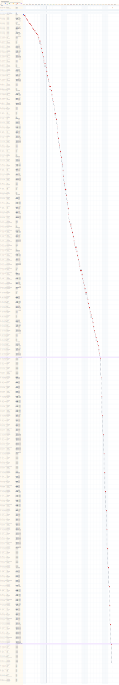

# タイムライン

## 進捗サマリー

- 判定: 遅れ気味
- 概況: 2026-06-13 時点の実績進捗は 5.2% 相当で、計画進捗 100.0% を下回っています。
- 主な要因: 完了・進行中件数が計画消化ペースに対して不足しています。

## 今後のアクション案

1. クリティカルパス上の進行中タスクを優先完了させてください。
2. 次の着手候補 T-LAUNCH-prj-overview-030 を前倒しで着手できるか確認してください。

- schedule_path: `docs/ja/projects/prj-0001/030-project-management/schedule`
- project_start_date: `2026-05-24`
- project_duration_days: `5.625`
- scope: `full_schedule`
- critical_path_task_count: `19`
- progress_percent: `5.2%`
- done_tasks: `4/77`
- task_state_counts: `todo=73, doing=0, blocked=0, done=4, cancelled=0`

