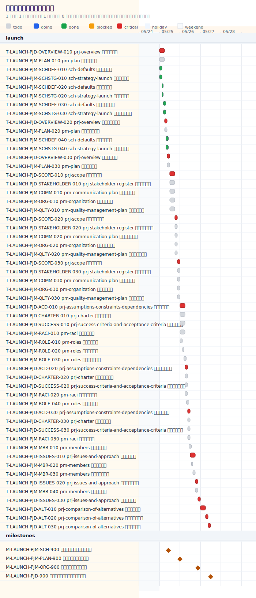

# タイムライン

## 進捗サマリー

- 判定: 開始前
- 概況: 2026-05-17 時点では計画開始日 2026-05-18 前です。
- 主な要因: 未着手でも計画上の遅れではなく、まだ実行開始タイミングに入っていません。

## 今後のアクション案

1. 開始日に着手できるように担当者と実行順序を最終確認してください。
2. 最初の着手候補 T-LAUNCH-PJD-OVERVIEW-010 に必要な入力・レビュー観点を事前に揃えてください。

- schedule_path: `docs/ja/projects/prj-0001/030-project-management/schedule`
- project_start_date: `2026-05-18`
- project_duration_days: `2.5`
- scope: `full_schedule`
- critical_path_task_count: `16`
- progress_percent: `0.0%`
- done_tasks: `0/59`
- task_state_counts: `todo=59, doing=0, blocked=0, done=0, cancelled=0`

