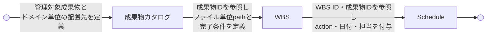

# 成果物カタログからスケジュールへの展開ガイド

SpecDojo Deliverables Catalog to Schedule Guide

SpecDojo における成果物カタログからスケジュールへの展開ルールとガイドラインを定義します。成果物カタログで定義した管理対象成果物を、WBS 定義で成果物パスと完了条件に展開し、Schedule 定義で実行計画に落とし込む一連の流れを示します。

各層の詳細なルールは、それぞれの rulebook を参照してください。

- 成果物カタログ: [dct-rulebook](../rulebooks/dct-rulebook.md)
- WBS: [wbs-rulebook](../rulebooks/wbs-rulebook.md)
- Schedule: [sch-rulebook](../rulebooks/sch-rulebook.md)

## 1. 基本方針

- **成果物カタログ** は「**何を管理対象とするか**」
- **WBS** は「**どの成果物をどこに作成・更新し、何を満たせば完了か**」
- **Schedule** は「**いつ・誰が・どの順で作業するか**」

を扱います。

## 2. 責務の違い

| 観点               | 成果物カタログ                   | WBS                            | Schedule               |
| ------------------ | -------------------------------- | ------------------------------ | ---------------------- |
| 主目的             | 成果物の論理定義                 | 成果物完了単位の定義           | 実行計画               |
| 問い               | 何を管理対象にするか             | 何がどこに完成すればよいか     | いつ誰が何をするか     |
| 単位               | 成果物                           | 成果物完了単位                 | 実行タスク             |
| 成果物ID           | 定義する                         | 参照する                       | 参照する               |
| 配置先・成果物パス | ドメイン単位の配置先を持つ       | ファイル単位の成果物パスを持つ | 原則持たない           |
| 完了条件           | 原則持たない                     | 持つ                           | 原則持たない           |
| action             | 持たない                         | 持たない                       | 持つ                   |
| 日付               | 持たない                         | 持たない                       | 持つ                   |
| 担当者             | 原則持たない                     | 持たない                       | 持つ                   |
| 依存関係           | 成果物間の根拠程度               | 成果物上の依存                 | 実行順序の依存         |
| status             | カタログ定義文書の状態として持つ | WBS定義文書の状態として持つ    | タスクの実行状態を持つ |

## 3. 定義の流れ

成果物カタログから Schedule への定義の流れは次の通りです。

