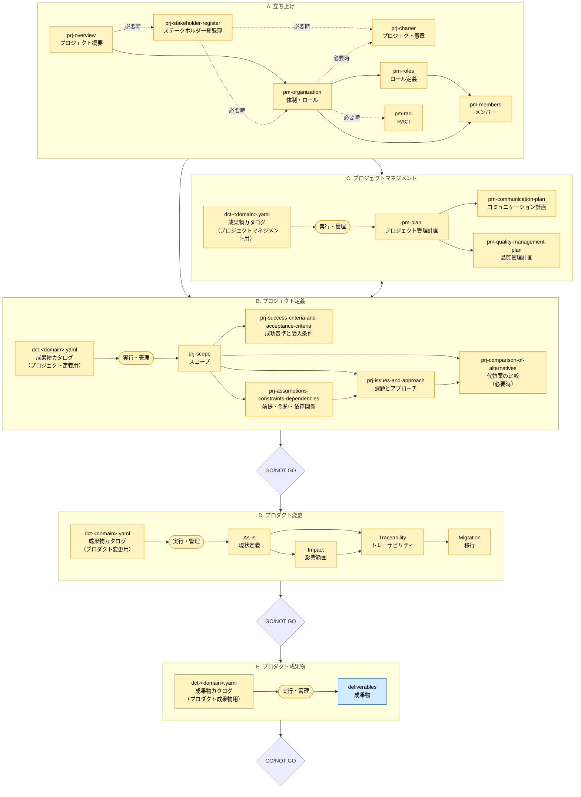
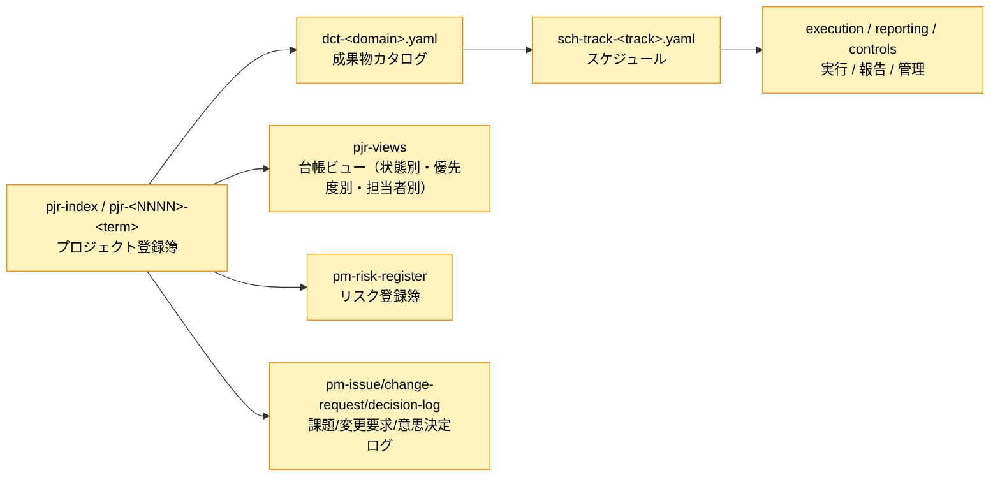

---
specdojo:
  id: docs-authoring-order-guide
  type: guide
  status: draft
---

# ドキュメント作成順ガイド

Document Authoring Order Guide

SpecDojoで扱うドキュメントの作成順・検討順について、以下のガイドラインを示します。
ドキュメントの分類・ディレクトリ構成については [ドキュメント構成ガイド](docs-structure-guide.md) を参照してください。

## 1. 作成順・検討順のガイドライン

> ここで示すドキュメントの関係は、作成順・検討順を表します。
> Frontmatter の `based_on` とは直接の関係はありません。
> Frontmatter の `based_on` は各文書を作成する際に直接根拠として参照した文書のみを記載するため、
> 本図の矢印と `based_on` が一致するわけではありません。

- 成果物カタログ（`dct-<domain>.yaml`）は、
  プロジェクトで管理対象とする成果物の単一の正本（SSOT）であり、各成果物の作成・更新・管理の起点となる。
  各類型（プロジェクト定義、プロジェクトマネジメント、プロダクト変更等）の成果物は、
  本カタログに登録された単位で管理されます。
- 成果物の類型は次の5つに大別されます。
  - A. 立ち上げ
  - B. プロジェクト定義
  - C. プロジェクトマネジメント
  - D. プロダクト変更
  - E. プロダクト成果物（更に詳細な類型に分類）
- 成果物の作成順は、`A → (C + B) → D → E` が基本になりますが、プロジェクトの状況に応じて柔軟に対応します。
  特に、`A. 立ち上げ`の成果物（概要・ステークホルダー・憲章）を起点として、
  `B. プロジェクト定義`（何を作るか）と `C. プロジェクトマネジメント`（どう進めるか）は並行して作成されることが多いです。
- 図中の成果物カタログ（`dct-<domain>.yaml`）は同一種類の正本文書を表し、各サブグラフでは当該類型に関する登録範囲を示しています。
- プロジェクトのGO/NOT GOの判断は、以下の３つのゲートを設けることを推奨します;
  1. **TO-BEの明確化（`A`, `B`, `C`が完了）**: 将来構想が固まった段階
  2. **TO-BEの実現性が明確化（`D`が完了）**: 将来構想と現状とのギャップと対応策が明確になった段階
  3. **負荷・期間が明確化（`E`が完了）**: 将来構想を実現するための負荷と工期が明確になった段階

## 2. 作成順・検討順の全体図

図中の色分けの意味は [ドキュメント構成ガイド](docs-structure-guide.md) の `凡例` を参照してください。

## 3. 実行・管理の流れ

`作成順・検討順の全体図`中の成果物カタログからプロジェクトドキュメントを作成する`実行・管理`の流れは以下になります。

