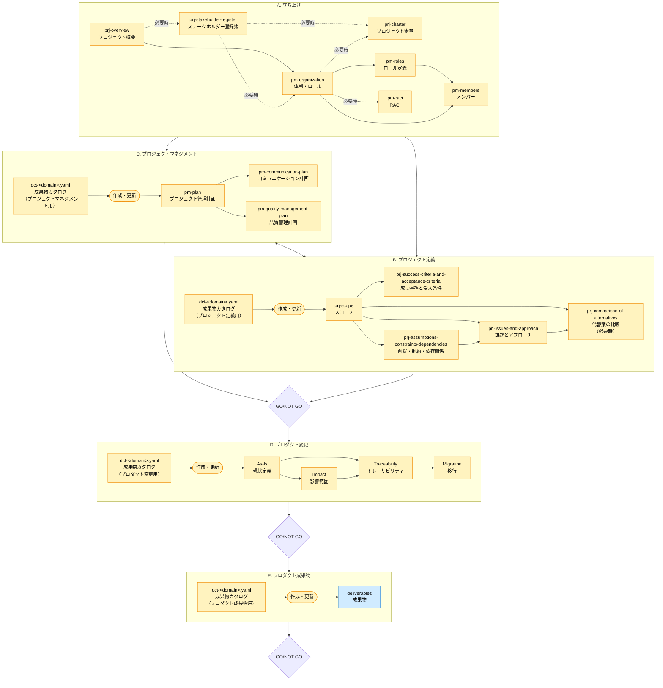

---
specdojo:
  id: docs-authoring-order-guide
  type: guide
  status: draft
---

# ドキュメント作成順ガイド

Document Authoring Order Guide

SpecDojoで扱う成果物の選定・検討順と、プロジェクト継続を判断する推奨ゲートについて、以下のガイドラインを示します。
本書が示す順序はプロジェクト計画のたたき台であり、実際の実行順を固定するものではありません。

**対象読者**

- プロジェクトで作成する成果物の検討順序と着手時期を設計するプロジェクト責任者、計画担当者、成果物作成者

**この文書で分かること**

- 成果物の計画上のグループ、基本的な選定・検討順、GO/NOT GO の判断点

**次に読む文書**

- 文書の分類・ディレクトリ構成は [ドキュメント構成ガイド](docs-structure-guide.md)、成果物ごとの目的は [成果物リファレンス](../references/specdojo-deliverables-reference.md) を参照してください。
- 選定した成果物を実行タスクへ展開する方法は [Schedule設計ガイド](specdojo-schedule-design-guide.md) を参照してください。

**この文書が扱わないこと**

- 要求・要件・仕様・設計・実装の定義
- プロダクトドキュメントとプロジェクトドキュメントの分類や配置
- Schedule 上の実行順、担当者、日付、反復

## 1. 作成順・検討順のガイドライン

- 本書の `A`〜`E` は、成果物を選定・検討するための計画上のグループです。要求・要件・仕様・設計・実装のフェーズや、ディレクトリの分類とは一致しません。
- 本書の矢印は標準的な検討の先行関係を表します。実際の実行順、並行作業、反復、担当者、日付は Schedule で定義します。
- 成果物カタログ（`dct-<domain>.yaml`）は、
  プロジェクトで管理対象とする成果物の単一の正本（SSOT）であり、各成果物の作成・更新・管理の起点となります。
  各類型（プロジェクト定義、プロジェクトマネジメント、プロダクト変更等）の成果物は、
  本カタログに登録された単位で管理されます。
- 成果物の類型は次の5つに大別されます。
  - LAUNCHトラック
    - A. 立ち上げ
    - B. プロジェクト定義
    - C. プロジェクトマネジメント
  - TO-BEトラック
  - AS-ISトラック
  -
  - D. プロダクト変更
  - E. プロダクト成果物（更に詳細な類型に分類）
- 成果物の検討順は、`A → (C + B) → D → E` が基本になりますが、プロジェクトの状況に応じて柔軟に対応します。
  特に、`A. 立ち上げ`の成果物（概要・ステークホルダー・憲章）を起点として、
  `B. プロジェクト定義`（何を作るか）と `C. プロジェクトマネジメント`（どう進めるか）は並行して作成されることが多いです。
- 図中の成果物カタログ（`dct-<domain>.yaml`）は同一種類の正本文書を表し、各サブグラフでは当該類型に関する登録範囲を示しています。
- プロジェクトのGO/NOT GOの判断は、以下の３つのゲートを設けることを推奨します;
  1. **TO-BEの明確化（`A`, `B`, `C`が完了）**: 将来構想が固まった段階
  2. **TO-BEの実現性が明確化（`D`が完了）**: 将来構想と現状とのギャップと対応策が明確になった段階
  3. **負荷・期間が明確化（`E`が完了）**: 将来構想を実現するための負荷と工期が明確になった段階

> ここで示すドキュメントの関係は、作成順・検討順を表します。
> Frontmatter の `based_on` とは直接の関係はありません。
> Frontmatter の `based_on` は各文書を作成する際に直接根拠として参照した文書のみを記載するため、
> 本図の矢印と `based_on` が一致するわけではありません。

## 2. 作成順・検討順の全体図

図中の色分けの意味は [ドキュメント構成ガイド](docs-structure-guide.md) の `凡例` を参照してください。

```mermaid
flowchart TB
  subgraph INIT["A. 立ち上げ"]
  direction LR
    OV["prj-overview<br/>プロジェクト概要"]
    SR["prj-stakeholder-register<br/>ステークホルダー登録簿"]
    CH["prj-charter<br/>プロジェクト憲章"]
    ORG["pm-organization<br/>体制・ロール"]
    RL["pm-roles<br/>ロール定義"]
    MEM["pm-members<br/>メンバー"]
    RAC["pm-raci<br/>RACI"]
    OV --> ORG
    OV -.必要時.-> SR -.必要時.-> CH
    ORG -.必要時.-> CH
    SR -.必要時.-> ORG --> RL --> MEM
    ORG --> MEM
    ORG -.必要時.-> RAC
  end


  subgraph PM["C. プロジェクトマネジメント"]
  direction LR
    PM_DC["dct-&lt;domain&gt;.yaml<br/>成果物カタログ<br/>（プロジェクトマネジメント用）"]
    PM_EXE(["作成・更新"])
    PL["pm-plan<br/>プロジェクト管理計画"]
    CP["pm-communication-plan<br/>コミュニケーション計画"]
    QMP["pm-quality-management-plan<br/>品質管理計画"]
    PM_DC --> PM_EXE --> PL
    PL --> CP
    PL --> QMP
  end

  subgraph PD["B. プロジェクト定義"]
  direction LR
    PD_DC["dct-&lt;domain&gt;.yaml<br/>成果物カタログ<br/>（プロジェクト定義用）"]
    PD_EXE(["作成・更新"])
    PS["prj-scope<br/>スコープ"]
    SC_AC["prj-success-criteria-and-acceptance-criteria<br/>成功基準と受入条件"]
    ACD["prj-assumptions-constraints-dependencies<br/>前提・制約・依存関係"]
    IA["prj-issues-and-approach<br/>課題とアプローチ"]
    CA["prj-comparison-of-alternatives<br/>代替案の比較<br/>（必要時）"]
    PD_DC --> PD_EXE --> PS
    PS --> SC_AC
    PS --> ACD
    PS --> IA
    PS --> CA
    ACD --> IA
    IA --> CA
  end

  GT1{"GO/NOT GO"}
  PM --> GT1
  PD --> GT1 --> PC

  subgraph PC["D. プロダクト変更"]
  direction LR
    PC_DC["dct-&lt;domain&gt;.yaml<br/>成果物カタログ<br/>（プロダクト変更用）"]
    PC_EXE(["作成・更新"])
    AS_IS["As-Is<br/>現状定義"]
    IMP["Impact<br/>影響範囲"]
    TRC["Traceability<br/>トレーサビリティ"]
    MIG["Migration<br/>移行"]
    PC_DC --> PC_EXE --> AS_IS
    AS_IS --> IMP
    AS_IS --> TRC
    IMP --> TRC
    TRC --> MIG
  end

  GT2{"GO/NOT GO"}
  PC --> GT2 --> DEL

  subgraph DEL["E. プロダクト成果物"]
  direction LR
    DEL_DC["dct-&lt;domain&gt;.yaml<br/>成果物カタログ<br/>（プロダクト成果物用）"]
    DEL_EXE(["作成・更新"])
    DE["deliverables<br/>成果物"]
    DEL_DC --> DEL_EXE --> DE
  end

  INIT --> PM
  INIT --> PD
  PM <--> PD

  classDef projectWise fill:#fff3bf,stroke:#f08c00,color:#000;
  classDef productSpec fill:#d0ebff,stroke:#1c7ed6,color:#000;

  class OV,SR,CH,ORG,MEM,RAC,RL projectWise;
  class PM_DC,PM_EXE,PL,CP,QMP projectWise;
  class PD_DC,PD_EXE,PS,SC_AC,ACD,IA,CA projectWise;
  class PC_DC,PC_EXE,AS_IS,IMP,TRC,MIG projectWise;
  class DEL_DC,DEL_EXE projectWise;
  class DE productSpec;

  GT3{"GO/NOT GO"}
  DEL --> GT3


```

## 3. 成果物計画から実行計画への引き継ぎ

本書で成果物を選定・検討した後、管理対象と完了条件を成果物カタログに定義し、実際の作業を Schedule に展開します。

| 層             | 答える問い                               | 正本                |
| -------------- | ---------------------------------------- | ------------------- |
| 本書           | どの成果物を、どのような順序で検討するか | 本書のガイドライン  |
| 成果物カタログ | 何を、どこに作成し、何を満たせば完了か   | `dct-<domain>.yaml` |
| Schedule       | いつ、誰が、どの順で実行するか           | `sch-*.yaml`        |

成果物カタログから Schedule への展開、依存関係、反復、ゲートの具体的な設計は
[Schedule設計ガイド](specdojo-schedule-design-guide.md) を参照してください。
