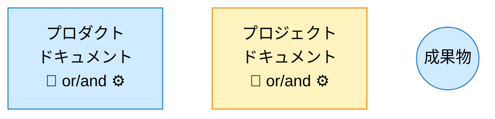
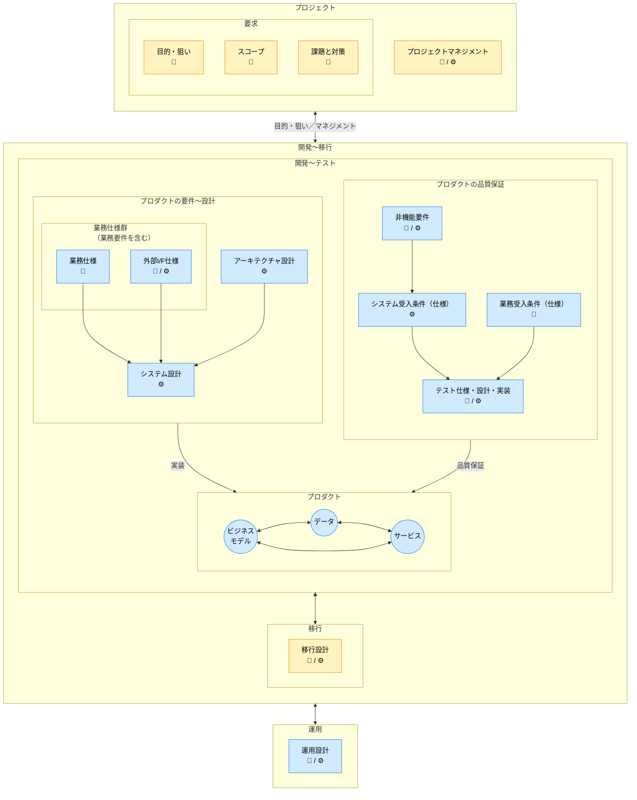
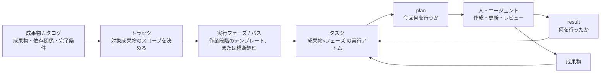

---
specdojo:
  id: docs-structure-guide
  type: guide
  status: ready
---

# ドキュメント構成ガイド

Document Structure Guide

SpecDojoで扱うドキュメントの全体構成について、以下のガイドラインを示します。
本書は、文書の分類、ライフサイクル、論理的な関係、配置を扱います。

**対象読者**

- SpecDojo を導入し、プロダクト文書とプロジェクト文書の配置を設計する利用者、リポジトリ管理者

**この文書で分かること**

- SpecDojo Unit、文書分類、ドキュメントオーナー、命名方針、標準ディレクトリ構成の考え方
- 成果物と実践体系（philosophy / standard / rulebook / recipe / sample / template）の関係
- 成果物カタログ（dct）・Schedule（sch）・実行管理（exec）の関係

**次に読む文書**

- 要求・要件・仕様・設計・実装の違いは [要求から実装までの考え方](../philosophy/needs-to-implementation-philosophy.md) を参照してください。
- トラックの構成と実行順序は [トラック設計ガイド](track-design-guide.md)、各成果物の目的は [成果物リファレンス](../references/deliverables-reference.md) を参照してください。
- ファイル単位の完全なディレクトリ構成は [ディレクトリレイアウトリファレンス](../references/directory-layout-reference.md) を参照してください。

**この文書が扱わないこと**

- 要求・要件・仕様・設計・実装の定義そのもの
- プロジェクトで成果物を選定・検討する順序や GO/NOT GO の判断
- Schedule 上の詳細な実行順序・担当者・日付・反復（構造的な関係ではなく運用の詳細は [Schedule設計ガイド](schedule-design-guide.md) / [Schedule実行運用ガイド](schedule-operation-guide.md) を参照）

本書の分類と構成は、文書の管理単位と配置を表します。開発工程や成果物の作成順を表すものではありません。

目的に応じて、最初から全章を読む必要はありません。

| 確認したいこと                    | 読む章                                                                            |
| --------------------------------- | --------------------------------------------------------------------------------- |
| 文書の分類と責任の考え方          | `SpecDojoで扱うドキュメントの全体構成`〜`ドキュメントオーナー`                    |
| 成果物・DCT・Schedule・execの関係 | `成果物と実践体系の関係`〜`成果物カタログ・Schedule・実行管理の関係`              |
| ディレクトリの命名・構成方針      | `ディレクトリ・ファイルの命名ルール` 以降                                         |
| ファイル単位の完全な配置一覧      | [ディレクトリレイアウトリファレンス](../references/directory-layout-reference.md) |

## 1. SpecDojoで扱うドキュメントの全体構成

- SpecDojo は、1つの SpecDojo Unit で1つのプロダクト文脈を扱うことを基本とします。SpecDojo Unit とは、プロダクトドキュメントとプロジェクトドキュメントを含む1つの `docs/` ルートを指します。
- 1つの SpecDojo Unit には、対象プロダクトを構築・改修するための複数のプロジェクトが存在します。プロジェクトごとにプロジェクトドキュメントを作成します。
- 1つのリポジトリで複数プロダクトを扱う場合は、プロダクトごとに `docs/` ルートを分け、それぞれを独立した SpecDojo Unit として扱います。
- 成果物IDは、原則として SpecDojo Unit 内で一意にします。複数の SpecDojo Unit を横断して扱う場合は、必要に応じて Unit ID と成果物IDの組み合わせで識別します。

## 2. ドキュメントの分類

ドキュメントは、プロダクトドキュメントとプロジェクトドキュメントの2種類に分類されます。

### 2.1. プロダクトドキュメント

**プロダクトの最新状況を説明するドキュメントです**。

プロダクトを新規に構築する際に作成されて、プロダクトを改修する毎に更新されます。プロダクトの、

- 要件〜設計に関する定義
- 品質保証に関する定義

について記載します。プロダクトのライフサイクルにわたって管理されます。

プロダクトドキュメントは、

- 常に「現在の正」を表します。
- プロジェクト固有の判断や経緯は含めず、必要な場合はプロジェクトドキュメントから反映されます。
- ドキュメントの改定履歴はバージョン管理システムで管理します。

### 2.2. プロジェクトドキュメント

**プロダクトの構築時や改修時に、プロジェクト毎に作成されるドキュメントです**。

個別プロジェクト毎の、

- 業務要求: 目的・狙い、スコープ、課題と対策
- 現状、導入・変更の影響、移行計画
- プロジェクトマネジメント

について記載します。プロジェクト完了後はアーカイブされます。

## 3. ドキュメントオーナー

次の記号は、構成図で成果物の主な判断観点を簡潔に示すための分類です。Scheduleや `pm-roles.yaml` で使用する Role code ではありません。

| オーナー         | 記号 | 略称 | 役割                       |
| ---------------- | ---- | ---- | -------------------------- |
| ビジネスオーナー | 🧭   | BO   | 最終的な価値判断の主体     |
| エンジニア       | ⚙️   | EN   | 技術的実現と品質判断の主体 |

実際の責任は Role code で定義します。🧭 は主に `PO` / `BA`、⚙️ は主に `ARC` / `DEV` / `QE` に対応しますが、プロジェクトごとの責務分担を正とします。Role、Member、Task owner の定義は [人と組織の定義標準](../standards/people-and-organization-definition-standard.md) を参照してください。

## 4. ドキュメントの構成

### 4.1. 凡例



### 4.2. ドキュメント構成図

次の図は文書群の包含関係と論理的な関係を示します。矢印は、成果物の作成順や Schedule 上の依存関係を表すものではありません。



※補足事項

- 図中のアーキテクチャ設計は、個別仕様に先立つ全体構造の設計を表します。
- 「業務要件を含む」とは、業務仕様の冒頭に業務要件相当（対象範囲・成功条件・制約等）を含めることを指します。

## 5. 成果物と実践体系の関係

成果物と、その作成を支援する実践体系（philosophy / standard / rulebook / recipe / template / sample / guide / reference）の関係、各種別の役割、成果物への紐付け方（解決の仕組み）は [実践体系構成ガイド](practice-system-composition-guide.md) を正本とします。`approach` に応じた rulebook / recipe / sample / template の参照方針は [実践の型活用ガイド](kata-guide.md) を参照してください。

## 6. 成果物カタログ・Schedule・実行管理の関係

成果物とその実行管理は、次の2つの軸で整理できます。

```text
[内容分類軸]（時間を含まない・静的）
  ドメイン（成果物の領域毎のまとまり）
    └─ 成果物 ──(概念体系: 要求/要件/仕様/設計/実装)

[実行管理軸]（時間・順序を含む・動的）
  スケジュール
    └─ トラック（対象成果物スコープを決める）
        └─ 実行フェーズ / パス（作業段階のテンプレート、または横断処理）
            └─ タスク（成果物×フェーズ の実行アトム）
```

内容分類軸は成果物の性質を表す静的な分類で、実行順序を固定しません。実行管理軸は、成果物をいつ・どの単位でまとめて進めるかを表す動的な管理構造です。要求・要件・仕様・設計・実装の違いは [要求から実装までの考え方](../philosophy/needs-to-implementation-philosophy.md) を参照してください。

### 6.1. dct・sch・execの対応

| 情報                | 主な役割                                                             | 担当ファイル                                           |
| ------------------- | -------------------------------------------------------------------- | ------------------------------------------------------ |
| 成果物カタログ      | 管理する成果物、配置、依存関係、完了条件を定義する                   | `dct-<domain>.yaml`                                    |
| トラック            | 対象成果物のスコープを決め、実行系列としてまとめる                   | `sch-track-<track>.yaml` / `sch-strategy-<track>.yaml` |
| 実行フェーズ / パス | 成果物ごと、または成果物群を横断して適用する作業段階を定義する       | `sch-strategy-<track>.yaml`                            |
| タスク              | 成果物×フェーズ から生成される実行アトム。担当・期限・依存関係を持つ | `sch-track-<track>.yaml`（生成物）                     |
| plan                | 一回の作業で確認・変更する対象と手順を示す                           | `execution/exec/plans/`                                |
| result              | 実施内容、確認結果、残課題を記録する                                 | `execution/exec/results/`                              |
| 実行イベント        | claim / complete / block などの実行履歴を表す                        | `execution/exec/events/`                               |
| 実行生成物          | Ready、状態スナップショット、クリティカルパスなどを表す              | `execution/generated/`                                 |

### 6.2. 展開の流れ



成果物カタログと Schedule の関係、タスク設計は [Schedule設計ガイド](schedule-design-guide.md)、schedule実行の運用は [Schedule実行運用ガイド](schedule-operation-guide.md)、plan と result の管理は [plan/resultライフサイクルガイド](plan-result-lifecycle-guide.md) を参照してください。

## 7. ディレクトリ・ファイルの命名ルール

ディレクトリ名とファイル名については、frontmatterで定義されたidと対応させることを推奨します。
idと対応させない場合（日本語名称を使用する場合等）は、一貫性を保った命名規約を採用してください。

ディレクトリ名のプレフィックス番号の有無は、成果物カタログの管理対象かどうかではなく、ディレクトリが何を収めるかで決めます。

- `NNN-` 番号あり: 改訂しながら育てる計画・設計文書等のツリー。読む順序に意味があり、番号で表します（例: `020-project-definition/`）。
- 番号なし: プロジェクトやプロダクト全体を横断する台帳・記録・実行状態。件数が時系列で増え、読む順序を持たず、`.specdojo/specdojo.config.json` からパスで直接参照されます（例: `controls/`、`execution/`）。

## 8. プロジェクトドキュメントの構成

### 8.1. ディレクトリ階層の構成方針

プロジェクト毎にプロジェクトidを付与し、`projects/<prj-id>/`以下にドキュメントを格納します。

#### 8.1.1. ドメインドキュメント

- ドキュメントは分類（ドメイン）毎にディレクトリを分けます。
- ドメイン内をさらにサブディレクトリへ分けるかは、その中でさらに階層が生えるか、
  件数が増え続けるかで決めます。現状、影響調査、移行計画はそれぞれ独立した成果物カタログとトラックを持つため、
  `040-current-state/`、`050-impact-analysis/`、`060-migration-planning/` としてトップレベルに分けます。
- 一方 `030-project-management/` のように成果物が固定数で階層も生えない場合は、
  `020-project-definition/` と同じくフラットに置きます。文書の並びは `dct-<domain>.yaml` の
  group が宣言するため、group ごとにディレクトリを切る必要はありません（複数 group が
  同じ `base_path` を共有できます）。

#### 8.1.2. 横断ドキュメント

- 横断ディレクトリは特定ドメインの配下に置かず、プロジェクト直下に置きます。
  `controls/project-register/` の登録項目や `execution/exec/plans/` の実行プランは、
  プロジェクト定義・プロダクト変更を含む全ドメインの成果物を対象とするためです。
- これらが成果物カタログの管理対象かどうかは配置とは独立で、
  どのドメインに分類するかは各 `dct-<domain>.yaml` の `domain` が決めます。
  例えば `controls/`、`schedule/`、`reporting/` は `dct-project-management.yaml`
  （`domain: project-management`）が管理し、`routines/` と `controls/reviews/` は
  CLI の入出力領域なのでカタログ管理対象外です。

### 8.2. ディレクトリ構成の概観

プロジェクトドキュメントは `projects/<prj-id>/` 配下に、ドメイン（`NNN-` 番号あり）と横断領域（番号なし）を並べます。トップ階層は次のとおりです。

```text
projects/<prj-id>/
├── 010-deliverables-catalog/   # 成果物カタログ（dct-*.yaml と索引）
├── 020-project-definition/     # プロジェクト定義（prj-*.md）
├── 030-project-management/     # プロジェクトマネジメント（pm-*）
├── 040-current-state/          # 現状（必要なプロダクト成果物のスナップショット）
├── 050-impact-analysis/        # 導入・変更の影響調査
├── 060-migration-planning/     # 移行計画・設計・切替計画
├── ...                         # 070- 以降の成果物ドメイン
├── controls/                   # 管理台帳・派生ビュー（登録簿・レビュー結果）
├── schedule/                   # Schedule（sch-*.yaml）
├── routines/                   # 定期実行ルーチン（rtn-*.yaml）
├── execution/                  # 実行管理（plans / results / events / generated）
└── reporting/                  # レポート（進捗報告・議事録）
```

ファイル単位の完全なツリーは [ディレクトリレイアウトリファレンス](../references/directory-layout-reference.md) の `プロジェクトドキュメントの構成` を参照してください。

## 9. プロダクトドキュメントの構成

### 9.1. ディレクトリ構成の概観

プロダクトドキュメントは `product/` 配下に、要件〜設計・品質保証・運用のドメインを `NNN-` 番号付きで並べます。トップ階層は次のとおりです。

```text
product/
├── 010-business-specs/               # 業務仕様（データ / 業務モデル / 画面・帳票 / 共通）
├── 020-external-interface-specs/     # 外部I/F仕様（ifx-*.yaml）
├── 030-architecture/                 # アーキテクチャ（C4・インフラ）
├── 040-system-design/                # システム設計
├── 050-business-acceptance-criteria/ # 業務受入条件
├── 060-non-functional-requirements/  # 非機能要件
├── 070-system-acceptance-criteria/   # システム受入条件
├── 080-test-specs/                   # テスト仕様（単体〜受入カタログ）
└── 090-operations/                   # 運用（方針・設計・手順）
```

ファイル単位の完全なツリーは [ディレクトリレイアウトリファレンス](../references/directory-layout-reference.md) の `プロダクトドキュメントの構成` を参照してください。
