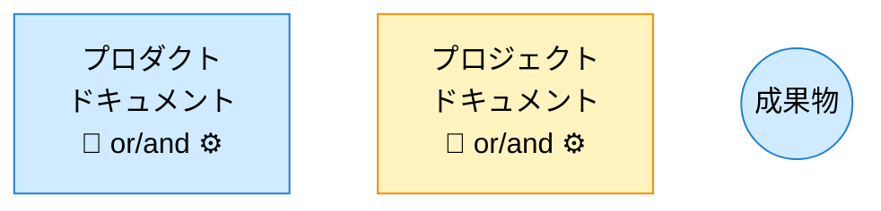
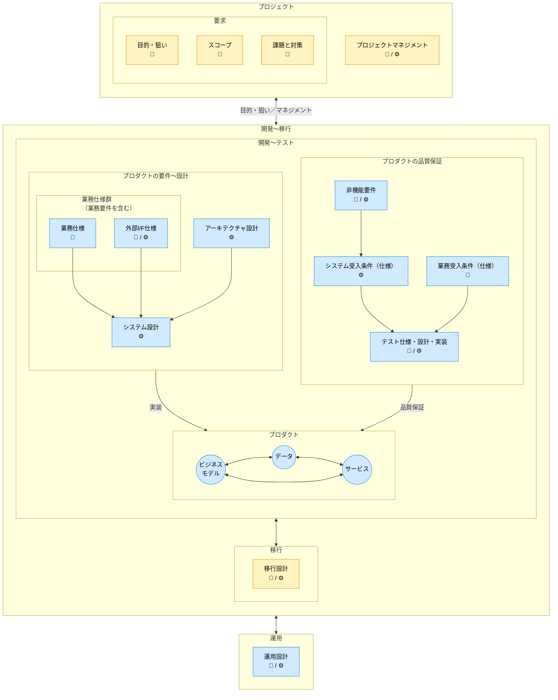
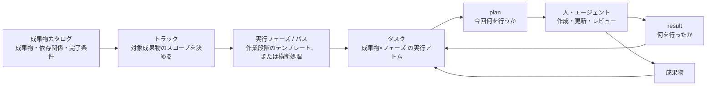

---
specdojo:
  id: specdojo:docs-structure-guide
  type: guide
  status: ready
---

# ドキュメント構成ガイド

Document Structure Guide

SpecDojoで扱うドキュメントの全体構成について、以下のガイドラインを示します。
本書は、文書の分類、ライフサイクル、論理的な関係、配置を扱います。

**対象読者**

- SpecDojo を導入し、プロダクト文書とプロジェクト文書の配置を設計する利用者、リポジトリ管理者

**この文書で分かること**

- SpecDojo Unit、文書分類、ドキュメントオーナー、命名方針、標準ディレクトリ構成の考え方
- 成果物と実践体系（philosophy / standard / rulebook / recipe / sample / template）の関係
- 成果物カタログ（dct）・Schedule（sch）・実行管理（exec）の関係

**次に読む文書**

- 要求・要件・仕様・設計・実装の違いは [要求から実装までの考え方](../philosophy/needs-to-implementation-philosophy.md) を参照してください。
- トラックの構成と実行順序は [トラック設計ガイド](track-design-guide.md)、各成果物の目的は [成果物リファレンス](../references/deliverables-reference.md) を参照してください。
- ファイル単位の完全なディレクトリ構成は [ディレクトリレイアウトリファレンス](../references/directory-layout-reference.md) を参照してください。

**この文書が扱わないこと**

- 要求・要件・仕様・設計・実装の定義そのもの
- プロジェクトで成果物を選定・検討する順序や GO/NOT GO の判断
- Schedule 上の詳細な実行順序・担当者・日付・反復（構造的な関係ではなく運用の詳細は [Schedule設計ガイド](schedule-design-guide.md) / [Schedule実行運用ガイド](schedule-operation-guide.md) を参照）

本書の分類と構成は、文書の管理単位と配置を表します。開発工程や成果物の作成順を表すものではありません。

目的に応じて、最初から全章を読む必要はありません。

| 確認したいこと                    | 読む章                                                                            |
| --------------------------------- | --------------------------------------------------------------------------------- |
| 文書の分類と責任の考え方          | `SpecDojoで扱うドキュメントの全体構成`〜`ドキュメントオーナー`                    |
| 成果物・DCT・Schedule・execの関係 | `成果物と実践体系の関係`〜`成果物カタログ・Schedule・実行管理の関係`              |
| ディレクトリの命名・構成方針      | `ディレクトリ・ファイルの命名ルール` 以降                                         |
| プロダクトと別リポジトリで運用    | `別リポジトリ構成（Detached Unit）`                                               |
| ファイル単位の完全な配置一覧      | [ディレクトリレイアウトリファレンス](../references/directory-layout-reference.md) |

## 1. SpecDojoで扱うドキュメントの全体構成

- SpecDojo は、1つの SpecDojo Unit で1つのプロダクト文脈を扱うことを基本とします。SpecDojo Unit とは、プロダクトドキュメント、プロジェクトドキュメント、実践体系をまとめて扱う論理的な管理境界です。
- 1つの SpecDojo Unit には、対象プロダクトを構築・改修するための複数のプロジェクトが存在します。プロジェクトごとにプロジェクトドキュメントを作成します。
- 既定の Detached Unit では、プロダクトドキュメントをプロダクトリポジトリへ、プロジェクトドキュメントと実践体系を SpecDojo 専用リポジトリへ置きます。Attached Unit では、これらを1つのリポジトリの `docs/` ルートに置きます。
- 1つのリポジトリで複数プロダクトを扱う場合は、プロダクトごとに文書の管理境界を分け、それぞれを独立した SpecDojo Unit として扱います。
- 成果物IDは、原則として SpecDojo Unit 内で一意にします。複数の SpecDojo Unit を横断して扱う場合は、必要に応じて Unit ID と成果物IDの組み合わせで識別します。

### 1.1. 構成の選び方

利用プロジェクトでは、SpecDojo の成果物更新、登録簿の状態遷移、exec の実行記録をプロダクトの Git 履歴から分離する **Detached Unit を既定**とします。成果物と実装が同じ変更で動き、履歴も一体として扱う必要がある場合に限り、同一リポジトリの Attached Unit を選びます。CLI はどちらの構成も許容し、この選択を強制しません。

Detached Unit の配置と現行実装の制約は `別リポジトリ構成（Detached Unit）` を参照してください。

## 2. ドキュメントの分類

ドキュメントは、プロダクトドキュメントとプロジェクトドキュメントの2種類に分類されます。

### 2.1. プロダクトドキュメント

**プロダクトの最新状況を説明するドキュメントです**。

プロダクトを新規に構築する際に作成されて、プロダクトを改修する毎に更新されます。プロダクトの、

- 要件〜設計に関する定義
- 品質保証に関する定義

について記載します。プロダクトのライフサイクルにわたって管理されます。

プロダクトドキュメントは、

- 常に「現在の正」を表します。
- プロジェクト固有の判断や経緯は含めず、必要な場合はプロジェクトドキュメントから反映されます。
- ドキュメントの改定履歴はバージョン管理システムで管理します。

### 2.2. プロジェクトドキュメント

**プロダクトの構築時や改修時に、プロジェクト毎に作成されるドキュメントです**。

個別プロジェクト毎の、

- 業務要求: 目的・狙い、スコープ、課題と対策
- 現状、導入・変更の影響、移行計画
- プロジェクトマネジメント

について記載します。プロジェクト完了後はアーカイブされます。

## 3. ドキュメントオーナー

次の記号は、構成図で成果物の主な判断観点を簡潔に示すための分類です。Scheduleや `pm-roles.yaml` で使用する Role code ではありません。

| オーナー         | 記号 | 略称 | 役割                       |
| ---------------- | ---- | ---- | -------------------------- |
| ビジネスオーナー | 🧭   | BO   | 最終的な価値判断の主体     |
| エンジニア       | ⚙️   | EN   | 技術的実現と品質判断の主体 |

実際の責任は Role code で定義します。🧭 は主に `PO` / `BA`、⚙️ は主に `ARC` / `DEV` / `QE` に対応しますが、プロジェクトごとの責務分担を正とします。Role、Member、Task owner の定義は [人と組織の定義標準](../standards/people-and-organization-definition-standard.md) を参照してください。

## 4. ドキュメントの構成

### 4.1. 凡例



### 4.2. ドキュメント構成図

次の図は文書群の包含関係と論理的な関係を示します。矢印は、成果物の作成順や Schedule 上の依存関係を表すものではありません。



※補足事項

- 図中のアーキテクチャ設計は、個別仕様に先立つ全体構造の設計を表します。
- 「業務要件を含む」とは、業務仕様の冒頭に業務要件相当（対象範囲・成功条件・制約等）を含めることを指します。

## 5. 成果物と実践体系の関係

成果物と、その作成を支援する実践体系（philosophy / standard / rulebook / recipe / template / sample / guide / reference）の関係、各種別の役割、成果物への紐付け方（解決の仕組み）は [実践体系構成ガイド](practice-system-composition-guide.md) を正本とします。`approach` に応じた rulebook / recipe / sample / template の参照方針は [実践の進め方ガイド](ryu-guide.md) を参照してください。

## 6. 成果物カタログ・Schedule・実行管理の関係

成果物とその実行管理は、次の2つの軸で整理できます。

```text
[内容分類軸]（時間を含まない・静的）
  ドメイン（成果物の領域毎のまとまり）
    └─ 成果物 ──(概念体系: 要求/要件/仕様/設計/実装)

[実行管理軸]（時間・順序を含む・動的）
  スケジュール
    └─ トラック（対象成果物スコープを決める）
        └─ 実行フェーズ / パス（作業段階のテンプレート、または横断処理）
            └─ タスク（成果物×フェーズ の実行アトム）
```

内容分類軸は成果物の性質を表す静的な分類で、実行順序を固定しません。実行管理軸は、成果物をいつ・どの単位でまとめて進めるかを表す動的な管理構造です。要求・要件・仕様・設計・実装の違いは [要求から実装までの考え方](../philosophy/needs-to-implementation-philosophy.md) を参照してください。

### 6.1. dct・sch・execの対応

| 情報                | 主な役割                                                             | 担当ファイル                                           |
| ------------------- | -------------------------------------------------------------------- | ------------------------------------------------------ |
| 成果物カタログ      | 管理する成果物、配置、依存関係、完了条件を定義する                   | `dct-<domain>.yaml`                                    |
| トラック            | 対象成果物のスコープを決め、実行系列としてまとめる                   | `sch-track-<track>.yaml` / `sch-strategy-<track>.yaml` |
| 実行フェーズ / パス | 成果物ごと、または成果物群を横断して適用する作業段階を定義する       | `sch-strategy-<track>.yaml`                            |
| タスク              | 成果物×フェーズ から生成される実行アトム。担当・期限・依存関係を持つ | `sch-track-<track>.yaml`（生成物）                     |
| plan                | 一回の作業で確認・変更する対象と手順を示す                           | `execution/exec/plans/`                                |
| result              | 実施内容、確認結果、残課題を記録する                                 | `execution/exec/results/`                              |
| 実行イベント        | claim / complete / block などの実行履歴を表す                        | `execution/exec/events/`                               |
| 実行生成物          | Ready、状態スナップショット、クリティカルパスなどを表す              | `execution/generated/`                                 |

### 6.2. 展開の流れ



成果物カタログと Schedule の関係、タスク設計は [Schedule設計ガイド](schedule-design-guide.md)、schedule実行の運用は [Schedule実行運用ガイド](schedule-operation-guide.md)、plan と result の管理は [plan/resultライフサイクルガイド](plan-result-lifecycle-guide.md) を参照してください。

## 7. ディレクトリ・ファイルの命名ルール

ディレクトリ名とファイル名については、frontmatterで定義されたidと対応させることを推奨します。
idと対応させない場合（日本語名称を使用する場合等）は、一貫性を保った命名規約を採用してください。

ディレクトリ名のプレフィックス番号の有無は、成果物カタログの管理対象かどうかではなく、ディレクトリが何を収めるかで決めます。

- `NNN-` 番号あり: 改訂しながら育てる計画・設計文書等のツリー。読む順序に意味があり、番号で表します（例: `020-project-definition/`）。
- 番号なし: プロジェクトやプロダクト全体を横断する台帳・記録・実行状態。件数が時系列で増え、読む順序を持たず、`.specdojo/specdojo.config.json` からパスで直接参照されます（例: `controls/`、`execution/`）。

## 8. プロジェクトドキュメントの構成

### 8.1. ディレクトリ階層の構成方針

プロジェクト毎にプロジェクトidを付与し、`projects/<prj-id>/`以下にドキュメントを格納します。

#### 8.1.1. ドメインドキュメント

- ドキュメントは分類（ドメイン）毎にディレクトリを分けます。
- ドメイン内をさらにサブディレクトリへ分けるかは、その中でさらに階層が生えるか、
  件数が増え続けるかで決めます。現状、影響調査、移行計画はそれぞれ独立した成果物カタログとトラックを持つため、
  `040-current-state/`、`050-impact-analysis/`、`060-migration-planning/` としてトップレベルに分けます。
- 一方 `030-project-management/` のように成果物が固定数で階層も生えない場合は、
  `020-project-definition/` と同じくフラットに置きます。文書の並びは `dct-<domain>.yaml` の
  group が宣言するため、group ごとにディレクトリを切る必要はありません（複数 group が
  同じ `base_path` を共有できます）。

#### 8.1.2. 横断ドキュメント

- 横断ディレクトリは特定ドメインの配下に置かず、プロジェクト直下に置きます。
  `controls/project-register/` の登録項目や `execution/exec/plans/` の実行プランは、
  プロジェクト定義・プロダクト変更を含む全ドメインの成果物を対象とするためです。
- これらが成果物カタログの管理対象かどうかは配置とは独立で、
  どのドメインに分類するかは各 `dct-<domain>.yaml` の `domain` が決めます。
  例えば `controls/` と `reporting/` は `dct-project-management.yaml`
  （`domain: project-management`）が管理します。`timeline/` と `schedule/` の計画成果物は、
  トラック追加に伴って増えるため `dct-planning.yaml`（`domain: planning`）で管理します。
  `routines/`、`controls/reviews/`、各 `generated/` は CLI の入出力領域なのでカタログ管理対象外です。

再利用可能なJob Definitionは`jobs/`、各回のJob Runは`execution/jobs/`へ置きます。詳細は[Job実行設計](../../product/040-system-design/sysd-job-execution.md)を参照してください。

### 8.2. ディレクトリ構成の概観

プロジェクトドキュメントは `projects/<prj-id>/` 配下に、ドメイン（`NNN-` 番号あり）と横断領域（番号なし）を並べます。トップ階層は次のとおりです。

```text
projects/<prj-id>/
├── 010-deliverables-catalog/   # 成果物カタログ（dct-index.yaml、dct-*.yaml、generated/）
├── 020-project-definition/     # プロジェクト定義（prj-*.md）
├── 030-project-management/     # プロジェクトマネジメント（pm-*）
├── 040-current-state/          # 現状（必要なプロダクト成果物のスナップショット）
├── 050-impact-analysis/        # 導入・変更の影響調査
├── 060-migration-planning/     # 移行計画・設計・切替計画
├── ...                         # 070- 以降の成果物ドメイン
├── controls/                   # 管理台帳・派生ビュー（登録簿・レビュー結果）
├── schedule/                   # Schedule（sch-*.yaml）
├── routines/                   # 定期実行ルーチン（rtn-*.yaml）
├── jobs/                       # 再利用可能なJob Definition（job-*.yaml）
├── execution/                  # 実行管理（plans / results / events / generated）
└── reporting/                  # レポート（進捗報告・議事録）
```

ファイル単位の完全なツリーは [ディレクトリレイアウトリファレンス](../references/directory-layout-reference.md) の `プロジェクトドキュメントの構成` を参照してください。

## 9. プロダクトドキュメントの構成

### 9.1. ディレクトリ構成の概観

プロダクトドキュメントは `product/` 配下に、要件〜設計・品質保証・運用のドメインを `NNN-` 番号付きで並べます。トップ階層は次のとおりです。

```text
product/
├── 010-business-specs/               # 業務仕様（データ / 業務モデル / 画面・帳票 / 共通）
├── 020-external-interface-specs/     # 外部I/F仕様（ifx-*.yaml）
├── 030-architecture/                 # アーキテクチャ（C4・インフラ）
├── 040-system-design/                # システム設計
├── 050-business-acceptance-criteria/ # 業務受入条件
├── 060-non-functional-requirements/  # 非機能要件
├── 070-system-acceptance-criteria/   # システム受入条件
├── 080-test-specs/                   # テスト仕様（単体〜受入カタログ）
└── 090-operations/                   # 運用（方針・設計・手順）
```

ファイル単位の完全なツリーは [ディレクトリレイアウトリファレンス](../references/directory-layout-reference.md) の `プロダクトドキュメントの構成` を参照してください。

## 10. 別リポジトリ構成（Detached Unit）

Detached Unit は、SpecDojo Unit の運用記録をプロダクトと同じリポジトリに置かず、専用のリポジトリで管理する既定構成です。SpecDojo のプロジェクト成果物、登録簿の状態遷移、exec の実行記録をプロダクトの Git 履歴から分離します。

### 10.1. 採用条件

| 利用形態                                                                | 判断                                                                              |
| ----------------------------------------------------------------------- | --------------------------------------------------------------------------------- |
| 一般の利用プロジェクト                                                  | Detached Unit を既定とする                                                        |
| プロジェクト文書と SpecDojo の運用記録だけを扱う                        | `app1-specdojo/` 内で catalog、Schedule、exec、grade を完結できる                 |
| プロダクト文書または実装を1つの登録簿項目で変更する                     | PJR-P7HY 完了までは複数リポジトリを自動統合せず、項目を分けるか人が統合を管理する |
| SpecDojo 自身の開発のように、成果物と実装が常に同じ変更・履歴として動く | 例外として Attached Unit を選べる                                                 |

実装を伴う項目の二重 worktree、親検証のリポジトリ別割り当て、統合と回復は [[prj-0001:pjr-p7hy-multi-repo-single-item|PJR-P7HY 1つの項目が複数リポジトリを変更する場合の統合を扱う]] の完了まで未対応です。それまでは `app1-specdojo/` の agent から `app1/` を直接更新しません。

### 10.2. ディレクトリレイアウト

3つのルートを互いに独立したディレクトリとして配置します。`app1/` と `app1-specdojo/` はそれぞれ別の Git リポジトリです。`app1-worktrees/` は両リポジトリの外に置く worktree 用の領域です。

```text
workspace/
├── app1/                    # プロダクトのリポジトリ
│   ├── src/
│   └── docs/ja/product/     # 実装と同期して更新するプロダクト文書
├── app1-specdojo/           # SpecDojo の運用リポジトリ
│   ├── .specdojo/
│   ├── docs/ja/projects/
│   └── package.json          # npm i -D specdojo で CLI を導入する
└── app1-worktrees/          # task 単位の worktree 置き場
```

`.specdojo/specdojo.config.json` の project パスは `app1-specdojo/` を基準とし、`run.worktree_base` は `../app1-worktrees` とします。SpecDojo CLI の実行、プロジェクト成果物の解決、doc index の生成、運用記録の検証は `app1-specdojo/` 側で行います。

### 10.3. プロダクト文書の配置

プロダクト文書は実装と同期して改訂するため、`app1/docs/ja/product/` に置きます。README、ソースコードから生成する API リファレンス、パッケージ利用者向けの手順など、コードと同じ revision で読む付属文書も `app1/` に置きます。

`app1-specdojo/` には `docs/ja/projects/` と `docs/ja/specdojo/` を置きます。前者はプロジェクト固有の目的、判断、計画、実行記録、後者は運用に使う philosophy / standard / rulebook / recipe / sample / template などの実践体系です。この境界により、プロダクトの内容と同じ revision が必要な文書は `app1/`、SpecDojo の記帳と再利用可能な実践体系は `app1-specdojo/` の履歴に残ります。

プロダクト文書の catalog `base_path` を別リポジトリへ解決する機能と、[[prj-0001:pjr-xkks-grade-sidecar|PJR-XKKS grade result のサイドカー化]] で定める成果物へ書き込まない grade 運用は、複数リポジトリ対応の前提です。現行実装でプロダクト文書を自動処理できるとはみなしません。

### 10.4. 現行実装の境界

現行の exec worktree は SpecDojo リポジトリの1つのルートと1つの worktree の組を管理します。そのため、`app1-specdojo/` の agent が `app1/` のプロダクト文書または実装を同じ項目で更新する運用には、次の未対応点があります。

| 論点              | 現行の境界                                                                 |
| ----------------- | -------------------------------------------------------------------------- |
| 編集対象の解決    | job の `paths` と task の `targets` は SpecDojo ルート相対で解決する       |
| worktree の隔離   | SpecDojo リポジトリのみを隔離し、`app1/` の更新は task worktree の外に出る |
| commit のスコープ | 変更ファイルと commit 対象を SpecDojo リポジトリに対して計算する           |
| 親検証の実行場所  | 親検証は1つの `cwd` で実行し、検証 ID ごとに `app1/` へ割り当てられない    |

これらが解消されるまでは、`app1/` を agent のサンドボックス外から直接更新したり、手動の Git 操作で実質的な二重 worktree にしたりしません。`app1-specdojo/` 内のプロジェクト文書だけを変更する項目に限定するか、プロダクト文書・実装の変更を別の実行単位として人が管理します。

### 10.5. result によるトレーサビリティ

プロダクト実装の変更を伴う項目では、登録簿の item ID を履歴改変に依存しないトレースキーとし、
app 側の commit message と SpecDojo 側の result 本文の両方に記録します。result frontmatter は
scaffold の構造を維持し、独自キーを追加しません。

app 側では、対象項目に対応する commit message の body 末尾に `Refs:` trailer を記載します。

```text
feat(auth): トークン失効処理を追加する

認証済み端末を紛失した場合に、利用者がセッションを失効できるようにする。

Refs: PJR-XXXX
```

SpecDojo 側の result には、同じ item ID と app 側の参照を本文へ記録します。commit hash は特定時点の
スナップショットであり、主たる参照にはしません。Pull Request を使わない場合は `app PR` を
`not applicable` とし、理由を添えます。

```markdown
| trace key | app repository | app PR | app commit snapshot                        | 確認時点                 |
| --------- | -------------- | ------ | ------------------------------------------ | ------------------------ |
| PJR-XXXX  | app1           | #123   | `0123456789abcdef0123456789abcdef01234567` | 統合先ブランチへの統合後 |
```

次の規則で運用します。

- `Refs:` の値は登録簿の item ID と完全一致させます。表示名や一時的な branch 名をトレースキーに
  しません。
- app 側の対象 commit には `Refs:` trailer を付けます。複数 commit を1つへ squash する場合は、
  最終 commit message に trailer を1行残します。app のソースや設定ファイルへ逆参照を埋め込みません。
- PR を使う場合は、番号だけでリポジトリを特定できないため、result へ repository 名と PR 番号または
  URL を対で記録します。
- app commit snapshot は、意図する統合先ブランチが実装変更を含んだ直後の40文字の完全長 hash と
  します。merge commit が作られた場合はその merge commit、fast-forward または squash merge の
  場合は統合後の先端を記録します。
- 記録と確認は app 側の統合成功後、SpecDojo 側の result と成果物を統合する前に行います。app 側への
  統合が未完了なら PR や hash を推測で記録しません。
- 文書のみの項目で app 側の変更がない場合は、`app change: not applicable` とその理由を記録します。

#### 10.5.1. rebase / squash merge 後の確認

rebase や squash により commit hash は変わるため、統合後の commit message にトレースキーが残って
いることを完了条件として確認します。

1. rebase 後は、書き換え後の各対象 commit の message を確認する。commit をまとめた場合は、残った
   commit の body 末尾に `Refs: PJR-XXXX` があることを確認する。
2. squash merge では、最終 commit message を確定する画面またはコマンドで `Refs: PJR-XXXX` を
   明示的に残す。プラットフォームによる commit message の自動連結には依存しない。
3. 統合後の app リポジトリで次を実行し、統合先ブランチから到達可能な commit が表示されることを
   確認する。

```bash
git log <target-branch> --grep='^Refs: PJR-XXXX$' --format='%H %s'
```

1. 表示された最終 hash と PR 番号または URL を result へ記録する。対象 commit が表示されなければ、
   SpecDojo 側を統合せず、app 側のトレースキーを是正する。

この確認により、rebase や squash で hash が変わっても item ID から app の到達可能な履歴を検索
できます。PR は squash 後の commit とレビュー経緯を結ぶ補助参照、hash は確認時点を固定する補助値
です。

#### 10.5.2. 逆参照の範囲

Detached Unit は SpecDojo の状態遷移や実行記録を app の履歴から分離しますが、app の変更理由を
登録簿へ結び直す最小限の逆参照として、commit message の `Refs:` trailer は必須とします。app の
ファイルへの ID 追記、SpecDojo の遷移 commit の複製、2つのリポジトリの原子的な統合は求めません。
履歴を汚さない範囲を commit message 1行に限定し、履歴改変後の追跡可能性を優先します。

#### 10.5.3. 既存の hash 記録の移行

既存 result に app commit hash だけが記録されている場合は、次にその項目を再開または監査するときに
移行します。

- hash が統合先ブランチから到達可能なら、対応する item ID、repository 名、PR 番号または URL を
  result 本文に追記します。共有済み commit の message は書き換えず、以後の関連 commit に
  `Refs:` trailer を適用します。
- hash が到達不能でも PR から最終 commit を特定できるなら、旧 hash を履歴として残し、最終 hash と
  PR 参照を追記します。
- hash と PR のどちらからも対応を確定できない場合は、推測で置換せず「未解決の旧 hash」と記録し、
  item ID、変更内容、期間を使った履歴調査を残課題にします。

移行のために共有済みの app 履歴を rebase、amend、force-push しません。

### 10.6. 二重 worktree の構成案と統合順序

文書とソースの両方を1つの登録簿項目で扱う将来構成では、同じ task ID の下に両リポジトリの worktree を作ります。

```text
app1-worktrees/
└── <task-id>/
    ├── docs/   # app1-specdojo の worktree
    └── src/    # app1 の worktree
```

統合は次の順序で行います。

1. `src/` で app 側の検証を実行し、`app1/` の統合先ブランチへ統合する。
2. 統合後の app 履歴に `Refs:` trailer が残っていることを確認し、trace key、PR 参照、最終 commit
   snapshot を `docs/` 側の result 本文へ記録する。
3. `docs/` で SpecDojo 側の検証を実行し、`app1-specdojo/` の統合先ブランチへ統合する。

ソースを先に統合することで、プロダクトの統合を SpecDojo 側の統合成否から切り離します。失敗時の部分状態は次の2つに限定します。

| 失敗箇所                | 統合状態                    | 登録簿と再開の扱い                                                    |
| ----------------------- | --------------------------- | --------------------------------------------------------------------- |
| app 側の統合が失敗      | app / SpecDojo ともに未統合 | 項目を `waiting` とし、app 側の統合から再開する                       |
| SpecDojo 側の統合が失敗 | app のみ統合済み            | 項目を `waiting` とし、app を再統合せず SpecDojo 側の統合だけ再開する |

app のみ統合済みの状態は完了ではないため、`review` へ進めません。SpecDojo 側の統合を打ち切る場合、app の変更を残すか revert するかは、通常の統合後の判断として人が決めます。自動的に履歴を巻き戻しません。

### 10.7. 二重 worktree の採用前に必要な実装

プロダクト実装も同じ項目で扱うには、少なくとも次を実装します。

- **親検証の割り当て**: 検証 ID ごとに実行対象のリポジトリと `cwd` を宣言し、ソースの test は `src/`、文書の lint と schema 検証は `docs/` で実行する。
- **agent の作業ディレクトリ**: `<task-id>/` を agent の作業ディレクトリとして両 worktree を読み書き可能にし、`paths` と `targets` の解決基準を明示する。
- **失敗時の worktree 保持**: 失敗した段と統合済みのリポジトリを識別し、調査・再開に必要な worktree の保持と撤去条件を定める。
- **統合処理の複製**: commit 対象の算出、branch への統合、統合済み判定、pipeline state の記録を repo / worktree の2組に対応させ、app → SpecDojo の順序と再開位置を保存する。
