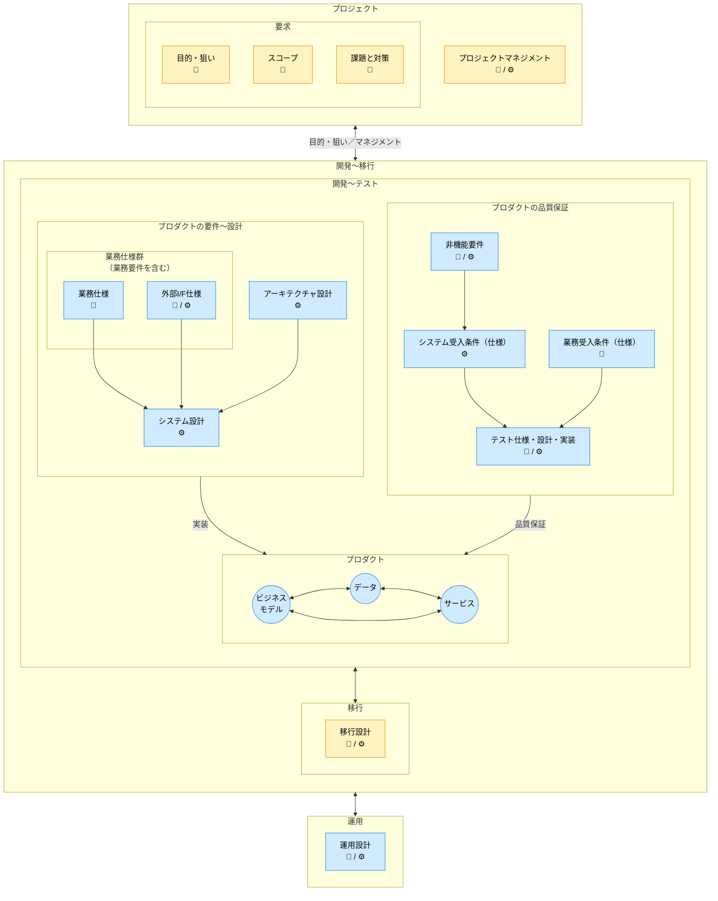
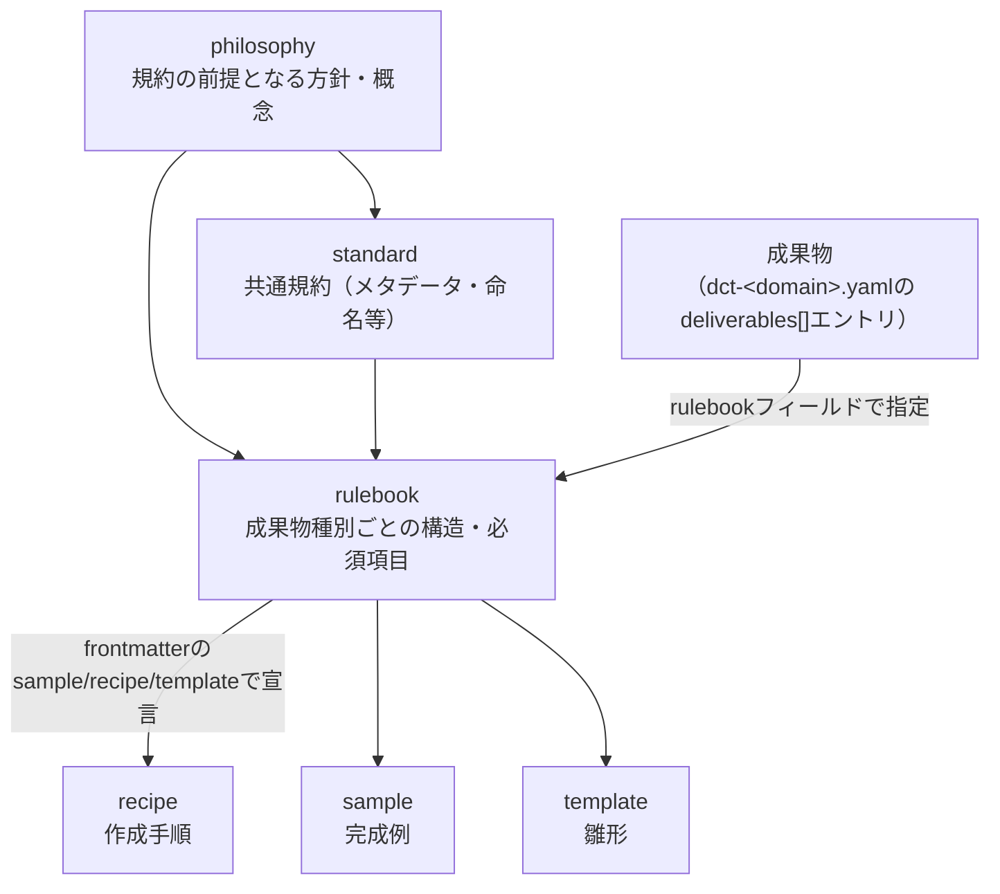
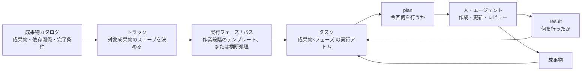

---
specdojo:
  id: docs-structure-guide
  type: guide
  status: draft
---

# ドキュメント構成ガイド

Document Structure Guide

SpecDojoで扱うドキュメントの全体構成について、以下のガイドラインを示します。
本書は、文書の分類、ライフサイクル、論理的な関係、配置を扱います。

**対象読者**

- SpecDojo を導入し、プロダクト文書とプロジェクト文書の配置を設計する利用者、リポジトリ管理者

**この文書で分かること**

- SpecDojo Unit、文書分類、ドキュメントオーナー、命名方針、標準ディレクトリ構成
- 成果物と実践体系（philosophy / standard / rulebook / recipe / sample / template）の関係
- 成果物カタログ（dct）・Schedule（sch）・実行管理（exec）の関係

**次に読む文書**

- 要求・要件・仕様・設計・実装の違いは [概念体系の考え方](../philosophy/concept-system-philosophy.md) を参照してください。
- トラックの構成と実行順序は [トラック設計ガイド](track-design-guide.md)、各成果物の目的は [成果物リファレンス](../references/deliverables-reference.md) を参照してください。

**この文書が扱わないこと**

- 要求・要件・仕様・設計・実装の定義そのもの
- プロジェクトで成果物を選定・検討する順序や GO/NOT GO の判断
- Schedule 上の詳細な実行順序・担当者・日付・反復（構造的な関係ではなく運用の詳細は [Schedule設計ガイド](schedule-design-guide.md) / [schedule実行運用ガイド](schedule-operation-guide.md) を参照）

本書の分類と構成は、文書の管理単位と配置を表します。開発工程や成果物の作成順を表すものではありません。

## 1. SpecDojoで扱うドキュメントの全体構成

- SpecDojo は、1つの SpecDojo Unit で1つのプロダクト文脈を扱うことを基本とします。SpecDojo Unit とは、プロダクトドキュメントとプロジェクトドキュメントを含む1つの `docs/` ルートを指します。
- 1つの SpecDojo Unit には、対象プロダクトを構築・改修するための複数のプロジェクトが存在します。プロジェクトごとにプロジェクトドキュメントを作成します。
- 1つのリポジトリで複数プロダクトを扱う場合は、プロダクトごとに `docs/` ルートを分け、それぞれを独立した SpecDojo Unit として扱います。
- 成果物IDは、原則として SpecDojo Unit 内で一意にします。複数の SpecDojo Unit を横断して扱う場合は、必要に応じて Unit ID と成果物IDの組み合わせで識別します。

## 2. ドキュメントの分類

ドキュメントは、プロダクトドキュメントとプロジェクトドキュメントの2種類に分類されます。

### 2.1. プロダクトドキュメント

**プロダクトの最新状況を説明するドキュメントです**。

プロダクトを新規に構築する際に作成されて、プロダクトを改修する毎に更新されます。プロダクトの、

- 要件〜設計に関する定義
- 品質保証に関する定義

について記載します。プロダクトのライフサイクルにわたって管理されます。

プロダクトドキュメントは、

- 常に「現在の正」を表します。
- プロジェクト固有の判断や経緯は含めず、必要な場合はプロジェクトドキュメントから反映されます。
- ドキュメントの改定履歴はバージョン管理システムで管理します。

### 2.2. プロジェクトドキュメント

**プロダクトの構築時や改修時に、プロジェクト毎に作成されるドキュメントです**。

個別プロジェクト毎の、

- 業務要求: 目的・狙い、スコープ、課題と対策
- プロダクトの変更（現状、トレース、影響範囲、移行）
- プロジェクトマネジメント

について記載します。プロジェクト完了後はアーカイブされます。

## 3. ドキュメントオーナー

ドキュメントのオーナーは、以下の通りです。

| オーナー         | 記号 | 略称 | 役割                       |
| ---------------- | ---- | ---- | -------------------------- |
| ビジネスオーナー | 🧭   | BO   | 最終的な価値判断の主体     |
| エンジニア       | ⚙️   | EN   | 技術的実現と品質判断の主体 |

## 4. ドキュメントの構成

### 4.1. 凡例


### 4.2. ドキュメント構成図

次の図は文書群の包含関係と論理的な関係を示します。矢印は、成果物の作成順や Schedule 上の依存関係を表すものではありません。



※補足事項

- 図中のアーキテクチャ設計は、個別仕様に先立つ全体構造の設計を表します。
- 「業務要件を含む」とは、業務仕様の冒頭に業務要件相当（対象範囲・成功条件・制約等）を含めることを指します。

## 5. 成果物と実践体系の関係

成果物と、その作成を支援する実践体系（philosophy / standard / rulebook / recipe / template / sample / guide / reference）の関係を示します。各種別が答える問いと使い方は [全体概要ガイド](specdojo-overview-guide.md) の4章を参照し、本章では成果物への紐付け方（解決の仕組み）を扱います。

### 5.1. 紐付けの仕組み



| 実践体系                   | 成果物との紐付け方                                                             | 例                                |
| -------------------------- | ------------------------------------------------------------------------------ | --------------------------------- |
| philosophy                 | standard / rulebook が前提とする方針・概念。個別成果物への直接の紐付けはない   | concept-system-philosophy         |
| standard                   | 全成果物・全 rulebook が共通して従う規約。個別成果物への直接の紐付けはない     | document-metadata-standard        |
| rulebook                   | 成果物カタログの `deliverables[].rulebook` フィールドで指定する                | `rulebook: prj-overview-rulebook` |
| recipe / sample / template | 対応する rulebook の frontmatter（`recipe` / `sample` / `template`）で宣言する | `sample: dct-sample`              |
| guide / reference          | 個別成果物に紐づかない横断文書                                                 | 本ガイド自身                      |

`approach` に応じた rulebook / recipe / sample / template の参照方針（どこまで参照するか）は [参考資料活用ガイド](reference-materials-guide.md) を参照してください。

## 6. 成果物カタログ・Schedule・実行管理の関係

成果物とその実行管理は、次の2つの軸で整理できます。

```text
[内容分類軸]（時間を含まない・静的）
  ドメイン（成果物の領域毎のまとまり）
    └─ 成果物 ──(概念体系: 要求/要件/仕様/設計/実装)

[実行管理軸]（時間・順序を含む・動的）
  スケジュール
    └─ トラック（対象成果物スコープを決める）
        └─ 実行フェーズ / パス（作業段階のテンプレート、または横断処理）
            └─ タスク（成果物×フェーズ の実行アトム）
```

内容分類軸は成果物の性質を表す静的な分類で、実行順序を固定しません。実行管理軸は、成果物をいつ・どの単位でまとめて進めるかを表す動的な管理構造です。要求・要件・仕様・設計・実装の違いは [概念体系の考え方](../philosophy/concept-system-philosophy.md) を参照してください。

### 6.1. dct・sch・execの対応

| 情報                 | 主な役割                                                             | 担当ファイル                                           |
| -------------------- | -------------------------------------------------------------------- | ------------------------------------------------------ |
| 成果物カタログ       | 管理する成果物、配置、依存関係、完了条件を定義する                   | `dct-<domain>.yaml`                                    |
| トラック             | 対象成果物のスコープを決め、実行系列としてまとめる                   | `sch-track-<track>.yaml` / `sch-strategy-<track>.yaml` |
| 実行フェーズ / パス  | 成果物ごと、または成果物群を横断して適用する作業段階を定義する       | `sch-strategy-<track>.yaml`                            |
| タスク               | 成果物×フェーズ から生成される実行アトム。担当・期限・依存関係を持つ | `sch-track-<track>.yaml`（生成物）                     |
| plan                 | 一回の作業で確認・変更する対象と手順を示す                           | `execution/exec/plans/`                                |
| result               | 実施内容、確認結果、残課題を記録する                                 | `execution/exec/results/`                              |
| 実行イベント・生成物 | タスクの状態、実行履歴、Ready、クリティカルパスなどを表す            | `execution/generated/`                                 |

### 6.2. 展開の流れ



成果物カタログと Schedule の関係、タスク設計は [Schedule設計ガイド](schedule-design-guide.md)、schedule実行の運用は [schedule実行運用ガイド](schedule-operation-guide.md)、plan と result の管理は [plan/resultライフサイクルガイド](plan-result-lifecycle-guide.md) を参照してください。

## 7. ディレクトリ・ファイルの命名ルール

ディレクトリ名とファイル名については、frontmatterで定義されたidと対応させることを推奨します。
idと対応させない場合（日本語名称を使用する場合等）は、一貫性を保った命名規約を採用してください。

ディレクトリ名のプレフィックス番号の有無は、成果物カタログの管理対象かどうかではなく、ディレクトリが何を収めるかで決めます。

- `NNN-` 番号あり: 改訂しながら育てる計画・設計文書等のツリー。読む順序に意味があり、番号で表します（例: `020-project-definition/`）。
- 番号なし: プロジェクトやプロダクト全体を横断する台帳・記録・実行状態。件数が時系列で増え、読む順序を持たず、`specdojo.config.json` からパスで直接参照されます（例: `controls/`、`execution/`）。

## 8. プロジェクトドキュメントの構成

### 8.1. ディレクトリ階層の構成方針

プロジェクト毎にプロジェクトidを付与し、`projects/<prj-id>/`以下にドキュメントを格納します。

#### 8.1.1. ドメインドキュメント

- ドキュメントは分類（ドメイン）毎にディレクトリを分けます。
- ドメイン内をさらにサブディレクトリへ分けるかは、その中でさらに階層が生えるか、
  件数が増え続けるかで決めます。`040-product-change/` は現状 → 影響調査 → 移行というフェーズごとに仕様が増え、
  `010-as-is/010-business-specifications/` のように階層が生えるため分割します。
- 一方 `030-project-management/` のように成果物が固定数で階層も生えない場合は、
  `020-project-definition/` と同じくフラットに置きます。文書の並びは `dct-<domain>.yaml` の
  group が宣言するため、group ごとにディレクトリを切る必要はありません（複数 group が
  同じ `base_path` を共有できます）。

#### 8.1.2. 横断ドキュメント

- 横断ディレクトリは特定ドメインの配下に置かず、プロジェクト直下に置きます。
  `controls/project-register/` の登録項目や `execution/exec/plans/` の実行プランは、
  プロジェクト定義・プロダクト変更を含む全ドメインの成果物を対象とするためです。
- これらが成果物カタログの管理対象かどうかは配置とは独立で、
  どのドメインに分類するかは各 `dct-<domain>.yaml` の `domain` が決めます。
  例えば `controls/`、`schedule/`、`reporting/` は `dct-project-management.yaml`
  （`domain: project-management`）が管理し、`routines/` と `controls/reviews/` は
  CLI の入出力領域なのでカタログ管理対象外です。

### 8.2. ディレクトリ構成

```text
docs/
├── ja/                                           # 多言語化対応（将来: en/ など）
│   ├── specdojo/
│   │   ├── philosophy/                       # 規約の前提となる方針・概念
│   │   ├── guides/                           # ドキュメント作成ガイド
│   │   ├── references/                       # 一覧・比較のためのリファレンス
│   │   ├── standards/                            # 共通標準・メタ規約
│   │   ├── rulebooks/                            # ドキュメント記述規約
│   │   ├── schemas/                              # 言語固有の文書構造スキーマ
│   │
│   ├── projects/
│   │   ├── prj-0001/                             # プロジェクト（ID）
│   │   │   ├── 010-deliverables-catalog/         # 成果物カタログ
│   │   │   │   ├── dct-index.md                  # 成果物カタログの索引
│   │   │   │   ├── dct-project-definition.yaml   # プロジェクト定義の成果物カタログ（正本）
│   │   │   │   ├── dct-project-management.yaml   # プロジェクトマネジメントの成果物カタログ（正本）
│   │   │   │   └── generated/                    # 正本から生成される補助一覧
│   │   │   │       ├── dct-project-definition.md
│   │   │   │       └── dct-project-management.md
│   │   │   │
│   │   │   ├── 020-project-definition/           # プロジェクト定義
│   │   │   │   ├── prj-overview.md               # プロジェクト概要
│   │   │   │   ├── prj-stakeholder-register.md   # ステークホルダー登録簿
│   │   │   │   ├── prj-charter.md                # プロジェクト憲章
│   │   │   │   ├── prj-scope.md                  # プロジェクトスコープ
│   │   │   │   ├── prj-success-criteria-and-acceptance-criteria.md # 成功基準と受入条件
│   │   │   │   ├── prj-issues-and-approach.md    # プロジェクト課題と解決アプローチ
│   │   │   │   ├── prj-assumptions-constraints-dependencies.md # 前提・制約・依存関係
│   │   │   │   └── prj-comparison-of-alternatives.md # 代替案の比較
│   │   │   │
│   │   │   ├── 030-project-management/           # プロジェクトマネジメント
│   │   │   │   ├── pm-plan.md                    # プロジェクト管理計画
│   │   │   │   ├── pm-communication-plan.md      # コミュニケーション計画
│   │   │   │   ├── pm-quality-management-plan.md　# 品質管理計画
│   │   │   │   ├── pm-review-viewpoints.yaml     # レビュー観点
│   │   │   │   ├── pm-organization.md            # 組織とロールの定義
│   │   │   │   ├── pm-roles.yaml                 # ロール定義
│   │   │   │   ├── pm-members.yaml               # メンバー定義
│   │   │   │   └── pm-raci.md　                  # 組織体制とRACI
│   │   │   │
│   │   │   ├── 040-product-change/               # プロダクト変更
│   │   │   │   ├── 010-as-is/                    # 現状定義（As-Is）
│   │   │   │   │   └── 010-business-specifications/ # 業務仕様
│   │   │   │   │
│   │   │   │   ├── 020-impact-analysis/          # 影響調査
│   │   │   │   │   ├── imp-business.md           # 業務影響
│   │   │   │   │   ├── imp-data.md               # データ影響
│   │   │   │   │   ├── imp-interface.md          # インターフェース影響
│   │   │   │   │   ├── imp-test.md               # テスト影響
│   │   │   │   │   └── imp-operations.md         # 運用影響
│   │   │   │   │
│   │   │   │   ├── 030-traceability/             # トレーサビリティ
│   │   │   │   │   └── generated/                # 自動生成成果物
│   │   │   │   │       ├── trc-requirements-to-specs.md # 要求と仕様のトレース
│   │   │   │   │       └── trc-requirements-to-tests.md # 要求とテストのトレース
│   │   │   │   │
│   │   │   │   └── 040-migration/                # 移行
│   │   │   │       ├── mip-index.md              # 移行計画
│   │   │   │       ├── dmd-index.md              # データ移行設計
│   │   │   │       ├── mtp-index.md              # 移行テスト計画（リハーサル計画）
│   │   │   │       ├── cop-index.md              # カットオーバー計画（本番切替手順）
│   │   │   │       └── otp-index.md              # 運用切替計画（ハイパーケア含む）
│   │   │   │
│   │   │   ├── ...                               # 050- 以降の成果物ドメイン
│   │   │   │
│   │   │   ├── controls/                         # 管理台帳・管理ビュー（全ドメイン横断）
│   │   │   │   ├── project-register/             # 統合管理台帳（正本）
│   │   │   │   │   ├── pjr-index.md              # プロジェクト登録簿
│   │   │   │   │   ├── pjr-0001-auth.md          # 登録項目（認証）
│   │   │   │   │   ├── pjr-0002-payment.md       # 登録項目（決済）
│   │   │   │   │   └── generated/                # 正本から生成される補助一覧
│   │   │   │   │       └── pjr-views.md          # 台帳ビュー（状態別・優先度別・担当者別）
│   │   │   │   │
│   │   │   │   ├── reviews/                      # レビュー結果 ※成果物カタログ管理対象外
│   │   │   │   │
│   │   │   │   └── generated/                    # type別の派生管理ビュー
│   │   │   │       ├── pm-risk-register.md       # type=risk の抽出ビュー
│   │   │   │       ├── pm-issue-log.md           # type=issue の抽出ビュー
│   │   │   │       ├── pm-change-request-log.md  # type=change-request の抽出ビュー
│   │   │   │       └── pm-decision-log.md        # type=decision の抽出ビュー
│   │   │   │
│   │   │   ├── schedule/                         # Schedule
│   │   │   │   ├── sch-milestones.yaml           # マイルストーン定義
│   │   │   │   ├── sch-defaults.yaml             # 共通デフォルト設定
│   │   │   │   ├── sch-track-<track>.yaml        # トラックごとのSchedule定義
│   │   │   │   └── sch-strategy-<track>.yaml     # トラックごとのタスク生成戦略
│   │   │   │
│   │   │   ├── routines/                         # 定期実行ルーチン ※成果物カタログ管理対象外
│   │   │   │   └── rtn-<name>.yaml               # ルーチン定義
│   │   │   │
│   │   │   ├── execution/                        # 実行管理 ※成果物カタログ管理対象外
│   │   │   │   ├── exec/                         # タスク実行ワークスペース
│   │   │   │   │   ├── plans/                    # 実行プラン
│   │   │   │   │   ├── results/                  # 実行結果
│   │   │   │   │   ├── events/                   # イベントログ
│   │   │   │   │   └── .locks/                   # 実行ロック
│   │   │   │   └── generated/                    # 自動生成成果物
│   │   │   │
│   │   │   └── reporting/                        # レポート
│   │   │       ├── progress-reports/             # 進捗報告
│   │   │       │   ├── pr-2026-03-01-01.md       # 進捗報告
│   │   │       │   └── pr-2026-03-08-01.md       # 進捗報告
│   │   │       └── meeting-minutes/              # 議事録
│   │   │           ├── mm-2026-03-01-01.md       # 議事録
│   │   │           └── mm-2026-03-08-01.md       # 議事録
│   │   │
│   │   └── prj-0002/ ...                         # 他プロジェクト
│   │
│   └── product/
│
└── en/                                           # 将来の英語ドキュメント用ディレクトリ
```

## 9. プロダクトドキュメントの構成

### 9.1. ディレクトリ構成

```text
docs/
├── ja/                                           # 多言語化対応（将来: en/ など）
│   ├── specdojo/
│   │   ├── philosophy/                       # 規約の前提となる方針・概念
│   │   ├── guides/                           # ドキュメント作成ガイド
│   │   ├── references/                       # 一覧・比較のためのリファレンス
│   │   ├── standards/                            # 共通標準・メタ規約
│   │   ├── rulebooks/                            # ドキュメント記述規約
│   │
│   ├── projects/
│   │   ├── prj-0001/                             # プロジェクト（ID）
│   │   └── prj-0002/ ...                         # 他プロジェクト
│   │
│   └── product/
│       ├── 010-business-specifications/          # 業務仕様
│       │   ├── 010-data-flow/                    # データフロー
│       │   │   └── cdfd-sales-management.md      # 概念データフロー図（例：販売管理）
│       │   ├── 020-data-model/                   # データモデル
│       │   │   ├── bdd-sales-management.md       # 業務データ辞書（例：販売管理）
│       │   │   ├── cdsd-sales-management.md      # 概念データストア定義（例：販売管理）
│       │   │   ├── sld-sales-management.md       # 保管場所定義（例：倉庫・店舗）
│       │   │   ├── stsd-product-lifecycle.md     # ステータス定義（例：商品ライフサイクル）
│       │   │   ├── cld-product-category.md       # 分類定義（例：商品カテゴリ）
│       │   │   ├── ccd-sales-management.md       # 概念クラス図（例：販売管理）
│       │   │   └── cstd-product-lifecycle.md     # 概念状態遷移図（例：商品ライフサイクル）
│       │   ├── 030-business-model/               # 業務モデル
│       │   │   ├── bps-sales-order-flow.md       # 業務プロセス仕様（例：受注フロー）
│       │   │   ├── br-reorder-point.md           # ビジネスルール（例：発注点判定）
│       │   │   ├── bes-index.md                  # 業務イベント仕様（全体構成）（例：販売管理）
│       │   │   └── bes-order-approved.md         # 業務イベント仕様（個別）（例：受注承認）
│       │   ├── 040-interface-model/              # インターフェースモデル
│       │   │   ├── uis-order-entry.md            # 画面仕様（例：受注入力）
│       │   │   └── bds-order-summary.md          # 帳票仕様（例：受注明細）
│       │   └── 050-common/                       # 共通
│       │       ├── sf-index.md                   # システム化機能一覧（全体構成）
│       │       ├── sf-order-entry.md             # システム化機能一覧（個別）（例：受注入力）
│       │       └── gl-sales-management.md        # 用語集（例：販売管理）
│       │
│       ├── 020-external-if-specifications/       # 外部I/F仕様
│       │   ├── ifx-index.yaml                    # 外部システムI/F一覧
│       │   ├── ifx-api-supplier-system.yaml      # 外部API仕様（例：仕入先システム）
│       │   ├── ifx-file-inventory-sync.yaml      # 外部ファイル連携仕様（例：在庫同期）
│       │   └── ifx-msg-stock-changed.yaml        # 外部メッセージ仕様（例：在庫変更通知）
│       │
│       ├── 030-architecture/                     # アーキテクチャ
│       │   ├── 010-c4/                           # C4（構造・依存関係）
│       │   │   ├── cxd-sales-management.md       # C4コンテキスト図（例：販売管理）
│       │   │   ├── cnd-sales-management.md       # C4コンテナ図（例：販売管理）
│       │   │   └── cpd-sales-management.md       # C4コンポーネント図（例：販売管理）
│       │   └── 020-infrastructure/               # インフラ・技術選定
│       │       ├── ifd-production-environment.md # インフラ構成図（例：本番環境）
│       │       └── tsd-sales-management.md       # 技術スタック一覧（例：販売管理）
│       │
│       ├── 040-system-design/                    # システム設計
│       │   ├── sysd-index.md                     # 全体構成（リンク集）
│       │   ├── sysd-critical-flows.md            # 重要フロー
│       │   └── sysd-cross-cutting-policy.md      # 横断ルール
│       │
│       ├── 050-business-acceptance-criteria/     # 業務受入条件
│       │   └── bac-sales-order.md                # 業務受入条件（例：受注）
│       │
│       ├── 060-non-functional-requirements/      # 非機能要件
│       │   ├── nfr-index.md                      # 非機能要件
│       │   ├── nfr-reliability.md                # 非機能要件 / 信頼性
│       │   ├── nfr-availability.md               # 非機能要件 / 可用性
│       │   ├── nfr-maintainability.md            # 非機能要件 / 保守性
│       │   ├── nfr-integrity.md                  # 非機能要件 / 完全性
│       │   ├── nfr-security-safety.md            # 非機能要件 / 機密性・安全性
│       │   ├── nfr-performance.md                # 非機能要件 / 性能
│       │   ├── nfr-operations.md                 # 非機能要件 / 運用
│       │   └── nfr-usability.md                  # 非機能要件 / 操作性
│       │
│       ├── 070-system-acceptance-criteria/       # システム受入条件
│       │   └── sac-sales-management.md           # システム受入条件（例：販売管理）
│       │
│       ├── 080-testing/                          # テスト
│       │   ├── 010-test-strategy-and-policy/     # テスト戦略・方針
│       │   │   └── tsp-index.md                  # テスト戦略・方針
│       │   ├── 020-unit-test-catalog/            # 単体テストカタログ
│       │   │   ├── utc-index.md                  # 単体テスト
│       │   │   └── utc-order-service.md          # 単体テスト対象別（例：受注サービス）
│       │   ├── 030-internal-integration-test-catalog/ # 内部結合テストカタログ
│       │   │   ├── itc-index.md                  # 内部結合テスト
│       │   │   └── itc-order-flow.md             # 内部結合テスト対象別（例：受注フロー）
│       │   ├── 040-external-integration-test-catalog/ # 外部結合テストカタログ
│       │   │   ├── etc-index.md                  # 外部結合テスト
│       │   │   └── etc-payment-gateway.md        # 外部結合テスト対象別（例：決済GW）
│       │   ├── 050-system-test-catalog/          # 総合結合テストカタログ
│       │   │   ├── stc-index.md                  # 総合テスト
│       │   │   └── stc-order-to-settlement.md    # 総合テスト対象別（例：受注〜決済）
│       │   └── 060-acceptance-test-catalog/      # 受入結合テストカタログ
│       │       ├── atc-index.md                  # 受入テスト
│       │       └── atc-store-operations.md       # 受入テスト対象別（例：店舗運用）
│       │
│       └── 090-operations/                       # 運用
│           ├── opd-index.md                      # 運用方針・設計
│           ├── opd-monitoring.md                 # 運用方針・設計（監視）（例：アラート運用）
│           ├── opr-index.md                      # 運用手順（例：全体手順）
│           ├── opr-incident.md                   # 運用手順（障害対応）（例：P1対応）
│           └── opr-backup-restore.md             # 運用手順（バックアップ・リストア）（例：復旧演習）
│
└── en/                                           # 将来の英語ドキュメント用ディレクトリ
```
