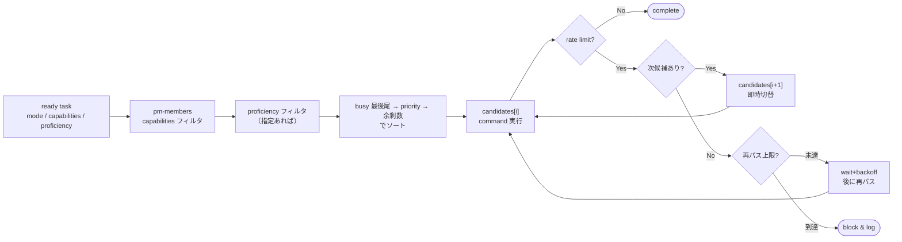

---
specdojo:
  id: specdojo:exec-config-guide
  type: guide
  status: ready
---

# exec設定ガイド

Exec Configuration Guide

SpecDojo のエージェント実行は、`sch-strategy-<track>.yaml` の phase に作業要件を定義し、`pm-members.yaml` のエージェント定義から実行者を選択します。レートリミットなどの共通実行ポリシーは `exec-defaults.yaml` に分離します。

**対象読者**

- エージェント選択、provider、権限、リトライなどの exec 設定を設計・変更する運用者

**この文書で分かること**

- Schedule・メンバー・exec 共通設定の責務分担、エージェント解決、権限設定、設定変更手順

**次に読む文書**

- 設定を使った実行手順は [exec運用ガイド](exec-operation-guide.md)、Schedule 側の実行要件は [Schedule設計ガイド](schedule-design-guide.md) を参照してください。

初回設定では、すべての章を読む必要はありません。

| 目的                                   | 読む章                                                                                           |
| -------------------------------------- | ------------------------------------------------------------------------------------------------ |
| agentを1件動かす                       | `設定ファイルの分担`、`phase の実行要件`、`エージェントの定義`、`provider 設定の配布と scaffold` |
| rate limit・並列数を調整する           | `実行フロー`、`exec-defaults`                                                                    |
| executor / reporter pipelineを構成する | `executor / reporter pipeline の構成`                                                            |
| 無人実行の権限境界を確認する           | `agent 権限とプロンプトインジェクション対策`                                                     |
| 既存設定を変更する                     | `変更手順`                                                                                       |

## 1. 設定ファイルの分担

| ファイル                       | 役割                                                                                     | 粒度         |
| ------------------------------ | ---------------------------------------------------------------------------------------- | ------------ |
| `sch-strategy-<track>.yaml`    | phase ごとの `mode`・`approach`・実行要件・任意の `agent_pipeline`                       | トラック     |
| `pm-members.yaml`              | 誰が作業するか（identity・capabilities・proficiency・priority・任意の `stage_role`）     | プロジェクト |
| `.specdojo/exec-defaults.yaml` | provider 別起動コマンドテンプレート・rate limit 検出条件・リトライポリシー・同時実行上限 | システム     |

`sch-strategy` は agent 個体を指定しません。phase に「どんな能力が必要か」を書き、`pm-members.yaml` に「誰がその能力を持つか」を書きます。

## 2. phase の実行要件

`execution: agent` の phase には、必要に応じて `mode`・`capabilities`・`proficiency` を直接定義します。`mode` は plan/result の種別であり、agent の能力ではありません。

```yaml
phase_sets:
  first-pass:
    - id: enrich
      name: 調査・補強
      execution: agent
      task_suffix: "020"
      mode: edit
      proficiency: normal

  research-first-pass:
    - id: enrich
      name: 調査・深掘り
      execution: agent
      task_suffix: "020"
      mode: edit
      capabilities: [web_search]
      proficiency: expert

  review-pass:
    - id: review
      name: レビュー
      execution: human
      task_suffix: "030"
      mode: review
```

| フィールド       | 必須 | 説明                                                                                                                                                                                                 |
| ---------------- | ---- | ---------------------------------------------------------------------------------------------------------------------------------------------------------------------------------------------------- |
| `execution`      | 任意 | `agent` または `human`。省略時は `agent`                                                                                                                                                             |
| `mode`           | 任意 | `edit` または `review`。省略時は `edit`                                                                                                                                                              |
| `approach`       | 任意 | `fully-guided` / `recipe-guided` / `freeform` / `bootstrap` / `retrofit` / `cross-deliverable-dedup` / `rulebook-maintenance` / `recipe-maintenance` / `sample-maintenance` / `template-maintenance` |
| `capabilities`   | 任意 | 必要なツールリスト。ツール不要の場合は省略                                                                                                                                                           |
| `proficiency`    | 任意 | 必要な品質水準。省略すると全水準が候補                                                                                                                                                               |
| `agent_pipeline` | 任意 | executor、reporter の 2 stage と stage ごとの `capabilities` / `proficiency`。省略時は従来の単一 agent フロー                                                                                        |

`approach` の値ごとの意味と、rulebook / recipe / sample / template の参照方針は [実践の進め方ガイド](ryu-guide.md) を参照します。

pipeline では `agent_pipeline.stages` を `executor`、`reporter` の順に定義します。各 stage は `stage_role` と任意の `capabilities` / `proficiency` を持ち、nickname は持ちません。pipeline の構造例は [Schedule設計ガイド](schedule-design-guide.md) の `executor / reporter pipeline` を参照してください。

pipeline stage の agent を CLI で固定する場合は `--executor-by <nickname>` と `--reporter-by <nickname>` を使います。指定した member は対応する `stage_role` を持つ必要があります。片方だけ指定した場合、未指定 stage は `capabilities`、`proficiency`、`priority` による自動選択を維持します。従来の単一 agent タスクではこの2オプションを使用できません。

## 3. エージェントの定義

`pm-members.yaml` の `type: agent` メンバーには `provider`・`capabilities`・`proficiency`・`priority` を定義します。起動コマンドは member には書かず、`.specdojo/exec-defaults.yaml` の `providers.<provider>.command_template` を member 属性（`{nickname}`・`{mode}`・`{proficiency}` と `command_params` の変数）で展開して解決します。member の `command` はテンプレートで表現できない特殊構成向けの上書きとしてのみ使います。

```yaml
members:
  - nickname: edit-agent
    display_name: Edit Agent
    email: null
    roles: []
    type: agent
    provider: opencode
    capabilities: []
    proficiency: normal
    priority: 10

  - nickname: expert-web-agent
    display_name: Expert Web Agent
    email: null
    roles: []
    type: agent
    provider: opencode
    capabilities: [web_search]
    proficiency: expert
    priority: 10
```

pipeline 専用 agent には `stage_role: executor` または `stage_role: reporter` を指定します。`stage_role` を省略した既存 agent は従来の単一 agent フロー専用です。自動選択では、従来タスクから stage role 付き agent を除外し、pipeline stage から stage role 未指定 agent と異なる stage role の agent を除外します。これにより既存 agent 定義を変更せず、新しい pipeline agent を追加できます。

`exec run --auto` は phase または pipeline stage の `capabilities` をすべて持つ agent を候補にします。`proficiency` が指定されている場合は一致する agent のみを候補にし、未指定の場合は全水準を候補に含めます。候補のソートキーは次の順に評価します。

1. busy 状態（イベントログ上で `doing` のタスクを担当中の agent）を最後尾に置きます。`--parallel` 実行で同じ最上位 agent に集中して rate limit に陥るのを避けるためです。
2. `priority` 昇順（同値なら次へ）。
3. 余剰 capabilities 数の少ない順。

ソート後、`exec-defaults.yaml` の `providers.<provider>.max_concurrency` が設定された provider について、現在実行中の agent が上限に達していれば、その provider の候補を除外します。別 provider の候補が残ればそれを実行者に繰り上げます。すべての候補の provider が上限に達している場合は、claim も worktree 生成も行わずにそのタスクを繰り延べます（タスクは `todo` のまま保持され、取りこぼしません）。`--loop` 実行では、agent 終了時に provider の枠を解放し、空いた `--parallel` 枠へ次の Ready タスクを投入します。`max_concurrency` はグローバルな `--parallel` を下げないため、他 provider は並列実行を維持します。`max_concurrency` は auto 選択のみに適用し、`--by` / `--edit-by` / `--review-by` / `--executor-by` / `--reporter-by` による明示指定や resume 実行には適用しません。

## 4. 実行フロー

`providers.<provider>.max_concurrency` は1つの `exec run` プロセス内の provider 枠を制御します。複数の `exec run` プロセスを跨ぐ上限ではないため、project ごとの `exec-run.lock` が手動実行・routine・CI の run 全体を排他します。同一 run 内の `--parallel` はこのロックの内側で動作します。

手動 CLI の busy 時既定は `--if-busy fail` です。必要に応じて `wait` または `skip` を明示します。routine は待機で cron worker を占有しないよう常に `--if-busy skip` を渡し、再試行は次回の cron tick に委ねます。

rate limit を検知したら、まず待機なしで次の優先順 agent に切り替えて再実行します（次候補は別アカウント/プロバイダ想定）。全候補が rate limit の場合のみ `rate_limit_policy.on_critical.retry` の wait+backoff で再パスを行い、`max_attempts` 回（初回パスを 1 回目として数える）まで繰り返します。この再試行は critical / non-critical を問わず全タスクに適用します。



## 5. exec-defaults

`.specdojo/exec-defaults.yaml` には、全トラック共通の実行ポリシーを定義します。executor の sandbox 外で親 runner に実行させる固定検証は `pipeline.parent_validations` に許可リスト ID だけを指定します。

```yaml
pipeline:
  parent_validations:
    - test-integration

rate_limit_detection:
  exit_codes: []
  stderr_patterns:
    - "rate limit"
    - "429"

rate_limit_policy:
  cooldown_seconds:
    rate_limit: 900
  on_non_critical:
    action: skip
  on_critical:
    action: try_next
    retry:
      max_attempts: 3
      initial_wait_seconds: 60
      backoff_multiplier: 3
      max_wait_seconds: 600
    on_exhausted: block
```

`test-integration` は組み込み許可リストで `npm run test:integration` へ解決されます。設定や executor evidence に command・引数を書くことはできません。未知 ID、重複 ID は agent 起動前の設定エラーになります。親 runner は `shell: false` の固定 argv で実行し、現時点で許可される ID は `test-integration` だけです。

provider ごとに挙動が異なる設定は `providers.<provider>` に置きます。各キーは対応するグローバル値を完全に置き換え、未指定のキーはグローバル値にフォールバックします。`<provider>` は `pm-members[].provider` に対応します。指定できるキーは次のとおりです。

- `command_template`: その provider の agent を起動するコマンドテンプレート。`{nickname}`・`{mode}`・`{proficiency}` と `command_params` の変数を member 属性で展開します。グローバル既定は持ちません。
- `command_params`: テンプレートの追加変数表。`by_mode.<mode>` と `by_proficiency.<proficiency>` に変数名と値の組を置きます。
- `rate_limit_detection`: provider 固有の検出シグナル（`stderr_patterns` を優先します）。
- `rate_limit_policy`: provider 固有のリトライ／フォールバック／block ポリシー。
- `rate_limit_policy.cooldown_seconds`: reset / retry-after が無い retryable signal にだけ使う明示的な延期秒数。未指定の kind は再開時刻を推定しません。
- `max_concurrency`: その provider の agent を 1 ラウンドで同時に走らせる上限（正の整数）。未指定・0 以下・非整数は「上限なし」として扱います。

`{nickname}` のような `{lower_snake}` は実行のたびに展開される実行時変数であり、ファイルに記法のまま残った状態が完成形です。テンプレート成果物の記入プレースホルダ `_UPPER_SNAKE_`（一度埋めたら消える）とは別の記法で、使い分けは [Template 記述標準](../standards/template-authoring-standard.md) の `他のプレースホルダ記法との使い分け` を正本とします。

```yaml
providers:
  claude:
    command_template: "claude -p --verbose --agent {nickname} --settings .specdojo/claude/settings.{mode}.json"

  codex:
    command_template: 'codex exec --ephemeral --sandbox workspace-write -c approval_policy="never" -c sandbox_workspace_write.network_access=false --model {model} -c model_reasoning_effort="{effort}"'
    command_params:
      by_proficiency:
        normal: { model: gpt-5.4-mini, effort: medium }
        expert: { model: gpt-5.5, effort: high }
```

`max_concurrency` は、同一ホストの単一モデルを共有する provider（例: ローカル Ollama の `opencode`）が複数同時起動でメモリ競合・モデルロード待ちにより不安定になるのを防ぐために使います。グローバルな `--parallel` を下げずに、その provider だけを直列化できます。

```yaml
providers:
  opencode:
    # opencode は現在実行中の数を同時 1 つに制限する（他 provider は --parallel のまま並列）。
    max_concurrency: 1
```

## 6. executor / reporter pipeline の構成

pipeline は、成果物の編集と検証を行う executor と、evidence から result を構成する reporter の 2 stage で 1 タスクを実行します。設定は phase（`agent_pipeline.stages`）、member（`stage_role`）、provider（`command_template`）の 3 箇所に分かれ、それぞれの責務は `設定ファイルの分担` と同じです。

### 6.1. ローカルLLM構成（executor / reporter とも同一 provider）

ローカル Ollama の同一モデル（例: Gemma）で両 stage を実行する構成です。phase には nickname を書かず、stage ごとの要件だけを定義します。

```yaml
phase_sets:
  first-pass:
    - id: draft
      name: 起草
      execution: agent
      task_suffix: "010"
      mode: edit
      agent_pipeline:
        stages:
          - stage_role: executor
            proficiency: normal
          - stage_role: reporter
            proficiency: normal
```

member 側は、両 stage の agent を同じ provider で定義し、`stage_role` だけを分けます。`stage_role` を持たない既存の単一 agent は従来フロー専用として残ります。

```yaml
members:
  - nickname: opencode-executor
    display_name: OpenCode Executor
    email: null
    roles: []
    type: agent
    provider: opencode
    mode: edit
    stage_role: executor
    proficiency: normal
    priority: 1

  - nickname: opencode-reporter
    display_name: OpenCode Reporter
    email: null
    roles: []
    type: agent
    provider: opencode
    mode: edit
    stage_role: reporter
    proficiency: normal
    priority: 1
```

同一ホストの単一モデルを両 stage が共有するため、provider に `max_concurrency: 1` を設定して直列化します。グローバルな `--parallel` は下がらないため、別 provider のタスクは並列のまま実行されます。

```yaml
providers:
  opencode:
    max_concurrency: 1
    command_template: "opencode run --agent {nickname}"
```

### 6.2. クラウド executor とローカル reporter の混在構成

複雑な編集判断が必要な phase では、executor だけをクラウド provider の expert agent にし、reporter はローカルのまま共有できます。stage ごとに要件を分けるだけで、reporter と result 生成の経路は `ローカルLLM構成（executor / reporter とも同一 provider）` と同じです。

```yaml
phase_sets:
  deep-pass:
    - id: draft
      name: 起草
      execution: agent
      task_suffix: "010"
      mode: edit
      agent_pipeline:
        stages:
          - stage_role: executor
            capabilities: [web_search]
            proficiency: expert
          - stage_role: reporter
            proficiency: normal
```

executor 候補は provider をまたいで `capabilities` / `proficiency` / `priority` で選ばれます。クラウド provider 側は既存の command template をそのまま使い、member に `stage_role: executor` を足すだけです。

```yaml
members:
  - nickname: codex-expert-executor
    display_name: Codex Expert Executor
    email: null
    roles: []
    type: agent
    provider: codex
    mode: edit
    stage_role: executor
    proficiency: expert
    capabilities: [web_search]
    priority: 1
```

stage の agent を固定したい場合は `--executor-by` / `--reporter-by` を使います。片方だけ指定すると、もう一方は要件と優先度による自動選択のままです。

```sh
specdojo exec run --project <project-id> --task <task-id> \
  --executor-by codex-expert-executor \
  --reporter-by opencode-reporter
```

### 6.3. evidence とログの引き渡し方針

executor の出力は、そのまま reporter へ渡さずに run 単位の evidence へ整形して保存します。保存先は `<execution_path>/exec/evidence/<task-id>/<run-id>/` です。

| ファイル              | 内容                                                                      |
| --------------------- | ------------------------------------------------------------------------- |
| `evidence.json`       | stage の実行結果、変更ファイル一覧、diff サマリ、検証結果、最終メッセージ |
| `executor.log`        | executor の標準出力・標準エラーの抜粋（人が調査するための参照先）         |
| `pipeline-state.json` | executor / reporter の状態・actor・試行回数・成果物参照                   |

引き渡しの方針は次のとおりです。

- reporter へ渡すのは、plan と `evidence.json` の内容と出力 JSON Schema だけです。ログ本文・生 diff は渡しません。
- ログは `evidence.json` の `log_refs` に参照（パス・バイト数・切り詰めの有無）としてだけ現れます。ログ本文を読むのは人です。
- 保存前に上限を適用します。ログ抜粋は 64KiB、最終メッセージと diff サマリは各 4,000 文字、検証結果は 50 件、変更ファイルは 1,000 件までです。超過分は切り詰め、切り詰めた事実を `log_refs.truncated` に残します。
- 保存前に秘匿値を伏せ字化します（`Bearer` トークン、`sk-`/`gh*_` 形式のキー、`api_key` / `token` / `password` などの値）。evidence と `executor.log` の両方に適用します。
- executor が構造化した最終報告を返す場合は、標準出力に `<specdojo_executor_evidence>` タグで JSON（`final_message`・`validations`）を出します。タグが無い場合は標準出力の残りを最終メッセージとして扱います。
- `pipeline.parent_validations` がある場合、executor は sandbox 内で `npm run test:unit` を実行し、親 runner は executor の成功後・reporter の起動前に固定検証を実行します。executor 由来の検証には `source: executor`、親 runner 由来には `source: runner` と許可リスト `id` を付けて、同じ `validations` 配列へ保存します。
- 親検証が失敗しても reporter は evidence を受け取り、block 内容を構成できます。ただし reporter が誤って `outcome: complete` を返しても、runner は親検証の失敗を優先してタスクを成功扱いにしません。
- reporter の出力は JSON Schema で厳格に検証します。形式不正のときは同じ plan と evidence のまま reporter だけを最大 3 回再実行し、executor は再実行しません。
- reporter stage の再開では、現在の設定 ID と一致する親検証が保存済み evidence にそろっている場合だけ executor evidence を再利用します。保存済みの親検証がすべて成功していれば再実行しません。`failed` / `not_run` があれば、親 runner が現在の worktree で固定許可リストの親検証を再実行し、同じ ID の結果を evidence 上で置換してから reporter へ渡します。executor 由来の検証は再実行・置換しません。設定 ID が変わった、または結果が欠けている場合、Schedule 実行は新しい executor run としてやり直し、register 実行は明示的な再実行を促して再開を拒否します。
- result の frontmatter は runner が scaffold した内容を保ち、本文は検証済み JSON から runner が描画します。reporter はファイルを書きません。

## 7. provider 設定の配布と scaffold

agent が exec 実行時に読み込む provider 固有の設定（agent 定義・permission 設定）は、npm package 内の `templates/<provider>/` を配布原本とし、利用プロジェクトへコピーして使います。worktree 実行はコミット済み内容から worktree を作るため、コピーした設定は必ずコミットします。

配置規則は provider 名から機械的に決まります（`agents/` 配下 → `.<provider>/agents/`、それ以外のファイル → `.specdojo/<provider>/`、`README.md` はコピーしません）。provider ごとの配布内容は次のとおりです。

| provider | 配布内容                                                                                                                                            | 配置先                                 |
| -------- | --------------------------------------------------------------------------------------------------------------------------------------------------- | -------------------------------------- |
| claude   | `agents/*.md`、`settings.edit.json` / `settings.review.json` / `settings.report.json`                                                               | `.claude/agents/`、`.specdojo/claude/` |
| codex    | `agents/*.toml`（親 Codex が spawn する subagent 定義）                                                                                             | `.codex/agents/`                       |
| opencode | `agents/*.md`（permission frontmatter 込みの agent 定義）                                                                                           | `.opencode/agents/`                    |
| copilot  | `pm-members-snippet.yaml`（member 定義）と `exec-defaults-snippet.yaml`（`providers.copilot` の command template・rate limit 検出）の参照スニペット | `.specdojo/copilot/`                   |

導入手順とテンプレートに含めない手動設定（`opencode.json`、`.codex/config.toml` など）は各 `templates/<provider>/README.md` を参照します。

`.specdojo/exec-defaults.yaml` の `providers.claude.command_template` には `--settings .specdojo/claude/settings.{mode}.json` を指定します。`--permission-mode bypassPermissions` は使いません（`.claude/settings.json` の `disableBypassPermissionsMode: "disable"` で起動自体を拒否します）。

Claude member の `mode` はこの `{mode}` を権限プロファイル名へ展開するためにも使います。edit executor は `edit`、review executor は `review`、reporter は `report` を指定します。reporter の適格性は task mode ではなく `stage_role: reporter` で決まり、`settings.report.json` は Edit/Write と `git add` / `git commit` を deny します。

### 7.1. scaffold コマンド

この配置は `exec scaffold` の `--provider <name>` オプションで自動化します。

```sh
specdojo exec scaffold --provider claude
```

挙動は次のとおりです。

- `--provider <name>` を指定すると、package 内の `templates/<name>/` を配布原本として上記の配置規則でコピーします。`--provider` を省略した場合は従来どおり `pm-review-viewpoints.yaml` の scaffold を行い、挙動を変えません。
- 配布原本はインストール済み package のルートから解決します。`templates/<name>/` が存在しない provider を指定した場合は、指定可能な provider 一覧を添えてエラーにします。
- 配置先に同名ファイルが存在する場合は上書きせず `Skipped (already exists):` を出力します。`--force` 指定時のみ上書きします。ファイルごとに `Written:` / `Skipped:` を 1 行ずつ出力します（既存の scaffold 系コマンドの出力形式に合わせます）。
- `--dry-run` 指定時は書き込みを行わず、コピー予定のファイル一覧を表示します。
- コピー完了後、次の 2 点を案内メッセージとして出力します。配置ファイルのコミットが必要であること（worktree 実行の前提）、および `.specdojo/exec-defaults.yaml` の `providers.claude.command_template` に `--settings` の指定が必要であること。
- `settings.*.json` の `Edit(...)` / `Write(...)` パスパターンの調整は利用者に委ねます。scaffold は `.specdojo/specdojo.config.json` のパス設定に基づく書き換えを行いません（テンプレートを事実上の推奨レイアウト前提で配布します）。
- 将来 provider を追加する場合は `templates/<provider>/` を追加し、`package.json` の `files` に含めます。コマンド側は provider 名からディレクトリを解決するだけで、provider ごとの分岐を持ちません。

## 8. agent 権限とプロンプトインジェクション対策

exec の plan は done_criteria と成果物本文から生成され、agent は無人で実行されます。成果物やレビュー対象文書に埋め込まれた指示（プロンプトインジェクション）によって、agent がタスク外のファイル書き換え・情報持ち出しを行うリスクを前提に、権限を設計します。

### 8.1. 共通の構造的対策

provider によらず、exec の実行構造そのものが次の境界を提供します。

| 対策                       | 内容                                                                                             |
| -------------------------- | ------------------------------------------------------------------------------------------------ |
| worktree 隔離              | agent はタスク専用 worktree 内で作業し、root の作業ツリーへ直接書き込まない                      |
| git 操作の分離             | `git add` / `commit` / `merge` は specdojo CLI が親プロセスで行い、agent には git 権限を与えない |
| ready 昇格の human-only 化 | 成果物 `status` の `ready` への昇格を commit 時に検出し、agent 実行では block する               |
| commit 対象の除外          | `exec/plans/` `exec/events/` `generated/` 他タスクの `exec/results/` は commit しない            |
| merge の重複ガード         | root 側の未 commit 変更と merge 対象パスが重複する場合は merge しない                            |

### 8.2. provider 別の権限設定

**claude** は `provider 設定の配布と scaffold` のとおり、ロール別 `--settings`（edit は `docs/**`、`src/**`、`tests/**`、review は result 配下のみ書き込み可）でパス単位に制限します。`--permission-mode bypassPermissions` は使わず、`.claude/settings.json` の `disableBypassPermissionsMode: "disable"` で起動自体を拒否します。

**codex** はパス単位の permission 機構を持たず、sandbox（`read-only` / `workspace-write` / `danger-full-access`）の粒度で制御します。review でも result の記入が必要なため `read-only` にはできず、edit / review とも `workspace-write` を使います。command template には次を明示します。

```yaml
providers:
  codex:
    command_template: 'codex exec --ephemeral --sandbox workspace-write -c approval_policy="never" -c sandbox_workspace_write.network_access=false --model {model} -c model_reasoning_effort="{effort}"'
    command_params:
      by_proficiency:
        normal: { model: gpt-5.4-mini, effort: medium }
        expert: { model: gpt-5.5, effort: high }
```

- `--sandbox workspace-write`: 書き込みを worktree（cwd 配下）と一時ディレクトリに限定します。`danger-full-access` は claude の bypassPermissions に相当するため使いません。
- `-c sandbox_workspace_write.network_access=false`: sandbox 内からの直接のネットワークアクセスを遮断します。デフォルトでも無効ですが、設定変更で意図せず解放されないよう command に固定します。`web_search` はモデル側ツールとして sandbox の外で動作するため、この設定の影響を受けません。
- `--ephemeral`: セッションを永続化せず、実行間の文脈持ち越しを防ぎます。
- `.codex/config.toml` は対話セッション用のデフォルト（`approval_policy = "on-request"` 等）であり、無人実行の権限は command template の `-c` 上書きを正とします。claude の `settings.local.json`（対話用）と `--settings`（無人実行用）の分担に対応します。

**opencode** は agent 定義（`.opencode/agents/*.md`）の frontmatter `permission` を正とします。claude の settings と同等以上の粒度（パス単位の `edit`、コマンドパターン単位の `bash`）を持つため、両 agent とも許可リスト方式で定義します。

| agent                    | `edit`                                           | `bash`                                                               |
| ------------------------ | ------------------------------------------------ | -------------------------------------------------------------------- |
| opencode-executor        | `docs/**`、`src/**`、`tests/**` を許可           | git 読み取り系・`npm run` 系・`specdojo` などの許可リスト。他は deny |
| opencode-review-executor | 全面 deny（成果物・result のいずれも変更しない） | 読み取り系・検証系の許可リスト。他は deny                            |
| opencode-reporter        | 全面 deny（result への反映は runner が行う）     | 全面 deny                                                            |

`bash` を deny 基点の許可リストにするのは、`git add` / `git commit` を含む任意コマンドを塞ぐためで、denylist（`git push` などの列挙）では不十分です。ローカル Ollama 前提のため外部送信面はもともと小さいですが、`read` の `.env` / `secrets` deny と `external_directory: deny` は維持します。

**copilot**（GitHub Copilot CLI）は command のフラグで権限を制御します。deny は allow より常に優先され、`--allow-all-tools` すら上書きできます。`pm-members.yaml` には copilot member を `disabled: true` で定義済みで、起動コマンドは `providers.copilot.command_template` に定義します。有効化する際も次の構成を維持します。

```yaml
providers:
  copilot:
    command_template: >-
      copilot -p "$(cat)" --no-color --no-ask-user
      --no-remote --no-remote-export --disable-builtin-mcps
      --allow-tool write
      --allow-tool 'shell(git status)' --allow-tool 'shell(git diff)'
      --allow-tool 'shell(git log)' --allow-tool 'shell(git show)'
      --allow-tool 'shell(npm run)' --allow-tool 'shell(npm test)'
      --allow-tool 'shell(specdojo:*)'
      --deny-tool 'shell(git add)' --deny-tool 'shell(git commit)'
      --deny-tool 'shell(git push)' --deny-tool 'shell(git reset)'
```

- `--allow-all` / `--yolo` / `--allow-all-tools` / `--allow-all-paths` / 環境変数 `COPILOT_ALLOW_ALL` は使いません（claude の bypassPermissions 相当）。
- ファイルアクセスはデフォルトで cwd（= worktree）配下 + 一時ディレクトリに制限されます。`--allow-all-paths` を使わないことで codex の `workspace-write` 相当の境界になります。
- `write` はパス単位に絞れない（worktree 全域に書ける）ため、review agent でも `write` を許可して result を記入させ、変更の境界は commit 許可リストで作ります。
- shell は `--allow-tool 'shell(...)'` の許可リストです。git / gh は第1サブコマンド単位でマッチするため読み取り系のみ列挙し、`--deny-tool` で `git add` / `git commit` / `git push` を明示 deny します（deny 優先の保険です。許可リストの追記で誤って開くことを防ぎます）。
- 外部送信面を閉じます: 組み込み GitHub MCP server は issue / PR 作成などの外部アクションを持つため `--disable-builtin-mcps` で無効化します。セッションの GitHub web / mobile への共有・遠隔操作は `--no-remote --no-remote-export` で無効化します。URL アクセスはデフォルト確認制のため `--allow-url` を追加しません（`web_search` capability を持たせる場合のみ、必要ドメインを個別に allow します）。
- `-p` は引数必須のため、stdin で渡される plan は `-p "$(cat)"` で受けます。`--no-ask-user` で質問ツールを無効化し、無人実行で停止しないようにします。
- shell パターンのマッチ粒度（`shell(npm run)` が `npm run <script>` 全体を許可するか等）は、member 追加時に最初のタスクで permission ログを確認して調整します。

### 8.3. commit 対象の許可リスト

`workspace-write` は worktree 全域に書き込めるため、codex では「review agent が成果物を書き換える」「edit agent が `.github/` などタスク外ファイルを書き換える」ことを provider 側で防げません。この経路は specdojo CLI 側で閉じます。commit 対象は mode 別の許可リスト方式とします。

| execution / mode                            | commit を許可するパス                                                         |
| ------------------------------------------- | ----------------------------------------------------------------------------- |
| agent / review                              | 対象 task の result のみ                                                      |
| agent / edit                                | 対象 task の result、plan frontmatter の `targets` から解決した成果物パス     |
| human / edit                                | 対象 task の result、result frontmatter の `targets` から解決した成果物パス   |
| edit（maintenance / bootstrap 系 approach） | 上記に加え、実践の型ディレクトリ（rulebooks / recipes / samples / templates） |

- 許可リスト外の変更は commit 対象に含めず、検出時は `commit-scope:` 警告として対象パスを出力します（worktree 内には残るため、必要なら人間が確認して手動で取り込みます）。
- 既存の除外リスト（`exec/plans/` 等）は許可リストの内側でも引き続き適用します。
- agent の mode / approach / `targets` は worktree の **HEAD 側** plan（CLI が checkpoint commit した版）から読みます。agent は working tree の plan を書き換えられますが HEAD は書き換えられないため、許可リストの導出は改ざん耐性があります。
- human は plan を持たないため、HEAD 側 result の `execution: human`、mode、approach、`targets` から許可リストを導出します。human には敵対 agent が存在しないため、plan を独立した改ざん耐性境界にする要件は適用しません。
- `targets` の doc id は HEAD 側 doc-index でパスへ解決し、未登録の場合（未作成の新規成果物）は catalog（`dct-*.yaml`）が宣言するパスへフォールバックします。どちらでも解決できない id は警告を出し、commit を許可しません。
- `retrofit` の `evidence_refs` は plan 本文へ読み取り専用の調査入力として展開されますが、`targets` や実践の型ディレクトリの許可には変換されません。実装エビデンスへの変更は commit 対象外です。
- agent で HEAD に plan が無い場合、または human で HEAD に result が無い場合など、frontmatter から task 識別を復元できない場合のみ従来の除外リスト方式へフォールバックします。CLI 経由では正本となる plan / result を checkpoint するため、agent 側からこの分岐を誘発することはできません。
- この許可リストは specdojo CLI が行う commit にのみ効くため、**agent 自身に `git commit` を許可しないこと**が全 provider 共通の前提になります。agent が exec branch 上に直接 commit すると許可リストを経由せず merge に到達します。claude は settings の allow に `git add` / `git commit` を含めません（`-p` 実行では未許可ツールは自動拒否されます）、codex は共有 `.git` が worktree 外にあるため sandbox が書き込みを遮断します、opencode は `bash` の許可リストで塞ぎます。
- worktree 内をパス単位で制約しない provider（codex / copilot）への本命の対策であると同時に、claude / opencode に対しても provider 設定と独立した深層防御として機能します。provider 非依存の specdojo CLI 側実装であり、`pm-members.yaml` の変更を必要としません。

### 8.4. 親 runner が実行する設定の変更ガード

commit 許可リストだけでは、register 由来の除外リスト方式や、commit より前に親 runner が検証を起動する経路を守れません。そのため `src/exec-agent-protected-config.ts` の固定定義で、次のパスを全 provider 共通の書き込み禁止対象にします。

- `package.json`、`lefthook.yml` / `.lefthook.yml`
- `.specdojo/**`
- `commitlint.config.*`、`.commitlintrc*`
- `.github/workflows/**`、`.gitlab-ci.*`、`.gitlab/ci/**`、`.circleci/**`、Azure Pipelines / Jenkins の設定

runner は agent の各試行前後でファイル内容を比較し、差分があれば親検証と reporter を起動せず block します。worktree の commit 前には Git status と exec branch の commit 済み差分を再検査するため、register の除外リスト方式や agent 自身による commit があっても merge されません。違反時は `agent-config-write:` と対象パスを標準エラーへ出力します。この定義は `exec-defaults.yaml` や member 設定から解除・拡張できません。

設定変更が必要なタスクでは、agent は対象パス、変更理由、提案差分、変更後に必要な検証を result の申し送りへ記載して block します。人間または対話型 orchestrator は agent 実行外で提案を確認して適用し、対象設定に対応する test / hook / CI 検証を実行して commit します。agent 用の解除フラグはありません。

### 8.5. pm-members.yaml の値検証（nickname インジェクション対策）

`nickname` は `providers.<provider>.command_template` の `{nickname}` へ無エスケープで展開され、展開後のコマンドは `shell: true` で実行されます。`pm-members.yaml` を書き換えられる者が `nickname` にシェルメタ文字を仕込むと、command 起動時にコマンドインジェクションが成立し得ます。これを次の 2 層で防ぎます。

- 入力検証: `pm-members.yaml` を `npm run validate:schema` の集約対象（`validate:schema:pm-members`）に含め、CI で `pm-members.schema.yaml` に照らして検証します。`nickname` は schema の `^[a-z0-9][a-z0-9_-]{0,62}$` に一致しない値を拒否します。
- 実行時の深層防御: 起動コマンドを組み立てる `resolveMemberCommand`（`src/exec-agent-config.ts`）は、`{nickname}` を展開する直前に同じパターンで `nickname` を再検証し、不一致の場合は command を組み立てずに例外を送出します。schema 検証を経ていない `pm-members.yaml` を読み込んだ場合でも、不正な `nickname` が shell へ到達する前に停止します。

再検証のパターンは `pm-members.schema.yaml` の `nickname` と同一に保ちます（一方を変更したら他方も合わせます）。

## 9. 変更手順

新しい作業要件を追加する場合は、まず `sch-strategy-<track>.yaml` の phase に `capabilities` / `proficiency` を追加します。必要な能力を持つ agent が `pm-members.yaml` に存在しない場合だけ、新しい agent を追加します。

`approach: rulebook-maintenance` のような進め方の違いも phase に直接定義します。実践の型メンテナンスを通常成果物作業に暗黙で混ぜず、必要な phase として明示します。
