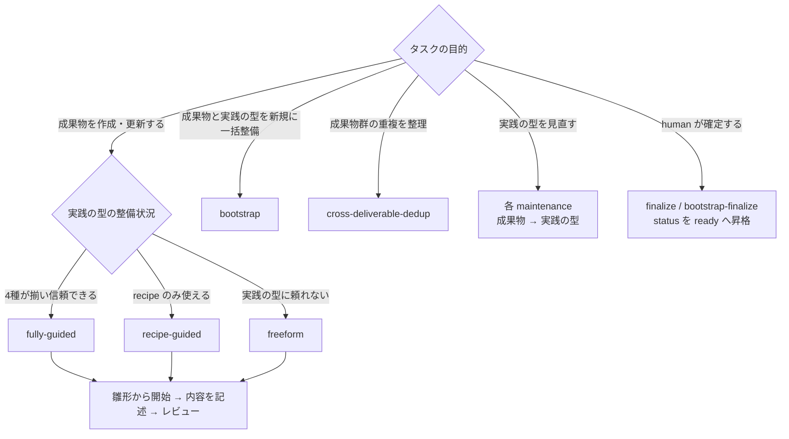

---
specdojo:
  id: kata-guide
  type: guide
  status: draft
---

# 実践の型活用ガイド

Kata Guide

SpecDojo で成果物を作成・更新・レビューするときに、rulebook / recipe / sample / template（実践の型）をどう使い分けるかを説明します。実践の型の整備状況に応じた進め方（`approach`）ごとに、雛形から書き始め、内容を記述し、レビューするまでの参照方針を整理します。

**対象読者**

- 成果物を作成・更新・レビューする人、エージェント

**この文書で分かること**

- rulebook・recipe・sample・template の使い分け、`approach` に応じた参照方法、実践の型メンテナンスとレビューへの適用

**次に読む文書**

- 実践の型そのものの種別と役割は [実践体系構成ガイド](practice-system-composition-guide.md) を参照してください。
- `approach` をタスクに設定し schedule で実行する方法は [Schedule設計ガイド](schedule-design-guide.md) を参照してください。

## 1. 実践の型の使い分け

実践の型は rulebook / recipe / sample / template の4種です。各種別の役割の正本は [実践体系構成ガイド](practice-system-composition-guide.md) とし、本章では成果物を書くときの使い方を示します。

| 種別     | 役割                           | 確認できること                                     |
| -------- | ------------------------------ | -------------------------------------------------- |
| rulebook | 成果物として成立するための規約 | 構造、必須項目、禁止事項                           |
| recipe   | 良い内容を書くための作り方     | 問い、観点、深掘り手順、レビュー観点               |
| sample   | 完成例                         | 粒度、文体、表の書き方                             |
| template | 成果物の雛形                   | 章構成の骨組み、記述すべき箇所を示すプレースホルダ |

成果物を書くときは、template があれば雛形として開始し、rulebook で構造・必須項目・禁止事項を確認し、recipe の問いと深掘り手順に沿って内容を組み立て、sample で粒度・文体・表の書き方を合わせます。

template は、記述する部分を _TODO_ などのプレースホルダとして配置した雛形です。内容が埋まった完成例である sample と役割を分担し、成果物作成の開始点として使います。

4 種類すべてが揃っているとは限りません。整備状況に応じてどこまで参照するかは、次章の `approach` で切り替えます。

## 2. 整備状況に応じた進め方（approach）

`approach`（進め方）は、対象成果物の rulebook / recipe / sample / template がどれだけ整備されているかに応じて、実践の型にどこまで寄りかかるかを選ぶプロファイルです。整備状況の判断は人が行い、エージェントは品質判定をせず、指定された `approach` に従います。手作業でも schedule 実行でも考え方は同じです。

### 2.1. approach の選び方

進め方は、まずタスクの目的で分かれ、成果物を作成・更新する場合は実践の型の整備状況でさらに分かれます。`fully-guided` / `recipe-guided` / `freeform` はいずれも「雛形から書き始め、内容を記述し、レビューする」という流れは共通で、実践の型をどこまで基準にするかが変わります。`bootstrap` / `cross-deliverable-dedup`・各 `*-maintenance`・`finalize` 系は、目的に応じて選ぶ特殊な進め方です。

### 2.2. approach 一覧

| `approach`                | 参照方針                                         | 進め方                                                                                                                                                                                                         |
| ------------------------- | ------------------------------------------------ | -------------------------------------------------------------------------------------------------------------------------------------------------------------------------------------------------------------- |
| `fully-guided`            | rulebook / recipe / sample / template を参照する | template があれば雛形として開始点に使い、rulebook で構造・必須要素・禁止事項を確認し、recipe の問いと深掘り手順に沿って内容を組み立て、sample で粒度・文体・表の書き方を合わせる。プレースホルダは残さず埋める |
| `recipe-guided`           | recipe を主に参照する                            | rulebook / sample / template は未成熟と判断されているため、recipe が示す構成・問い・観点だけを使って組み立てる。rulebook / sample / template が存在しても構造・文体の基準にはしない                            |
| `freeform`                | 実践の型に原則縛られない                         | 実践の型より、対象領域の類似成果物の実例やプロジェクト文脈（背景・目的・関係者の意図）を優先して組み立てる。実践の型は矛盾しない範囲の参考にとどめる                                                           |
| `bootstrap`               | 成果物と実践の型を同時に整備する                 | 成果物と rulebook / recipe / sample / template を同じタスクで初期作成し、構造・用語・粒度が互いに矛盾しない一式として揃える                                                                                    |
| `cross-deliverable-dedup` | 成果物群の正本選択と重複整理を行う               | scope 内の成果物だけを横断し、詳細を正本へ集約して他文書を要約・参照化する。実践の型は変更せず、各成果物の必須情報と追跡性を維持する                                                                           |
| `rulebook-maintenance`    | 成果物を根拠に rulebook を見直す                 | 参照の向きを「成果物 → rulebook」に切り替え、章構成・必須項目・禁止事項・判定基準の妥当性を見直す（「実践の型メンテナンスの進め方」を参照する）                                                                |
| `recipe-maintenance`      | 成果物を根拠に recipe を見直す                   | 参照の向きを「成果物 → recipe」に切り替え、問い・観点・深掘り手順・レビュー観点の有効性を見直す（「実践の型メンテナンスの進め方」を参照する）                                                                  |
| `sample-maintenance`      | 成果物を根拠に sample を見直す                   | 参照の向きを「成果物 → sample」に切り替え、粒度・文体・表の書き方が完成例として適切かを見直す（「実践の型メンテナンスの進め方」を参照する）                                                                    |
| `template-maintenance`    | 成果物を根拠に template を見直す                 | 参照の向きを「成果物 → template」に切り替え、章構成の骨組みとプレースホルダの配置・網羅性を見直す（「実践の型メンテナンスの進め方」を参照する）                                                                |
| `finalize`                | 成果物のみを human が確定する                    | human が `done_criteria` を最終確認し、必要なら最小限の修正を加えて、成果物 frontmatter の `status` を `ready` へ昇格する。実践の型は対象に含めない                                                            |
| `bootstrap-finalize`      | 成果物と実践の型を human がまとめて確定する      | `bootstrap` と対になる確定作業。human が成果物と rulebook / recipe / sample / template を最終確認し、それぞれの frontmatter の `status` を `ready` へ昇格する                                                  |

`finalize` / `bootstrap-finalize` は `execution: human` と組み合わせる確定プロファイルで、`ready` への昇格は human のみが行えます。`approach` を指定しない場合は、存在するすべての実践の型をそれぞれの役割に沿って活用します。schedule で `approach` をどこで設定し `exec build` でどう解決するかは [Schedule設計ガイド](schedule-design-guide.md) を参照してください。

これらの `approach` に沿って作業する plan は、`specdojo exec plan` または `specdojo exec run` で生成できます。plan・result の生成規則は [plan/resultライフサイクルガイド](plan-result-lifecycle-guide.md)、実行手順は [exec運用ガイド](exec-operation-guide.md) を参照してください。

### 2.3. 参照の共通原則

`approach` にかかわらず適用する原則です。

- 矛盾時の優先: `fully-guided` は rulebook（規約）を優先し、template の章構成が食い違っても rulebook を正とします。`recipe-guided` は rulebook を参照範囲に含めないため recipe を優先します。
- 参照範囲: `fully-guided` / `recipe-guided` および未指定では、対象成果物に紐づく実践の型・`depends_on` 成果物・プロジェクトコンテキスト（→ [CLI概要ガイド](cli-overview-guide.md)）に限定し、他のプロジェクト文書を独自に探索しません。`freeform` は類似実例やプロジェクト文脈を参照するため対象外です。
- 既存記述の尊重: `fully-guided` / `recipe-guided` および未指定では既存記述を尊重し、`depends_on` の最新の決定と矛盾する箇所のみ最小限を修正し、不足は加筆・補強します。`freeform` は対象外です。
- 判断根拠の記録: 参照した文書・しなかった文書とその理由を成果物または result に残します（特に `recipe-guided` / `freeform`）。後から実践の型を整備する材料になります。
- 判定基準の優先: `done_criteria` やレビュー観点（`RVP-NNN`）が判定基準を示す場合はそれらを優先します。本原則は、判定基準だけでは読み取れない「どこまで参照に照らすか」を補います。

## 3. 実践の型メンテナンスの進め方

`rulebook-maintenance` / `recipe-maintenance` / `sample-maintenance` / `template-maintenance` は、通常の成果物作業とは参照の向きが逆になる進め方です。作成・更新かレビューかを `mode`（`edit` / `review`）で表す点は他の `approach` と同じです。

| `approach`                                    | 参照の向き                                                           |
| --------------------------------------------- | -------------------------------------------------------------------- |
| `fully-guided` / `recipe-guided` / `freeform` | rulebook / recipe / sample / template → 成果物                       |
| `bootstrap`                                   | 成果物 ↔ rulebook / recipe / sample / template（一式として初期整備） |
| `cross-deliverable-dedup`                     | scope 内の成果物 ↔ 成果物（正本選択と参照化）                        |
| `rulebook-maintenance`                        | 成果物 → rulebook（参照の向きが逆になる）                            |
| `recipe-maintenance`                          | 成果物 → recipe（参照の向きが逆になる）                              |
| `sample-maintenance`                          | 成果物 → sample（参照の向きが逆になる）                              |
| `template-maintenance`                        | 成果物 → template（参照の向きが逆になる）                            |

メンテナンスのタスクでは、対象の実践の型を「見直す対象」として扱い、複数の成果物・review result・対象領域の慣行を根拠に、次の観点で妥当性を見直します。

| `approach`             | 見直す対象 | 主な見直し観点                                                   |
| ---------------------- | ---------- | ---------------------------------------------------------------- |
| `rulebook-maintenance` | rulebook   | 章構成、必須項目、禁止事項、判定基準                             |
| `recipe-maintenance`   | recipe     | 問い、観点、深掘り手順、レビュー観点                             |
| `sample-maintenance`   | sample     | 粒度、文体、表の書き方、完成例としての妥当性                     |
| `template-maintenance` | template   | 章構成の骨組み、プレースホルダの配置・網羅性、雛形としての妥当性 |

実践の型メンテナンスは自動で差し込まれません。schedule で実行する場合は、`approach: rulebook-maintenance` のように対象を指定した phase / phase_set を `sch-strategy-<track>.yaml` に明示的に記述します（[Schedule設計ガイド](schedule-design-guide.md)）。

## 4. review への適用

review でも「整備状況に応じた進め方（approach）」を同じ基準で適用します。レビューでは「成果物を組み立てる」のではなく「成果物が満たすべき基準に照らして確認する」ため、次のように読み替えます。

通常の成果物編集では観点別の自己レビューを行わず、`done_criteria` を「完了の狙い」として扱います。多観点での判定と証跡は独立したレビューが担います。以下の `approach` ごとの参照方針は、編集時の記述とレビューの双方に適用します。

- `fully-guided`: rulebook の必須要素・禁止事項、recipe の問いとレビュー観点、sample の粒度・文体との整合を確認します。template がある場合は、章構成が雛形と整合しているか、プレースホルダが残っていないかを確認します。
- `recipe-guided`: recipe の問いとレビュー観点に照らして確認し、rulebook / sample / template の構造・文体は基準にしません。
- `freeform`: 実践の型より、対象領域の類似成果物の実例やプロジェクト文脈との整合を確認します。
- `rulebook-maintenance` / `recipe-maintenance` / `sample-maintenance` / `template-maintenance`: 「実践の型メンテナンスの進め方」に従い、対象の実践の型が見直しに値するかという向きで確認観点を読み替えます。
- 判断の根拠をレビュー結果に残します。

## 5. 関連ドキュメント

- [実践体系構成ガイド](practice-system-composition-guide.md): 実践の型を含む実践体系の種別と役割
- [Schedule設計ガイド](schedule-design-guide.md): `approach` をタスクに設定し schedule で実行する方法
- [plan/resultライフサイクルガイド](plan-result-lifecycle-guide.md): `exec plan` / `exec run` による plan・result の生成・命名・再実行
- [exec運用ガイド](exec-operation-guide.md): exec plan を使った実行フロー
- [プロジェクト概要 作成レシピ](../recipes/prj-overview-recipe.md): rulebook / recipe / sample の役割分担の記述例
- [レビューガイド](review-guide.md): レビューの進め方と、実践の型の活用方法
- [CLI概要ガイド](cli-overview-guide.md): プロジェクトコンテキストなど plan 生成時に渡す設定
