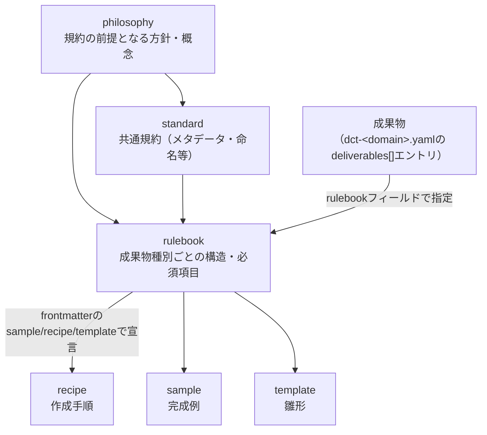

---
specdojo:
  id: practice-system-composition-guide
  type: guide
  status: ready
  based_on:
    - specdojo-overview-guide
    - docs-structure-guide
---

# 実践体系構成ガイド

Practice System Composition Guide

SpecDojo の実践体系（成果物の作成を支援する文書群）が、どの種別で構成され、各種別がどんな役割を持ち、成果物とどう結びつくかを示します。実践体系の全体像を記述する正本です。

**対象読者**

- 実践体系の全体像を把握したい利用者、支援文書を設計・保守する作成者、エージェント

**この文書で分かること**

- 実践体系を構成する8種別の役割、種別間の関係、成果物への紐付け（解決の仕組み）

**次に読む文書**

- `approach` に応じた rulebook / recipe / sample / template の参照方法は [実践の型活用ガイド](kata-guide.md) を参照してください。
- 文書の分類・ライフサイクル・配置は [ドキュメント構成ガイド](docs-structure-guide.md) を参照してください。

## 1. 実践体系とは

SpecDojo は、成果物（プロダクトとプロジェクトの内容そのもの）と、その作成を支援する文書群を分けて管理します。後者を実践体系と呼びます。

実践体系は成果物を再掲するものではなく、成果物を「なぜ・何を・どう書くか」を支える別の役割を担います。本書は実践体系の構成の正本であり、[全体概要ガイド](specdojo-overview-guide.md) の `実践体系の役割` は本書の概要にあたります。

## 2. 種別と役割

実践体系は次の8種類の文書で構成されます。各種別は同じ内容を再掲するのではなく、それぞれ異なる問いに答えます。

| 種別       | 答える問い                               | 使い方                                         |
| ---------- | ---------------------------------------- | ---------------------------------------------- |
| philosophy | なぜその規約なのか、何を基準に判断するか | 規約の前提となる方針・概念を理解               |
| standard   | 共通して従う規約は何か                   | メタデータ、命名、文書種別などの共通規約を確認 |
| rulebook   | この成果物には何を書くか                 | 成果物固有の章構成、項目、記述規則を確認       |
| recipe     | どのような手順と判断で作成するか         | 作成・更新の進め方を確認                       |
| template   | どの形から書き始めるか                   | 新しい成果物の雛形として使用                   |
| sample     | 完成した記述はどのようになるか           | 具体的な記述例として参照                       |
| guide      | 全体像や操作をどう理解すればよいか       | 複数の概念や一連の操作を理解                   |
| reference  | 特定の項目・コマンド・成果物は何か       | 一覧・比較・値を参照する                       |

template は記述する部分を _TODO_ などのプレースホルダとして配置した雛形で、内容が埋まった完成例である sample と役割を分担します。

ここでいう `reference` は文書種別です。exec plan が実行時に参照する実践の型（rulebook / recipe / sample / template）とは別の役割として扱います。

## 3. 種別間の関係と成果物への紐付け

各種別は相互に関係し、成果物には次のように紐づきます。philosophy が standard と rulebook の前提となり、rulebook を軸として recipe / sample / template が対応します。

| 実践体系                   | 成果物との紐付け方                                                             | 例                                 |
| -------------------------- | ------------------------------------------------------------------------------ | ---------------------------------- |
| philosophy                 | standard / rulebook が前提とする方針・概念。個別成果物への直接の紐付けはない   | needs-to-implementation-philosophy |
| standard                   | 全成果物・全 rulebook が共通して従う規約。個別成果物への直接の紐付けはない     | document-metadata-standard         |
| rulebook                   | 成果物カタログの `deliverables[].rulebook` フィールドで指定する                | `rulebook: prj-overview-rulebook`  |
| recipe / sample / template | 対応する rulebook の frontmatter（`recipe` / `sample` / `template`）で宣言する | `sample: dct-sample`               |
| guide / reference          | 個別成果物に紐づかない横断文書                                                 | 本ガイド自身                       |

## 4. 実践の型サブセットと活用

exec plan が実行時に参照するのは、実践体系のうち rulebook / recipe / sample / template の4種（実践の型）です。これらをどこまで参照するか（`approach` に応じた参照方針）は [実践の型活用ガイド](kata-guide.md) を正本とします。

philosophy / standard は全体に効く前提・共通規約として常に踏まえ、guide / reference は個別成果物に紐づかない横断文書として理解と参照に使います。

## 5. 関連ドキュメント

- [全体概要ガイド](specdojo-overview-guide.md): 実践体系を含む SpecDojo 全体像
- [実践の型活用ガイド](kata-guide.md): `approach` に応じた実践の型の参照方法
- [ドキュメント構成ガイド](docs-structure-guide.md): 文書の分類、命名、ディレクトリ配置
- [ドキュメントメタ情報標準](../standards/document-metadata-standard.md): 各種別の Frontmatter 規約
