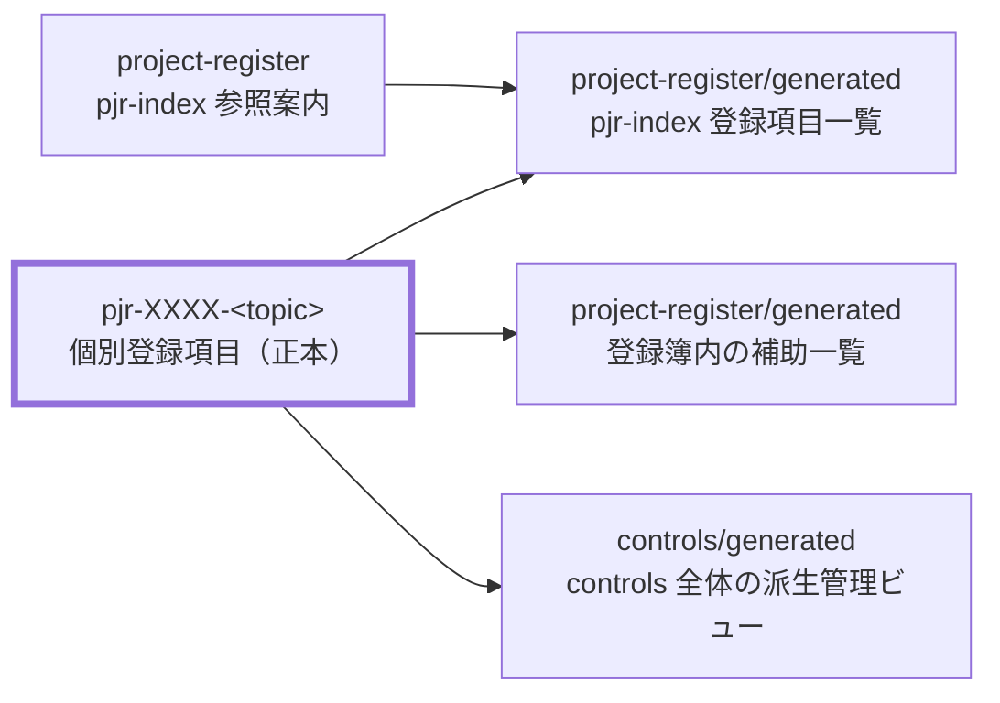

---
specdojo:
  id: specdojo:register-operation-guide
  type: guide
  status: ready
---

# 登録簿運用ガイド

Register Operation Guide

プロジェクト登録簿の使い方を説明します。登録の判断、type の選び方、状態遷移、個票の作成、完了時の記録、派生ビューの扱い、台帳の変更の追跡、agent 実行・定期実行との連携を扱います。登録簿の記述ルール（構造・列・値の定義）は [プロジェクト登録簿 作成ルール](../rulebooks/pjr-rulebook.md) を、コマンドの一覧は [CLIコマンドリファレンス](../references/command-reference.md) を正本とします。

**対象読者**

- プロジェクトの課題、リスク、変更要求、意思決定などを登録・更新・実行するプロジェクト管理者、担当者

**この文書で分かること**

- 登録簿へ記録する判断基準、type と状態遷移、個票・派生ビュー、台帳の変更履歴の追い方、agent・routine との連携

**次に読む文書**

- 登録項目の実行経路は [exec運用ガイド](exec-operation-guide.md)、コマンド詳細は [CLIコマンドリファレンス](../references/command-reference.md) を参照してください。

## 1. 登録簿の基本

登録簿が何を管理するか、いつ登録するか、type をどう選ぶかを示します。

### 1.1. 登録簿の位置づけ

プロジェクト登録簿は、プロジェクト立ち上げ時または進行中に発生する TODO、要確認事項、リスク、課題、変更要求、決定事項、備忘を一元管理する台帳です。

- 正本は各個票（`pjr-XXXX-<topic>.md`）です。登録項目一覧（`generated/pjr-index.md`）は個票から生成される一覧ビューです。
- `project-register/pjr-index.md` は、文書 ID `<project-id>:pjr-index` の解決先と生成一覧への導線を維持する追跡対象の案内ページです。登録項目の値は持ちません。
- 一覧と、状態別・優先度別・担当者別などの派生ビューは `generated/` 配下に生成される派生物であり、直接編集しません。
- 立ち上げ時は、未整理の問題・判断を `issue` / `question` / `decision` で記録し、合意した成果物カタログの作成を `todo` で追跡できます。
- 成果物カタログと依存関係に基づく計画済みの作業へ移った後は schedule で管理し、登録簿との二重管理をしません。進行中に発生した計画外の単発対応・調査・判断は、引き続き登録簿で追跡します（[exec運用ガイド](exec-operation-guide.md) の `実行経路の使い分け` を参照してください）。

関連ドキュメントの関係は次のとおりです。



登録簿の初期生成には `register scaffold` を使います。

```bash
specdojo register scaffold --project <project-id>
```

### 1.2. 登録の判断基準

次のいずれかに当てはまる事項は、その場で処理せず登録簿に登録します。

- 会議、レビュー指摘、作業中の気づき、外部からの依頼のうち、後で対応・確認・判断が必要なもの
- プロジェクト立ち上げ時に、目的・スコープ・対象成果物を決めるために調査または判断が必要なもの
- 「誰かが覚えている」状態になっており、担当と期限を付けて追跡したいもの
- すぐに結論が出ず、経緯や判断理由を後から参照する可能性があるもの

逆に、次の事項は登録しません。

- 計画済みの成果物作成・レビュー・確定の作業（schedule のタスクとして管理する）
- 成果物カタログへ定義し、Scheduleへ展開済みの作業（立ち上げ時の個票は結論を残して完了する）
- その場で完了し、後から追跡する必要がないもの

登録は `register add` で行います。ID は省略すると自動採番されます。

```bash
specdojo register add --project <project-id> --type todo --title "在庫初期データの登録"
```

`--priority` は次の目安で付けます（省略時は `medium`）。

| priority | 目安                             |
| -------- | -------------------------------- |
| `high`   | 放置すると他の作業や判断が止まる |
| `medium` | 期限までに対応が必要             |
| `low`    | 影響が限定的で、後回しにできる   |

### 1.3. type の選び方

値の一覧と個票 frontmatter の定義は [プロジェクト登録簿 作成ルール](../rulebooks/pjr-rulebook.md) と `register-item-frontmatter.schema.yaml` を正本とします。各 type の意味と、迷ったときの判断基準は次のとおりです。

| type             | 意味                                 | 迷ったとき                                                                                                  |
| ---------------- | ------------------------------------ | ----------------------------------------------------------------------------------------------------------- |
| `todo`           | 実施が決まっている作業               | 変更判断を伴うなら `change-request`、外部待ちは `todo`/`issue` に登録し `register wait` で `waiting` にする |
| `question`       | 回答・確認が必要な事項               | 共有だけでよいなら `note`、選択肢を決める判断なら `decision`                                                |
| `risk`           | まだ顕在化していない懸念             | すでに発生している問題なら `issue`                                                                          |
| `issue`          | 顕在化している問題                   | 未発生の懸念なら `risk`                                                                                     |
| `change-request` | 成果物・仕様・計画に対する変更の要望 | 実施が確定済みの作業なら `todo`                                                                             |
| `decision`       | 記録・追跡する意思決定               | 判断材料が足りず確認が先なら `question`                                                                     |
| `note`           | 共有・備忘のための記録               | 回答や結論が必要なら `question`                                                                             |

外部の対応・提供物への依存（外部待ち）には専用 type を設けない。対応が必要なら `todo` / `issue` として登録し、外部待ちで止まっている状態は `register wait` の `waiting` ステータスで表す。計画上の前提・制約・依存関係は `prj-assumptions-constraints-dependencies` 成果物へ整理する。

type は派生ビューの生成と `exec run --register` の挙動（`agent実行・定期実行との連携` を参照）に影響するため、内容が変質した場合は `register update` で見直します。

## 2. 登録項目のライフサイクル

登録から完了までの状態遷移、個票の扱い、完了時の記録、派生ビューを示します。

### 2.1. 状態遷移とコマンド

登録項目の状態はコマンドで遷移させます。手で status セルを書き換えるより、遷移ガードの効くコマンドを優先します。

| 場面                     | コマンド          | 遷移後の状態                                   |
| ------------------------ | ----------------- | ---------------------------------------------- |
| 登録する                 | `register add`    | `open`                                         |
| 着手する                 | `register start`  | `in-progress`                                  |
| 他者・外部の対応を待つ   | `register wait`   | `waiting`                                      |
| 確認・レビューに回す     | `register review` | `review`                                       |
| 完了する                 | `register close`  | `done`（`decision` / `question` は `decided`） |
| 対応しないと判断する     | `register reject` | `rejected`                                     |
| 延期する                 | `register defer`  | `deferred`                                     |
| 終了済み項目を再開する   | `register reopen` | `open`                                         |
| 担当・期限などを変更する | `register update` | （状態は変えずフィールドを更新）               |

- 担当や期限が未定のまま登録する場合は、空欄ではなく _TODO_ のままにしておき、決まり次第 `register update` で埋めます。
- 「登録日」は起票日を表す個票 Frontmatter の `registered_on` で、`register add` が自動記入します。ID が乱数化され採番順から起票順を追えないため、生成一覧の行の並びに依存せず起票順を辿る手がかりになります。過去の項目で日付が不明な場合は値を推測せず、キーを省略します。
- 登録日と完了日の日付は OS / コンテナの `TZ` 環境変数に依存させず、config の `run.register_date_timezone`（IANA タイムゾーン名、既定 `UTC`）で明示的に決めます。日本時間で運用する場合は次のように設定します。

```json
{
  "projects": {
    "prj-0001": {
      "run": { "register_date_timezone": "Asia/Tokyo" }
    }
  }
}
```

- 動いていない `open` や期限切れの項目は放置せず、期限の更新、優先度の見直し、`defer` / `reject` のいずれかへ整理します。

すべての登録項目は個票（`pjr-XXXX-<topic>.md`）を持ちます。`close` / `reject` は処理状態の遷移とあわせて個票 Frontmatter の `status`（文書成熟度）も更新します。処理状態とは別の状態軸であり、遷移基準は [プロジェクト登録簿 作成ルール](../rulebooks/pjr-rulebook.md) の `個票 status の遷移基準` を正本とします。

| コマンド          | 個票 `status` の遷移 | 条件                                                                       |
| ----------------- | -------------------- | -------------------------------------------------------------------------- |
| `register close`  | `draft` → `ready`    | 必須節に `_TODO_` が残っていないこと（残る場合は昇格せず警告して据え置く） |
| `register reject` | → `deprecated`       | 条件なし                                                                   |

- 変更前に確認したい場合は `--dry-run` を付けると、個票 Frontmatter の変更予定と再生成されるビューを表示します。

### 2.2. 個票の作成

すべての登録項目は、type 別のテンプレート（`pjr-todo-template.md` など `pjr-<type>-template.md`）から作る個票です。`register add` は個票の Frontmatter に構造化フィールドを書き込み、H1 と本文にタイトル・説明を置きます。

```bash
specdojo register add \
  --project <project-id> \
  --type risk \
  --title "タブレット故障時の営業継続" \
  --topic tablet-failure-fallback
```

個票を作成後、タイトル・説明・構造化フィールドを変更する場合も個票を正本として扱います。生成一覧へ直接追記・修正しません。

### 2.3. 完了時の記録

`close` / `reject` / `defer` するときは、完了日と結論を残します。結論は「何をどう判断したか」が 1 文で分かる形にします。

```bash
specdojo register close \
  --project <project-id> \
  --id PJR-0005 \
  --conclusion "取消処理で在庫数を戻すよう修正"
```

- `done` / `decided`: 対応内容または決定内容を書きます。
- `rejected`: 却下の理由を書きます。
- `deferred`: 再開の条件または再評価のタイミングを書きます。

結論が残っていない終了項目は、後から経緯を追えなくなるため、close 前に埋めます。

### 2.4. 派生ビューの扱い

登録項目一覧と派生ビューは、個票を入力として `register build` で生成します。

```bash
specdojo register build --project <project-id>
```

- `project-register/generated/` には登録項目一覧（`pjr-index.md`）と登録簿内の補助一覧（状態別・優先度別・担当者別）が生成されます。
- `project-register/pjr-index.md` は追跡対象の案内ページです。個票の `part_of` と本文の wikilink はこの文書 ID を参照し、本文から生成一覧へ移動できます。
- `controls/generated/` には controls 全体の type 別管理ビュー（リスク登録簿、課題ログ、変更要求ログ、決定記録）が生成されます。
- `generated/` 配下は追跡対象外の生成物です。生成ファイルを手編集しても次回の `register build` で失われるため、内容を直したい場合は個票を修正して再生成します。
- 行の並びは表示 ID の昇順に固定されます。同じ個票の集合からは常に同じ内容が生成されます。

一覧・派生ビューのテーブルのタイトル行（列名の行）は、コードではなく `pjr-index-template.md` の「登録項目一覧」テーブルのタイトル行をそのまま継承します。列名を変更したい場合は、生成ファイルを直接編集せず、次を修正してから `register build` で再生成します。

- 列名の実値: `pjr-index-template.md` のタイトル行
- 列の追加・削除・改名を伴う規範変更: [プロジェクト登録簿 作成ルール](../rulebooks/pjr-rulebook.md) の「登録項目一覧の標準列」

派生ビューの見出し（`台帳ビュー`、`リスク登録簿` など）や再生成注記は、各派生ビューの雛形（`pjr-views-by-status-template.md`、`pjr-views-by-priority-template.md`、`pjr-views-by-owner-template.md`、`pm-<name>-template.md`）が持つため、そちらを修正して再生成します。

### 2.5. 台帳の変更を追う

個票 Frontmatter が正本になったため、台帳全体の変更を1ファイル（旧 `pjr-index.md`）の差分で追うことはできません。台帳の変化は、目的別に次の手段で追います。

| 目的                           | 手段                                 | 操作                                                                         |
| ------------------------------ | ------------------------------------ | ---------------------------------------------------------------------------- |
| いま台帳がどうなっているか     | 生成された一覧・派生ビュー           | `register build` で生成した `generated/pjr-index.md` を読む                  |
| ある期間に何が起きたか（監査） | `register history`                   | `specdojo register history --project <project-id> --since <date>`            |
| 変更の妥当性をレビューする     | pull request の個票 Frontmatter 差分 | PR の Files changed で `project-register/pjr-*.md` の Frontmatter を確認する |
| 1つの項目の経緯を追う          | 個票の Git 履歴                      | `git log -p -- <個票パス>`                                                   |

`register history` は登録簿ディレクトリの Git 履歴から、項目単位の変更を古い順に再構成します。比較する項目は登録項目一覧の列（ステータス・タイトル・説明・分類・優先度・担当・登録日・期限・完了日・結論）で、表を正本にしていたときの一覧差分と同じ粒度です。

```bash
# 期間を指定して台帳の変化を一覧する
specdojo register history --project <project-id> --since 2026-08-01 --until 2026-08-31

# 追加・削除・状態遷移だけに絞る（月次レビューや監査向け）
specdojo register history --project <project-id> --since 2026-08-01 --status-only

# 特定の項目の経緯だけを追う
specdojo register history --project <project-id> --id PJR-0012 PJR-0013

# 集計・証跡化する場合は JSON で出力する
specdojo register history --project <project-id> --since 2026-08-01 --json
```

出力は「日付・短縮コミット・項目 ID・種別（`added` / `updated` / `removed`）・変更内容・コミット件名」を並べた 1 行 1 イベントです。

```text
2026-08-01  abc1234  PJR-0012  added    status=open, title=在庫初期データの登録, type=todo, priority=high, owner=PM  # docs(prj-0001): add PJR-0012
2026-08-09  def5678  PJR-0012  updated  status: open -> done; completed: - -> 2026-08-09  # docs(prj-0001): close PJR-0012
```

- 一覧の列に現れない変更（本文の推敲、個票 `status` の昇格など）はイベントになりません。個票の全差分が必要な場合は `git log -p` を使います。
- `--status-only` は追加・削除・状態遷移だけを残し、変更内容も遷移に関わる項目（`status` / `type` / `completed` / `conclusion`）へ絞ります。
- `renumber` による ID 付け替えは、`id` の変更を含む `updated` イベントとして現れます。
- 監査で「ある期間の登録項目の追加・状態遷移」を再構成する場合は、`--since` と `--until` で期間を区切り、`--status-only` を付けて実行します。誰がいつ変更したかはコミット（短縮 SHA）から辿ります。
- 生成物（`generated/` 配下）は追跡対象外のため、PR の差分にも Git 履歴にも現れません。レビューと履歴の対象は常に個票です。
- 個票へ移行する前（`pjr-index.md` の表が正本だった期間）の履歴は、削除済みの一覧ファイルの履歴に残ります。`git log -p --follow -- <登録簿ディレクトリ>/pjr-index.md` で参照します。

### 2.6. 承認フローと承認者

承認を要する type（`change-request` / `decision` / `risk` / `question` / `issue`）について、承認の種類・状態遷移・承認方式・承認者を次のとおり運用します。

まず承認には 2 種類があり、混同しません。

- 成果物レビュー: agent 生成物の妥当性確認です。exec の `review` 状態と review result、`register close` で成立します。
- 内容承認: 権限者が判断・変更・対応方針そのものを承認する行為です。チケット個票の「審査・決定」「採択理由」「対応方針」「承認」節が担います。本節が対象とするのは主に内容承認です。

承認は register の状態遷移に沿って進めます。`review` で承認に回し、`close`（`done` / `decided`）・`reject`・`defer`・`wait` のいずれかで終端または保留します。

| type             | 承認方式（既定）             | 承認の状態遷移                           | 承認者（RACI の A）      |
| ---------------- | ---------------------------- | ---------------------------------------- | ------------------------ |
| `change-request` | PR ベース                    | `review` → PR approve → `close`          | 変更承認権限者（PO/CCB） |
| `decision`       | commit ベース                | 決定者を承認節に記入し `close`→`decided` | 意思決定者               |
| `risk`           | commit ベース                | 対応方針を記入し `close` / `defer`       | リスクオーナー           |
| `question`       | commit ベース                | 回答者を承認節に記入し `close`→`decided` | 回答権限者               |
| `issue`          | commit ベース（exec review） | exec `review` → `close`                  | 課題リード               |
| `todo`           | commit ベース（exec review） | exec `review` → `close`                  | -                        |
| 全 type 共通     | PR ベース                    | `develop → main` 昇格                    | リポジトリ管理者         |

- 承認方式は既定 commit とし、PR を強制するのは `develop → main` 昇格 / `change-request` 承認 / 不可逆・高リスク・framework schema 破壊的変更（`todo` / `issue` / `decision` の一部）の 3 ケースに限定します。判定条件は [Git ブランチ運用標準](../standards/git-branching-standard.md) の `承認ゲートと PR 強制条件` を正本とします。
- 承認者ロール（RACI の A）は pm-raci と整合させ、`change-request` は変更承認権限者（PO/CCB）、`decision` / `question` は当該領域の意思決定者・回答権限者を割り当てます。
- PR 強制ケースの承認者強制は `main` / `develop` の branch protection と `CODEOWNERS` で担保します。commit ベースの承認は `decision` / `question` 個票の承認節（決定者・決定日 / 回答者・回答日）で承認者と承認日を残します。
- PR 承認を併用する具体的な運用手順は `PO 留保事項の PR 承認運用` を参照します。

## 3. agent実行・定期実行との連携

登録項目は `exec run --register` で agent に実行させられます。

```bash
specdojo exec run --project <project-id> --register PJR-0012

# 複数項目を指定順に直列実行する（成功IDごとにcommit、途中失敗でも継続）
specdojo exec run --project <project-id> --register PJR-0012 PJR-0013 --register-commit --on-failure continue

# 成果物を worktree に隔離して実行し、統合ブランチへ merge back する
specdojo exec run --project <project-id> --register PJR-0012 --worktree

# worktree 隔離のまま複数項目を並列実行する
specdojo exec run --project <project-id> --register PJR-0012 PJR-0013 --worktree --parallel 2
```

- type が `todo` / `issue` / `change-request` の項目は成果物・実装を変更する対応、`question` / `risk` の項目は調査して結論案を result に記録する対応になります。`decision` / `note` は実行対象外です。
- 状態は register の遷移（`in-progress` / `review` / `waiting`）で追跡され、agent は項目を終端化しません。成功後は人が内容を確認して `register close` します。
- `--register` には複数の PJR-ID を空白区切り・カンマ区切り（またはその混在）で渡せます。指定順に1件ずつ実行し、各IDが plan/result 生成・開始・agent実行・状態遷移まで完結してから次へ進みます。重複したIDは最初の1件だけを実行します。
- 全ID処理後にID別の成否・状態遷移・commit 結果を一覧表示します。いずれかが失敗した場合は終了コード 1 で終了します。
- `--register-commit` を付けると成功IDごとに、その実行で生じた変更だけをcommitします（実行前から作業ツリーにある利用者の変更は含めません）。`--on-failure`（`stop` 既定 / `continue`）で途中失敗時に停止するか継続するかを選びます。`stop` では失敗以降のIDが skipped として記録されます。
- 既定は in-place の直列実行で、変更は作業ツリーに残ります（`--register-commit` を付けると commit します）。
- `--worktree` を付けると、成果物の変更を git worktree に隔離して実行し、成功時に統合ブランチへ merge back します。task worktree では root と package-lock 付き独立 package ごとに `npm ci` を実行し、書き込み可能な独立 `node_modules` を準備してから agent を起動します。状態遷移（`start` / `review` / `waiting`）は統合ブランチ側で直列化されます。worktree モードは常に commit するため `--register-commit` は無視されます（指定すると注記を表示します）。
- `--worktree` と併用する場合に限り `--parallel <n>` で複数項目を並列実行できます。状態遷移は直列化され、成果物は項目ごとの worktree に隔離されます。`--parallel` を単独（`--worktree` なし）で指定するとエラーになります。失敗時は当該項目の worktree を保持します（調査・再実行のため）。
- 実行せずに plan の内容だけ確認したい場合は `exec plan --register <PJR-ID>` を使います。
- open な項目の定期スイープなど、時刻条件で繰り返す場合は routine（`rtn-*.yaml`）を使います。

`--register-commit` は、登録簿の状態遷移・派生ビュー・当該IDの plan/result を runner 管理パスとして commit 対象に含めます。pre-commit hook が対象ファイルを整形した場合は、同じ commit へ収束するまで amend します。収束後も対象差分が残る場合は `incomplete` の失敗として一覧と終了コードへ反映します。既定は無効で、変更は作業ツリーに残ります。

実行前に、過去の register 実行が残した未 commit の plan/result を検出した場合は、現在のIDへ暗黙に混ぜず警告します。警告されたファイルを確認・整理してから再実行してください。

実行フローの詳細は [exec運用ガイド](exec-operation-guide.md) を参照します。

## 4. 例外対応と特殊な運用

ID 重複の復旧と PO 留保事項の承認運用など、通常運用から外れる場面を扱います。

### 4.1. PJR-ID 重複の検知と復旧

`register add` は既存個票の ID を避けてランダムに採番します。並行起票、rebase、cherry-pick などで重複が混入した場合は、個票の検証と `register build` が検出します。

重複は検証で必ず落ちます。次の検証は VSCode のリアルタイム検証と CI の両方で機能します。

```bash
npx tsx src/specdojo.ts register build --project <project-id>
```

- 個票の表示 ID が重複した場合、重複 ID と該当ファイルを示してエラーになります。
- 個票の Frontmatter ID とファイル名 `pjr-XXXX-<topic>.md` の対応が取れていない場合もエラーになります。

重複や衝突を検出したら、`register renumber` で片方の項目を未使用の PJR-ID へ移します。

```bash
# まず変更対象を確認する
specdojo register renumber --project <project-id> --id PJR-0137 --to PJR-0140 --dry-run

# 問題なければ適用する
specdojo register renumber --project <project-id> --id PJR-0137 --to PJR-0140
```

- 個票ファイル名・個票 Frontmatter の `id`・他文書からの参照リンク・exec plan / result の `targets` を同時に付け替え、一覧・派生ビューを再生成します。
- 移動先 ID が既に使われている場合は何も書き換えずにエラー終了するため、部分適用は残りません。
- 付け替え後は派生ビューも再生成されます。移動先 ID は任意の未使用 ID を選べます。自動採番は既存 ID を避けて再抽選するため、以後の採番と衝突する心配はありません。

### 4.2. PO 留保事項の PR 承認運用

プロジェクト憲章の権限委譲章で PO の承認を要する事項（PO 留保事項）は、decision 個票の起票だけでなく pull request のレビュー承認を併用します。個票のセル文字列だけでは作成者と承認者が分離されず自己承認になりうるため、承認者・承認日時・承認対象差分を platform 側で担保します。

- decision 個票は決定内容の SSOT（背景・選択肢・決定・理由）として、リポジトリ内に恒久保持します。
- pull request は承認イベント（誰がいつ何を承認したか）の担保に用います。
- 相互リンク: 個票の承認章に PR URL と merge SHA を本文テキストで記録し、PR 説明には対象 decision 個票の `id` を記載します。PR URL と merge SHA を本文へ転記することで、platform に依存せずリポジトリ内だけで承認事実を追跡できます。

承認フローは次の順で行います。

1. 決定内容を decision 個票へ記録します。
2. 承認対象の差分を pull request として作成し、PR 説明に対象個票の `id` を書きます。
3. PO が PR をレビューして approve します。作成者自身の承認は職務分離のため承認としてカウントしません。
4. merge 後、個票または憲章の承認章へ承認日・承認者・承認対象・証跡リンク（PR URL・merge SHA）を書き戻します。

PR 承認が必要な決定範囲（憲章の PO 留保事項）、branch 保護 / CODEOWNERS 方針の詳細は、当該プロジェクトの登録項目（例: `pjr-0126-pr-based-po-approval`）で定義します。schedule 上の計画済みタスクによる通常の成果物更新や日常の agent コミットは、PR 承認の対象外です。

### 4.3. PJR-ID の採番

- PJR-ID の乱数部分は、曖昧文字（`I` / `L` / `O` / `U`）を除いた英大文字+数字の 32 文字セットによる 4 桁のランダム値である。例: `PJR-4B7K`。
- `register add` は現在の作業ツリーに個票を作成し、既存 ID または簡易な不適切語ブロックリストに一致した候補は再抽選する。
- 統合ブランチへの自動ルーティング、予約起票、同期用オプションは廃止済みである。廃止済みのオプションを指定した場合は未知オプションとしてエラー終了する。
