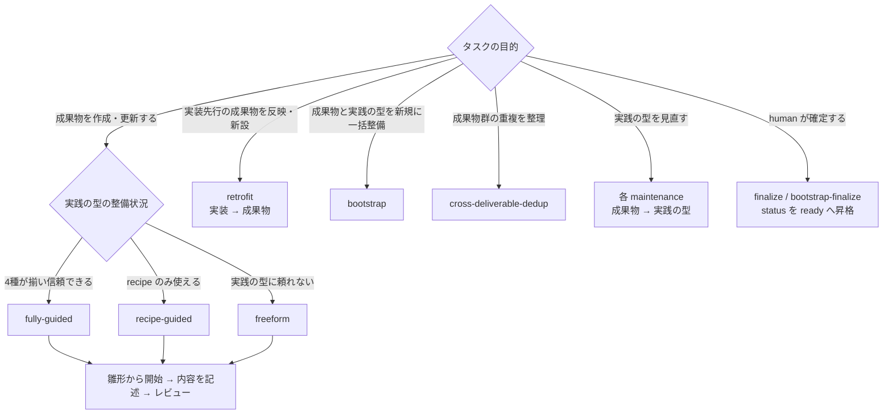
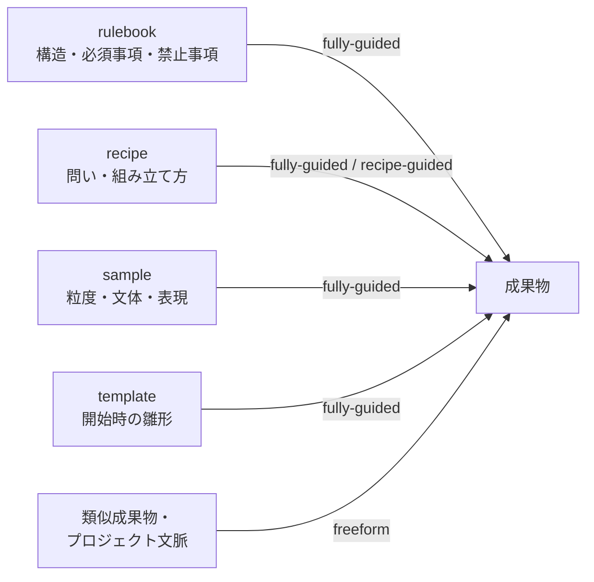
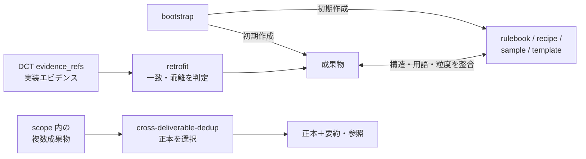
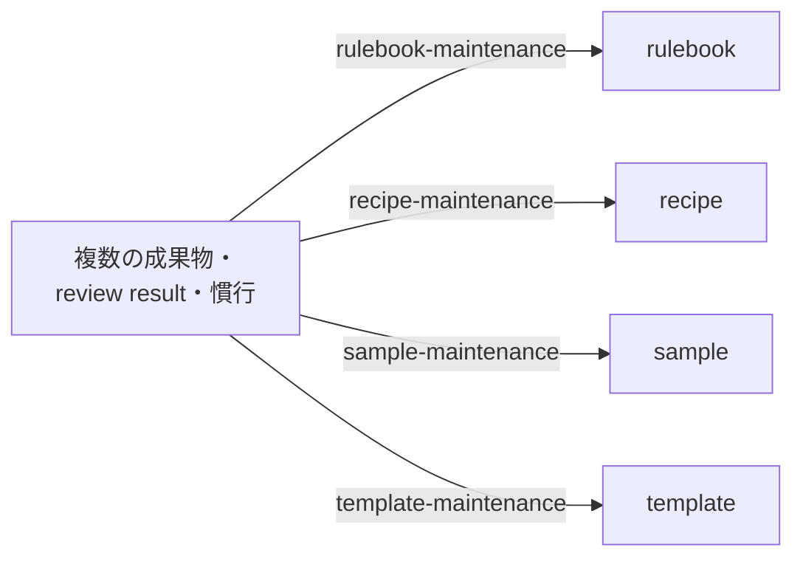
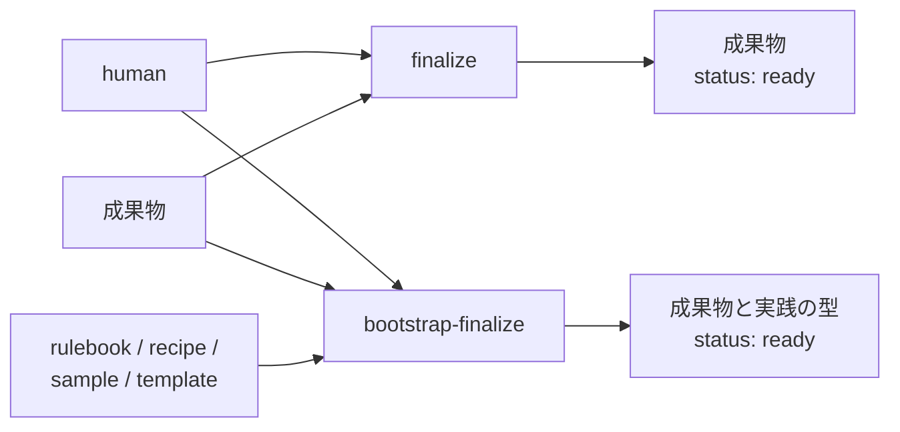

---
specdojo:
  id: specdojo:ryu-guide
  type: guide
  status: draft
---

# 実践の進め方ガイド

Ryu Guide

タスクの目的と実践の型（rulebook / recipe / sample / template）の整備状況に応じて、成果物の作成・更新・レビューをどの進め方（`approach`）で進めるかを説明します。

SpecDojo は道場のメタファーとして、進め方（`approach`）を「Ryu（流）」と呼びます。「Ryu」は本ガイドで進め方を説明するための愛称・分類であり、`approach` フィールドの名称や値そのもの（`fully-guided` など）を変更するものではありません。実際のフィールド名・値は従来どおりです。

**対象読者**

- 成果物を作成・更新・レビューする人、エージェント

**この文書で分かること**

- `approach` の選び方と一覧、参照の共通原則、実践の型メンテナンスの進め方、review への適用

**次に読む文書**

- 実践の型そのものの役割と使い分けは [実践の型活用ガイド](kata-guide.md) を参照してください。
- `approach` をタスクに設定し schedule で実行する方法は [Schedule設計ガイド](schedule-design-guide.md) を参照してください。

## 1. 整備状況に応じた進め方（approach）

`approach`（進め方）は、タスクの目的と、対象成果物の rulebook / recipe / sample / template がどれだけ整備されているかに応じて選ぶプロファイルです。整備状況とタスク目的の判断は人が行い、エージェントは指定された `approach` に従います。手作業でも schedule 実行でも考え方は同じです。

実践の型そのものの役割と使い分けは [実践の型活用ガイド](kata-guide.md) を参照してください。本ガイドは、それらを `approach` に応じてどこまで基準にするかという進め方を扱います。

### 1.1. approach の選び方

進め方は、まずタスクの目的で分かれ、通常の成果物作成・更新では実践の型の整備状況でさらに分かれます。`fully-guided` / `recipe-guided` / `freeform` は実践の型をどこまで基準にするかを表します。`retrofit` は実装先行時の現在動作調査、`bootstrap` / `cross-deliverable-dedup`・各 `*-maintenance`・`finalize` 系は、それぞれの目的に応じて選ぶ進め方です。

### 1.2. approach 一覧

`approach` は、目的に応じて「成果物の作成・更新」「初期整備・実装反映・横断整理」「実践の型のメンテナンス」「human による確定」の4種に分けられます。以下の表にある edit / review は plan テンプレート、result は実行記録のテンプレートです。テンプレートには各 `approach` で行う具体的な手順が定義されています。mode や execution に対応する専用テンプレートがない場合のフォールバック規則は [plan/resultライフサイクルガイド](plan-result-lifecycle-guide.md) を参照してください。

#### 1.2.1. 成果物の作成・更新

実践の型をどこまで作成・更新の基準にするかを切り替える進め方です。

| `approach`      | 参照方針と進め方                                                                                                                                               | 対応テンプレート                                                                                          |
| --------------- | -------------------------------------------------------------------------------------------------------------------------------------------------------------- | --------------------------------------------------------------------------------------------------------- |
| `fully-guided`  | rulebook / recipe / sample / template をそれぞれの役割に沿って使う。template から開始し、プレースホルダを残さず、rulebook と矛盾する場合は rulebook を正とする | [edit](../templates/xep-fully-guided-template.md) / [review](../templates/xrp-fully-guided-template.md)   |
| `recipe-guided` | recipe が示す構成・問い・観点を主基準にする。rulebook / sample / template が存在しても、構造・文体の基準にはしない                                             | [edit](../templates/xep-recipe-guided-template.md) / [review](../templates/xrp-recipe-guided-template.md) |
| `freeform`      | 実践の型より、対象領域の類似成果物やプロジェクト文脈を優先する。実践の型は矛盾しない範囲の参考にとどめる                                                       | [edit](../templates/xep-freeform-template.md) / [review](../templates/xrp-freeform-template.md)           |

#### 1.2.2. 初期整備・実装反映・横断整理

成果物と実践の型を一式で立ち上げる場合、既存実装から成果物を補正する場合、または複数成果物の重複を整理する場合に使います。

| `approach`                | 参照方針と進め方                                                                                                                      | 対応テンプレート                                                                                                              |
| ------------------------- | ------------------------------------------------------------------------------------------------------------------------------------- | ----------------------------------------------------------------------------------------------------------------------------- |
| `bootstrap`               | 成果物と rulebook / recipe / sample / template を同じタスクで初期作成し、互いに矛盾しない一式として揃える                             | [edit](../templates/xep-bootstrap-template.md)                                                                                |
| `retrofit`                | DCT の `evidence_refs` を読み、現在動作・意図された仕様・`done_criteria` を照合して、成果物の維持・部分反映・作り直し・新設を判断する | [edit](../templates/xep-retrofit-template.md) / [review](../templates/xrp-retrofit-template.md)                               |
| `cross-deliverable-dedup` | scope 内の成果物から正本を選び、他文書の重複を要約・参照へ置き換える。実践の型は変更せず、各成果物の必須情報と追跡性を維持する        | [edit](../templates/xep-cross-deliverable-dedup-template.md) / [result](../templates/xer-cross-deliverable-dedup-template.md) |

`retrofit` では、実装を現在動作（AS-IS）の根拠、既存成果物・決定記録・プロジェクトコンテキストを意図された仕様の根拠、`done_criteria` を成果物が満たすべき目的として扱います。三者が一致すれば成果物へ反映し、実装が意図された仕様と異なる場合は実装へ無条件に合わせず、乖離と修正対象候補を result に記録します。実装から確認できない目的・業務判断・将来方針は推測しません。

#### 1.2.3. 実践の型のメンテナンス

通常の成果物作業とは参照の向きを逆にし、成果物や review result を根拠として対象の実践の型を見直します。

| `approach`             | 見直す対象 | 対応テンプレート                                                                                                        |
| ---------------------- | ---------- | ----------------------------------------------------------------------------------------------------------------------- |
| `rulebook-maintenance` | rulebook   | [edit](../templates/xep-rulebook-maintenance-template.md) / [review](../templates/xrp-rulebook-maintenance-template.md) |
| `recipe-maintenance`   | recipe     | [edit](../templates/xep-recipe-maintenance-template.md) / [review](../templates/xrp-recipe-maintenance-template.md)     |
| `sample-maintenance`   | sample     | [edit](../templates/xep-sample-maintenance-template.md) / [review](../templates/xrp-sample-maintenance-template.md)     |
| `template-maintenance` | template   | [edit](../templates/xep-template-maintenance-template.md) / [review](../templates/xrp-template-maintenance-template.md) |

#### 1.2.4. human による確定

`execution: human` と組み合わせ、確認対象の `status` を `ready` へ昇格する確定プロファイルです。`ready` への昇格は human のみが行えます。

| `approach`           | 確定対象と進め方                                                                                                               | 対応テンプレート                                                |
| -------------------- | ------------------------------------------------------------------------------------------------------------------------------ | --------------------------------------------------------------- |
| `finalize`           | human が `done_criteria` を確認し、必要なら最小限の修正を加え、成果物のみを `ready` へ昇格する                                 | [result](../templates/xer-human-finalize-template.md)           |
| `bootstrap-finalize` | `bootstrap` と対になり、human が成果物と rulebook / recipe / sample / template をまとめて確認し、それぞれを `ready` へ昇格する | [result](../templates/xer-human-bootstrap-finalize-template.md) |

`approach` を指定しない場合は、存在するすべての実践の型をそれぞれの役割に沿って活用します。schedule で `approach` をどこで設定し `exec refresh` でどう解決するかは [Schedule設計ガイド](schedule-design-guide.md) を参照してください。

これらの `approach` に沿って作業する plan は、`specdojo exec plan` または `specdojo exec run` で生成できます。plan・result の生成規則は [plan/resultライフサイクルガイド](plan-result-lifecycle-guide.md)、実行手順は [exec運用ガイド](exec-operation-guide.md) を参照してください。

### 1.3. 参照の共通原則

`approach` にかかわらず適用する原則です。

- 矛盾時の優先: `fully-guided` は rulebook（規約）を優先し、template の章構成が食い違っても rulebook を正とします。`recipe-guided` は rulebook を参照範囲に含めないため recipe を優先します。
- 参照範囲: `fully-guided` / `recipe-guided` および未指定では、対象成果物に紐づく実践の型・`depends_on` 成果物・プロジェクトコンテキスト（→ [遂行の技活用ガイド](waza-guide.md)）に限定し、他のプロジェクト文書を独自に探索しません。`freeform` は類似実例やプロジェクト文脈を参照するため対象外です。
- 既存記述の尊重: `fully-guided` / `recipe-guided` および未指定では既存記述を尊重し、`depends_on` の最新の決定と矛盾する箇所、および参照範囲に含む実践の型に適合しない箇所（rulebook を参照範囲に含む `fully-guided` / 未指定では、rulebook の必須要素の欠落・禁止事項への抵触・章構成の不適合）のみ最小限を修正し、不足は加筆・補強します。実践の型への適合は内容の全面書き換えではなく、既存記述を保持したままの章立ての移し替えと必須要素の補完として行います。あわせて、同一成果物内で重複している記述は正本を1箇所に定めて統合し、参照範囲に含む実践の型の必須要素にも `done_criteria` にも寄与しない記述は削除します（rulebook を参照範囲に含む `fully-guided` / 未指定では rulebook の必須要素が基準）。統合・削除は既存記述の尊重の例外であり、判断根拠を result に記録することで担保します。`freeform` は対象外です。上記のいずれにも該当しない場合（完成度・整合性・読みやすさの向上など）は、それだけを理由に修正しません。rulebook が複数の構成を許容している場合（例: 領域単位・グループ単位のいずれの粒度も認める場合）、他章との見た目の整合を理由により詳細な構成へ書き換えません。
- 根拠のない具体化の禁止: `freeform` を除き、ファイルパス・コマンド・設定値など実装や設定の実態を示す記述を新たに書き加える場合、参照範囲の文書（rulebook / recipe / `depends_on` 成果物・プロジェクトコンテキスト、`retrofit` では `evidence_refs`）で裏付けが取れる場合に限ります。既存記述が曖昧・不完全でも、裏付けが無ければ完成度を上げる目的だけで断定的に具体化しません。裏付けの無い箇所は _TODO_ / _ASSUMPTION_ として論点を残します。review では、対象成果物中の具体的記述が参照範囲の文書で裏付けられているかを確認し、裏付けが確認できない場合は unclear として findings に残します。
- 判断根拠の記録: 参照した文書・しなかった文書とその理由を成果物または result に残します（特に `recipe-guided` / `freeform`）。後から実践の型を整備する材料になります。
- 判定基準の優先: `done_criteria` やレビュー観点（`RVP-NNN`）が判定基準を示す場合はそれらを優先します。本原則は、判定基準だけでは読み取れない「どこまで参照に照らすか」を補います。

## 2. 実践の型メンテナンスの進め方

`rulebook-maintenance` / `recipe-maintenance` / `sample-maintenance` / `template-maintenance` は、通常の成果物作業とは参照の向きが逆になる進め方です。作成・更新かレビューかを `mode`（`edit` / `review`）で表す点は他の `approach` と同じです。

メンテナンスのタスクでは、対象の実践の型を「見直す対象」として扱い、複数の成果物・review result・対象領域の慣行を根拠に、次の観点で妥当性を見直します。

| `approach`             | 見直す対象 | 主な見直し観点                                                   |
| ---------------------- | ---------- | ---------------------------------------------------------------- |
| `rulebook-maintenance` | rulebook   | 章構成、必須項目、禁止事項、判定基準                             |
| `recipe-maintenance`   | recipe     | 問い、観点、深掘り手順、レビュー観点                             |
| `sample-maintenance`   | sample     | 粒度、文体、表の書き方、完成例としての妥当性                     |
| `template-maintenance` | template   | 章構成の骨組み、プレースホルダの配置・網羅性、雛形としての妥当性 |

実践の型メンテナンスは自動で差し込まれません。schedule で実行する場合は、`approach: rulebook-maintenance` のように対象を指定した phase / phase_set を `sch-strategy-<track>.yaml` に明示的に記述します（[Schedule設計ガイド](schedule-design-guide.md)）。

## 3. review への適用

review でも「整備状況に応じた進め方（approach）」を同じ基準で適用します。レビューでは「成果物を組み立てる」のではなく「成果物が満たすべき基準に照らして確認する」ため、次のように読み替えます。

通常の成果物編集では観点別の自己レビューを行わず、`done_criteria` を「完了の狙い」として扱います。多観点での判定と証跡は独立したレビューが担います。以下の `approach` ごとの参照方針は、編集時の記述とレビューの双方に適用します。

- `fully-guided`: rulebook の必須要素・禁止事項、recipe の問いとレビュー観点、sample の粒度・文体との整合を確認します。template がある場合は、章構成が雛形と整合しているか、プレースホルダが残っていないかを確認します。あわせて、成果物中の具体的な実装事実（ファイルパス・コマンド・設定値など）が参照範囲の文書で裏付けられているかを確認し、裏付けが無ければ unclear とします。
- `recipe-guided`: recipe の問いとレビュー観点に照らして確認し、rulebook / sample / template の構造・文体は基準にしません。
- `freeform`: 実践の型より、対象領域の類似成果物の実例やプロジェクト文脈との整合を確認します。
- `rulebook-maintenance` / `recipe-maintenance` / `sample-maintenance` / `template-maintenance`: 「実践の型メンテナンスの進め方」に従い、対象の実践の型が見直しに値するかという向きで確認観点を読み替えます。
- `approach` に関わらず、evidence・notes は対象成果物・実践の型を実際に読んで得た具体的な観察に限ります。実行 agent（executor）の最終メッセージや result の自己申告を、そのまま、または言い換えて evidence として扱いません。対象成果物の内容と executor の報告が一致しない場合は、対象成果物側を優先し findings に記録します。
- 判断の根拠をレビュー結果に残します。

## 4. 関連ドキュメント

- [実践の型活用ガイド](kata-guide.md): rulebook / recipe / sample / template それぞれの役割と使い分け
- [実践体系構成ガイド](practice-system-composition-guide.md): 実践の型を含む実践体系の種別と役割
- [Schedule設計ガイド](schedule-design-guide.md): `approach` をタスクに設定し schedule で実行する方法
- [plan/resultライフサイクルガイド](plan-result-lifecycle-guide.md): `exec plan` / `exec run` による plan・result の生成・命名・再実行
- [exec運用ガイド](exec-operation-guide.md): exec plan を使った実行フロー
- [レビューガイド](review-guide.md): レビューの進め方と、実践の型の活用方法
- [遂行の技活用ガイド](waza-guide.md): プロジェクトコンテキストなど plan 生成時に渡す設定
