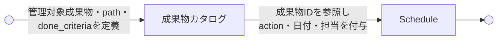

---
specdojo:
  id: specdojo:schedule-design-guide
  type: guide
  status: ready
  supersedes:
    - specdojo-deliverables-to-schedule-guide
---

# Schedule設計ガイド

Schedule Design Guide

Schedule の役割、`sch-strategy` から `sch-track` への展開、タスク粒度、依存関係、CPM の考え方を説明します。コマンドの短い使い方は [CLIコマンドリファレンス](../references/command-reference.md) を参照します。

**対象読者**

- 成果物を実行タスクへ展開し、順序、反復、依存関係を設計するプロジェクト計画担当者、Schedule 作成者

**この文書で分かること**

- Schedule ファイルの責務、生成フロー、タスクIDと粒度、実行要件、依存関係、CPM

**次に読む文書**

- 実行手順は [Schedule実行運用ガイド](schedule-operation-guide.md)、exec 設定は [exec設定ガイド](exec-config-guide.md)、`approach` による実践の型の参照方針は [実践の型活用ガイド](kata-guide.md) を参照してください。

## 1. Scheduleの基本

Schedule が扱う責務と、責務ごとに分かれたファイルの役割を示します。

### 1.1. Scheduleの役割

Schedule は「いつ、どの順序で、誰が実行するか」を定義する層です。成果物のパスや完了条件は成果物カタログが持ち、Schedule は成果物IDを参照して実行タスクへ展開します。

| 定義する内容     | 担当ファイル                   |
| ---------------- | ------------------------------ |
| WHAT / DONE      | 成果物カタログ（`dct-*.yaml`） |
| WHEN / ORDER     | Schedule（`sch-*.yaml`）       |
| エージェント定義 | `pm-members.yaml`              |
| 実行共通設定     | `.specdojo/exec-defaults.yaml` |

#### 1.1.1. 成果物カタログとの責務分担

成果物カタログは「何を管理対象とするか・どこに作成し何を満たせば完了か」を扱い、Schedule は「いつ・誰が・どの順で作業するか」を扱います。両者の責務は次のように分かれます。

| 観点               | 成果物カタログ                         | Schedule               |
| ------------------ | -------------------------------------- | ---------------------- |
| 主目的             | 成果物の論理定義と完了単位の定義       | 実行計画               |
| 問い               | 何がどこに完成すればよいか             | いつ誰が何をするか     |
| 単位               | 成果物                                 | 実行タスク             |
| 成果物ID           | 定義する                               | 参照する               |
| 配置先・成果物パス | `kind: work` の `path` で持つ          | 原則持たない           |
| 完了条件           | `kind: work` の `done_criteria` で持つ | 原則持たない           |
| action             | 持たない                               | 持つ                   |
| 日付               | 持たない                               | 持つ                   |
| 担当者             | 原則持たない                           | 持つ                   |
| 依存関係           | 成果物間の根拠程度                     | 実行順序の依存         |
| status             | カタログ定義文書の状態として持つ       | タスクの実行状態を持つ |

成果物カタログから Schedule への定義の流れは次のとおりです。



各層の詳細なルールは、それぞれの rulebook を正本とします。

- 成果物カタログ: [成果物カタログ（ドメイン別）作成ルール](../rulebooks/dct-rulebook.md)
- Schedule: [スケジュール作成ルール](../rulebooks/sch-rulebook.md)

### 1.2. Scheduleファイル

Schedule は用途別に4種類のファイルで管理します。

| ファイル                    | 役割                                             |
| --------------------------- | ------------------------------------------------ |
| `sch-milestones.yaml`       | プロジェクト全体のマイルストーン計画             |
| `sch-defaults.yaml`         | 全 Schedule 共通のカレンダーや開始日のデフォルト |
| `sch-strategy-<track>.yaml` | track schedule の自動生成ルール                  |
| `sch-track-<track>.yaml`    | 展開済みの Task / Milestone 定義                 |

`sch-strategy-<track>.yaml` は生成入力です。`schedule build` 後は `sch-track-<track>.yaml` が実行対象になります。

## 2. sch-trackの生成

strategy から track への生成フロー、展開する情報、反復、タスクIDの導出を示します。

### 2.1. 生成フロー

`sch-track-<track>.yaml` は原則として手書きせず、次の流れで生成します。

```text
成果物カタログ（dct-*.yaml）
  -> sch-strategy-<track>.yaml
  -> specdojo schedule build --track <track> --force
  -> sch-track-<track>.yaml
  -> specdojo exec build
  -> generated/ready.json, cpm.md, timeline.svg など
```

実行するコマンドは次のとおりです。

```bash
specdojo schedule build --project <project-id> --track <track> --force
specdojo exec build --project <project-id>
```

`phase_sets`、`cycles`、`iterations`、フェーズ追加削除、`phase_suffix`、依存関係、ゲートを変更した場合は、`schedule build` を先に実行してから `exec build` を実行します。

### 2.2. トラックへ展開する情報

`sch-strategy-<track>.yaml`（生成入力）から `sch-track-<track>.yaml`（生成物）への展開では、タスク単位で確定する実行情報だけを展開します。

| 展開する情報       | 理由                                                     |
| ------------------ | -------------------------------------------------------- |
| `name`             | 実行者が作業を識別するために必要                         |
| `description`      | エージェント・人間が実行時に参照するフェーズ指示         |
| `target_local_ids` | 横断タスクの対象成果物群を plan / commit scope へ渡す    |
| `owner`            | 誰が実行するかを決定するために必要                       |
| `duration_days`    | CPM 計算に必要                                           |
| `depends_on`       | 実行順序の決定に必要。タスク ID に解決済みの形で展開する |

トラック全体に共通する生成ルールや設計意図は strategy に留めます。

| strategy に留める情報             | 理由                                                             |
| --------------------------------- | ---------------------------------------------------------------- |
| `phase_sets` の定義               | フェーズ構成は strategy が SSOT。定義全体はトラックへ複製しない  |
| `owner_rules`                     | どの `local_id` を誰が担当するかのルール。トラックには展開しない |
| `cross_domain_dependencies`       | 依存関係の設計意図。トラックには解決済み `depends_on` として反映 |
| `phase_gates`・`group_milestones` | 生成ロジック。トラックにはマイルストーンとして展開済み           |

`description` をトラックへ展開するのは、エージェントや人間が plan ファイルだけを読んで実行できるようにするためです。strategy を参照させる方式は plan 生成時にファイルが 2 つ必要になり、自己完結性が損なわれます。

反復タスクには、実行時にタスク ID の文字列解析へ依存しないよう、生成元を表す `phase_set`・`phase_id`・`phase_suffix` と、該当する `cycle`・`iteration` を展開します。

`cross_deliverable_passes` から生成する横断タスクは、成果物別の `local_id` を持たず、明示された複数の `target_local_ids` を持ちます。これにより、一つの横断タスクの対象を plan frontmatter の `targets` と commit scope へ同じ順序で展開できます。

### 2.3. phase_setsの反復

個別 `phase_set` の反復と、`phase_sets` シーケンス全体の反復は別の階層として扱います。

| フィールド   | 意味                                                | 省略時 |
| ------------ | --------------------------------------------------- | ------ |
| `iterations` | 個別 `phase_set` の総実行回数                       | `1`    |
| `cycles`     | `sequence` に指定した `phase_sets` 全体の総実行回数 | `1`    |

```yaml
default_phase_sets:
  cycles: 2
  sequence:
    - phase_set: first-pass
      iterations: 2
    - phase_set: finalize-pass
```

この例は次の順序に展開されます。

```text
cycle 1: first-pass #1 -> first-pass #2 -> finalize-pass
cycle 2: first-pass #1 -> first-pass #2 -> finalize-pass
```

反復しない場合は、従来どおり配列形式も使えます。

```yaml
default_phase_sets: [first-pass, finalize-pass]
```

`cycles` と `iterations` は追加回数ではなく総実行回数です。

### 2.4. タスクID

タスク ID は `T-<TRACK>-<local_id>-<phase_suffix>` を基礎にし、反復する場合だけ `-C<cycle>` と `-I<iteration>` を末尾に付けます。`id:` フィールドは `sch-track` の YAML に書かず、自動導出します。

```text
# 反復なし
T-LAUNCH-prj-overview-010

# phase_sets 全体のみ反復
T-LAUNCH-prj-overview-010-C01

# 個別 phase_set のみ反復
T-LAUNCH-prj-overview-010-I01

# 両方を反復
T-LAUNCH-prj-overview-010-C01-I01

# 横断タスク
T-LAUNCH-project-definition-dedup-060
```

`cycles` が `2` 以上の場合だけ `C`、`iterations` が `2` 以上の場合だけ `I` を付けます。両方を使う場合の順序は `C`、`I` です。

横断タスクは `T-<TRACK>-<cross_deliverable_pass.id>-<task_suffix>` とします。成果物の `local_id` を代表値として使わないため、対象群をタスク ID から推測せず `target_local_ids` を参照します。

#### 2.4.1. 成果物群を横断する直列 pass

成果物別 phase を複製せず、明示した成果物群を一度だけ共同編集する場合は `cross_deliverable_passes` を使います。

```yaml
cross_deliverable_passes:
  - id: project-definition-dedup
    name: プロジェクト定義の正本選択・重複整理
    task_suffix: "060"
    duration_days: 0.5
    owner: ARC
    after_gate: G-LAUNCH-bootstrap-pass
    before_phase_set: refine-pass
    execution: agent
    mode: edit
    approach: cross-deliverable-dedup
    proficiency: expert
    scope:
      catalogs:
        - prj-0001:dct-project-definition
```

各 entry は scope の成果物数にかかわらず一つのタスクへ展開されます。そのタスクは `after_gate` に依存し、scope 内の `before_phase_set` の先頭タスクが横断タスクに依存します。このため、完了ゲート → 横断タスク → 成果物別 phase の順序を保ちつつ、横断作業の重複生成を防げます。

scope は `catalogs`、`groups`、`local_ids` の和集合で明示します。少なくとも二つの成果物へ解決できる必要があります。すでに全 phase 完了として `initial_state` に登録された成果物は対象群と plan targets には含めますが、後続 phase のブロック対象にはしません。

## 3. 実行要件とフェーズ解決

phase ごとの実行要件の定義方法と、`exec build` 時にどう解決されるかを示します。

### 3.1. フェーズと実行要件

`sch-strategy-<track>.yaml` の各フェーズには、実行種別と作業要件を定義できます。

```yaml
phase_sets:
  first-pass:
    - id: enrich
      name: 調査・補強
      execution: agent
      task_suffix: "020"
      mode: edit
      capabilities: [web_search]
      proficiency: expert
```

| フィールド     | 用途                                     |
| -------------- | ---------------------------------------- |
| `execution`    | `agent` または `human`。省略時は `agent` |
| `mode`         | `edit` または `review`。省略時は `edit`  |
| `approach`     | plan テンプレートの進め方を選ぶ          |
| `capabilities` | 必要なツールや能力を示す                 |
| `proficiency`  | 必要な習熟度を示す                       |

`approach` の値ごとの意味と、rulebook / recipe / sample / template の参照方針は [実践の型活用ガイド](kata-guide.md) を参照します。エージェント選択の詳細は [exec設定ガイド](exec-config-guide.md) を参照します。

### 3.2. `bootstrap` と `retrofit` のフェーズ順序

実践の型が未整備で、かつ既存実装から成果物を作成・補正する場合、`bootstrap` と `retrofit` を一つの phase に混在させません。次の順序を推奨します。

1. `bootstrap`: 代表成果物と rulebook / recipe / sample / template を一式で初期整備する。
2. `retrofit` edit: DCT の `evidence_refs` から各成果物を新設・補正する。
3. `cross-deliverable-dedup`: 必要な場合だけ、成果物間の正本選択と重複整理を行う。
4. `fully-guided`: 整備済みの実践の型に沿って内容を磨き込む。
5. `retrofit` review: 完成版と実装エビデンスの一致・乖離・未確認範囲を判定する。
6. `finalize` または `bootstrap-finalize`: human が成果物と必要な実践の型を確定する。

`retrofit` を使う成果物には、事前に DCT の `evidence_refs` を宣言します。実装エビデンスは Schedule の依存関係ではなく調査入力であるため、`depends_on` や `targets` へ複製しません。

### 3.3. exec build時のフェーズ解決

`exec build` は、`sch-track-<track>.yaml` のタスクを入力にし、対応する `sch-strategy-<track>.yaml` からフェーズ情報を解決して `ready.json` へ記録します。plan ファイルは `exec build` では生成せず、`exec plan` または `exec run` が必要時に生成します。

```text
sch-track task
  local_id, phase_suffix, cycle, iteration
  -> sch-strategy の phase_set / phase を解決
  -> mode, approach, capabilities, proficiency を確定
  -> generated/ready.json に記録
  -> exec plan / exec run が plan を生成
```

`mode`、`approach`、`execution`、`capabilities`、`proficiency` だけを変更した場合は `exec build` で反映できます。タスク構造が変わる変更をした場合は `schedule build --force` が必要です。

## 4. タスク設計の品質

タスク粒度、依存関係、CPM、典型的な失敗パターンを示します。

### 4.1. タスク粒度

Task は AI Agent が一度の実行で完了できる粒度にします。

| 指標            | 推奨             |
| --------------- | ---------------- |
| `duration_days` | `0.125` から `1` |
| 変更ファイル数  | 1から5           |
| 責務            | 1つ              |

大きすぎる Task は分割し、小さすぎて独立完了できない Task は統合します。

`cross_deliverable_passes` は一つの論点整理責務を成果物群へ適用する例外であり、変更ファイル数より意味的なまとまりを優先します。scope を広げすぎず、正本を相互に選択できる成果物群ごとに分けます。

### 4.2. 依存関係

依存関係は最小限にします。依存が多いほど並列実行できる Ready タスクが減ります。

```text
良い例:
  migration -> repository -> api endpoint

悪い例:
  migration -> repository -> api -> test -> docs -> release
```

Ready タスク数の目安は同時に5から20件です。これを下回る状態が続く場合は依存関係を見直します。

### 4.3. CPMとクリティカルパス

`specdojo exec build` は Schedule から CPM（Critical Path Method）を計算します。

```text
generated/cpm.md
generated/critical-path.md
```

Slack が `0` の Task はクリティカルパスに乗ります。これらの遅延はプロジェクト全体の遅延に直結するため、優先して Ready にします。

### 4.4. Anti-patterns

| Anti-pattern                       | 問題                                                                 |
| ---------------------------------- | -------------------------------------------------------------------- |
| 巨大 Task（1日以上）               | 一度のエージェント実行で完了しにくい                                 |
| 過剰依存チェーン                   | Ready タスクが少なくなり並列性が落ちる                               |
| `duration_days: 0` の Task         | ゼロ期間は Milestone を使う                                          |
| `depends_on` の省略                | 前提なしでも `[]` と明示する                                         |
| 成果物パスを Schedule に直接書く   | パスは成果物カタログが管理する                                       |
| `sch-strategy` に agent 個体を書く | strategy は作業要件を持ち、agent 個体は `pm-members.yaml` に集約する |
