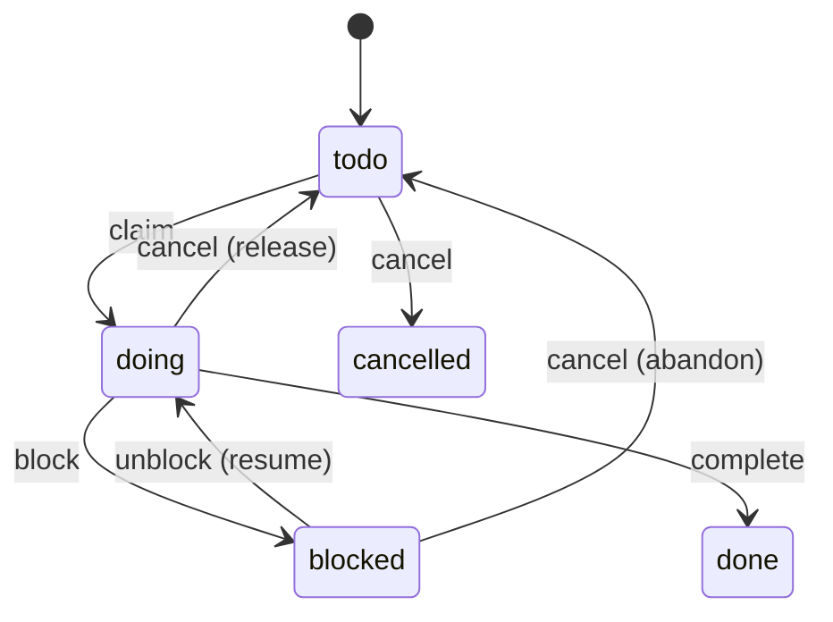

# specdojoコマンド利用ガイド

本ドキュメントでは、SpecDojo における **Gitベースのプロジェクト実行管理ツール `specdojo` CLI** の利用方法を説明します。

`specdojo` は以下を Git リポジトリ内で管理することを目的としています。

- スケジュール定義（`sch-*.yaml`）
- 実行イベント（`exec/events/*.json`）
- 実行状態・CPM等の生成物（`generated/`）

## 1. 概要

`specdojo` は以下の機能を提供します。

- スケジュール定義の検証
- 実行イベントの記録
- 実行状態の生成
- Readyタスク抽出
- CPM（Critical Path Method）計算
- クリティカルパス算出
- スケジュール差分検出
- Agent安全実行（排他ロック）
- 成果物カタログの scaffold・検証・Markdown 生成
- プロジェクト登録簿（`pjr-index.md`）の scaffold・登録項目追加・ステータス変更・派生ビュー生成

## 2. ディレクトリ構成

例:

```text
repo-root/
├─ specdojo.config.json
├─ .env
├─ docs/
│  ├─ specdojo/
│  │  └─ schemas/
│  └─ ja/
│     ├─ specdojo/
│     │  └─ templates/
│     │     ├─ dct-project-definition.yaml
│     │     ├─ dct-project-management.yaml
│     │     ├─ pm-review-viewpoints.yaml
│     │     └─ pjr-index-template.md
│     └─ projects/
│        └─ prj-0001/
│           ├─ 010-deliverables-catalog/
│           │  ├─ dct-project-definition.yaml
│           │  ├─ dct-project-management.yaml
│           │  └─ generated/
│           │     ├─ dct-project-definition.md
│           │     └─ dct-project-management.md
│           ├─ 030-project-management/
│           │  ├─ schedule/
│           │  │  ├─ sch-milestones.yaml
│           │  │  └─ sch-track-launch.yaml
│           │  └─ controls/
│           │     ├─ project-register/
│           │     │  ├─ pjr-index.md
│           │     │  └─ generated/
│           │     └─ reviews/
│           │        ├─ plans/
│           │        └─ results/
│           └─ 070-execution/
│              ├─ exec/
│              │  ├─ events/
│              │  ├─ plans/
│              │  ├─ results/
│              │  └─ .locks/
│              └─ generated/
└─ tools/
```

## 3. 設定

### 3.1. `specdojo.config.json`

複数プロジェクトを扱うための **プロジェクトレジストリ**です。

例:

```json
{
  "version": 1,
  "current_project": "prj-0001",
  "projects": {
    "prj-0001": {
      "catalog_path": "docs/ja/projects/prj-0001/010-deliverables-catalog",
      "schedule_path": "docs/ja/projects/prj-0001/030-project-management/schedule",
      "execution_path": "docs/ja/projects/prj-0001/070-execution",
      "project_register_path": "docs/ja/projects/prj-0001/030-project-management/controls/project-register",
      "members_path": "docs/ja/projects/prj-0001/030-project-management/020-organization/pm-members.yaml",
      "reviews_path": "docs/ja/projects/prj-0001/030-project-management/controls/reviews",
      "viewpoints_path": "docs/ja/projects/prj-0001/030-project-management/010-management-plan/pm-review-viewpoints.yaml",
      "run": {
        "worktree_base": "../worktrees",
        "exec_defaults": ".specdojo/exec-defaults.yaml"
      }
    }
  }
}
```

`current_project` に作業中のプロジェクト ID を記載します。git で管理されているため、worktree を分離しても自動的に引き継がれます。`--project` フラグや `SPECDOJO_PROJECT` 環境変数で上書きできます。

`projects.<id>` には `schedule_path`、`execution_path` を指定します。必要に応じて `catalog_path`、`project_register_path`、`members_path`、`reviews_path`、`viewpoints_path`、`run` を指定します。`run.exec_defaults` に `exec-defaults.yaml` のパスを指定すると、`exec run --auto` で `sch-strategy-<track>.yaml` の phase に定義された `capabilities`・`proficiency` と、`pm-members.yaml` の `capabilities`・`proficiency`・`priority` に基づいて agent を自動選択できます。

### 3.2. `.env`（任意）

`current_project` を `specdojo.config.json` で管理している場合、`.env` は通常不要です。一時的にプロジェクトを切り替えたい場合や、config を変更せずに上書きしたい場合のみ使います。

```bash
SPECDOJO_PROJECT=prj-0001
```

パス直接指定が必要な場合（config なし環境など）：

```bash
SPECDOJO_SCHEDULE_PATH=docs/ja/projects/prj-0001/030-project-management/schedule
SPECDOJO_EXECUTION_PATH=docs/ja/projects/prj-0001/070-execution
```

### 3.3. プロジェクト解決順序

プロジェクトに紐づくコマンドは、原則として同じ順序で `specdojo.config.json` の project を解決します。

1. `--project` で指定したプロジェクト ID
2. `SPECDOJO_PROJECT` 環境変数（`.env` 含む）で指定したプロジェクト ID
3. `specdojo.config.json` の `current_project` フィールド（**推奨**）
4. `specdojo.config.json` の `projects` に定義された先頭のプロジェクト ID

worktree を使ったマルチエージェント実行では、`current_project` を git 管理することで `.env` のコピーが不要になります。ブランチ命名を `project/<project-id>/*` とすれば、feature ブランチや exec ブランチすべてで自動的に `current_project` が引き継がれます。

`exec` コマンドだけは、既存運用との互換のため `SPECDOJO_SCHEDULE_PATH` と `SPECDOJO_EXECUTION_PATH` の直接指定も受け付けます。直接指定する場合は、両方をセットで指定します。

### 3.4. 共通オプション方針

各コマンドのオプションは、以下の方針にそろえます。

| オプション       | 方針                                                                                                                     |
| ---------------- | ------------------------------------------------------------------------------------------------------------------------ |
| `--project <id>` | プロジェクトに紐づくコマンドで共通。省略時は `SPECDOJO_PROJECT` 環境変数、`current_project`、config 先頭の順に解決する。 |
| `--dry-run`      | ファイルやイベントを書き込むコマンドで、書き込み前の内容または実行予定を表示する。                                       |
| `--force`        | 既存ファイルがある場合にスキップする scaffold/generate 系コマンドで、上書きを許可する。                                  |
| `--scope`        | 複数の生成対象を持つ build/watch 系コマンドで、対象範囲を絞り込む。                                                      |

`--project` は共通オプションのため、個別コマンドの表では「省略可」として扱います。

## 4. 初期セットアップ

`npm link` は使いません。

このリポジトリでは `npm install` 後に root package の `src/` がビルドされ、VS Code 統合ターミナルでは `node_modules/.bin` が `PATH` に追加されます。新しいターミナルを開けば、以降は `npx` なしで `specdojo` を直接実行できます。

```bash
npm install
specdojo config init
```

VS Code 統合ターミナル以外では `PATH` が通らないため、必要に応じて以下を使ってください。

```bash
./node_modules/.bin/specdojo config init
```

### 4.1. config作成

```bash
specdojo config init
```

### 4.2. プロジェクト一覧

```bash
specdojo project list
```

## 5. catalog コマンド

`specdojo catalog` は成果物カタログ（`dct-<domain>.yaml`）の scaffold・検証・Markdown 生成を行うコマンド群です。

- scaffold（`scaffold`）: テンプレートから `dct-*.yaml` を生成
- 検証（`validate`）: `dct-*.yaml` の整合性確認
- Markdown 生成（`build`）: `generated/dct-*.md` を出力

### 5.1. catalog scaffold

`catalog_path` に `dct-*.yaml` を新規生成します。`docs/ja/specdojo/templates/` のテンプレートをもとに、プロジェクト規模に応じた成果物セットを出力します。

プロジェクトサイズは `dct-index.md` の `size` フィールドが SSOT です。`--size` を省略すると `dct-index.md` から読み込みます。

```bash
# --size 省略時は dct-index.md の size フィールドを参照
specdojo catalog scaffold --project prj-0001

# --size 指定時はその値を優先（dct-index.md の値より優先される）
specdojo catalog scaffold --project prj-0001 --size medium
```

オプション:

| オプション     | 説明                                                                      | デフォルト                                              |
| -------------- | ------------------------------------------------------------------------- | ------------------------------------------------------- |
| `--size`       | `small` / `medium` / `large`                                              | `dct-index.md` の `size` フィールド（未設定時はエラー） |
| `--project-id` | 生成ファイルに埋め込む project_id（省略時は `catalog_path` から自動導出） | 自動導出                                                |
| `--force`      | 既存ファイルを上書き                                                      | `false`                                                 |

サイズ別の収録成果物:

| 成果物                                             | small | medium | large |
| -------------------------------------------------- | :---: | :----: | :---: |
| プロジェクト概要・スコープ・成功基準               |   ○   |   ○    |   ○   |
| 管理計画・組織定義・メンバー定義                   |   ○   |   ○    |   ○   |
| マイルストーン定義                                 |   ○   |   ○    |   ○   |
| ステークホルダー・憲章・前提制約・課題・代替案比較 |   -   |   ○    |   ○   |
| コミュニケーション計画・品質管理計画・ロール定義   |   -   |   ○    |   ○   |
| 管理台帳・フルスケジュール・レポート               |   -   |   ○    |   ○   |
| RACI                                               |   -   |   -    |   ○   |

既存ファイルはデフォルトでスキップされます（`--force` で上書き可能）。

### 5.2. catalog パス確認

```bash
specdojo catalog where --project prj-0001
```

出力例:

```text
catalog-path: /repo/.../010-deliverables-catalog
generated   : /repo/.../010-deliverables-catalog/generated
```

### 5.3. catalog 検証

```bash
specdojo catalog validate --project prj-0001
```

検証内容:

- JSON Schema 検証（`dct.schema.yaml`）
- `local_id` の一意性確認。カタログ内の重複はエラー。プロジェクト全体（`dct-*.yaml` 間）の重複は警告とする。bare `local_id`（scheduled タスク・`--deliverable`）が一意に解決できるようにするため
- `domain` の一意性確認（プロジェクト内、`dct-*.yaml` 間）。カタログ生成物が `domain` ごとに出力されるため
- `depends_on` 参照先の存在確認
- `kind: work` の必須フィールド確認（`path`、`done_criteria`）

### 5.4. catalog 生成

```bash
specdojo catalog build --project prj-0001
```

生成:

```text
generated/
├─ dct-project-definition.md
├─ dct-project-management.md
└─ ...（dct-*.yaml ごとに 1 ファイル）
```

`dct-<domain>.md` は対応する `dct-<domain>.yaml` の `groups` 構造に従い、成果物一覧を章立てで出力します。

## 6. schedule コマンド

`specdojo schedule` は、`sch-strategy-<track>.yaml` と成果物カタログから `sch-track-<track>.yaml` を生成するコマンド群です。

### 6.1. schedule build

成果物カタログ（`dct-*.yaml`）と `sch-strategy-<track>.yaml` を入力として、`sch-track-<track>.yaml` を生成します。

```bash
specdojo schedule build --project prj-0001 --track launch
```

既存の strategy を変更して track を更新する場合は `--force` を指定する。`exec build` は track を自動再生成しないため、タイムライン等まで反映するには二つのコマンドを順に実行する。

```bash
specdojo schedule build --project prj-0001 --track launch --force
specdojo exec build --project prj-0001
```

オプション:

| オプション  | 説明                                                                            | デフォルト |
| ----------- | ------------------------------------------------------------------------------- | ---------- |
| `--project` | プロジェクト ID（`specdojo.config.json` から解決）                              | 省略可     |
| `--track`   | 生成対象のトラック名（`sch-strategy-<track>.yaml` の `track` フィールドと一致） | 必須       |
| `--force`   | 既存の `sch-track-<track>.yaml` を上書き                                        | `false`    |
| `--dry-run` | ファイルを書き出さず、生成内容を標準出力に表示                                  | `false`    |

#### 6.1.1. 生成フロー

1. `schedule_path` から `sch-strategy-<track>.yaml` を読み込む。
2. `scope.catalogs` に列挙されたカタログファイルを読み込み、`include_kinds` でフィルタリングする。
3. カタログの `depends_on` と `cross_domain_dependencies` から成果物の展開順序を決定する。
4. 成果物ごとに `owner_rules` の `phase_sets` を適用し、`cycles` と `iterations` を展開してフェーズごとのタスクを生成する。
5. `owner_rules` から `owner` ロールを決定する。
6. フェーズに `mode` / `approach` / `capabilities` / `proficiency` が指定されている場合は、タスクメタデータまたは agent 要件に引き継ぐ。
7. タスク ID はトラック名・`local_id`・`phase_suffix` から自動導出し、反復する場合だけ cycle・iteration 識別子を末尾に付ける。
8. `sch-track-<track>.yaml`（`kind: track`）として `schedule_path` に出力する。
9. 生成された milestone がある場合は `sch-milestones.yaml` を作成または更新する。

#### 6.1.2. タスク ID の導出規則

タスク ID は以下のルールで自動導出する。手動での指定は不要。

```text
T-<TRACK>-<local_id>-<phase_suffix>
T-<TRACK>-<local_id>-<phase_suffix>-C<cycle>
T-<TRACK>-<local_id>-<phase_suffix>-I<iteration>
T-<TRACK>-<local_id>-<phase_suffix>-C<cycle>-I<iteration>
```

| 要素             | 値の例         | 説明                                             |
| ---------------- | -------------- | ------------------------------------------------ |
| `T-`             | `T-`           | タスク固定プレフィックス                         |
| `<TRACK>`        | `LAUNCH`       | トラック名の大文字（`track: launch` → `LAUNCH`） |
| `<local_id>`     | `prj-overview` | 成果物カタログの `local_id`（ケース変換なし）    |
| `<phase_suffix>` | `010`          | `phase_sets` 定義の `task_suffix`                |
| `C<cycle>`       | `C01`          | `phase_sets` シーケンス全体の反復番号            |
| `I<iteration>`   | `I01`          | 個別 `phase_set` の反復番号                       |

例: トラック `launch`、`local_id: prj-overview`、`task_suffix: "010"` → `T-LAUNCH-prj-overview-010`

`cycles` が `2` 以上の場合だけ `-C<cycle>`、`iterations` が `2` 以上の場合だけ `-I<iteration>` を付与する。両方を使用する場合は `-C<cycle>-I<iteration>` の順とする。番号は `01` から始まる2桁以上のゼロ埋め表記とし、反復指定がない既存タスクの ID は変更しない。

```text
# 反復なし
T-LAUNCH-prj-overview-010

# phase_sets 全体のみ反復
T-LAUNCH-prj-overview-010-C01

# 個別 phase_set のみ反復
T-LAUNCH-prj-overview-010-I01

# 両方を反復
T-LAUNCH-prj-overview-010-C01-I01
```

マイルストーンは `M-<TRACK>-<name>`、フェーズゲートは `G-<TRACK>-<name>` の形式で `sch-milestones.yaml` に定義する。

#### 6.1.3. タスク生成ルール

各 `kind: work` 成果物に対してフェーズごとのタスクを生成する。フェーズは `sch-strategy-<track>.yaml` の `phase_sets` で定義する。

デフォルトの `first-pass` + `finalize-pass` の構成例（`prj-overview`）:

| フェーズ                  | `phase_suffix` | タスク ID                   | `depends_on`                          |
| ------------------------- | -------------- | --------------------------- | ------------------------------------- |
| draft（たたき台作成）     | `010`          | `T-LAUNCH-prj-overview-010` | 依存成果物の finalize タスク ID       |
| enrich（調査・補強）      | `020`          | `T-LAUNCH-prj-overview-020` | `T-LAUNCH-prj-overview-010`           |
| review（一次版レビュー）  | `030`          | `T-LAUNCH-prj-overview-030` | `T-LAUNCH-prj-overview-020`           |
| align（整合性確認・修正） | `040`          | `T-LAUNCH-prj-overview-040` | `G-LAUNCH-first-pass`（ゲート通過後） |
| finalize（完成版確定）    | `050`          | `T-LAUNCH-prj-overview-050` | `T-LAUNCH-prj-overview-040`           |

`phase_sets` を変更することでフェーズ数・`task_suffix` を自由に変更できる。

タスクは `local_id` で成果物に対応づく。`local_id` はプロジェクト全体で一意であることを前提とし、scheduled タスクは bare `local_id` から成果物を引き当てる。複数カタログに同一 `local_id` が存在すると下流の解決で一方に畳まれるため、`catalog validate` / `exec validate` がプロジェクト全体の重複を**警告**する（カタログ内の重複はエラー）。

#### 6.1.4. `phase_sets` の反復

個別の `phase_set` を反復する場合は、その参照に `iterations` を指定する。`iterations` は追加回数ではなく総実行回数を表し、省略時は `1` とする。

```yaml
default_phase_sets:
  - phase_set: first-pass
    iterations: 3
  - phase_set: finalize-pass
```

この例は `first-pass` を3回実行した後、`finalize-pass` を1回実行する。

選択した `phase_sets` シーケンス全体を反復する場合は、`cycles` と `sequence` を使用する。`cycles` も総実行回数を表し、省略時は `1` とする。

```yaml
default_phase_sets:
  cycles: 2
  sequence:
    - phase_set: first-pass
      iterations: 2
    - phase_set: finalize-pass
```

この例は次の順序に展開される。

```text
cycle 1: first-pass #1 -> first-pass #2 -> finalize-pass
cycle 2: first-pass #1 -> first-pass #2 -> finalize-pass
```

`owner_rules[].phase_sets` も同じ形式を使用できる。

```yaml
owner_rules:
  - local_ids: [prj-comparison-of-alternatives]
    owner: ARC
    phase_sets:
      cycles: 2
      sequence:
        - phase_set: research-first-pass
          iterations: 3
        - phase_set: finalize-pass
```

反復しない場合は従来の配列形式を簡略記法として使用できる。

```yaml
default_phase_sets: [first-pass, finalize-pass]
```

これは `cycles: 1`、各 `iterations: 1` の完全形と等価である。`cycles` と `iterations` は `1` 以上の整数とし、`loop` や `repeat` は `exec run --loop` や追加回数との混同を避けるため使用しない。

生成順序は cycle 内の sequence、phase_set 内の iteration、phase_set 内の phase の順とする。次の cycle は前の cycle の最終タスクに依存する。`phase_gates` は各 cycle 内で、対象 `phase_set` の最終 iteration 後に適用する。複数 cycle ではゲート ID に `-C01`、`-C02` のような cycle 識別子を付ける。

生成タスクには ID とは別に `phase_suffix` を保持し、該当する場合だけ `cycle` と `iteration` を保持する。フェーズ解決ではタスク ID の末尾を `phase_suffix` とみなさず、これらの明示フィールドを使用する。

反復途中までを `initial_state.completed_through` で完了済みにする場合は、`phase_set`・`phase` と必要な反復番号を指定する。

```yaml
completed_through:
  phase_set: first-pass
  phase: review
  cycle: 1
  iteration: 2
```

反復しないワークフローでは、従来どおり `completed_through: review` の簡略記法も使用できる。

#### 6.1.5. フェーズ実行要件

`approach` は、タスクの進め方プロファイルを表す。`fully-guided` / `recipe-guided` / `freeform` は成果物作業で rulebook / recipe / sample / template をどの程度参照するかを表し、`rulebook-maintenance` / `recipe-maintenance` / `sample-maintenance` / `template-maintenance` は成果物を根拠に対象の参考資料を見直す進め方を表す（参照の向きが逆転する）。作成・更新かレビューかは `mode`（`edit` / `review`）で表す。参考資料の完成度は人が判断し、タスク生成前に適切な `approach` を明示する。エージェントは参考資料の品質判定を行わず、plan に示された進め方に従う。

| `approach`             | 参照方針                              | 用途                                                                                 |
| ---------------------- | ------------------------------------- | ------------------------------------------------------------------------------------ |
| `fully-guided`         | rulebook / recipe / sample / template を参照する | 参考資料が十分整っており、それらに沿って成果物を作成・更新する                       |
| `recipe-guided`        | recipe を主に参照する                 | rulebook / sample / template は未成熟だが、作り方・問い・観点だけを使って成果物を作成・更新する |
| `freeform`             | 参考資料に原則縛られない              | 参考資料より成果物の実例やプロジェクト文脈を優先して自由に作成・更新する             |
| `rulebook-maintenance` | 成果物を根拠に rulebook を見直す      | 複数の成果物・review result を根拠に章構成・必須項目・禁止事項・判定基準を改善する   |
| `recipe-maintenance`   | 成果物を根拠に recipe を見直す        | 複数の成果物・review result を根拠に問い・観点・深掘り手順・レビュー観点を改善する   |
| `sample-maintenance`   | 成果物を根拠に sample を見直す        | 複数の成果物・review result を根拠に粒度・文体・表の書き方を改善する                 |
| `template-maintenance` | 成果物を根拠に template を見直す      | 複数の成果物・review result を根拠に章構成の骨組みとプレースホルダの配置・網羅性を改善する |

参考資料メンテナンスは自動で差し込まず、必要なときに `approach: rulebook-maintenance` のように対象を指定した phase を `phase_sets` へ明示的に記述する。

`mode` / `capabilities` / `proficiency` は phase に直接定義する。`mode` は plan/result の種別を表し、`edit` または `review` を指定する。`capabilities` と `proficiency` は `execution: agent` の phase で agent 選択に使う作業要件であり、agent 個体は指定しない。ツールアクセスが不要な場合、`capabilities` は省略する。

```yaml
phase_sets:
  first-pass:
    - id: enrich
      name: 調査・補強
      execution: agent
      task_suffix: '020'
      mode: edit
      proficiency: normal
      description: |
        エージェントが TODO を埋めて内容を補強する。

    - id: review
      name: 一次版レビュー
      execution: human
      task_suffix: '030'
      mode: review
      description: |
        担当ロールが補強後の内容を確認する。

  research-first-pass:
    - id: enrich
      name: 調査・深掘り
      execution: agent
      task_suffix: '020'
      mode: edit
      capabilities: [web_search]
      proficiency: expert
      description: |
        エージェントが外部情報で深掘りする。
```

#### 6.1.6. 出力例（抜粋）

```yaml
kind: track
id: prj-0001:sch-track-launch
type: project
status: draft
version: 1
project_id: prj-0001
track: launch
settings:
  start_date: '2026-05-24'
tasks:
  - local_id: prj-overview
    phase_suffix: '010'
    name: たたき台作成
    duration_days: 0.25
    depends_on: []
    owner: BA

  - local_id: prj-overview
    phase_suffix: '020'
    name: 調査・補強
    duration_days: 0.5
    depends_on:
      - T-LAUNCH-prj-overview-010
    owner: BA

  - local_id: pm-organization
    phase_suffix: '010'
    name: たたき台作成
    duration_days: 0.25
    depends_on:
      - T-LAUNCH-prj-overview-030 # cross_domain_dependencies による依存
    owner: PO
```

タスク ID は `id:` フィールドを省略しても `T-LAUNCH-prj-overview-010` のように自動導出される。`depends_on` には導出後のフルIDを記載する。

### 6.2. schedule where

スケジュールパスを確認する。

```bash
specdojo schedule where --project prj-0001
```

出力例:

```text
schedule-path: /repo/.../030-project-management/schedule
strategy-files:
  - sch-strategy-launch.yaml
track-files:
  - sch-track-launch.yaml
```

## 7. register コマンド

`specdojo register` は、プロジェクト登録簿（Project Register）を扱うコマンド群です。

- scaffold（`scaffold`）: テンプレートから `pjr-index.md` を生成
- 登録項目追加（`add`）: `pjr-index.md` に登録項目を追加し、必要に応じて個票を生成
- 派生ビュー生成（`build`）: `pjr-index.md` と個票から `generated/` 配下の派生ビューを生成
- 項目更新（`update`）: タイトル・期限・担当者・優先度などのフィールドを更新
- 作業開始（`start`）: 登録項目のステータスを `in-progress` に変更
- 待機（`wait`）: 登録項目のステータスを `waiting` に変更
- レビュー（`review`）: 登録項目のステータスを `review` に変更
- 完了（`close`）: 登録項目のステータスを `done` / `decided` に変更
- 却下（`reject`）: 登録項目のステータスを `rejected` に変更
- 保留（`defer`）: 登録項目のステータスを `deferred` に変更
- 再オープン（`reopen`）: 登録項目のステータスを `open` 等に戻す

`specdojo.config.json` に `project_register_path` を追加する。

```json
{
  "projects": {
    "prj-0001": {
      "project_register_path": "docs/ja/projects/prj-0001/030-project-management/controls/project-register"
    }
  }
}
```

### 7.1. register scaffold

`project_register_path` に `pjr-index.md` を新規生成する。`docs/ja/specdojo/templates/pjr-index-template.md` をもとに `_PRJ-0000_` をプロジェクト ID に置換して出力し、最後に `register build --scope all` 相当を実行して派生ビューも生成する。

```bash
specdojo register scaffold --project prj-0001
```

オプション:

| オプション     | 説明                                                               | デフォルト  |
| -------------- | ------------------------------------------------------------------ | ----------- |
| `--project`    | プロジェクト ID（`specdojo.config.json` から解決）                 | 省略可      |
| `--project-id` | 生成ファイルに埋め込む project id（省略時は `--project` と同じ値） | `--project` |
| `--force`      | 既存の `pjr-index.md` を上書き                                     | `false`     |
| `--dry-run`    | ファイルを書き出さず、生成内容を標準出力に表示                     | `false`     |

既存ファイルはデフォルトでスキップされます（`--force` で上書き可能）。

#### 7.1.1. 生成フロー

1. `--project` で指定したプロジェクト ID を `specdojo.config.json` から解決する。
2. `projects.<id>.project_register_path` を出力先ディレクトリとして解決する。
3. `docs/ja/specdojo/templates/pjr-index-template.md` を読み込む。
4. `_PRJ-0000_` を `--project-id` または `--project` の値に置換する。
5. `project_register_path/pjr-index.md` に出力する。
6. `project_register_path/generated/` と `controls/generated/` を作成する。
7. `register build --scope all` 相当を実行し、登録簿内の補助一覧と controls 全体の type 別管理ビューを生成する。

#### 7.1.2. 出力

```text
controls/
├─ project-register/
│  ├─ pjr-index.md
│  └─ generated/
│     └─ pjr-views.md
└─ generated/
   ├─ pm-risk-register.md
   ├─ pm-issue-log.md
   ├─ pm-change-request-log.md
   └─ pm-decision-log.md
```

`pjr-index.md` の frontmatter は以下の形式で生成する。

```yaml
id: prj-0001:pjr-index
type: project
status: draft
rulebook: pjr-index-rulebook
```

本文には「登録項目一覧」テーブルを含め、初期行として `PJR-0001` の TODO 行を 1 件配置する。

#### 7.1.3. 検証

生成後は `pjr-index.schema.yaml` で本文構造を検証する。

```bash
npm run validate:schema:pjr-index
```

検証対象の主なルール:

| 項目       | ルール                                                                                         |
| ---------- | ---------------------------------------------------------------------------------------------- |
| セクション | `## 1. 登録項目一覧` が存在する                                                                |
| 必須列     | `ID`、`ステータス`、`タイトル`、`分類`、`優先度`                                               |
| ID         | `PJR-0000` 形式                                                                                |
| ステータス | `open` / `in-progress` / `waiting` / `review` / `decided` / `done` / `deferred` / `rejected`   |
| 分類       | `todo` / `question` / `risk` / `issue` / `change-request` / `decision` / `dependency` / `note` |
| 優先度     | `high` / `medium` / `low`                                                                      |

### 7.2. register add

`pjr-index.md` の「登録項目一覧」テーブルに 1 行追加する。`--ticket` を指定した場合は、分類に対応する `docs/ja/specdojo/templates/pjr-<type>-template.md` から個票も生成する。

```bash
specdojo register add \
  --project prj-0001 \
  --type todo \
  --title "レビュー観点の棚卸し" \
  --description "既存のレビュー観点を確認し、不足を整理する" \
  --priority high \
  --owner ARC \
  --due 2026-05-24
```

個票も生成する例:

```bash
specdojo register add \
  --project prj-0001 \
  --type risk \
  --title "外部レビュー遅延" \
  --description "外部レビューの回答遅延により launch track が遅れる可能性がある" \
  --priority medium \
  --owner PO \
  --due 2026-05-31 \
  --ticket \
  --topic external-review-delay
```

オプション:

| オプション      | 説明                                                            | デフォルト             |
| --------------- | --------------------------------------------------------------- | ---------------------- |
| `--project`     | プロジェクト ID（`specdojo.config.json` から解決）              | 省略可                 |
| `--type`        | 登録項目の分類                                                  | 必須                   |
| `--title`       | 登録項目の短いタイトル                                          | 必須                   |
| `--description` | 一覧に記載する説明。`--ticket` 指定時も要約として使う           | `_TODO_`               |
| `--priority`    | `high` / `medium` / `low`                                       | `medium`               |
| `--status`      | 登録項目のステータス                                            | `open`                 |
| `--owner`       | 主担当者または役割                                              | `_TODO_`               |
| `--due`         | 期限（`YYYY-MM-DD` / `-` / `_TODO_`）                           | `_TODO_`               |
| `--completed`   | 完了日（`YYYY-MM-DD` / `-`）                                    | `-`                    |
| `--conclusion`  | 結論または対応結果の要約                                        | `-`                    |
| `--id`          | 追加する表示 ID（例: `PJR-0061`）。省略時は既存最大 ID の次番号 | 自動採番               |
| `--ticket`      | 個票 `pjr-XXXX-<topic>.md` を生成し、「個票」列にリンクを設定   | `false`                |
| `--topic`       | 個票ファイル名の `<topic>`。`--ticket` 指定時に使用             | `--title` から slug 化 |
| `--force`       | 既存の個票ファイルを上書き                                      | `false`                |
| `--dry-run`     | ファイルを書き出さず、追加予定の行と個票内容を標準出力に表示    | `false`                |

`--type` には以下を指定できる。

| type             | 個票テンプレート                 |
| ---------------- | -------------------------------- |
| `todo`           | `pjr-todo-template.md`           |
| `question`       | `pjr-question-template.md`       |
| `risk`           | `pjr-risk-template.md`           |
| `issue`          | `pjr-issue-template.md`          |
| `change-request` | `pjr-change-request-template.md` |
| `decision`       | `pjr-decision-template.md`       |
| `dependency`     | `pjr-dependency-template.md`     |
| `note`           | `pjr-note-template.md`           |

#### 7.2.1. 生成フロー

1. `--project` で指定したプロジェクト ID を `specdojo.config.json` から解決する。
2. `projects.<id>.project_register_path/pjr-index.md` を読み込む。
3. 「登録項目一覧」テーブルから既存の `PJR-XXXX` を走査し、`--id` 省略時は次番号を採番する。
4. `--type`、`--status`、`--priority`、`--due`、`--completed` が許容値に一致することを検証する。
5. `pjr-index.md` のテーブル末尾に登録項目行を追加する。
6. `--ticket` 指定時は `pjr-XXXX-<topic>.md` を生成し、「個票」列に `[pjr-XXXX-<topic>](./pjr-XXXX-<topic>.md)` を設定する。
7. 指定値の形式と既存 ID の重複を検証する。

#### 7.2.2. 追加される行

個票なしの場合:

```markdown
| PJR-0061 | open | レビュー観点の棚卸し | 既存のレビュー観点を確認し、不足を整理する | todo | high | ARC | 2026-05-24 | - | - | - |
```

個票ありの場合:

```markdown
| PJR-0062 | open | 外部レビュー遅延 | 外部レビューの回答遅延により launch track が遅れる可能性がある | risk | medium | PO | 2026-05-31 | - | - | [pjr-0062-external-review-delay](./pjr-0062-external-review-delay.md) |
```

#### 7.2.3. 個票生成

`--ticket` 指定時は、分類に対応するテンプレートを使って個票を生成する。

```text
controls/project-register/
├─ pjr-index.md
├─ pjr-0062-external-review-delay.md
└─ generated/
```

個票の frontmatter は以下の形式で生成する。

```yaml
id: prj-0001:pjr-0062
type: project
status: draft
rulebook: pjr-index-rulebook
item_type: risk
```

テンプレート内の `_PRJ-0000_`、`_PJR-XXXX_`、`_<TYPE>_TITLE_` 相当のプレースホルダーは、プロジェクト ID、表示 ID、タイトルで置換する。

#### 7.2.4. 検証

追加前に ID、ステータス、分類、優先度、日付形式を検証する。必要に応じて、更新後に schema 検証を実行する。

```bash
npm run validate:schema:pjr-index
```

検証エラー時は `pjr-index.md` と個票を更新せず、エラー内容を表示する。

### 7.3. register build

`pjr-index.md` と各 `pjr-XXXX-<topic>.md` を入力として、プロジェクト登録簿の派生ビューを再生成する。派生ビューは補助一覧であり、正本は `pjr-index.md` と個票です。

```bash
specdojo register build --project prj-0001
```

オプション:

| オプション  | 説明                                                               | デフォルト |
| ----------- | ------------------------------------------------------------------ | ---------- |
| `--project` | プロジェクト ID（`specdojo.config.json` から解決）                 | 省略可     |
| `--scope`   | 生成範囲。`register` / `controls` / `all`                          | `all`      |
| `--dry-run` | ファイルを書き出さず、生成予定のファイル一覧と内容を標準出力に表示 | `false`    |

#### 7.3.1. 生成されるファイル

`--scope register` では、`project_register_path/generated/` に登録簿内の補助一覧を生成する。

```text
controls/project-register/generated/
└─ pjr-views.md
```

`--scope controls` では、`project_register_path` の親ディレクトリの `generated/` に controls 全体の type 別管理ビューを生成する。

```text
controls/generated/
├─ pm-risk-register.md
├─ pm-issue-log.md
├─ pm-change-request-log.md
└─ pm-decision-log.md
```

#### 7.3.2. 生成フロー

1. `--project` で指定したプロジェクト ID を `specdojo.config.json` から解決する。
2. `projects.<id>.project_register_path/pjr-index.md` を読み込む。
3. 「登録項目一覧」テーブルを解析し、必要に応じて `pjr-XXXX-<topic>.md` の個票情報を読み込む。
4. `pjr-index.schema.yaml` で `pjr-index.md` の本文構造を検証する。
5. `--scope` に応じて、登録簿内の補助一覧と controls 全体の type 別管理ビューを生成する。
6. 生成ファイルには「正本は `pjr-index.md` と個票であり、派生ビューは再生成可能である」ことを明記する。

#### 7.3.3. ビュー生成ルール

| 派生ビュー                 | 抽出・並び替えルール                                                            |
| -------------------------- | ------------------------------------------------------------------------------- |
| `pjr-open-items.md`        | `status` が `done` / `rejected` / `deferred` 以外の項目を一覧化する             |
| `pjr-by-owner.md`          | `担当` ごとに項目をグルーピングする                                             |
| `pjr-by-priority.md`       | `優先度` ごとに `high` / `medium` / `low` の順でグルーピングする                |
| `pjr-by-status.md`         | `ステータス` ごとに項目をグルーピングする                                       |
| `pm-risk-register.md`      | `分類` が `risk` の項目を controls 全体のリスク登録簿として一覧化する           |
| `pm-issue-log.md`          | `分類` が `issue` の項目を controls 全体の課題ログとして一覧化する              |
| `pm-change-request-log.md` | `分類` が `change-request` の項目を controls 全体の変更要求ログとして一覧化する |
| `pm-decision-log.md`       | `分類` が `decision` の項目を controls 全体の決定記録として一覧化する           |

#### 7.3.4. 検証

生成前に `pjr-index.schema.yaml` で本文構造を検証する。検証エラー時は派生ビューを更新せず、エラー内容を表示する。

```bash
npm run validate:schema:pjr-index
```

### 7.4. register close

登録項目のステータスを `done`（完了）または `decided`（決定済み）に変更する。`--completed` を省略した場合は実行日の日付を使用する。

```bash
specdojo register close \
  --project prj-0001 \
  --id PJR-0061 \
  --conclusion "レビュー観点の棚卸しを完了。不足していた QE 観点を rulebook に追記した。"
```

`decision` / `question` 分類の項目を決定済みにする例:

```bash
specdojo register close \
  --project prj-0001 \
  --id PJR-0055 \
  --status decided \
  --conclusion "外部APIはREST方式を採用することに決定。" \
  --completed 2026-05-23
```

オプション:

| オプション     | 説明                                               | デフォルト                                                       |
| -------------- | -------------------------------------------------- | ---------------------------------------------------------------- |
| `--project`    | プロジェクト ID（`specdojo.config.json` から解決） | 省略可                                                           |
| `--id`         | 対象登録項目の ID（`PJR-XXXX` 形式）               | 必須                                                             |
| `--status`     | 変更後のステータス。`done` または `decided`        | 分類が `decision` / `question` の場合 `decided`、その他は `done` |
| `--conclusion` | 結論・対応結果の要約                               | 変更しない                                                       |
| `--completed`  | 完了日（`YYYY-MM-DD`）                             | 実行日                                                           |
| `--dry-run`    | ファイルを書き出さず、変更予定の行を標準出力に表示 | `false`                                                          |

#### 7.4.1. 更新フロー

1. `pjr-index.md` を読み込み、`--id` に一致する行を特定する。
2. `--status` が `done` / `decided` のいずれかであることを検証する。
3. 対象行の `ステータス` 列を更新し、`完了日` 列に `--completed` の値を設定する。
4. `--conclusion` が指定されている場合は `結論` 列を更新する。
5. `register build --scope all` 相当を実行して派生ビューを再生成する。

#### 7.4.2. 検証

対象 ID が存在しない場合、または現在のステータスがすでに `done` / `decided` / `rejected` / `deferred` の場合はエラーを返す。

```bash
npm run validate:schema:pjr-index
```

### 7.5. register reject

登録項目のステータスを `rejected`（却下）に変更する。`--completed` を省略した場合は実行日の日付を使用する。

```bash
specdojo register reject \
  --project prj-0001 \
  --id PJR-0062 \
  --conclusion "リスク軽減コストが便益を上回るため対応しないことに決定。"
```

オプション:

| オプション     | 説明                                               | デフォルト |
| -------------- | -------------------------------------------------- | ---------- |
| `--project`    | プロジェクト ID（`specdojo.config.json` から解決） | 省略可     |
| `--id`         | 対象登録項目の ID（`PJR-XXXX` 形式）               | 必須       |
| `--conclusion` | 却下理由の要約                                     | 変更しない |
| `--completed`  | 却下日（`YYYY-MM-DD`）                             | 実行日     |
| `--dry-run`    | ファイルを書き出さず、変更予定の行を標準出力に表示 | `false`    |

#### 7.5.1. 更新フロー

1. `pjr-index.md` を読み込み、`--id` に一致する行を特定する。
2. 対象行の `ステータス` 列を `rejected` に更新し、`完了日` 列に `--completed` の値を設定する。
3. `--conclusion` が指定されている場合は `結論` 列を更新する。
4. `register build --scope all` 相当を実行して派生ビューを再生成する。

#### 7.5.2. 検証

対象 ID が存在しない場合、または現在のステータスがすでに `done` / `decided` / `rejected` / `deferred` の場合はエラーを返す。

```bash
npm run validate:schema:pjr-index
```

### 7.6. register defer

登録項目のステータスを `deferred`（保留）に変更する。完了日は設定しない。

```bash
specdojo register defer \
  --project prj-0001 \
  --id PJR-0063 \
  --conclusion "Phase 2 以降に対応を先送りする。"
```

オプション:

| オプション     | 説明                                               | デフォルト |
| -------------- | -------------------------------------------------- | ---------- |
| `--project`    | プロジェクト ID（`specdojo.config.json` から解決） | 省略可     |
| `--id`         | 対象登録項目の ID（`PJR-XXXX` 形式）               | 必須       |
| `--conclusion` | 保留理由の要約                                     | 変更しない |
| `--dry-run`    | ファイルを書き出さず、変更予定の行を標準出力に表示 | `false`    |

#### 7.6.1. 更新フロー

1. `pjr-index.md` を読み込み、`--id` に一致する行を特定する。
2. 対象行の `ステータス` 列を `deferred` に更新する。`完了日` 列は変更しない。
3. `--conclusion` が指定されている場合は `結論` 列を更新する。
4. `register build --scope all` 相当を実行して派生ビューを再生成する。

#### 7.6.2. 検証

対象 ID が存在しない場合、または現在のステータスがすでに `done` / `decided` / `rejected` / `deferred` の場合はエラーを返す。

```bash
npm run validate:schema:pjr-index
```

### 7.7. register reopen

`done` / `decided` / `rejected` / `deferred` の登録項目を未完了ステータスに戻す。

```bash
specdojo register reopen \
  --project prj-0001 \
  --id PJR-0061
```

ステータスを `in-progress` に戻す例:

```bash
specdojo register reopen \
  --project prj-0001 \
  --id PJR-0061 \
  --status in-progress
```

オプション:

| オプション  | 説明                                                              | デフォルト |
| ----------- | ----------------------------------------------------------------- | ---------- |
| `--project` | プロジェクト ID（`specdojo.config.json` から解決）                | 省略可     |
| `--id`      | 対象登録項目の ID（`PJR-XXXX` 形式）                              | 必須       |
| `--status`  | 変更後のステータス。`open` / `in-progress` / `waiting` / `review` | `open`     |
| `--dry-run` | ファイルを書き出さず、変更予定の行を標準出力に表示                | `false`    |

#### 7.7.1. 更新フロー

1. `pjr-index.md` を読み込み、`--id` に一致する行を特定する。
2. `--status` が `open` / `in-progress` / `waiting` / `review` のいずれかであることを検証する。
3. 対象行の `ステータス` 列を更新し、`完了日` 列を `-` にリセットする。
4. `register build --scope all` 相当を実行して派生ビューを再生成する。

#### 7.7.2. 検証

対象 ID が存在しない場合、または現在のステータスがすでに未完了（`open` / `in-progress` / `waiting` / `review`）の場合はエラーを返す。

```bash
npm run validate:schema:pjr-index
```

### 7.8. register update

登録項目のタイトル・説明・期限・担当者・優先度などのフィールドを更新する。ステータスの変更は専用コマンド（`start` / `wait` / `review` / `close` / `reject` / `defer` / `reopen`）を使う。

```bash
specdojo register update \
  --project prj-0001 \
  --id PJR-0061 \
  --due 2026-06-15 \
  --owner BA
```

オプション:

| オプション      | 説明                                               | デフォルト |
| --------------- | -------------------------------------------------- | ---------- |
| `--project`     | プロジェクト ID（`specdojo.config.json` から解決） | 省略可     |
| `--id`          | 対象登録項目の ID（`PJR-XXXX` 形式）               | 必須       |
| `--title`       | タイトルの更新                                     | 変更しない |
| `--description` | 説明の更新                                         | 変更しない |
| `--priority`    | 優先度の更新。`high` / `medium` / `low`            | 変更しない |
| `--owner`       | 担当者または役割の更新                             | 変更しない |
| `--due`         | 期限の更新（`YYYY-MM-DD` / `-` / `_TODO_`）        | 変更しない |
| `--dry-run`     | ファイルを書き出さず、変更予定の行を標準出力に表示 | `false`    |

#### 7.8.1. 更新フロー

1. `pjr-index.md` を読み込み、`--id` に一致する行を特定する。
2. 指定されたフィールドのみ上書きし、指定なしのフィールドは変更しない。
3. `register build --scope all` 相当を実行して派生ビューを再生成する。

#### 7.8.2. 検証

対象 ID が存在しない場合、または更新対象フィールドが 1 つも指定されていない場合はエラーを返す。

```bash
npm run validate:schema:pjr-index
```

### 7.9. register start

登録項目のステータスを `in-progress`（作業中）に変更する。`open` の項目に着手するときに使う。

```bash
specdojo register start \
  --project prj-0001 \
  --id PJR-0061
```

オプション:

| オプション  | 説明                                               | デフォルト |
| ----------- | -------------------------------------------------- | ---------- |
| `--project` | プロジェクト ID（`specdojo.config.json` から解決） | 省略可     |
| `--id`      | 対象登録項目の ID（`PJR-XXXX` 形式）               | 必須       |
| `--dry-run` | ファイルを書き出さず、変更予定の行を標準出力に表示 | `false`    |

#### 7.9.1. 更新フロー

1. `pjr-index.md` を読み込み、`--id` に一致する行を特定する。
2. 対象行の `ステータス` 列を `in-progress` に更新する。
3. `register build --scope all` 相当を実行して派生ビューを再生成する。

#### 7.9.2. 検証

対象 ID が存在しない場合、または現在のステータスがすでに `done` / `decided` / `rejected` / `deferred` の場合はエラーを返す。

```bash
npm run validate:schema:pjr-index
```

### 7.10. register wait

登録項目のステータスを `waiting`（待機中）に変更する。外部依存の回答待ちや承認待ちで作業を一時停止するときに使う。

```bash
specdojo register wait \
  --project prj-0001 \
  --id PJR-0061 \
  --conclusion "外部チームの回答待ち。"
```

オプション:

| オプション     | 説明                                               | デフォルト |
| -------------- | -------------------------------------------------- | ---------- |
| `--project`    | プロジェクト ID（`specdojo.config.json` から解決） | 省略可     |
| `--id`         | 対象登録項目の ID（`PJR-XXXX` 形式）               | 必須       |
| `--conclusion` | 待機理由の要約                                     | 変更しない |
| `--dry-run`    | ファイルを書き出さず、変更予定の行を標準出力に表示 | `false`    |

#### 7.10.1. 更新フロー

1. `pjr-index.md` を読み込み、`--id` に一致する行を特定する。
2. 対象行の `ステータス` 列を `waiting` に更新する。
3. `--conclusion` が指定されている場合は `結論` 列を更新する。
4. `register build --scope all` 相当を実行して派生ビューを再生成する。

#### 7.10.2. 検証

対象 ID が存在しない場合、または現在のステータスがすでに `done` / `decided` / `rejected` / `deferred` の場合はエラーを返す。

```bash
npm run validate:schema:pjr-index
```

### 7.11. register review

登録項目のステータスを `review`（レビュー中）に変更する。成果物のレビュー依頼や確認中の状態を示すときに使う。

```bash
specdojo register review \
  --project prj-0001 \
  --id PJR-0061
```

オプション:

| オプション  | 説明                                               | デフォルト |
| ----------- | -------------------------------------------------- | ---------- |
| `--project` | プロジェクト ID（`specdojo.config.json` から解決） | 省略可     |
| `--id`      | 対象登録項目の ID（`PJR-XXXX` 形式）               | 必須       |
| `--dry-run` | ファイルを書き出さず、変更予定の行を標準出力に表示 | `false`    |

#### 7.11.1. 更新フロー

1. `pjr-index.md` を読み込み、`--id` に一致する行を特定する。
2. 対象行の `ステータス` 列を `review` に更新する。
3. `register build --scope all` 相当を実行して派生ビューを再生成する。

#### 7.11.2. 検証

対象 ID が存在しない場合、または現在のステータスがすでに `done` / `decided` / `rejected` / `deferred` の場合はエラーを返す。

```bash
npm run validate:schema:pjr-index
```

## 8. exec コマンド

`specdojo exec` は、スケジュールに基づいたタスクの実行と追跡を管理するコマンド群です。

- スケジュールの検証・ビルド
- タスクのクレーム・完了・ブロック・キャンセル
- CPM（クリティカルパス法）による優先タスク計算
- Agent による安全な排他実行（ロック機構）

`exec` は plan 生成・状態追跡・worktree 隔離・スケジューリングという 4 つの独立した関心事を分離し、軽量な手動実行を既定とする。

| 関心事           | 内容                                                | 必要になる場面                       |
| ---------------- | --------------------------------------------------- | ------------------------------------ |
| 生成源           | plan を schedule から作るか catalog から直接作るか  | 常に必要                             |
| 状態追跡         | claim/complete イベントを記録するか                 | スケジュール進捗へ反映したいとき     |
| 隔離             | worktree を作るか、カレントリポジトリで実行するか   | 自動・並列実行のとき                 |
| スケジューリング | CPM・strategy で次タスクを選ぶか                    | `--auto` のとき                      |

この分離により、コマンドを次の 2 層に整理する。

- 軽量層: `exec plan`（生成源のみ）と既定の `exec run`（カレント実行・状態追跡なし・worktree なし）。単発の作成・やり直しを最小手順で行う。
- オーケストレーション層: `exec run --auto`（スケジューリング + worktree + 状態追跡）と `exec scheduler` / `exec build` / `exec worktree`。並列・自動実行を担う。

既定の `exec run` はカレントリポジトリで実行し、worktree は `--auto`・`--parallel` 2 以上・`--worktree` を指定したときだけ作成する。状態イベントは `--track-state`（`--auto` では既定で有効）を指定したときだけ記録する。

### 8.1. スケジュールファイル

スケジュールは YAML で管理します。

```bash
sch-milestones.yaml
sch-auth.yaml
sch-auth-api.yaml
```

内容例:

```yaml
tasks:
  - local_id: auth-api
    phase_suffix: '020'
    name: implement login api
    duration_days: 2
    depends_on:
      - T-AUTH-auth-api-010
    owner: DEV
```

### 8.2. 実行イベント

作業履歴は **append-only JSONイベント**として保存されます。

保存場所:

```bash
exec/events/
```

例:

```json
{
  "v": 1,
  "ts": "2026-03-05T03:10:00Z",
  "type": "claim",
  "task_id": "T-AUTH-auth-api-020",
  "by": "agent-1",
  "msg": "start implementation"
}
```

### 8.3. 生成ファイル

`specdojo exec build` により以下が生成されます。

```bash
generated/
├─ exec.jsonl
├─ state.json
├─ ready.md
├─ ready.json
├─ claim-next.json
├─ cpm.json
├─ cpm.md
├─ critical-path.md
├─ schedule-hash.json
├─ schedule-diff.md
├─ timeline.md
├─ timeline.svg
└─ metadata.json
exec/
├─ plans/        （exec plan / exec run が生成する edit-plan / review-plan）
│  ├─ <slug>-plan.md
│  └─ done/       （完了後にアーカイブされた plan）
├─ results/      （exec claim / exec run が scaffold 生成し、agent / 人が更新する実行結果。恒久保持）
│  └─ <task-id>-result.md
└─ events/
```

### 8.4. パス確認

```bash
specdojo exec where --project prj-0001
```

出力例:

```bash
schedule-path: /repo/.../030-project-management/schedule
execution-path: /repo/.../070-execution
exec/events : .../070-execution/exec/events
generated   : .../070-execution/generated
scheduler-lock: .../070-execution/exec/.locks/scheduler.lock
```

### 8.5. 検証

```bash
specdojo exec validate --project prj-0001
```

検証内容:

- スケジュール依存関係
- 循環依存
- イベントJSON構造
- event の task_id 存在チェック。現行スケジュールから削除された task の履歴イベントは警告し、state 計算から除外する

### 8.6. 生成

`exec build` は生成済みの `sch-track-<track>.yaml` を入力として実行情報を生成する。`sch-strategy-<track>.yaml` の `phase_sets`・反復回数・フェーズ構成・依存関係等を変更した場合は、先に `schedule build --force` で track を更新する。

```bash
specdojo exec build --project prj-0001
```

生成:

- state snapshot
- ready list
- ordered ready queue JSON
- next claim target JSON
- CPM
- schedule diff
- task catalog
- timeline

`exec build` は `generated/` 配下と ready 情報の更新に専念し、plan ファイルは生成・削除しない。plan の生成は `exec plan` / `exec run` が担う（`exec plan`・`plan / result のライフサイクル` を参照）。

`ready.md` は人間向けの ready 一覧で、`critical-first` の順序と `fifo` の順序を併記します。

`ready.json` は機械向けの ready キューで、strategy ごとの順序付き task ID と CPM 情報を持ちます。

`claim-next.json` は strategy ごとの次の claim 対象を持ちます。

#### 8.6.1. edit-plan / review-plan のテンプレート化

`exec/plans/<task-id>-plan.md` の内容は、生成物の種別（edit-plan / review-plan）と `approach` に応じて用意したテンプレートファイルを展開して生成する。

`approach` は `fully-guided` / `recipe-guided` / `freeform` / `rulebook-maintenance` / `recipe-maintenance` / `sample-maintenance` / `template-maintenance` のいずれかとし、人が参考資料の完成度を判断したうえで `sch-strategy-<track>.yaml` に明示する。エージェントは plan に展開された「進め方」に従い、参考資料の品質判定や参照除外の判断は行わない。「進め方」セクションが扱う内容の詳細は [specdojo-reference-materials-guide](specdojo-reference-materials-guide.md) を参照する。

参考資料そのものを改善する作業は、成果物作成タスクに暗黙で混ぜない。必要な場合は `approach: rulebook-maintenance` のように対象を指定した phase / phase_set を `sch-strategy-<track>.yaml` に明示的に記述し、通常の exec plan として生成・実行する。

#### 8.6.2. テンプレートファイルの配置と構成

- 配置先は他の生成物テンプレートと同じ `docs/ja/specdojo/templates/` とする。
- ファイル名は、生成物の frontmatter `id` プレフィックス（`xep-` / `xrp-`）と `approach` に対応させる。標準テンプレートは `xep-template.md`（edit-plan 用）/ `xrp-template.md`（review-plan 用）とし、進め方を分ける場合は `xep-fully-guided-template.md` / `xep-recipe-guided-template.md` / `xep-freeform-template.md` / `xep-rulebook-maintenance-template.md` のように `<prefix>-<approach>-template.md` を用意する。
- 各テンプレートは、frontmatter から各セクションまでの **plan 全体の構成** を定義する。
- `approach` は task frontmatter に出力し、テンプレート選択とエージェントへの作業意図の伝達に使う。
- タスクごとに変わる動的な内容（task_id、done_criteria、レビュー観点など）は、次の表のプレースホルダで埋め込む。記述形式は `pjr-*-template.md` と同様に、`_UPPER_SNAKE_` 形式のプレースホルダ文字列を本文に直接書く Markdown とする。

| プレースホルダ                 | 置換内容                                                                                                      | edit | review |
| ------------------------------ | ------------------------------------------------------------------------------------------------------------- | :--: | :----: |
| `_FRONTMATTER_`                | frontmatter ブロック全体（`---` を含む）                                                                      |  ○   |   ○    |
| `_TASK_ID_`                    | task ID                                                                                                       |  ○   |   ○    |
| `_PHASE_DESCRIPTION_`          | 「このフェーズで行うこと」の本文（`task.description`、無ければ `name` / `id`）                                |  ○   |   ○    |
| `_DELIVERABLE_NAME_`           | 成果物カタログの成果物名（カタログ未登録の場合は `_MISSING_`）                                                |  ○   |   ○    |
| `_DELIVERABLE_DEPENDS_ON_`     | 成果物カタログの根拠（`depends_on`。無い場合は `-`、カタログ未登録の場合は `_MISSING_`）                       |  ○   |   ○    |
| `_DELIVERABLE_OVERVIEW_`       | 成果物カタログの概要（カタログ未登録の場合は `_MISSING_`）                                                    |  ○   |   ○    |
| `_DELIVERABLE_PATH_`           | 対象成果物の path（カタログ未登録の場合は `_MISSING_`）                                                       |  ○   |   ○    |
| `_RESULT_REF_`                 | result ファイルへの参照                                                                                       |  ○   |   ○    |
| `_RULEBOOK_REF_`               | 対象成果物の rulebook 参照（無い場合は `_MISSING_`）                                                          |      |   ○    |
| `_DONE_CRITERIA_ITEMS_`        | done_criteria の箇条書き（無い場合は `_MISSING_`）                                                            |  ○   |        |
| `_OWNER_ROLE_LABEL_`           | owner の Role code と名称                                                                                     |  ○   |        |
| `_OWNER_ROLE_NOTE_`            | owner role の責務                                                                                             |  ○   |        |
| `_OWNER_ROLE_VIEWPOINTS_`      | owner role に紐づくレビュー観点                                                                               |  ○   |        |
| `_REVIEW_VIEWPOINT_ROWS_`      | `RVP-NNN` / ロール / `viewpoint_id` / 確認基準の表行。通常の edit では自己レビュー、review では独立レビューに使う |  ○   |   ○    |
| `_REVIEW_VIEWPOINT_DETAILS_`   | 観点ごとの確認基準 / coverage_required / チェック観点 / エビデンス例                                         |  ○   |   ○    |

- プレースホルダはテンプレート内に 1 回だけ書く。
- すべてのプレースホルダは常に非空の文字列へ置換する。対象データが無い場合も `none` や `_TODO_` 注記などの代替表記を使い、空文字列には置換しない。テンプレート側でプレースホルダの前後に空行を 1 行ずつ置く構成を統一でき、生成結果が `MD012`（空行の連続禁止）・`MD022`（見出し前後の空行必須）を満たせるようにするための方針である。
- 進め方の指示や留意点を含む、上記以外の見出しや文章は、edit-plan / review-plan で共通の内容としてテンプレート側に記述する。

通常の成果物編集（`fully-guided` / `recipe-guided` / `freeform` / `approach` 未指定）の edit-plan は、owner 観点に加えて全 `RVP-NNN` を自己レビューへ使う。最大3回の判定・修正・再確認を行い、未解消事項は edit result に記録する。これは成果物をレビューへ出せる品質に近づけるための内部確認であり、後続の review-plan による独立レビューは省略しない。maintenance 系 approach は対象と判定基準が異なるため、この自己レビューの対象外とする。

#### 8.6.3. 展開

`exec plan` / `exec run` は、各タスクの plan を生成する際、タスクの `mode`（edit / review）と `approach` に対応するテンプレートファイルを読み込み、プレースホルダをタスクごとに算出した内容に置換して plan を生成する。対応する `<prefix>-<approach>-template.md` が存在しない場合は、標準テンプレート（`xep-template.md` / `xrp-template.md`）を使用する。

「進め方」「完了手順」「異常終了の条件」のように内容が共通するセクションも、plan 全体をテンプレート化する方針上、テンプレートに直接記述する。`approach` ごとに進め方を分ける場合は、影響する `xep-` / `xrp-` テンプレートをあわせて更新する。

### 8.7. 実行イベントコマンド

イベントコマンドは共通して `--project`、`--task`、`--by`、`--msg`、`--run-id`、`--ref`、`--meta` を受け付けます。`--task`、`--by`、`--msg` は必須です。

#### 8.7.1. claim

```bash
specdojo exec claim \
  --project prj-0001 \
  --task T-AUTH-auth-api-020 \
  --by agent-1 \
  --msg "start implementation"
```

`claim` はタスクを `todo` から `doing` に遷移させると同時に、タスクの `mode`（edit / review）に応じた `exec/results/<task-id>-result.md` を scaffold 生成する（既に存在する場合はスキップする）。`exec run` を介さない手動 claim でも同様に生成される。

#### 8.7.2. complete

```bash
specdojo exec complete \
  --project prj-0001 \
  --task T-AUTH-auth-api-020 \
  --by agent-1 \
  --msg "done"
```

#### 8.7.3. block

```bash
specdojo exec block \
  --project prj-0001 \
  --task T-AUTH-auth-api-020 \
  --by agent-1 \
  --msg "waiting for spec"
```

#### 8.7.4. unblock

```bash
specdojo exec unblock \
  --project prj-0001 \
  --task T-AUTH-auth-api-020 \
  --by agent-2 \
  --msg "spec clarified"
```

#### 8.7.5. cancel

```bash
specdojo exec cancel \
  --project prj-0001 \
  --task T-AUTH-auth-api-020 \
  --by agent-1 \
  --msg "scope removed"
```

#### 8.7.6. note / link / estimate

```bash
specdojo exec note --project prj-0001 --task T-AUTH-auth-api-020 --by agent-1 --msg "調査メモ"
specdojo exec link --project prj-0001 --task T-AUTH-auth-api-020 --by agent-1 --msg "関連PR" --ref pr=https://example.com/pr/1
specdojo exec estimate --project prj-0001 --task T-AUTH-auth-api-020 --by agent-1 --msg "estimate updated" --meta duration_days=1
```

#### 8.7.7. result ファイルのテンプレート化

`claim` / `exec run` が scaffold 生成する `exec/results/<task-id>-result.md` の内容も、edit-plan / review-plan と同様に、生成物の種別（edit-result / review-result）ごとに用意した共通テンプレートファイル（`xer-template.md` / `xrr-template.md`）を展開して生成する。

result は対応する plan と対になる成果物であり、plan 側の「進め方」セクションに対応する記録欄（「参考資料の活用」/「参考資料との整合確認」）をテンプレートに設けることで、エージェントが result に記入する際に、`approach` に沿って rulebook / recipe / sample / template をどう使ったかを result 本文から直接把握できる状態にする。参考資料の完成度判断は人が `sch-strategy-<track>.yaml` の `approach` に反映するため、result では品質判定や除外判断を記録しない。

#### 8.7.8. テンプレートファイルの配置と構成

- 配置先は edit-plan / review-plan のテンプレートと同じ `docs/ja/specdojo/templates/` とする。
- ファイル名は、生成物の frontmatter `id` プレフィックス（`xer-` / `xrr-`）に `-template.md` を付けた `xer-template.md`（edit-result 用）/ `xrr-template.md`（review-result 用）とする。
- 各テンプレートは、frontmatter から各セクションまでの **result 全体の構成** を定義する。
- result 本文はタスクごとに変わる動的な値（done_criteria の内容、レビュー観点の詳細など）を持たない。タスクごとの動的な情報はすべて frontmatter に集約されるため、本文に必要なプレースホルダは次の 1 つのみとなる。

| プレースホルダ  | 置換内容                                 | edit | review |
| --------------- | ---------------------------------------- | :--: | :----: |
| `_FRONTMATTER_` | frontmatter ブロック全体（`---` を含む） |  ○   |   ○    |

- プレースホルダはテンプレート内に 1 回だけ書く。
- `_FRONTMATTER_` は frontmatter ブロックを表すため、常に非空の文字列へ置換される。プレースホルダの前後には空行を 1 行ずつ置き、生成結果が `MD012`（空行の連続禁止）・`MD022`（見出し前後の空行必須）を満たすようにする。
- 記入欄の説明や記録欄を含む、上記以外の見出しや文章は、edit-result / review-result で共通の内容としてテンプレート側に記述する。

#### 8.7.9. 展開

`claim` / `exec run` は、タスクの claim 時に result ファイルを scaffold 生成する際、タスクの `mode`（edit / review）に対応するテンプレートファイル（`xer-template.md` / `xrr-template.md`）を読み込み、`_FRONTMATTER_` を frontmatter ブロックに置換して result を生成する。

「done_criteria 確認」「自己レビュー結果」「実施内容」「変更ファイル」「申し送り」「参考資料の活用」（review の場合は「レビュー観点別結果」「findings」「参考資料との整合確認」「decision」）のように内容が共通するセクションも、result 全体をテンプレート化する方針上、テンプレートに直接記述する。共通部分を変更する場合は、影響する `xer-` / `xrr-` テンプレートをあわせて更新する。

### 8.8. scheduler

自動タスク取得:

```bash
specdojo exec scheduler --project prj-0001 --by agent-1
```

`specdojo exec scheduler` は `critical-first` または `fifo` の戦略で `ready.json` / `claim-next.json` と同じ順序規則を使って claim 対象を選びます。`--strategy`、`--owner`、`--allow-owner-mismatch`、`--allow-multiple-doing`、`--lock-timeout-ms`、`--lock-stale-ms` も指定できます。

Dry-run:

```bash
specdojo exec scheduler --project prj-0001 --by agent-1 --dry-run
```

### 8.9. ロック

以下コマンドは **プロジェクトロック**を使用します。

- `claim`
- `complete`
- `block`
- `unblock`
- `cancel`
- `scheduler`

ロック位置:

```bash
exec/.locks/scheduler.lock
```

### 8.10. 状態遷移

状態:

```bash
todo
doing
blocked
done
cancelled
```

#### 8.10.1. 状態遷移表

| current | command  | next      | guard       |
| ------- | -------- | --------- | ----------- |
| todo    | claim    | doing     | 依存完了    |
| doing   | block    | blocked   | 同一actor   |
| blocked | unblock  | doing     | blockedのみ |
| doing   | complete | done      | 同一actor   |
| todo    | cancel   | cancelled | 可          |
| doing   | cancel   | todo      | 同一actor   |
| blocked | cancel   | todo      | 可          |

`cancel` は「この試みを放棄し再実行可能にする」操作、`unblock` は「ブロックを解除し作業を再開する」操作として機能する。`todo` からの cancel のみ終端状態 `cancelled` に遷移する。

#### 8.10.2. 遷移図



### 8.11. 推奨ワークフロー

単発のタスクを手動で作成・実行する場合（軽量層）。`exec run` は plan を生成し、カレントリポジトリでエージェントを実行する。状態イベントや worktree は作らない。

```bash
# scheduled タスクを 1 件、カレントで実行
specdojo exec run --project prj-0001 --task T-AUTH-auth-api-020

# schedule に無い成果物を catalog から直接 plan 化して実行
specdojo exec run --project prj-0001 --deliverable auth-api
```

スケジュール進捗へ反映したい場合は `--track-state` を付けて claim/complete を記録する。成果物の変更は作業ツリーに残るため、差分の確認とコミットは手動で行う。

並列・自動でタスク群を実行する場合（オーケストレーション層）。`--auto` は worktree 隔離と状態追跡を含み、`sch-strategy-<track>.yaml` の phase に定義された `capabilities`・`proficiency` に基づいてエージェントを自動選択する。デフォルトは1バッチ実行で終了し、`--loop` を付けると ready タスクがなくなるまで繰り返す。

```bash
# 1バッチ実行して終了（デフォルト）
specdojo exec run --project prj-0001 --auto --parallel 5

# ready タスクがなくなるまで繰り返す（--loop）
specdojo exec run --project prj-0001 --auto --loop --parallel 5

# agent を明示する場合
specdojo exec run --project prj-0001 --cmd opencode-edit --by edit-agent --parallel 2
```

低レベルに段階実行したい場合は `exec build` → `exec scheduler` → `exec worktree prepare … remove` → `exec complete` を個別に実行する。

### 8.12. exec run

対象タスクの plan を用意し、エージェントを実行する。既定はカレントリポジトリ実行で、状態イベントや worktree は作らない。`--auto`・`--parallel` 2 以上・`--worktree` を指定したときだけ worktree 隔離と統合（commit→merge→remove）を行う。`specdojo.config.json` の `run.agent_commands` に登録したコマンドを `--cmd` で切り替えることで、opencode / Claude Code など複数のエージェントツールに対応する。

実行対象は `--task` / `--deliverable` / `--plan` / `--auto` のいずれか 1 つを指定する。

```bash
# scheduled タスクをカレントで実行（軽量）
specdojo exec run --project prj-0001 --task T-AUTH-auth-api-020

# catalog の成果物から直接 plan 化して実行（schedule 非依存）
specdojo exec run --project prj-0001 --deliverable auth-api

# worktree 隔離・状態追跡を伴う自動実行
specdojo exec run --project prj-0001 --auto --parallel 5
```

オプション:

| オプション               | 説明                                                                                       | デフォルト                              |
| ------------------------ | ------------------------------------------------------------------------------------------ | --------------------------------------- |
| `--project`              | プロジェクト ID（`specdojo.config.json` から解決）                                         | 省略可                                  |
| `--task <id>`            | scheduled タスクを対象にする                                                               | —                                       |
| `--deliverable <id>`     | catalog の成果物を `local_id` で対象にする。schedule 非依存                                 | —                                       |
| `--plan <path>`          | 既存の plan ファイルを使う（生成しない）                                                   | —                                       |
| `--auto`                 | scheduler で次の ready タスクを選ぶ。worktree 隔離と状態追跡を含む。`--cmd` と排他          | `false`                                 |
| `--cmd <command>`        | agent コマンド文字列を直接指定                                                             | `--auto` 時は自動選択                   |
| `--by <actor>`           | claim actor / 実行者識別子                                                                 | 解決された agent の nickname            |
| `--worktree`             | worktree 隔離と統合（commit→merge→remove）を行う                                           | `false`（`--auto`・`--parallel`≥2 で真）|
| `--track-state`          | claim/complete イベントを記録する                                                          | `false`（隔離モードで真）               |
| `--parallel <n>`         | 並列実行数。2 以上で worktree 隔離になる                                                   | `1`                                     |
| `--loop`                 | ready タスクがなくなるまでラウンドを繰り返す。各ラウンド間で `exec build` を再実行する      | `false`                                 |
| `--max-rounds <n>`       | `--loop` 時の最大ラウンド数。省略時は上限なし（`--loop` なしでは無視される）                | なし                                    |
| `--worktree-base <path>` | worktree 配置先パスの上書き                                                                | `run.worktree_base`                     |
| `--archive-on-success`   | カレント実行の成功時、生成した plan を `exec/plans/done/` へ移動する                        | `false`                                 |
| `--dry-run`              | 実行せず、実行予定を標準出力に表示                                                          | `false`                                 |

#### 8.12.1. `run` 設定（`specdojo.config.json` と `exec-defaults.yaml`）

`projects.<id>.run` に worktree 配置先と `exec-defaults.yaml` のパスを指定する。`exec-defaults.yaml` はグローバルな rate limit 検出条件と rate limit 発生時の共通ポリシーを持つ。エージェント選択に使う作業要件（mode・capabilities・proficiency）は `sch-strategy-<track>.yaml` の phase に、エージェント定義（command・capabilities・proficiency）は `pm-members.yaml` に集約する。

`specdojo.config.json`:

```json
{
  "projects": {
    "prj-0001": {
      "run": {
        "worktree_base": "../worktrees",
        "exec_defaults": ".specdojo/exec-defaults.yaml"
      }
    }
  }
}
```

`.specdojo/exec-defaults.yaml`:

```yaml
# rate limit 検出設定（全トラック共通）
rate_limit_detection:
  exit_codes: [1]
  stderr_patterns:
    - 'rate limit'
    - '429'
```

#### 8.12.2. 実行フロー

`exec run` は対象に応じて plan を用意し、エージェントを実行する。隔離オプションの有無で 2 つのモードに分かれる。

共通の準備:

1. 実行対象を解決する（`--task` / `--deliverable` / `--plan` / `--auto`）。
2. plan が無い場合は `exec plan` 相当で生成し、`[[id]]` を Markdown 形式へ展開して prompt とする。`--plan` 指定時は持ち込んだファイルを使う。
3. エージェントを解決する（`--cmd` / `--auto` の自動選択 / claim actor）。

カレント実行（既定）:

1. カレントリポジトリをカレントディレクトリとしてエージェントを起動し、prompt を標準入力へ渡す。
2. 成果物の変更は作業ツリーに残す。commit・merge は行わない。
3. `--track-state` 指定時のみ、実行前に `exec claim`、終了コードに応じて `exec complete` / `exec block` を記録する。未指定時はイベントを記録しない。
4. 生成した plan は git 管理対象として保持する。`--archive-on-success` 指定時のみ、成功後に `exec/plans/done/` へ移動する（ライフサイクルは `plan / result のライフサイクル` を参照）。

worktree 隔離（`--worktree` / `--auto` / `--parallel` 2 以上）:

1. `run.worktree_base`（または `--worktree-base`）を解決し、`exec validate` と `exec build` で state・ready 情報を最新化する。plan は各タスクの実行直前に `exec plan` 相当で生成する。
2. `--parallel` の数だけ並列で、task worktree 作成 → `exec claim` → エージェント実行を行う。
3. 終了コード 0 → `exec complete`、0 以外 → `exec block` を記録し、result の status を更新する。
4. 成功時は result と成果物を exec ブランチへ commit し、現在のブランチへ merge して worktree を削除する。
5. `--loop` 指定時は、ready タスクが 0 件になるか `--max-rounds` に達するまでラウンドを繰り返す。各ラウンド冒頭の `exec build` で前ラウンドの complete によりアンロックされた後続タスクを反映する。

隔離モードでは状態追跡を常に行う（claim/complete が前提）。`--worktree` を単独指定した場合も claim/complete を記録する。

エージェントコマンドには plan の内容が標準入力として渡される。plan には以下が含まれる。

- タスク概要（`task_id`・`name`・`owner`・`duration_days`）
- 実施内容と対象成果物のパス・`done_criteria`
- 依存関係と CPM 情報（クリティカルパス判定）
- 実施手順（成果物の特定・更新・検証・lint）
- 異常終了の条件（依存未解決・lint 未解消など）

隔離モードでは claim・complete・block を `exec run` が制御する。エージェントは成果物の実装だけに集中し、終了コードで成否を伝える。

#### 8.12.3. 出力フォーマット

```text
[run] validate: ok
[run] build: ok
[run] setup: worktree ../worktrees/T-LAUNCH-pm-plan-010 (exec/T-LAUNCH-pm-plan-010)
[run] setup: worktree ../worktrees/T-LAUNCH-pm-raci-010 (exec/T-LAUNCH-pm-raci-010)
[run] start: T-LAUNCH-pm-plan-010 (pid: 12345)
[run] start: T-LAUNCH-pm-raci-010 (pid: 12346)
[run] done: T-LAUNCH-pm-plan-010 (exit 0, 34.2s)
[run] done: T-LAUNCH-pm-raci-010 (exit 0, 41.7s)
[run] all 2 instances completed
```

エージェントが 0 以外の終了コードを返した場合は標準エラー出力にログを出力し、他のインスタンスは継続する。

```text
[run] error: T-LAUNCH-pm-raci-010 exited with code 1 — see above for details
```

#### 8.12.4. `--auto` による自動ルーティング

`--auto` を指定すると `--cmd` を省略でき、タスクの phase に定義された `capabilities`・`proficiency` と、`pm-members.yaml` の `capabilities`・`proficiency`・`priority` に基づいてエージェントを自動選択する。`--cmd` との同時指定はエラーになる。

**エージェント導出（`sch-strategy` の phase 要件 + `pm-members` で解決）：**

`exec build` が各タスクに `phase_set`・`phase.id`・`mode` と、反復時の `cycle`・`iteration`、指定がある場合は `approach`・`capabilities`・`proficiency` を付与して `ready.json` に書き込む。`--auto` はこれらのフィールドを読み取り、`pm-members.yaml` から条件を満たすエージェントを抽出し、余剰 capabilities 数 → `priority` の順で並べて primary と fallback を決定する。

`--auto` の実行フロー：

1. `ready.json` から次の ready タスクをプレビューする。
2. ready タスクが 0 件の場合は `[run] no ready tasks — exit` を出力して正常終了する。
3. タスクの `phase_set`・`phase.id`・`mode`・`cycle`・`iteration`・`approach`・`capabilities`・`proficiency` を読み取る。
4. `pm-members.yaml` から条件を満たすエージェント候補を抽出し、ソートして primary を決定する。
5. primary エージェントの `command` で `--cmd` / `--by` 指定時と同じフローを実行する（1バッチ分の並列実行）。

`--loop` を指定すると、バッチ終了後にステップ 1 に戻ってラウンドを繰り返す。ステップ 2 の終了チェックがラウンドごとの終了判定として機能し、`--max-rounds` に達した場合も終了する。

`--auto` を使うと、runner スクリプトは1フェーズにつき1行になる：

```bash
# 1バッチ実行して終了（デフォルト）
specdojo exec run --project prj-0001 --auto --parallel 5

# ready タスクがなくなるまで繰り返す（--loop）
specdojo exec run --project prj-0001 --auto --loop --parallel 5

# 最大 3 ラウンドで停止
specdojo exec run --project prj-0001 --auto --loop --max-rounds 3 --parallel 5
```

`execution: agent` のタスクに必要な `capabilities`・`proficiency` 条件を満たす agent がいない場合は `[run] skip: no eligible agent — skipping task` を出力して当該タスクをスキップする。`proficiency` が未指定の場合は、全水準の agent を候補に含める。

#### 8.12.5. レートリミット対応

`exec-defaults.yaml` の `rate_limit_policy` でレートリミット発生時の挙動を制御する。

`exec run` はエージェントプロセスの終了コードまたは標準エラー出力のパターンマッチでレートリミットを検出し、`ready.json` の `cpm.slack` でクリティカル判定を行う。レートリミット検出条件も `exec-defaults.yaml` でグローバルに定義する。

`exec-defaults.yaml` の設定例:

```yaml
rate_limit_detection:
  exit_codes: [1]
  stderr_patterns:
    - 'rate limit'
    - '429'

rate_limit_policy:
  on_non_critical: # cpm.slack > 0 のタスク
    action: skip # block イベントを記録して次のタスクへ
  on_critical: # cpm.slack == 0 のタスク
    action: try_next # candidates の次のエージェントへ（proficiency 昇順・priority 昇順）
    retry:
      max_attempts: 3
      initial_wait_seconds: 60
      backoff_multiplier: 3 # 60s → 180s → 540s
      max_wait_seconds: 600 # 上限10分（TPD には対応不可）
    on_exhausted: block # 全候補失敗時はブロックして人間に委ねる
```

挙動:

1. エージェントがレートリミット信号（`exec-defaults.yaml` の `exit_codes` または `stderr_patterns` にマッチ）で終了した場合に検出する。
2. `ready.json` の `cpm.slack` でクリティカル判定を行う。
3. 非クリティカル（`slack > 0`）→ `block` イベントを記録し、次の ready タスクへ移行する。
4. クリティカル（`slack == 0`）→ `try_next` で candidates（capabilities+proficiency でソート済み）の次のエージェントへ切り替えて再試行する。バックオフ付きで `max_attempts` 回まで試行し、すべて失敗したら `on_exhausted` に従う。

> TPD（日次トークン上限）に達した場合、待機時間内に回復しないことがある。`max_wait_seconds` を超えても失敗が続く場合は人間が判断する。

出力例:

```text
[run] rate-limit: edit-agent-1 (task T-LAUNCH-prj-overview-010, slack=0) → try next candidate (attempt 1/3, wait 60s)
[run] rate-limit: edit-agent-1 (task T-LAUNCH-prj-overview-010, slack=0) → try next candidate (attempt 2/3, wait 180s)
[run] rate-limit: edit-agent-2 (task T-LAUNCH-bdd-010, slack=2) → skip (non-critical)
```

`rate_limit_policy` を省略した場合、レートリミットはエージェントの通常エラーとして扱われ、出力にログを記録して当該インスタンスを終了する。

### 8.13. exec worktree

claim 済みタスクを人が段階ごとに確認しながら実行するため、worktree の準備、agent 起動、commit、merge、削除を分割して行う。`exec run` と異なり、`claim`、`complete`、`block` は暗黙に実行しない。

```bash
# merge 先の worktree で実行
specdojo exec worktree prepare --project prj-0001 --task <task-id>

# prepare が表示した task worktree へ移動
cd <worktree-path>
specdojo exec worktree status --project prj-0001 --task <task-id>
specdojo exec worktree agent --project prj-0001 --task <task-id>
specdojo exec worktree commit --project prj-0001 --task <task-id>

# merge 先の worktree へ戻る
cd <merge-target-worktree>
specdojo exec worktree merge --project prj-0001 --task <task-id>
specdojo exec worktree remove --project prj-0001 --task <task-id> --delete-branch
```

独自の JSON や状態ファイルは作成しない。worktree パスは `git worktree list --porcelain`、exec ブランチは task ID、比較起点は `git merge-base`、統合済み判定は `git merge-base --is-ancestor` から毎回導出する。

| サブコマンド | 実行場所                   | 処理                                                                 |
| ------------ | -------------------------- | -------------------------------------------------------------------- |
| `prepare`    | merge 先の worktree        | plan、result、claim event を checkpoint commit し、task worktree を作成 |
| `status`     | どちらでも可               | task state、actor、worktree、差分、統合状態を表示                    |
| `agent`      | task worktree              | `[[id]]` を Markdown 形式で展開した plan を agent の標準入力へ渡す   |
| `commit`     | task worktree              | 対象 result と成果物変更を exec ブランチへ commit                    |
| `merge`      | merge 先の worktree        | exec ブランチを現在のブランチへ merge                                |
| `remove`     | merge 先の worktree        | 統合済み task worktree を削除                                        |

共通オプション:

| オプション  | 説明                                               | デフォルト |
| ----------- | -------------------------------------------------- | ---------- |
| `--project` | プロジェクト ID（`specdojo.config.json` から解決） | 省略可     |
| `--task`    | 対象 task ID                                       | 必須       |

固有オプション:

| サブコマンド | オプション                                                             |
| ------------ | ---------------------------------------------------------------------- |
| `prepare`    | `--worktree-base <path>`、`--dry-run`                                  |
| `status`     | `--worktree-base <path>`                                               |
| `agent`      | `--by <actor>`、`--agent-cmd <command>`、`--dry-run`                   |
| `commit`     | `--message <message>`、`--dry-run`                                     |
| `merge`      | `--ff-only`、`--dry-run`                                               |
| `remove`     | `--delete-branch`、`--force`、`--dry-run`                              |

`prepare` は task state が `doing` であることを確認し、scheduler と同じプロジェクトロックを取得する。plan が存在しない場合は `exec plan` 相当でオンデマンド生成する（既存の plan は上書きしない）。root index に stage 済み変更がある場合は停止し、対象 task の plan、result、claim event だけを `exec(<task-id>): prepare execution` で commit してから `exec/<task-id-slug>` を作成する。登録済み worktree または既存 exec ブランチは再利用する。

`agent` は claim actor と `pm-members.yaml` の定義から command を解決する。plan 内の `[[id]]` は `index replace --format markdown --missing keep` 相当で展開し、task worktree をカレントディレクトリとして agent を1回だけ起動する。リトライ、fallback、commit、イベント更新は行わず、agent の終了コードをそのまま返す。

`commit` は `exec/plans/`、対象 task 以外の `exec/results/`、`exec/events/`、`generated/` を除外し、対象 result と成果物だけを commit する。デフォルトメッセージは `exec(<task-id>): apply task changes` である。

`merge` は task worktree に commit 対象の未commit変更がないこと、exec ブランチに未統合 commit があること、現在の未commit変更と merge 対象パスが重複しないことを確認する。通常は `git merge --no-ff --no-edit`、`--ff-only` 指定時は `git merge --ff-only` 相当を実行する。競合時は Git の競合状態を保持し、自動 abort しない。

`remove` は commit 対象の未commit変更がなく、exec ブランチが現在の `HEAD` へ統合済みである場合だけ worktree を削除する。`--delete-branch` は `git branch -d` を使い、未統合ブランチを強制削除しない。`--force` は `git worktree remove --force` 相当であり、未commit変更が失われる可能性がある。

詳細な Git 操作と安全条件は `specdojo-schedule-and-exec-guide.md` の「9.5.1. worktree を作成してエージェントを手動実行する」を参照する。

### 8.14. exec status

現在の実行状態でタスクを絞り込んで表示する。`--state` を省略すると doing（クレーム中）のタスクを表示する。イベントファイルから直接計算するため、`exec build` 前でも最新の状態が表示される。

```sh
specdojo exec status --project <project-id> --by <actor>
```

オプション:

| オプション  | 説明                                                              | デフォルト |
| ----------- | ----------------------------------------------------------------- | ---------- |
| `--project` | プロジェクト ID（`specdojo.config.json` から解決）                | 省略可     |
| `--by`      | actor のニックネームで絞り込む                                    | 省略可     |
| `--state`   | 絞り込む状態。`todo` / `doing` / `blocked` / `done` / `cancelled` | `doing`    |

出力例:

```text
doing tasks for indie:

  task_id                                  name                 by            claimed_at
  ---------------------------------------- -------------------- -------------- --------------------
  T-LAUNCH-prj-overview-010                たたき台作成               indie          2026-06-03T11:19:29Z
```

利用例:

```sh
# 自分がクレームしているタスクを確認
specdojo exec status --project <project-id> --by <actor>

# 全 actor の doing タスクを確認
specdojo exec status --project <project-id>

# ブロック中のタスクを確認
specdojo exec status --project <project-id> --by <actor> --state blocked
```

### 8.15. exec scaffold

プロジェクトのセットアップファイル（`pm-review-viewpoints.yaml` など）を生成する。`review scaffold` コマンドから viewpoints 生成機能を引き継いだサブコマンドです。

```bash
specdojo exec scaffold --project prj-0001
```

オプション:

| オプション  | 説明                                               | デフォルト |
| ----------- | -------------------------------------------------- | ---------- |
| `--project` | プロジェクト ID（`specdojo.config.json` から解決） | 省略可     |
| `--force`   | 既存ファイルを上書き                               | `false`    |

生成されるファイル:

- `viewpoints_path` に `pm-review-viewpoints.yaml`（`docs/ja/specdojo/templates/pm-review-viewpoints-template.yaml` をもとに `project_id` を置換して出力）

既存ファイルはデフォルトでスキップされます（`--force` で上書き可能）。

### 8.16. exec plan

schedule にとらわれず、対象成果物の plan を生成する。生成源は成果物カタログ（`done_criteria`・`rulebook`・`overview` 等）で、`--task` を渡したときだけ schedule から `mode`・`approach`・`owner`・CPM を補完する。`exec build` のような全タスク一括生成や `ready.json` への依存はない。

```bash
# catalog の成果物から直接 plan を生成（schedule 非依存）
specdojo exec plan --project prj-0001 --deliverable auth-api

# scheduled タスクの plan を 1 件だけ再生成
specdojo exec plan --project prj-0001 --task T-AUTH-auth-api-020
```

オプション:

| オプション           | 説明                                                       | デフォルト |
| -------------------- | ---------------------------------------------------------- | ---------- |
| `--project`          | プロジェクト ID（`specdojo.config.json` から解決）         | 省略可     |
| `--task <id>`        | scheduled タスクの plan を生成する                         | —          |
| `--deliverable <id>` | catalog の成果物（`local_id`）から plan を生成する | —          |
| `--mode <mode>`      | `edit` / `review`（`--deliverable` 時に使用）              | `edit`     |
| `--approach <a>`     | 進め方テンプレートの選択（`--deliverable` 時に使用）       | 省略可     |
| `--out <path>`       | 出力先の上書き                                             | 既定パス   |

挙動:

- `exec/plans/<slug>-plan.md` を生成する。slug は `--task` 指定時は task ID、`--deliverable` 指定時は `local_id`（`--deliverable の識別子解決` を参照）。
- タスクの状態・イベント・他タスクの plan は変更しない。
- 生成した plan は git 管理対象として保持し、完了後は `exec/plans/done/` へアーカイブする（`plan / result のライフサイクル` を参照）。`exec build` は plan を削除しない。

`exec run` は plan が無ければ内部で `exec plan` 相当を実行するため、通常は `exec run` だけでよい。plan を確認・編集してから実行したいときに `exec plan` を使う。

#### 8.16.1. `--deliverable` の識別子解決

`--deliverable` は成果物カタログ（`dct-*.yaml`）の成果物を `local_id` で指定する。`local_id` はプロジェクト全体で一意であることを前提とし（`catalog validate` / `exec validate` が重複を警告する）、bare の `local_id` で全カタログから一意に解決する。scheduled タスクも同じ前提で `local_id` から成果物を引き当てる。

- `--deliverable <local_id>`（例: `prj-overview`）

解決規則（全カタログから `local_id` を検索）:

- 0 件 → エラー（`deliverable not found: <local_id>`）。
- 1 件 → その成果物を対象にする。
- 2 件以上 → エラーにし、一致した `domain` を列挙して `local_id` のプロジェクト全体一意化（`catalog validate`）を促す。先頭一致での暗黙選択はしない。

解決された成果物は、plan ファイル名の slug（`= local_id`、`plan / result のライフサイクル` を参照）と `_DELIVERABLE_*_` プレースホルダの算出に用いる。`exec run` / `exec archive` の `--deliverable` も本節の規則で解決する。

### 8.17. plan / result のライフサイクル

plan・result はいずれも git 管理対象の通常ファイルとして扱う（`generated/` のような無視対象にはしない）。状態追跡や隔離の有無にかかわらず、作業の入力（plan）と記録（result）はリポジトリ履歴に残す。

生成:

- plan は `exec plan` / `exec run` がオンデマンドで生成する。`exec build` は plan を生成・削除せず、`generated/`（state・ready・CPM 等）の更新に専念する。
- result は `exec run`（`--track-state` 時）または `exec claim` が scaffold 生成し、エージェントが追記する。

配置:

- 作業中: `exec/plans/<slug>-plan.md`、`exec/results/<task-id>-result.md`。slug は `--task` 指定時は task ID、`--deliverable` 指定時は `local_id`（プロジェクト全体で一意。`--deliverable の識別子解決` を参照）。作業中の plan は対象ごとに 1 つだけ持ち、再生成は上書きする（`exec run` / `exec plan` / `--plan` が対象を一意に指せるようにするため）。
- 完了後: plan は `exec/plans/done/` へ移動する。移動時に UTC タイムスタンプ（例: `20260305T031000Z`）と短い乱数を付与し、`exec/plans/done/<slug>-<UTC>-<rand>-plan.md` とする（event ファイルと同じ命名規約）。同一対象を複数回完了しても衝突せず、完了時刻が名前に残る。
- result は `exec/results/` に据え置く（完了記録であり、review から参照されるため移動しない）。

`--deliverable` の `local_id` が複数カタログに重複する場合、対象の特定とファイル名が曖昧になる。これは命名では解決できないため、`--deliverable` の対象指定を `domain` 等で限定修飾する仕様は別途定義する（現時点の制約）。

アーカイブのトリガー:

- 状態追跡あり（`exec complete`、または `exec run --track-state` の成功時）→ 対象 plan を `exec/plans/done/` へ自動移動する。
- 軽量実行（状態追跡なし）→ `exec archive --task <id>`（または `--deliverable <id>`）で明示的に移動する。`exec run --archive-on-success` を付けると成功時に自動移動する。

不要な plan は `done/` へ移動せず削除してもよい。plan は catalog+schedule から再生成でき、result が記録として残るためである。

`exec archive` は完了済みの plan を `done/` へ移動するコマンドである。

```bash
specdojo exec archive --project prj-0001 --task T-AUTH-auth-api-020
```

| オプション           | 説明                                                       | デフォルト |
| -------------------- | ---------------------------------------------------------- | ---------- |
| `--project`          | プロジェクト ID（`specdojo.config.json` から解決）         | 省略可     |
| `--task <id>`        | scheduled タスクの plan をアーカイブする                   | —          |
| `--deliverable <id>` | catalog 由来（`local_id`）の plan をアーカイブする | —          |
| `--delete`           | `done/` へ移動せず plan を削除する                         | `false`    |

## 9. index コマンド

`specdojo index` は、ドキュメントの `id` フィールドとファイルパスのインデックスを構築・検索するコマンド群です。

- インデックス生成（`build`）: `docs/` 配下の全 frontmatter `id` を走査して `.specdojo/doc-index.json` を生成
- パス解決（`lookup`）: ID からファイルパスを返す
- リンク展開（`replace`）: ファイル内の `[[id]]` を agent が読める Markdown リンクまたは path に展開する

生成したインデックスは VSCode 拡張（`tools/vscode-specdojo/`）が読み込み、YAML の構造的な ID 参照と `[[id]]` wiki リンク形式をクリック可能なリンクにします。

### 9.1. index build

```bash
specdojo index build
```

オプション:

| オプション        | 説明                           | デフォルト                 |
| ----------------- | ------------------------------ | -------------------------- |
| `--root <path>`   | スキャン対象ルートディレクトリ | `docs`                     |
| `--output <path>` | 出力先                         | `.specdojo/doc-index.json` |

#### 9.1.1. 生成フロー

1. `--root` 配下の `*.md` と `*.yaml` を再帰的に走査する（`node_modules`、`dist`、`generated` 等は除外）。
2. Markdown: frontmatter の `id:` フィールドを抽出する。エントリ値はパスのみ（行番号なし）。
3. YAML: top-level の `id:` フィールドを抽出する。エントリ値はパスのみ（行番号なし）。
4. ネストされた ID: `.specdojo/index-config.yaml` で設定したフィールドから収集する。エントリ値は `"パス:行番号"` 形式（1-based）。
5. ID → パスのマッピングを `doc-index.json` に出力する。パスは `--root` からの相対パス。

#### 9.1.2. ネスト ID の設定（`index-config.yaml`）

top-level 以外の ID をインデックス対象にする場合、`.specdojo/index-config.yaml` に設定する。

```yaml
nested_id_files:
  - file: docs/ja/projects/prj-0001/030-project-management/010-management-plan/pm-review-viewpoints.yaml
    collect_from:
      - field: viewpoints # ドット記法でネスト可（例: groups.deliverables）
        id_field: id # ID として使うフィールド名（省略時: id）
        path_field: path # ナビゲーション先パスフィールド名（省略時: path）
```

- `file`: リポジトリルートからの相対パス
- `field`: ドット記法でネストに対応（配列は自動展開）
- `path_field` の値がある場合: そのパスをエントリ値として使用（行番号なし）
- `path_field` の値がない場合: `"ファイルパス:行番号"` をエントリ値として使用

#### 9.1.3. 出力例

```json
{
  "version": 1,
  "generated_at": "2026-05-19T10:00:00Z",
  "entries": {
    "prj-overview-rulebook": "docs/ja/specdojo/rulebooks/prj-overview-rulebook.md",
    "prj-0001:dct-project-definition": "docs/ja/projects/prj-0001/010-deliverables-catalog/dct-project-definition.yaml",
    "vp-ba-business-value": "docs/ja/projects/prj-0001/030-project-management/010-management-plan/pm-review-viewpoints.yaml:220"
  }
}
```

パスはリポジトリルートからの相対パスです。ネスト ID（`vp-ba-business-value`）は `path_field` に `path` フィールドが設定されているため行番号なしで格納されます（`path` フィールドが空の場合は `path:line` 形式）。

### 9.2. index lookup

ID からファイルパスを返す。

```bash
specdojo index lookup prj-overview-rulebook
# → docs/ja/specdojo/rulebooks/prj-overview-rulebook.md

specdojo index lookup vp-ba-business-value
# → docs/ja/projects/prj-0001/030-project-management/010-management-plan/pm-review-viewpoints.yaml:220
```

オプション:

| オプション       | 説明                     | デフォルト                 |
| ---------------- | ------------------------ | -------------------------- |
| `--index <path>` | インデックスファイルパス | `.specdojo/doc-index.json` |

### 9.3. index replace

ファイル内の `[[id]]` 形式を、`.specdojo/doc-index.json` を使って解決済み参照に変換する。正本ファイルでは `[[id]]` を維持し、agent に渡す直前の読み取り用テキストとして展開する用途を想定する。

```bash
specdojo index replace docs/ja/projects/prj-0001/030-project-management/execution/exec/plans/T-LAUNCH-pm-plan-010-plan.md
```

デフォルトでは、変換後の内容を標準出力に出し、入力ファイルは変更しない。
参照解決の前にインデックスを最新化したい場合は `--build` を付ける。

```bash
specdojo index replace --build docs/ja/projects/prj-0001/030-project-management/execution/exec/plans/T-LAUNCH-pm-plan-010-plan.md
```

変換例:

```md
詳細は [[specdojo-reference-materials-guide]] を参照する。
詳細は [[specdojo-reference-materials-guide|参考資料ガイド]] を参照する。
```

`--format markdown`（デフォルト）:

```md
詳細は [specdojo-reference-materials-guide](docs/ja/specdojo/guides/specdojo-reference-materials-guide.md) を参照する。
詳細は [参考資料ガイド](docs/ja/specdojo/guides/specdojo-reference-materials-guide.md) を参照する。
```

`--format path`:

```md
詳細は docs/ja/specdojo/guides/specdojo-reference-materials-guide.md を参照する。
詳細は docs/ja/specdojo/guides/specdojo-reference-materials-guide.md を参照する。
```

`[[id|title]]` の場合、`id` はインデックス解決に使い、`title` は `--format markdown` のリンク表示名として使う。`--format path` では `title` は出力しない。

オプション:

| オプション        | 説明                                                                 | デフォルト                 |
| ----------------- | -------------------------------------------------------------------- | -------------------------- |
| `--index <path>`  | インデックスファイルパス                                             | `.specdojo/doc-index.json` |
| `--build`         | 置換前に `specdojo index build` 相当の処理でインデックスを更新する   | `false`                    |
| `--root <path>`   | `--build` 使用時のスキャン対象ルートディレクトリ                     | `docs`                     |
| `--format <type>` | 置換形式。`markdown` は `[id](path)`、`path` は path のみに置換する   | `markdown`                 |
| `--missing <mode>` | 未解決 ID の扱い。`keep` は `[[id]]` を残し、`marker` は `_MISSING_` に置換する | `keep`                     |
| `--write`         | 標準出力ではなく入力ファイルを書き換える。通常の exec plan 生成では使わない | `false`                    |

`--build` の実行ログは、変換後本文に混ざらないよう stderr に出力する。

未解決 ID がある場合は、`--missing` の設定に従って本文を出力し、stderr に警告を出す。

`exec run` では、plan ファイルそのものは `[[id]]` のまま保持し、agent に渡す prompt を作る直前に `index replace --format markdown --missing keep` 相当の処理を適用する。

### 9.4. VSCode 拡張（vscode-specdojo）

`tools/vscode-specdojo/` に VSCode 拡張が含まれています。インストールするとインデックスを参照し、ファイル内の ID 参照をクリック可能なリンクにします。

#### 9.4.1. ビルドとインストール

```bash
cd tools/vscode-specdojo
npm install
npm run compile
# VSCode で「拡張機能: VSIX からインストール」→ out/ の内容でロード
# または F5 でデバッグモード起動
```

#### 9.4.2. リンク対応パターン

| パターン                     | ファイル種別 | 例                                |
| ---------------------------- | ------------ | --------------------------------- |
| `[[id]]` wiki リンク         | MD / YAML    | `[[prj-overview-rulebook]]`       |
| `rulebook: <id>`             | YAML         | `rulebook: prj-overview-rulebook` |
| `viewpoint: <id>`            | YAML         | `viewpoint: vp-ba-business-value` |
| `- prj-xxx:yyy` 名前空間付き | YAML リスト  | `- prj-0001:pm-roles`             |
| `- vp-xxx` viewpoint ID      | YAML リスト  | `- vp-po-purpose-alignment`       |

#### 9.4.3. コマンドパレット

`Ctrl+Shift+P` → `SpecDojo: Open Document by ID` でIDを入力してファイルを開けます。

#### 9.4.4. インデックスの更新

ドキュメントを追加したら `specdojo index build` を実行してインデックスを再生成します。lefthook の `pre-commit` に組み込むと自動更新できます。

```yaml
pre-commit:
  commands:
    index:
      run: specdojo index build
```

## 10. watch コマンド

`specdojo watch` は、プロジェクトファイルの変更を監視し、変更内容に応じた build コマンドを自動実行するコマンドです。

ローカル開発時に schedule / catalog / register / index の各ビルドを手動で呼び出す手間を省き、常に最新の生成物を維持します。

```bash
specdojo watch [--project <id>] [--scope <scope>]
```

オプション:

| オプション        | 説明                                                                 | デフォルト |
| ----------------- | -------------------------------------------------------------------- | ---------- |
| `--project <id>`  | 監視対象プロジェクト ID（`specdojo.config.json` の `projects.<id>`） | 省略可     |
| `--scope <scope>` | 監視スコープ（`exec` / `catalog` / `register` / `index` / `all`）    | `all`      |
| `--debounce <ms>` | ファイル変更検出後のビルド起動までの待機時間（ミリ秒）               | `300`      |

### 10.1. 監視対象とトリガーされるコマンド

| 監視対象ファイルパターン               | スコープ   | トリガーされるコマンド    |
| -------------------------------------- | ---------- | ------------------------- |
| `<schedule_path>/sch-*.yaml`           | `exec`     | `specdojo exec build`     |
| `<execution_path>/exec/events/*.json`  | `exec`     | `specdojo exec build`     |
| `<catalog_path>/dct-*.yaml`            | `catalog`  | `specdojo catalog build`  |
| `<project_register_path>/pjr-index.md` | `register` | `specdojo register build` |
| `docs/**/*.md`, `docs/**/*.yaml`       | `index`    | `specdojo index build`    |

- `--scope all`（デフォルト）の場合は、上記すべてのパターンを同時に監視する。
- 複数ファイルが短時間で変更された場合は `--debounce` で指定した時間だけ待機してから1回のビルドにまとめる。
- 同一スコープのビルドが実行中に次の変更を検出した場合は、実行完了後にキューの変更をまとめて1回再実行する。

### 10.2. 実行例

プロジェクト全体を監視する（デフォルト）:

```bash
specdojo watch --project prj-0001
```

スケジュール・実行ログの変更のみ監視する:

```bash
specdojo watch --project prj-0001 --scope exec
```

カタログと登録簿の変更のみ監視する:

```bash
specdojo watch --project prj-0001 --scope catalog
specdojo watch --project prj-0001 --scope register
```

### 10.3. 出力フォーマット

変更検出時とビルド完了時に標準出力へ以下の形式でログを出力する。

```text
[watch] change detected: docs/ja/projects/prj-0001/030-project-management/schedule/sch-milestones.yaml
[watch] running: specdojo exec build --project prj-0001
[watch] done: specdojo exec build (1.2s)
```

ビルドが失敗した場合は標準エラー出力へエラーを出力し、監視は継続する。

```text
[watch] error: specdojo catalog build exited with code 1
```

### 10.4. 終了

`Ctrl+C` で監視を停止する。実行中のビルドがある場合は完了を待たずに中断する。

### 10.5. 制限事項

- `specdojo watch` はローカル開発用途を想定しており、CI/CD パイプラインでの常駐利用は非推奨とする。
- ファイル変更の検出には OS のファイルシステムイベントを使用するため、NFS やリモートマウントのディレクトリでは検出できない場合がある。
- `exec build` は排他ロック（`exec/.locks/`）を使用するため、別プロセスが実行中の場合はビルドをスキップしてエラーログを出力する。

## 11. build コマンド

`specdojo build` は、プロジェクトの全生成物を一括再生成するコマンドです。

`exec build` / `catalog build` / `register build` / `index build` を順番に実行します。CI/CD の最終ステップや、ローカルで生成物を完全に同期したいときに使います。

```bash
specdojo build [--project <id>] [--scope <scope>]
```

オプション:

| オプション        | 説明                                                          | デフォルト |
| ----------------- | ------------------------------------------------------------- | ---------- |
| `--project <id>`  | プロジェクト ID（`specdojo.config.json` の `projects.<id>`）  | 省略可     |
| `--scope <scope>` | 実行範囲（`exec` / `catalog` / `register` / `index` / `all`） | `all`      |
| `--dry-run`       | 実行予定のコマンドを表示するだけでファイルを書き出さない      | `false`    |

### 11.1. 実行順序

`--scope all` のとき、以下の順序で実行する。前のステップが失敗した場合は後続ステップを実行せず、エラーを表示して終了する。

| ステップ | コマンド         | 生成物                                            |
| -------- | ---------------- | ------------------------------------------------- |
| 1        | `exec build`     | `generated/state.json`、`ready.md`、`cpm.json` 等 |
| 2        | `catalog build`  | `generated/dct-*.md`                              |
| 3        | `register build` | `generated/pjr-*.md`、`generated/pm-*.md`         |
| 4        | `index build`    | `.specdojo/doc-index.json`                        |

`--scope` で単一ステップのみ指定した場合は、そのステップだけを実行する。

### 11.2. 実行例

全生成物を一括再生成する:

```bash
specdojo build --project prj-0001
```

カタログと登録簿のみ再生成する:

```bash
specdojo build --project prj-0001 --scope catalog
specdojo build --project prj-0001 --scope register
```

実行予定のコマンドを確認する（ファイルは書き出さない）:

```bash
specdojo build --project prj-0001 --dry-run
```

### 11.3. 出力フォーマット

各ステップの開始・完了をログに出力する。

```text
[build] step 1/4: exec build
[build] done: exec build (1.3s)
[build] step 2/4: catalog build
[build] done: catalog build (0.2s)
[build] step 3/4: register build
[build] done: register build (0.1s)
[build] step 4/4: index build
[build] done: index build (0.4s)
[build] all steps completed (2.0s)
```

ステップが失敗した場合は後続を実行せずエラーを表示する。

```text
[build] step 1/4: exec build
[build] error: exec build exited with code 1 — aborting
```

### 11.4. CI/CD での利用

CI/CD パイプラインの最終ステップとして `specdojo build` を実行し、生成物の一貫性を保証する。

```yaml
# GitHub Actions の例
- name: Build all generated artifacts
  run: npx tsx src/specdojo.ts build --project prj-0001
```

lefthook の `pre-push` に組み込む例:

```yaml
pre-push:
  commands:
    build-all:
      run: npx tsx src/specdojo.ts build --project prj-0001
```

## 12. lefthook例

```yaml
pre-commit:
  commands:
    validate:
      run: ./node_modules/.bin/specdojo exec validate --project prj-0001

pre-push:
  commands:
    build:
      run: ./node_modules/.bin/specdojo exec build --project prj-0001
```

## 13. Agent利用ガイド

推奨利用方法:

- schedulerで取得
- claimで開始
- completeで終了
- blockで停止

actor例:

```bash
agent-backend
agent-docs
agent-test
```

## 14. まとめ

`specdojo` は以下を実現します。

- Gitネイティブなプロジェクト管理
- append-only実行ログ
- deterministic生成物
- safe multi-agent execution
- CPM / Critical Path計算
- schedule diff
- task catalog
- timeline
- AI Agent向けタスク取得
- 成果物カタログ scaffold・検証・Markdown 生成（`catalog scaffold/validate/build`）
- スケジュールトラック生成（`schedule build`）
- exec plan / result 生成と実行（`exec plan` / `exec run` / `exec build` / `exec archive`）
- プロジェクト登録簿 scaffold・登録項目追加・ステータス変更・派生ビュー生成（`register scaffold` / `register add` / `register update` / `register start` / `register wait` / `register review` / `register close` / `register reject` / `register defer` / `register reopen` / `register build`）
- ファイル変更の自動検出とビルド実行（`watch`）
- 全生成物の一括再生成（`build`）
