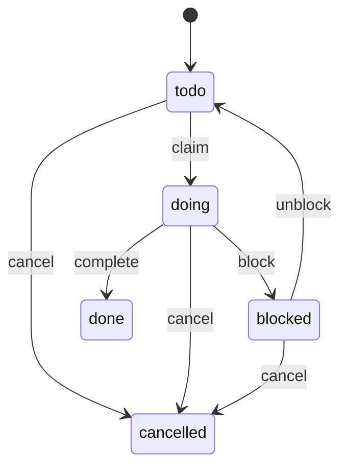

# specdojoコマンド利用ガイド

本ドキュメントでは、SpecDojo における **Gitベースのプロジェクト実行管理ツール `specdojo` CLI** の利用方法を説明します。

`specdojo` は以下を Git リポジトリ内で管理することを目的としています。

- スケジュール定義（`sch-*.yaml`）
- 実行イベント（`exec/events/*.json`）
- 実行状態・CPM等の生成物（`generated/`）

## 1. 概要

`specdojo` は以下の機能を提供します。

- スケジュール定義の検証
- 実行イベントの記録
- 実行状態の生成
- Readyタスク抽出
- CPM（Critical Path Method）計算
- クリティカルパス算出
- スケジュール差分検出
- Agent安全実行（排他ロック）
- 成果物カタログの scaffold・検証・Markdown 生成
- プロジェクト登録簿（`pjr-index.md`）の scaffold・登録項目追加・ステータス変更・派生ビュー生成

## 2. ディレクトリ構成

例:

```text
repo-root/
├─ specdojo.config.json
├─ .env
├─ docs/
│  ├─ specdojo/
│  │  └─ schemas/
│  └─ ja/
│     ├─ specdojo/
│     │  └─ templates/
│     │     ├─ dct-project-definition.yaml
│     │     ├─ dct-project-management.yaml
│     │     ├─ pm-review-viewpoints.yaml
│     │     └─ pjr-index-template.md
│     └─ projects/
│        └─ prj-0001/
│           ├─ 010-deliverables-catalog/
│           │  ├─ dct-project-definition.yaml
│           │  ├─ dct-project-management.yaml
│           │  └─ generated/
│           │     ├─ dct-project-definition.md
│           │     └─ dct-project-management.md
│           ├─ 030-project-management/
│           │  ├─ schedule/
│           │  │  ├─ sch-milestones.yaml
│           │  │  └─ sch-track-launch.yaml
│           │  └─ controls/
│           │     ├─ project-register/
│           │     │  ├─ pjr-index.md
│           │     │  └─ generated/
│           │     └─ reviews/
│           │        ├─ plans/
│           │        └─ results/
│           └─ 070-execution/
│              ├─ exec/
│              │  ├─ events/
│              │  ├─ plans/
│              │  ├─ results/
│              │  └─ .locks/
│              └─ generated/
└─ tools/
```

## 3. 設定

### 3.1. `specdojo.config.json`

複数プロジェクトを扱うための **プロジェクトレジストリ**です。

例:

```json
{
  "version": 1,
  "current_project": "prj-0001",
  "projects": {
    "prj-0001": {
      "catalog_path": "docs/ja/projects/prj-0001/010-deliverables-catalog",
      "schedule_path": "docs/ja/projects/prj-0001/030-project-management/schedule",
      "execution_path": "docs/ja/projects/prj-0001/070-execution",
      "project_register_path": "docs/ja/projects/prj-0001/030-project-management/controls/project-register",
      "members_path": "docs/ja/projects/prj-0001/030-project-management/020-organization/pm-members.yaml",
      "reviews_path": "docs/ja/projects/prj-0001/030-project-management/controls/reviews",
      "viewpoints_path": "docs/ja/projects/prj-0001/030-project-management/010-management-plan/pm-review-viewpoints.yaml",
      "run": {
        "worktree_base": "../worktrees",
        "agent_config": ".specdojo/exec-agent.yaml"
      }
    }
  }
}
```

`current_project` に作業中のプロジェクト ID を記載します。git で管理されているため、worktree を分離しても自動的に引き継がれます。`--project` フラグや `SPECDOJO_PROJECT` 環境変数で上書きできます。

`projects.<id>` には `schedule_path`、`execution_path` を指定します。必要に応じて `catalog_path`、`project_register_path`、`members_path`、`reviews_path`、`viewpoints_path`、`run` を指定します。`run.agent_config` に `exec-agent.yaml` のパスを指定すると、`exec run --auto` で `(phase_set, phase.id, mode)` から `exec-strategy` の `assignment_rules` を評価し、`pm-members.yaml` の `capabilities`・`proficiency`・`priority` に基づいて agent を自動選択できます。

### 3.2. `.env`（任意）

`current_project` を `specdojo.config.json` で管理している場合、`.env` は通常不要です。一時的にプロジェクトを切り替えたい場合や、config を変更せずに上書きしたい場合のみ使います。

```bash
SPECDOJO_PROJECT=prj-0001
```

パス直接指定が必要な場合（config なし環境など）：

```bash
SPECDOJO_SCHEDULE_PATH=docs/ja/projects/prj-0001/030-project-management/schedule
SPECDOJO_EXECUTION_PATH=docs/ja/projects/prj-0001/070-execution
```

### 3.3. プロジェクト解決順序

プロジェクトに紐づくコマンドは、原則として同じ順序で `specdojo.config.json` の project を解決します。

1. `--project` で指定したプロジェクト ID
2. `SPECDOJO_PROJECT` 環境変数（`.env` 含む）で指定したプロジェクト ID
3. `specdojo.config.json` の `current_project` フィールド（**推奨**）
4. `specdojo.config.json` の `projects` に定義された先頭のプロジェクト ID

worktree を使ったマルチエージェント実行では、`current_project` を git 管理することで `.env` のコピーが不要になります。ブランチ命名を `project/<project-id>/*` とすれば、feature ブランチや exec ブランチすべてで自動的に `current_project` が引き継がれます。

`exec` コマンドだけは、既存運用との互換のため `SPECDOJO_SCHEDULE_PATH` と `SPECDOJO_EXECUTION_PATH` の直接指定も受け付けます。直接指定する場合は、両方をセットで指定します。

### 3.4. 共通オプション方針

各コマンドのオプションは、以下の方針にそろえます。

| オプション       | 方針                                                                                                                     |
| ---------------- | ------------------------------------------------------------------------------------------------------------------------ |
| `--project <id>` | プロジェクトに紐づくコマンドで共通。省略時は `SPECDOJO_PROJECT` 環境変数、`current_project`、config 先頭の順に解決する。 |
| `--dry-run`      | ファイルやイベントを書き込むコマンドで、書き込み前の内容または実行予定を表示する。                                       |
| `--force`        | 既存ファイルがある場合にスキップする scaffold/generate 系コマンドで、上書きを許可する。                                  |
| `--scope`        | 複数の生成対象を持つ build/watch 系コマンドで、対象範囲を絞り込む。                                                      |

`--project` は共通オプションのため、個別コマンドの表では「省略可」として扱います。

## 4. 初期セットアップ

`npm link` は使いません。

このリポジトリでは `npm install` 後に root package の `src/` がビルドされ、VS Code 統合ターミナルでは `node_modules/.bin` が `PATH` に追加されます。新しいターミナルを開けば、以降は `npx` なしで `specdojo` を直接実行できます。

```bash
npm install
specdojo config init
```

VS Code 統合ターミナル以外では `PATH` が通らないため、必要に応じて以下を使ってください。

```bash
./node_modules/.bin/specdojo config init
```

### 4.1. config作成

```bash
specdojo config init
```

### 4.2. プロジェクト一覧

```bash
specdojo project list
```

## 5. catalog コマンド

`specdojo catalog` は成果物カタログ（`dct-<domain>.yaml`）の scaffold・検証・Markdown 生成を行うコマンド群です。

- scaffold（`scaffold`）: テンプレートから `dct-*.yaml` を生成
- 検証（`validate`）: `dct-*.yaml` の整合性確認
- Markdown 生成（`build`）: `generated/dct-*.md` を出力

### 5.1. catalog scaffold

`catalog_path` に `dct-*.yaml` を新規生成します。`docs/ja/specdojo/templates/` のテンプレートをもとに、プロジェクト規模に応じた成果物セットを出力します。

プロジェクトサイズは `dct-index.md` の `size` フィールドが SSOT です。`--size` を省略すると `dct-index.md` から読み込みます。

```bash
# --size 省略時は dct-index.md の size フィールドを参照
specdojo catalog scaffold --project prj-0001

# --size 指定時はその値を優先（dct-index.md の値より優先される）
specdojo catalog scaffold --project prj-0001 --size medium
```

オプション:

| オプション     | 説明                                                                      | デフォルト                                              |
| -------------- | ------------------------------------------------------------------------- | ------------------------------------------------------- |
| `--size`       | `small` / `medium` / `large`                                              | `dct-index.md` の `size` フィールド（未設定時はエラー） |
| `--project-id` | 生成ファイルに埋め込む project_id（省略時は `catalog_path` から自動導出） | 自動導出                                                |
| `--force`      | 既存ファイルを上書き                                                      | `false`                                                 |

サイズ別の収録成果物:

| 成果物                                             | small | medium | large |
| -------------------------------------------------- | :---: | :----: | :---: |
| プロジェクト概要・スコープ・成功基準               |   ○   |   ○    |   ○   |
| 管理計画・組織定義・メンバー定義                   |   ○   |   ○    |   ○   |
| マイルストーン定義                                 |   ○   |   ○    |   ○   |
| ステークホルダー・憲章・前提制約・課題・代替案比較 |   -   |   ○    |   ○   |
| コミュニケーション計画・品質管理計画・ロール定義   |   -   |   ○    |   ○   |
| 管理台帳・フルスケジュール・レポート               |   -   |   ○    |   ○   |
| RACI                                               |   -   |   -    |   ○   |

既存ファイルはデフォルトでスキップされます（`--force` で上書き可能）。

### 5.2. catalog パス確認

```bash
specdojo catalog where --project prj-0001
```

出力例:

```text
catalog-path: /repo/.../010-deliverables-catalog
generated   : /repo/.../010-deliverables-catalog/generated
```

### 5.3. catalog 検証

```bash
specdojo catalog validate --project prj-0001
```

検証内容:

- JSON Schema 検証（`dct.schema.yaml`）
- `local_id` の一意性確認
- `depends_on` 参照先の存在確認
- `kind: work` の必須フィールド確認（`path`、`done_criteria`）

### 5.4. catalog 生成

```bash
specdojo catalog build --project prj-0001
```

生成:

```text
generated/
├─ dct-project-definition.md
├─ dct-project-management.md
└─ ...（dct-*.yaml ごとに 1 ファイル）
```

`dct-<domain>.md` は対応する `dct-<domain>.yaml` の `groups` 構造に従い、成果物一覧を章立てで出力します。

## 6. schedule コマンド

`specdojo schedule` は、`sch-strategy-<track>.yaml` と成果物カタログから `sch-track-<track>.yaml` を生成するコマンド群です。

### 6.1. schedule generate

成果物カタログ（`dct-*.yaml`）と `sch-strategy-<track>.yaml` を入力として、`sch-track-<track>.yaml` を生成します。

```bash
specdojo schedule generate --project prj-0001 --track launch
```

オプション:

| オプション  | 説明                                                                            | デフォルト |
| ----------- | ------------------------------------------------------------------------------- | ---------- |
| `--project` | プロジェクト ID（`specdojo.config.json` から解決）                              | 省略可     |
| `--track`   | 生成対象のトラック名（`sch-strategy-<track>.yaml` の `track` フィールドと一致） | 必須       |
| `--force`   | 既存の `sch-track-<track>.yaml` を上書き                                        | `false`    |
| `--dry-run` | ファイルを書き出さず、生成内容を標準出力に表示                                  | `false`    |

#### 6.1.1. 生成フロー

1. `schedule_path` から `sch-strategy-<track>.yaml` を読み込む。
2. `scope.catalogs` に列挙されたカタログファイルを読み込み、`include_kinds` でフィルタリングする。
3. カタログの `depends_on` と `cross_domain_dependencies` から成果物の展開順序を決定する。
4. 成果物ごとに `owner_rules` の `phase_sets` を適用し、フェーズごとのタスクを生成する。
5. `owner_rules` から `owner` ロールを決定する。
6. タスク ID はトラック名・`local_id`・`phase_suffix` から自動導出する（`T-<TRACK>-<local_id>-<phase_suffix>`）。
7. `sch-track-<track>.yaml`（`kind: track`）として `schedule_path` に出力する。
8. 生成された milestone がある場合は `sch-milestones.yaml` を作成または更新する。

#### 6.1.2. タスク ID の導出規則

タスク ID は以下のルールで自動導出する。手動での指定は不要。

```text
T-<TRACK>-<local_id>-<phase_suffix>
```

| 要素             | 値の例         | 説明                                             |
| ---------------- | -------------- | ------------------------------------------------ |
| `T-`             | `T-`           | タスク固定プレフィックス                         |
| `<TRACK>`        | `LAUNCH`       | トラック名の大文字（`track: launch` → `LAUNCH`） |
| `<local_id>`     | `prj-overview` | 成果物カタログの `local_id`（ケース変換なし）    |
| `<phase_suffix>` | `010`          | `phase_sets` 定義の `task_suffix`                |

例: トラック `launch`、`local_id: prj-overview`、`task_suffix: "010"` → `T-LAUNCH-prj-overview-010`

マイルストーンは `M-<TRACK>-<name>`、フェーズゲートは `G-<TRACK>-<name>` の形式で `sch-milestones.yaml` に定義する。

#### 6.1.3. タスク生成ルール

各 `kind: work` 成果物に対してフェーズごとのタスクを生成する。フェーズは `sch-strategy-<track>.yaml` の `phase_sets` で定義する。

デフォルトの `first-pass` + `finalize-pass` の構成例（`prj-overview`）:

| フェーズ                  | `phase_suffix` | タスク ID                   | `depends_on`                          |
| ------------------------- | -------------- | --------------------------- | ------------------------------------- |
| draft（たたき台作成）     | `010`          | `T-LAUNCH-prj-overview-010` | 依存成果物の finalize タスク ID       |
| enrich（調査・補強）      | `020`          | `T-LAUNCH-prj-overview-020` | `T-LAUNCH-prj-overview-010`           |
| review（一次版レビュー）  | `030`          | `T-LAUNCH-prj-overview-030` | `T-LAUNCH-prj-overview-020`           |
| align（整合性確認・修正） | `040`          | `T-LAUNCH-prj-overview-040` | `G-LAUNCH-first-pass`（ゲート通過後） |
| finalize（完成版確定）    | `050`          | `T-LAUNCH-prj-overview-050` | `T-LAUNCH-prj-overview-040`           |

`phase_sets` を変更することでフェーズ数・`task_suffix` を自由に変更できる。

#### 6.1.4. 出力例（抜粋）

```yaml
kind: track
id: prj-0001:sch-track-launch
type: project
status: draft
version: 1
project_id: prj-0001
track: launch
settings:
  start_date: '2026-05-24'
tasks:
  - local_id: prj-overview
    phase_suffix: '010'
    name: たたき台作成
    duration_days: 0.25
    depends_on: []
    owner: BA

  - local_id: prj-overview
    phase_suffix: '020'
    name: 調査・補強
    duration_days: 0.5
    depends_on:
      - T-LAUNCH-prj-overview-010
    owner: BA

  - local_id: pm-organization
    phase_suffix: '010'
    name: たたき台作成
    duration_days: 0.25
    depends_on:
      - T-LAUNCH-prj-overview-030 # cross_domain_dependencies による依存
    owner: PO
```

タスク ID は `id:` フィールドを省略しても `T-LAUNCH-prj-overview-010` のように自動導出される。`depends_on` には導出後のフルIDを記載する。

### 6.2. schedule where

スケジュールパスを確認する。

```bash
specdojo schedule where --project prj-0001
```

出力例:

```text
schedule-path: /repo/.../030-project-management/schedule
strategy-files:
  - sch-strategy-launch.yaml
track-files:
  - sch-track-launch.yaml
```

## 7. review コマンド

> **[非推奨]** `specdojo review` コマンド全体は非推奨です。`exec scaffold` / `exec build` / `exec run` を使用してください。

`specdojo review` は、成果物カタログの `done_criteria` と観点定義から review plan を生成し、review result をスキャフォールドするコマンド群です。

- scaffold（`scaffold`）: テンプレートから `pm-review-viewpoints.yaml` を生成（`exec scaffold` に置き換えられました）
- plan 生成（`plan`）: `dct-*.yaml` の `done_criteria` から `rvp-*.yaml` を生成
- result スキャフォールド（`result`）: `rvp-*.yaml` から `rvr-*.yaml` をスキャフォールド
- パス確認（`where`）: review 関連パスを確認

`specdojo.config.json` に `reviews_path` と `viewpoints_path` を追加する。

```json
{
  "projects": {
    "prj-0001": {
      "catalog_path": "docs/ja/projects/prj-0001/010-deliverables-catalog",
      "schedule_path": "docs/ja/projects/prj-0001/030-project-management/schedule",
      "reviews_path": "docs/ja/projects/prj-0001/030-project-management/controls/reviews",
      "viewpoints_path": "docs/ja/projects/prj-0001/030-project-management/010-management-plan/pm-review-viewpoints.yaml"
    }
  }
}
```

### 7.1. review scaffold

> **[非推奨]** このコマンドは非推奨です。`exec scaffold` を使用してください。

`viewpoints_path` に `pm-review-viewpoints.yaml` を新規生成する。`docs/ja/specdojo/templates/pm-review-viewpoints-template.yaml` をもとに `project_id` を置換して出力する。`exec scaffold` はこのコマンドの機能を引き継いでいます。

```bash
specdojo review scaffold --project prj-0001
```

オプション:

| オプション  | 説明                                               | デフォルト |
| ----------- | -------------------------------------------------- | ---------- |
| `--project` | プロジェクト ID（`specdojo.config.json` から解決） | 省略可     |
| `--force`   | 既存の `pm-review-viewpoints.yaml` を上書き        | `false`    |

既存ファイルはデフォルトでスキップされます（`--force` で上書き可能）。

### 7.2. review plan

> **[非推奨]** このコマンドは非推奨です。`exec build` を使用してください。

成果物カタログの `done_criteria[].roles` と `done_criteria[].viewpoint` を読み込み、`rvp-<local_id>-<stage>.yaml` を生成する。

```bash
specdojo review plan \
  --project prj-0001 \
  --local-id prj-overview \
  --stage draft
```

オプション:

| オプション   | 説明                                                            | デフォルト |
| ------------ | --------------------------------------------------------------- | ---------- |
| `--project`  | プロジェクト ID（`specdojo.config.json` から解決）              | 省略可     |
| `--local-id` | 対象成果物の `local_id`                                         | 必須       |
| `--stage`    | レビュー段階（`draft` / `first` / `final` / `ready-candidate`） | 必須       |
| `--role`     | 対象 Role code に絞り込む（省略時は全ロール）                   | 省略可     |
| `--force`    | 既存の `rvp-*.yaml` を上書き                                    | `false`    |
| `--dry-run`  | ファイルを書き出さず、生成内容を標準出力に表示                  | `false`    |

#### 7.2.1. 生成フロー

1. `scope.catalogs` に列挙されたカタログから `--local-id` に一致する成果物を検索する。
2. `done_criteria` を `--role` でフィルタリングする（省略時は全項目）。
3. 各 `done_criteria` 項目の `viewpoint` を `pm-review-viewpoints.yaml` で照合し、`coverage_types` を取得する。
4. 成果物の `rulebook` フィールド（ID）から `docs/ja/specdojo/rulebooks/<id>.md` へパスを解決する（フィールドがない場合は `none`）。
5. `review_items` を生成し、`reviews_path/plans/rvp-<local_id>-<stage>.yaml` に出力する。

#### 7.2.2. 出力例

```yaml
id: rvp-prj-overview-draft
project_id: prj-0001
target:
  local_id: prj-overview
  path: /docs/ja/projects/prj-0001/020-project-definition/prj-overview.md
  stage: draft
  version_ref: none
inputs:
  deliverable_catalog: /docs/ja/projects/prj-0001/010-deliverables-catalog/dct-project-definition.yaml
  rulebook: prj-overview-rulebook
  viewpoints: /docs/ja/projects/prj-0001/030-project-management/010-management-plan/pm-review-viewpoints.yaml
  related_documents: []
machine_checks_required:
  - name: lint:md
    required: true
  - name: schema
    required: false
review_items:
  - id: RVP-001
    role: BA
    viewpoint_id: vp-ba-business-value
    done_criterion: プロジェクトの目的・背景・ゴールが業務観点で確認できる粒度で記述されていること
    coverage_required:
      - stakeholder
      - business_goal
      - use_case
      - business_event
      - traceability
    evidence_required:
      - target_document
      - deliverable_catalog
    expected_output:
      - result
      - evidence
      - findings
      - unverified_scope
  - id: RVP-002
    role: PO
    viewpoint_id: vp-po-purpose-alignment
    done_criterion: プロジェクトの目的・スコープを承認できる情報が含まれていること
    coverage_required:
      - business_goal
      - scope_boundary
      - traceability
    evidence_required:
      - target_document
      - deliverable_catalog
    expected_output:
      - result
      - evidence
      - findings
      - unverified_scope
```

### 7.3. review where

> **[非推奨]** このコマンドは非推奨です。`exec` コマンドを使用してください。

review 関連パスを確認する。

```bash
specdojo review where --project prj-0001
```

出力例:

```text
reviews-path: /repo/.../030-project-management/controls/reviews
plans       : /repo/.../controls/reviews/plans
results     : /repo/.../controls/reviews/results
viewpoints  : /repo/.../010-management-plan/pm-review-viewpoints.yaml
```

### 7.4. review result

> **[非推奨]** このコマンドは非推奨です。`exec run` を使用してください。

`reviews_path/plans/rvp-<local_id>-<stage>.yaml` を読み込み、`rvr-<local_id>-<stage>-<role>.yaml` をスキャフォールドする。

```bash
specdojo review result \
  --project prj-0001 \
  --local-id prj-overview \
  --stage draft \
  --role BA
```

オプション:

| オプション   | 説明                                                            | デフォルト |
| ------------ | --------------------------------------------------------------- | ---------- |
| `--project`  | プロジェクト ID（`specdojo.config.json` から解決）              | 省略可     |
| `--local-id` | 対象成果物の `local_id`                                         | 必須       |
| `--stage`    | レビュー段階（`draft` / `first` / `final` / `ready-candidate`） | 必須       |
| `--role`     | 対象 Role code                                                  | 必須       |
| `--reviewer` | レビュアーのニックネーム                                        | `_TODO_`   |
| `--force`    | 既存の `rvr-*.yaml` を上書き                                    | `false`    |
| `--dry-run`  | ファイルを書き出さず、生成内容を標準出力に表示                  | `false`    |

#### 7.4.1. 生成フロー

1. `reviews_path/plans/rvp-<local_id>-<stage>.yaml` を読み込む。
2. `review_items` を `--role` でフィルタリングする。
3. 各 `review_items` エントリに対応する `review_results` エントリを生成する（`result` は空文字列、`coverage_checked` は `coverage_required` から転記、`evidence` と `notes` は空で初期化）。
4. `machine_checks` はレビュー計画の `machine_checks_required` から転記し、`result` を `skipped` で初期化する。
5. `findings` と `unverified_scope` を空リストで初期化する。
6. `reviews_path/results/rvr-<local_id>-<stage>-<role-lowercase>.yaml` に出力する。Role code はファイル名では小文字に変換する（`BA` → `ba`、`QE` → `qe`）。

#### 7.4.2. 出力例

```yaml
id: rvr-prj-overview-draft-ba
project_id: prj-0001
based_on:
  - rvp-prj-overview-draft
target:
  local_id: prj-overview
  path: /docs/ja/projects/prj-0001/020-project-definition/prj-overview.md
  stage: draft
review:
  role: BA
  reviewer: _TODO_
  status: ''
  reviewed_at: ''
machine_checks:
  - name: lint:md
    result: skipped
    notes: ''
review_results:
  - plan_item_id: RVP-001
    viewpoint_id: vp-ba-business-value
    result: ''
    coverage_checked:
      - stakeholder
      - business_goal
      - use_case
      - business_event
      - traceability
    evidence: []
    notes: ''
unverified_scope: []
findings: []
decision:
  recommendation: ''
  approver_required: none
```

## 8. register コマンド

`specdojo register` は、プロジェクト登録簿（Project Register）を扱うコマンド群です。

- scaffold（`scaffold`）: テンプレートから `pjr-index.md` を生成
- 登録項目追加（`add`）: `pjr-index.md` に登録項目を追加し、必要に応じて個票を生成
- 派生ビュー生成（`build`）: `pjr-index.md` と個票から `generated/` 配下の派生ビューを生成
- 項目更新（`update`）: タイトル・期限・担当者・優先度などのフィールドを更新
- 作業開始（`start`）: 登録項目のステータスを `in-progress` に変更
- 待機（`wait`）: 登録項目のステータスを `waiting` に変更
- レビュー（`review`）: 登録項目のステータスを `review` に変更
- 完了（`close`）: 登録項目のステータスを `done` / `decided` に変更
- 却下（`reject`）: 登録項目のステータスを `rejected` に変更
- 保留（`defer`）: 登録項目のステータスを `deferred` に変更
- 再オープン（`reopen`）: 登録項目のステータスを `open` 等に戻す

`specdojo.config.json` に `project_register_path` を追加する。

```json
{
  "projects": {
    "prj-0001": {
      "project_register_path": "docs/ja/projects/prj-0001/030-project-management/controls/project-register"
    }
  }
}
```

### 8.1. register scaffold

`project_register_path` に `pjr-index.md` を新規生成する。`docs/ja/specdojo/templates/pjr-index-template.md` をもとに `_PRJ-0000_` をプロジェクト ID に置換して出力し、最後に `register build --scope all` 相当を実行して派生ビューも生成する。

```bash
specdojo register scaffold --project prj-0001
```

オプション:

| オプション     | 説明                                                               | デフォルト  |
| -------------- | ------------------------------------------------------------------ | ----------- |
| `--project`    | プロジェクト ID（`specdojo.config.json` から解決）                 | 省略可      |
| `--project-id` | 生成ファイルに埋め込む project id（省略時は `--project` と同じ値） | `--project` |
| `--force`      | 既存の `pjr-index.md` を上書き                                     | `false`     |
| `--dry-run`    | ファイルを書き出さず、生成内容を標準出力に表示                     | `false`     |

既存ファイルはデフォルトでスキップされます（`--force` で上書き可能）。

#### 8.1.1. 生成フロー

1. `--project` で指定したプロジェクト ID を `specdojo.config.json` から解決する。
2. `projects.<id>.project_register_path` を出力先ディレクトリとして解決する。
3. `docs/ja/specdojo/templates/pjr-index-template.md` を読み込む。
4. `_PRJ-0000_` を `--project-id` または `--project` の値に置換する。
5. `project_register_path/pjr-index.md` に出力する。
6. `project_register_path/generated/` と `controls/generated/` を作成する。
7. `register build --scope all` 相当を実行し、登録簿内の補助一覧と controls 全体の type 別管理ビューを生成する。

#### 8.1.2. 出力

```text
controls/
├─ project-register/
│  ├─ pjr-index.md
│  └─ generated/
│     └─ pjr-views.md
└─ generated/
   ├─ pm-risk-register.md
   ├─ pm-issue-log.md
   ├─ pm-change-request-log.md
   └─ pm-decision-log.md
```

`pjr-index.md` の frontmatter は以下の形式で生成する。

```yaml
id: prj-0001:pjr-index
type: project
status: draft
rulebook: pjr-index-rulebook
```

本文には「登録項目一覧」テーブルを含め、初期行として `PJR-0001` の TODO 行を 1 件配置する。

#### 8.1.3. 検証

生成後は `pjr-index.schema.yaml` で本文構造を検証する。

```bash
npm run validate:schema:pjr-index
```

検証対象の主なルール:

| 項目       | ルール                                                                                         |
| ---------- | ---------------------------------------------------------------------------------------------- |
| セクション | `## 1. 登録項目一覧` が存在する                                                                |
| 必須列     | `ID`、`ステータス`、`タイトル`、`分類`、`優先度`                                               |
| ID         | `PJR-0000` 形式                                                                                |
| ステータス | `open` / `in-progress` / `waiting` / `review` / `decided` / `done` / `deferred` / `rejected`   |
| 分類       | `todo` / `question` / `risk` / `issue` / `change-request` / `decision` / `dependency` / `note` |
| 優先度     | `high` / `medium` / `low`                                                                      |

### 8.2. register add

`pjr-index.md` の「登録項目一覧」テーブルに 1 行追加する。`--ticket` を指定した場合は、分類に対応する `docs/ja/specdojo/templates/pjr-<type>-template.md` から個票も生成する。

```bash
specdojo register add \
  --project prj-0001 \
  --type todo \
  --title "レビュー観点の棚卸し" \
  --description "既存のレビュー観点を確認し、不足を整理する" \
  --priority high \
  --owner ARC \
  --due 2026-05-24
```

個票も生成する例:

```bash
specdojo register add \
  --project prj-0001 \
  --type risk \
  --title "外部レビュー遅延" \
  --description "外部レビューの回答遅延により launch track が遅れる可能性がある" \
  --priority medium \
  --owner PO \
  --due 2026-05-31 \
  --ticket \
  --topic external-review-delay
```

オプション:

| オプション      | 説明                                                            | デフォルト             |
| --------------- | --------------------------------------------------------------- | ---------------------- |
| `--project`     | プロジェクト ID（`specdojo.config.json` から解決）              | 省略可                 |
| `--type`        | 登録項目の分類                                                  | 必須                   |
| `--title`       | 登録項目の短いタイトル                                          | 必須                   |
| `--description` | 一覧に記載する説明。`--ticket` 指定時も要約として使う           | `_TODO_`               |
| `--priority`    | `high` / `medium` / `low`                                       | `medium`               |
| `--status`      | 登録項目のステータス                                            | `open`                 |
| `--owner`       | 主担当者または役割                                              | `_TODO_`               |
| `--due`         | 期限（`YYYY-MM-DD` / `-` / `_TODO_`）                           | `_TODO_`               |
| `--completed`   | 完了日（`YYYY-MM-DD` / `-`）                                    | `-`                    |
| `--conclusion`  | 結論または対応結果の要約                                        | `-`                    |
| `--id`          | 追加する表示 ID（例: `PJR-0061`）。省略時は既存最大 ID の次番号 | 自動採番               |
| `--ticket`      | 個票 `pjr-XXXX-<topic>.md` を生成し、「個票」列にリンクを設定   | `false`                |
| `--topic`       | 個票ファイル名の `<topic>`。`--ticket` 指定時に使用             | `--title` から slug 化 |
| `--force`       | 既存の個票ファイルを上書き                                      | `false`                |
| `--dry-run`     | ファイルを書き出さず、追加予定の行と個票内容を標準出力に表示    | `false`                |

`--type` には以下を指定できる。

| type             | 個票テンプレート                 |
| ---------------- | -------------------------------- |
| `todo`           | `pjr-todo-template.md`           |
| `question`       | `pjr-question-template.md`       |
| `risk`           | `pjr-risk-template.md`           |
| `issue`          | `pjr-issue-template.md`          |
| `change-request` | `pjr-change-request-template.md` |
| `decision`       | `pjr-decision-template.md`       |
| `dependency`     | `pjr-dependency-template.md`     |
| `note`           | `pjr-note-template.md`           |

#### 8.2.1. 生成フロー

1. `--project` で指定したプロジェクト ID を `specdojo.config.json` から解決する。
2. `projects.<id>.project_register_path/pjr-index.md` を読み込む。
3. 「登録項目一覧」テーブルから既存の `PJR-XXXX` を走査し、`--id` 省略時は次番号を採番する。
4. `--type`、`--status`、`--priority`、`--due`、`--completed` が許容値に一致することを検証する。
5. `pjr-index.md` のテーブル末尾に登録項目行を追加する。
6. `--ticket` 指定時は `pjr-XXXX-<topic>.md` を生成し、「個票」列に `[pjr-XXXX-<topic>](./pjr-XXXX-<topic>.md)` を設定する。
7. 指定値の形式と既存 ID の重複を検証する。

#### 8.2.2. 追加される行

個票なしの場合:

```markdown
| PJR-0061 | open | レビュー観点の棚卸し | 既存のレビュー観点を確認し、不足を整理する | todo | high | ARC | 2026-05-24 | - | - | - |
```

個票ありの場合:

```markdown
| PJR-0062 | open | 外部レビュー遅延 | 外部レビューの回答遅延により launch track が遅れる可能性がある | risk | medium | PO | 2026-05-31 | - | - | [pjr-0062-external-review-delay](./pjr-0062-external-review-delay.md) |
```

#### 8.2.3. 個票生成

`--ticket` 指定時は、分類に対応するテンプレートを使って個票を生成する。

```text
controls/project-register/
├─ pjr-index.md
├─ pjr-0062-external-review-delay.md
└─ generated/
```

個票の frontmatter は以下の形式で生成する。

```yaml
id: prj-0001:pjr-0062
type: project
status: draft
rulebook: pjr-index-rulebook
item_type: risk
```

テンプレート内の `_PRJ-0000_`、`_PJR-XXXX_`、`_<TYPE>_TITLE_` 相当のプレースホルダーは、プロジェクト ID、表示 ID、タイトルで置換する。

#### 8.2.4. 検証

追加前に ID、ステータス、分類、優先度、日付形式を検証する。必要に応じて、更新後に schema 検証を実行する。

```bash
npm run validate:schema:pjr-index
```

検証エラー時は `pjr-index.md` と個票を更新せず、エラー内容を表示する。

### 8.3. register build

`pjr-index.md` と各 `pjr-XXXX-<topic>.md` を入力として、プロジェクト登録簿の派生ビューを再生成する。派生ビューは補助一覧であり、正本は `pjr-index.md` と個票です。

```bash
specdojo register build --project prj-0001
```

オプション:

| オプション  | 説明                                                               | デフォルト |
| ----------- | ------------------------------------------------------------------ | ---------- |
| `--project` | プロジェクト ID（`specdojo.config.json` から解決）                 | 省略可     |
| `--scope`   | 生成範囲。`register` / `controls` / `all`                          | `all`      |
| `--dry-run` | ファイルを書き出さず、生成予定のファイル一覧と内容を標準出力に表示 | `false`    |

#### 8.3.1. 生成されるファイル

`--scope register` では、`project_register_path/generated/` に登録簿内の補助一覧を生成する。

```text
controls/project-register/generated/
└─ pjr-views.md
```

`--scope controls` では、`project_register_path` の親ディレクトリの `generated/` に controls 全体の type 別管理ビューを生成する。

```text
controls/generated/
├─ pm-risk-register.md
├─ pm-issue-log.md
├─ pm-change-request-log.md
└─ pm-decision-log.md
```

#### 8.3.2. 生成フロー

1. `--project` で指定したプロジェクト ID を `specdojo.config.json` から解決する。
2. `projects.<id>.project_register_path/pjr-index.md` を読み込む。
3. 「登録項目一覧」テーブルを解析し、必要に応じて `pjr-XXXX-<topic>.md` の個票情報を読み込む。
4. `pjr-index.schema.yaml` で `pjr-index.md` の本文構造を検証する。
5. `--scope` に応じて、登録簿内の補助一覧と controls 全体の type 別管理ビューを生成する。
6. 生成ファイルには「正本は `pjr-index.md` と個票であり、派生ビューは再生成可能である」ことを明記する。

#### 8.3.3. ビュー生成ルール

| 派生ビュー                 | 抽出・並び替えルール                                                            |
| -------------------------- | ------------------------------------------------------------------------------- |
| `pjr-open-items.md`        | `status` が `done` / `rejected` / `deferred` 以外の項目を一覧化する             |
| `pjr-by-owner.md`          | `担当` ごとに項目をグルーピングする                                             |
| `pjr-by-priority.md`       | `優先度` ごとに `high` / `medium` / `low` の順でグルーピングする                |
| `pjr-by-status.md`         | `ステータス` ごとに項目をグルーピングする                                       |
| `pm-risk-register.md`      | `分類` が `risk` の項目を controls 全体のリスク登録簿として一覧化する           |
| `pm-issue-log.md`          | `分類` が `issue` の項目を controls 全体の課題ログとして一覧化する              |
| `pm-change-request-log.md` | `分類` が `change-request` の項目を controls 全体の変更要求ログとして一覧化する |
| `pm-decision-log.md`       | `分類` が `decision` の項目を controls 全体の決定記録として一覧化する           |

#### 8.3.4. 検証

生成前に `pjr-index.schema.yaml` で本文構造を検証する。検証エラー時は派生ビューを更新せず、エラー内容を表示する。

```bash
npm run validate:schema:pjr-index
```

### 8.4. register close

登録項目のステータスを `done`（完了）または `decided`（決定済み）に変更する。`--completed` を省略した場合は実行日の日付を使用する。

```bash
specdojo register close \
  --project prj-0001 \
  --id PJR-0061 \
  --conclusion "レビュー観点の棚卸しを完了。不足していた QE 観点を rulebook に追記した。"
```

`decision` / `question` 分類の項目を決定済みにする例:

```bash
specdojo register close \
  --project prj-0001 \
  --id PJR-0055 \
  --status decided \
  --conclusion "外部APIはREST方式を採用することに決定。" \
  --completed 2026-05-23
```

オプション:

| オプション     | 説明                                               | デフォルト                                                       |
| -------------- | -------------------------------------------------- | ---------------------------------------------------------------- |
| `--project`    | プロジェクト ID（`specdojo.config.json` から解決） | 省略可                                                           |
| `--id`         | 対象登録項目の ID（`PJR-XXXX` 形式）               | 必須                                                             |
| `--status`     | 変更後のステータス。`done` または `decided`        | 分類が `decision` / `question` の場合 `decided`、その他は `done` |
| `--conclusion` | 結論・対応結果の要約                               | 変更しない                                                       |
| `--completed`  | 完了日（`YYYY-MM-DD`）                             | 実行日                                                           |
| `--dry-run`    | ファイルを書き出さず、変更予定の行を標準出力に表示 | `false`                                                          |

#### 8.4.1. 更新フロー

1. `pjr-index.md` を読み込み、`--id` に一致する行を特定する。
2. `--status` が `done` / `decided` のいずれかであることを検証する。
3. 対象行の `ステータス` 列を更新し、`完了日` 列に `--completed` の値を設定する。
4. `--conclusion` が指定されている場合は `結論` 列を更新する。
5. `register build --scope all` 相当を実行して派生ビューを再生成する。

#### 8.4.2. 検証

対象 ID が存在しない場合、または現在のステータスがすでに `done` / `decided` / `rejected` / `deferred` の場合はエラーを返す。

```bash
npm run validate:schema:pjr-index
```

### 8.5. register reject

登録項目のステータスを `rejected`（却下）に変更する。`--completed` を省略した場合は実行日の日付を使用する。

```bash
specdojo register reject \
  --project prj-0001 \
  --id PJR-0062 \
  --conclusion "リスク軽減コストが便益を上回るため対応しないことに決定。"
```

オプション:

| オプション     | 説明                                               | デフォルト |
| -------------- | -------------------------------------------------- | ---------- |
| `--project`    | プロジェクト ID（`specdojo.config.json` から解決） | 省略可     |
| `--id`         | 対象登録項目の ID（`PJR-XXXX` 形式）               | 必須       |
| `--conclusion` | 却下理由の要約                                     | 変更しない |
| `--completed`  | 却下日（`YYYY-MM-DD`）                             | 実行日     |
| `--dry-run`    | ファイルを書き出さず、変更予定の行を標準出力に表示 | `false`    |

#### 8.5.1. 更新フロー

1. `pjr-index.md` を読み込み、`--id` に一致する行を特定する。
2. 対象行の `ステータス` 列を `rejected` に更新し、`完了日` 列に `--completed` の値を設定する。
3. `--conclusion` が指定されている場合は `結論` 列を更新する。
4. `register build --scope all` 相当を実行して派生ビューを再生成する。

#### 8.5.2. 検証

対象 ID が存在しない場合、または現在のステータスがすでに `done` / `decided` / `rejected` / `deferred` の場合はエラーを返す。

```bash
npm run validate:schema:pjr-index
```

### 8.6. register defer

登録項目のステータスを `deferred`（保留）に変更する。完了日は設定しない。

```bash
specdojo register defer \
  --project prj-0001 \
  --id PJR-0063 \
  --conclusion "Phase 2 以降に対応を先送りする。"
```

オプション:

| オプション     | 説明                                               | デフォルト |
| -------------- | -------------------------------------------------- | ---------- |
| `--project`    | プロジェクト ID（`specdojo.config.json` から解決） | 省略可     |
| `--id`         | 対象登録項目の ID（`PJR-XXXX` 形式）               | 必須       |
| `--conclusion` | 保留理由の要約                                     | 変更しない |
| `--dry-run`    | ファイルを書き出さず、変更予定の行を標準出力に表示 | `false`    |

#### 8.6.1. 更新フロー

1. `pjr-index.md` を読み込み、`--id` に一致する行を特定する。
2. 対象行の `ステータス` 列を `deferred` に更新する。`完了日` 列は変更しない。
3. `--conclusion` が指定されている場合は `結論` 列を更新する。
4. `register build --scope all` 相当を実行して派生ビューを再生成する。

#### 8.6.2. 検証

対象 ID が存在しない場合、または現在のステータスがすでに `done` / `decided` / `rejected` / `deferred` の場合はエラーを返す。

```bash
npm run validate:schema:pjr-index
```

### 8.7. register reopen

`done` / `decided` / `rejected` / `deferred` の登録項目を未完了ステータスに戻す。

```bash
specdojo register reopen \
  --project prj-0001 \
  --id PJR-0061
```

ステータスを `in-progress` に戻す例:

```bash
specdojo register reopen \
  --project prj-0001 \
  --id PJR-0061 \
  --status in-progress
```

オプション:

| オプション  | 説明                                                              | デフォルト |
| ----------- | ----------------------------------------------------------------- | ---------- |
| `--project` | プロジェクト ID（`specdojo.config.json` から解決）                | 省略可     |
| `--id`      | 対象登録項目の ID（`PJR-XXXX` 形式）                              | 必須       |
| `--status`  | 変更後のステータス。`open` / `in-progress` / `waiting` / `review` | `open`     |
| `--dry-run` | ファイルを書き出さず、変更予定の行を標準出力に表示                | `false`    |

#### 8.7.1. 更新フロー

1. `pjr-index.md` を読み込み、`--id` に一致する行を特定する。
2. `--status` が `open` / `in-progress` / `waiting` / `review` のいずれかであることを検証する。
3. 対象行の `ステータス` 列を更新し、`完了日` 列を `-` にリセットする。
4. `register build --scope all` 相当を実行して派生ビューを再生成する。

#### 8.7.2. 検証

対象 ID が存在しない場合、または現在のステータスがすでに未完了（`open` / `in-progress` / `waiting` / `review`）の場合はエラーを返す。

```bash
npm run validate:schema:pjr-index
```

### 8.8. register update

登録項目のタイトル・説明・期限・担当者・優先度などのフィールドを更新する。ステータスの変更は専用コマンド（`start` / `wait` / `review` / `close` / `reject` / `defer` / `reopen`）を使う。

```bash
specdojo register update \
  --project prj-0001 \
  --id PJR-0061 \
  --due 2026-06-15 \
  --owner BA
```

オプション:

| オプション      | 説明                                               | デフォルト |
| --------------- | -------------------------------------------------- | ---------- |
| `--project`     | プロジェクト ID（`specdojo.config.json` から解決） | 省略可     |
| `--id`          | 対象登録項目の ID（`PJR-XXXX` 形式）               | 必須       |
| `--title`       | タイトルの更新                                     | 変更しない |
| `--description` | 説明の更新                                         | 変更しない |
| `--priority`    | 優先度の更新。`high` / `medium` / `low`            | 変更しない |
| `--owner`       | 担当者または役割の更新                             | 変更しない |
| `--due`         | 期限の更新（`YYYY-MM-DD` / `-` / `_TODO_`）        | 変更しない |
| `--dry-run`     | ファイルを書き出さず、変更予定の行を標準出力に表示 | `false`    |

#### 8.8.1. 更新フロー

1. `pjr-index.md` を読み込み、`--id` に一致する行を特定する。
2. 指定されたフィールドのみ上書きし、指定なしのフィールドは変更しない。
3. `register build --scope all` 相当を実行して派生ビューを再生成する。

#### 8.8.2. 検証

対象 ID が存在しない場合、または更新対象フィールドが 1 つも指定されていない場合はエラーを返す。

```bash
npm run validate:schema:pjr-index
```

### 8.9. register start

登録項目のステータスを `in-progress`（作業中）に変更する。`open` の項目に着手するときに使う。

```bash
specdojo register start \
  --project prj-0001 \
  --id PJR-0061
```

オプション:

| オプション  | 説明                                               | デフォルト |
| ----------- | -------------------------------------------------- | ---------- |
| `--project` | プロジェクト ID（`specdojo.config.json` から解決） | 省略可     |
| `--id`      | 対象登録項目の ID（`PJR-XXXX` 形式）               | 必須       |
| `--dry-run` | ファイルを書き出さず、変更予定の行を標準出力に表示 | `false`    |

#### 8.9.1. 更新フロー

1. `pjr-index.md` を読み込み、`--id` に一致する行を特定する。
2. 対象行の `ステータス` 列を `in-progress` に更新する。
3. `register build --scope all` 相当を実行して派生ビューを再生成する。

#### 8.9.2. 検証

対象 ID が存在しない場合、または現在のステータスがすでに `done` / `decided` / `rejected` / `deferred` の場合はエラーを返す。

```bash
npm run validate:schema:pjr-index
```

### 8.10. register wait

登録項目のステータスを `waiting`（待機中）に変更する。外部依存の回答待ちや承認待ちで作業を一時停止するときに使う。

```bash
specdojo register wait \
  --project prj-0001 \
  --id PJR-0061 \
  --conclusion "外部チームの回答待ち。"
```

オプション:

| オプション     | 説明                                               | デフォルト |
| -------------- | -------------------------------------------------- | ---------- |
| `--project`    | プロジェクト ID（`specdojo.config.json` から解決） | 省略可     |
| `--id`         | 対象登録項目の ID（`PJR-XXXX` 形式）               | 必須       |
| `--conclusion` | 待機理由の要約                                     | 変更しない |
| `--dry-run`    | ファイルを書き出さず、変更予定の行を標準出力に表示 | `false`    |

#### 8.10.1. 更新フロー

1. `pjr-index.md` を読み込み、`--id` に一致する行を特定する。
2. 対象行の `ステータス` 列を `waiting` に更新する。
3. `--conclusion` が指定されている場合は `結論` 列を更新する。
4. `register build --scope all` 相当を実行して派生ビューを再生成する。

#### 8.10.2. 検証

対象 ID が存在しない場合、または現在のステータスがすでに `done` / `decided` / `rejected` / `deferred` の場合はエラーを返す。

```bash
npm run validate:schema:pjr-index
```

### 8.11. register review

登録項目のステータスを `review`（レビュー中）に変更する。成果物のレビュー依頼や確認中の状態を示すときに使う。

```bash
specdojo register review \
  --project prj-0001 \
  --id PJR-0061
```

オプション:

| オプション  | 説明                                               | デフォルト |
| ----------- | -------------------------------------------------- | ---------- |
| `--project` | プロジェクト ID（`specdojo.config.json` から解決） | 省略可     |
| `--id`      | 対象登録項目の ID（`PJR-XXXX` 形式）               | 必須       |
| `--dry-run` | ファイルを書き出さず、変更予定の行を標準出力に表示 | `false`    |

#### 8.11.1. 更新フロー

1. `pjr-index.md` を読み込み、`--id` に一致する行を特定する。
2. 対象行の `ステータス` 列を `review` に更新する。
3. `register build --scope all` 相当を実行して派生ビューを再生成する。

#### 8.11.2. 検証

対象 ID が存在しない場合、または現在のステータスがすでに `done` / `decided` / `rejected` / `deferred` の場合はエラーを返す。

```bash
npm run validate:schema:pjr-index
```

## 9. exec コマンド

`specdojo exec` は、スケジュールに基づいたタスクの実行と追跡を管理するコマンド群です。

- スケジュールの検証・ビルド
- タスクのクレーム・完了・ブロック・キャンセル
- CPM（クリティカルパス法）による優先タスク計算
- Agent による安全な排他実行（ロック機構）

### 9.1. スケジュールファイル

スケジュールは YAML で管理します。

```bash
sch-milestones.yaml
sch-auth.yaml
sch-auth-api.yaml
```

内容例:

```yaml
tasks:
  - local_id: auth-api
    phase_suffix: '020'
    name: implement login api
    duration_days: 2
    depends_on:
      - T-AUTH-auth-api-010
    owner: DEV
```

### 9.2. 実行イベント

作業履歴は **append-only JSONイベント**として保存されます。

保存場所:

```bash
exec/events/
```

例:

```json
{
  "v": 1,
  "ts": "2026-03-05T03:10:00Z",
  "type": "claim",
  "task_id": "T-AUTH-auth-api-020",
  "by": "agent-1",
  "msg": "start implementation"
}
```

### 9.3. 生成ファイル

`specdojo exec build` により以下が生成されます。

```bash
generated/
├─ exec.jsonl
├─ state.json
├─ ready.md
├─ ready.json
├─ claim-next.json
├─ cpm.json
├─ cpm.md
├─ critical-path.md
├─ schedule-hash.json
├─ schedule-diff.md
├─ task-catalog.md
├─ timeline.md
├─ timeline.svg
├─ metadata.json
└─ agent-briefs/
exec/
├─ plans/        （exec build が生成する edit-plan / review-plan）
│  └─ <task-id>-plan.md
├─ results/      （exec run が生成・更新する実行結果）
│  └─ <task-id>-result.md
└─ events/
```

### 9.4. パス確認

```bash
specdojo exec where --project prj-0001
```

出力例:

```bash
schedule-path: /repo/.../030-project-management/schedule
execution-path: /repo/.../070-execution
exec/events : .../070-execution/exec/events
generated   : .../070-execution/generated
scheduler-lock: .../070-execution/exec/.locks/scheduler.lock
```

### 9.5. 検証

```bash
specdojo exec validate --project prj-0001
```

検証内容:

- スケジュール依存関係
- 循環依存
- イベントJSON構造
- task_id存在チェック

### 9.6. 生成

```bash
specdojo exec build --project prj-0001
```

生成:

- state snapshot
- ready list
- ordered ready queue JSON
- next claim target JSON
- CPM
- schedule diff
- task catalog
- timeline
- agent briefs
- `exec/plans/<task-id>-plan.md`（Frontmatter+Markdown 形式の edit-plan / review-plan）

`ready.md` は人間向けの ready 一覧で、`critical-first` の順序と `fifo` の順序を併記します。

`ready.json` は機械向けの ready キューで、strategy ごとの順序付き task ID と CPM 情報を持ちます。

`claim-next.json` は strategy ごとの次の claim 対象を持ちます。

### 9.7. 実行イベントコマンド

イベントコマンドは共通して `--project`、`--task`、`--by`、`--msg`、`--run-id`、`--ref`、`--meta` を受け付けます。`--task`、`--by`、`--msg` は必須です。

#### 9.7.1. claim

```bash
specdojo exec claim \
  --project prj-0001 \
  --task T-AUTH-auth-api-020 \
  --by agent-1 \
  --msg "start implementation"
```

#### 9.7.2. complete

```bash
specdojo exec complete \
  --project prj-0001 \
  --task T-AUTH-auth-api-020 \
  --by agent-1 \
  --msg "done"
```

#### 9.7.3. block

```bash
specdojo exec block \
  --project prj-0001 \
  --task T-AUTH-auth-api-020 \
  --by agent-1 \
  --msg "waiting for spec"
```

#### 9.7.4. unblock

```bash
specdojo exec unblock \
  --project prj-0001 \
  --task T-AUTH-auth-api-020 \
  --by agent-2 \
  --msg "spec clarified"
```

#### 9.7.5. cancel

```bash
specdojo exec cancel \
  --project prj-0001 \
  --task T-AUTH-auth-api-020 \
  --by agent-1 \
  --msg "scope removed"
```

#### 9.7.6. note / link / estimate

```bash
specdojo exec note --project prj-0001 --task T-AUTH-auth-api-020 --by agent-1 --msg "調査メモ"
specdojo exec link --project prj-0001 --task T-AUTH-auth-api-020 --by agent-1 --msg "関連PR" --ref pr=https://example.com/pr/1
specdojo exec estimate --project prj-0001 --task T-AUTH-auth-api-020 --by agent-1 --msg "estimate updated" --meta duration_days=1
```

### 9.8. scheduler

自動タスク取得:

```bash
specdojo exec scheduler --project prj-0001 --by agent-1
```

`specdojo exec scheduler` は `critical-first` または `fifo` の戦略で `ready.json` / `claim-next.json` と同じ順序規則を使って claim 対象を選びます。`--strategy`、`--owner`、`--allow-owner-mismatch`、`--allow-multiple-doing`、`--lock-timeout-ms`、`--lock-stale-ms` も指定できます。

Dry-run:

```bash
specdojo exec scheduler --project prj-0001 --by agent-1 --dry-run
```

### 9.9. ロック

以下コマンドは **プロジェクトロック**を使用します。

- `claim`
- `complete`
- `block`
- `unblock`
- `cancel`
- `scheduler`

ロック位置:

```bash
exec/.locks/scheduler.lock
```

### 9.10. 状態遷移

状態:

```bash
todo
doing
blocked
done
cancelled
```

#### 9.10.1. 状態遷移表

| current | command  | next      | guard       |
| ------- | -------- | --------- | ----------- |
| todo    | claim    | doing     | 依存完了    |
| doing   | block    | blocked   | 同一actor   |
| blocked | unblock  | todo      | blockedのみ |
| doing   | complete | done      | 同一actor   |
| todo    | cancel   | cancelled | 可          |
| doing   | cancel   | cancelled | 同一actor   |
| blocked | cancel   | cancelled | 可          |

#### 9.10.2. 遷移図



### 9.11. 推奨ワークフロー

手動でタスクを1件実行する場合:

```bash
specdojo exec validate
specdojo exec build
specdojo exec scheduler --by agent-1
specdojo exec complete ...
specdojo exec build
```

`exec run` を使うとワークツリーのセットアップからエージェント起動まで一括で実行できる（詳細は `exec run` を参照）。`--auto` を使うと `exec-strategy` の `assignment_rules` で capabilities・proficiency に基づいてエージェントを自動選択できる。デフォルトは1バッチ実行で終了し、`--loop` を付けると ready タスクがなくなるまで繰り返す:

```bash
# 1バッチ実行して終了（デフォルト）
specdojo exec run --project prj-0001 --auto --parallel 5

# ready タスクがなくなるまで繰り返す（--loop）
specdojo exec run --project prj-0001 --auto --loop --parallel 5

# agent を明示する場合
specdojo exec run --project prj-0001 --cmd opencode-edit --by edit-agent --parallel 2
```

### 9.12. exec run

ワークツリーのセットアップ・エージェント起動・完了を一括で行う。`specdojo.config.json` の `run.agent_commands` に登録したコマンドを `--cmd` で切り替えることで、opencode / Claude Code など複数のエージェントツールに対応する。

```bash
specdojo exec run \
  --project prj-0001 \
  --cmd opencode-edit \
  --by edit-agent \
  --parallel 2
```

```bash
# Claude Code を使う場合
specdojo exec run \
  --project prj-0001 \
  --cmd claude-edit \
  --by edit-agent
```

オプション:

| オプション        | 説明                                                                                                               | デフォルト          |
| ----------------- | ------------------------------------------------------------------------------------------------------------------ | ------------------- |
| `--project`       | プロジェクト ID（`specdojo.config.json` から解決）                                                                 | 省略可              |
| `--cmd`           | agent コマンド文字列を直接指定。`--auto` と排他                                                                    | `--auto` 時は省略可 |
| `--auto`          | `exec-strategy` の `assignment_rules` で `capabilities`・`proficiency` を解決し `pm-members` からエージェントを自動選択 | `false`             |
| `--by`            | タスク claim 時のアクター識別子                                                                                    | 解決された agent の nickname |
| `--parallel`      | 並列実行数                                                                                                         | `1`                 |
| `--loop`          | ready タスクがなくなるまでラウンドを繰り返す。各ラウンド間で `exec build` を再実行する。`--max-rounds` と併用可   | `false`             |
| `--max-rounds`    | `--loop` 時の最大ラウンド数。省略時は上限なし（`--loop` なしでは無視される）                                      | なし                |
| `--worktree-base` | worktree 配置先パスの上書き                                                                                        | `run.worktree_base` |
| `--dry-run`       | 実行せず、実行予定を標準出力に表示                                                                                 | `false`             |

#### 9.12.1. `run` 設定（`specdojo.config.json` と `exec-agent.yaml`）

`projects.<id>.run` に worktree 配置先と `exec-agent.yaml` のパスを指定する。`exec-agent.yaml` はグローバルな rate limit 検出設定のみを持つ。エージェント選択ルール（capabilities・proficiency）は `exec-strategy-<track>.yaml` に、エージェント定義（command・capabilities・proficiency）は `pm-members.yaml` に集約する。

`specdojo.config.json`:

```json
{
  "projects": {
    "prj-0001": {
      "run": {
        "worktree_base": "../worktrees",
        "agent_config": ".specdojo/exec-agent.yaml"
      }
    }
  }
}
```

`.specdojo/exec-agent.yaml`:

```yaml
# rate limit 検出設定（全トラック共通）
rate_limit_detection:
  exit_codes: [1]
  stderr_patterns:
    - "rate limit"
    - "429"
```

#### 9.12.2. 実行フロー

1. `run.worktree_base`（または `--worktree-base`）を解決する。
2. `exec validate --project <id>` を実行し、スケジュール整合性を確認する。
3. `exec build --project <id>` を実行し、state・ready 情報・agent brief・plan ファイルを最新化する。
4. `--parallel` の数だけ並列で以下を実行する：
   a. worktree `<worktree_base>/<cmd>-<i>` が存在しない場合、`git worktree add <worktree_base>/<cmd>-<i> -b exec/<cmd>-<i>` でブランチを作成する。
   b. 作成した worktree に移動する。
   c. `exec claim` でタスクを claim する。
   d. `exec/results/<task-id>-result.md` を scaffold 生成する（エージェント起動前）。
   e. `exec/plans/<task-id>-plan.md` を読み込み、`run.agent_commands[cmd] "<brief>"` を実行する（plan と brief の内容が引数として渡される）。
   f. 終了コード 0 → `exec complete`（result の status を `complete` に更新）、終了コード 1 → `exec block`（result の status を `blocked` に更新）を記録する。
5. 全インスタンスの終了を待つ。`--loop` を指定していない場合はここで終了する。

`--loop` を指定した場合は、ready タスクが 0 件になるか `--max-rounds` に達するまでステップ 3 に戻ってラウンドを繰り返す。各ラウンド冒頭の `exec build` で前ラウンドの complete によってアンロックされた後続タスクを反映する。

エージェントコマンドの末尾には `generated/agent-briefs/<task-id>.md` の内容が引数として渡される。ブリーフには以下が含まれる。

- タスク概要（`task_id`・`name`・`owner`・`duration_days`）
- 実施内容と対象成果物のパス・`done_criteria`
- 依存関係と CPM 情報（クリティカルパス判定）
- 実施手順（成果物の特定・更新・検証・lint）
- 異常終了の条件（依存未解決・lint 未解消など）

claim・complete・block はすべて `exec run` が制御する。エージェントは成果物の実装だけに集中し、終了コードで成否を伝える。

#### 9.12.3. 出力フォーマット

```text
[run] validate: ok
[run] build: ok
[run] setup: worktree ../worktrees/opencode-edit-1 (exec/opencode-edit-1)
[run] setup: worktree ../worktrees/opencode-edit-2 (exec/opencode-edit-2)
[run] start: opencode-edit-1 (pid: 12345)
[run] start: opencode-edit-2 (pid: 12346)
[run] done: opencode-edit-1 (exit 0, 34.2s)
[run] done: opencode-edit-2 (exit 0, 41.7s)
[run] all 2 instances completed
```

エージェントが 0 以外の終了コードを返した場合は標準エラー出力にログを出力し、他のインスタンスは継続する。

```text
[run] error: opencode-edit-2 exited with code 1 — see above for details
```

#### 9.12.4. `--auto` による自動ルーティング

`--auto` を指定すると `--cmd` を省略でき、タスクの `(phase_set, phase.id, mode)` を `exec-strategy-<track>.yaml` の `assignment_rules` で評価し、`pm-members.yaml` の `capabilities`・`proficiency`・`priority` に基づいてエージェントを自動選択する。`--cmd` との同時指定はエラーになる。

**エージェント導出（`exec-strategy` の `assignment_rules` + `pm-members` で解決）：**

`exec build` が各タスクに `phase_set`・`phase.id`・`mode` を付与して `ready.json` に書き込む。`--auto` はこれらのフィールドを読み取り、`assignment_rules` を上から評価して必要な `capabilities`・`proficiency` を特定する。その後 `pm-members.yaml` から条件を満たすエージェントを抽出し、余剰 capabilities 数 → `priority` の順で並べて primary と fallback を決定する。

`--auto` の実行フロー：

1. `ready.json` から次の ready タスクをプレビューする。
2. ready タスクが 0 件の場合は `[run] no ready tasks — exit` を出力して正常終了する。
3. タスクの `phase_set`・`phase.id`・`mode` を読み取り、`exec-strategy` の `assignment_rules` を評価して `capabilities`・`proficiency` を解決する。
4. `pm-members.yaml` から条件を満たすエージェント候補を抽出し、ソートして primary を決定する。
5. primary エージェントの `command` で `--cmd` / `--by` 指定時と同じフローを実行する（1バッチ分の並列実行）。

`--loop` を指定すると、バッチ終了後にステップ 1 に戻ってラウンドを繰り返す。ステップ 2 の終了チェックがラウンドごとの終了判定として機能し、`--max-rounds` に達した場合も終了する。

`--auto` を使うと、runner スクリプトは1フェーズにつき1行になる：

```bash
# 1バッチ実行して終了（デフォルト）
specdojo exec run --project prj-0001 --auto --parallel 5

# ready タスクがなくなるまで繰り返す（--loop）
specdojo exec run --project prj-0001 --auto --loop --parallel 5

# 最大 3 ラウンドで停止
specdojo exec run --project prj-0001 --auto --loop --max-rounds 3 --parallel 5
```

`assignment_rules` にマッチするルールがない場合は `[run] skip: no assignment_rule matched — skipping task` を出力して当該タスクをスキップする。

#### 9.12.5. レートリミット対応

`exec-strategy-<track>.yaml` の `rate_limit_policy` でレートリミット発生時の挙動を制御する。

`exec run` はエージェントプロセスの終了コードまたは標準エラー出力のパターンマッチでレートリミットを検出し、`ready.json` の `cpm.slack` でクリティカル判定を行う。レートリミット検出条件は `.specdojo/exec-agent.yaml` でグローバルに定義する。

`exec-strategy-<track>.yaml` の設定例:

```yaml
rate_limit_policy:
  on_non_critical: # cpm.slack > 0 のタスク
    action: skip   # block イベントを記録して次のタスクへ
  on_critical:     # cpm.slack == 0 のタスク
    action: try_next  # candidates の次のエージェントへ（proficiency 昇順・priority 昇順）
    retry:
      max_attempts: 3
      initial_wait_seconds: 60
      backoff_multiplier: 3  # 60s → 180s → 540s
      max_wait_seconds: 600  # 上限10分（TPD には対応不可）
    on_exhausted: block      # 全候補失敗時はブロックして人間に委ねる
```

挙動:

1. エージェントがレートリミット信号（`exec-agent.yaml` の `exit_codes` または `stderr_patterns` にマッチ）で終了した場合に検出する。
2. `ready.json` の `cpm.slack` でクリティカル判定を行う。
3. 非クリティカル（`slack > 0`）→ `block` イベントを記録し、次の ready タスクへ移行する。
4. クリティカル（`slack == 0`）→ `try_next` で candidates（capabilities+proficiency でソート済み）の次のエージェントへ切り替えて再試行する。バックオフ付きで `max_attempts` 回まで試行し、すべて失敗したら `on_exhausted` に従う。

> TPD（日次トークン上限）に達した場合、待機時間内に回復しないことがある。`max_wait_seconds` を超えても失敗が続く場合は人間が判断する。

出力例:

```text
[run] rate-limit: edit-agent-1 (task T-LAUNCH-prj-overview-010, slack=0) → try next candidate (attempt 1/3, wait 60s)
[run] rate-limit: edit-agent-1 (task T-LAUNCH-prj-overview-010, slack=0) → try next candidate (attempt 2/3, wait 180s)
[run] rate-limit: edit-agent-2 (task T-LAUNCH-bdd-010, slack=2) → skip (non-critical)
```

`rate_limit_policy` を省略した場合、レートリミットはエージェントの通常エラーとして扱われ、出力にログを記録して当該インスタンスを終了する。

### 9.13. exec scaffold

プロジェクトのセットアップファイル（`pm-review-viewpoints.yaml` など）を生成する。`review scaffold` コマンドから viewpoints 生成機能を引き継いだサブコマンドです。

```bash
specdojo exec scaffold --project prj-0001
```

オプション:

| オプション  | 説明                                               | デフォルト |
| ----------- | -------------------------------------------------- | ---------- |
| `--project` | プロジェクト ID（`specdojo.config.json` から解決） | 省略可     |
| `--force`   | 既存ファイルを上書き                               | `false`    |

生成されるファイル:

- `viewpoints_path` に `pm-review-viewpoints.yaml`（`docs/ja/specdojo/templates/pm-review-viewpoints-template.yaml` をもとに `project_id` を置換して出力）

既存ファイルはデフォルトでスキップされます（`--force` で上書き可能）。

## 10. index コマンド

`specdojo index` は、ドキュメントの `id` フィールドとファイルパスのインデックスを構築・検索するコマンド群です。

- インデックス生成（`build`）: `docs/` 配下の全 frontmatter `id` を走査して `.specdojo/doc-index.json` を生成
- パス解決（`lookup`）: ID からファイルパスを返す

生成したインデックスは VSCode 拡張（`tools/vscode-specdojo/`）が読み込み、YAML の構造的な ID 参照と `[[id]]` wiki リンク形式をクリック可能なリンクにします。

### 10.1. index build

```bash
specdojo index build
```

オプション:

| オプション        | 説明                           | デフォルト                 |
| ----------------- | ------------------------------ | -------------------------- |
| `--root <path>`   | スキャン対象ルートディレクトリ | `docs`                     |
| `--output <path>` | 出力先                         | `.specdojo/doc-index.json` |

#### 10.1.1. 生成フロー

1. `--root` 配下の `*.md` と `*.yaml` を再帰的に走査する（`node_modules`、`dist`、`generated` 等は除外）。
2. Markdown: frontmatter の `id:` フィールドを抽出する。エントリ値はパスのみ（行番号なし）。
3. YAML: top-level の `id:` フィールドを抽出する。エントリ値はパスのみ（行番号なし）。
4. ネストされた ID: `.specdojo/index-config.yaml` で設定したフィールドから収集する。エントリ値は `"パス:行番号"` 形式（1-based）。
5. ID → パスのマッピングを `doc-index.json` に出力する。パスは `--root` からの相対パス。

#### 10.1.2. ネスト ID の設定（`index-config.yaml`）

top-level 以外の ID をインデックス対象にする場合、`.specdojo/index-config.yaml` に設定する。

```yaml
nested_id_files:
  - file: docs/ja/projects/prj-0001/030-project-management/010-management-plan/pm-review-viewpoints.yaml
    collect_from:
      - field: viewpoints # ドット記法でネスト可（例: groups.deliverables）
        id_field: id # ID として使うフィールド名（省略時: id）
        path_field: path # ナビゲーション先パスフィールド名（省略時: path）
```

- `file`: リポジトリルートからの相対パス
- `field`: ドット記法でネストに対応（配列は自動展開）
- `path_field` の値がある場合: そのパスをエントリ値として使用（行番号なし）
- `path_field` の値がない場合: `"ファイルパス:行番号"` をエントリ値として使用

#### 10.1.3. 出力例

```json
{
  "version": 1,
  "generated_at": "2026-05-19T10:00:00Z",
  "entries": {
    "prj-overview-rulebook": "docs/ja/specdojo/rulebooks/prj-overview-rulebook.md",
    "prj-0001:dct-project-definition": "docs/ja/projects/prj-0001/010-deliverables-catalog/dct-project-definition.yaml",
    "vp-ba-business-value": "docs/ja/projects/prj-0001/030-project-management/010-management-plan/pm-review-viewpoints.yaml:220"
  }
}
```

パスはリポジトリルートからの相対パスです。ネスト ID（`vp-ba-business-value`）は `path_field` に `path` フィールドが設定されているため行番号なしで格納されます（`path` フィールドが空の場合は `path:line` 形式）。

### 10.2. index lookup

ID からファイルパスを返す。

```bash
specdojo index lookup prj-overview-rulebook
# → docs/ja/specdojo/rulebooks/prj-overview-rulebook.md

specdojo index lookup vp-ba-business-value
# → docs/ja/projects/prj-0001/030-project-management/010-management-plan/pm-review-viewpoints.yaml:220
```

オプション:

| オプション       | 説明                     | デフォルト                 |
| ---------------- | ------------------------ | -------------------------- |
| `--index <path>` | インデックスファイルパス | `.specdojo/doc-index.json` |

### 10.3. VSCode 拡張（vscode-specdojo）

`tools/vscode-specdojo/` に VSCode 拡張が含まれています。インストールするとインデックスを参照し、ファイル内の ID 参照をクリック可能なリンクにします。

#### 10.3.1. ビルドとインストール

```bash
cd tools/vscode-specdojo
npm install
npm run compile
# VSCode で「拡張機能: VSIX からインストール」→ out/ の内容でロード
# または F5 でデバッグモード起動
```

#### 10.3.2. リンク対応パターン

| パターン                     | ファイル種別 | 例                                |
| ---------------------------- | ------------ | --------------------------------- |
| `[[id]]` wiki リンク         | MD / YAML    | `[[prj-overview-rulebook]]`       |
| `rulebook: <id>`             | YAML         | `rulebook: prj-overview-rulebook` |
| `viewpoint: <id>`            | YAML         | `viewpoint: vp-ba-business-value` |
| `- prj-xxx:yyy` 名前空間付き | YAML リスト  | `- prj-0001:pm-roles`             |
| `- vp-xxx` viewpoint ID      | YAML リスト  | `- vp-po-purpose-alignment`       |

#### 10.3.3. コマンドパレット

`Ctrl+Shift+P` → `SpecDojo: Open Document by ID` でIDを入力してファイルを開けます。

#### 10.3.4. インデックスの更新

ドキュメントを追加したら `specdojo index build` を実行してインデックスを再生成します。lefthook の `pre-commit` に組み込むと自動更新できます。

```yaml
pre-commit:
  commands:
    index:
      run: specdojo index build
```

## 11. watch コマンド

`specdojo watch` は、プロジェクトファイルの変更を監視し、変更内容に応じた build コマンドを自動実行するコマンドです。

ローカル開発時に schedule / catalog / register / index の各ビルドを手動で呼び出す手間を省き、常に最新の生成物を維持します。

```bash
specdojo watch [--project <id>] [--scope <scope>]
```

オプション:

| オプション        | 説明                                                                 | デフォルト |
| ----------------- | -------------------------------------------------------------------- | ---------- |
| `--project <id>`  | 監視対象プロジェクト ID（`specdojo.config.json` の `projects.<id>`） | 省略可     |
| `--scope <scope>` | 監視スコープ（`exec` / `catalog` / `register` / `index` / `all`）    | `all`      |
| `--debounce <ms>` | ファイル変更検出後のビルド起動までの待機時間（ミリ秒）               | `300`      |

### 11.1. 監視対象とトリガーされるコマンド

| 監視対象ファイルパターン               | スコープ   | トリガーされるコマンド    |
| -------------------------------------- | ---------- | ------------------------- |
| `<schedule_path>/sch-*.yaml`           | `exec`     | `specdojo exec build`     |
| `<execution_path>/exec/events/*.json`  | `exec`     | `specdojo exec build`     |
| `<catalog_path>/dct-*.yaml`            | `catalog`  | `specdojo catalog build`  |
| `<project_register_path>/pjr-index.md` | `register` | `specdojo register build` |
| `docs/**/*.md`, `docs/**/*.yaml`       | `index`    | `specdojo index build`    |

- `--scope all`（デフォルト）の場合は、上記すべてのパターンを同時に監視する。
- 複数ファイルが短時間で変更された場合は `--debounce` で指定した時間だけ待機してから1回のビルドにまとめる。
- 同一スコープのビルドが実行中に次の変更を検出した場合は、実行完了後にキューの変更をまとめて1回再実行する。

### 11.2. 実行例

プロジェクト全体を監視する（デフォルト）:

```bash
specdojo watch --project prj-0001
```

スケジュール・実行ログの変更のみ監視する:

```bash
specdojo watch --project prj-0001 --scope exec
```

カタログと登録簿の変更のみ監視する:

```bash
specdojo watch --project prj-0001 --scope catalog
specdojo watch --project prj-0001 --scope register
```

### 11.3. 出力フォーマット

変更検出時とビルド完了時に標準出力へ以下の形式でログを出力する。

```text
[watch] change detected: docs/ja/projects/prj-0001/030-project-management/schedule/sch-milestones.yaml
[watch] running: specdojo exec build --project prj-0001
[watch] done: specdojo exec build (1.2s)
```

ビルドが失敗した場合は標準エラー出力へエラーを出力し、監視は継続する。

```text
[watch] error: specdojo catalog build exited with code 1
```

### 11.4. 終了

`Ctrl+C` で監視を停止する。実行中のビルドがある場合は完了を待たずに中断する。

### 11.5. 制限事項

- `specdojo watch` はローカル開発用途を想定しており、CI/CD パイプラインでの常駐利用は非推奨とする。
- ファイル変更の検出には OS のファイルシステムイベントを使用するため、NFS やリモートマウントのディレクトリでは検出できない場合がある。
- `exec build` は排他ロック（`exec/.locks/`）を使用するため、別プロセスが実行中の場合はビルドをスキップしてエラーログを出力する。

## 12. build コマンド

`specdojo build` は、プロジェクトの全生成物を一括再生成するコマンドです。

`exec build` / `catalog build` / `register build` / `index build` を順番に実行します。CI/CD の最終ステップや、ローカルで生成物を完全に同期したいときに使います。

```bash
specdojo build [--project <id>] [--scope <scope>]
```

オプション:

| オプション        | 説明                                                          | デフォルト |
| ----------------- | ------------------------------------------------------------- | ---------- |
| `--project <id>`  | プロジェクト ID（`specdojo.config.json` の `projects.<id>`）  | 省略可     |
| `--scope <scope>` | 実行範囲（`exec` / `catalog` / `register` / `index` / `all`） | `all`      |
| `--dry-run`       | 実行予定のコマンドを表示するだけでファイルを書き出さない      | `false`    |

### 12.1. 実行順序

`--scope all` のとき、以下の順序で実行する。前のステップが失敗した場合は後続ステップを実行せず、エラーを表示して終了する。

| ステップ | コマンド         | 生成物                                            |
| -------- | ---------------- | ------------------------------------------------- |
| 1        | `exec build`     | `generated/state.json`、`ready.md`、`cpm.json` 等 |
| 2        | `catalog build`  | `generated/dct-*.md`                              |
| 3        | `register build` | `generated/pjr-*.md`、`generated/pm-*.md`         |
| 4        | `index build`    | `.specdojo/doc-index.json`                        |

`--scope` で単一ステップのみ指定した場合は、そのステップだけを実行する。

### 12.2. 実行例

全生成物を一括再生成する:

```bash
specdojo build --project prj-0001
```

カタログと登録簿のみ再生成する:

```bash
specdojo build --project prj-0001 --scope catalog
specdojo build --project prj-0001 --scope register
```

実行予定のコマンドを確認する（ファイルは書き出さない）:

```bash
specdojo build --project prj-0001 --dry-run
```

### 12.3. 出力フォーマット

各ステップの開始・完了をログに出力する。

```text
[build] step 1/4: exec build
[build] done: exec build (1.3s)
[build] step 2/4: catalog build
[build] done: catalog build (0.2s)
[build] step 3/4: register build
[build] done: register build (0.1s)
[build] step 4/4: index build
[build] done: index build (0.4s)
[build] all steps completed (2.0s)
```

ステップが失敗した場合は後続を実行せずエラーを表示する。

```text
[build] step 1/4: exec build
[build] error: exec build exited with code 1 — aborting
```

### 12.4. CI/CD での利用

CI/CD パイプラインの最終ステップとして `specdojo build` を実行し、生成物の一貫性を保証する。

```yaml
# GitHub Actions の例
- name: Build all generated artifacts
  run: npx tsx src/specdojo.ts build --project prj-0001
```

lefthook の `pre-push` に組み込む例:

```yaml
pre-push:
  commands:
    build-all:
      run: npx tsx src/specdojo.ts build --project prj-0001
```

## 13. lefthook例

```yaml
pre-commit:
  commands:
    validate:
      run: ./node_modules/.bin/specdojo exec validate --project prj-0001

pre-push:
  commands:
    build:
      run: ./node_modules/.bin/specdojo exec build --project prj-0001
```

## 14. Agent利用ガイド

推奨利用方法:

- schedulerで取得
- claimで開始
- completeで終了
- blockで停止

actor例:

```bash
agent-backend
agent-docs
agent-test
```

## 15. まとめ

`specdojo` は以下を実現します。

- Gitネイティブなプロジェクト管理
- append-only実行ログ
- deterministic生成物
- safe multi-agent execution
- CPM / Critical Path計算
- schedule diff
- task catalog
- timeline
- agent briefs
- AI Agent向けタスク取得
- 成果物カタログ scaffold・検証・Markdown 生成（`catalog scaffold/validate/build`）
- スケジュールトラック生成（`schedule generate`）
- レビュー plan 生成（`review plan`）
- レビュー result スキャフォールド（`review result`）
- プロジェクト登録簿 scaffold・登録項目追加・ステータス変更・派生ビュー生成（`register scaffold` / `register add` / `register update` / `register start` / `register wait` / `register review` / `register close` / `register reject` / `register defer` / `register reopen` / `register build`）
- ファイル変更の自動検出とビルド実行（`watch`）
- 全生成物の一括再生成（`build`）
