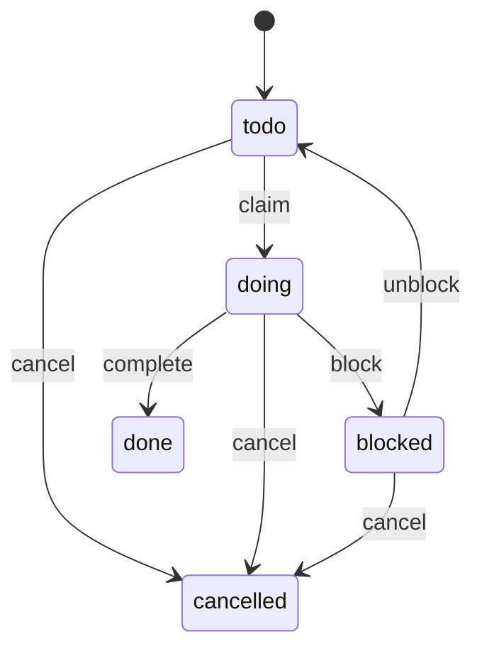

# specdojoコマンド利用ガイド

本ドキュメントでは、SpecDojo における **Gitベースのプロジェクト実行管理ツール `specdojo` CLI** の利用方法を説明します。

`specdojo` は以下を Git リポジトリ内で管理することを目的としています。

- スケジュール定義（`sch-*.yaml`）
- 実行イベント（`exec/events/*.json`）
- 実行状態・CPM等の生成物（`generated/`）

## 1. 概要

`specdojo` は以下の機能を提供します。

- スケジュール定義の検証
- 実行イベントの記録
- 実行状態の生成
- Readyタスク抽出
- CPM（Critical Path Method）計算
- クリティカルパス算出
- スケジュール差分検出
- Agent安全実行（排他ロック）
- 成果物カタログの scaffold・検証・Markdown 生成

## 2. ディレクトリ構成

例:

```text
repo-root/
├─ specdojo.config.json
├─ .env
├─ docs/
│  ├─ specdojo/
│  │  └─ schemas/
│  └─ ja/
│     ├─ specdojo/
│     │  └─ templates/
│     │     ├─ dct-project-definition.yaml
│     │     ├─ dct-project-management.yaml
│     │     └─ pm-review-viewpoints.yaml
│     └─ projects/
│        └─ prj-0001/
│           ├─ 010-deliverables-catalog/
│           │  ├─ dct-project-definition.yaml
│           │  ├─ dct-project-management.yaml
│           │  └─ generated/
│           │     ├─ dct-project-definition.md
│           │     └─ dct-project-management.md
│           ├─ 030-project-management/
│           │  └─ controls/
│           │     └─ reviews/
│           │        ├─ plans/
│           │        └─ results/
│           ├─ 060-schedule/
│           │  ├─ sch-milestones.yaml
│           │  └─ sch-track-launch.yaml
│           └─ 070-execution/
│              ├─ exec/
│              │  ├─ events/
│              │  └─ .locks/
│              └─ generated/
└─ tools/
```

## 3. 設定

### 3.1. `specdojo.config.json`

複数プロジェクトを扱うための **プロジェクトレジストリ**です。

例:

```json
{
  "version": 1,
  "projects": {
    "shj-0001": {
      "catalog_path": "docs/ja/projects/prj-0001/010-deliverables-catalog",
      "schedule_path": "docs/ja/projects/prj-0001/060-schedule",
      "execution_path": "docs/ja/projects/prj-0001/070-execution",
      "members_path": "docs/ja/projects/prj-0001/030-project-management/010-management-plan/pm-members.yaml"
    }
  }
}
```

`projects.<id>` には `schedule_path`、`execution_path`、必要に応じて `members_path` を指定します。

### 3.2. `.env`（任意）

ローカル開発者用の簡易設定です。

```bash
SPECDOJO_PROJECT=shj-0001
```

または

```bash
SPECDOJO_SCHEDULE_PATH=docs/ja/projects/prj-0001/060-schedule
SPECDOJO_EXECUTION_PATH=docs/ja/projects/prj-0001/070-execution
```

### 3.3. プロジェクトパス解決順序

`specdojo` は schedule path と execution path を同じ入力元から解決します。

1. `--project` で指定したプロジェクト ID を `specdojo.config.json` から解決
2. `SPECDOJO_SCHEDULE_PATH` と `SPECDOJO_EXECUTION_PATH` をセットで解決
3. `SPECDOJO_PROJECT` で指定したプロジェクト ID を `specdojo.config.json` から解決

- `--project` を使う場合は、`specdojo.config.json` の `projects.<id>.schedule_path` と `projects.<id>.execution_path` を使います。
- `SPECDOJO_PROJECT` を使う場合も、`specdojo.config.json` に定義済みのプロジェクト ID から両方を解決します。
- 直接環境変数で指定する場合は、`SPECDOJO_SCHEDULE_PATH` と `SPECDOJO_EXECUTION_PATH` を両方指定します。

## 4. スケジュールファイル

スケジュールは YAML で管理します。

```bash
sch-milestones.yaml
sch-auth.yaml
sch-auth-api.yaml
```

内容例:

```yaml
tasks:
  - id: T-AUTH-API-020
    name: implement login api
    duration_days: 2
    depends_on:
      - T-AUTH-API-010
```

## 5. 実行イベント

作業履歴は **append-only JSONイベント**として保存されます。

保存場所:

```bash
exec/events/
```

例:

```json
{
  "v": 1,
  "ts": "2026-03-05T03:10:00Z",
  "type": "claim",
  "task_id": "T-AUTH-API-020",
  "by": "agent-1",
  "msg": "start implementation"
}
```

## 6. 生成ファイル

`specdojo exec build` により以下が生成されます。

```bash
generated/
├─ exec.jsonl
├─ state.json
├─ ready.md
├─ ready.json
├─ claim-next.json
├─ cpm.json
├─ cpm.md
├─ critical-path.md
├─ schedule-hash.json
├─ schedule-diff.md
└─ metadata.json
```

## 7. 初期セットアップ

`npm link` は使いません。

このリポジトリでは `npm install` 後に root package の `src/` がビルドされ、VS Code 統合ターミナルでは `node_modules/.bin` が `PATH` に追加されます。新しいターミナルを開けば、以降は `npx` なしで `specdojo` を直接実行できます。

```bash
npm install
specdojo config init
```

VS Code 統合ターミナル以外では `PATH` が通らないため、必要に応じて以下を使ってください。

```bash
./node_modules/.bin/specdojo config init
```

### 7.1. config作成

```bash
specdojo config init
```

### 7.2. プロジェクト一覧

```bash
specdojo project list
```

## 8. パス確認

```bash
specdojo exec where --project shj-0001
```

出力例:

```bash
schedule-path: /repo/.../060-schedule
execution-path: /repo/.../070-execution
exec/events : .../070-execution/exec/events
generated   : .../070-execution/generated
scheduler-lock: .../070-execution/exec/.locks/scheduler.lock
```

## 9. 検証

```bash
specdojo exec validate --project shj-0001
```

検証内容:

- スケジュール依存関係
- 循環依存
- イベントJSON構造
- task_id存在チェック

## 10. 生成

```bash
specdojo exec build --project shj-0001
```

生成:

- state snapshot
- ready list
- ordered ready queue JSON
- next claim target JSON
- CPM
- schedule diff

`ready.md` は人間向けの ready 一覧で、`critical-first` の順序と `fifo` の順序を併記します。

`ready.json` は機械向けの ready キューで、strategy ごとの順序付き task ID と CPM 情報を持ちます。

`claim-next.json` は strategy ごとの次の claim 対象を持ちます。

## 11. 実行イベントコマンド

### 11.1. claim

```bash
specdojo exec claim \
  --project shj-0001 \
  --task T-AUTH-API-020 \
  --by agent-1 \
  --msg "start implementation"
```

### 11.2. complete

```bash
specdojo exec complete \
  --project shj-0001 \
  --task T-AUTH-API-020 \
  --by agent-1 \
  --msg "done"
```

### 11.3. block

```bash
specdojo exec block \
  --project shj-0001 \
  --task T-AUTH-API-020 \
  --by agent-1 \
  --msg "waiting for spec"
```

### 11.4. unblock

```bash
specdojo exec unblock \
  --project shj-0001 \
  --task T-AUTH-API-020 \
  --by agent-2 \
  --msg "spec clarified"
```

### 11.5. cancel

```bash
specdojo exec cancel \
  --project shj-0001 \
  --task T-AUTH-API-020 \
  --by agent-1 \
  --msg "scope removed"
```

## 12. scheduler

自動タスク取得:

```bash
specdojo exec scheduler --project shj-0001 --by agent-1
```

`specdojo exec scheduler` は `critical-first` または `fifo` の戦略で `ready.json` / `claim-next.json` と同じ順序規則を使って claim 対象を選びます。

Dry-run:

```bash
specdojo exec scheduler --dry-run
```

## 13. ロック

以下コマンドは **プロジェクトロック**を使用します。

- `claim`
- `complete`
- `block`
- `unblock`
- `cancel`
- `scheduler`

ロック位置:

```bash
exec/.locks/scheduler.lock
```

## 14. 状態遷移

状態:

```bash
todo
doing
blocked
done
cancelled
```

### 14.1. 状態遷移表

| current | command  | next      | guard       |
| ------- | -------- | --------- | ----------- |
| todo    | claim    | doing     | 依存完了    |
| doing   | block    | blocked   | 同一actor   |
| blocked | unblock  | todo      | blockedのみ |
| doing   | complete | done      | 同一actor   |
| todo    | cancel   | cancelled | 可          |
| doing   | cancel   | cancelled | 同一actor   |
| blocked | cancel   | cancelled | 可          |

### 14.2. 遷移図



## 15. 推奨ワークフロー

```bash
specdojo exec validate
specdojo exec build
specdojo exec scheduler --by agent-1
specdojo exec complete ...
specdojo exec build
```

## 16. lefthook例

```yaml
pre-commit:
  commands:
    validate:
      run: ./node_modules/.bin/specdojo exec validate --project shj-0001

pre-push:
  commands:
    build:
      run: ./node_modules/.bin/specdojo exec build --project shj-0001
```

## 17. Agent利用ガイド

推奨利用方法:

- schedulerで取得
- claimで開始
- completeで終了
- blockで停止

actor例:

```bash
agent-backend
agent-docs
agent-test
```

## 18. catalog コマンド

`specdojo catalog` は成果物カタログ（`dct-<domain>.yaml`）の scaffold・検証・Markdown 生成を行うコマンド群です。

- scaffold（`scaffold`）: テンプレートから `dct-*.yaml` を生成
- 検証（`validate`）: `dct-*.yaml` の整合性確認
- Markdown 生成（`build`）: `generated/dct-*.md` を出力

## 19. catalog パス確認

```bash
specdojo catalog where --project shj-0001
```

出力例:

```text
catalog-path: /repo/.../010-deliverables-catalog
generated   : /repo/.../010-deliverables-catalog/generated
```

## 20. catalog 検証

```bash
specdojo catalog validate --project shj-0001
```

検証内容:

- JSON Schema 検証（`dct.schema.yaml`）
- `local_id` の一意性確認
- `depends_on` 参照先の存在確認
- `kind: work` の必須フィールド確認（`path`、`done_criteria`）

## 21. catalog 生成

```bash
specdojo catalog build --project shj-0001
```

生成:

```text
generated/
├─ dct-project-definition.md
├─ dct-project-management.md
└─ ...（dct-*.yaml ごとに 1 ファイル）
```

`dct-<domain>.md` は対応する `dct-<domain>.yaml` の `groups` 構造に従い、成果物一覧を章立てで出力します。

## 22. catalog scaffold

`catalog_path` に `dct-*.yaml` を新規生成します。`docs/ja/specdojo/templates/` のテンプレートをもとに、プロジェクト規模に応じた成果物セットを出力します。

```bash
specdojo catalog scaffold --project shj-0001 --size medium
```

オプション:

| オプション | 説明 | デフォルト |
| --- | --- | --- |
| `--size` | `small` / `medium` / `large` | `medium` |
| `--project-id` | 生成ファイルに埋め込む project_id（省略時は `catalog_path` から自動導出） | 自動導出 |
| `--force` | 既存ファイルを上書き | `false` |

サイズ別の収録成果物:

| 成果物 | small | medium | large |
| --- | :---: | :---: | :---: |
| プロジェクト概要・スコープ・成功基準 | ○ | ○ | ○ |
| 管理計画・組織定義・メンバー定義 | ○ | ○ | ○ |
| マイルストーン定義 | ○ | ○ | ○ |
| ステークホルダー・憲章・前提制約・課題・代替案比較 | - | ○ | ○ |
| コミュニケーション計画・品質管理計画・ロール定義 | - | ○ | ○ |
| 管理台帳・フルスケジュール・レポート | - | ○ | ○ |
| RACI | - | - | ○ |

既存ファイルはデフォルトでスキップされます（`--force` で上書き可能）。

## 23. schedule コマンド

`specdojo schedule` は、`sch-strategy-<track>.yaml` と成果物カタログから `sch-track-<track>.yaml` を生成するコマンド群です。

### 23.1. schedule generate

成果物カタログ（`dct-*.yaml`）と `sch-strategy-<track>.yaml` を入力として、`sch-track-<track>.yaml` を生成します。

```bash
specdojo schedule generate --project prj-0001 --track launch
```

オプション:

| オプション | 説明 | デフォルト |
| --- | --- | --- |
| `--project` | プロジェクト ID（`specdojo.config.json` から解決） | 必須 |
| `--track` | 生成対象のトラック名（`sch-strategy-<track>.yaml` の `track` フィールドと一致） | 必須 |
| `--force` | 既存の `sch-track-<track>.yaml` を上書き | `false` |
| `--dry-run` | ファイルを書き出さず、生成内容を標準出力に表示 | `false` |

#### 23.1.1. 生成フロー

1. `schedule_path` から `sch-strategy-<track>.yaml` を読み込む。
2. `scope.catalogs` に列挙されたカタログファイルを読み込み、`include_kinds` でフィルタリングする。
3. カタログの `depends_on` と `cross_domain_dependencies` から成果物の展開順序を決定する。
4. 成果物ごとに `path` 拡張子を判定し、対応する `phases` フェーズセットを適用する。
5. `owner_rules` から `owner` ロールを決定する。
6. `task_id_pattern` でタスク ID を採番し、タスクを生成する。
7. `sch-track-<track>.yaml`（`kind: track`）として `schedule_path` に出力する。

#### 23.1.2. タスク生成ルール

各 `kind: work` 成果物に対してフェーズごとのタスクを生成する。

| フェーズ（例: markdown） | タスク ID | `depends_on` |
| --- | --- | --- |
| draft（010） | `T-LAUNCH-PJD-OVERVIEW-010` | 依存成果物の finalize タスク ID |
| review（020） | `T-LAUNCH-PJD-OVERVIEW-020` | draft タスク ID |
| finalize（030） | `T-LAUNCH-PJD-OVERVIEW-030` | review タスク ID |

yaml フォーマットの成果物には validate フェーズ（020）が draft と review の間に挿入される。

| フェーズ（yaml） | タスク ID | `depends_on` |
| --- | --- | --- |
| draft（010） | `T-LAUNCH-PJM-ROLE-010` | 依存成果物の finalize タスク ID |
| validate（020） | `T-LAUNCH-PJM-ROLE-020` | draft タスク ID |
| review（030） | `T-LAUNCH-PJM-ROLE-030` | validate タスク ID |
| finalize（040） | `T-LAUNCH-PJM-ROLE-040` | review タスク ID |

#### 23.1.3. 出力例（抜粋）

```yaml
kind: track
version: 1
project_id: prj-0001
track: launch
settings: {}
tasks:
  - id: T-LAUNCH-PJD-OVERVIEW-010
    name: prj-overview たたき台を作成する
    duration_days: 0.25
    depends_on: []
    owner: BA

  - id: T-LAUNCH-PJD-OVERVIEW-020
    name: prj-overview をレビューする
    duration_days: 0.125
    depends_on: [T-LAUNCH-PJD-OVERVIEW-010]
    owner: BA

  - id: T-LAUNCH-PJD-OVERVIEW-030
    name: prj-overview 完成版を仕上げる
    duration_days: 0.125
    depends_on: [T-LAUNCH-PJD-OVERVIEW-020]
    owner: BA

  - id: T-LAUNCH-PJM-ORG-010
    name: pm-organization たたき台を作成する
    duration_days: 0.25
    depends_on: [T-LAUNCH-PJD-OVERVIEW-030]  # cross_domain_dependencies による依存
    owner: PO
```

レビュー担当ロールは成果物カタログの `done_criteria` から読み取り、生成後の `sch-track-<track>.yaml` を人間が編集して `notes` に記録することを推奨する。

### 23.2. schedule where

スケジュールパスを確認する。

```bash
specdojo schedule where --project prj-0001
```

出力例:

```text
schedule-path: /repo/.../030-project-management/schedule
strategy-files:
  - sch-strategy-launch.yaml
track-files:
  - sch-track-launch.yaml (generated)
```

## 24. review コマンド

`specdojo review` は、成果物カタログの `done_criteria` と観点定義から review plan を生成するコマンド群です。

- scaffold（`scaffold`）: テンプレートから `pm-review-viewpoints.yaml` を生成
- plan 生成（`plan`）: `dct-*.yaml` の `done_criteria` から `rvp-*.yaml` を生成
- パス確認（`where`）: review 関連パスを確認

`specdojo.config.json` に `reviews_path` と `viewpoints_path` を追加する。

```json
{
  "projects": {
    "prj-0001": {
      "catalog_path": "docs/ja/projects/prj-0001/010-deliverables-catalog",
      "schedule_path": "docs/ja/projects/prj-0001/030-project-management/schedule",
      "reviews_path": "docs/ja/projects/prj-0001/030-project-management/controls/reviews",
      "viewpoints_path": "docs/ja/projects/prj-0001/030-project-management/010-management-plan/pm-review-viewpoints.yaml"
    }
  }
}
```

### 24.1. review scaffold

`viewpoints_path` に `pm-review-viewpoints.yaml` を新規生成する。`docs/ja/specdojo/templates/pm-review-viewpoints-template.yaml` をもとに `project_id` を置換して出力する。

```bash
specdojo review scaffold --project prj-0001
```

オプション:

| オプション | 説明 | デフォルト |
| --- | --- | --- |
| `--project` | プロジェクト ID（`specdojo.config.json` から解決） | 必須 |
| `--force` | 既存の `pm-review-viewpoints.yaml` を上書き | `false` |

既存ファイルはデフォルトでスキップされます（`--force` で上書き可能）。

### 24.2. review plan

成果物カタログの `done_criteria[].roles` と `done_criteria[].viewpoint` を読み込み、`rvp-<local_id>-<stage>.yaml` を生成する。

```bash
specdojo review plan \
  --project prj-0001 \
  --local-id prj-overview \
  --stage draft
```

オプション:

| オプション | 説明 | デフォルト |
| --- | --- | --- |
| `--project` | プロジェクト ID（`specdojo.config.json` から解決） | 必須 |
| `--local-id` | 対象成果物の `local_id` | 必須 |
| `--stage` | レビュー段階（`draft` / `first` / `final` / `ready-candidate`） | 必須 |
| `--role` | 対象 Role code に絞り込む（省略時は全ロール） | 省略可 |
| `--force` | 既存の `rvp-*.yaml` を上書き | `false` |
| `--dry-run` | ファイルを書き出さず、生成内容を標準出力に表示 | `false` |

#### 24.2.1. 生成フロー

1. `scope.catalogs` に列挙されたカタログから `--local-id` に一致する成果物を検索する。
2. `done_criteria` を `--role` でフィルタリングする（省略時は全項目）。
3. 各 `done_criteria` 項目の `viewpoint` を `pm-review-viewpoints.yaml` で照合し、`coverage_types` を取得する。
4. 成果物の `rulebook` フィールド（ID）から `docs/ja/specdojo/rulebooks/<id>.md` へパスを解決する（フィールドがない場合は `none`）。
5. `review_items` を生成し、`reviews_path/plans/rvp-<local_id>-<stage>.yaml` に出力する。

#### 24.2.2. 出力例

```yaml
id: rvp-prj-overview-draft
project_id: prj-0001
target:
  local_id: prj-overview
  path: /docs/ja/projects/prj-0001/020-project-definition/prj-overview.md
  stage: draft
  version_ref: none
inputs:
  deliverable_catalog: /docs/ja/projects/prj-0001/010-deliverables-catalog/dct-project-definition.yaml
  rulebook: prj-overview-rulebook
  viewpoints: /docs/ja/projects/prj-0001/030-project-management/010-management-plan/pm-review-viewpoints.yaml
  related_documents: []
machine_checks_required:
  - name: lint:md
    required: true
  - name: schema
    required: false
review_items:
  - id: RVP-001
    role: BA
    viewpoint_id: vp-ba-business-value
    done_criterion: プロジェクトの目的・背景・ゴールが業務観点で確認できる粒度で記述されていること
    coverage_required:
      - stakeholder
      - business_goal
      - use_case
      - business_event
      - traceability
    evidence_required:
      - target_document
      - deliverable_catalog
    expected_output:
      - result
      - evidence
      - findings
      - unverified_scope
  - id: RVP-002
    role: PO
    viewpoint_id: vp-po-purpose-alignment
    done_criterion: プロジェクトの目的・スコープを承認できる情報が含まれていること
    coverage_required:
      - business_goal
      - scope_boundary
      - traceability
    evidence_required:
      - target_document
      - deliverable_catalog
    expected_output:
      - result
      - evidence
      - findings
      - unverified_scope
```

### 24.3. review where

review 関連パスを確認する。

```bash
specdojo review where --project prj-0001
```

出力例:

```text
reviews-path: /repo/.../030-project-management/controls/reviews
plans       : /repo/.../controls/reviews/plans
results     : /repo/.../controls/reviews/results
viewpoints  : /repo/.../010-management-plan/pm-review-viewpoints.yaml
```

## 25. まとめ

`specdojo` は以下を実現します。

- Gitネイティブなプロジェクト管理
- append-only実行ログ
- deterministic生成物
- safe multi-agent execution
- CPM / Critical Path計算
- schedule diff検出
- AI Agent向けタスク取得
- 成果物カタログ scaffold・検証・Markdown 生成（`catalog scaffold/validate/build`）
- スケジュールトラック生成（`schedule generate`）
- レビュー plan 生成（`review plan`）
