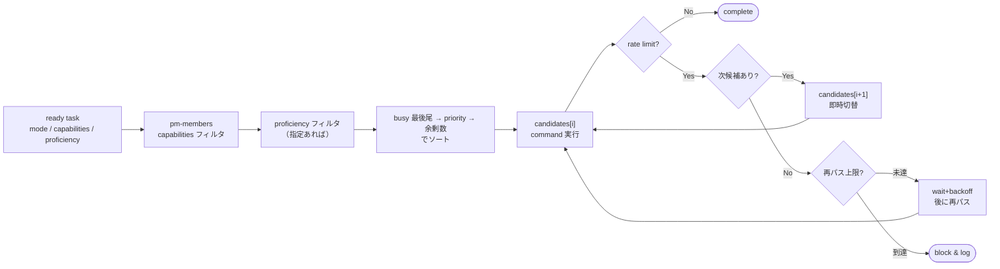

---
specdojo:
  id: specdojo-exec-config-guide
  type: guide
  status: draft
---

# 実行設定ガイド

Exec Configuration Guide

SpecDojo のエージェント実行は、`sch-strategy-<track>.yaml` の phase に作業要件を定義し、`pm-members.yaml` のエージェント定義から実行者を選択する。レートリミットなどの共通実行ポリシーは `exec-defaults.yaml` に分離する。

## 1. 設定ファイルの分担

| ファイル                       | 役割                                                                                     | 粒度         |
| ------------------------------ | ---------------------------------------------------------------------------------------- | ------------ |
| `sch-strategy-<track>.yaml`    | phase ごとの `mode`・`approach`・`capabilities`・`proficiency`                           | トラック     |
| `pm-members.yaml`              | 誰が作業するか（identity・capabilities・proficiency・priority）                          | プロジェクト |
| `.specdojo/exec-defaults.yaml` | provider 別起動コマンドテンプレート・rate limit 検出条件・リトライポリシー・同時実行上限 | システム     |

`sch-strategy` は agent 個体を指定しない。phase に「どんな能力が必要か」を書き、`pm-members.yaml` に「誰がその能力を持つか」を書く。

## 2. phase の実行要件

`execution: agent` の phase には、必要に応じて `mode`・`capabilities`・`proficiency` を直接定義する。`mode` は plan/result の種別であり、agent の能力ではない。

```yaml
phase_sets:
  first-pass:
    - id: enrich
      name: 調査・補強
      execution: agent
      task_suffix: "020"
      mode: edit
      proficiency: normal

  research-first-pass:
    - id: enrich
      name: 調査・深掘り
      execution: agent
      task_suffix: "020"
      mode: edit
      capabilities: [web_search]
      proficiency: expert

  review-pass:
    - id: review
      name: レビュー
      execution: human
      task_suffix: "030"
      mode: review
```

| フィールド     | 必須 | 説明                                                                                                                                                        |
| -------------- | ---- | ----------------------------------------------------------------------------------------------------------------------------------------------------------- |
| `execution`    | 任意 | `agent` または `human`。省略時は `agent`                                                                                                                    |
| `mode`         | 任意 | `edit` または `review`。省略時は `edit`                                                                                                                     |
| `approach`     | 任意 | `fully-guided` / `recipe-guided` / `freeform` / `bootstrap` / `rulebook-maintenance` / `recipe-maintenance` / `sample-maintenance` / `template-maintenance` |
| `capabilities` | 任意 | 必要なツールリスト。ツール不要の場合は省略                                                                                                                  |
| `proficiency`  | 任意 | 必要な品質水準。省略すると全水準が候補                                                                                                                      |

## 3. エージェントの定義

`pm-members.yaml` の `type: agent` メンバーには `provider`・`capabilities`・`proficiency`・`priority` を定義する。起動コマンドは member には書かず、`.specdojo/exec-defaults.yaml` の `providers.<provider>.command_template` を member 属性（`{nickname}`・`{mode}`・`{proficiency}` と `command_params` の変数）で展開して解決する。member の `command` はテンプレートで表現できない特殊構成向けの上書きとしてのみ使う。

```yaml
members:
  - nickname: edit-agent
    display_name: Edit Agent
    email: null
    roles: []
    type: agent
    provider: opencode
    capabilities: []
    proficiency: normal
    priority: 10

  - nickname: expert-web-agent
    display_name: Expert Web Agent
    email: null
    roles: []
    type: agent
    provider: opencode
    capabilities: [web_search]
    proficiency: expert
    priority: 10
```

`exec run --auto` は phase の `capabilities` をすべて持つ agent を候補にする。`proficiency` が指定されている場合は一致する agent のみを候補にし、未指定の場合は全水準を候補に含める。候補のソートキーは次の順に評価する。

1. busy 状態（イベントログ上で `doing` のタスクを担当中の agent）を最後尾に置く。`--parallel` 実行で同じ最上位 agent に集中して rate limit に陥るのを避けるため。
2. `priority` 昇順（同値なら次へ）。
3. 余剰 capabilities 数の少ない順。

ソート後、`exec-defaults.yaml` の `providers.<provider>.max_concurrency` が設定された provider について、同一ラウンドで既に上限数の agent を確保済みであれば、その provider の候補を除外する。別 provider の候補が残ればそれを実行者に繰り上げる。すべての候補の provider が上限に達している場合は、claim も worktree 生成も行わずにそのタスクを次ラウンドへ繰り延べる（タスクは `todo` のまま保持され、取りこぼさない）。`--loop` 実行では、この繰り延べにより上限付き provider が自然に直列化される。`max_concurrency` はグローバルな `--parallel` を下げないため、他 provider は並列実行を維持する。`max_concurrency` は auto 選択のみに適用し、`--agent-cmd` / `--edit-agent` / `--review-agent` などの明示指定や resume 実行には適用しない。

## 4. 実行フロー

rate limit を検知したら、まず待機なしで次の優先順 agent に切り替えて再実行する（次候補は別アカウント/プロバイダ想定）。全候補が rate limit の場合のみ `rate_limit_policy.on_critical.retry` の wait+backoff で再パスを行い、`max_attempts` 回（初回パスを 1 回目として数える）まで繰り返す。この再試行は critical / non-critical を問わず全タスクに適用する。



## 5. exec-defaults

`.specdojo/exec-defaults.yaml` には、全トラック共通の実行ポリシーを定義する。

```yaml
rate_limit_detection:
  exit_codes: [1]
  stderr_patterns:
    - "rate limit"
    - "429"

rate_limit_policy:
  on_non_critical:
    action: skip
  on_critical:
    action: try_next
    retry:
      max_attempts: 3
      initial_wait_seconds: 60
      backoff_multiplier: 3
      max_wait_seconds: 600
    on_exhausted: block
```

provider ごとに挙動が異なる設定は `providers.<provider>` に置く。各キーは対応するグローバル値を完全に置き換え、未指定のキーはグローバル値にフォールバックする。`<provider>` は `pm-members[].provider` に対応する。指定できるキーは次のとおり。

- `command_template`: その provider の agent を起動するコマンドテンプレート。`{nickname}`・`{mode}`・`{proficiency}` と `command_params` の変数を member 属性で展開する。グローバル既定は持たない。
- `command_params`: テンプレートの追加変数表。`by_mode.<mode>` と `by_proficiency.<proficiency>` に変数名と値の組を置く。
- `rate_limit_detection`: provider 固有の検出シグナル（`stderr_patterns` を優先する）。
- `rate_limit_policy`: provider 固有のリトライ／フォールバック／block ポリシー。
- `max_concurrency`: その provider の agent を 1 ラウンドで同時に走らせる上限（正の整数）。未指定・0 以下・非整数は「上限なし」として扱う。

```yaml
providers:
  claude:
    command_template: "claude -p --verbose --agent {nickname} --settings .specdojo/claude/settings.{mode}.json"

  codex:
    command_template: 'codex exec --ephemeral --sandbox workspace-write --model {model} -c approval_policy="never" -c model_reasoning_effort="{effort}"'
    command_params:
      by_proficiency:
        normal: { model: gpt-5.4-mini, effort: medium }
        expert: { model: gpt-5.5, effort: high }
```

`max_concurrency` は、同一ホストの単一モデルを共有する provider（例: ローカル Ollama の `opencode`）が複数同時起動でメモリ競合・モデルロード待ちにより不安定になるのを防ぐために使う。グローバルな `--parallel` を下げずに、その provider だけを直列化できる。

```yaml
providers:
  opencode:
    # opencode は 1 ラウンドで同時 1 つに制限する（他 provider は --parallel のまま並列）。
    max_concurrency: 1
```

## 6. provider 設定の配布と scaffold

agent が exec 実行時に読み込む provider 固有の設定（agent 定義・permission 設定）は、npm package 内の `templates/<provider>/` を配布原本とし、利用プロジェクトへコピーして使う。worktree 実行はコミット済み内容から worktree を作るため、コピーした設定は必ずコミットする。

配置規則は provider 名から機械的に決まる（`agents/` 配下 → `.<provider>/agents/`、それ以外のファイル → `.specdojo/<provider>/`、`README.md` はコピーしない）。provider ごとの配布内容は次のとおり。

| provider | 配布内容                                                     | 配置先                                 |
| -------- | ------------------------------------------------------------ | -------------------------------------- |
| claude   | `agents/*.md`、`settings.edit.json` / `settings.review.json` | `.claude/agents/`、`.specdojo/claude/` |
| codex    | `agents/*.toml`（親 Codex が spawn する subagent 定義）      | `.codex/agents/`                       |
| opencode | `agents/*.md`（permission frontmatter 込みの agent 定義）    | `.opencode/agents/`                    |
| copilot  | `pm-members-snippet.yaml`（member 定義の参照スニペット）     | `.specdojo/copilot/`                   |

導入手順とテンプレートに含めない手動設定（`opencode.json`、`.codex/config.toml` など）は各 `templates/<provider>/README.md` を参照する。

`.specdojo/exec-defaults.yaml` の `providers.claude.command_template` には `--settings .specdojo/claude/settings.{mode}.json` を指定する。`--permission-mode bypassPermissions` は使わない（`.claude/settings.json` の `disableBypassPermissionsMode: "disable"` で起動自体を拒否する）。

### 6.1. scaffold コマンド

この配置は `exec scaffold` の `--provider <name>` オプションで自動化する。

```sh
specdojo exec scaffold --provider claude
```

挙動は次のとおり。

- `--provider <name>` を指定すると、package 内の `templates/<name>/` を配布原本として上記の配置規則でコピーする。`--provider` を省略した場合は従来どおり `pm-review-viewpoints.yaml` の scaffold を行い、挙動を変えない。
- 配布原本はインストール済み package のルートから解決する。`templates/<name>/` が存在しない provider を指定した場合は、指定可能な provider 一覧を添えてエラーにする。
- 配置先に同名ファイルが存在する場合は上書きせず `Skipped (already exists):` を出力する。`--force` 指定時のみ上書きする。ファイルごとに `Written:` / `Skipped:` を 1 行ずつ出力する（既存の scaffold 系コマンドの出力形式に合わせる）。
- `--dry-run` 指定時は書き込みを行わず、コピー予定のファイル一覧を表示する。
- コピー完了後、次の 2 点を案内メッセージとして出力する。配置ファイルのコミットが必要であること（worktree 実行の前提）、および `.specdojo/exec-defaults.yaml` の `providers.claude.command_template` に `--settings` の指定が必要であること。
- `settings.*.json` の `Edit(...)` / `Write(...)` パスパターンの調整は利用者に委ねる。scaffold は `specdojo.config.json` のパス設定に基づく書き換えを行わない（テンプレートを事実上の推奨レイアウト前提で配布する）。
- 将来 provider を追加する場合は `templates/<provider>/` を追加し、`package.json` の `files` に含める。コマンド側は provider 名からディレクトリを解決するだけで、provider ごとの分岐を持たない。

## 7. agent 権限とプロンプトインジェクション対策

exec の plan は done_criteria と成果物本文から生成され、agent は無人で実行される。成果物やレビュー対象文書に埋め込まれた指示（プロンプトインジェクション）によって、agent がタスク外のファイル書き換え・情報持ち出しを行うリスクを前提に、権限を設計する。

### 7.1. 共通の構造的対策

provider によらず、exec の実行構造そのものが次の境界を提供する。

| 対策                       | 内容                                                                                             |
| -------------------------- | ------------------------------------------------------------------------------------------------ |
| worktree 隔離              | agent はタスク専用 worktree 内で作業し、root の作業ツリーへ直接書き込まない                      |
| git 操作の分離             | `git add` / `commit` / `merge` は specdojo CLI が親プロセスで行い、agent には git 権限を与えない |
| ready 昇格の human-only 化 | 成果物 `status` の `ready` への昇格を commit 時に検出し、agent 実行では block する               |
| commit 対象の除外          | `exec/plans/` `exec/events/` `generated/` 他タスクの `exec/results/` は commit しない            |
| merge の重複ガード         | root 側の未 commit 変更と merge 対象パスが重複する場合は merge しない                            |

### 7.2. provider 別の権限設定

**claude** は `provider 設定の配布と scaffold` のとおり、ロール別 `--settings`（edit は成果物ディレクトリのみ、review は result 配下のみ書き込み可）でパス単位に制限する。`--permission-mode bypassPermissions` は使わず、`.claude/settings.json` の `disableBypassPermissionsMode: "disable"` で起動自体を拒否する。

**codex** はパス単位の permission 機構を持たず、sandbox（`read-only` / `workspace-write` / `danger-full-access`）の粒度で制御する。review でも result の記入が必要なため `read-only` にはできず、edit / review とも `workspace-write` を使う。command には次を明示する。

```yaml
command: 'codex exec --ephemeral --sandbox workspace-write -c approval_policy="never" -c sandbox_workspace_write.network_access=false --model gpt-5.4-mini -c model_reasoning_effort="medium"'
```

- `--sandbox workspace-write`: 書き込みを worktree（cwd 配下）と一時ディレクトリに限定する。`danger-full-access` は claude の bypassPermissions に相当するため使わない。
- `-c sandbox_workspace_write.network_access=false`: sandbox 内からの直接のネットワークアクセスを遮断する。デフォルトでも無効だが、設定変更で意図せず解放されないよう command に固定する。`web_search` はモデル側ツールとして sandbox の外で動作するため、この設定の影響を受けない。
- `--ephemeral`: セッションを永続化せず、実行間の文脈持ち越しを防ぐ。
- `.codex/config.toml` は対話セッション用のデフォルト（`approval_policy = "on-request"` 等）であり、無人実行の権限は command の `-c` 上書きを正とする。claude の `settings.local.json`（対話用）と `--settings`（無人実行用）の分担に対応する。

**opencode** は agent 定義（`.opencode/agents/*.md`）の frontmatter `permission` を正とする。claude の settings と同等以上の粒度（パス単位の `edit`、コマンドパターン単位の `bash`）を持つため、両 agent とも許可リスト方式で定義する。

| agent                 | `edit`                                                   | `bash`                                                               |
| --------------------- | -------------------------------------------------------- | -------------------------------------------------------------------- |
| opencode-edit-agent   | `docs/**` のみ許可                                       | git 読み取り系・`npm run` 系・`specdojo` などの許可リスト。他は deny |
| opencode-review-agent | `docs/ja/projects/**/execution/exec/results/**` のみ許可 | 読み取り系・検証系の許可リスト。他は deny                            |

`bash` を deny 基点の許可リストにするのは、`git add` / `git commit` を含む任意コマンドを塞ぐためで、denylist（`git push` などの列挙）では不十分。ローカル Ollama 前提のため外部送信面はもともと小さいが、`read` の `.env` / `secrets` deny と `external_directory: deny` は維持する。

**copilot**（GitHub Copilot CLI）は command のフラグで権限を制御する。deny は allow より常に優先され、`--allow-all-tools` すら上書きできる。`pm-members.yaml` には copilot member を `disabled: true` で定義済みで、有効化する際も次の command 構成を維持する。

```yaml
command: >-
  copilot -p "$(cat)" --no-color --no-ask-user
  --no-remote --no-remote-export --disable-builtin-mcps
  --allow-tool write
  --allow-tool 'shell(git status)' --allow-tool 'shell(git diff)'
  --allow-tool 'shell(git log)' --allow-tool 'shell(git show)'
  --allow-tool 'shell(npm run)' --allow-tool 'shell(npm test)'
  --allow-tool 'shell(specdojo:*)'
  --deny-tool 'shell(git add)' --deny-tool 'shell(git commit)'
  --deny-tool 'shell(git push)' --deny-tool 'shell(git reset)'
```

- `--allow-all` / `--yolo` / `--allow-all-tools` / `--allow-all-paths` / 環境変数 `COPILOT_ALLOW_ALL` は使わない（claude の bypassPermissions 相当）。
- ファイルアクセスはデフォルトで cwd（= worktree）配下 + 一時ディレクトリに制限される。`--allow-all-paths` を使わないことで codex の `workspace-write` 相当の境界になる。
- `write` はパス単位に絞れない（worktree 全域に書ける）ため、review agent でも `write` を許可して result を記入させ、変更の境界は commit 許可リストで作る。
- shell は `--allow-tool 'shell(...)'` の許可リスト。git / gh は第1サブコマンド単位でマッチするため読み取り系のみ列挙し、`--deny-tool` で `git add` / `git commit` / `git push` を明示 deny する（deny 優先の保険。許可リストの追記で誤って開くことを防ぐ）。
- 外部送信面を閉じる: 組み込み GitHub MCP server は issue / PR 作成などの外部アクションを持つため `--disable-builtin-mcps` で無効化する。セッションの GitHub web / mobile への共有・遠隔操作は `--no-remote --no-remote-export` で無効化する。URL アクセスはデフォルト確認制のため `--allow-url` を追加しない（`web_search` capability を持たせる場合のみ、必要ドメインを個別に allow する）。
- `-p` は引数必須のため、stdin で渡される plan は `-p "$(cat)"` で受ける。`--no-ask-user` で質問ツールを無効化し、無人実行で停止しないようにする。
- shell パターンのマッチ粒度（`shell(npm run)` が `npm run <script>` 全体を許可するか等）は、member 追加時に最初のタスクで permission ログを確認して調整する。

### 7.3. commit 対象の許可リスト

`workspace-write` は worktree 全域に書き込めるため、codex では「review agent が成果物を書き換える」「edit agent が `src/` や `.github/` などタスク外ファイルを書き換える」ことを provider 側で防げない。この経路は specdojo CLI 側で閉じる。commit 対象は mode 別の許可リスト方式とする。

| mode                                        | commit を許可するパス                                                         |
| ------------------------------------------- | ----------------------------------------------------------------------------- |
| review                                      | 対象 task の result のみ                                                      |
| edit                                        | 対象 task の result、plan frontmatter の `targets` から解決した成果物パス     |
| edit（maintenance / bootstrap 系 approach） | 上記に加え、参考資料ディレクトリ（rulebooks / recipes / samples / templates） |

- 許可リスト外の変更は commit 対象に含めず、検出時は `commit-scope:` 警告として対象パスを出力する（worktree 内には残るため、必要なら人間が確認して手動で取り込む）。
- 既存の除外リスト（`exec/plans/` 等）は許可リストの内側でも引き続き適用する。
- mode / approach / `targets` は worktree の **HEAD 側** plan（CLI が checkpoint commit した版）から読む。agent は working tree の plan を書き換えられるが HEAD は書き換えられないため、許可リストの導出は改ざん耐性がある。
- `targets` の doc id は HEAD 側 doc-index でパスへ解決し、未登録の場合（未作成の新規成果物）は catalog（`dct-*.yaml`）が宣言するパスへフォールバックする。どちらでも解決できない id は警告を出し、commit を許可しない。
- HEAD に plan が無い、または frontmatter から task 識別を復元できない場合のみ、従来の除外リスト方式へフォールバックする。CLI 経由の worktree は必ず plan を checkpoint するため、この分岐を agent 側から誘発することはできない。
- この許可リストは specdojo CLI が行う commit にのみ効くため、**agent 自身に `git commit` を許可しないこと**が全 provider 共通の前提になる。agent が exec branch 上に直接 commit すると許可リストを経由せず merge に到達する。claude は settings の allow に `git add` / `git commit` を含めない（`-p` 実行では未許可ツールは自動拒否）、codex は共有 `.git` が worktree 外にあるため sandbox が書き込みを遮断する、opencode は `bash` の許可リストで塞ぐ。
- パス制約を持たない provider（codex / opencode）への本命の対策であると同時に、claude に対しても settings と独立した深層防御として機能する。provider 非依存の specdojo CLI 側実装であり、`pm-members.yaml` の変更を必要としない。

## 8. 変更手順

新しい作業要件を追加する場合は、まず `sch-strategy-<track>.yaml` の phase に `capabilities` / `proficiency` を追加する。必要な能力を持つ agent が `pm-members.yaml` に存在しない場合だけ、新しい agent を追加する。

`approach: rulebook-maintenance` のような進め方の違いも phase に直接定義する。参考資料メンテナンスを通常成果物作業に暗黙で混ぜず、必要な phase として明示する。
